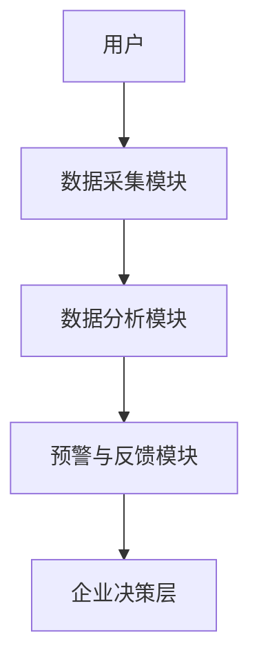

                 


# AI驱动的企业财务报表质量动态监控与预警系统

## 关键词：
- AI技术、企业财务报表、质量监控、动态预警系统、机器学习算法、财务数据分析

## 摘要：
本文深入探讨了利用AI技术对企业财务报表质量进行动态监控与预警的系统设计与实现。通过结合机器学习算法与财务数据分析，构建了一个智能化的财务报表监控系统，能够实时分析财务数据，识别潜在风险，并发出预警信号，从而帮助企业提升财务管理效率和决策能力。文章从系统背景、核心概念、算法原理、系统架构到项目实战，全面阐述了该系统的构建过程和实际应用价值。

---

# 第一部分: 背景与概念

## 第1章: 企业财务报表质量监控的背景与需求

### 1.1 企业财务报表质量的重要性
#### 1.1.1 财务报表在企业经营中的核心地位
企业财务报表是反映企业财务状况、经营成果和现金流量的核心文件，是投资者、债权人、监管机构等利益相关方评估企业信用状况、投资价值和经营能力的重要依据。

#### 1.1.2 财务报表质量问题对企业的影响
- 财务报表数据失真可能导致企业决策失误，影响企业发展。
- 财务造假事件频发，对企业声誉和法律风险造成严重威胁。
- 传统财务报表审核依赖人工，效率低下，难以满足实时监控的需求。

#### 1.1.3 传统财务报表质量监控的局限性
- 人工审核耗时长、效率低，难以覆盖海量数据。
- 人工审核易受主观因素影响，存在遗漏和误判的风险。
- 传统方法难以捕捉财务数据中的潜在关联和隐含风险。

### 1.2 AI技术在财务报表监控中的应用潜力
#### 1.2.1 AI技术的基本概念与优势
人工智能（AI）技术通过模拟人类学习和推理能力，能够在海量数据中发现规律和异常，具有高效性、准确性、实时性的特点。

#### 1.2.2 AI在财务数据分析中的独特价值
- 自动化处理海量财务数据，提高数据处理效率。
- 利用机器学习算法识别数据中的潜在关联和异常模式。
- 实时监控财务数据，提供动态预警。

#### 1.2.3 AI驱动财务报表质量监控的创新点
- 基于机器学习的智能分析，能够发现传统方法难以察觉的异常。
- 实时动态监控，提供实时预警，帮助企业快速应对潜在风险。
- 通过深度学习技术，能够不断优化模型，提升监控精度。

### 1.3 本章小结
本章从企业财务报表的重要性出发，分析了传统财务报表质量监控的局限性，介绍了AI技术在财务报表监控中的应用潜力和创新价值，为后续章节的展开奠定了基础。

---

## 第2章: AI驱动的财务报表质量动态监控与预警系统的核心概念

### 2.1 系统核心概念的定义
#### 2.1.1 财务报表质量的定义与评价标准
- 财务报表质量是指财务报表数据的准确性、完整性和合规性。
- 评价标准包括数据的逻辑性、合理性、一致性等。

#### 2.1.2 动态监控的概念与实现方式
- 动态监控是指对财务数据进行实时或定期的分析和评估，发现潜在问题。
- 实现方式包括数据采集、特征提取、模型训练和实时预警。

#### 2.1.3 预警系统的功能与作用
- 预警系统通过分析财务数据，识别异常情况并发出预警信号。
- 预警系统能够帮助企业在潜在问题爆发前采取措施，降低风险。

### 2.2 核心概念之间的关系
#### 2.2.1 财务数据流与监控系统的关系
- 财务数据流是监控系统的输入，监控系统通过分析数据流发现异常。
- 监控系统的输出是预警信号，指导企业进行调整和优化。

#### 2.2.2 AI算法与财务报表分析的结合
- AI算法通过对财务数据的特征提取和模式识别，实现对财务报表的智能分析。
- 财务报表分析为AI算法提供数据支持，帮助模型不断优化。

#### 2.2.3 预警机制与企业决策的关联
- 预警机制是企业决策的重要参考，能够帮助企业及时发现和处理问题。
- 企业决策通过调整经营策略，影响财务数据，进而影响预警机制的运行。

### 2.3 系统的核心要素与组成
#### 2.3.1 数据采集模块
- 负责采集企业的财务数据，包括收入、支出、利润等关键指标。
- 数据采集需要确保数据的完整性和准确性。

#### 2.3.2 数据分析模块
- 对采集到的财务数据进行预处理、特征提取和模型训练。
- 数据分析模块是系统的核心，负责识别数据中的异常和潜在风险。

#### 2.3.3 预警与反馈模块
- 根据数据分析模块的结果，发出预警信号。
- 反馈模块将预警信号传递给企业相关部门，指导后续操作。

### 2.4 本章小结
本章详细定义了AI驱动的财务报表质量动态监控与预警系统的核心概念，分析了各部分之间的关系，并介绍了系统的组成和功能，为后续章节的系统设计奠定了基础。

---

# 第二部分: 算法原理

## 第3章: 机器学习在财务报表分析中的应用

### 3.1 机器学习的基本原理
#### 3.1.1 监督学习与无监督学习的对比
- 监督学习：基于有标签的数据进行学习，适用于分类和回归问题。
- 无监督学习：基于无标签的数据进行学习，适用于聚类和异常检测。

#### 3.1.2 算法选择与数据特征提取
- 数据特征提取是机器学习的关键步骤，需要选择能够反映财务报表质量的关键特征。
- 常见特征包括收入增长率、毛利率、净利率等。

#### 3.1.3 模型训练与评估指标
- 模型训练需要选择合适的算法和参数，确保模型具有良好的泛化能力。
- 评估指标包括准确率、召回率、F1值等。

### 3.2 常见机器学习算法在财务分析中的应用
#### 3.2.1 线性回归模型
- 线性回归适用于预测连续型变量，如预测企业的收入增长率。
- 模型公式：$y = \beta_0 + \beta_1x + \epsilon$

#### 3.2.2 支持向量机（SVM）
- SVM适用于分类问题，可用于识别财务报表中的异常交易。
- 核心思想：在特征空间中找到一个超平面，将数据分为两类。

#### 3.2.3 随机森林与梯度提升树（GBDT）
- 随机森林是一种基于决策树的集成算法，适用于分类和回归问题。
- GBDT是一种基于树的提升算法，适用于复杂数据的建模。

### 3.3 时间序列分析与异常检测
#### 3.3.1 时间序列数据的预处理
- 数据清洗：去除异常值、填补缺失值。
- 数据变换：对数据进行标准化或归一化处理。

#### 3.3.2 基于ARIMA的异常检测
- ARIMA模型适用于时间序列数据的预测和异常检测。
- 模型公式：$ARIMA(p, d, q)$，其中p为自回归阶数，d为差分阶数，q为移动平均阶数。

#### 3.3.3 基于LSTM的时序预测
- LSTM（长短期记忆网络）适用于处理长序列数据，能够捕捉时间序列中的长期依赖关系。
- LSTM单元结构包括输入门、遗忘门和输出门。

### 3.4 本章小结
本章介绍了机器学习在财务报表分析中的应用，详细讲解了常见算法的基本原理和应用场景，为后续的系统设计提供了算法基础。

---

## 第4章: 算法实现与优化

### 4.1 算法实现的步骤
#### 4.1.1 数据预处理
- 数据清洗：去除重复数据、处理缺失值。
- 数据转换：对数据进行标准化或归一化处理。

#### 4.1.2 特征选择
- 选择能够反映财务报表质量的关键特征。
- 常见特征包括收入、支出、利润、现金流等。

#### 4.1.3 模型训练
- 使用训练数据对模型进行训练，调整模型参数。
- 使用交叉验证评估模型性能。

#### 4.1.4 模型优化
- 使用网格搜索等方法优化模型参数。
- 调整模型结构，提升模型性能。

### 4.2 基于机器学习的财务报表质量预测模型
#### 4.2.1 模型输入
- 输入特征：收入增长率、毛利率、净利率等。
- 输入格式：结构化数据，格式统一，便于处理。

#### 4.2.2 模型输出
- 输出结果：财务报表质量评分（如高、中、低风险）。
- 输出格式：可读性高，便于企业理解和应用。

#### 4.2.3 模型评估
- 评估指标：准确率、召回率、F1值等。
- 评估结果：模型性能达到企业要求，能够满足实时监控需求。

### 4.3 算法优化与调优
#### 4.3.1 参数优化
- 使用网格搜索等方法优化模型参数。
- 调整学习率、正则化参数等，提升模型性能。

#### 4.3.2 模型融合
- 将多个模型的结果进行融合，提升预测精度。
- 常见方法包括投票法和加权法。

#### 4.3.3 模型解释
- 使用特征重要性分析，解释模型的预测结果。
- 通过可视化工具（如SHAP值）展示模型的决策过程。

### 4.4 本章小结
本章详细讲解了机器学习算法在财务报表质量预测中的实现步骤和优化方法，为后续的系统设计提供了技术支持。

---

# 第三部分: 系统设计与实现

## 第5章: 系统分析与架构设计

### 5.1 问题场景介绍
- 企业财务数据量大、类型多样，需要实时监控。
- 传统财务报表审核效率低，难以满足实时需求。
- 企业需要一个智能化的财务监控系统，实时预警潜在风险。

### 5.2 系统功能设计
#### 5.2.1 数据采集模块
- 功能：采集企业的财务数据，包括收入、支出、利润等关键指标。
- 输入：企业财务系统数据接口。
- 输出：结构化数据，便于后续处理。

#### 5.2.2 数据分析模块
- 功能：对采集到的财务数据进行预处理、特征提取和模型训练。
- 输入：结构化数据。
- 输出：财务报表质量评分和预警信号。

#### 5.2.3 预警与反馈模块
- 功能：根据分析结果发出预警信号，并将预警信息传递给相关部门。
- 输入：分析结果。
- 输出：预警信号和反馈信息。

### 5.3 系统架构设计
#### 5.3.1 系统架构图（Mermaid）


#### 5.3.2 系统接口设计
- 数据采集模块接口：接收财务数据，格式为JSON或CSV。
- 数据分析模块接口：接收预处理后的数据，输出分析结果。
- 预警与反馈模块接口：接收分析结果，输出预警信号。

#### 5.3.3 系统交互流程
- 用户提交财务数据，数据采集模块接收数据。
- 数据分析模块对数据进行预处理和模型训练，输出分析结果。
- 预警与反馈模块根据分析结果发出预警信号，反馈给企业决策层。

### 5.4 本章小结
本章从问题场景出发，设计了系统的功能模块和架构，为后续的系统实现提供了蓝图。

---

## 第6章: 项目实战与代码实现

### 6.1 环境安装与配置
- 安装Python和相关库：pandas、numpy、scikit-learn、xgboost、keras等。
- 安装Jupyter Notebook，用于数据处理和模型训练。

### 6.2 系统核心实现
#### 6.2.1 数据采集与预处理
```python
import pandas as pd

# 数据采集
data = pd.read_csv('financial_data.csv')

# 数据清洗
data.dropna(inplace=True)
data = data.drop_duplicates()

# 数据转换
data['收入增长率'] = data['收入'].pct_change()
data = data[数据转换后的特征]
```

#### 6.2.2 模型训练与优化
```python
from sklearn.ensemble import RandomForestClassifier
from sklearn.model_selection import GridSearchCV

# 参数优化
param_grid = {'n_estimators': [100, 200], 'max_depth': [None, 10]}
grid_search = GridSearchCV(RandomForestClassifier(), param_grid, cv=5)
grid_search.fit(X_train, y_train)

# 最优模型
best_model = grid_search.best_estimator_
```

#### 6.2.3 预警系统实现
```python
def 发出预警(风险评分):
    if 风险评分 >= 0.8:
        print("高风险！")
    elif 风险评分 >= 0.5:
        print("中风险！")
    else:
        print("低风险！")
```

### 6.3 代码应用与解读
- 数据采集模块：从企业财务系统中获取数据，清洗和预处理后，提取关键特征。
- 数据分析模块：使用随机森林模型进行分类，预测财务报表质量。
- 预警模块：根据模型输出的风险评分，发出相应的预警信号。

### 6.4 实际案例分析
- 案例背景：某企业财务数据异常，模型识别出潜在的财务造假行为。
- 数据分析：模型预测出高风险评分，预警系统发出预警信号。
- 处理结果：企业及时采取措施，避免了更大的损失。

### 6.5 项目小结
本章通过实际案例，详细讲解了系统的实现过程，验证了系统的有效性和实用性。

---

# 第四部分: 最佳实践与小结

## 第7章: 最佳实践与注意事项

### 7.1 系统实施中的注意事项
- 数据质量：确保数据的完整性和准确性，避免数据偏差。
- 模型选择：根据具体问题选择合适的算法，避免盲目使用复杂模型。
- 模型优化：定期更新模型，确保模型性能随数据变化而优化。

### 7.2 系统维护与优化
- 数据更新：定期更新财务数据，保持模型的实时性。
- 模型再训练：根据新数据重新训练模型，提升预测精度。
- 系统升级：根据企业需求和技术发展，不断优化系统功能。

### 7.3 拓展阅读与深入学习
- 推荐书籍：《机器学习实战》、《深度学习》。
- 推荐博客：Towards Data Science、KDnuggets。
- 推荐课程：Coursera上的《机器学习》课程。

### 7.4 本章小结
本章总结了系统实施中的注意事项和维护优化策略，为企业的实际应用提供了指导。

---

## 作者信息

作者：AI天才研究院/AI Genius Institute & 禅与计算机程序设计艺术 /Zen And The Art of Computer Programming

---

通过以上目录大纲，我们可以看到《AI驱动的企业财务报表质量动态监控与预警系统》涵盖了从理论到实践的各个方面，内容丰富且逻辑清晰。接下来将根据目录大纲逐步展开每一章的内容，详细阐述系统的设计与实现。

