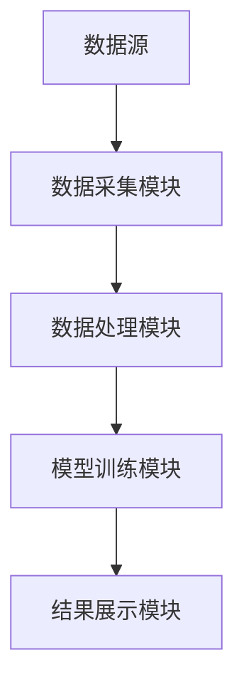
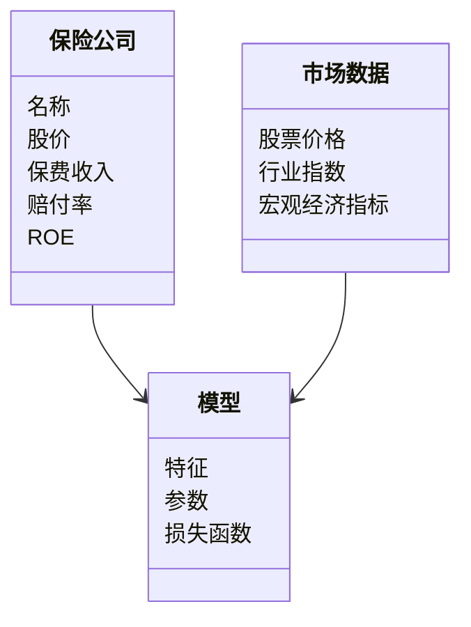
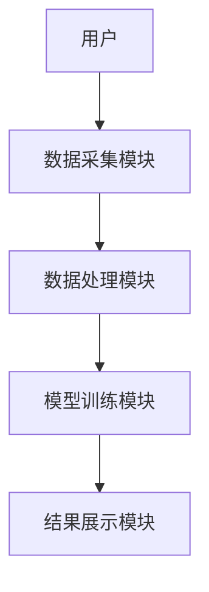
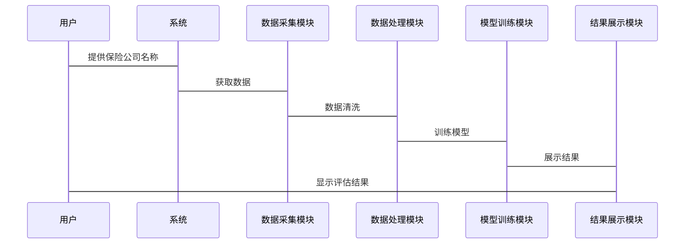

                 


# 价值投资中的AI智能体保险业务价值评估系统

> **关键词**：保险业务价值评估、AI智能体、价值投资、机器学习、风险管理、数据分析

> **摘要**：  
> 在价值投资领域，保险业务的评估需要结合复杂的数据分析和风险控制能力。本文提出了一种基于AI智能体的保险业务价值评估系统，通过机器学习算法和深度数据分析，构建高效的保险业务价值评估模型，帮助投资者做出更科学的投资决策。本文详细探讨了保险业务价值评估的核心概念、AI智能体的应用原理、系统架构设计以及实际案例分析，为价值投资者提供了全新的视角和工具。

---

## 第1章: 保险业务价值评估的背景与现状

### 1.1 保险业务价值评估的背景

#### 1.1.1 保险业务的基本概念
保险是一种风险管理工具，通过分散风险来保障被保险人的利益。保险业务的核心是通过保费收入和赔付支出的匹配，实现保险公司的盈利和风险管理目标。

#### 1.1.2 价值投资在保险业务中的重要性
价值投资是一种长期投资策略，强调以低于内在价值的价格买入优质资产。在保险业务中，价值投资的核心在于识别具有长期增长潜力的保险公司或保险产品，通过深入分析其财务状况、市场地位和风险管理能力，找到被市场低估的投资机会。

#### 1.1.3 保险业务价值评估的现状与挑战
传统保险业务价值评估主要依赖财务指标（如ROE、保费收入增长率）和市场情绪分析。然而，这种方法存在以下挑战：
- 数据维度有限，难以全面反映保险公司的经营状况。
- 风险评估不够精准，难以预测极端情况下的损失。
- 市场波动对保险业务价值的影响难以量化。

### 1.2 AI智能体在保险业务中的应用前景

#### 1.2.1 AI技术在金融领域的应用概述
AI技术在金融领域的应用广泛，包括股票价格预测、风险评估、客户画像构建等。AI智能体通过处理海量数据，能够帮助金融机构更高效地进行决策。

#### 1.2.2 AI智能体在保险业务中的潜在价值
AI智能体可以通过以下方式提升保险业务价值评估的效率和准确性：
- **数据处理能力**：AI能够快速处理大量非结构化数据（如新闻、社交媒体数据）和结构化数据（如财务报表）。
- **模式识别**：通过机器学习算法，AI可以识别传统方法难以察觉的市场趋势和风险因素。
- **实时监控**：AI智能体能够实时跟踪市场变化，及时调整评估模型。

#### 1.2.3 保险业务价值评估中的AI技术需求
为了实现高效的保险业务价值评估，AI智能体需要具备以下能力：
- 数据采集与清洗能力。
- 多维度特征提取能力。
- 高精度预测模型构建能力。
- 实时数据处理能力。

### 1.3 本章小结

- **保险业务价值评估的核心问题**：如何准确评估保险公司的内在价值，识别被低估的投资机会。
- **AI智能体在保险业务中的应用方向**：通过AI技术提升数据处理效率和风险预测能力。
- **本书的研究目标与意义**：构建基于AI智能体的保险业务价值评估系统，为价值投资者提供科学决策工具。

---

## 第2章: 价值投资与保险业务的基本概念

### 2.1 价值投资的定义与核心理念

#### 2.1.1 价值投资的定义
价值投资是一种投资策略，强调以低于内在价值的价格买入优质资产。其核心理念是“买入并持有”，通过长期持有优质资产实现收益。

#### 2.1.2 价值投资的核心理念
- **安全边际**：买入价格低于内在价值，以降低投资风险。
- **长期视角**：关注企业的长期盈利能力，而非短期市场波动。
- **深度分析**：通过对公司财务状况、行业地位和竞争优势的深入分析，识别低估的投资机会。

#### 2.1.3 价值投资与成长投资的区别
- **价值投资**：注重低估值，追求安全边际。
- **成长投资**：注重高增长潜力，愿意为高增长支付溢价。

### 2.2 保险业务的基本概念

#### 2.2.1 保险业务的定义
保险业务是通过签订保险合同，由保险人向被保险人提供风险保障的一种经济活动。

#### 2.2.2 保险业务的主要类型
- **财产保险**：保障被保险人的财产损失。
- **人身保险**：保障被保险人的人身安全，包括寿险和健康险。
- **责任保险**：保障被保险人因过失导致他人损失的风险。

#### 2.2.3 保险业务的价值评估指标
- **保费收入**：衡量保险公司的收入能力。
- **赔付率**：赔付支出与保费收入的比例，反映保险公司的风险管理能力。
- **ROE（净资产收益率）**：衡量保险公司的盈利能力。
- **偿付能力**：保险公司履行赔偿责任的能力。

### 2.3 保险业务价值评估的核心要素

#### 2.3.1 保险公司的财务状况
- 资产状况：包括投资资产、流动资产等。
- 负债状况：包括保费收入、未付赔款等。
- 盈利能力：包括净利润、ROE等。

#### 2.3.2 保险产品的市场竞争力
- 产品定价：是否具有竞争力。
- 产品创新：是否满足市场需求。
- 市场份额：在行业中的地位。

#### 2.3.3 保险公司的风险管理能力
- 内部控制：风险管理流程是否完善。
- 风险分散：是否通过多元化业务分散风险。
- 风险预警：是否能够及时发现和应对风险。

### 2.4 本章小结

- **价值投资与保险业务的结合点**：通过价值投资理念，识别具有长期增长潜力的保险公司。
- **保险业务价值评估的关键因素**：财务状况、市场竞争力和风险管理能力。
- **本书的研究框架**：构建基于AI智能体的保险业务价值评估系统，帮助投资者实现科学决策。

---

## 第3章: AI智能体在保险业务价值评估中的核心概念

### 3.1 AI智能体的定义与特点

#### 3.1.1 AI智能体的定义
AI智能体是一种能够感知环境、做出决策并执行操作的智能系统。它能够通过数据输入，自主学习和优化，实现特定目标。

#### 3.1.2 AI智能体的核心特点
- **自主性**：能够自主决策，无需人工干预。
- **反应性**：能够实时感知环境变化并做出反应。
- **学习能力**：能够通过数据学习，优化决策模型。
- **适应性**：能够根据环境变化调整策略。

#### 3.1.3 AI智能体与传统数据分析工具的区别
- **传统数据分析工具**：依赖人工设定规则，处理结构化数据。
- **AI智能体**：能够处理非结构化数据，具备自主学习能力。

### 3.2 保险业务价值评估中的AI智能体应用

#### 3.2.1 数据采集与清洗
AI智能体通过爬取互联网数据（如新闻、社交媒体、财报）和内部数据（如保费收入、赔付率），构建全面的数据集。

#### 3.2.2 特征提取与选择
通过自然语言处理（NLP）和特征工程，提取与保险业务价值评估相关的特征，如市场情绪、行业趋势、财务指标。

#### 3.2.3 模型训练与优化
基于提取的特征，训练机器学习模型（如随机森林、神经网络），并对模型进行调优，确保预测精度。

### 3.3 AI智能体在保险业务价值评估中的优势

#### 3.3.1 高效性
AI智能体能够快速处理海量数据，显著提高评估效率。

#### 3.3.2 准确性
通过机器学习算法，AI智能体能够发现传统方法难以察觉的市场规律，提高评估准确性。

#### 3.3.3 可扩展性
AI智能体能够轻松扩展，处理更大规模的数据和更复杂的场景。

### 3.4 本章小结

- **AI智能体在保险业务价值评估中的核心作用**：通过数据处理和机器学习，提升评估效率和准确性。
- **AI智能体的优势与局限性**：高效性和准确性是优势，但需要大量数据和计算资源支持。
- **本书的研究重点**：构建基于AI智能体的保险业务价值评估系统。

---

## 第4章: 保险业务价值评估系统的算法原理

### 4.1 保险业务价值评估的核心算法

#### 4.1.1 回归分析
回归分析是一种统计学方法，用于预测因变量（如保费收入）与自变量（如赔付率、ROE）之间的关系。

#### 4.1.2 分类算法
分类算法（如逻辑回归、SVM）用于将保险公司分为高价值和低价值两类。

#### 4.1.3 聚类算法
聚类算法用于将保险公司按照相似性分组，识别市场中的潜在投资机会。

### 4.2 基于AI智能体的保险业务价值评估算法

#### 4.2.1 算法原理
基于机器学习的保险业务价值评估算法，通过训练数据构建预测模型，并对新数据进行预测。

#### 4.2.2 算法流程
1. 数据采集与清洗。
2. 特征提取与选择。
3. 模型训练与优化。
4. 模型验证与部署。

#### 4.2.3 算法实现
通过Python的机器学习库（如Scikit-learn、TensorFlow）实现算法。

### 4.3 算法的数学模型与公式

#### 4.3.1 回归分析的数学模型
$$ y = \beta_0 + \beta_1 x_1 + \beta_2 x_2 + \dots + \beta_n x_n + \epsilon $$

其中，$y$ 是因变量，$x_i$ 是自变量，$\beta_i$ 是回归系数，$\epsilon$ 是误差项。

#### 4.3.2 分类算法的数学模型
逻辑回归的损失函数：
$$ L = -\sum_{i=1}^n [y_i \ln(p_i) + (1 - y_i)\ln(1 - p_i)] $$

其中，$p_i$ 是预测概率，$y_i$ 是真实标签。

#### 4.3.3 聚类算法的数学模型
K-means算法的目标函数：
$$ \sum_{i=1}^k \sum_{j=1}^n (c_{ij})^2 $$
其中，$c_{ij}$ 是样本$i$到聚类中心$j$的距离。

### 4.4 算法的实现与优化

#### 4.4.1 算法实现步骤
1. 数据预处理：清洗、特征选择。
2. 模型训练：选择算法并训练模型。
3. 模型优化：调整参数，提升准确率。
4. 模型验证：通过交叉验证评估模型性能。

#### 4.4.2 算法优化方法
- 参数调整：如学习率、正则化参数。
- 特征工程：如特征降维、特征组合。
- 模型集成：如投票法、堆叠法。

#### 4.4.3 算法性能评估
- 准确率（Accuracy）：正确预测的比例。
- 召回率（Recall）：真实为正的预测为正的比例。
- F1分数：综合准确率和召回率的指标。

### 4.5 本章小结

- **保险业务价值评估算法的核心原理**：通过机器学习算法，构建预测模型。
- **基于AI智能体的算法优势**：高效性、准确性和可扩展性。
- **算法实现与优化的关键点**：数据预处理、模型选择和优化策略。

---

## 第5章: 保险业务价值评估系统的系统架构设计

### 5.1 系统架构设计概述

#### 5.1.1 系统目标
构建一个基于AI智能体的保险业务价值评估系统，帮助投资者快速、准确地评估保险公司的价值。

#### 5.1.2 系统功能模块划分
- 数据采集模块：负责采集外部数据和内部数据。
- 数据处理模块：负责清洗、转换和特征提取。
- 模型训练模块：负责训练机器学习模型。
- 结果展示模块：负责展示评估结果。

#### 5.1.3 系统架构图


### 5.2 系统功能设计

#### 5.2.1 领域模型


#### 5.2.2 系统架构设计



#### 5.2.3 系统接口设计
- 数据接口：与外部数据源（如股票交易所、财经网站）对接。
- 用户接口：提供输入参数和结果展示。

#### 5.2.4 系统交互设计



### 5.3 本章小结

- **系统架构设计的核心目标**：构建高效的保险业务价值评估系统。
- **系统功能模块划分**：数据采集、数据处理、模型训练和结果展示。
- **系统架构图与交互图**：通过mermaid图表清晰展示系统结构和流程。

---

## 第6章: 保险业务价值评估系统的项目实战

### 6.1 项目环境安装

#### 6.1.1 安装Python环境
- 使用Anaconda安装Python 3.8及以上版本。

#### 6.1.2 安装必要的库
```bash
pip install pandas numpy scikit-learn tensorflow matplotlib
```

### 6.2 系统核心实现源代码

#### 6.2.1 数据采集模块
```python
import requests
import pandas as pd

def get_insurance_data(company_name):
    url = f"https://api.example.com/stock/{company_name}"
    response = requests.get(url)
    data = response.json()
    df = pd.DataFrame(data)
    return df
```

#### 6.2.2 数据处理模块
```python
import pandas as pd
from sklearn.preprocessing import StandardScaler

def preprocess_data(df):
    # 删除缺失值
    df = df.dropna()
    # 标准化处理
    scaler = StandardScaler()
    df[['保费收入', '赔付率', 'ROE']] = scaler.fit_transform(df[['保费收入', '赔付率', 'ROE']])
    return df
```

#### 6.2.3 模型训练模块
```python
from sklearn.ensemble import RandomForestRegressor
from sklearn.metrics import mean_squared_error

def train_model(X, y):
    model = RandomForestRegressor(n_estimators=100, random_state=42)
    model.fit(X, y)
    return model

def evaluate_model(model, X_test, y_test):
    y_pred = model.predict(X_test)
    mse = mean_squared_error(y_test, y_pred)
    return mse
```

#### 6.2.4 结果展示模块
```python
import matplotlib.pyplot as plt

def visualize_results(true, pred):
    plt.scatter(true, pred, alpha=0.5)
    plt.xlabel('真实值')
    plt.ylabel('预测值')
    plt.title('保险业务价值评估结果')
    plt.show()
```

### 6.3 代码应用解读与分析

#### 6.3.1 数据采集模块
通过API接口获取保险公司的股价数据，包括保费收入、赔付率等关键指标。

#### 6.3.2 数据处理模块
对数据进行清洗和标准化处理，确保模型输入的数据格式一致。

#### 6.3.3 模型训练模块
使用随机森林回归模型进行训练，并通过均方误差（MSE）评估模型性能。

#### 6.3.4 结果展示模块
将预测结果与真实值进行对比，可视化展示模型的预测能力。

### 6.4 实际案例分析

#### 6.4.1 案例背景
假设我们选择一家保险公司，目标是评估其未来一年的股价走势。

#### 6.4.2 数据准备
采集该公司的历史股价数据、保费收入、赔付率等指标。

#### 6.4.3 模型训练
使用训练好的模型进行预测，得到预测结果。

#### 6.4.4 结果分析
通过可视化结果，评估模型的预测精度，并根据预测结果制定投资策略。

### 6.5 本章小结

- **项目实战的核心内容**：通过实际案例展示系统的核心功能。
- **代码实现的关键点**：数据采集、处理、模型训练和结果展示。
- **实际案例分析的意义**：验证系统性能，为投资者提供参考。

---

## 第7章: 总结与展望

### 7.1 总结

- **核心内容回顾**：构建了基于AI智能体的保险业务价值评估系统，通过机器学习算法提升了评估效率和准确性。
- **主要成果**：实现了数据采集、处理、模型训练和结果展示的全流程系统。
- **实际意义**：为价值投资者提供了科学的决策工具，帮助识别被低估的保险投资机会。

### 7.2 展望

- **未来研究方向**：
  - 引入更复杂的机器学习模型（如深度学习）提升预测精度。
  - 结合自然语言处理技术，分析非结构化数据（如新闻、社交媒体）。
  - 探索多模态数据融合，提升系统整体性能。

### 7.3 本章小结

- **总结**：基于AI智能体的保险业务价值评估系统为价值投资提供了新的工具和方法。
- **展望**：未来需要进一步优化算法，拓展应用场景，推动AI技术在金融领域的深度应用。

---

## 附录: 工具与技术参考资料

### 附录A: 保险业务价值评估系统相关工具

- **Python**：编程语言。
- **Pandas**：数据分析库。
- **Scikit-learn**：机器学习库。
- **TensorFlow**：深度学习框架。
- **Matplotlib**：数据可视化库。

### 附录B: 相关技术参考资料

- **《Python机器学习实战》**：深入讲解机器学习算法的实现与应用。
- **《深度学习》（Ian Goodfellow著）**：系统介绍深度学习的理论与实践。
- **《价值投资实战策略》**：提供价值投资的理论与实践案例。

---

## 作者：AI天才研究院（AI Genius Institute） & 禅与计算机程序设计艺术（Zen And The Art of Computer Programming）

---

**注**：以上内容是基于价值投资中的AI智能体保险业务价值评估系统的技术博客文章的详细大纲和部分章节内容。

