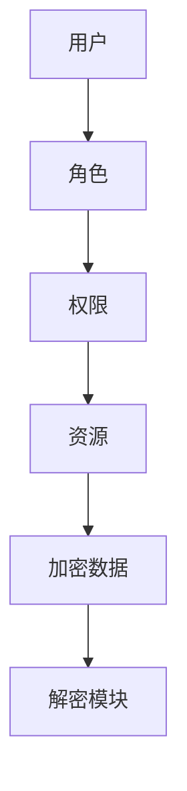
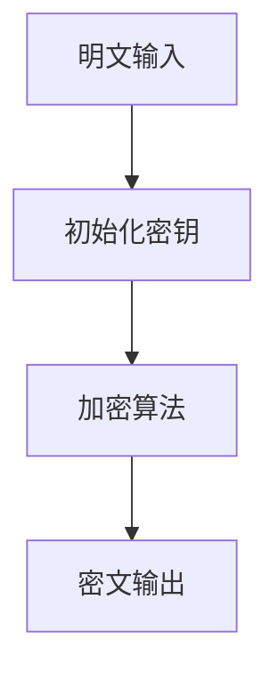
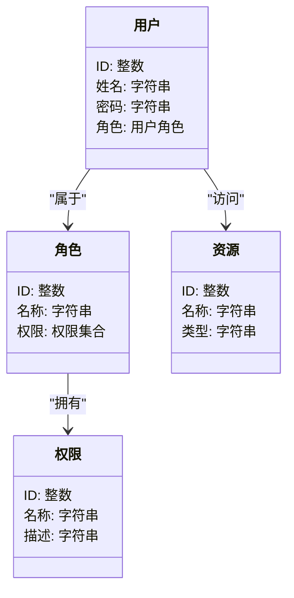

                 


# 保障AI Agent安全：数据加密与访问控制实践

> 关键词：AI Agent安全，数据加密，访问控制，RBAC，ABAC，加密算法

> 摘要：本文从AI Agent的安全需求出发，详细探讨了数据加密与访问控制的核心概念、算法原理、系统架构设计与实现、项目实战以及最佳实践。通过理论与实践相结合的方式，为AI Agent的安全防护提供全面的解决方案。

---

## 第1章: AI Agent安全背景与挑战

### 1.1 AI Agent的基本概念

#### 1.1.1 AI Agent的定义与特点
AI Agent（人工智能代理）是一种能够感知环境、自主决策并执行任务的智能实体。其特点包括：

- **自主性**：能够独立决策和行动。
- **反应性**：能够实时感知环境变化并做出响应。
- **社交能力**：能够与其他系统或用户进行交互。
- **学习能力**：能够通过数据和经验优化自身行为。

#### 1.1.2 AI Agent的应用场景
AI Agent广泛应用于多个领域：

- **自动驾驶**：如自动驾驶汽车中的决策控制系统。
- **智能助手**：如 Siri、Alexa 等语音助手。
- **医疗诊断**：辅助医生进行病情分析和诊断建议。
- **金融交易**：自动化金融交易平台中的交易代理。

#### 1.1.3 AI Agent的安全需求
AI Agent的安全需求主要体现在以下几个方面：

- **数据 confidentiality**：确保敏感数据不被未经授权的访问。
- **完整性**：防止数据被篡改或破坏。
- **可用性**：确保系统在遭受攻击时仍能正常运行。
- **可追溯性**：能够追踪和审计系统操作。

### 1.2 数据加密与访问控制的重要性

#### 1.2.1 数据加密在AI Agent中的作用
数据加密是保护AI Agent中敏感信息的核心手段。通过加密，可以确保数据在传输和存储过程中不被未经授权的第三方窃取或篡改。

#### 1.2.2 访问控制在AI Agent中的必要性
访问控制是确保AI Agent系统安全的另一层保障。通过访问控制，可以限制只有授权的用户或组件才能访问特定资源。

#### 1.2.3 AI Agent安全的边界与外延
AI Agent的安全不仅涉及数据本身，还包括系统的运行环境、用户交互界面等多个方面。安全的边界需要从硬件、软件、网络等多个维度进行考虑。

---

## 第2章: 数据加密与访问控制的核心概念

### 2.1 数据加密原理

#### 2.1.1 对称加密算法
对称加密算法是一种加密和解密使用相同密钥的算法。常见的对称加密算法包括AES和DES。

- **AES加密算法**：高级加密标准，广泛应用于数据加密。
- **DES加密算法**：数据加密标准，已被逐渐淘汰。

#### 2.1.2 非对称加密算法
非对称加密算法使用公钥和私钥进行加密和解密。常见的非对称加密算法包括RSA和椭圆曲线加密。

- **RSA加密算法**：基于大数分解的公钥加密算法。
- **椭圆曲线加密**：基于椭圆曲线数学的公钥加密算法，安全性更高。

#### 2.1.3 哈希函数与数字签名
哈希函数用于将任意长度的数据映射为固定长度的哈希值。数字签名则基于哈希函数和非对称加密算法，用于验证数据的完整性和真实性。

### 2.2 访问控制模型

#### 2.2.1 基于角色的访问控制（RBAC）
RBAC模型通过角色来定义用户的权限。其核心要素包括：

- **用户（User）**：系统中的实际使用者。
- **角色（Role）**：一组权限的集合。
- **权限（Permission）**：用户或角色可以执行的操作。

#### 2.2.2 基于属性的访问控制（ABAC）
ABAC模型通过属性（如用户身份、时间、地理位置等）来动态定义用户的权限。

- **属性（Attribute）**：描述用户或资源的特征。
- **策略（Policy）**：基于属性定义的访问规则。

#### 2.2.3 访问控制矩阵与策略执行
访问控制矩阵是访问控制的核心实现方式，通过矩阵的形式明确用户与资源之间的访问权限。

### 2.3 数据加密与访问控制的联系

#### 2.3.1 数据加密与访问控制的协同作用
数据加密确保数据在传输和存储中的安全性，而访问控制则确保只有授权用户才能访问加密后的数据。两者相辅相成，共同构建系统的安全性。

#### 2.3.2 数据加密与访问控制的实体关系图


---

## 第3章: 数据加密算法的原理与实现

### 3.1 常见加密算法概述

#### 3.1.1 AES加密算法
AES加密算法基于分组密码，将数据分成固定长度的块进行加密。

- **加密流程**：
  1. 将明文填充到固定长度。
  2. 使用初始密钥生成加密密钥。
  3. 对每个数据块进行加密轮数（10轮、12轮或14轮）。
  4. 输出密文。

- **数学模型**：
  $$ AES加密过程：明文 \rightarrow 状态矩阵 \rightarrow 加密轮数 \rightarrow 密文 $$

#### 3.1.2 RSA加密算法
RSA加密算法基于大数分解的数学难题，通过公钥和私钥实现加密和解密。

- **数学模型**：
  $$ RSA公钥加密：(e, n) \text{加密} \rightarrow (d, n) \text{解密} $$

### 3.2 加密算法的数学模型

#### 3.2.1 AES加密的数学模型
$$ AES加密过程：明文 \rightarrow 状态矩阵 \rightarrow 加密轮数 \rightarrow 密文 $$

#### 3.2.2 RSA加密的数学模型
$$ RSA公钥加密：(e, n) \text{加密} \rightarrow (d, n) \text{解密} $$

### 3.3 加密算法的实现流程

#### 3.3.1 AES加密的实现流程


---

## 第4章: 访问控制模型的实现与应用

### 4.1 RBAC模型的实现

#### 4.1.1 RBAC模型的结构
RBAC模型通过用户、角色、权限和资源四个核心要素构建访问控制体系。

- **用户与角色的关系**：用户可以属于多个角色，角色可以拥有多个权限。
- **权限与资源的关系**：权限定义用户对资源的操作权限。

#### 4.1.2 RBAC模型的权限分配
权限分配是RBAC模型实现的核心环节，通过将权限赋予角色，再将角色赋予用户，实现权限的灵活管理。

#### 4.1.3 RBAC模型的权限检查
权限检查是RBAC模型实现的关键步骤，通过检查用户所属角色的权限，确定用户是否可以访问特定资源。

### 4.2 ABAC模型的实现

#### 4.2.1 ABAC模型的结构
ABAC模型通过属性、角色、环境和条件构建动态的访问控制体系。

- **属性**：描述用户或资源的特征。
- **角色**：基于属性定义的用户角色。
- **环境**：影响访问控制的外部条件。
- **条件**：定义访问控制的规则。

#### 4.2.2 ABAC模型的属性定义
属性是ABAC模型的核心要素，通过属性的组合实现动态的访问控制。

#### 4.2.3 ABAC模型的动态权限控制
动态权限控制是ABAC模型的核心功能，通过属性的变化实时调整用户的权限。

### 4.3 访问控制模型的数学表达

#### 4.3.1 RBAC模型的数学表达
$$ RBAC = (U, R, P, Res) $$
其中：
- \( U \)：用户集合
- \( R \)：角色集合
- \( P \)：权限集合
- \( Res \)：资源集合

#### 4.3.2 ABAC模型的数学表达
$$ ABAC = (Attr, Role, Env, Cond) $$
其中：
- \( Attr \)：属性集合
- \( Role \)：角色集合
- \( Env \)：环境集合
- \( Cond \)：条件集合

---

## 第5章: 系统分析与架构设计

### 5.1 问题场景介绍
本章通过一个具体的AI Agent系统设计案例，展示如何将数据加密与访问控制技术应用于实际场景。

### 5.2 项目介绍
本项目旨在设计一个基于AI的医疗诊断系统，通过数据加密与访问控制技术，确保患者数据的安全性和隐私性。

### 5.3 系统功能设计

#### 5.3.1 领域模型


### 5.4 系统架构设计

#### 5.4.1 系统架构


### 5.5 系统接口设计

#### 5.5.1 用户登录接口
- 接口名称：`user_login`
- 输入参数：`username`、`password`
- 输出参数：`token`

#### 5.5.2 数据访问接口
- 接口名称：`data_access`
- 输入参数：`resource_id`、`token`
- 输出参数：`encrypted_data`

### 5.6 系统交互流程

#### 5.6.1 用户登录流程
```mermaid
sequenceDiagram
    用户->>认证模块: 发送用户名和密码
    认证模块->>角色管理模块: 查询用户角色
    角色管理模块->>权限管理模块: 获取用户权限
    用户 <-- 认证模块: 返回访问令牌
```

---

## 第6章: 项目实战

### 6.1 环境安装

#### 6.1.1 安装Python环境
```bash
python --version
pip install --upgrade pip
```

#### 6.1.2 安装依赖库
```bash
pip install Flask
pip install hashlib
pip install rsa
```

### 6.2 系统核心实现

#### 6.2.1 加密模块实现
```python
import hashlib

def aes_encrypt(plaintext, key):
    # 实现AES加密算法
    pass

def rsa_encrypt(plaintext, public_key):
    # 实现RSA加密算法
    pass
```

#### 6.2.2 访问控制模块实现
```python
from flask import Flask
from flask_login import LoginManager

app = Flask(__name__)
login_manager = LoginManager()
login_manager.init_app(app)

class User:
    def __init__(self, id, username, password):
        self.id = id
        self.username = username
        self.password = password

@login_manager.user_loader
def load_user(user_id):
    # 从数据库加载用户
    pass
```

### 6.3 代码应用解读与分析

#### 6.3.1 加密模块分析
- AES加密模块用于对敏感数据进行加密。
- RSA加密模块用于对传输数据进行签名和加密。

#### 6.3.2 访问控制模块分析
- 用户登录模块：通过用户名和密码验证用户身份。
- 权限检查模块：根据用户角色和权限控制数据访问。

### 6.4 实际案例分析

#### 6.4.1 医疗数据加密与访问控制
- 数据加密：对患者的医疗数据进行AES加密。
- 访问控制：通过RBAC模型限制医生对患者数据的访问权限。

### 6.5 项目小结
通过本项目实战，我们可以看到数据加密与访问控制技术在实际应用中的重要性。加密技术保障了数据的安全性，而访问控制技术则确保了系统的可用性和合规性。

---

## 第7章: 最佳实践与总结

### 7.1 最佳实践

#### 7.1.1 数据加密
- 使用强加密算法（如AES、RSA）对敏感数据进行加密。
- 定期更换加密密钥，避免密钥泄露。

#### 7.1.2 访问控制
- 基于角色的访问控制（RBAC）是实现权限管理的最佳选择。
- 定期审计访问权限，清理无用权限。

#### 7.1.3 系统安全
- 定期进行安全漏洞扫描和渗透测试。
- 配置防火墙和入侵检测系统，保护系统免受外部攻击。

### 7.2 小结
通过本文的详细讲解和项目实战，我们可以看到数据加密与访问控制是保障AI Agent安全的核心技术。只有将两者有机结合，才能构建一个安全可靠的AI Agent系统。

### 7.3 注意事项
- 加密算法的选择要考虑性能和安全性。
- 访问控制策略的制定要结合实际业务需求。
- 定期进行安全培训，提高系统管理员的安全意识。

### 7.4 拓展阅读
- 《网络安全技术与实践》
- 《加密算法原理与应用》
- 《访问控制模型与实现》

---

## 作者：AI天才研究院/AI Genius Institute & 禅与计算机程序设计艺术 /Zen And The Art of Computer Programming

---

本文通过系统化的讲解和实践案例，全面介绍了AI Agent安全中的数据加密与访问控制技术。从理论到实践，从算法到系统设计，为读者提供了一个完整的解决方案。希望本文能为AI Agent的安全防护提供有价值的参考和指导。

