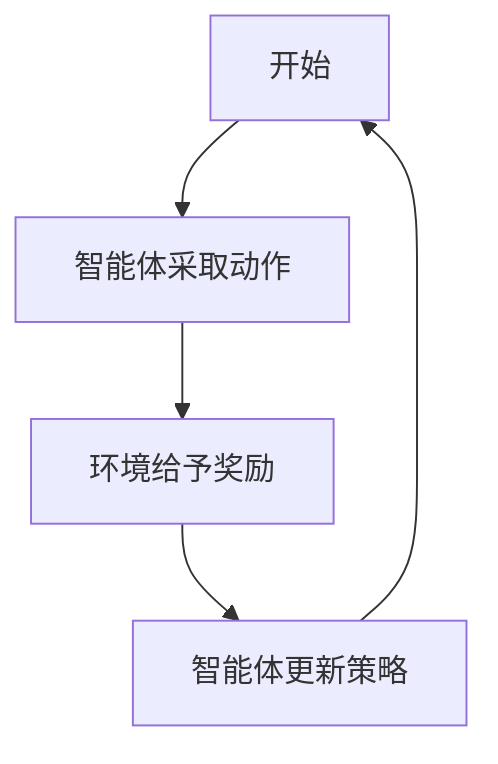
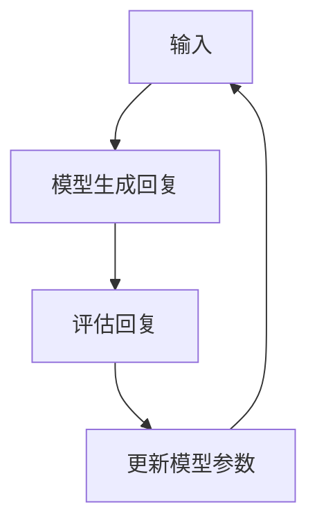
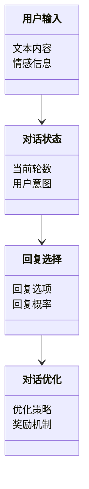
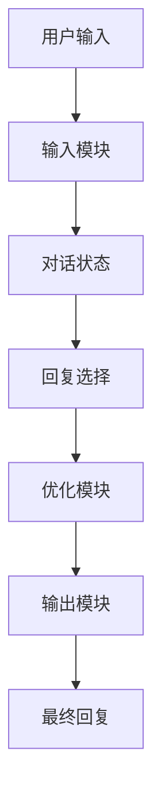
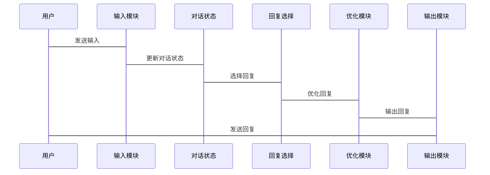

                 


# 对话策略优化：提升AI Agent的交互质量

> 关键词：对话策略优化，AI Agent，交互质量，自然语言处理，强化学习，对话系统

> 摘要：对话策略优化是提升AI Agent交互质量的关键技术。本文从对话系统的基本概念出发，深入探讨对话策略优化的核心原理，结合强化学习、监督学习等算法，详细分析对话策略优化的实现方法。通过系统架构设计和项目实战，展示如何将理论应用于实际项目中。最后，总结对话策略优化的最佳实践和未来发展方向。

---

## 第一部分: 对话策略优化基础

### 第1章: 对话策略优化概述

#### 1.1 对话系统的基本概念

##### 1.1.1 对话系统的定义
对话系统是一种能够与用户进行自然语言交互的AI系统，通过理解和生成人类语言来实现人机对话。其核心功能包括理解用户输入、生成合适的回应以及管理对话流程。

##### 1.1.2 对话系统的分类
对话系统可以分为以下几类：
- **基于规则的对话系统**：通过预定义的规则和模板生成回应。
- **基于统计的对话系统**：利用机器学习模型，从大量对话数据中学习生成回应。
- **基于端到端的对话系统**：直接从输入到输出进行端到端建模，通常使用深度学习技术。

##### 1.1.3 对话系统的核心要素
对话系统的性能取决于以下几个关键要素：
- **语义理解**：准确理解用户的意图和情感。
- **对话管理**：合理规划对话流程，确保对话目标的实现。
- **生成能力**：生成自然、连贯且符合用户期望的回复。

#### 1.2 对话策略优化的背景与意义

##### 1.2.1 当前对话系统的挑战
尽管对话系统在近年来取得了显著进展，但仍面临以下挑战：
- **语义理解的准确性**：如何准确理解用户的意图，尤其是在复杂或模糊的表达下。
- **对话连贯性**：如何保持对话的连贯性和逻辑性，避免重复或偏离主题。
- **个性化交互**：如何根据用户的个性化需求生成个性化的回复。

##### 1.2.2 对话策略优化的重要性
对话策略优化是提升对话系统性能的关键，主要体现在以下方面：
- **提高用户满意度**：通过优化对话策略，使用户得到更准确和个性化的回复，提升用户体验。
- **增强系统智能性**：通过优化策略，使系统能够更好地理解和应对复杂对话场景。
- **提升系统效率**：通过优化对话流程，减少不必要的对话轮次，提高对话效率。

##### 1.2.3 对话策略优化的应用场景
对话策略优化在多个领域都有广泛应用：
- **智能客服**：优化客服机器人的对话流程，提高问题解决效率。
- **智能助手**：提升智能助手的交互能力，提供更便捷的服务。
- **教育领域**：优化教育机器人的对话策略，提高教学效果。

#### 1.3 对话策略优化的目标与方法

##### 1.3.1 对话策略优化的目标
对话策略优化的主要目标包括：
- **提升对话准确性**：通过优化策略，减少错误回复，提高对话准确性。
- **提高对话连贯性**：通过优化策略，使对话更加连贯和自然。
- **增强个性化**：通过优化策略，使对话更加个性化，满足用户的多样化需求。

##### 1.3.2 对话策略优化的主要方法
对话策略优化的主要方法包括：
- **基于规则的方法**：通过预定义规则来优化对话策略。
- **基于机器学习的方法**：利用机器学习模型，从数据中学习优化策略。
- **基于强化学习的方法**：通过强化学习，动态优化对话策略。

##### 1.3.3 对话策略优化的评估指标
对话策略优化的评估指标包括：
- **准确率**：对话系统在准确理解用户意图和生成正确回复的能力。
- **连贯性**：对话的连贯性和逻辑性。
- **用户满意度**：用户对对话系统回复的满意度。

---

### 第2章: 对话策略优化的核心概念

#### 2.1 对话策略优化的原理

##### 2.1.1 对话策略的定义
对话策略是指在对话过程中，系统根据当前对话状态和用户输入，选择合适的回复和对话路径。

##### 2.1.2 对话策略的分类
对话策略可以分为以下几类：
- **基于状态的策略**：根据当前对话状态选择回复。
- **基于目标的策略**：根据对话目标选择回复。
- **基于模型的策略**：基于机器学习模型生成回复。

##### 2.1.3 对话策略的核心要素
对话策略的核心要素包括：
- **对话状态**：当前对话的上下文信息。
- **回复选择**：根据对话状态选择合适的回复。
- **对话目标**：对话的最终目标和预期结果。

#### 2.2 对话策略优化与自然语言处理的关系

##### 2.2.1 自然语言处理在对话系统中的应用
自然语言处理（NLP）在对话系统中的应用包括：
- **语义理解**：通过NLP技术理解用户输入的语义。
- **文本生成**：通过NLP技术生成自然的回复。
- **意图识别**：通过NLP技术识别用户的意图。

##### 2.2.2 对话策略优化对NLP的依赖
对话策略优化依赖于NLP技术，主要体现在：
- **语义理解**：准确理解用户的意图和情感。
- **文本生成**：生成自然、连贯的回复。
- **上下文管理**：管理对话的上下文信息。

##### 2.2.3 对话策略优化与NLP的协同进化
对话策略优化和NLP技术是相互促进的：
- **NLP技术的进步**：推动对话策略优化的提升。
- **对话策略优化的改进**：反过来促进NLP技术的发展。

#### 2.3 对话策略优化与其他AI技术的关联

##### 2.3.1 对话策略优化与机器学习的关系
对话策略优化与机器学习的关系密切：
- **数据驱动**：机器学习通过大量数据训练模型，优化对话策略。
- **模型选择**：机器学习模型的选择影响对话策略的优化效果。

##### 2.3.2 对话策略优化与深度学习的关系
深度学习在对话策略优化中的应用：
- **端到端建模**：深度学习模型可以直接从输入到输出进行建模，优化对话策略。
- **上下文表示**：深度学习模型能够有效捕捉对话的上下文信息。

##### 2.3.3 对话策略优化与强化学习的关系
强化学习在对话策略优化中的应用：
- **动态优化**：强化学习通过不断试错，动态优化对话策略。
- **奖励机制**：强化学习通过奖励机制，引导模型生成更优的回复。

#### 2.4 本章小结

---

### 第3章: 对话策略优化的算法原理

#### 3.1 基于强化学习的对话策略优化

##### 3.1.1 强化学习的基本原理
强化学习是一种通过试错学习的方法，通过智能体与环境的交互，获得奖励或惩罚，从而优化策略。

##### 3.1.2 在对话系统中的应用
强化学习在对话系统中的应用包括：
- **对话策略优化**：通过强化学习优化对话策略。
- **回复选择**：通过强化学习选择最优回复。
- **对话管理**：通过强化学习管理对话流程。

##### 3.1.3 基于强化学习的对话策略优化算法
强化学习在对话策略优化中的算法步骤如下：



##### 3.1.4 算法实现步骤
基于强化学习的对话策略优化算法实现步骤如下：
1. **定义状态空间**：定义对话的状态，如当前对话轮数、用户意图等。
2. **定义动作空间**：定义可能的回复选项。
3. **定义奖励函数**：定义奖励机制，根据对话结果给予奖励或惩罚。
4. **选择动作**：根据当前策略选择一个动作。
5. **更新策略**：根据奖励更新策略。

##### 3.1.5 算法的数学模型
强化学习的数学模型可以用以下公式表示：

$$
Q(s,a) = r + \gamma \max_{a'} Q(s',a')
$$

其中：
- \( Q(s,a) \)：状态 \( s \) 下采取动作 \( a \) 的价值。
- \( r \)：立即奖励。
- \( \gamma \)：折扣因子。
- \( Q(s',a') \)：下一个状态 \( s' \) 下采取动作 \( a' \) 的价值。

#### 3.2 基于监督学习的对话策略优化

##### 3.2.1 监督学习的基本原理
监督学习是一种通过标注数据训练模型的方法，模型通过输入输出对进行训练，学习输入到输出的映射关系。

##### 3.2.2 在对话系统中的应用
监督学习在对话系统中的应用包括：
- **回复生成**：通过监督学习训练模型生成回复。
- **意图分类**：通过监督学习训练模型识别用户的意图。

##### 3.2.3 基于监督学习的对话策略优化算法
基于监督学习的对话策略优化算法步骤如下：



##### 3.2.4 算法实现步骤
基于监督学习的对话策略优化算法实现步骤如下：
1. **数据准备**：收集和标注对话数据。
2. **模型训练**：使用标注数据训练模型。
3. **生成回复**：模型根据输入生成回复。
4. **评估和优化**：根据评估结果优化模型。

##### 3.2.5 算法的数学模型
监督学习的数学模型可以用以下公式表示：

$$
L = \frac{1}{N}\sum_{i=1}^{N} (y_i - \hat{y}_i)^2
$$

其中：
- \( L \)：损失函数。
- \( y_i \)：真实标签。
- \( \hat{y}_i \)：模型预测值。

---

## 第四部分: 对话策略优化的系统架构设计

### 第4章: 对话策略优化的系统架构

#### 4.1 系统模块介绍
对话策略优化系统的模块包括：
- **输入模块**：接收用户输入。
- **处理模块**：解析用户输入，生成回复。
- **优化模块**：优化对话策略。
- **输出模块**：输出优化后的回复。

#### 4.2 系统功能设计

##### 4.2.1 领域模型
对话系统的核心领域模型如下：



#### 4.3 系统架构设计

##### 4.3.1 系统架构图
对话策略优化系统的架构图如下：



#### 4.4 系统接口设计
对话策略优化系统的接口设计包括：
- **输入接口**：接收用户的输入文本。
- **输出接口**：输出优化后的回复。
- **优化接口**：对对话策略进行优化。

#### 4.5 系统交互流程

##### 4.5.1 交互流程图
对话策略优化系统的交互流程如下：



---

## 第五部分: 对话策略优化的项目实战

### 第5章: 对话策略优化的项目实战

#### 5.1 环境安装与配置
对话策略优化项目的环境安装步骤如下：
1. **安装Python**：安装Python 3.x及以上版本。
2. **安装依赖库**：安装必要的Python库，如`tensorflow`、`numpy`等。
3. **配置开发环境**：配置IDE，如PyCharm、VS Code等。

#### 5.2 系统核心实现

##### 5.2.1 回复生成模块
回复生成模块的实现代码如下：

```python
def generate_reply(context, model):
    # 根据上下文生成回复
    reply = model.generate(context)
    return reply
```

##### 5.2.2 对话管理模块
对话管理模块的实现代码如下：

```python
def manage_dialogue(context, state):
    # 根据上下文和状态管理对话
    new_state = update_state(context, state)
    return new_state
```

##### 5.2.3 策略优化模块
策略优化模块的实现代码如下：

```python
def optimize_strategy(context, state, model):
    # 优化对话策略
    optimized_reply = model.optimize(context, state)
    return optimized_reply
```

#### 5.3 代码实现与解读

##### 5.3.1 代码实现
对话策略优化项目的完整代码实现如下：

```python
import tensorflow as tf
import numpy as np

class DialogueSystem:
    def __init__(self):
        self.model = self.build_model()

    def build_model(self):
        # 构建模型
        model = tf.keras.Sequential([
            tf.keras.layers.Embedding(1000, 64),
            tf.keras.layers.LSTM(64),
            tf.keras.layers.Dense(1, activation='sigmoid')
        ])
        model.compile(optimizer='adam', loss='binary_crossentropy')
        return model

    def generate_reply(self, context):
        # 生成回复
        prediction = self.model.predict(context)
        return prediction

    def manage_dialogue(self, context, state):
        # 管理对话
        new_state = self.update_state(context, state)
        return new_state

    def optimize_strategy(self, context, state):
        # 优化策略
        optimized_reply = self.model.optimize(context, state)
        return optimized_reply

if __name__ == "__main__":
    system = DialogueSystem()
    context = "用户说：今天天气真好啊！"
    state = {"intent": "chat", "round": 1}
    reply = system.generate_reply(context)
    print(reply)
```

##### 5.3.2 代码解读
上述代码实现了对话系统的核心功能：
- **模型构建**：使用Keras构建了一个简单的深度学习模型。
- **回复生成**：根据上下文生成回复。
- **对话管理**：根据上下文和状态管理对话。
- **策略优化**：优化对话策略，生成最优回复。

#### 5.4 实际案例分析

##### 5.4.1 案例背景
假设我们有一个智能客服系统，用户输入“我的订单在哪里？”

##### 5.4.2 对话管理
系统根据用户输入生成回复：

```python
context = "用户说：我的订单在哪里？"
state = {"intent": "order_inquiry", "round": 1}
reply = system.generate_reply(context)
print(reply)  # 输出：您可以在订单查询页面查看您的订单。
```

##### 5.4.3 策略优化
系统根据对话状态优化回复：

```python
optimized_reply = system.optimize_strategy(context, state)
print(optimized_reply)  # 输出：您可以在订单查询页面查看您的订单。请问还有其他问题吗？
```

#### 5.5 项目小结

---

## 第六部分: 对话策略优化的最佳实践

### 第6章: 对话策略优化的总结与展望

#### 6.1 本章小结
对话策略优化是提升AI Agent交互质量的关键技术。通过本文的介绍，我们了解了对话系统的基本概念、优化方法以及实现步骤。对话策略优化不仅需要理解对话系统的核心要素，还需要掌握强化学习、监督学习等算法原理，并将其应用于实际项目中。

#### 6.2 对话策略优化的最佳实践

##### 6.2.1 数据准备
- **数据质量**：确保数据的多样性和代表性。
- **数据标注**：准确标注数据，为模型训练提供高质量的标注信息。

##### 6.2.2 模型选择
- **算法选择**：根据具体场景选择合适的算法。
- **模型调优**：通过参数调优和模型优化提升性能。

##### 6.2.3 交互设计
- **对话连贯性**：确保对话的连贯性和逻辑性。
- **个性化交互**：根据用户需求提供个性化的回复。

#### 6.3 对话策略优化的注意事项

##### 6.3.1 避免常见错误
- **忽略上下文**：忽略对话的上下文信息，导致回复不连贯。
- **过度优化**：过度优化可能导致策略过于僵化，缺乏灵活性。

##### 6.3.2 优化策略
- **动态优化**：根据对话的实时反馈动态优化策略。
- **用户反馈**：利用用户反馈不断改进对话策略。

#### 6.4 未来发展方向
对话策略优化的未来发展方向包括：
- **多模态对话**：结合视觉、听觉等多模态信息，提升对话质量。
- **自适应对话**：根据用户行为和偏好动态调整对话策略。
- **跨领域应用**：将对话策略优化技术应用于更多领域，如教育、医疗等。

---

## 结语

对话策略优化是提升AI Agent交互质量的关键技术，通过本文的详细介绍，我们了解了对话系统的基本概念、优化方法以及实现步骤。未来，随着技术的进步，对话策略优化将在更多领域得到广泛应用，为人类带来更智能、更自然的交互体验。

---

## 作者信息

作者：AI天才研究院/AI Genius Institute & 禅与计算机程序设计艺术 /Zen And The Art of Computer Programming

