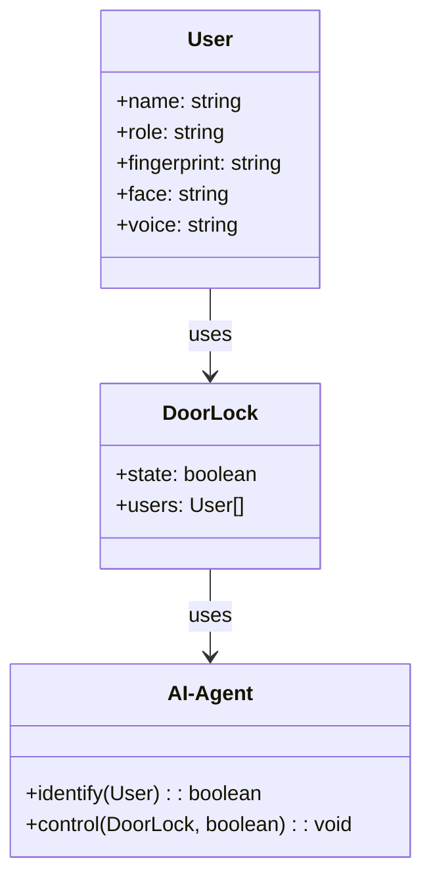
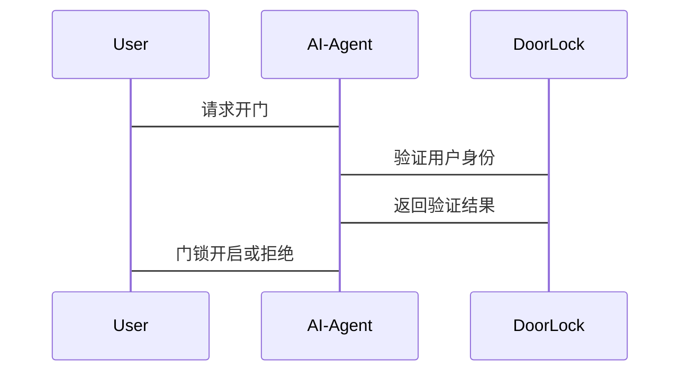

                 


# 智能门锁：AI Agent的生物识别技术

> 关键词：智能门锁，AI Agent，生物识别技术，指纹识别，人脸识别，算法原理

> 摘要：本文详细探讨了AI Agent在智能门锁中的应用，特别是生物识别技术的核心原理和实际应用。通过分析指纹识别、人脸识别等技术，结合数学模型和系统设计，展示了AI Agent如何提升智能门锁的安全性和智能化水平。文章还提供了项目实战和最佳实践，帮助读者深入了解生物识别技术在智能门锁中的应用。

---

# 第一部分：智能门锁与AI Agent的背景介绍

## 第1章：生物识别技术概述

### 1.1 生物识别技术的基本概念

生物识别技术是一种通过分析和匹配个体的生物特征来识别人的身份的技术。常见的生物特征包括指纹、人脸、虹膜、声音等。生物识别技术的核心在于特征提取和模式匹配。

#### 1.1.1 生物识别技术的定义
生物识别技术是基于人的生理特征或行为特征进行身份识别的技术。其目的是通过分析个体的唯一性特征，实现对个体的唯一标识和认证。

#### 1.1.2 生物识别技术的分类
生物识别技术可以分为以下几类：
1. **生理特征识别**：基于人体的物理特征，如指纹、虹膜、人脸等。
2. **行为特征识别**：基于人的行为模式，如声音、笔迹等。

#### 1.1.3 生物识别技术的优缺点
| **优点**         | **缺点**         |
|------------------|------------------|
| 高安全性          | 成本较高          |
| 方便快捷          | 易受环境影响      |
| 难以伪造          | 技术复杂          |

### 1.2 AI Agent的基本概念

AI Agent是一种智能体，能够感知环境并自主决策以实现目标。AI Agent在智能门锁中的应用主要体现在生物特征识别和智能控制方面。

#### 1.2.1 AI Agent的定义
AI Agent（智能体）是指能够感知环境、自主决策并执行任务的实体。它可以是一个软件程序，也可以是一个物理设备。

#### 1.2.2 AI Agent的核心功能
1. **感知环境**：通过传感器或其他输入设备获取环境信息。
2. **分析处理**：利用算法对信息进行分析和处理。
3. **决策执行**：基于分析结果做出决策并执行相应的操作。

#### 1.2.3 AI Agent与传统计算机程序的区别
| **AI Agent**        | **传统程序**       |
|---------------------|--------------------|
| 自主决策             | 需要明确的指令     |
| 环境感知             | 依赖预设条件       |
| 学习能力             | 无法自主学习       |

## 第2章：智能门锁的发展历程

### 2.1 传统门锁的局限性

传统门锁虽然简单实用，但存在以下问题：
1. **安全性低**：钥匙容易丢失或被复制。
2. **管理不便**：需要物理钥匙，管理起来较为麻烦。
3. **功能单一**：无法与其他智能设备联动。

### 2.2 智能门锁的兴起

随着科技的发展，智能门锁逐渐普及。智能门锁利用生物识别技术和物联网技术，实现了更高的安全性和智能化管理。

#### 2.2.1 智能门锁的定义
智能门锁是一种结合了生物识别技术和物联网技术的智能设备，能够通过用户的生物特征进行身份验证并实现门锁的开启。

#### 2.2.2 智能门锁的市场现状
目前，智能门锁市场增长迅速，尤其是在家庭、办公室和公共场所的应用越来越广泛。

#### 2.2.3 智能门锁的技术发展趋势
1. **多模态识别**：结合多种生物特征进行识别，提高安全性。
2. **AI驱动**：利用AI技术优化识别算法，提升识别准确率。
3. **联网功能**：通过物联网技术实现远程控制和管理。

## 第3章：AI Agent在智能门锁中的应用

### 3.1 AI Agent在智能门锁中的作用

AI Agent在智能门锁中主要负责生物特征识别和智能控制。

#### 3.1.1 AI Agent如何提升门锁的安全性
通过生物识别技术，AI Agent能够准确识别用户的身份，防止非法入侵。

#### 3.1.2 AI Agent如何优化门锁的功能
AI Agent可以通过学习用户的使用习惯，优化门锁的开启和关闭策略。

#### 3.1.3 AI Agent如何实现智能化管理
AI Agent可以通过与其他智能设备联动，实现门锁的远程控制和智能化管理。

### 3.2 生物识别技术在智能门锁中的应用

#### 3.2.1 指纹识别技术
指纹识别是目前应用最广泛的生物识别技术之一。指纹识别技术通过采集和分析指纹的细节特征，实现用户身份验证。

#### 3.2.2 人脸识别技术
人脸识别技术通过采集和分析人脸的特征，实现用户身份验证。与指纹识别相比，人脸识别具有非接触式的特点，更加方便。

#### 3.2.3 声纹识别技术
声纹识别技术通过分析用户的语音特征，实现身份验证。声纹识别具有方便、快捷的特点，但易受环境噪声的影响。

#### 3.2.4 其他生物识别技术
除了指纹、人脸和声纹识别，其他生物识别技术如虹膜识别也在智能门锁中逐渐得到应用。

---

# 第二部分：生物识别技术的核心原理

## 第4章：生物识别技术的核心原理

### 4.1 生物识别技术的分类与特点

生物识别技术可以根据不同的分类标准进行分类。以下是几种常见的分类方式：

#### 4.1.1 常见的生物识别技术分类
| **分类标准** | **分类方式**         |
|--------------|----------------------|
| 特征类型      | 指纹、人脸、虹膜等    |
| 应用场景      | 安全门锁、手机解锁等  |

#### 4.1.2 各种生物识别技术的特点对比
| **技术**     | **优点**             | **缺点**         |
|--------------|----------------------|------------------|
| 指纹识别     | 高安全性、成本低     | 易受污损影响     |
| 人脸识别     | 非接触式、便捷性高   | 易受光线影响     |
| 虹膜识别     | 高准确性、抗 spoofing | 成本较高         |

### 4.2 生物识别技术的实现流程

生物识别技术的实现流程通常包括以下步骤：

1. **数据采集**：通过传感器采集用户的生物特征数据。
2. **数据预处理**：对采集到的数据进行降噪和标准化处理。
3. **特征提取**：从预处理后的数据中提取关键特征。
4. **模式匹配**：将提取的特征与数据库中的特征进行匹配，确定用户身份。

---

## 第5章：AI Agent的生物识别算法原理

### 5.1 常见的生物识别算法

#### 5.1.1 指纹识别算法

指纹识别算法主要包括以下步骤：
1. **图像采集**：通过指纹传感器采集指纹图像。
2. **图像预处理**：去除噪声，增强指纹特征。
3. **特征提取**：提取指纹的细节特征，如嵴线、峪线等。
4. **模式匹配**：将提取的特征与数据库中的指纹进行匹配。

#### 5.1.2 人脸识别算法

人脸识别算法主要包括以下步骤：
1. **图像采集**：通过摄像头采集人脸图像。
2. **图像预处理**：调整图像亮度、对比度等，增强人脸特征。
3. **特征提取**：提取人脸的特征，如眼睛、鼻子、嘴巴的位置和形状。
4. **模式匹配**：将提取的特征与数据库中的人脸进行匹配。

#### 5.1.3 声纹识别算法

声纹识别算法主要包括以下步骤：
1. **语音采集**：通过麦克风采集用户的语音。
2. **语音预处理**：去除噪声，增强语音特征。
3. **特征提取**：提取语音的特征，如音调、音速、音色等。
4. **模式匹配**：将提取的特征与数据库中的语音进行匹配。

### 5.2 生物识别算法的优缺点

| **算法**     | **优点**             | **缺点**         |
|--------------|----------------------|------------------|
| 指纹识别     | 高安全性、成本低     | 易受污损影响     |
| 人脸识别     | 非接触式、便捷性高   | 易受光线影响     |
| 声纹识别     | 方便、快捷           | 易受环境噪声影响 |

---

## 第6章：生物识别技术的数学模型与公式

### 6.1 指纹识别的数学模型

指纹识别的数学模型主要基于特征提取和模式匹配。以下是指纹识别中常用的数学模型：

#### 6.1.1 指纹图像的预处理
指纹图像的预处理包括去噪、二值化和骨架化等步骤。预处理的目的是提高指纹特征的清晰度。

#### 6.1.2 指纹特征提取的数学模型
指纹特征提取主要基于Gabor滤波器。Gabor滤波器是一种多维信号处理工具，用于提取指纹的嵴线和峪线特征。

#### 6.1.3 指纹模式匹配的数学模型
指纹模式匹配主要基于相关系数法。相关系数法是一种常用的模式匹配方法，用于计算两个指纹特征之间的相似性。

---

## 第7章：系统分析与架构设计方案

### 7.1 智能门锁的系统场景介绍

智能门锁的系统场景主要包括以下几个方面：
1. **用户身份验证**：通过生物识别技术验证用户的身份。
2. **门锁控制**：根据验证结果控制门锁的开启和关闭。
3. **远程管理**：通过物联网技术实现门锁的远程控制和管理。

### 7.2 系统功能设计

智能门锁的系统功能设计主要包括以下几个方面：
1. **用户管理**：包括用户注册、权限管理等。
2. **生物识别**：包括指纹识别、人脸识别等功能。
3. **门锁控制**：包括门锁的开启和关闭控制。
4. **远程管理**：包括远程开门、状态查询等功能。

#### 7.2.1 领域模型类图


### 7.3 系统架构设计

智能门锁的系统架构设计主要包括以下几个方面：
1. **硬件层**：包括指纹传感器、摄像头、物联网模块等。
2. **数据层**：包括用户数据库、特征数据库等。
3. **应用层**：包括用户界面、AI Agent等。

#### 7.3.1 系统架构图


### 7.4 系统接口设计

智能门锁的系统接口设计主要包括以下几个方面：
1. **用户接口**：包括用户登录、权限设置等。
2. **AI Agent接口**：包括特征识别、门锁控制等。
3. **物联网接口**：包括远程控制、状态查询等。

#### 7.4.1 系统交互序列图


---

## 第8章：项目实战

### 8.1 环境安装

智能门锁的开发环境主要包括以下几部分：
1. **硬件设备**：指纹传感器、摄像头、物联网模块等。
2. **开发工具**：Python、OpenCV、TensorFlow等。
3. **操作系统**：Windows、Linux等。

### 8.2 系统核心实现源代码

以下是智能门锁的核心代码实现：

#### 8.2.1 指纹识别代码
```python
import cv2

def fingerprint_recognition():
    # 读取指纹图像
    img = cv2.imread('fingerprint.jpg', cv2.IMREAD_GRAYSCALE)
    # 图像预处理
    img = cv2.GaborFilter(img, 1, 0, 10, 10)
    # 特征提取
    features = extract_features(img)
    # 模式匹配
    result = match(features, database)
    return result

def extract_features(img):
    # 提取指纹特征
    pass

def match(features, database):
    # 模式匹配
    pass

fingerprint_recognition()
```

#### 8.2.2 人脸识别代码
```python
import cv2

def face_recognition():
    # 读取人脸图像
    img = cv2.imread('face.jpg', cv2.IMREAD_GRAYSCALE)
    # 图像预处理
    img = cv2.equalizeHist(img)
    # 特征提取
    features = extract_features(img)
    # 模式匹配
    result = match(features, database)
    return result

def extract_features(img):
    # 提取人脸特征
    pass

def match(features, database):
    # 模式匹配
    pass

face_recognition()
```

### 8.3 代码应用解读与分析

通过上述代码可以看出，生物识别技术的核心在于特征提取和模式匹配。特征提取是将生物特征转化为计算机可处理的数字特征，模式匹配是将提取的特征与数据库中的特征进行匹配，从而实现身份验证。

### 8.4 实际案例分析

以下是一个智能门锁的实际案例分析：
1. **用户登录**：用户通过指纹或人脸识别登录系统。
2. **门锁控制**：系统验证用户身份后，控制门锁的开启和关闭。
3. **远程管理**：用户可以通过手机APP远程控制门锁的开启和关闭。

---

## 第9章：总结与展望

### 9.1 最佳实践 tips

1. **选择合适的生物识别技术**：根据实际需求选择合适的生物识别技术。
2. **确保系统的安全性**：加强系统的安全防护，防止数据泄露。
3. **优化系统的性能**：通过算法优化和硬件升级，提高系统的识别准确率和响应速度。

### 9.2 小结

本文详细探讨了AI Agent在智能门锁中的应用，特别是生物识别技术的核心原理和实际应用。通过分析指纹识别、人脸识别等技术，结合数学模型和系统设计，展示了AI Agent如何提升智能门锁的安全性和智能化水平。

### 9.3 注意事项

1. **数据隐私**：生物识别数据属于用户隐私，必须严格保护。
2. **环境适应性**：生物识别技术的性能受到环境条件的影响，需要进行适当的环境适应性测试。
3. **系统维护**：定期更新系统软件和数据库，确保系统的安全性和稳定性。

### 9.4 拓展阅读

1. **生物识别技术的最新研究**：了解生物识别技术的最新研究成果。
2. **AI Agent的应用领域**：探索AI Agent在其他领域的应用。

---

# 作者：AI天才研究院/AI Genius Institute & 禅与计算机程序设计艺术 /Zen And The Art of Computer Programming

