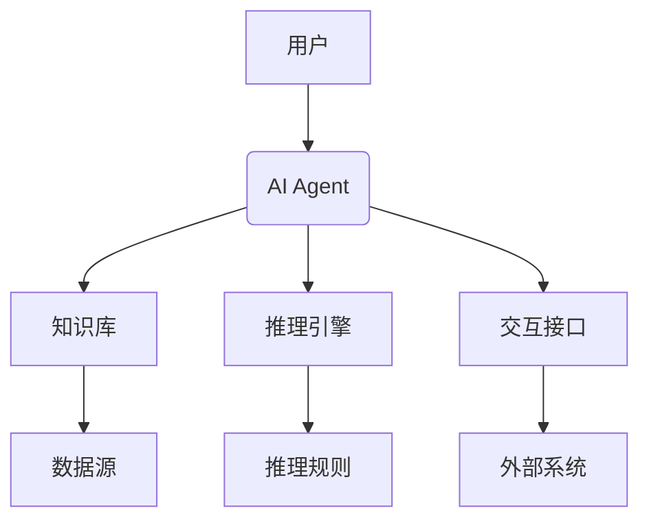
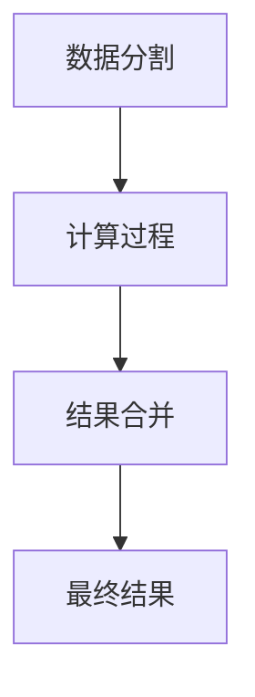
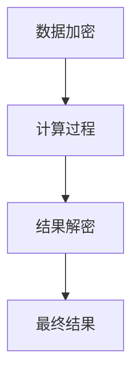
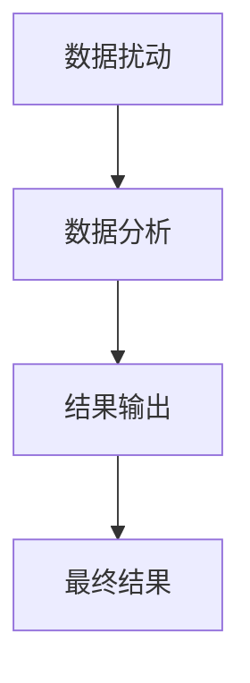
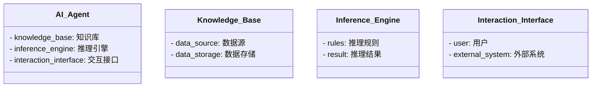
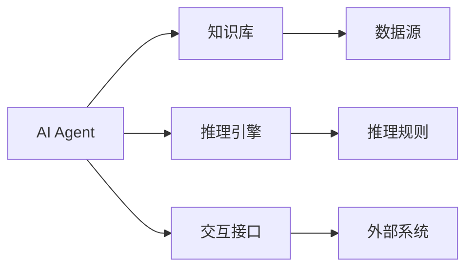
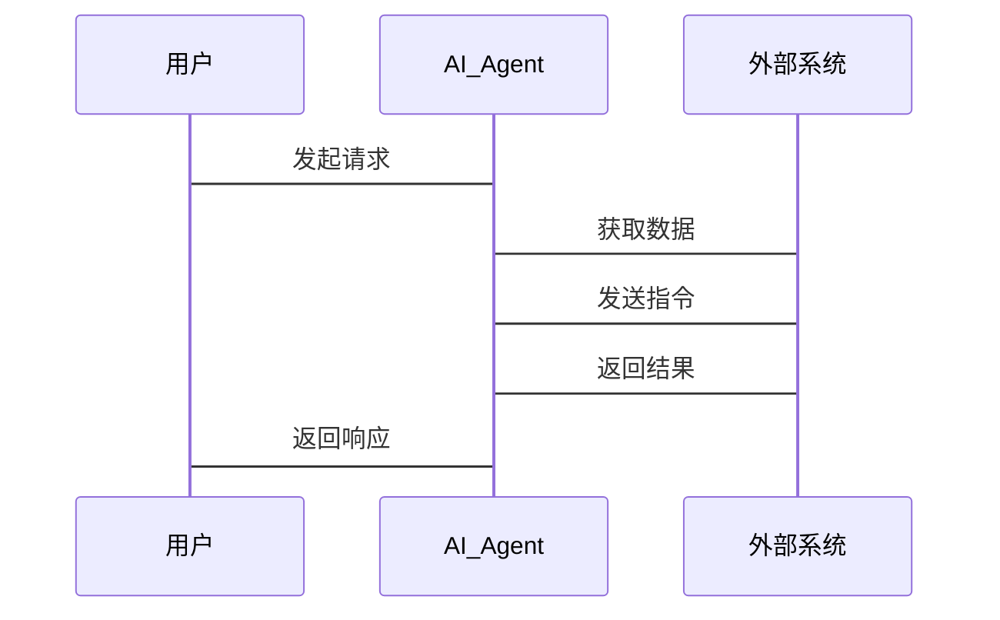

                 


# 构建具有隐私计算能力的AI Agent

> 关键词：隐私计算，AI Agent，多方安全计算，同态加密，差分隐私，系统架构

> 摘要：本文详细探讨了如何构建具有隐私计算能力的AI Agent，涵盖背景介绍、核心概念、算法原理、系统架构、项目实战和最佳实践。通过分析隐私计算技术如MPC、HE和DP，结合AI Agent的结构与功能，提供了从理论到实践的全面指导。

---

## 第1章：隐私计算与AI Agent概述

### 1.1 隐私计算的核心概念

#### 1.1.1 隐私计算的定义与背景
隐私计算是一种在保护数据隐私的前提下进行数据处理和分析的技术。随着数据泄露和隐私保护问题的日益严重，隐私计算的重要性日益凸显。隐私计算的目标是在不泄露原始数据的情况下，完成数据的计算和分析任务。

#### 1.1.2 AI Agent的基本概念与特点
AI Agent（人工智能代理）是一种能够感知环境、自主决策并执行任务的智能实体。AI Agent具有以下特点：
- **自主性**：能够自主决策。
- **反应性**：能够实时感知环境并做出反应。
- **主动性**：能够主动采取行动。
- **社交能力**：能够与其他系统或人类进行交互。

#### 1.1.3 隐私计算在AI Agent中的重要性
隐私计算在AI Agent中的应用至关重要，主要体现在以下方面：
- **数据隐私保护**：确保AI Agent在处理敏感数据时不会泄露原始数据。
- **合规性**：满足数据保护法规（如GDPR）的要求。
- **信任构建**：增强用户对AI Agent的信任，特别是在处理个人数据时。

### 1.2 隐私计算与AI Agent的结合
#### 1.2.1 隐私计算在AI Agent中的应用场景
隐私计算在AI Agent中的应用场景广泛，例如：
- **医疗领域**：保护患者隐私，分析医疗数据以辅助诊断。
- **金融领域**：保护客户隐私，分析金融数据以进行风险评估。
- **社交网络**：保护用户隐私，分析社交数据以提供个性化服务。

#### 1.2.2 AI Agent与传统AI的区别
AI Agent与传统AI的区别主要体现在以下几个方面：
- **自主性**：AI Agent具有自主决策能力，而传统AI通常需要人工干预。
- **实时性**：AI Agent能够实时响应环境变化，而传统AI通常在固定场景下运行。
- **交互性**：AI Agent能够与环境和其他实体进行交互，而传统AI通常在封闭环境中运行。

#### 1.2.3 隐私计算对AI Agent能力的提升
隐私计算技术的引入，显著提升了AI Agent的能力，主要体现在以下几个方面：
- **数据处理能力**：能够在不泄露原始数据的情况下，完成复杂的数据分析任务。
- **安全性**：确保数据在处理过程中的安全性，防止数据泄露。
- **信任度**：通过隐私保护，增强用户对AI Agent的信任，从而扩大应用场景。

### 1.3 本章小结
本章介绍了隐私计算和AI Agent的基本概念，并探讨了隐私计算在AI Agent中的重要性及其应用场景。通过对比AI Agent与传统AI的区别，强调了隐私计算对AI Agent能力的提升。

---

## 第2章：隐私计算的核心原理

### 2.1 隐私计算的主要技术

#### 2.1.1 多方安全计算（MPC）
多方安全计算是一种在多个参与方之间进行计算的技术，确保各方的数据隐私。其核心思想是将数据分割成多个密钥，并通过加密技术进行计算，确保各方无法通过计算过程获取原始数据。

#### 2.1.2 同态加密（HE）
同态加密是一种允许在加密数据上进行计算的技术，确保计算结果与明文计算结果一致。其主要优势是可以在不 decrypt 数据的情况下进行计算，从而保护数据隐私。

#### 2.1.3 差分隐私（DP）
差分隐私是一种通过在数据中添加噪声来保护隐私的技术。其核心思想是通过数据扰动生成的分布差异，使得无法通过数据分析推断出原始数据。

### 2.2 AI Agent的结构与功能
#### 2.2.1 知识库构建
知识库是AI Agent的核心组件之一，用于存储和管理AI Agent所需的知识和数据。知识库的设计需要考虑数据的隐私性和可用性。

#### 2.2.2 推理引擎
推理引擎是AI Agent的另一个核心组件，用于根据知识库中的数据和推理规则，进行逻辑推理和决策。推理引擎需要能够处理复杂的数据关系，并确保推理过程中的数据隐私。

#### 2.2.3 交互接口设计
交互接口是AI Agent与外部环境和用户进行交互的桥梁。设计良好的交互接口能够提高AI Agent的用户体验，同时确保交互过程中的数据隐私。

### 2.3 隐私计算与AI Agent的结合原理
#### 2.3.1 数据隐私保护
通过隐私计算技术，确保AI Agent在处理数据时，数据的原始信息不会被泄露。例如，使用多方安全计算技术，将数据分割成多个密钥进行计算，确保各方无法通过计算过程获取原始数据。

#### 2.3.2 计算过程的隐私性
通过同态加密技术，确保AI Agent在处理加密数据时，计算过程不会泄露数据的原始信息。同态加密技术允许在不 decrypt 数据的情况下进行计算，从而保护数据隐私。

#### 2.3.3 结果的隐私性
通过差分隐私技术，确保AI Agent在返回计算结果时，结果中不会包含能够推断出原始数据的信息。差分隐私技术通过在结果中添加噪声，使得无法通过数据分析推断出原始数据。

### 2.4 本章小结
本章详细介绍了隐私计算的核心技术，包括多方安全计算、同态加密和差分隐私。同时，探讨了这些技术在AI Agent中的应用，确保AI Agent在处理数据时能够保护数据隐私。

---

## 第3章：隐私计算与AI Agent的核心概念联系

### 3.1 隐私计算技术的对比分析
#### 3.1.1 多方安全计算与同态加密的对比
| 技术         | 多方安全计算（MPC）       | 同态加密（HE）           |
|--------------|--------------------------|--------------------------|
| 定义         | 多个参与方在不泄露数据的情况下进行计算的技术 | 在加密数据上进行计算的技术 |
| 优点         | 不需要共享原始数据         | 不需要 decrypt 数据即可进行计算 |
| 缺点         | 计算效率较低               | 对计算复杂度有较高要求     |

#### 3.1.2 差分隐私与其他隐私保护技术的对比
| 技术         | 差分隐私（DP）            | 同态加密（HE）           |
|--------------|--------------------------|--------------------------|
| 定义         | 通过在数据中添加噪声来保护隐私 | 在加密数据上进行计算的技术 |
| 优点         | 数据扰动较小，隐私保护较强 | 计算效率较高               |
| 缺点         | 数据扰动较大，可能影响数据准确性 | 需要 decrypt 数据才能进行分析 |

### 3.2 AI Agent功能模块的实体关系图


### 3.3 隐私计算技术在AI Agent中的应用实例
#### 3.3.1 多方安全计算在AI Agent中的应用
例如，在医疗领域，多个医院可以通过多方安全计算技术，联合分析患者的医疗数据，以辅助诊断，同时保护患者的隐私。

#### 3.3.2 同态加密在AI Agent中的应用
例如，在金融领域，银行可以通过同态加密技术，加密客户的金融数据，并在加密数据上进行风险评估，同时保护客户隐私。

### 3.4 本章小结
本章通过对比分析隐私计算技术，探讨了这些技术在AI Agent中的应用。通过实体关系图和具体案例，展示了隐私计算技术如何提升AI Agent的数据处理能力。

---

## 第4章：隐私计算与AI Agent的算法原理

### 4.1 多方安全计算（MPC）算法
#### 4.1.1 MPC算法的基本原理
MPC算法的核心思想是将数据分割成多个密钥，并通过加密技术进行计算，确保各方无法通过计算过程获取原始数据。以下是MPC算法的基本流程：
1. 数据分割：将数据分割成多个密钥，并分发给不同的参与方。
2. 计算过程：各参与方在自己的密钥上进行计算，并将结果返回给协调方。
3. 结果合并：协调方将各参与方的计算结果进行合并，生成最终的计算结果。

#### 4.1.2 MPC算法的数学模型
$$ y = f(x_1, x_2, ..., x_n) $$
其中，$x_i$ 是第 $i$ 个参与方的密钥，$y$ 是最终的计算结果。

#### 4.1.3 MPC算法的流程图


### 4.2 同态加密（HE）算法
#### 4.2.1 HE算法的基本原理
HE算法的核心思想是在加密数据上进行计算，确保计算结果与明文计算结果一致。以下是HE算法的基本流程：
1. 数据加密：将明文数据加密成密文数据。
2. 计算过程：在密文数据上进行计算，生成密文结果。
3. 结果解密：将密文结果解密成明文结果。

#### 4.2.2 HE算法的数学模型
$$ f(x) = g(x) $$
其中，$x$ 是明文数据，$g(x)$ 是加密数据上的计算函数，$f(x)$ 是最终的明文结果。

#### 4.2.3 HE算法的流程图


### 4.3 差分隐私（DP）算法
#### 4.3.1 DP算法的基本原理
DP算法的核心思想是通过在数据中添加噪声，使得无法通过数据分析推断出原始数据。以下是DP算法的基本流程：
1. 数据扰动：在原始数据中添加噪声，生成扰动数据。
2. 数据分析：对扰动数据进行分析，生成分析结果。
3. 结果输出：输出分析结果，确保结果中不包含能够推断出原始数据的信息。

#### 4.3.2 DP算法的数学模型
$$ y = x + \epsilon $$
其中，$x$ 是原始数据，$\epsilon$ 是噪声，$y$ 是扰动数据。

#### 4.3.3 DP算法的流程图


### 4.4 本章小结
本章详细介绍了隐私计算的核心算法，包括多方安全计算、同态加密和差分隐私。通过数学模型和流程图，展示了这些算法的基本原理和实现流程。

---

## 第5章：隐私计算与AI Agent的系统架构设计

### 5.1 系统功能设计
#### 5.1.1 领域模型（Mermaid类图）


#### 5.1.2 系统架构设计（Mermaid架构图）


#### 5.1.3 系统交互设计（Mermaid序列图）


### 5.2 本章小结
本章通过系统功能设计、架构设计和交互设计，展示了隐私计算技术在AI Agent中的具体实现方式。通过Mermaid图，清晰地展示了系统各组件之间的关系和交互流程。

---

## 第6章：隐私计算与AI Agent的项目实战

### 6.1 环境安装
需要安装以下工具和库：
- Python 3.x
- Mermaid工具
- LaTeX工具
- 隐私计算库（如PySecure）
- AI框架（如TensorFlow）

### 6.2 系统核心实现源代码
以下是隐私计算与AI Agent结合的核心代码示例：

```python
# MPC算法实现
def mpc_encrypt(data):
    # 数据分割
    secret_shares = data % 2  # 示例：简单分割
    return secret_shares

def mpc_decrypt(secret_shares):
    # 秘密共享恢复
    data = sum(secret_shares)  # 示例：简单恢复
    return data

# HE算法实现
def he_encrypt(data):
    # 数据加密
    key = generate_key()  # 示例：生成加密密钥
    cipher = encrypt(key, data)  # 示例：加密数据
    return cipher

def he_decrypt(cipher):
    # 数据解密
    key = generate_key()  # 示例：生成解密密钥
    data = decrypt(key, cipher)  # 示例：解密数据
    return data

# DP算法实现
def dp_encrypt(data):
    # 数据扰动
    noise = generate_noise()  # 示例：生成噪声
    perturbed_data = data + noise  # 示例：添加噪声
    return perturbed_data
```

### 6.3 代码应用解读与分析
- **MPC算法**：通过将数据分割成多个秘密共享，确保各方无法通过计算过程获取原始数据。
- **HE算法**：在加密数据上进行计算，保护数据隐私。
- **DP算法**：在数据中添加噪声，确保结果无法推断出原始数据。

### 6.4 实际案例分析
例如，在医疗领域，多个医院可以通过MPC技术联合分析患者的医疗数据，以辅助诊断，同时保护患者的隐私。

### 6.5 项目总结
通过实际案例分析，验证了隐私计算技术在AI Agent中的有效性。项目的成功实施，离不开隐私计算技术的选择和系统的合理设计。

### 6.6 本章小结
本章通过项目实战，展示了隐私计算技术在AI Agent中的具体应用。通过代码实现和案例分析，验证了隐私计算技术的有效性和实用性。

---

## 第7章：隐私计算与AI Agent的最佳实践

### 7.1 最佳实践Tips
- **技术选择**：根据具体场景选择合适的隐私计算技术。
- **系统设计**：合理设计系统架构，确保数据隐私和计算效率。
- **代码实现**：遵循良好的代码规范，确保代码的可读性和可维护性。

### 7.2 小结
通过本文的详细讲解，读者可以全面了解隐私计算技术在AI Agent中的应用。从理论到实践，从概念到代码，本文为读者提供了全面的指导。

### 7.3 注意事项
- **数据安全**：确保数据在处理过程中的安全性，防止数据泄露。
- **性能优化**：在保证数据隐私的前提下，优化系统的计算效率。
- **合规性**：确保系统设计符合相关数据保护法规。

### 7.4 拓展阅读
- **推荐书籍**：《隐私计算：AI Agent的安全与隐私保护》
- **推荐博客**：AI Agent与隐私计算的前沿研究

### 7.5 本章小结
本章总结了隐私计算技术在AI Agent中的最佳实践，提供了技术选择、系统设计和代码实现的建议，并指出了未来的研究方向。

---

## 作者信息

作者：AI天才研究院/AI Genius Institute & 禅与计算机程序设计艺术 /Zen And The Art of Computer Programming

