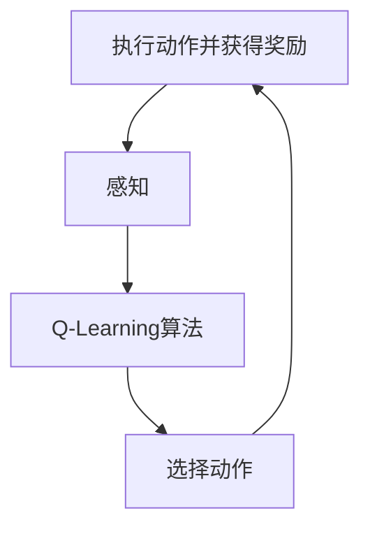
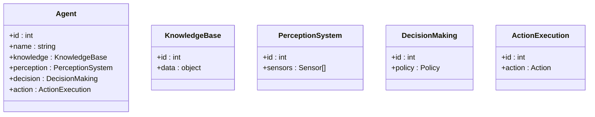
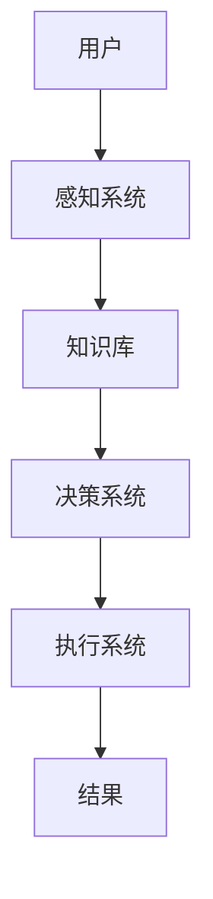
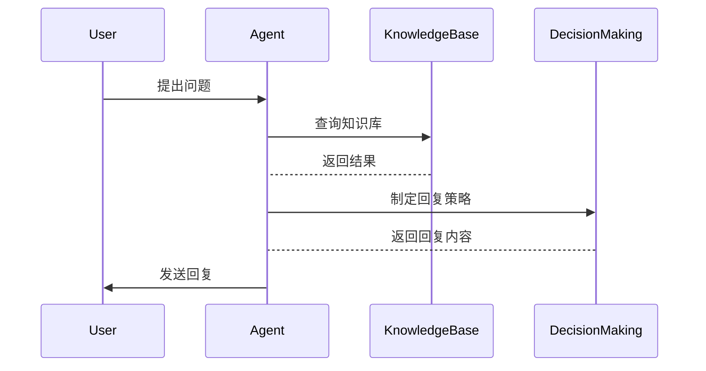

                 


# 课程学习：设计AI Agent的最优学习路径

## 关键词：AI Agent, 最优学习路径, 算法原理, 系统架构, 项目实战

## 摘要：本文将引导您系统地学习设计AI Agent的最优路径，涵盖从基础概念到高级算法，从系统架构到实际项目实战的完整流程。通过逐步分析，我们将深入探讨AI Agent的核心概念、算法原理、系统架构设计以及项目实现，为您提供一条清晰的学习路径。

---

## 第一部分：AI Agent 的背景与核心概念

### 第1章：AI Agent 概述

#### 1.1 AI Agent 的定义与背景
- **1.1.1 什么是 AI Agent**
  AI Agent 是一种能够感知环境并采取行动以实现目标的智能实体，具备自主性、反应性、主动性、社会性和学习性五大核心属性。
  
- **1.1.2 AI Agent 的发展背景**
  AI Agent 的概念起源于人工智能领域，随着深度学习和强化学习的快速发展，AI Agent 在自动驾驶、智能机器人、推荐系统等领域得到了广泛应用。

- **1.1.3 AI Agent 的应用场景**
  - 自动驾驶：通过感知环境和决策系统实现车辆的自主导航。
  - 智能助手：如Siri、Alexa等，能够理解用户指令并执行相应操作。
  - 游戏AI：在电子游戏中，AI Agent 可以用于实现智能NPC的行为决策。
  - 智能客服：通过自然语言处理技术为用户提供智能咨询服务。

#### 1.2 AI Agent 的核心概念
- **1.2.1 AI Agent 的基本属性**
  - 自主性：AI Agent 能够自主决策，无需外部干预。
  - 反应性：能够实时感知环境并做出反应。
  - 主动性：能够主动采取行动以实现目标。
  - 社会性：能够在多智能体环境中与其他 Agent 或人类进行交互。
  - 学习性：具备从经验中学习和改进的能力。

- **1.2.2 AI Agent 的功能模块**
  - 知识表示：用于存储和处理 Agent 的知识库。
  - 感知系统：负责从环境中获取信息。
  - 决策系统：基于感知信息做出行动决策。
  - 行动执行：将决策转化为具体行动。
  - 学习模块：通过经验改进性能。

- **1.2.3 AI Agent 的核心算法**
  - 强化学习：用于决策和行动选择。
  - 监督学习：用于分类和预测任务。
  - 无监督学习：用于模式识别和聚类。

### 第2章：AI Agent 的核心概念与联系

#### 2.1 AI Agent 的核心概念原理
AI Agent 的核心概念包括感知、决策、行动和学习，这些概念相互关联，共同构成 Agent 的智能行为。

#### 2.2 AI Agent 核心概念属性特征对比表
以下是 AI Agent 核心概念的属性特征对比表：

| 核心概念 | 自主性 | 反应性 | 主动性 | 社会性 | 学习性 |
|----------|--------|--------|--------|--------|--------|
| 定义     | 能够自主决策 | 能够实时感知并反应 | 能够主动采取行动 | 能够与其他 Agent 或人类交互 | 能够从经验中学习和改进 |
| 特征     | 独立性、无需外部干预 | 实时性、动态性 | 主动性、目的性 | 交互性、协作性 | 自适应性、可塑性 |

#### 2.3 AI Agent 实体关系图（ER 图）

```mermaid
erDiagram
    class Agent {
        +id : int
        +name : string
        +knowledge : KnowledgeBase
        +perception : PerceptionSystem
        +decision : DecisionMaking
        +action : ActionExecution
    }
    class KnowledgeBase {
        +id : int
        +data : object
    }
    class PerceptionSystem {
        +id : int
        +sensors : Sensor[]
    }
    class DecisionMaking {
        +id : int
        +policy : Policy
    }
    class ActionExecution {
        +id : int
        +action : Action
    }
    Agent -> KnowledgeBase : has
    Agent -> PerceptionSystem : has
    Agent -> DecisionMaking : has
    Agent -> ActionExecution : has
```

---

## 第二部分：AI Agent 的算法原理

### 第3章：AI Agent 的核心算法

#### 3.1 强化学习算法
##### 3.1.1 强化学习的基本原理
强化学习是一种通过试错机制来优化决策策略的学习方法。Agent 在环境中通过与环境交互获得奖励或惩罚，从而学习最优策略。

##### 3.1.2 Q-Learning 算法
Q-Learning 是一种经典的强化学习算法，适用于离散状态和动作空间的环境。



**数学公式：**
$$ Q(s, a) = Q(s, a) + \alpha (r + \gamma \max Q(s', a') - Q(s, a)) $$

##### 3.1.3 Deep Q-Networks (DQN) 算法
DQN 是 Q-Learning 的一种改进，通过深度神经网络近似 Q 函数。

**代码示例：**
```python
import numpy as np
import tensorflow as tf

# 定义 DQN 网络
class DQN:
    def __init__(self, state_space, action_space):
        self.state_space = state_space
        self.action_space = action_space
        self.model = self.build_model()
        
    def build_model(self):
        model = tf.keras.Sequential([
            tf.keras.layers.Dense(64, activation='relu', input_dim=self.state_space),
            tf.keras.layers.Dense(64, activation='relu'),
            tf.keras.layers.Dense(self.action_space, activation='linear')
        ])
        model.compile(optimizer='adam', loss='mse')
        return model
```

#### 3.2 监督学习算法
##### 3.2.1 监督学习的基本原理
监督学习是一种通过标记数据训练模型，使其能够对新数据做出预测的学习方法。

##### 3.2.2 线性回归算法
线性回归用于预测连续型目标变量。

**数学公式：**
$$ y = \beta_0 + \beta_1 x + \epsilon $$

##### 3.2.3 支持向量机 (SVM) 算法
SVM 用于分类和回归任务，通过寻找最优超平面实现。

**代码示例：**
```python
from sklearn import svm

# 训练 SVM 分类器
model = svm.SVC()
model.fit(X_train, y_train)
```

#### 3.3 无监督学习算法
##### 3.3.1 聚类分析
聚类用于将数据分成相似的群组。

##### 3.3.2 分层分析
分层分析用于数据的层次化划分。

##### 3.3.3 线性判别分析 (LDA)
LDA 用于降维和分类。

**数学公式：**
$$ \text{目标函数} = \frac{\text{类间散度}}{\text{类内散度}} $$

---

## 第三部分：AI Agent 的数学模型与公式

### 第4章：AI Agent 的数学模型与公式

#### 4.1 强化学习的数学模型
##### 4.1.1 状态空间的定义
状态空间是所有可能状态的集合。

##### 4.1.2 动作空间的定义
动作空间是所有可能动作的集合。

##### 4.1.3 奖励函数的定义
奖励函数定义了每个状态-动作对的奖励值。

##### 4.1.4 Q-Learning 的数学公式
$$ Q(s, a) = Q(s, a) + \alpha (r + \gamma \max Q(s', a') - Q(s, a)) $$

#### 4.2 监督学习的数学模型
##### 4.2.1 线性回归的数学公式
$$ y = \beta_0 + \beta_1 x + \epsilon $$

##### 4.2.2 逻辑回归的数学公式
$$ P(y=1|x) = \frac{e^{\beta_0 + \beta_1 x}}{1 + e^{\beta_0 + \beta_1 x}} $$

##### 4.2.3 支持向量机的数学公式
$$ \text{目标函数} = \frac{1}{2} \|w\|^2 + C \sum_{i=1}^n \xi_i $$

#### 4.3 无监督学习的数学模型
##### 4.3.1 K-means 聚类的数学公式
$$ \text{目标函数} = \sum_{i=1}^n \min_{c_i} \|x_i - c_i\|^2 $$

##### 4.3.2 层次聚类的数学公式
$$ \text{相似度} = \text{距离}(x_i, x_j) $$

##### 4.3.3 线性判别分析的数学公式
$$ \text{目标函数} = \frac{\text{类间散度}}{\text{类内散度}} $$

---

## 第四部分：AI Agent 的系统架构设计

### 第5章：AI Agent 的系统架构设计

#### 5.1 问题场景介绍
我们设计一个智能客服系统，其中 AI Agent 负责处理用户的咨询请求。

#### 5.2 系统功能设计
##### 5.2.1 领域模型


#### 5.3 系统架构设计
##### 5.3.1 系统架构图


#### 5.4 系统接口设计
##### 5.4.1 接口定义
- 输入接口：用户咨询请求
- 输出接口：智能回复

#### 5.5 系统交互设计
##### 5.5.1 交互流程图


---

## 第五部分：AI Agent 的项目实战

### 第6章：AI Agent 的项目实战

#### 6.1 环境安装
安装所需的库和工具：
```bash
pip install numpy tensorflow scikit-learn
```

#### 6.2 系统核心实现源代码
##### 6.2.1 强化学习实现
```python
import numpy as np
import tensorflow as tf

class AI-Agent:
    def __init__(self, state_space, action_space):
        self.state_space = state_space
        self.action_space = action_space
        self.model = self.build_model()
        
    def build_model(self):
        model = tf.keras.Sequential([
            tf.keras.layers.Dense(64, activation='relu', input_dim=self.state_space),
            tf.keras.layers.Dense(64, activation='relu'),
            tf.keras.layers.Dense(self.action_space, activation='linear')
        ])
        model.compile(optimizer='adam', loss='mse')
        return model
```

#### 6.3 代码应用解读与分析
##### 6.3.1 代码功能模块
- 感知模块：负责接收输入并提取特征。
- 决策模块：基于特征做出决策。
- 执行模块：将决策转化为具体行动。

#### 6.4 实际案例分析
##### 6.4.1 案例分析
以智能客服系统为例，详细分析系统的运行流程和代码实现。

#### 6.5 项目小结
通过本项目，我们掌握了 AI Agent 的核心算法和系统架构设计方法。

---

## 第六部分：最佳实践与小结

### 第7章：最佳实践与小结

#### 7.1 小结
- AI Agent 的设计需要综合考虑算法选择、系统架构和项目实现。
- 强化学习是实现智能决策的核心算法。
- 系统架构设计是确保系统高效运行的关键。

#### 7.2 注意事项
- 在选择算法时，需要考虑任务类型和数据特性。
- 系统架构设计需要充分考虑可扩展性和可维护性。
- 项目实现中要注意代码的可读性和规范性。

#### 7.3 拓展阅读
- 《强化学习：理论与算法》
- 《深度学习：方法与实践》
- 《系统设计的艺术》

---

## 作者

作者：AI天才研究院/AI Genius Institute & 禅与计算机程序设计艺术 /Zen And The Art of Computer Programming

---

以上就是《课程学习：设计AI Agent的最优学习路径》的完整目录和部分章节内容，希望对您有所帮助！

