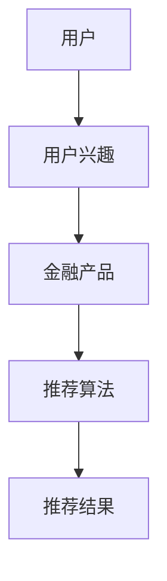
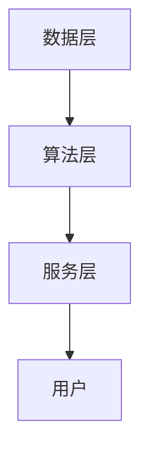

                 


# 《金融产品个性化推荐引擎》

> 关键词：金融推荐引擎，个性化推荐，协同过滤，深度学习，系统架构

> 摘要：本文深入探讨了金融产品个性化推荐引擎的设计与实现，从背景到算法，从系统架构到项目实战，全面解析了推荐引擎的核心原理与实际应用。通过详细分析不同推荐算法的优缺点，结合系统架构设计，为读者提供了一套构建高效金融推荐引擎的完整方案。

---

# 第一部分: 金融产品个性化推荐引擎背景与概述

## 第1章: 金融产品推荐引擎的背景与意义

### 1.1 金融行业的数字化转型

#### 1.1.1 传统金融业务的痛点与挑战
传统金融行业在客户服务、产品推广和风险管理方面面临诸多挑战。例如，客户体验不足、信息不对称、产品同质化严重等问题。这些问题导致客户流失率高，市场竞争力下降。

#### 1.1.2 数字化技术对金融行业的推动作用
数字化技术（如大数据、人工智能）的引入，为金融机构提供了新的解决方案。通过数据挖掘和机器学习技术，金融机构可以更精准地理解客户需求，优化产品设计和风险控制。

#### 1.1.3 个性化推荐在金融业务中的价值
个性化推荐系统能够帮助金融机构实现精准营销、提升客户满意度和忠诚度。通过推荐引擎，金融机构可以为客户提供量身定制的金融产品和服务，从而在竞争激烈的市场中占据优势。

### 1.2 个性化推荐系统的发展历程

#### 1.2.1 推荐系统的起源与演变
推荐系统起源于电子商务领域，随着技术的发展逐步扩展到金融、社交网络等多个领域。从基于规则的传统推荐到基于机器学习的智能推荐，推荐系统经历了多次演变。

#### 1.2.2 个性化推荐在金融领域的应用现状
目前，个性化推荐在金融领域的应用主要集中在产品推荐、风险管理、投资组合优化等方面。基于用户行为分析和历史交易数据，推荐系统能够为用户提供个性化的投资建议和产品推荐。

#### 1.2.3 金融产品推荐引擎的核心目标与意义
金融推荐引擎的核心目标是通过分析用户行为和市场数据，为用户提供个性化的产品推荐。其意义在于提升客户满意度、优化资源配置和提高机构的市场竞争力。

### 1.3 本章小结

#### 1.3.1 金融推荐引擎的核心价值
通过精准推荐，金融推荐引擎能够提升客户满意度和机构的市场竞争力，同时降低信息不对称带来的风险。

#### 1.3.2 本书的研究目标与内容框架
本书将从算法原理、系统架构到实际应用，全面解析金融推荐引擎的设计与实现。通过理论与实践相结合，为读者提供一套完整的解决方案。

---

## 第2章: 金融产品推荐引擎的核心概念与联系

### 2.1 金融产品推荐引擎的基本概念

#### 2.1.1 用户建模
用户建模是推荐系统的基础，主要包括用户画像和行为分析。用户画像是通过收集用户的基本信息、兴趣偏好和风险承受能力等数据，构建用户的三维模型。

#### 2.1.2 产品特征提取
产品特征提取是对金融产品的属性进行分析和提取，如产品类型、风险等级、收益预期等。这些特征将作为推荐系统的核心依据。

#### 2.1.3 推荐算法
推荐算法是推荐系统的核心，包括协同过滤、基于内容的推荐和深度学习推荐等。每种算法都有其优缺点和适用场景。

### 2.2 核心概念之间的关系

#### 2.2.1 用户与产品的关系
用户的需求和行为直接影响推荐产品的类型和策略。通过分析用户的行为数据，可以更精准地匹配适合的产品。

#### 2.2.2 推荐算法的作用机制
推荐算法通过分析用户特征和产品特征，计算用户对产品的兴趣度，从而生成推荐列表。协同过滤算法基于用户相似性，内容推荐基于产品特征，深度学习则通过神经网络建模用户行为。

#### 2.2.3 系统架构的模块划分
推荐系统通常由数据层、算法层和服务层组成。数据层负责数据的采集和处理，算法层负责推荐模型的构建和优化，服务层负责推荐结果的输出和用户交互。

### 2.3 实体关系图



### 2.4 本章小结

#### 2.4.1 核心概念的总结
推荐系统的成功依赖于用户建模、产品特征提取和推荐算法的有机结合。

#### 2.4.2 系统架构的整体理解
通过模块化设计，推荐系统能够高效地处理大量数据，提供个性化的推荐结果。

---

## 第3章: 金融产品推荐引擎的算法原理

### 3.1 协同过滤算法

#### 3.1.1 基于用户的协同过滤
基于用户的协同过滤（User-based Collaborative Filtering）是通过寻找与目标用户兴趣相似的其他用户，推荐这些用户喜欢的产品。数学模型如下：

$$
similarity(u, v) = \frac{\sum_{i} (r_ui - \bar{r_u})(r_vi - \bar{r_v})}{\sqrt{\sum_{i} (r_ui - \bar{r_u})^2} \cdot \sqrt{\sum_{i} (r_vi - \bar{r_v})^2}}
$$

其中，$\bar{r_u}$和$\bar{r_v}$分别表示用户u和v的平均评分。

#### 3.1.2 基于物品的协同过滤
基于物品的协同过滤（Item-based Collaborative Filtering）是通过分析产品之间的相似性，推荐与目标用户已购买产品相似的产品。

#### 3.1.3 混合推荐算法
混合推荐算法结合了基于用户的协同过滤和基于物品的协同过滤，通过加权的方式，综合考虑用户和产品的特征，提高推荐的准确性和多样性。

### 3.2 基于内容的推荐算法

#### 3.2.1 产品特征提取方法
基于内容的推荐算法通过提取产品的文本特征，构建产品向量表示。例如，使用TF-IDF（Term Frequency-Inverse Document Frequency）对产品描述进行特征提取。

#### 3.2.2 文本挖掘技术在推荐中的应用
文本挖掘技术可以用于分析产品的描述、评论等非结构化数据，提取有用的信息用于推荐。

#### 3.2.3 基于内容的推荐模型
基于内容的推荐模型通过计算目标用户和产品的匹配度，推荐与用户兴趣最相关的金融产品。

### 3.3 深度学习推荐算法

#### 3.3.1 基于神经网络的推荐系统
深度学习推荐系统通过构建神经网络模型，学习用户和产品的高维特征表示，从而进行推荐。

#### 3.3.2 基于注意力机制的推荐算法
注意力机制（Attention Mechanism）通过聚焦用户行为中的重要部分，提高推荐的准确性。

#### 3.3.3 基于强化学习的推荐系统
强化学习通过模拟用户行为，优化推荐策略，提高推荐系统的实时性和适应性。

### 3.4 算法对比分析

| 算法类型          | 优点                           | 缺点                           |
|-------------------|--------------------------------|--------------------------------|
| 协同过滤          | 易实现，适合中小规模数据       | 对冷启动问题敏感             |
| 基于内容的推荐     | 推荐结果可解释性强             | 对文本特征提取的依赖性高       |
| 深度学习推荐       | 高精度，适合大规模数据         | 实现复杂，计算资源消耗大       |

### 3.5 本章小结

#### 3.5.1 推荐算法的多样性
不同推荐算法在适用场景和性能上各有优劣，选择合适的算法需要结合具体需求。

#### 3.5.2 深度学习的优势
深度学习推荐系统在处理大规模数据和复杂关系时表现优异，但需要较高的计算资源和专业知识。

---

## 第4章: 金融产品推荐引擎的系统架构设计

### 4.1 系统架构概述

#### 4.1.1 数据层
数据层负责存储和管理用户数据、产品数据和交易数据。常用的数据存储技术包括关系型数据库和分布式存储系统。

#### 4.1.2 算法层
算法层负责构建推荐模型，包括特征提取、模型训练和推荐结果生成。深度学习模型通常需要大量的计算资源，可以采用分布式计算框架（如Spark、TensorFlow）进行优化。

#### 4.1.3 服务层
服务层负责接收用户的请求，调用推荐模型生成推荐结果，并将结果返回给用户。服务层通常采用微服务架构，以提高系统的可扩展性和可维护性。

### 4.2 系统功能设计

#### 4.2.1 用户画像构建
通过收集用户的基本信息、投资偏好和交易历史，构建用户画像。

#### 4.2.2 产品特征提取
通过对产品描述、风险等级和收益预期等信息进行分析，提取产品特征。

#### 4.2.3 推荐结果生成
基于用户画像和产品特征，结合推荐算法生成个性化推荐列表。

### 4.3 系统架构图



### 4.4 接口设计与交互流程

#### 4.4.1 API接口设计
推荐引擎提供RESTful API接口，供前端调用推荐结果。例如：

- `/api/recommend/users/{userId}`：根据用户ID获取推荐列表。
- `/api/products/{productId}`：根据产品ID获取产品详情。

#### 4.4.2 用户交互流程
用户登录系统后，系统会根据用户画像和产品特征生成推荐列表。用户可以查看推荐产品、查看详情和进行购买操作。

### 4.5 系统优化建议

#### 4.5.1 实时推荐
通过实时数据处理和流式计算，提高推荐的实时性。

#### 4.5.2 模型优化
定期更新推荐模型，避免模型过时和数据漂移。

#### 4.5.3 可解释性设计
通过可视化工具和日志分析，提高推荐系统的可解释性，便于用户理解和信任。

---

## 第5章: 金融产品推荐引擎的项目实战

### 5.1 项目背景与目标

#### 5.1.1 项目背景
本项目旨在开发一个基于协同过滤算法的金融产品推荐系统，帮助用户发现符合其投资偏好的产品。

#### 5.1.2 项目目标
实现一个能够根据用户历史交易数据和产品特征，生成个性化推荐列表的系统。

### 5.2 环境安装与配置

#### 5.2.1 Python环境安装
安装Python 3.8及以上版本，安装必要的库如NumPy、Pandas、Scikit-learn和Flask。

```bash
pip install numpy pandas scikit-learn flask
```

#### 5.2.2 数据库配置
使用MySQL或MongoDB存储用户和产品数据，配置连接信息。

### 5.3 核心代码实现

#### 5.3.1 数据预处理
读取数据、清洗数据和特征提取。

```python
import pandas as pd
import numpy as np

# 读取数据
df = pd.read_csv('products.csv')

# 数据清洗
df.dropna(inplace=True)
```

#### 5.3.2 推荐算法实现
基于协同过滤的推荐算法实现。

```python
from sklearn.metrics.pairwise import cosine_similarity

# 计算相似度矩阵
similarity_matrix = cosine_similarity(df['product_features'].values)
```

#### 5.3.3 API接口开发
使用Flask框架开发API接口。

```python
from flask import Flask, jsonify

app = Flask(__name__)

@app.route('/api/recommend/users/<int:user_id>', methods=['GET'])
def get_recommendations(user_id):
    # 获取推荐结果
    recommendations = get_recommendations(user_id)
    return jsonify({'recommendations': recommendations})
```

### 5.4 代码解读与分析

#### 5.4.1 数据预处理
数据预处理是推荐系统的基础，主要包括数据清洗、特征提取和数据转换。

#### 5.4.2 推荐算法实现
基于协同过滤的推荐算法通过计算用户或产品之间的相似度，生成推荐列表。相似度计算通常使用余弦相似度或欧氏距离。

#### 5.4.3 API接口开发
API接口是推荐系统与前端交互的桥梁，通过定义RESTful接口，可以方便地调用推荐结果。

### 5.5 实际案例分析

#### 5.5.1 案例背景
假设我们有一个包含10000个金融产品的数据库，用户的历史交易数据包括购买记录和偏好设置。

#### 5.5.2 数据分析与处理
通过分析用户的历史交易数据，提取用户的兴趣偏好，构建用户画像。

#### 5.5.3 推荐结果生成
基于用户的画像和产品特征，生成个性化推荐列表。

### 5.6 项目小结

#### 5.6.1 核心代码实现的关键点
- 数据预处理是推荐系统的基础。
- 推荐算法的选择和实现是系统的核心。
- API接口的设计与实现是系统的关键部分。

#### 5.6.2 项目经验总结
- 数据质量对推荐系统的性能有重要影响。
- 推荐算法的选择需要结合具体场景和数据特点。
- 系统的可扩展性和可维护性需要在设计阶段充分考虑。

---

## 第6章: 最佳实践与小结

### 6.1 最佳实践

#### 6.1.1 数据处理
- 数据清洗要彻底，避免脏数据影响推荐结果。
- 特征提取要合理，避免信息丢失和冗余。

#### 6.1.2 算法选择
- 根据具体场景和数据特点选择合适的算法。
- 多算法对比实验，选择性能最优的方案。

#### 6.1.3 系统优化
- 定期更新模型，避免过时。
- 优化系统架构，提高性能和可扩展性。

### 6.2 小结

#### 6.2.1 核心观点总结
- 个性化推荐引擎是金融数字化转型的重要工具。
- 推荐算法的选择和系统架构设计是系统成功的关键。

#### 6.2.2 未来展望
随着人工智能和大数据技术的不断发展，金融推荐引擎将更加智能化和个性化。深度学习和强化学习技术的应用将进一步提升推荐系统的性能和用户体验。

### 6.3 注意事项

#### 6.3.1 数据隐私
金融数据涉及用户隐私，必须严格遵守相关法律法规，确保数据安全和用户隐私保护。

#### 6.3.2 模型解释性
推荐系统的可解释性对于用户信任和系统优化非常重要，需要在设计阶段充分考虑。

### 6.4 拓展阅读

#### 6.4.1 推荐算法的最新研究
关注学术界最新的研究成果，了解推荐算法的发展趋势。

#### 6.4.2 金融行业的技术动态
阅读金融行业的技术报告和白皮书，了解行业最新的技术动态和发展方向。

---

# 作者：AI天才研究院/AI Genius Institute & 禅与计算机程序设计艺术 /Zen And The Art of Computer Programming

