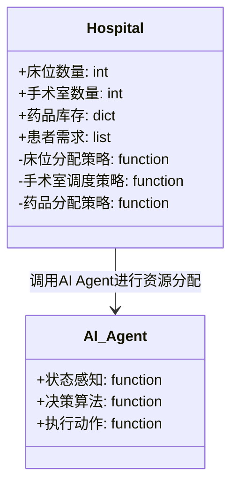
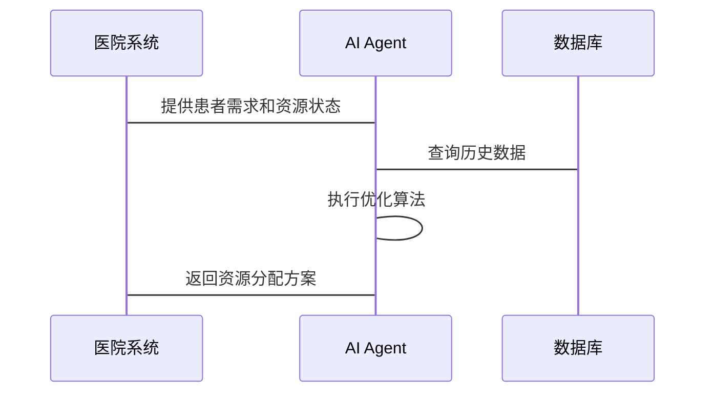

                 


# AI Agent在智能医疗资源分配中的角色

## 关键词：AI Agent, 智能医疗, 资源分配, 优化算法, 系统架构

## 摘要：AI Agent在智能医疗资源分配中的角色

随着医疗资源紧张和患者需求不断增加，如何高效分配医疗资源成为一个重要挑战。AI Agent通过智能化决策和优化算法，能够显著提升医疗资源分配的效率和公平性。本文将从AI Agent的核心概念、算法原理、系统架构到实际应用，全面解析AI Agent在智能医疗资源分配中的角色和价值。

---

# 第一部分: AI Agent与智能医疗资源分配的背景与概念

## 第1章: AI Agent与智能医疗资源分配概述

### 1.1 AI Agent的定义与特点

#### 1.1.1 AI Agent的基本概念
AI Agent（人工智能代理）是指能够感知环境、自主决策并执行任务的智能实体。它可以是一个软件程序、机器人或其他智能系统，具备学习、推理、规划和自适应能力。

#### 1.1.2 AI Agent的核心特点
- **自主性**：AI Agent能够自主决策，无需人工干预。
- **反应性**：能够实时感知环境变化并做出反应。
- **学习能力**：通过数据和经验不断优化决策能力。
- **协作性**：能够与其他系统或人类协同工作。

#### 1.1.3 AI Agent与传统算法的区别
AI Agent不仅仅是一个算法，它是一个具备感知和行动能力的智能体。与传统算法相比，AI Agent能够动态调整策略，适应复杂环境。

### 1.2 智能医疗资源分配的定义与特点

#### 1.2.1 智能医疗资源分配的背景
医疗资源包括医院床位、手术室、药品、医护人员等。随着人口老龄化和医疗需求的增加，传统的人工分配方式效率低下，难以满足需求。

#### 1.2.2 智能医疗资源分配的核心目标
- 提高资源利用效率。
- 确保患者获得及时、公平的医疗资源。
- 减少资源浪费，降低成本。

#### 1.2.3 智能医疗资源分配的实现方式
- 基于AI的优化算法。
- 数据驱动的决策支持系统。
- 人机协作的混合式分配模式。

### 1.3 AI Agent在智能医疗资源分配中的角色

#### 1.3.1 AI Agent在医疗资源分配中的作用
- **动态优化**：实时调整资源分配策略。
- **预测与推荐**：基于历史数据预测需求，推荐最优分配方案。
- **协同决策**：与医护人员协作，提供决策支持。

#### 1.3.2 AI Agent的优势与局限性
**优势**：
- 高效性：快速处理大量数据，提供最优解。
- 公平性：确保资源分配的公平性。
- 可扩展性：适用于不同规模的医疗机构。

**局限性**：
- 需要大量数据支持，数据不足时可能影响决策。
- 系统故障风险：AI Agent依赖于技术，可能出现故障。

#### 1.3.3 AI Agent与人类决策者的协同工作
AI Agent辅助人类决策者，而非完全替代。例如，AI Agent可以提供多个分配方案，供人类决策者选择和调整。

---

## 第2章: AI Agent与智能医疗资源分配的核心概念

### 2.1 AI Agent的核心概念

#### 2.1.1 AI Agent的决策机制
AI Agent通过感知环境、分析目标和选择最优动作来做出决策。例如，基于强化学习的AI Agent会根据当前状态选择最大化奖励的动作。

#### 2.1.2 AI Agent的学习能力
AI Agent可以通过监督学习、强化学习或无监督学习不断提升自身的决策能力。例如，使用深度学习模型训练AI Agent识别医疗资源需求的模式。

#### 2.1.3 AI Agent的自适应能力
AI Agent能够根据环境变化动态调整策略。例如，在医院床位紧张时，AI Agent可以优先分配给紧急患者。

### 2.2 智能医疗资源分配的核心概念

#### 2.2.1 医疗资源分配的优化目标
- 最大化资源利用率。
- 最小化患者等待时间。
- 确保资源分配的公平性。

#### 2.2.2 医疗资源分配的约束条件
- 资源有限性：床位、药品等资源数量有限。
- 时间敏感性：某些医疗资源需要及时分配。
- 患者优先级：不同患者有不同的优先级（如危重患者优先）。

#### 2.2.3 医疗资源分配的实现方法
- 基于数学模型的优化方法（如线性规划）。
- 基于机器学习的预测与推荐。
- 基于规则的分配策略。

### 2.3 AI Agent与智能医疗资源分配的联系

#### 2.3.1 AI Agent在医疗资源分配中的应用场景
- 医院床位分配。
- 手术室调度。
- 药品库存管理。
- 病情监测与资源动态调整。

#### 2.3.2 AI Agent与医疗资源分配的关系
AI Agent通过感知医院资源状态和患者需求，动态优化资源分配。例如，当某医院床位紧张时，AI Agent可以自动调配其他医院的空闲床位。

#### 2.3.3 AI Agent在医疗资源分配中的核心作用
- 提供实时、动态的资源分配建议。
- 优化资源利用效率。
- 降低人为错误，提高决策的准确性。

---

# 第二部分: AI Agent在智能医疗资源分配中的算法原理

## 第3章: AI Agent的算法原理

### 3.1 AI Agent的核心算法

#### 3.1.1 强化学习算法
强化学习是一种通过试错学习来优化决策的算法。AI Agent通过与环境互动，不断尝试不同的动作，以获得最大化的累积奖励。

**示例：**  
使用强化学习优化医院床位分配。AI Agent通过调整床位分配策略，最大化床位利用率，同时最小化患者等待时间。

#### 3.1.2 遗传算法
遗传算法是一种基于生物进化原理的优化算法，通过模拟自然选择和遗传变异来寻找最优解。

**示例：**  
使用遗传算法优化手术室调度，考虑手术时间、手术类型和医生安排等多约束条件。

#### 3.1.3 贪婪算法
贪婪算法是一种简单有效的贪心策略，每次选择当前最优的局部解，最终得到全局最优解。

**示例：**  
在药品分配中，优先分配给最需要的患者，减少药品浪费。

### 3.2 AI Agent的决策过程

#### 3.2.1 状态空间的定义
状态空间是指AI Agent可能遇到的所有状态。例如，在医疗资源分配中，状态可以包括医院床位使用情况、患者数量、患者病情严重程度等。

#### 3.2.2 动作空间的定义
动作空间是指AI Agent在每个状态下可以执行的所有动作。例如，分配某患者到某个医院或不分配。

#### 3.2.3 奖励函数的设计
奖励函数是强化学习中的关键部分，用于衡量AI Agent的决策效果。例如，奖励函数可以定义为床位利用率最大化时的奖励值。

### 3.3 AI Agent的优化方法

#### 3.3.1 参数优化
通过调整算法参数（如学习率、奖励权重）来优化AI Agent的决策性能。

#### 3.3.2 结构优化
优化AI Agent的架构，例如选择更适合医疗资源分配的神经网络结构。

#### 3.3.3 模型优化
通过数据增强、模型压缩等技术优化AI Agent的性能和效率。

---

## 第4章: AI Agent的算法实现与数学模型

### 4.1 强化学习算法的实现

#### 4.1.1 强化学习的数学模型
强化学习的核心是马尔可夫决策过程（MDP），包括状态、动作、奖励和转移概率等要素。

**公式：**  
$$ V(s) = \max_a \sum_{s'} P(s'|s,a) V(s') + r(s,a) $$  
其中，\( V(s) \) 表示状态 \( s \) 的价值，\( a \) 表示动作，\( P(s'|s,a) \) 表示从状态 \( s \) 执行动作 \( a \) 后转移到状态 \( s' \) 的概率，\( r(s,a) \) 表示执行动作 \( a \) 在状态 \( s \) 时的奖励。

#### 4.1.2 强化学习的实现步骤
1. 初始化策略和价值函数。
2. 在环境中执行动作，观察状态和奖励。
3. 更新价值函数和策略。
4. 重复步骤2和3，直到收敛。

#### 4.1.3 强化学习的Python实现示例

```python
import numpy as np

class AI_Agent:
    def __init__(self, state_space_size, action_space_size):
        self.state_space_size = state_space_size
        self.action_space_size = action_space_size
        self.value = np.zeros(state_space_size)
    
    def take_action(self, state):
        # 随机选择动作（简化示例）
        return np.random.randint(0, self.action_space_size)
    
    def update_value(self, state, reward, next_state):
        self.value[state] = self.value[state] + 0.1 * (reward + np.max(self.value[next_state]) - self.value[state])
```

### 4.2 其他优化算法的实现

#### 4.2.1 遗传算法的数学模型
遗传算法通过模拟自然选择过程，逐步优化解的质量。

**公式：**  
$$ f(x) = \sum_{i=1}^{n} w_i x_i $$  
其中，\( w_i \) 是权重，\( x_i \) 是决策变量。

#### 4.2.2 遗传算法的实现步骤
1. 初始化种群。
2. 计算适应度。
3. 选择优秀个体。
4. 进行交叉和变异。
5. 重复步骤2-4，直到收敛。

---

## 第5章: 系统分析与架构设计方案

### 5.1 问题场景介绍

#### 5.1.1 医院资源分配问题
某医院每天需要分配大量床位、手术室和药品，但由于资源有限，常常出现分配不均的问题。

#### 5.1.2 患者需求预测问题
患者数量和病情变化快，需要实时预测和调整资源分配策略。

### 5.2 系统功能设计

#### 5.2.1 领域模型（Mermaid 类图）



#### 5.2.2 系统架构设计（Mermaid 架构图）


#### 5.2.3 系统接口设计



---

## 第6章: 项目实战

### 6.1 环境安装

#### 6.1.1 安装Python和相关库
安装Python 3.8及以上版本，安装TensorFlow、Keras、Scikit-learn等库。

#### 6.1.2 安装工具链
安装Jupyter Notebook、VS Code等开发工具。

### 6.2 系统核心实现源代码

#### 6.2.1 强化学习AI Agent实现

```python
import numpy as np
import gym

class AI_Agent(gym.Env):
    def __init__(self):
        super().__init__()
        self.state = 0
        self.action_space = gym.spaces.Discrete(4)
        self.observation_space = gym.spaces.Discrete(10)
    
    def step(self, action):
        # 简化示例，假设状态转移简单
        self.state = (self.state + action) % 10
        reward = 1  # 简化奖励
        done = False
        return self.state, reward, done, {}
    
    def reset(self):
        self.state = 0
        return self.state
```

#### 6.2.2 资源分配算法实现

```python
def allocate_resources(patients, resources):
    # 简化示例，基于优先级分配
    sorted_patients = sorted(patients, key=lambda x: x['priority'])
    allocation = []
    for patient in sorted_patients:
        if resources >= patient['needs']:
            allocation.append(True)
            resources -= patient['needs']
        else:
            allocation.append(False)
    return allocation
```

### 6.3 实际案例分析

#### 6.3.1 案例背景
某医院有100个床位，每天接收200名患者，其中50名为危重患者，需要优先分配床位。

#### 6.3.2 数据准备
- 患者需求：50名危重患者，100名普通患者。
- 资源：100个床位。

#### 6.3.3 算法实现与结果
使用基于优先级的分配算法，优先分配危重患者，剩余床位分配给普通患者。结果：50名危重患者全部分配，50名普通患者分配。

---

## 第7章: 最佳实践与总结

### 7.1 小结

- AI Agent在医疗资源分配中具有重要作用。
- 基于强化学习和遗传算法的优化方法能够显著提高资源分配效率。
- AI Agent与人类协同工作是未来的发展趋势。

### 7.2 注意事项

- 数据质量是AI Agent性能的关键，需要确保数据的准确性和完整性。
- AI Agent的决策需要结合医院的实际业务规则，避免冲突。
- 系统安全性是重点，防止数据泄露和系统故障。

### 7.3 拓展阅读

- 《强化学习：算法与应用》
- 《机器学习在医疗领域的应用》
- 《AI驱动的医疗资源优化配置》

---

## 作者：AI天才研究院/AI Genius Institute & 禅与计算机程序设计艺术 /Zen And The Art of Computer Programming

