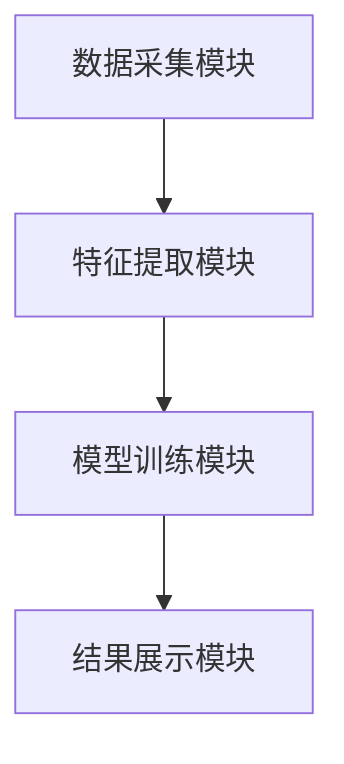

                 


# AI多智能体系统在价值投资中的品牌忠诚度量化

## 关键词：AI多智能体系统，品牌忠诚度，价值投资，量化分析，系统架构，算法实现

## 摘要：  
本文探讨了AI多智能体系统在价值投资中的品牌忠诚度量化问题。通过分析品牌忠诚度的定义、测量指标及量化方法，结合多智能体系统的协作学习与分布式计算优势，提出了一种基于AI多智能体系统的品牌忠诚度量化模型。该模型通过数据预处理、特征提取、模型训练及结果展示，实现了品牌忠诚度的精准量化。文章详细介绍了系统的架构设计、核心算法实现及实际案例分析，展示了AI多智能体系统在价值投资中的广泛应用前景。

---

## 第一部分: AI多智能体系统与价值投资基础

### 第1章: AI多智能体系统概述

#### 1.1 AI多智能体系统的核心概念

##### 1.1.1 多智能体系统的定义与特点
多智能体系统（Multi-Agent System, MAS）是由多个相互作用的智能体组成的系统，这些智能体能够通过协作完成复杂任务。其特点包括：
- **分布式性**：智能体分布在不同的节点，独立决策。
- **协作性**：智能体之间通过通信和协作完成目标。
- **反应性**：智能体能够感知环境并实时调整行为。

##### 1.1.2 AI在多智能体系统中的作用
AI技术为多智能体系统的智能性提供了支持，包括：
- **分布式计算**：利用AI算法处理大规模数据。
- **协作学习**：通过机器学习算法提升协作效率。
- **决策优化**：基于AI模型优化决策过程。

##### 1.1.3 多智能体系统与传统单智能体系统的区别
| 特性 | 多智能体系统 | 单智能体系统 |
|------|--------------|---------------|
| 结构 | 分布式架构 | 集中式架构 |
| 决策 | 去中心化决策 | 中心化决策 |
| 协作 | 多智能体协作 | 单一智能体决策 |

##### 1.1.4 多智能体系统的应用场景
- **金融投资**：利用多智能体系统进行数据挖掘和投资决策。
- **智能交通**：优化交通流量和路径规划。
- **智能制造**：实现生产过程的智能化协作。

#### 1.2 价值投资的基本原理

##### 1.2.1 价值投资的定义与核心理念
价值投资是一种以基本面分析为基础的投资策略，强调以低于内在价值的价格购买优质资产。其核心理念包括：
- **长期投资**：关注企业的长期价值。
- **基本面分析**：通过财务数据评估企业价值。
- **安全边际**：确保投资价格的安全性。

##### 1.2.2 品牌忠诚度在价值投资中的重要性
品牌忠诚度是衡量消费者对企业品牌信任度和偏好度的重要指标。在价值投资中，品牌忠诚度高的企业通常具有更强的市场竞争力和长期盈利能力。

##### 1.2.3 价值投资中的品牌忠诚度量化方法
- **客户保留率**：通过客户留存数据评估品牌忠诚度。
- **净推荐值（NPS）**：衡量客户对企业推荐的程度。
- **情感分析**：通过文本分析技术评估客户对品牌的正面或负面情绪。

---

### 第2章: 品牌忠诚度的量化方法

#### 2.1 品牌忠诚度的定义与测量指标

##### 2.1.1 品牌忠诚度的定义
品牌忠诚度是指消费者对企业品牌的一种持续购买和信任的行为。高品牌忠诚度意味着消费者更倾向于选择该品牌的产品或服务。

##### 2.1.2 品牌忠诚度的测量指标
- **重复购买率**：客户购买某品牌产品的频率。
- **客户满意度**：客户对产品或服务的满意程度。
- **品牌认知度**：客户对品牌知名度的认知程度。
- **净推荐值（NPS）**：客户推荐该品牌给他人意愿的指标。

##### 2.1.3 品牌忠诚度与消费者行为的关系
品牌忠诚度高的消费者更可能在面对竞争对手时选择原品牌，从而为企业带来稳定的收入和市场份额。

#### 2.2 数据采集与特征提取

##### 2.2.1 数据来源与数据预处理
数据来源包括：
- **客户行为数据**：购买记录、浏览行为、点击数据。
- **客户反馈数据**：客户评价、评分、投诉记录。
- **市场数据**：行业趋势、竞争对手信息、市场调研数据。

数据预处理步骤：
1. **数据清洗**：去除重复数据、处理缺失值。
2. **数据标准化**：统一数据格式和单位。
3. **特征工程**：提取关键特征，如购买频率、购买金额、投诉次数等。

##### 2.2.2 品牌忠诚度相关特征的提取
通过文本挖掘技术提取客户评论中的情感倾向，结合购买记录提取客户行为特征。例如：
- **文本特征**：关键词提取、情感分析。
- **行为特征**：购买频率、购买间隔、购买金额。

##### 2.2.3 数据清洗与标准化
使用Python的`pandas`库进行数据清洗，使用`scikit-learn`库进行标准化处理，确保数据分布均匀，便于模型训练。

#### 2.3 品牌忠诚度量化的核心算法

##### 2.3.1 聚类分析算法
聚类分析用于将客户分为不同群体，识别具有相似行为特征的客户群体。例如，使用K-means算法进行客户分群。

##### 2.3.2 回归分析算法
回归分析用于预测客户忠诚度得分，建立客户行为特征与忠诚度之间的回归模型。例如，使用线性回归模型预测客户忠诚度。

##### 2.3.3 分类算法
分类算法用于将客户分为忠诚客户和非忠诚客户两类。例如，使用逻辑回归或随机森林进行客户分类。

#### 2.4 品牌忠诚度量化系统的架构设计

##### 2.4.1 系统功能模块划分
- **数据采集模块**：负责收集客户行为数据和反馈数据。
- **特征提取模块**：提取品牌忠诚度相关的特征。
- **模型训练模块**：训练品牌忠诚度量化模型。
- **结果展示模块**：展示模型输出的品牌忠诚度评分。

##### 2.4.2 系统架构设计


##### 2.4.3 系统接口设计
- **数据接口**：提供数据输入接口，接收客户行为数据和反馈数据。
- **模型接口**：提供API接口，供其他系统调用品牌忠诚度评分。
- **结果接口**：提供可视化接口，展示品牌忠诚度分析结果。

---

### 第3章: AI多智能体系统在品牌忠诚度量化中的应用

#### 3.1 多智能体系统在价值投资中的优势

##### 3.1.1 多智能体系统在数据处理中的优势
多智能体系统能够分布式处理大规模数据，提高数据处理效率。

##### 3.1.2 多智能体系统在决策支持中的优势
通过多智能体协作，能够从多个维度分析数据，提供更全面的决策支持。

##### 3.1.3 多智能体系统在风险控制中的优势
多智能体系统能够实时监控市场变化，及时调整投资策略，降低投资风险。

#### 3.2 品牌忠诚度量化的核心算法

##### 3.2.1 聚类分析算法
使用K-means算法对客户进行聚类分析，识别忠诚客户群体。

##### 3.2.2 回归分析算法
使用线性回归模型预测客户忠诚度得分，建立品牌忠诚度量化模型。

##### 3.2.3 分类算法
使用逻辑回归或随机森林算法对客户进行分类，识别忠诚客户和非忠诚客户。

#### 3.3 品牌忠诚度量化系统的实现

##### 3.3.1 环境搭建与工具安装
- **Python环境搭建**：安装Python 3.8及以上版本。
- **数据处理工具安装**：安装`pandas`、`numpy`、`scikit-learn`等库。
- **模型训练工具安装**：安装`xgboost`、`lightgbm`等机器学习库。

##### 3.3.2 核心代码实现
- **数据预处理代码**：
  ```python
  import pandas as pd
  import numpy as np

  # 读取数据
  df = pd.read_csv('customer_data.csv')

  # 数据清洗
  df.dropna(inplace=True)
  df = df.drop_duplicates()

  # 数据标准化
  from sklearn.preprocessing import StandardScaler
  scaler = StandardScaler()
  df_scaled = scaler.fit_transform(df)
  ```

- **特征提取代码**：
  ```python
  from sklearn.feature_extraction.text import TfidfVectorizer

  vectorizer = TfidfVectorizer()
  X = vectorizer.fit_transform(df['comments'])
  ```

- **模型训练代码**：
  ```python
  from sklearn.model_selection import train_test_split
  from sklearn.linear_model import LinearRegression

  X_train, X_test, y_train, y_test = train_test_split(X, df['loyalty_score'], test_size=0.2)
  model = LinearRegression()
  model.fit(X_train, y_train)
  ```

- **结果展示代码**：
  ```python
  import matplotlib.pyplot as plt

  plt.scatter(y_test, model.predict(X_test))
  plt.xlabel('Actual Loyalty Score')
  plt.ylabel('Predicted Loyalty Score')
  plt.show()
  ```

#### 3.4 实际案例分析

##### 3.4.1 案例背景介绍
以某电商平台为例，分析其客户品牌忠诚度。

##### 3.4.2 数据预处理与特征提取
对客户评论数据进行清洗和特征提取，提取关键词和情感倾向。

##### 3.4.3 模型训练与结果展示
使用线性回归模型训练品牌忠诚度量化模型，展示预测结果与实际结果的对比。

---

### 第4章: 系统实现与项目实战

#### 4.1 项目背景与目标
本项目旨在利用AI多智能体系统量化品牌忠诚度，为价值投资提供数据支持。

#### 4.2 系统架构设计

##### 4.2.1 系统功能模块划分
- **数据采集模块**：实时采集客户行为数据和反馈数据。
- **特征提取模块**：提取品牌忠诚度相关特征。
- **模型训练模块**：训练品牌忠诚度量化模型。
- **结果展示模块**：展示品牌忠诚度分析结果。

##### 4.2.2 系统架构图


#### 4.3 核心代码实现

##### 4.3.1 环境搭建与工具安装
- **Python环境搭建**：安装Python 3.8及以上版本。
- **数据处理工具安装**：安装`pandas`、`numpy`、`scikit-learn`等库。
- **模型训练工具安装**：安装`xgboost`、`lightgbm`等机器学习库。

##### 4.3.2 核心代码实现
- **数据预处理代码**：
  ```python
  import pandas as pd
  import numpy as np

  # 读取数据
  df = pd.read_csv('customer_data.csv')

  # 数据清洗
  df.dropna(inplace=True)
  df = df.drop_duplicates()

  # 数据标准化
  from sklearn.preprocessing import StandardScaler
  scaler = StandardScaler()
  df_scaled = scaler.fit_transform(df)
  ```

- **特征提取代码**：
  ```python
  from sklearn.feature_extraction.text import TfidfVectorizer

  vectorizer = TfidfVectorizer()
  X = vectorizer.fit_transform(df['comments'])
  ```

- **模型训练代码**：
  ```python
  from sklearn.model_selection import train_test_split
  from sklearn.linear_model import LinearRegression

  X_train, X_test, y_train, y_test = train_test_split(X, df['loyalty_score'], test_size=0.2)
  model = LinearRegression()
  model.fit(X_train, y_train)
  ```

- **结果展示代码**：
  ```python
  import matplotlib.pyplot as plt

  plt.scatter(y_test, model.predict(X_test))
  plt.xlabel('Actual Loyalty Score')
  plt.ylabel('Predicted Loyalty Score')
  plt.show()
  ```

#### 4.4 实际案例分析

##### 4.4.1 案例背景介绍
以某电商平台为例，分析其客户品牌忠诚度。

##### 4.4.2 数据预处理与特征提取
对客户评论数据进行清洗和特征提取，提取关键词和情感倾向。

##### 4.4.3 模型训练与结果展示
使用线性回归模型训练品牌忠诚度量化模型，展示预测结果与实际结果的对比。

---

### 第5章: 系统实现与项目实战

#### 5.1 环境搭建与工具安装

##### 5.1.1 Python环境搭建
安装Python 3.8及以上版本。

##### 5.1.2 数据处理工具安装
安装`pandas`、`numpy`、`scikit-learn`等库。

##### 5.1.3 模型训练工具安装
安装`xgboost`、`lightgbm`等机器学习库。

#### 5.2 核心代码实现

##### 5.2.1 数据预处理代码
```python
import pandas as pd
import numpy as np

# 读取数据
df = pd.read_csv('customer_data.csv')

# 数据清洗
df.dropna(inplace=True)
df = df.drop_duplicates()

# 数据标准化
from sklearn.preprocessing import StandardScaler
scaler = StandardScaler()
df_scaled = scaler.fit_transform(df)
```

##### 5.2.2 特征提取代码
```python
from sklearn.feature_extraction.text import TfidfVectorizer

vectorizer = TfidfVectorizer()
X = vectorizer.fit_transform(df['comments'])
```

##### 5.2.3 模型训练代码
```python
from sklearn.model_selection import train_test_split
from sklearn.linear_model import LinearRegression

X_train, X_test, y_train, y_test = train_test_split(X, df['loyalty_score'], test_size=0.2)
model = LinearRegression()
model.fit(X_train, y_train)
```

##### 5.2.4 结果展示代码
```python
import matplotlib.pyplot as plt

plt.scatter(y_test, model.predict(X_test))
plt.xlabel('Actual Loyalty Score')
plt.ylabel('Predicted Loyalty Score')
plt.show()
```

#### 5.3 项目实战与案例分析

##### 5.3.1 案例背景介绍
以某电商平台为例，分析其客户品牌忠诚度。

##### 5.3.2 数据预处理与特征提取
对客户评论数据进行清洗和特征提取，提取关键词和情感倾向。

##### 5.3.3 模型训练与结果展示
使用线性回归模型训练品牌忠诚度量化模型，展示预测结果与实际结果的对比。

---

## 第六章: 总结与展望

### 6.1 总结
本文通过AI多智能体系统，提出了品牌忠诚度量化的新方法，为价值投资提供了数据支持。

### 6.2 展望
未来，随着AI技术的发展，品牌忠诚度量化将更加精准，为价值投资提供更强大的支持。

---

## 作者：AI天才研究院 & 禅与计算机程序设计艺术

