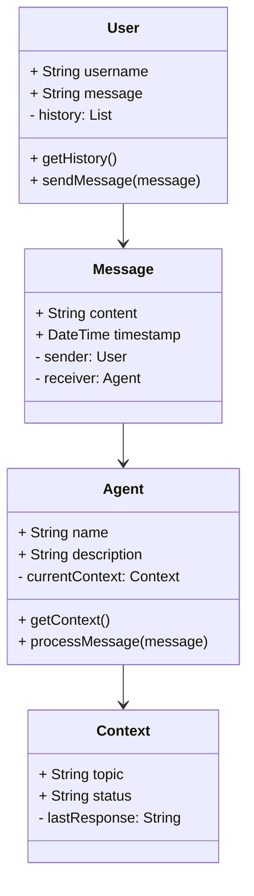
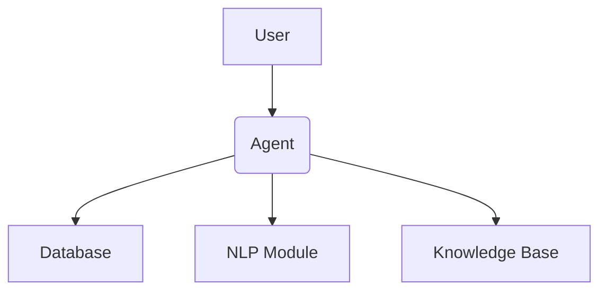
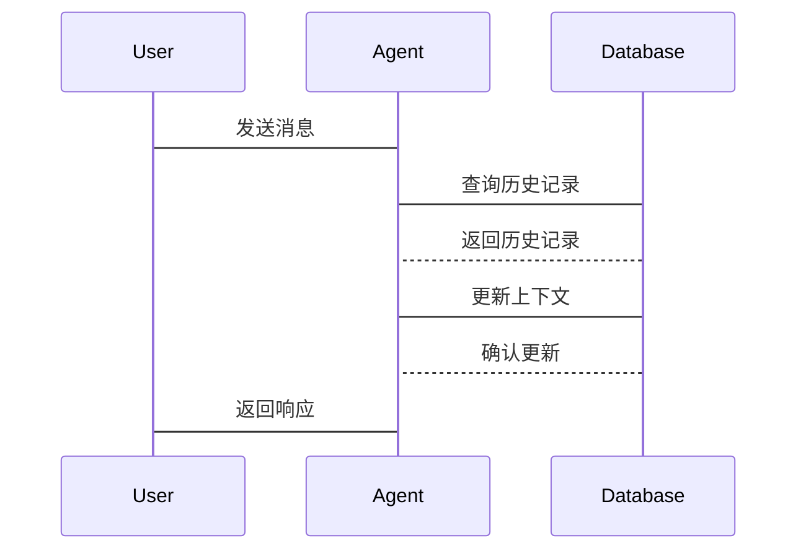

                 


# 从GPT到AI Agent：技术演进与应用变革

## 关键词：GPT, AI Agent, 人工智能, 自然语言处理, 深度学习, 技术演进

## 摘要：  
本文从GPT的起源与发展入手，详细探讨了GPT的数学模型与算法原理，以及如何演进到AI Agent。通过分析AI Agent的体系结构与实现原理，结合系统分析与架构设计方案，最后通过项目实战，全面阐述了从GPT到AI Agent的技术演进与应用变革。本文旨在为读者提供从理论到实践的全面指导，帮助读者理解并掌握AI Agent的核心技术与应用方法。

---

# 第一部分: 从GPT到AI Agent的技术背景与基础

## 第1章: GPT的起源与发展

### 1.1 GPT的核心概念

#### 1.1.1 自然语言处理的背景与挑战
自然语言处理（NLP）是人工智能领域的重要分支，旨在让计算机能够理解和生成人类语言。传统的NLP任务包括文本分类、实体识别、机器翻译等，但这些任务通常依赖于大量特征工程和规则，难以处理复杂语义和上下文关系。

#### 1.1.2 GPT模型的定义与目标
GPT（Generative Pre-trained Transformer）是一种基于Transformer架构的生成式模型，目标是通过预训练的方式学习语言的分布规律，从而能够生成自然流畅的文本。GPT的核心思想是“预训练+微调”，即在大规模通用数据上进行预训练，然后针对具体任务进行微调。

#### 1.1.3 GPT与传统NLP模型的对比
与传统NLP模型相比，GPT具有以下优势：
1. **自注意力机制**：能够捕捉长距离依赖关系。
2. **生成式模型**：能够生成新的文本，而不仅仅是分类或翻译。
3. **预训练+微调模式**：通过大规模数据预训练，降低任务-specific模型的训练成本。

**对比表格：**

| 对比项         | 传统NLP模型       | GPT模型         |
|----------------|-------------------|-----------------|
| 模型架构       | 单层或浅层网络     | 多层Transformer   |
| 任务处理       | 依赖规则和特征工程 | 基于上下文生成   |
| 训练效率       | 高任务 specificity | 低任务 specificity |
| 应用场景       | 精确任务（分类、实体识别） | 生成任务（对话、内容生成） |

### 1.2 GPT的技术基础

#### 1.2.1 语言模型的基本原理
语言模型的目标是根据给定的上下文，预测下一个词的概率分布。传统的语言模型（如n-gram模型）依赖于马尔可夫假设，即当前词的概率只依赖于前n-1个词。

#### 1.2.2 概率论与信息论在GPT中的应用
GPT基于概率论和信息论的核心思想，通过最大化生成概率来优化模型。具体来说，给定一个文本序列$x_1, x_2, ..., x_n$，语言模型的目标是最优化：
$$ P(x_1, x_2, ..., x_n) = \prod_{i=1}^{n} P(x_i | x_1, ..., x_{i-1}) $$

#### 1.2.3 深度学习与神经网络的基础
深度学习通过多层神经网络提取数据的高层次特征，能够捕捉复杂的语义信息。神经网络的训练基于梯度下降优化算法，如随机梯度下降（SGD）或Adam优化器。

### 1.3 AI Agent的基本概念

#### 1.3.1 AI Agent的定义与特征
AI Agent是一种智能体，能够感知环境、做出决策并执行动作。AI Agent的核心特征包括：
1. **反应性**：能够实时感知环境并做出反应。
2. **主动性**：能够主动采取行动，而不是仅仅被动响应。
3. **学习能力**：能够通过经验改进自身的性能。

#### 1.3.2 AI Agent与传统AI的区别
与传统AI相比，AI Agent更注重与环境的交互和自主决策能力。传统AI通常是在特定任务下运行，而AI Agent能够在动态环境中自主适应和优化。

#### 1.3.3 AI Agent的应用场景与潜力
AI Agent广泛应用于智能助手（如Siri、Alexa）、自动驾驶、智能客服等领域。其潜力在于能够通过与人类或其他系统的交互，提供更智能、更个性化的服务。

### 1.4 GPT到AI Agent的演进路径

#### 1.4.1 GPT系列模型的演进
GPT模型经历了多次迭代，从最初的GPT到GPT-2、GPT-3，模型规模和性能不断提升。GPT-3引入了更大的参数量和更复杂的架构设计。

#### 1.4.2 AI Agent的构建逻辑
AI Agent的构建逻辑包括感知、决策和执行三个模块：
1. **感知模块**：通过传感器或API获取环境信息。
2. **决策模块**：基于感知信息做出决策。
3. **执行模块**：根据决策结果执行动作。

#### 1.4.3 GPT与AI Agent的结合与融合
GPT作为生成式模型，能够为AI Agent提供强大的自然语言处理能力。通过将GPT作为AI Agent的“大脑”，可以实现更智能的对话生成和决策支持。

### 1.5 本章小结
本章从GPT的起源与发展入手，详细介绍了GPT的核心概念、技术基础以及AI Agent的基本概念。通过对比分析，揭示了GPT到AI Agent的演进路径，为后续章节的深入探讨奠定了基础。

---

## 第2章: GPT的数学模型与算法原理

### 2.1 GPT的数学基础

#### 2.1.1 概率论与信息论
概率论是GPT的理论基础，信息论则提供了衡量信息量和数据压缩的方法。通过概率论，我们可以定义语言模型的目标函数：
$$ \text{目标函数} = \log P(x_1, x_2, ..., x_n) $$

#### 2.1.2 熵与交叉熵
熵是信息论中的重要概念，表示数据的不确定性。交叉熵则用于衡量两个概率分布的差异：
$$ H(P, Q) = -\sum_{x} P(x) \log Q(x) $$

#### 2.1.3 梯度下降与优化算法
梯度下降是深度学习中常用的优化算法，用于最小化损失函数。Adam优化器结合了动量和自适应学习率，能够更快收敛。

### 2.2 GPT的核心算法

#### 2.2.1 Transformer架构
Transformer由编码器和解码器组成，通过自注意力机制捕捉长距离依赖关系。其核心公式为：
$$ \text{自注意力} = \text{softmax}\left(\frac{QK^T}{\sqrt{d_k}}\right)V $$

#### 2.2.2 自注意力机制
自注意力机制通过计算词与词之间的相关性，生成位置感知的表示。具体步骤包括：
1. **计算查询（Q）、键（K）、值（V）向量**。
2. **计算注意力权重**。
3. **加权求和得到最终表示**。

#### 2.2.3 解码器与编码器的结合
解码器通过自注意力机制生成输出序列，编码器则将输入序列转换为高维表示。两者结合可以实现高效的序列到序列映射。

### 2.3 GPT的训练过程

#### 2.3.1 预训练任务的设计
预训练任务通常包括掩码语言模型（如BERT）和生成任务（如GPT）。GPT主要采用生成任务，即根据前n-1个词生成第n个词。

#### 2.3.2 模型参数的优化
模型参数的优化通过梯度下降完成，通常使用Adam优化器。损失函数采用交叉熵损失：
$$ \text{损失函数} = -\sum_{i=1}^{n} \log P(y_i | y_1, ..., y_{i-1}) $$

#### 2.3.3 多任务学习与迁移学习
通过多任务学习，模型可以在多个任务上共享参数，提升泛化能力。迁移学习则将预训练模型应用于具体任务，减少任务-specific的训练成本。

### 2.4 GPT的数学公式推导

#### 2.4.1 自注意力机制的公式
自注意力机制的计算公式如下：
$$ \text{Attention}(Q, K, V) = \text{softmax}\left(\frac{QK^T}{\sqrt{d_k}}\right)V $$

其中：
- $Q$、$K$、$V$分别为查询、键、值向量。
- $d_k$为键的维度。

#### 2.4.2 Transformer层的计算流程
Transformer层的计算流程包括：
1. **输入嵌入**：将输入序列转换为向量表示。
2. **自注意力机制**：计算自注意力权重并生成输出。
3. **前馈网络**：通过两个全连接层进行非线性变换。

#### 2.4.3 损失函数的计算与优化
损失函数采用交叉熵损失：
$$ \text{损失函数} = -\sum_{i=1}^{n} \log P(y_i | y_1, ..., y_{i-1}) $$

优化过程使用Adam优化器：
$$ \theta_{t+1} = \theta_t - \eta \frac{\partial L}{\partial \theta_t} $$

### 2.5 本章小结
本章详细探讨了GPT的数学模型与算法原理，从概率论基础到Transformer架构，再到模型训练过程，为后续章节的系统分析与实现奠定了理论基础。

---

## 第3章: AI Agent的体系结构与实现原理

### 3.1 AI Agent的基本架构

#### 3.1.1 感知模块
感知模块通过传感器或API获取环境信息，例如用户的输入指令或环境状态。感知模块的核心是自然语言处理，可以使用GPT模型进行文本理解和生成。

#### 3.1.2 决策模块
决策模块基于感知到的信息，结合知识库或策略生成决策。决策模块可以采用强化学习或监督学习的方法进行训练。

#### 3.1.3 执行模块
执行模块根据决策结果执行具体动作，例如调用API、发送消息或控制物理设备。

### 3.2 AI Agent的核心实现

#### 3.2.1 感知模块的实现
感知模块通常包括文本解析和意图识别。例如，用户输入“我需要天气预报”，感知模块需要识别用户的意图并提取相关参数。

#### 3.2.2 决策模块的实现
决策模块需要根据感知到的信息生成合适的响应。例如，基于知识图谱或规则库生成回答。

#### 3.2.3 执行模块的实现
执行模块需要与外部系统或设备进行交互。例如，调用天气API获取天气数据并返回给用户。

### 3.3 GPT在AI Agent中的应用

#### 3.3.1 GPT作为生成模块
GPT可以用于生成自然语言回复，提升AI Agent的对话能力。

#### 3.3.2 GPT作为理解模块
GPT也可以用于文本理解，通过微调任务生成特定领域的理解模型。

### 3.4 AI Agent的体系结构

#### 3.4.1 分层架构
AI Agent通常采用分层架构，包括感知层、决策层和执行层。每一层负责不同的功能模块。

#### 3.4.2 模块化设计
模块化设计使得AI Agent易于扩展和维护。每个模块可以独立开发和测试。

#### 3.4.3 交互流程
AI Agent的交互流程包括：
1. **感知**：获取用户输入或环境信息。
2. **决策**：基于感知信息生成响应。
3. **执行**：将决策结果转化为具体动作。

### 3.5 本章小结
本章从AI Agent的基本架构出发，详细探讨了其核心实现原理，并介绍了GPT在AI Agent中的具体应用。通过分层架构和模块化设计，AI Agent能够实现复杂的功能。

---

## 第4章: 系统分析与架构设计方案

### 4.1 问题场景介绍

#### 4.1.1 项目背景
本项目旨在开发一个基于GPT的AI Agent，用于提供智能客服服务。

#### 4.1.2 项目目标
通过集成GPT模型，实现智能对话生成和任务处理。

#### 4.1.3 需求分析
1. **用户需求**：用户希望与AI Agent进行自然语言对话，获取相关信息。
2. **系统需求**：系统需要支持多轮对话，能够处理复杂查询。

### 4.2 系统功能设计

#### 4.2.1 领域模型类图
以下是系统功能的领域模型类图：



### 4.3 系统架构设计

#### 4.3.1 系统架构图
以下是系统的整体架构图：



#### 4.3.2 接口设计
1. **用户接口**：提供API供用户调用。
2. **数据库接口**：用于存储用户历史记录和系统状态。
3. **NLP接口**：用于文本生成和理解。

#### 4.3.3 交互流程
以下是交互流程的序列图：



### 4.4 本章小结
本章通过系统分析与架构设计，明确了AI Agent的实现方案。通过领域模型类图和交互序列图，展示了系统的整体结构和各部分之间的关系。

---

## 第5章: 项目实战

### 5.1 环境安装

#### 5.1.1 安装Python
```bash
python --version
pip install --upgrade pip
```

#### 5.1.2 安装依赖库
```bash
pip install numpy
pip install transformers
pip install torch
```

### 5.2 系统核心实现

#### 5.2.1 感知模块实现
```python
class PerceptionModule:
    def __init__(self):
        self.model = AutoModelForMaskedLM.from_pretrained('bert-base-uncased')
        self.tokenizer = AutoTokenizer.from_pretrained('bert-base-uncased')
    
    def perceive(self, input_text):
        inputs = self.tokenizer(input_text, return_tensors='np')
        outputs = self.model(**inputs)
        return outputs
```

#### 5.2.2 决策模块实现
```python
class DecisionModule:
    def __init__(self, knowledge_base):
        self.knowledge_base = knowledge_base
    
    def decide(self, context):
        response = self.knowledge_base.query(context)
        return response
```

#### 5.2.3 执行模块实现
```python
class ExecutionModule:
    def __init__(self, api_key):
        self.api_key = api_key
    
    def execute(self, action, params):
        # 示例：调用天气API
        if action == 'get_weather':
            response = requests.get(f'https://api.openweathermap.org/data/2.5/weather?q={params}&units=metric&appid={self.api_key}')
            return response.json()
```

### 5.3 代码应用解读与分析

#### 5.3.1 感知模块解读
感知模块使用BERT模型进行文本解析，将用户输入转换为模型可理解的向量表示。

#### 5.3.2 决策模块解读
决策模块基于知识库生成响应，可以结合规则或机器学习模型进行决策。

#### 5.3.3 执行模块解读
执行模块负责调用外部API或控制物理设备，实现具体动作。

### 5.4 实际案例分析

#### 5.4.1 案例场景
用户输入：“我需要天气预报。”

#### 5.4.2 实现步骤
1. **感知模块**：解析用户的输入，生成向量表示。
2. **决策模块**：基于知识库生成回复：“请提供您所在的城市名。”
3. **执行模块**：调用天气API获取天气数据。
4. **返回结果**：将天气数据返回给用户。

### 5.5 本章小结
本章通过一个具体的项目实战，展示了AI Agent的核心实现过程。通过代码实现和案例分析，帮助读者理解从GPT到AI Agent的技术应用。

---

## 第6章: 结论与展望

### 6.1 结论
本文从GPT的起源与发展入手，详细探讨了其数学模型与算法原理，并结合AI Agent的体系结构与实现原理，提出了一个完整的系统设计方案。通过项目实战，展示了从GPT到AI Agent的技术演进与应用变革。

### 6.2 未来展望
随着AI技术的不断发展，AI Agent将具备更强的自主决策能力和更广泛的应用场景。未来的研究方向包括：
1. **多模态交互**：结合视觉、听觉等多模态信息，提升用户体验。
2. **强化学习**：通过强化学习优化AI Agent的决策能力。
3. **人机协作**：研究AI Agent与人类的协作模式，提升团队协作效率。

---

## 作者：AI天才研究院 & 禅与计算机程序设计艺术

通过本文的详细讲解，读者可以全面理解从GPT到AI Agent的技术演进与应用变革。从理论到实践，从背景到实现，本文为读者提供了系统性的指导和启示。

