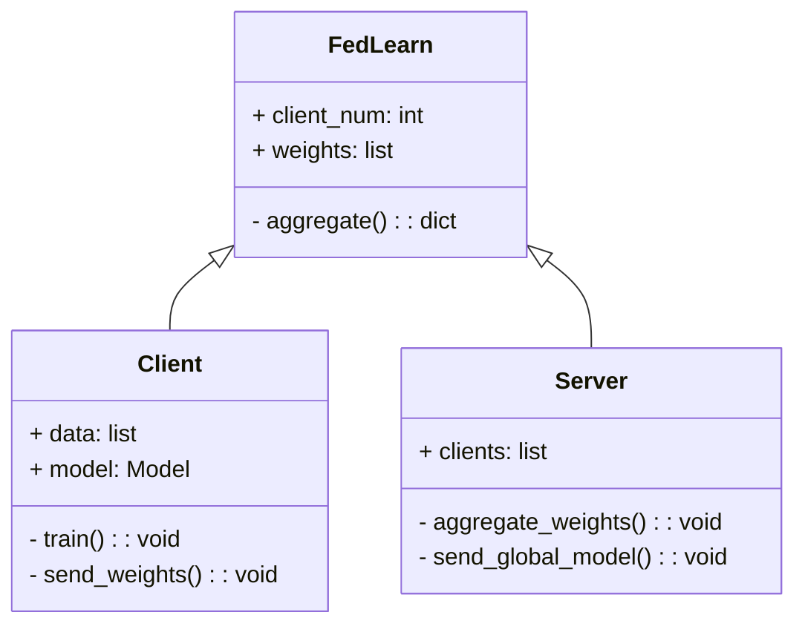
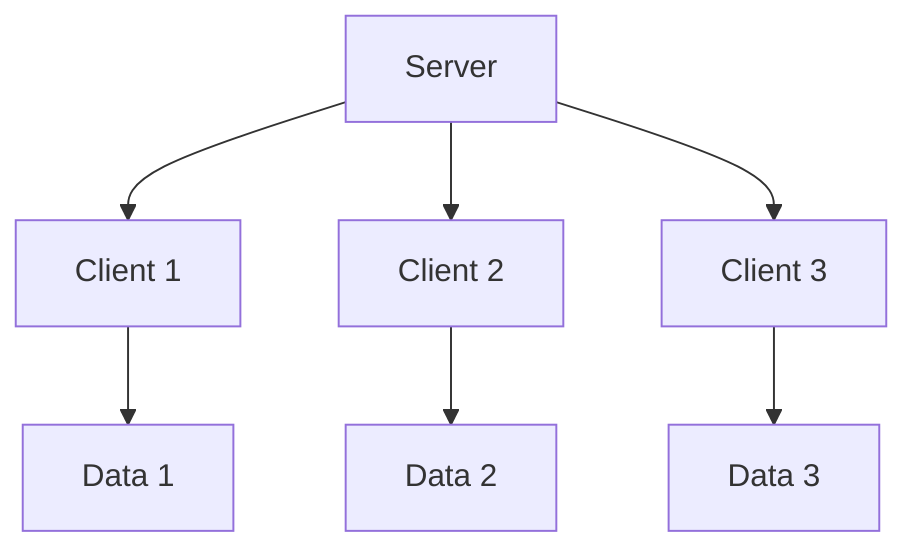
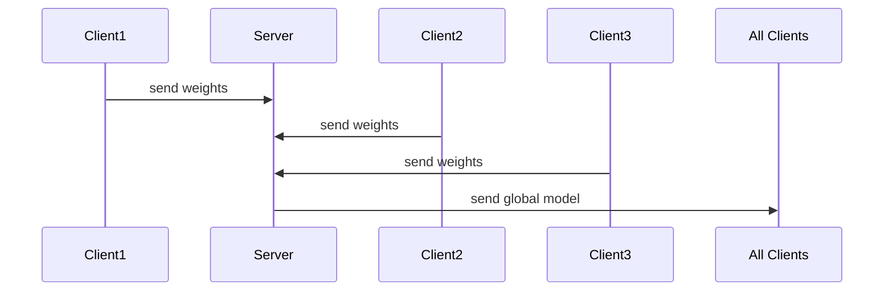

                 


# 企业AI Agent的联邦学习在跨企业数据协作中的实践

> 关键词：联邦学习，AI Agent，跨企业协作，数据隐私，分布式计算

> 摘要：本文探讨了企业AI Agent在联邦学习中的应用，分析了联邦学习的核心概念、算法原理和系统架构，并通过实际案例展示了如何在跨企业数据协作中实践联邦学习。文章还提供了代码实现、系统设计和最佳实践的建议，为读者提供了全面的技术指导。

---

## 第一部分: 企业AI Agent的联邦学习基础

### 第1章: 背景介绍

#### 1.1 问题背景

##### 1.1.1 跨企業数据协作的挑战

数据孤岛是当前企业协作中的主要挑战。许多企业拥有大量数据，但由于隐私和商业机密的原因，无法将其共享。这不仅限制了企业的创新能力，还导致资源浪费。例如，多个金融机构可能拥有相似的客户数据，但由于隐私保护的限制，无法进行联合建模。

##### 1.1.2 联邦学习的提出与意义

联邦学习（Federated Learning）作为一种分布式机器学习技术，为跨企业数据协作提供了新的解决方案。通过在各端数据源上进行局部模型训练，联邦学习能够在不共享原始数据的情况下，协同训练全局模型。企业AI Agent作为智能代理，能够在数据协作中自动化处理复杂问题，成为联邦学习的重要实现工具。

##### 1.1.3 企业AI Agent的定义与价值

企业AI Agent是能够代表企业在数据协作中进行交互的智能代理。它们能够处理数据清洗、模型训练、参数聚合等任务，同时确保数据的安全性和隐私性。企业AI Agent的价值在于其能够自动化处理数据协作中的复杂问题，降低协作成本，提高协作效率。

#### 1.2 问题描述

##### 1.2.1 数据孤岛问题

数据孤岛是指数据仅限于内部使用，无法与其他企业共享或协作。这种现象导致资源浪费，限制了企业间的数据驱动型合作。

##### 1.2.2 数据隐私与安全

数据隐私是跨企业协作中的核心问题。企业不愿意共享敏感数据，担心数据泄露或滥用。联邦学习通过局部建模和参数聚合，能够在不共享数据的情况下进行模型训练，有效保护数据隐私。

##### 1.2.3 跨企業协作的复杂性

跨企业协作涉及多个组织之间的沟通、协调和信任建立。企业AI Agent能够自动化处理这些复杂问题，简化协作流程，提升协作效率。

#### 1.3 问题解决

##### 1.3.1 联邦学习的解决方案

联邦学习通过在各端数据源上进行局部模型训练，然后将模型参数上传到中心服务器进行聚合，最终生成一个全局模型。这种技术能够有效保护数据隐私，同时实现跨企业的数据协作。

企业AI Agent在联邦学习中扮演着重要角色，它们负责数据的局部训练、模型更新和参数聚合。通过AI Agent，企业可以在不共享数据的情况下，协同训练模型，实现数据协作的目标。

##### 1.3.2 企业AI Agent的协作机制

企业AI Agent通过定义明确的协作协议，确保数据的安全性和隐私性。它们利用联邦学习的原理，实现模型的局部训练和全局聚合，同时保证数据不被泄露。

##### 1.3.3 联邦学习与AI Agent的结合

联邦学习提供了一种技术手段，而企业AI Agent提供了实现这一技术的智能代理。两者结合，能够在不共享数据的情况下，实现跨企业的数据协作，提升数据的安全性和隐私性。

#### 1.4 边界与外延

##### 1.4.1 联邦学习的适用场景

联邦学习适用于多个参与方需要协同建模，但又无法共享数据的场景。例如，医疗领域的联合诊断模型、金融领域的风险评估模型等。

##### 1.4.2 企业AI Agent的应用边界

企业AI Agent的应用边界主要在于数据协作的范围和深度。它们可以在特定领域内进行数据协作，但需要在企业级层面进行统一规划和管理。

##### 1.4.3 联邦学习与其他技术的关系

联邦学习与其他分布式计算、数据安全、人工智能等技术密切相关。例如，区块链技术可以用于联邦学习中的数据溯源和权限管理，而加密技术可以用于联邦学习中的数据保护。

#### 1.5 核心概念结构

##### 1.5.1 联邦学习的核心要素

联邦学习的核心要素包括：参与方、数据源、模型、通信协议和隐私保护机制。

##### 1.5.2 企业AI Agent的功能模块

企业AI Agent的功能模块包括：数据处理、模型训练、通信协议、隐私保护和决策优化。

##### 1.5.3 联邦学习与AI Agent的交互流程

联邦学习与AI Agent的交互流程包括：数据预处理、局部建模、参数聚合、模型更新和结果反馈。

---

## 第二部分: 联邦学习的核心概念与原理

### 第2章: 联邦学习的核心概念与原理

#### 2.1 联邦学习的原理

##### 2.1.1 联邦学习的基本概念

联邦学习是一种分布式机器学习技术，允许多个参与方在不共享原始数据的情况下，协同训练模型。这种技术通过在各端数据源上进行局部模型训练，然后将模型参数上传到中心服务器进行聚合，最终生成一个全局模型。

##### 2.1.2 联邦学习的三种模式

联邦学习主要有三种模式：横向联邦、纵向联邦和联邦模型。

- **横向联邦**：适用于数据分布相同但数据不重叠的场景，例如多个医院的患者数据。
- **纵向联邦**：适用于数据分布不同但数据特征相同的场景，例如多个金融机构的客户数据。
- **联邦模型**：适用于数据分布和特征都不同的场景，需要复杂的模型聚合策略。

##### 2.1.3 联邦学习的数学模型

联邦学习的数学模型主要基于参数平均和模型聚合。例如，联邦平均（FedAvg）是一种常用的方法，通过将各参与方的模型参数进行加权平均，生成全局模型。

$$ \theta_{t+1} = \frac{1}{n}\sum_{i=1}^{n}\phi_i(\theta_t) $$

其中，$\theta_t$ 是全局模型参数，$\phi_i$ 是第i个参与方的模型参数，$n$ 是参与方的数量。

#### 2.2 联邦学习的核心算法

##### 2.2.1 联邦平均（FedAvg）

联邦平均是一种经典的联邦学习算法，适用于横向联邦场景。算法流程如下：

1. 每个参与方在本地数据上训练模型，得到模型参数。
2. 参与方将模型参数上传到中心服务器。
3. 中心服务器对所有参与方的模型参数进行平均，生成全局模型。
4. 全局模型分发给所有参与方，进行下一轮训练。

##### 2.2.2 联邦聚合（FedAggregation）

联邦聚合是一种更通用的联邦学习算法，适用于不同类型的联邦场景。算法流程如下：

1. 每个参与方在本地数据上训练模型，得到模型参数。
2. 参与方将模型参数上传到中心服务器，同时提供参数的权重。
3. 中心服务器根据权重对模型参数进行加权聚合，生成全局模型。
4. 全局模型分发给所有参与方，进行下一轮训练。

##### 2.2.3 联邦通信协议

联邦通信协议定义了参与方之间的数据传输和模型聚合规则。常见的通信协议包括基于HTTP的RESTful API、gRPC等。通信协议需要考虑数据传输的效率、安全性和可靠性。

#### 2.3 联邦学习与AI Agent的关系

##### 2.3.1 AI Agent在联邦学习中的角色

企业AI Agent在联邦学习中扮演着数据处理、模型训练和参数聚合的重要角色。它们负责本地数据的预处理、模型的局部训练，以及与中心服务器的通信和参数聚合。

##### 2.3.2 联邦学习如何赋能AI Agent

联邦学习提供了分布式建模的技术手段，使得AI Agent能够实现跨企业的数据协作。通过联邦学习，AI Agent可以在不共享数据的情况下，协同训练模型，提升数据的安全性和隐私性。

##### 2.3.3 联邦学习与AI Agent的协同优化

联邦学习与AI Agent的协同优化主要体现在模型聚合策略和通信效率上。通过优化模型聚合算法，可以提高全局模型的准确性和训练效率。同时，通过优化通信协议，可以降低数据传输的延迟和带宽消耗。

---

## 第三部分: 联邦学习的算法原理与实现

### 第3章: 联邦学习的算法原理与实现

#### 3.1 联邦学习的算法流程

##### 3.1.1 数据预处理

数据预处理是联邦学习的第一步，主要包括数据清洗、特征提取和数据增强。例如，将文本数据进行分词处理，将图像数据进行归一化处理。

##### 3.1.2 模型初始化

模型初始化是联邦学习的起点，通常采用随机初始化或基于预训练模型的初始化。例如，使用预训练的词向量进行初始化。

##### 3.1.3 联邦聚合与更新

联邦聚合与更新是联邦学习的核心步骤，主要包括局部模型训练和参数聚合。例如，每个参与方在本地数据上训练模型，得到模型参数，然后将参数上传到中心服务器进行聚合。

##### 3.1.4 模型评估与优化

模型评估与优化是联邦学习的最后一步，主要包括模型的验证、评估指标的计算和模型的优化。例如，计算模型的准确率、召回率等指标，并根据评估结果调整模型参数。

#### 3.2 联邦学习的数学模型

##### 3.2.1 联邦平均算法（FedAvg）

$$ \theta_{t+1} = \frac{1}{n}\sum_{i=1}^{n}\phi_i(\theta_t) $$

其中，$\theta_t$ 是全局模型参数，$\phi_i$ 是第i个参与方的模型参数，$n$ 是参与方的数量。

##### 3.2.2 联邦聚合算法（FedAggregation）

$$ \theta_{t+1} = \sum_{i=1}^{n} w_i \phi_i(\theta_t) $$

其中，$w_i$ 是第i个参与方的权重，$\phi_i$ 是第i个参与方的模型参数。

#### 3.3 联邦学习的实现代码

##### 3.3.1 环境安装

要运行联邦学习代码，需要先安装必要的库：

```bash
pip install fedlearn
```

##### 3.3.2 核心代码实现

以下是一个简单的联邦平均算法实现：

```python
import fedlearn

class FedAvg:
    def __init__(self, client_num):
        self.client_num = client_num
        self.weights = [None] * client_num

    def aggregate(self):
        avg_weights = {}
        for key in self.weights[0].keys():
            total = 0
            for i in range(self.client_num):
                total += self.weights[i][key]
            avg_weights[key] = total / self.client_num
        return avg_weights

# 初始化FedAvg实例
fed_avg = FedAvg(5)
# 调用aggregate方法进行参数聚合
result = fed_avg.aggregate()
print(result)
```

---

## 第四部分: 系统分析与架构设计方案

### 第4章: 系统分析与架构设计方案

#### 4.1 问题场景介绍

假设我们有多个企业希望在不共享数据的情况下，协同训练一个客户画像模型。每个企业都有自己的客户数据，但无法直接共享。通过联邦学习，企业可以各自在本地数据上训练模型，然后将模型参数上传到中心服务器进行聚合，生成全局模型。

#### 4.2 系统功能设计

##### 4.2.1 领域模型设计

以下是领域模型设计的类图：



##### 4.2.2 系统架构设计

以下是系统架构设计的架构图：



##### 4.2.3 系统交互设计

以下是系统交互设计的序列图：



---

## 第五部分: 项目实战

### 第5章: 项目实战

#### 5.1 环境安装

安装必要的库：

```bash
pip install fedlearn
```

#### 5.2 核心代码实现

以下是联邦平均算法的实现：

```python
import fedlearn

class FedAvg:
    def __init__(self, client_num):
        self.client_num = client_num
        self.weights = [None] * client_num

    def aggregate(self):
        avg_weights = {}
        for key in self.weights[0].keys():
            total = 0
            for i in range(self.client_num):
                total += self.weights[i][key]
            avg_weights[key] = total / self.client_num
        return avg_weights

# 初始化FedAvg实例
fed_avg = FedAvg(5)
# 调用aggregate方法进行参数聚合
result = fed_avg.aggregate()
print(result)
```

#### 5.3 案例分析与实际应用

以下是一个简单的案例分析：

假设我们有三个企业，每个企业都有自己的客户数据。通过联邦学习，他们可以在不共享数据的情况下，协同训练一个客户画像模型。

1. 每个企业在本地数据上训练模型，得到模型参数。
2. 每个企业将模型参数上传到中心服务器。
3. 中心服务器对所有模型参数进行聚合，生成全局模型。
4. 全局模型分发给所有企业，用于客户画像分析。

#### 5.4 项目总结

通过联邦学习，企业可以在不共享数据的情况下，协同训练模型，提升数据的安全性和隐私性。企业AI Agent在其中扮演了重要角色，自动化处理数据协作中的复杂问题，简化协作流程，提升协作效率。

---

## 第六部分: 最佳实践与小结

### 第6章: 最佳实践与小结

#### 6.1 最佳实践

- **数据预处理**：确保数据的干净和一致性，提高模型的训练效果。
- **模型选择**：根据具体场景选择合适的模型和算法，提升模型的准确性和效率。
- **通信协议**：选择高效的通信协议，降低数据传输的延迟和带宽消耗。
- **隐私保护**：采用加密技术和访问控制，确保数据的安全性和隐私性。

#### 6.2 小结

企业AI Agent的联邦学习在跨企业数据协作中具有重要的应用价值。通过联邦学习，企业可以在不共享数据的情况下，协同训练模型，提升数据的安全性和隐私性。企业AI Agent在其中扮演了重要角色，自动化处理数据协作中的复杂问题，简化协作流程，提升协作效率。

#### 6.3 注意事项

- **数据隐私**：在跨企业数据协作中，数据隐私是核心问题，需要采用多种技术手段进行保护。
- **模型收敛**：联邦学习的模型收敛速度可能较慢，需要优化算法和参数设置。
- **通信效率**：在大规模企业协作中，通信效率是关键，需要优化通信协议和数据传输策略。

#### 6.4 拓展阅读

- **参考文献**：
  - 纵向联邦学习：[链接]
  - 横向联邦学习：[链接]
  - 联邦学习与隐私保护：[链接]

---

### 作者：AI天才研究院/AI Genius Institute & 禅与计算机程序设计艺术 /Zen And The Art of Computer Programming

