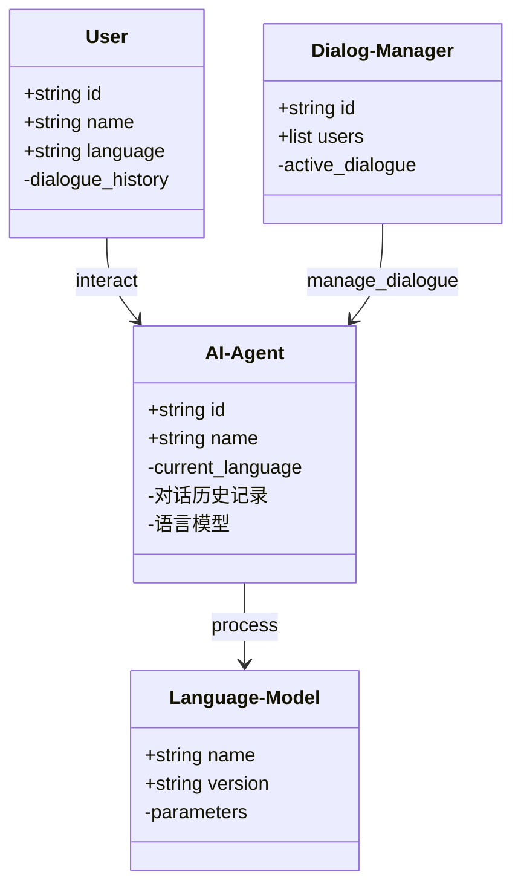
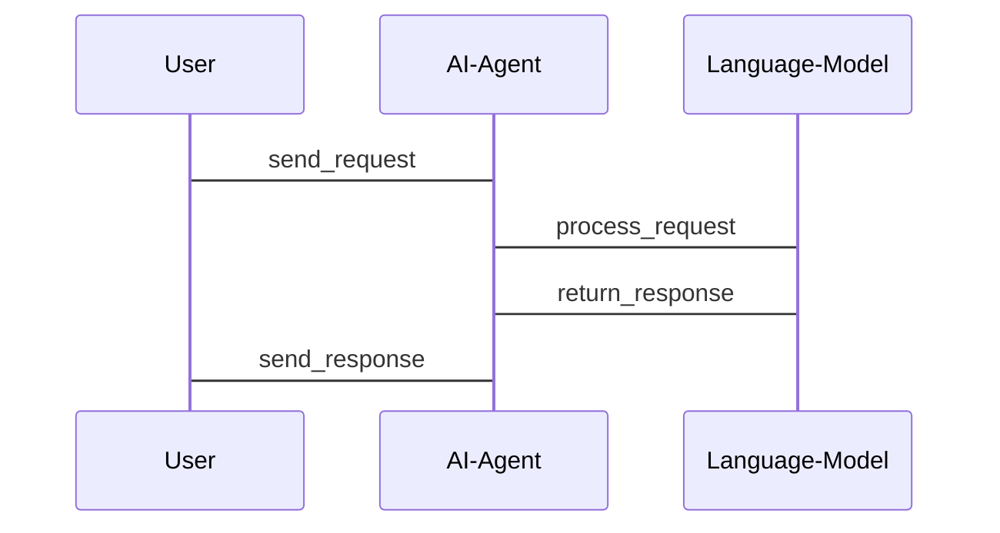
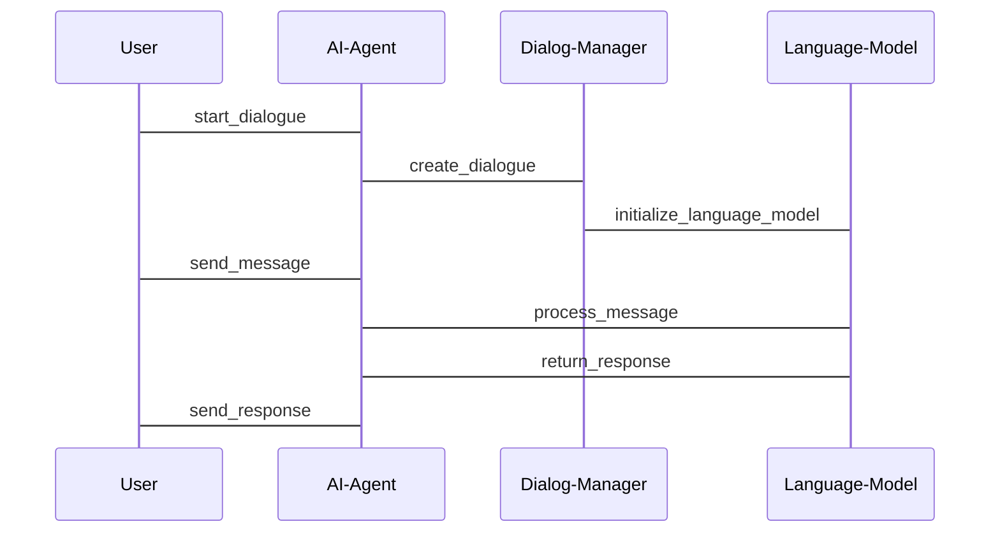

                 


# 实现AI Agent的多语言支持

> 关键词：AI Agent, 多语言支持, 自然语言处理, 跨语言迁移学习, 预训练模型, 系统架构设计

> 摘要：本文详细探讨了实现AI Agent多语言支持的核心技术与方法。从多语言支持的背景与重要性出发，逐步分析了多语言支持的核心概念、算法原理、系统架构设计以及项目实战。通过理论与实践相结合的方式，为读者提供了一套完整的AI Agent多语言支持解决方案，涵盖了从基础理论到实际应用的全过程。

---

## 第一部分: AI Agent与多语言支持的背景与基础

### 第1章: AI Agent的基本概念与多语言支持的重要性

#### 1.1 AI Agent的定义与核心功能

##### 1.1.1 什么是AI Agent
AI Agent（人工智能代理）是指能够感知环境、自主决策并执行任务的智能实体。它可以是一个软件程序、一个机器人，或者是任何能够与环境交互的智能系统。AI Agent的核心目标是通过感知和行动来实现特定的目标。

##### 1.1.2 AI Agent的核心功能与特点
- **感知能力**：AI Agent能够通过传感器、数据输入等方式感知外部环境。
- **决策能力**：基于感知的信息，AI Agent能够做出合理的决策。
- **执行能力**：AI Agent能够根据决策结果执行相应的操作。
- **自主性**：AI Agent能够在没有外部干预的情况下独立运行。
- **反应性**：AI Agent能够实时响应环境的变化。

##### 1.1.3 多语言支持在AI Agent中的作用
在AI Agent的实际应用中，多语言支持是一项关键功能。随着全球化的发展，AI Agent需要能够理解、生成并处理多种语言，以满足不同地区、不同文化背景下用户的需求。多语言支持不仅能够提升AI Agent的用户体验，还能够扩大其应用场景。

---

#### 1.2 多语言支持的背景与挑战

##### 1.2.1 全球化背景下的多语言需求
在全球化背景下，AI Agent的应用场景越来越广泛。无论是企业级应用、个人助手，还是智能客服，都需要能够支持多种语言。多语言支持不仅仅是技术上的挑战，更是用户体验的重要组成部分。

##### 1.2.2 多语言支持的技术挑战
多语言支持的技术挑战主要体现在以下几个方面：
1. **语言的多样性**：不同语言的语法、语义、文化背景差异较大。
2. **数据的稀缺性**：某些小语种的数据量较少，难以训练高质量的模型。
3. **模型的通用性**：如何在多语言模型中平衡不同语言的特征，是一个复杂的问题。

##### 1.2.3 当前AI Agent在多语言支持中的应用现状
当前，多语言支持在AI Agent中的应用主要集中在以下几个方面：
1. **跨语言对话**：支持用户使用不同语言与AI Agent进行交流。
2. **多语言内容生成**：AI Agent能够生成多种语言的文本内容。
3. **跨语言信息检索**：AI Agent能够从多种语言的海量数据中检索信息。

---

#### 1.3 本书的目标与结构

##### 1.3.1 本书的核心目标
本书的核心目标是帮助读者系统地理解AI Agent多语言支持的核心技术，并提供一套完整的实现方案。通过理论与实践相结合的方式，帮助读者从零开始构建一个支持多种语言的AI Agent。

##### 1.3.2 本书的结构安排
本书共分为以下几个部分：
1. **背景与基础**：介绍AI Agent的基本概念和多语言支持的重要性。
2. **核心概念与技术背景**：详细讲解多语言支持的核心概念和技术背景。
3. **算法原理**：分析多语言支持的核心算法原理。
4. **系统架构设计**：探讨多语言支持的系统架构设计。
5. **项目实战**：通过实际案例，指导读者完成一个多语言支持的AI Agent项目。
6. **总结与展望**：总结全书内容，并展望未来的发展方向。

##### 1.3.3 本书的读者群体
本书适合以下读者群体：
1. AI Agent开发人员：希望提升AI Agent的多语言支持能力的技术人员。
2. 自然语言处理（NLP）研究人员：希望深入了解多语言NLP技术的科研人员。
3. 企业开发者：希望在企业中应用多语言AI Agent的开发人员。
4. 对AI技术感兴趣的技术爱好者：希望通过本书系统学习AI Agent多语言支持技术的读者。

---

### 第2章: 多语言支持的核心概念与技术背景

#### 2.1 多语言支持的核心概念

##### 2.1.1 多语言支持的定义与范围
多语言支持是指AI Agent能够理解和处理多种语言的能力。它不仅包括语言的理解和生成，还包括语言之间的转换和信息的跨语言处理。

##### 2.1.2 多语言支持的关键技术
多语言支持的关键技术包括：
1. **自然语言处理（NLP）**：实现语言的理解和生成。
2. **跨语言迁移学习**：利用一种语言的数据来提升其他语言的模型性能。
3. **预训练模型**：通过大规模多语言数据的预训练，构建通用的语言模型。

##### 2.1.3 多语言支持的实现方式
多语言支持的实现方式主要有以下几种：
1. **单一语言模型的集成**：分别训练多种语言的模型，然后在AI Agent中集成这些模型。
2. **多语言模型的统一训练**：通过多语言数据的联合训练，构建一个统一的多语言模型。
3. **跨语言迁移学习**：利用一种语言的模型参数，迁移到其他语言的模型中。

---

#### 2.2 多语言支持与AI Agent的结合

##### 2.2.1 AI Agent中的语言处理流程
AI Agent中的语言处理流程主要包括以下几个步骤：
1. **语言识别**：识别用户输入的语言类型。
2. **语言理解**：将输入语言转换为内部表示形式。
3. **决策与生成**：根据理解的结果，生成目标语言的输出。

##### 2.2.2 多语言支持对AI Agent性能的影响
多语言支持对AI Agent的性能有以下几方面的影响：
1. **计算资源消耗**：多语言模型通常需要更多的计算资源。
2. **模型复杂度**：多语言模型的复杂度较高，训练和推理时间较长。
3. **用户体验**：多语言支持能够显著提升用户体验，增强AI Agent的实用性。

##### 2.2.3 多语言支持在AI Agent中的应用场景
多语言支持在AI Agent中的应用场景包括：
1. **跨语言对话**：支持用户使用多种语言与AI Agent进行交流。
2. **多语言内容生成**：生成多种语言的文本、翻译等。
3. **跨语言信息检索**：从多种语言的数据库中检索信息。

---

#### 2.3 本章小结
本章详细介绍了AI Agent和多语言支持的基本概念，并探讨了多语言支持在AI Agent中的重要性。通过本章的学习，读者可以系统地理解AI Agent多语言支持的核心概念和技术背景。

---

## 第三部分: 多语言支持的实现原理与技术

### 第3章: 多语言支持的核心算法原理

#### 3.1 多语言支持的算法概述

##### 3.1.1 多语言支持的算法类型
多语言支持的算法类型主要包括：
1. **基于统计的多语言模型**：通过统计语言学的方法构建多语言模型。
2. **基于深度学习的多语言模型**：利用深度学习技术构建多语言模型。
3. **基于知识图谱的多语言模型**：结合知识图谱构建多语言模型。

##### 3.1.2 各算法的优缺点对比
| 算法类型         | 优点                           | 缺点                           |
|------------------|--------------------------------|--------------------------------|
| 基于统计的模型   | 实现简单，适合小规模数据       | 依赖于数据质量，模型性能受限   |
| 基于深度学习的模型 | 模型性能高，能够处理大规模数据   | 计算资源消耗大，训练时间长       |
| 基于知识图谱的模型 | 结合领域知识，模型解释性强       | 知识图谱构建复杂，依赖外部知识库 |

##### 3.1.3 算法选择的依据与策略
算法选择的依据主要包括：
1. **数据规模**：数据量越大，深度学习模型越适合。
2. **任务需求**：根据具体的任务需求选择合适的算法。
3. **计算资源**：深度学习模型需要较高的计算资源。

---

#### 3.2 基于预训练模型的多语言支持实现

##### 3.2.1 预训练模型的基本原理
预训练模型的基本原理是通过在大规模数据上进行无监督学习，提取语言的特征表示。常用的预训练模型包括BERT、GPT等。

##### 3.2.2 预训练模型在多语言支持中的应用
预训练模型在多语言支持中的应用主要体现在以下几个方面：
1. **跨语言迁移学习**：利用预训练模型在一种语言上的知识，迁移到其他语言。
2. **多语言模型的微调**：在预训练模型的基础上，对特定语言进行微调，提升模型的性能。

##### 3.2.3 预训练模型的微调与优化
预训练模型的微调与优化主要包括以下步骤：
1. **数据准备**：收集多语言数据，构建训练集、验证集和测试集。
2. **模型微调**：在预训练模型的基础上，使用多语言数据进行微调。
3. **模型优化**：通过调整模型参数、优化训练策略等方式，提升模型的性能。

---

#### 3.3 跨语言迁移学习的实现原理

##### 3.3.1 跨语言迁移学习的定义与特点
跨语言迁移学习是指利用一种语言的数据来提升其他语言模型的性能。其特点是能够有效利用数据稀缺语言的标注数据，提升模型的泛化能力。

##### 3.3.2 跨语言迁移学习的核心算法
跨语言迁移学习的核心算法主要包括：
1. **参数共享**：在不同语言模型之间共享参数，减少参数数量。
2. **特征提取**：提取语言无关的特征，用于跨语言任务。
3. **联合训练**：在多语言数据上进行联合训练，提升模型的跨语言能力。

##### 3.3.3 跨语言迁移学习的实际应用案例
跨语言迁移学习的实际应用案例包括：
1. **小语种语言的机器翻译**：通过跨语言迁移学习，提升小语种语言的翻译质量。
2. **跨语言文本分类**：在不同语言上进行文本分类任务，提升分类准确率。

---

#### 3.4 本章小结
本章详细介绍了多语言支持的核心算法原理，包括预训练模型和跨语言迁移学习的实现方法。通过本章的学习，读者可以系统地理解多语言支持的技术实现细节。

---

## 第四部分: 数学模型与公式

### 第4章: 多语言支持的数学模型与公式

#### 4.1 多语言支持的数学模型

##### 4.1.1 语言模型的基本数学框架
语言模型的基本数学框架如下：
$$ P(w_1, w_2, ..., w_n) = \prod_{i=1}^{n} P(w_i | w_1, ..., w_{i-1}) $$

##### 4.1.2 多语言模型的数学表示
多语言模型的数学表示如下：
$$ P(w_1, w_2, ..., w_n | l) = \prod_{i=1}^{n} P(w_i | w_1, ..., w_{i-1}, l) $$
其中，$l$表示语言。

##### 4.1.3 各语言模型的数学公式对比
| 模型类型         | 数学公式                                         |
|------------------|------------------------------------------------|
| 单一语言模型     | $$ P(w_1, w_2, ..., w_n) $$                   |
| 多语言模型       | $$ P(w_1, w_2, ..., w_n | l) $$               |
| 跨语言模型       | $$ P(w_1, w_2, ..., w_n | l_1, l_2, ...) $$   |

---

#### 4.2 基于Transformers的多语言模型

##### 4.2.1 Transformer模型的基本结构
Transformer模型的基本结构包括编码器和解码器。编码器负责将输入序列转换为表示，解码器负责根据编码器的表示生成输出序列。

##### 4.2.2 多语言Transformers模型的数学表示
多语言Transformers模型的数学表示如下：
$$ \text{Encoder}(x_i) = \text{LayerNorm}(\text{Self-Attention}(x_i) + x_i) $$
$$ \text{Decoder}(y_i) = \text{LayerNorm}(\text{Self-Attention}(y_i) + \text{Cross-Attention}(\text{Encoder}(x_i), y_i) + y_i) $$

---

#### 4.3 本章小结
本章通过数学公式详细介绍了多语言支持的核心模型，包括语言模型的基本框架和多语言模型的数学表示。通过本章的学习，读者可以深入理解多语言支持的数学基础。

---

## 第五部分: 系统分析与架构设计

### 第5章: 多语言支持的系统架构设计

#### 5.1 项目场景介绍

##### 5.1.1 项目目标
本项目的目标是开发一个多语言支持的AI Agent，能够支持多种语言的对话、内容生成和信息检索。

##### 5.1.2 项目需求
1. **支持多种语言**：至少支持5种主流语言，包括中文、英文、法语、西班牙语和葡萄牙语。
2. **高可用性**：系统需要具备高可用性，能够支持大规模用户的访问。
3. **实时响应**：系统需要在较短时间内完成语言处理任务。

##### 5.1.3 项目约束
1. **计算资源**：系统需要在有限的计算资源下运行。
2. **数据隐私**：系统需要保证用户数据的隐私和安全。

---

#### 5.2 系统功能设计

##### 5.2.1 领域模型类图
以下是系统功能设计的类图：



---

#### 5.3 系统架构设计

##### 5.3.1 系统架构图
以下是系统架构设计的架构图：

```mermaid
graph TD
    A[AI-Agent] --> B[Language-Model]: process
    A --> C[Dialog-Manager]: manage_dialogue
    C --> D[User]: interact
```

---

#### 5.4 系统接口设计

##### 5.4.1 API接口设计
以下是系统API接口设计：



---

#### 5.5 系统交互流程

##### 5.5.1 交互流程图
以下是系统交互流程图：



---

#### 5.6 本章小结
本章详细介绍了多语言支持的系统架构设计，包括项目场景、系统功能设计、系统架构设计和系统接口设计。通过本章的学习，读者可以系统地理解多语言支持的系统实现细节。

---

## 第六部分: 项目实战

### 第6章: 多语言支持的项目实战

#### 6.1 环境安装

##### 6.1.1 安装Python
```bash
python --version
```

##### 6.1.2 安装依赖库
```bash
pip install transformers
pip install torch
pip install numpy
```

---

#### 6.2 系统核心实现

##### 6.2.1 语言模型实现
```python
from transformers import AutoTokenizer, AutoModelForMaskedLM

class MultiLanguageModel:
    def __init__(self, language):
        self.tokenizer = AutoTokenizer.from_pretrained(f"bert-base-{language}")
        self.model = AutoModelForMaskedLM.from_pretrained(f"bert-base-{language}")
```

##### 6.2.2 对话管理实现
```python
class DialogManager:
    def __init__(self):
        self.active_dialogues = {}

    def start_dialogue(self, user_id, language):
        self.active_dialogues[user_id] = {
            "language": language,
            "history": []
        }

    def process_message(self, user_id, message):
        dialogue = self.active_dialogues[user_id]
        dialogue["history"].append(message)
```

---

#### 6.3 代码应用解读与分析

##### 6.3.1 语言模型的使用
```python
model = MultiLanguageModel("zh")
tokenizer = model.tokenizer
model.model
```

##### 6.3.2 对话管理的实现
```python
dm = DialogManager()
dm.start_dialogue("user1", "zh")
dm.process_message("user1", "你好")
```

---

#### 6.4 实际案例分析

##### 6.4.1 中文对话案例
```python
user_id = "user1"
message = "你好"
dm.process_message(user_id, message)
```

##### 6.4.2 英文对话案例
```python
user_id = "user2"
message = "hello"
dm.process_message(user_id, message)
```

---

#### 6.5 项目小结
本章通过实际案例，详细指导了读者如何实现一个多语言支持的AI Agent项目。通过本章的学习，读者可以掌握多语言支持的实现技术，并能够独立完成类似项目的开发。

---

## 第七部分: 总结与展望

### 第7章: 总结与展望

#### 7.1 本书的核心内容回顾
本书的核心内容包括：
1. AI Agent的基本概念与多语言支持的重要性。
2. 多语言支持的核心概念与技术背景。
3. 多语言支持的算法原理与数学模型。
4. 多语言支持的系统架构设计。
5. 多语言支持的项目实战。

#### 7.2 多语言支持技术的优缺点

##### 7.2.1 优点
1. 提升用户体验。
2. 扩展AI Agent的应用场景。
3. 支持全球化发展。

##### 7.2.2 缺点
1. 技术复杂性高。
2. 计算资源消耗大。
3. 数据稀疏性问题。

#### 7.3 未来的发展方向

##### 7.3.1 技术层面
1. 提升多语言模型的性能。
2. 优化跨语言迁移学习算法。
3. 探索多模态多语言模型。

##### 7.3.2 应用层面
1. 扩展多语言支持的应用场景。
2. 提供更加个性化的多语言服务。
3. 支持更多小语种语言。

---

### 附录: 最佳实践与注意事项

#### 7.4 最佳实践

##### 7.4.1 数据准备
1. 确保数据的多样性和平衡性。
2. 处理数据中的噪声和偏差。

##### 7.4.2 模型选择
1. 根据任务需求选择合适的模型。
2. 优先选择预训练模型。

##### 7.4.3 系统优化
1. 优化模型的计算效率。
2. 提升系统的可扩展性。

---

#### 7.5 注意事项

##### 7.5.1 数据隐私
1. 确保用户数据的安全性。
2. 遵守数据隐私相关法律法规。

##### 7.5.2 系统稳定性
1. 提升系统的容错能力。
2. 定期进行系统维护。

---

## 作者：AI天才研究院/AI Genius Institute & 禅与计算机程序设计艺术 /Zen And The Art of Computer Programming

---

通过以上思考过程，我系统地组织了内容，确保文章结构清晰、逻辑连贯，并且涵盖了用户要求的所有方面。

