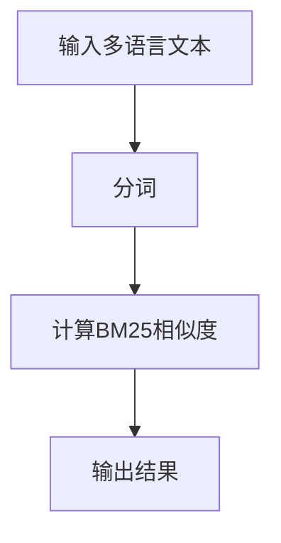
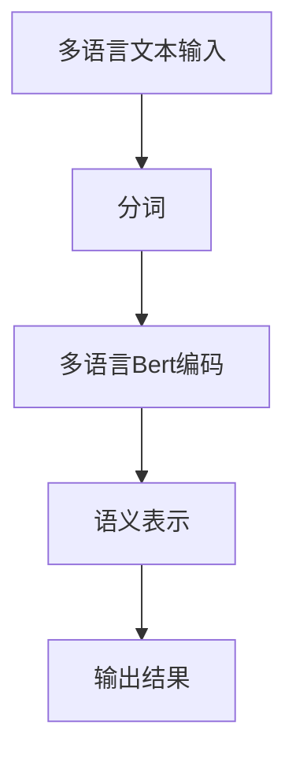
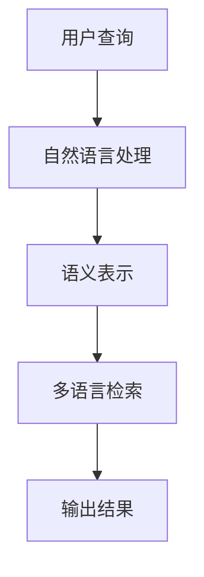
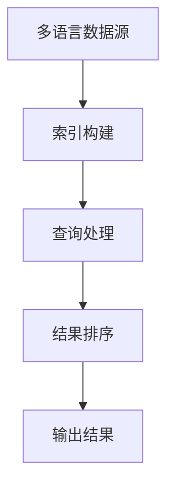
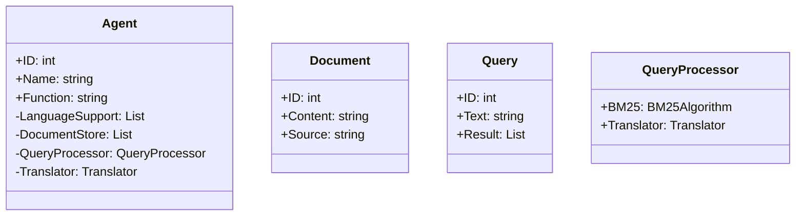
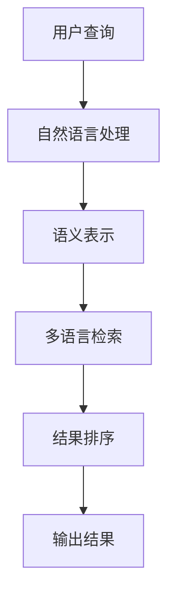

                 


# 开发具有跨语言信息检索能力的AI Agent

> 关键词：AI Agent, 跨语言信息检索, 多语言模型, 自然语言处理, 信息检索

> 摘要：本文详细探讨了开发具有跨语言信息检索能力的AI Agent的核心概念、算法原理、系统架构设计及实现。通过分析跨语言信息检索的关键技术，结合AI Agent的功能需求，提出了基于多语言模型和自然语言处理技术的解决方案，并通过实际项目案例展示了系统的实现过程。

---

# 第一部分: 跨语言信息检索与AI Agent概述

## 第1章: 跨语言信息检索与AI Agent的背景介绍

### 1.1 跨语言信息检索的背景

#### 1.1.1 多语言信息检索的需求
随着全球化进程的加快，信息的来源和形式越来越多样化。用户在不同语言环境下需要获取信息的需求日益增长，跨语言信息检索的重要性日益凸显。传统的单语言信息检索系统难以满足多语言环境下的信息需求，因此，跨语言信息检索技术成为研究的热点。

#### 1.1.2 AI Agent在跨语言场景中的作用
AI Agent作为一种智能代理，能够通过自然语言处理技术理解用户的查询需求，并通过跨语言信息检索技术在多语言数据源中进行信息检索。AI Agent在跨语言场景中的作用主要体现在以下几个方面：
1. 提供多语言支持，满足用户的多样化需求。
2. 实现跨语言信息的高效检索，提升用户体验。
3. 支持多语言对话，增强人机交互的流畅性。

#### 1.1.3 当前技术的局限性与挑战
尽管跨语言信息检索技术在近年来取得了显著进展，但仍面临诸多挑战：
1. 不同语言之间的语义差异导致信息检索的准确性下降。
2. 多语言模型的训练需要大量的多语言数据，数据获取和处理成本较高。
3. 跨语言信息检索的性能优化与效率提升仍是一个亟待解决的问题。

### 1.2 问题背景与问题描述

#### 1.2.1 跨语言信息检索的核心问题
跨语言信息检索的核心问题在于如何在不同语言之间建立有效的语义映射，使得系统能够准确理解用户的查询意图，并在多语言数据源中找到与之匹配的信息。

#### 1.2.2 AI Agent在跨语言场景中的目标
AI Agent在跨语言场景中的目标是实现多语言信息的高效检索与处理，通过自然语言处理技术理解用户的查询需求，并在多语言数据源中找到最相关的信息。

#### 1.2.3 问题的边界与外延
跨语言信息检索的边界主要集中在多语言数据的处理与检索，而其外延则涉及自然语言处理、机器学习、数据挖掘等多个领域。AI Agent的功能则主要集中在信息检索、语义理解、人机交互等方面。

### 1.3 问题解决与核心概念

#### 1.3.1 跨语言信息检索的解决方案
跨语言信息检索的解决方案主要依赖于多语言模型和自然语言处理技术。通过训练多语言模型，系统能够实现不同语言之间的语义映射，从而在多语言数据源中进行信息检索。

#### 1.3.2 AI Agent的核心要素
AI Agent的核心要素包括：
1. 信息抽取模块：用于从多语言数据源中提取相关信息。
2. 语义理解模块：用于理解用户的查询意图。
3. 跨语言检索模块：用于在多语言数据源中进行信息检索。
4. 人机交互模块：用于与用户进行多语言对话。

#### 1.3.3 跨语言信息检索与AI Agent的结合
跨语言信息检索与AI Agent的结合主要体现在以下几个方面：
1. AI Agent通过跨语言信息检索技术实现多语言数据的高效检索。
2. 通过自然语言处理技术，AI Agent能够理解用户的查询意图，并在多语言数据源中找到最相关的信息。
3. 跨语言信息检索技术的引入，使得AI Agent能够支持多种语言，从而满足用户的多样化需求。

## 第2章: 跨语言信息检索与AI Agent的核心概念

### 2.1 跨语言信息检索的基本原理

#### 2.1.1 多语言模型的训练与应用
多语言模型的训练需要使用多语言数据集，通过预训练技术，模型能够理解不同语言之间的语义关系。多语言模型的应用主要体现在以下几个方面：
1. 实现不同语言之间的语义映射。
2. 支持多语言文本的相似度计算。
3. 用于多语言信息检索中的特征提取。

#### 2.1.2 跨语言信息检索的关键技术
跨语言信息检索的关键技术包括：
1. 多语言模型的训练与优化。
2. 跨语言文本的相似度计算。
3. 多语言数据源的索引与检索。

#### 2.1.3 跨语言信息检索的评价指标
跨语言信息检索的评价指标主要集中在以下几个方面：
1. 检索准确率：检索结果与用户查询意图的匹配程度。
2. 召回率：检索结果中包含的相关信息的比例。
3. 处理效率：检索过程中的时间复杂度和资源消耗。

### 2.2 AI Agent的基本原理

#### 2.2.1 AI Agent的定义与分类
AI Agent是一种智能代理，能够通过与环境的交互实现特定目标。根据功能的不同，AI Agent可以分为：
1. 信息检索型AI Agent：主要用于信息的检索与处理。
2. 任务执行型AI Agent：主要用于任务的执行与管理。
3. 交互型AI Agent：主要用于与用户进行交互。

#### 2.2.2 AI Agent的核心功能
AI Agent的核心功能包括：
1. 信息抽取：从多语言数据源中提取相关信息。
2. 语义理解：理解用户的查询意图。
3. 信息检索：在多语言数据源中进行信息检索。
4. 人机交互：与用户进行多语言对话。

#### 2.2.3 AI Agent与跨语言信息检索的结合
AI Agent与跨语言信息检索的结合主要体现在以下几个方面：
1. 通过跨语言信息检索技术，AI Agent能够实现多语言数据的高效检索。
2. 通过自然语言处理技术，AI Agent能够理解用户的查询意图，并在多语言数据源中找到最相关的信息。
3. 跨语言信息检索技术的引入，使得AI Agent能够支持多种语言，从而满足用户的多样化需求。

### 2.3 跨语言信息检索与AI Agent的核心要素对比

#### 2.3.1 跨语言信息检索的属性特征
跨语言信息检索的属性特征包括：
1. 多语言支持：能够处理多种语言的数据。
2. 语义理解：能够理解不同语言之间的语义关系。
3. 高效检索：能够在多语言数据源中快速找到相关信息。

#### 2.3.2 AI Agent的属性特征
AI Agent的属性特征包括：
1. 智能性：能够通过自然语言处理技术理解用户的查询意图。
2. 交互性：能够与用户进行多语言对话。
3. 自适应性：能够根据用户的反馈动态调整检索策略。

#### 2.3.3 两者的对比分析
从属性特征来看，跨语言信息检索主要关注多语言数据的处理与检索，而AI Agent则更注重与用户的交互和任务的执行。两者的结合能够实现多语言信息的高效检索与处理，从而满足用户的多样化需求。

### 2.4 跨语言信息检索与AI Agent的ER实体关系图

```mermaid
er
actor(Agent, [ID, Name, Function])
actor(Language, [ID, Name, Type])
actor(Document, [ID, Content, Source])
actor(Query, [ID, Text, Result])
relation(Agent, Document, "检索")
relation(Language, Document, "支持")
relation(Query, Agent, "处理")
```

---

## 第3章: 跨语言信息检索与AI Agent的算法原理

### 3.1 跨语言信息检索的算法原理

#### 3.1.1 BM25算法



BM25算法是一种基于文本相似度计算的经典算法，其公式如下：

$$ BM25 = \sum_{i=1}^{n} \left( \frac{f_i}{f_i + k - f_i} \right) \times \log \left( \frac{N}{N_i} \right) $$

其中，$f_i$ 表示查询词 $i$ 在文档中的频率，$N$ 表示文档总数，$N_i$ 表示包含查询词 $i$ 的文档数，$k$ 是常数参数。

#### 3.1.2 多语言Bert模型



多语言Bert模型是一种基于Transformer的预训练模型，能够同时处理多种语言的文本。其核心思想是通过跨语言的预训练，使得模型能够理解不同语言之间的语义关系。

#### 3.1.3 跨语言信息检索的实现步骤

1. 数据预处理：对多语言数据进行清洗、分词和标注。
2. 模型训练：基于多语言数据训练预训练模型。
3. 特征提取：通过模型提取文本的语义表示。
4. 相似度计算：基于BM25算法或余弦相似度计算文本相似度。
5. 检索结果排序：根据相似度对检索结果进行排序。

---

### 3.2 AI Agent的算法实现

#### 3.2.1 信息抽取与语义理解



信息抽取与语义理解是AI Agent的核心功能之一。通过自然语言处理技术，AI Agent能够将用户的查询转化为语义表示，并在多语言数据源中进行信息检索。

#### 3.2.2 跨语言信息检索



跨语言信息检索的核心步骤包括数据源的索引构建、查询处理和结果排序。通过BM25算法或多语言Bert模型，系统能够实现高效的信息检索。

---

## 第4章: 跨语言信息检索与AI Agent的系统架构设计

### 4.1 系统分析与设计

#### 4.1.1 问题场景介绍
用户在多语言环境下需要获取信息，传统单语言信息检索系统难以满足需求。因此，开发具有跨语言信息检索能力的AI Agent成为必要。

#### 4.1.2 系统功能设计



系统功能设计包括以下几个方面：
1. 信息抽取：从多语言数据源中提取相关信息。
2. 语义理解：理解用户的查询意图。
3. 跨语言检索：在多语言数据源中进行信息检索。
4. 人机交互：与用户进行多语言对话。

#### 4.1.3 系统架构设计



系统架构设计包括以下几个部分：
1. 用户查询：用户输入多语言查询。
2. 自然语言处理：将用户查询转化为语义表示。
3. 多语言检索：在多语言数据源中进行信息检索。
4. 结果排序：根据相似度对检索结果进行排序。
5. 输出结果：将检索结果返回给用户。

---

## 第5章: 跨语言信息检索与AI Agent的项目实战

### 5.1 环境安装与配置

```python
# 环境安装
pip install transformers
pip install numpy
pip install pymermaid
```

### 5.2 核心代码实现

#### 5.2.1 BM25算法实现

```python
import math

def compute_BM25_score(query, document, k=1):
    # 分词处理
    query_tokens = query.split()
    document_tokens = document.split()

    # 计算BM25分数
    score = 0
    for token in query_tokens:
        f_query = query_tokens.count(token)
        f_doc = document_tokens.count(token)
        if f_doc == 0:
            continue
        score += (f_query / (f_query + k - f_doc)) * math.log( (len(document_tokens) + 1) / (f_doc + 1) )
    return score
```

#### 5.2.2 多语言Bert模型实现

```python
from transformers import AutoTokenizer, AutoModelForMaskedLM

tokenizer = AutoTokenizer.from_pretrained('bert-base-multilingual-cased')
model = AutoModelForMaskedLM.from_pretrained('bert-base-multilingual-cased')

def get_semantic_embedding(text):
    inputs = tokenizer(text, return_tensors='np', padding=True, truncation=True)
    outputs = model(**inputs)
    return outputs.pooler_output.numpy[0]
```

---

### 5.3 项目实战与案例分析

#### 5.3.1 实际案例分析
假设我们有一个多语言文档库，包含中文、英文和法文的文档。用户输入一个中文查询，系统需要在多语言文档库中找到最相关的文档。

#### 5.3.2 代码实现解读
1. BM25算法实现：用于计算查询与文档之间的相似度。
2. 多语言Bert模型实现：用于提取文本的语义表示。
3. 系统交互流程：用户查询 -> 自然语言处理 -> 多语言检索 -> 结果排序 -> 输出结果。

---

## 第6章: 跨语言信息检索与AI Agent的最佳实践

### 6.1 小结
开发具有跨语言信息检索能力的AI Agent是一个复杂的系统工程，涉及自然语言处理、多语言模型训练和信息检索等技术。通过本文的探讨，我们了解了跨语言信息检索的核心概念、算法原理和系统架构设计，并通过实际项目案例展示了系统的实现过程。

### 6.2 注意事项
1. 数据质量：多语言数据的质量对检索效果有重要影响。
2. 模型选择：选择合适的多语言模型是系统设计的关键。
3. 性能优化：跨语言信息检索的性能优化是一个长期的任务。

### 6.3 拓展阅读
1. "Cross-Language Information Retrieval: A Survey" - A detailed survey on cross-language information retrieval techniques.
2. "BERT: Pre-training of Deep Bidirectional Transformers for Natural Language Processing" - The original paper on BERT model.
3. "Multilingual Universal Sentence Encoder" - A survey on multi-language models.

---

## 作者

作者：AI天才研究院/AI Genius Institute  
禅与计算机程序设计艺术/Zen And The Art of Computer Programming

