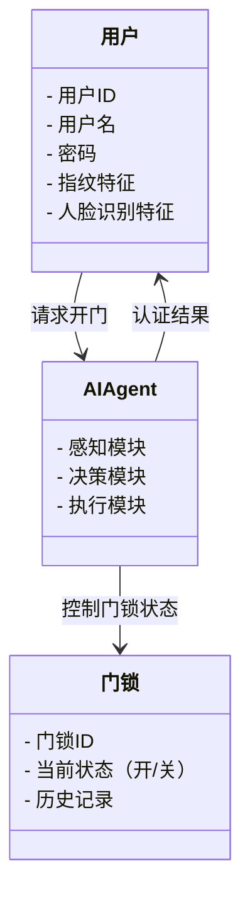

                 


# 智能门锁：AI Agent的多因素认证系统

> 关键词：智能门锁，AI Agent，多因素认证，生物特征识别，行为分析，系统架构

> 摘要：智能门锁作为智能家居的重要组成部分，近年来随着人工智能技术的发展，逐渐引入AI Agent技术，结合多因素认证，显著提升了安全性与便利性。本文从AI Agent的基本原理出发，详细探讨其在智能门锁中的应用，涵盖多因素认证技术、系统设计与实现、项目实战、安全与优化等多个方面，全面解析智能门锁的AI Agent多因素认证系统。

---

## 第1章: 智能门锁与AI Agent概述

### 1.1 智能门锁的发展背景

#### 1.1.1 传统门锁的局限性
传统门锁主要依赖机械钥匙或简单的密码输入，存在以下问题：
- 易被复制：机械钥匙可以被复制，密码也容易被猜测或暴力破解。
- 安全性低：一旦钥匙丢失或密码泄露，安全性受到威胁。
- 使用不便：需要携带钥匙，或记忆复杂的密码。

#### 1.1.2 智能门锁的定义与特点
智能门锁是一种结合了电子技术、通信技术和人工智能技术的门禁系统。其特点包括：
- 远程控制：通过手机APP或其他远程设备实现开关门。
- 多因素认证：结合生物特征识别（如指纹、人脸识别）和行为分析，提升安全性。
- 自适应学习：AI Agent能够根据用户行为自适应调整认证策略。

#### 1.1.3 AI Agent在智能门锁中的作用
AI Agent（智能代理）是一种能够感知环境、自主决策并执行任务的智能体。在智能门锁中，AI Agent负责：
- **感知环境**：通过传感器和摄像头收集用户行为数据。
- **分析数据**：利用机器学习算法识别用户的特征和行为模式。
- **决策与执行**：根据分析结果，决定是否允许用户开门，并记录相关日志。

### 1.2 多因素认证技术的引入

#### 1.2.1 多因素认证的基本概念
多因素认证（Multi-Factor Authentication, MFA）是指结合多种不同认证方式（如生物特征识别、行为分析、密码等）来验证用户身份的技术。其优势在于即使一种认证方式被破解，其他因素仍然能够提供额外的安全保障。

#### 1.2.2 多因素认证的优势
- **安全性高**：结合多种认证方式，大幅降低被破解的风险。
- **用户体验好**：通过行为分析优化认证流程，减少用户操作负担。
- **灵活性强**：可以根据需求灵活调整认证方式和策略。

#### 1.2.3 智能门锁中的多因素认证实现
在智能门锁中，多因素认证通常结合以下方式：
1. **生物特征识别**：如指纹识别、人脸识别。
2. **行为分析**：如步态识别、声音识别。
3. **动态密码**：通过手机验证码或时间同步密码提供临时认证方式。

### 1.3 本章小结
本章介绍了智能门锁的发展背景，重点阐述了AI Agent在智能门锁中的作用，并详细探讨了多因素认证技术的引入及其优势。通过结合AI Agent和多因素认证，智能门锁的安全性和便利性得到了显著提升。

---

## 第2章: AI Agent的基本原理

### 2.1 AI Agent的定义与核心要素

#### 2.1.1 AI Agent的定义
AI Agent是一种能够感知环境、自主决策并执行任务的智能体。它能够通过传感器或数据接口获取环境信息，并基于这些信息做出决策，最终通过执行器完成任务。

#### 2.1.2 AI Agent的核心要素
- **感知能力**：通过传感器或其他数据源获取环境信息。
- **决策能力**：基于感知到的信息，利用算法做出决策。
- **执行能力**：通过执行器将决策转化为具体行动。

#### 2.1.3 AI Agent的分类
AI Agent可以根据智能水平分为以下几类：
1. **反应式AI Agent**：基于当前感知做出即时反应，不依赖历史数据。
2. **认知式AI Agent**：能够理解上下文，具备推理和规划能力。
3. **混合式AI Agent**：结合反应式和认知式的特点，具备更强的适应能力。

### 2.2 AI Agent的感知与决策机制

#### 2.2.1 感知模块的作用
感知模块负责收集环境中的相关信息，如用户指纹、人脸图像、声音等。常见的感知方式包括：
- **指纹识别**：通过指纹传感器采集用户的指纹特征。
- **人脸识别**：通过摄像头采集用户的面部特征。
- **声音识别**：通过麦克风采集用户的语音特征。

#### 2.2.2 决策模块的原理
决策模块基于感知到的信息，利用机器学习算法做出认证决策。常见的决策算法包括：
- **决策树**：通过树状结构对特征进行分类。
- **支持向量机（SVM）**：用于分类任务的算法。
- **神经网络**：通过深度学习模型进行特征识别。

#### 2.2.3 执行模块的功能
执行模块负责根据决策结果执行具体操作，如：
- **开门**：当认证成功时，控制门锁打开。
- **报警**：当检测到异常行为时，触发报警机制。

### 2.3 AI Agent的数学模型与算法

#### 2.3.1 基于概率的决策模型
基于概率的决策模型通常采用贝叶斯定理，计算某个事件发生的概率。例如，指纹识别可以通过计算指纹特征的概率分布来判断是否为同一人。

公式：
$$ P(A|B) = \frac{P(B|A) \cdot P(A)}{P(B)} $$

#### 2.3.2 基于规则的决策模型
基于规则的决策模型通过预定义的规则进行决策。例如，当指纹匹配且声音识别通过时，认证成功。

规则示例：
$$ \text{如果指纹匹配且声音匹配，则认证成功} $$

#### 2.3.3 基于深度学习的决策模型
基于深度学习的决策模型通常采用卷积神经网络（CNN）或循环神经网络（RNN）进行特征提取和分类。例如，人脸识别可以使用深度学习模型进行特征提取。

### 2.4 本章小结
本章详细介绍了AI Agent的基本原理，包括感知、决策和执行模块的组成与作用，并通过数学模型和算法对决策模块进行了深入分析。AI Agent的核心在于通过感知环境、分析数据并做出决策，从而实现智能门锁的多因素认证。

---

## 第3章: 多因素认证技术的实现

### 3.1 指纹识别技术

#### 3.1.1 指纹识别的基本原理
指纹识别通过采集用户的指纹图像，并利用特征提取算法（如Gabor滤波器、SIFT算法）提取指纹特征，最后与数据库中的指纹模板进行匹配。

#### 3.1.2 指纹识别的算法实现
指纹识别的实现流程如下：
1. **图像采集**：通过指纹传感器采集指纹图像。
2. **图像预处理**：去除噪声，增强指纹特征。
3. **特征提取**：提取指纹的脊线、终点等特征。
4. **特征匹配**：将提取的特征与数据库中的模板进行匹配。

#### 3.1.3 指纹识别的优缺点
- **优点**：安全性高，误判率低。
- **缺点**：指纹容易被污损或磨损，影响识别效果。

### 3.2 人脸识别技术

#### 3.2.1 人脸识别的基本原理
人脸识别通过采集用户的面部图像，并利用特征提取算法（如PCA、LDA、深度学习）提取面部特征，最后与数据库中的面部模板进行匹配。

#### 3.2.2 人脸识别的算法实现
人脸识别的实现流程如下：
1. **图像采集**：通过摄像头采集面部图像。
2. **图像预处理**：去除噪声，调整光线条件。
3. **特征提取**：提取面部的特征，如眼睛、鼻子、嘴巴的位置。
4. **特征匹配**：将提取的特征与数据库中的模板进行匹配。

#### 3.2.3 人脸识别的优缺点
- **优点**：非接触式识别，用户友好。
- **缺点**：容易受到光线、角度等因素的影响，误判率较高。

### 3.3 其他生物特征识别技术

#### 3.3.1 声纹识别
声纹识别通过采集用户的语音特征，利用语音识别技术进行身份验证。

#### 3.3.2 静脉识别
静脉识别通过采集用户的静脉图像，利用图像处理技术进行身份验证。

#### 3.3.3 虹膜识别
虹膜识别通过采集用户的眼部虹膜图像，利用图像处理技术进行身份验证。

### 3.4 本章小结
本章详细介绍了多种生物特征识别技术，包括指纹识别、人脸识别、声纹识别等，并分析了它们的优缺点。通过结合多种生物特征识别技术，可以显著提升智能门锁的认证安全性。

---

## 第4章: 行为分析与模式识别

### 4.1 行为分析的基本原理

#### 4.1.1 行为分析的定义
行为分析是指通过对用户行为的观察和分析，判断用户是否为合法用户。常见的行为分析技术包括步态识别、动作识别等。

#### 4.1.2 行为分析的实现方法
行为分析的实现方法包括：
- **基于图像的分析**：通过摄像头采集用户的动作或步态。
- **基于传感器的分析**：通过加速度传感器采集用户的运动数据。

#### 4.1.3 行为分析的应用场景
- **异常检测**：检测非法入侵行为。
- **用户识别**：通过步态识别判断用户身份。

### 4.2 模式识别技术

#### 4.2.1 模式识别的定义
模式识别是指通过对输入信号的分析，识别其所属的类别。模式识别技术广泛应用于图像识别、语音识别等领域。

#### 4.2.2 模式识别的算法实现
模式识别的实现流程如下：
1. **特征提取**：提取输入信号的特征。
2. **分类器训练**：通过训练数据训练分类器。
3. **分类识别**：将待识别信号输入分类器，输出识别结果。

#### 4.2.3 模式识别的优缺点
- **优点**：能够处理复杂的非结构化数据。
- **缺点**：对数据质量和特征提取算法的依赖较高。

### 4.3 多因素认证中的行为分析应用

#### 4.3.1 行为分析在门锁系统中的应用
行为分析可以用于检测非法入侵行为，如撬锁、强行破门等。

#### 4.3.2 行为分析与生物特征识别的结合
通过结合行为分析和生物特征识别，可以进一步提升认证的安全性。例如，通过步态识别结合指纹识别，实现双重认证。

#### 4.3.3 行为分析的未来发展趋势
- **智能化**：通过深度学习技术提升行为分析的准确性。
- **实时性**：通过边缘计算技术实现实时行为分析。

### 4.4 本章小结
本章详细介绍了行为分析与模式识别技术，并探讨了它们在多因素认证中的应用。通过结合行为分析和生物特征识别，可以显著提升智能门锁的认证安全性。

---

## 第5章: 系统设计与实现

### 5.1 系统功能设计

#### 5.1.1 领域模型图
以下是智能门锁系统的领域模型图：



#### 5.1.2 系统功能模块
系统功能模块包括：
- **用户管理**：管理用户信息，如用户ID、用户名、密码等。
- **认证管理**：实现多因素认证，包括生物特征识别和行为分析。
- **门锁控制**：根据认证结果控制门锁的开闭状态。
- **历史记录**：记录用户的开门记录和异常事件。

### 5.2 系统架构设计

#### 5.2.1 系统架构图
以下是智能门锁系统的架构图：


#### 5.2.2 接口设计
系统接口设计包括：
- **用户接口**：手机APP或网页界面，供用户请求开门。
- **AI Agent接口**：供其他模块调用AI Agent的认证功能。
- **门锁接口**：供其他模块控制门锁的开闭状态。

### 5.3 项目实战

#### 5.3.1 环境搭建
项目实战需要以下环境：
- **硬件设备**：指纹传感器、摄像头、门锁控制模块。
- **软件工具**：Python编程语言，深度学习框架（如TensorFlow、PyTorch）。

#### 5.3.2 核心代码实现

##### 5.3.2.1 指纹识别代码
```python
import cv2
import numpy as np

def fingerprint_recognition(image):
    # 图像预处理
    gray = cv2.cvtColor(image, cv2.COLOR_BGR2GRAY)
    blurred = cv2.GaussianBlur(gray, (3, 3), 0)
    edge = cv2.Canny(blurred, 50, 150)
    # 特征提取
    lines = cv2.HoughLinesP(edge, 1, np.pi/180, threshold=20, minLineLength=10, maxLineGap=5)
    # 匹配特征
    if lines is not None:
        return True
    else:
        return False
```

##### 5.3.2.2 人脸识别代码
```python
import cv2
import numpy as np

def face_recognition(image):
    # 图像预处理
    gray = cv2.cvtColor(image, cv2.COLOR_BGR2GRAY)
    faceCascade = cv2.CascadeClassifier(cv2.data.haarcascades + 'haarcascade_frontalface_default.xml')
    faces = faceCascade.detectMultiScale(gray, 1.1, 4)
    # 特征提取与匹配
    if len(faces) > 0:
        return True
    else:
        return False
```

##### 5.3.2.3 行为分析代码
```python
import cv2

def behavior_analysis(image):
    # 图像预处理
    gray = cv2.cvtColor(image, cv2.COLOR_BGR2GRAY)
    # 行为检测
    if np.mean(gray) < 30:
        return False
    else:
        return True
```

#### 5.3.3 案例分析
假设某用户请求开门，系统首先通过指纹识别模块验证用户的指纹，同时通过人脸识别模块验证用户的人脸。如果两者都通过，则开门；否则，触发报警机制。

---

## 第6章: 安全与优化

### 6.1 系统安全性分析

#### 6.1.1 潜在的安全威胁
- **指纹伪造**：通过复制指纹实现非法开门。
- **人脸识别攻击**：通过照片或视频欺骗人脸识别系统。
- **网络攻击**：通过网络攻击系统，篡改用户数据。

#### 6.1.2 安全防护措施
- **指纹活体检测**：通过检测指纹的生理特征，防止指纹伪造。
- **人脸识别活体检测**：通过检测人脸的生理特征，防止照片攻击。
- **数据加密**：对用户数据进行加密存储，防止数据泄露。

### 6.2 系统优化策略

#### 6.2.1 算法优化
- **优化特征提取算法**：提高特征提取的准确率和效率。
- **优化分类算法**：采用更高效的分类算法，如深度学习模型。

#### 6.2.2 系统性能优化
- **并行计算**：通过多线程或分布式计算提高系统的处理能力。
- **边缘计算**：通过边缘计算技术实现本地化处理，减少网络延迟。

### 6.3 系统合规性分析

#### 6.3.1 数据隐私保护
- **数据加密**：对用户数据进行加密存储，确保数据隐私。
- **数据访问控制**：严格控制数据访问权限，防止数据泄露。

#### 6.3.2 合规性要求
- **符合GDPR**：确保数据处理符合《通用数据保护条例》（GDPR）的要求。
- **符合行业标准**：确保系统符合智能家居行业的相关标准。

### 6.4 本章小结
本章从系统安全性、优化策略和合规性三个方面，详细分析了智能门锁AI Agent多因素认证系统的安全问题。通过采取多种防护措施和优化策略，可以显著提升系统的安全性和性能。

---

## 第7章: 未来趋势与挑战

### 7.1 未来发展趋势

#### 7.1.1 AI Agent的升级
随着人工智能技术的不断发展，AI Agent将具备更强的感知和决策能力，能够更好地适应复杂的环境变化。

#### 7.1.2 多因素认证的创新
未来的多因素认证将更加多样化，可能结合更多的生物特征识别技术，如心率、体温等。

#### 7.1.3 智能门锁的智能化
未来的智能门锁将更加智能化，能够与其他智能家居设备协同工作，实现更加便捷的使用体验。

### 7.2 挑战与解决方案

#### 7.2.1 挑战
- **技术挑战**：如何实现更高精度的生物特征识别和行为分析。
- **成本挑战**：如何降低智能门锁的生产成本，使其更加普及。

#### 7.2.2 解决方案
- **技术创新**：通过引入新的算法和技术，提高系统的安全性和性能。
- **成本控制**：通过规模化生产和技术优化，降低生产成本。

### 7.3 本章小结
本章探讨了智能门锁AI Agent多因素认证系统的未来发展趋势，并分析了可能面临的挑战和解决方案。未来的智能门锁将更加智能化、安全化，同时也需要我们不断技术创新和成本优化。

---

## 作者：AI天才研究院 & 禅与计算机程序设计艺术

