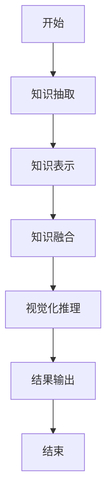
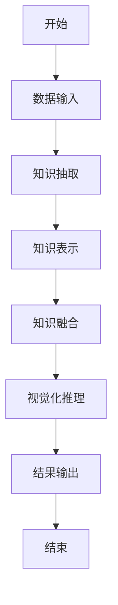
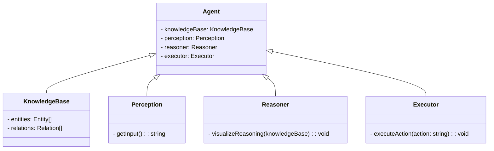
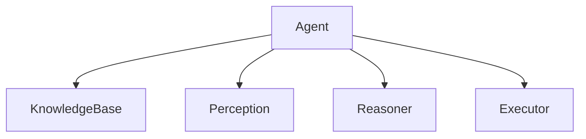
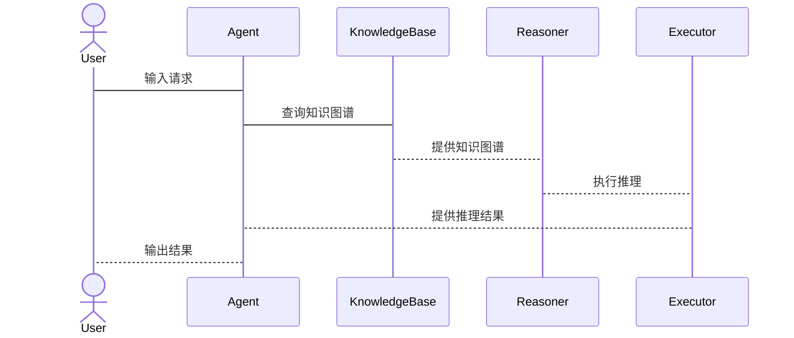

                 


# 构建AI Agent的知识图谱视觉化推理系统

> 关键词：知识图谱，AI Agent，视觉化推理，系统架构，算法原理，项目实战

> 摘要：本文系统地探讨了构建AI Agent的知识图谱视觉化推理系统的各个方面，从背景介绍到核心概念，从算法原理到系统架构，再到项目实战和最佳实践，为读者提供了一套完整的解决方案。本文通过详细的理论分析和实际案例，帮助读者深入理解这一领域的核心技术和应用实践。

---

# 第一部分: 构建AI Agent的知识图谱视觉化推理系统背景介绍

## 第1章: 问题背景与描述

### 1.1 问题背景
#### 1.1.1 当前AI Agent的发展现状
AI Agent（智能体）作为人工智能的核心技术之一，近年来得到了快速发展。随着深度学习、自然语言处理和计算机视觉等技术的进步，AI Agent在各个领域展现出强大的应用潜力。然而，现有的AI Agent在知识表示和推理能力方面仍存在不足，难以应对复杂场景下的动态问题。

#### 1.1.2 知识图谱在AI Agent中的作用
知识图谱是一种结构化的知识表示形式，能够有效地整合和组织多源异构数据，为AI Agent提供了强大的知识基础。通过知识图谱，AI Agent可以更好地理解上下文、进行推理和决策。

#### 1.1.3 视觉化推理的必要性
视觉化推理是一种基于图形化表示的推理方法，能够直观地展示知识之间的关系和推理过程。在复杂的场景中，视觉化推理能够帮助AI Agent更高效地理解和解决实际问题。

### 1.2 问题描述
#### 1.2.1 AI Agent的知识表示问题
现有的知识表示方法往往缺乏语义信息，难以应对动态变化的环境。如何构建一个灵活、可扩展的知识表示系统，是当前AI Agent研究中的一个重要挑战。

#### 1.2.2 知识图谱构建的挑战
知识图谱的构建需要解决数据清洗、实体识别、关系抽取等一系列问题。此外，如何保证知识图谱的实时性和准确性，也是需要重点考虑的问题。

#### 1.2.3 视觉化推理的需求分析
在复杂场景中，AI Agent需要进行多步推理，传统的文本推理方法难以满足需求。视觉化推理通过图形化的方式，能够更直观地展示推理过程，提高推理效率。

### 1.3 问题解决
#### 1.3.1 知识图谱构建的解决方案
通过引入先进的自然语言处理技术和图嵌入方法，可以有效地构建高质量的知识图谱。同时，结合分布式存储技术，可以保证知识图谱的可扩展性和高效性。

#### 1.3.2 视觉化推理的实现方法
基于图神经网络和注意力机制，可以设计高效的视觉化推理算法。通过将知识图谱中的实体和关系可视化，能够更好地理解推理过程。

#### 1.3.3 AI Agent的优化策略
通过强化学习和在线学习方法，可以不断提升AI Agent的知识表示和推理能力。同时，结合人机交互技术，可以增强AI Agent的灵活性和适应性。

### 1.4 问题的边界与外延
#### 1.4.1 知识图谱的边界定义
知识图谱的构建需要明确数据来源、实体范围和关系类型。通过合理的边界定义，可以避免知识图谱的过于复杂和冗余。

#### 1.4.2 视觉化推理的适用范围
视觉化推理适用于需要直观展示推理过程的场景，如医疗诊断、法律推理和复杂问题分析等。对于简单的推理任务，文本推理方法可能更为高效。

#### 1.4.3 AI Agent的系统架构外延
AI Agent的系统架构需要考虑模块化设计、可扩展性和容错性。通过模块化设计，可以更好地维护和优化系统。

### 1.5 概念结构与核心要素
#### 1.5.1 知识图谱的核心要素
知识图谱的核心要素包括实体、属性、关系和实例。实体是知识图谱的基本单元，属性描述实体的特征，关系描述实体之间的联系，实例则是实体的具体表现。

#### 1.5.2 视觉化推理的关键环节
视觉化推理的关键环节包括知识表示、推理规则定义、推理过程可视化和结果解释。这些环节共同构成了视觉化推理的完整流程。

#### 1.5.3 AI Agent的系统组成
AI Agent的系统组成包括感知模块、知识表示模块、推理模块和执行模块。感知模块负责获取环境信息，知识表示模块负责构建和管理知识图谱，推理模块负责基于知识图谱进行推理，执行模块负责根据推理结果执行具体操作。

### 1.6 本章小结
本章通过分析AI Agent的知识图谱视觉化推理系统的背景，明确了问题的提出和解决方向。通过详细阐述核心概念和系统架构，为后续章节的深入分析奠定了基础。

---

# 第二部分: 核心概念与联系

## 第2章: 核心概念原理

### 2.1 知识图谱的构建原理
#### 2.1.1 知识抽取与表示
知识抽取是从多源数据中提取实体、属性和关系的过程。知识表示则通过图结构将抽取的知识进行形式化表达。

#### 2.1.2 知识融合与推理
知识融合是将多个来源的知识进行整合，消除冲突，形成一致的知识图谱。知识推理则是基于知识图谱进行推断，发现隐含的知识。

#### 2.1.3 知识图谱的存储与管理
知识图谱的存储需要高效的数据库支持，如图数据库和分布式存储系统。知识图谱的管理包括数据更新、版本控制和访问控制等。

### 2.2 视觉化推理的实现原理
#### 2.2.1 视觉化推理的基本概念
视觉化推理是通过图形化的方式展示推理过程和结果的一种方法。它结合了图论和可视化技术，能够直观地展示知识之间的关系。

#### 2.2.2 视觉化推理的算法流程
视觉化推理的算法流程包括知识图谱构建、推理规则定义、推理过程可视化和结果解释。通过算法优化，可以提高推理效率和准确性。

#### 2.2.3 视觉化推理的优化策略
视觉化推理的优化策略包括减少计算复杂度、提高可视化效果和增强用户交互体验。通过优化，可以更好地满足实际应用的需求。

### 2.3 AI Agent的运行机制
#### 2.3.1 AI Agent的核心功能
AI Agent的核心功能包括感知、推理、决策和执行。感知模块负责获取环境信息，推理模块基于知识图谱进行推理，决策模块制定行动策略，执行模块执行具体操作。

#### 2.3.2 AI Agent的交互方式
AI Agent的交互方式包括人机交互和机器间交互。通过自然语言处理和计算机视觉技术，可以实现更加智能化的交互方式。

#### 2.3.3 AI Agent的学习与进化
AI Agent通过强化学习和在线学习方法，可以不断提升自身的知识表示和推理能力。学习过程需要结合反馈机制，不断优化系统性能。

### 2.4 核心概念对比分析
#### 2.4.1 知识图谱与传统数据库的对比
知识图谱与传统数据库的主要区别在于数据结构和存储方式。知识图谱通过图结构表示知识，而传统数据库通常采用关系型或对象型存储。

#### 2.4.2 视觉化推理与传统推理的对比
视觉化推理通过图形化方式展示推理过程，而传统推理通常采用文本形式。视觉化推理的优势在于直观性和可解释性。

#### 2.4.3 AI Agent与传统AI系统的对比
AI Agent是一种具有自主性和适应性的智能系统，而传统AI系统通常执行预定义的任务。AI Agent能够更好地应对动态变化的环境。

### 2.5 本章小结
本章通过分析知识图谱、视觉化推理和AI Agent的核心概念，深入探讨了它们的原理和实现方法。通过对比分析，明确了各部分的优缺点和适用场景。

---

## 第3章: 实体关系与架构设计

### 3.1 实体关系分析
#### 3.1.1 知识图谱中的实体关系
知识图谱中的实体关系包括属性关系、实体关系和实例关系。实体关系描述了实体之间的联系，属性关系描述了实体的特征，实例关系描述了实体的具体表现。

#### 3.1.2 视觉化推理中的实体关系
视觉化推理中的实体关系与知识图谱中的实体关系一致，通过图形化方式展示实体之间的关系，帮助用户更好地理解推理过程。

#### 3.1.3 AI Agent中的实体关系
AI Agent中的实体关系包括感知模块、知识表示模块、推理模块和执行模块之间的关系。通过合理的实体关系设计，可以优化系统性能。

### 3.2 知识图谱的ER实体关系图
```mermaid
er
actor(Agent, 实体, 关系)
```

### 3.3 视觉化推理的流程图


### 3.4 系统架构设计
#### 3.4.1 系统整体架构
系统整体架构包括感知层、知识表示层、推理层和执行层。感知层负责数据获取，知识表示层负责知识建模，推理层负责基于知识图谱进行推理，执行层负责根据推理结果执行具体操作。

#### 3.4.2 各模块的功能描述
- 感知模块：负责获取环境信息，包括文本、图像和语音等多种形式。
- 知识表示模块：负责构建和管理知识图谱，支持知识的存储、查询和更新。
- 推理模块：基于知识图谱进行推理，生成推理结果。
- 执行模块：根据推理结果执行具体操作，包括输出结果和触发外部系统。

#### 3.4.3 模块之间的交互关系
模块之间的交互关系通过接口进行定义。感知模块向知识表示模块提供数据，知识表示模块向推理模块提供知识图谱，推理模块向执行模块提供推理结果。

### 3.5 本章小结
本章通过分析实体关系和系统架构，明确了各模块的功能和交互关系。通过ER实体关系图和流程图，直观地展示了系统的整体架构和工作流程。

---

## 第4章: 算法原理与实现

### 4.1 算法原理
#### 4.1.1 知识图谱构建算法
知识图谱的构建算法包括实体识别、关系抽取和知识融合。实体识别通过自然语言处理技术从文本中提取实体，关系抽取通过模式匹配和语义分析提取关系，知识融合通过冲突检测和一致性检查整合多源知识。

#### 4.1.2 视觉化推理算法
视觉化推理算法基于图神经网络和注意力机制，通过将知识图谱中的实体和关系可视化，帮助用户更好地理解推理过程。

#### 4.1.3 AI Agent的算法框架
AI Agent的算法框架包括感知、推理、决策和执行四个模块。感知模块通过传感器获取环境信息，推理模块基于知识图谱进行推理，决策模块根据推理结果制定行动策略，执行模块根据决策结果执行具体操作。

### 4.2 算法流程图


### 4.3 算法实现
#### 4.3.1 知识抽取与表示
知识抽取可以通过使用自然语言处理库（如spaCy或NLTK）实现。知识表示可以采用图数据库（如Neo4j）进行存储和管理。

#### 4.3.2 视觉化推理的实现
视觉化推理的实现可以通过图神经网络（如GraphSAGE）和可视化工具（如D3.js）结合实现。通过将知识图谱中的实体和关系可视化，可以直观地展示推理过程。

#### 4.3.3 AI Agent的实现
AI Agent的实现可以通过模块化设计，结合感知、知识表示、推理和执行模块。通过异构计算和分布式系统设计，可以提升系统的性能和扩展性。

### 4.4 本章小结
本章通过详细分析算法原理和实现方法，明确了知识图谱构建、视觉化推理和AI Agent实现的关键步骤。通过流程图和代码示例，直观地展示了算法的实现过程。

---

## 第5章: 系统分析与架构设计方案

### 5.1 问题场景介绍
#### 5.1.1 知识图谱构建场景
知识图谱构建需要解决数据清洗、实体识别和关系抽取等问题。在构建过程中，需要考虑数据的多样性和复杂性。

#### 5.1.2 视觉化推理场景
视觉化推理适用于需要直观展示推理过程的场景，如医疗诊断、法律推理和复杂问题分析等。在这些场景中，视觉化推理能够帮助用户更好地理解问题和解决方案。

#### 5.1.3 AI Agent应用场景
AI Agent可以在智能客服、智能助手、自动驾驶等领域广泛应用。通过结合知识图谱和视觉化推理技术，AI Agent能够更好地应对复杂场景下的动态问题。

### 5.2 项目介绍
#### 5.2.1 项目目标
项目的总体目标是构建一个基于知识图谱的AI Agent视觉化推理系统，实现知识的高效表示、推理和可视化展示。

#### 5.2.2 项目范围
项目的范围包括知识图谱的构建、视觉化推理算法的设计与实现、AI Agent的系统集成与优化。

### 5.3 系统功能设计
#### 5.3.1 领域模型类图


#### 5.3.2 系统架构图


#### 5.3.3 系统接口设计
系统接口设计包括数据输入接口、知识表示接口、推理接口和执行接口。通过标准化接口设计，可以提高系统的可扩展性和可维护性。

#### 5.3.4 系统交互序列图


### 5.4 本章小结
本章通过分析问题场景，明确了项目的总体目标和范围。通过系统功能设计和架构图，直观地展示了系统的整体结构和各模块之间的交互关系。

---

## 第6章: 项目实战

### 6.1 环境安装与配置
#### 6.1.1 知识图谱构建工具
知识图谱的构建工具包括自然语言处理库（如spaCy、NLTK）、图数据库（如Neo4j）和知识图谱构建框架（如DexSTER）。

#### 6.1.2 视觉化推理工具
视觉化推理工具包括图神经网络库（如GraphSAGE）、可视化库（如D3.js）和推理引擎（如RDF4J）。

#### 6.1.3 AI Agent开发框架
AI Agent的开发框架包括对话式AI框架（如Rasa、Dialogflow）、机器人开发框架（如ROS）和AI Agent SDK（如LangChain）。

### 6.2 系统核心实现源代码
#### 6.2.1 知识图谱构建代码
```python
# 知识图谱构建代码示例
from spacy.lang.zh import Chinese
import spacy

nlp = spacy.load("zh_core_web_sm")
text = "李华是北京大学的学生，主修计算机科学。"
doc = nlp(text)
entities = [ent.label_ for ent in doc.ents]
print(entities)
```

#### 6.2.2 视觉化推理代码
```python
# 视觉化推理代码示例
import networkx as nx
import matplotlib.pyplot as plt

G = nx.DiGraph()
G.add_nodes_from(["李华", "北京大学", "计算机科学"])
G.add_edges_from([("李华", "北京大学"), ("北京大学", "计算机科学")])
nx.draw(G, with_labels=True, node_color="white", edge_color="blue")
plt.show()
```

#### 6.2.3 AI Agent核心代码
```python
# AI Agent核心代码示例
class Agent:
    def __init__(self):
        self.knowledge_base = KnowledgeBase()
        self.perception = Perception()
        self.reasoner = Reasoner()
        self.executor = Executor()

    def process_request(self, request):
        knowledge = self.perception.get_input(request)
        self.reasoner.visualize_reasoning(knowledge)
        action = self.reasoner.get_result()
        self.executor.execute_action(action)
```

### 6.3 代码应用解读与分析
#### 6.3.1 知识图谱构建代码解读
上述代码通过spaCy库提取文本中的实体，展示了知识图谱构建的基本步骤。通过实体识别，可以为知识图谱提供基础数据。

#### 6.3.2 视觉化推理代码解读
上述代码通过NetworkX库构建了一个简单的知识图谱，并通过Matplotlib进行可视化展示。通过图形化的方式，可以帮助用户更好地理解实体之间的关系。

#### 6.3.3 AI Agent核心代码解读
上述代码定义了一个AI Agent类，包括感知、知识表示、推理和执行四个模块。通过模块化设计，可以实现系统的高效管理和维护。

### 6.4 实际案例分析和详细讲解剖析
#### 6.4.1 案例背景
假设我们有一个医疗诊断场景，医生需要根据病人的症状和病史进行诊断推理。通过构建医疗知识图谱，AI Agent可以帮助医生快速找到相关知识，进行推理和诊断。

#### 6.4.2 案例分析
在医疗知识图谱中，实体包括疾病、症状、药物和检查项目。关系包括疾病与症状之间的关联，症状与检查项目的关联，以及疾病与药物之间的关联。通过视觉化推理，医生可以直观地看到各实体之间的关系，帮助诊断过程。

#### 6.4.3 案例实现
通过上述代码示例，我们可以构建一个简单的医疗知识图谱，并通过视觉化推理进行诊断推理。AI Agent可以根据推理结果提供诊断建议，帮助医生进行决策。

### 6.5 本章小结
本章通过实际案例分析，详细讲解了知识图谱构建、视觉化推理和AI Agent实现的关键步骤。通过代码示例，直观地展示了系统的实现过程。

---

## 第7章: 最佳实践、小结与注意事项

### 7.1 最佳实践
#### 7.1.1 知识图谱构建的最佳实践
在知识图谱构建过程中，需要注重数据的多样性和准确性。通过引入多种数据源和采用数据清洗技术，可以提高知识图谱的质量。

#### 7.1.2 视觉化推理的最佳实践
在视觉化推理过程中，需要注重可视化效果和用户交互体验。通过优化图形化展示和增加交互功能，可以提高系统的可用性和用户体验。

#### 7.1.3 AI Agent开发的最佳实践
在AI Agent开发过程中，需要注重模块化设计和系统的可扩展性。通过采用分布式架构和微服务设计，可以更好地维护和优化系统。

### 7.2 小结
通过本文的详细讲解，我们系统地探讨了构建AI Agent的知识图谱视觉化推理系统的各个方面。从问题背景到核心概念，从算法原理到系统架构，再到项目实战和最佳实践，为读者提供了一套完整的解决方案。

### 7.3 注意事项
在实际应用中，需要注意系统的安全性和隐私保护。通过引入数据加密和访问控制技术，可以保证系统的安全性和用户隐私。同时，还需要关注系统的可解释性和可维护性，通过优化算法和设计，可以提高系统的性能和扩展性。

### 7.4 拓展阅读
对于有兴趣的读者，可以进一步阅读相关领域的经典文献和最新研究成果。推荐的书籍包括《知识图谱构建与应用》、《图神经网络原理与实践》和《AI Agent开发指南》等。

### 7.5 本章小结
本章通过总结最佳实践和注意事项，为读者提供了实际应用中的指导。通过拓展阅读，可以帮助读者进一步深入学习和研究。

---

# 结语

构建AI Agent的知识图谱视觉化推理系统是一项复杂的系统工程，需要综合运用多种技术和方法。通过本文的详细讲解，我们希望能够为读者提供一套完整的解决方案，帮助他们在实际应用中更好地构建和优化系统。

---

# 作者：AI天才研究院/AI Genius Institute & 禅与计算机程序设计艺术 /Zen And The Art of Computer Programming

