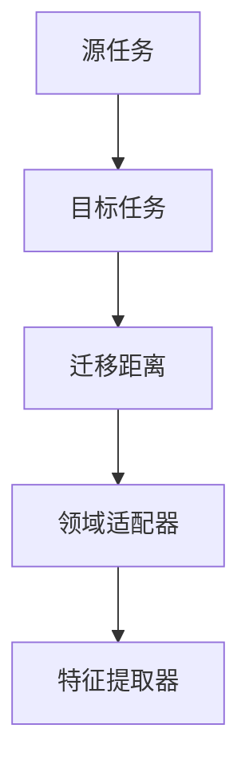
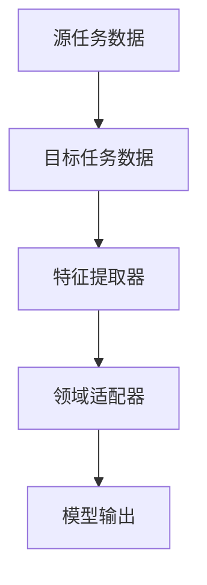
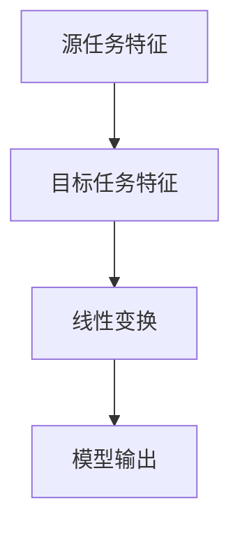
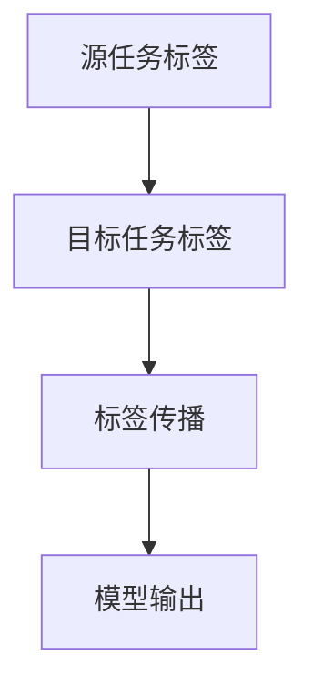
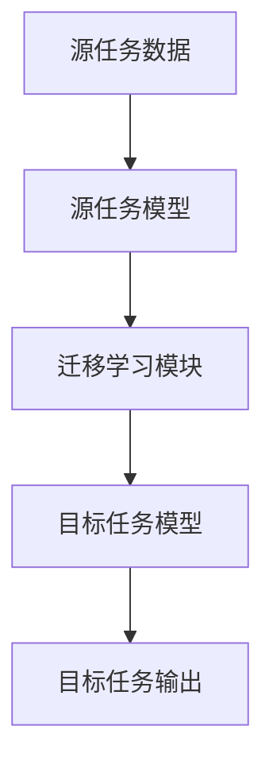
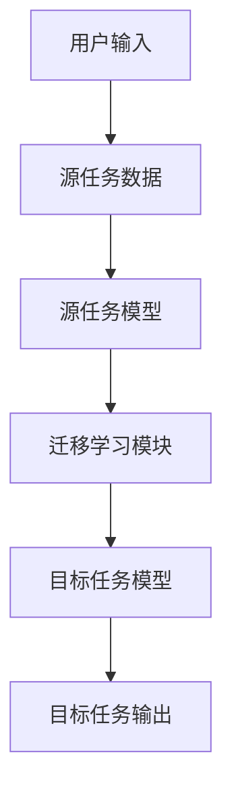

                 


# 构建具有迁移学习能力的AI Agent

---

## 关键词

- 迁移学习
- AI Agent
- 机器学习
- 深度学习
- 迁移学习算法

---

## 摘要

本文将详细探讨如何构建具有迁移学习能力的AI Agent。通过分析迁移学习的核心概念、算法原理、系统架构设计以及项目实战，我们将一步步揭示如何让AI Agent具备从一个任务到另一个任务的迁移能力。文章内容涵盖迁移学习的背景、核心概念、算法实现、系统架构设计、项目实战以及最佳实践，帮助读者全面理解和掌握构建迁移学习AI Agent的关键技术。

---

## 第一部分: 迁移学习与AI Agent概述

### 第1章: 迁移学习的基本概念

#### 1.1 机器学习的基本概念

- 1.1.1 什么是机器学习？
  - 机器学习是一种通过数据训练模型的技术。
  - 包括监督学习、无监督学习和强化学习三种主要形式。
  - 监督学习：给定标注数据，预测目标函数。
  - 无监督学习：从无标注数据中发现模式。
  - 强化学习：通过奖励机制优化决策过程。

- 1.1.2 机器学习的核心要素
  - 数据：输入特征和目标。
  - 模型：表示数据和任务的函数。
  - 算法：优化模型参数的方法。
  - 性能：模型在测试集上的表现。

- 1.1.3 机器学习的应用场景
  - 图像识别、自然语言处理、推荐系统等。

#### 1.2 迁移学习的定义与特点

- 1.2.1 迁移学习的定义
  - 将一个任务（源任务）的知识迁移到另一个任务（目标任务）。
  - 利用源任务的数据和标签来提升目标任务的性能。

- 1.2.2 迁移学习的特点
  - 减少数据需求：在目标任务数据有限时，利用源任务数据。
  - 适应性：模型可以在不同领域间迁移。
  - 鲁棒性：通过迁移提高模型的泛化能力。

- 1.2.3 迁移学习的背景与重要性
  - 在数据获取成本高的领域尤为重要。
  - 提高模型在小样本任务中的性能。
  - 推动AI技术在实际应用中的落地。

#### 1.3 AI Agent的基本概念

- 1.3.1 AI Agent的定义
  - AI Agent是一个能够感知环境、执行任务的智能体。
  - 具备自主性、反应性、目标导向性等特点。

- 1.3.2 AI Agent的分类
  - 简单反射型：基于规则的反应。
  - 目标驱动型：基于目标的决策。
  - 计划驱动型：具备复杂规划能力。
  - 学习驱动型：通过机器学习提升能力。

- 1.3.3 迁移学习在AI Agent中的作用
  - 提高AI Agent在不同环境中的适应能力。
  - 减少新任务的数据需求。
  - 提升AI Agent的自主学习和推理能力。

#### 1.4 迁移学习与传统机器学习的对比

- 1.4.1 传统机器学习的特点
  - 数据独立性：目标任务数据独立于源任务。
  - 高数据需求：通常需要大量标注数据。
  - 领域依赖性：模型在不同领域间表现差异大。

- 1.4.2 迁移学习的优势与应用场景
  - 降低数据需求。
  - 提高模型的泛化能力。
  - 适用于小样本任务。
  - 适用于领域转移任务。

- 1.4.3 两者的区别与联系
  - 传统机器学习：固定领域，数据独立。
  - 迁移学习：跨领域，数据相关。
  - 联系：迁移学习可以看作是机器学习的扩展。

---

## 第二部分: 迁移学习的核心概念与联系

### 第2章: 迁移学习的核心原理

#### 2.1 迁移学习的理论基础

- 2.1.1 表征学习的重要性
  - 通过学习数据的低维表示，减少数据差异。
  - 提高模型的泛化能力。

- 2.1.2 分布迁移
  - 将源分布转换为目标分布。
  - 使用分布匹配方法减少领域差异。

- 2.1.3 迁移学习的数学模型
  - 通过优化目标函数，最小化源任务和目标任务的差异。

#### 2.2 迁移学习的关键技术

- 2.2.1 特征提取
  - 使用深度学习模型提取高层特征。
  - 提高特征的区分能力。

- 2.2.2 领域适配器
  - 通过适配器层调整模型参数。
  - 减少领域差异。

- 2.2.3 标签传播
  - 利用标签信息进行迁移。
  - 提高目标任务的分类性能。

#### 2.3 迁移学习的核心要素

- 2.3.1 源任务和目标任务
  - 源任务：已标注数据，目标任务：新任务。

- 2.3.2 领域适配器
  - 用于调整源任务和目标任务之间的差异。

- 2.3.3 迁移距离
  - 度量源任务和目标任务之间的分布差异。

### 第3章: 迁移学习的核心概念对比

#### 3.1 源任务与目标任务的对比

- 3.1.1 数据分布差异
  - 源任务和目标任务的数据分布可能不同。

- 3.1.2 标签空间差异
  - 源任务和目标任务的标签可能不同。

- 3.1.3 任务目标差异
  - 两个任务的目标可能不同。

#### 3.2 领域适配器与特征提取器的对比

- 3.2.1 领域适配器的作用
  - 调整源任务和目标任务的特征分布。

- 3.2.2 特征提取器的作用
  - 提取数据的高层特征。

- 3.2.3 两者的关系
  - 领域适配器通常位于特征提取器之后。

#### 3.3 迁移距离与领域适配器的对比

- 3.3.1 迁移距离的定义
  - 度量源任务和目标任务之间的差异。

- 3.3.2 领域适配器的作用
  - 减少源任务和目标任务之间的差异。

- 3.3.3 两者的关系
  - 领域适配器用于减小迁移距离。

### 第4章: 迁移学习的实体关系图

#### 4.1 实体关系图的构建

- 4.1.1 实体：源任务、目标任务、领域适配器、特征提取器、迁移距离。
- 4.1.2 关系：源任务和目标任务之间的差异由迁移距离度量，领域适配器用于减少差异，特征提取器提供特征表示。

#### 4.2 Mermaid流程图展示



---

## 第三部分: 迁移学习的算法原理

### 第5章: 迁移学习的算法实现

#### 5.1 基于样本的迁移学习算法

- 5.1.1 最小化分布差异（MMD）
  - 使用核方法最小化源任务和目标任务的分布差异。

- 5.1.2 基于概率分布的迁移学习
  - 将源任务和目标任务视为概率分布，通过优化目标分布。

- 5.1.3 算法流程图展示



#### 5.2 基于特征的迁移学习算法

- 5.2.1 特征变换方法
  - 将源任务和目标任务的特征变换到同一空间。

- 5.2.2 基于线性变换的迁移学习
  - 使用线性变换减少领域差异。

- 5.2.3 算法流程图展示



#### 5.3 基于标记的迁移学习算法

- 5.3.1 标记分布适应方法
  - 通过调整标签分布进行迁移。

- 5.3.2 基于标记传播的迁移学习
  - 使用标签传播技术进行迁移。

- 5.3.3 算法流程图展示



### 第6章: 迁移学习的数学模型与公式

#### 6.1 迁移学习的数学模型

- 6.1.1 核心公式：目标函数

$$ \text{loss} = \text{源任务损失} + \lambda \times \text{迁移损失} $$

- 6.1.2 迁移损失的计算

$$ \text{迁移损失} = \|P_{\text{源}} - P_{\text{目标}}\| $$

- 6.1.3 综合优化目标

$$ \min_{\theta} \mathbb{E}_{(x,y)}[\text{损失}(x,y)] + \lambda \mathbb{E}_{(x',y')}[ \text{迁移损失}(x',y')] $$

#### 6.2 基于深度学习的迁移学习

- 6.2.1 使用预训练模型

$$ \text{特征表示} = f_\theta(x) $$

- 6.2.2 领域适配器

$$ h_\phi(f_\theta(x)) $$

- 6.2.3 整体模型

$$ y = g_\psi(h_\phi(f_\theta(x))) $$

### 第7章: 迁移学习算法的代码实现

#### 7.1 环境安装

- Python 3.8+
- PyTorch 1.9+
- Scikit-learn 0.24+

#### 7.2 核心代码实现

```python
import torch
import torch.nn as nn
import torch.optim as optim
from sklearn.metrics import accuracy_score

class SourceDomain(nn.Module):
    def __init__(self, input_size, hidden_size, output_size):
        super(SourceDomain, self).__init__()
        self.fc1 = nn.Linear(input_size, hidden_size)
        self.fc2 = nn.Linear(hidden_size, output_size)

class TargetDomain(nn.Module):
    def __init__(self, input_size, hidden_size, output_size):
        super(TargetDomain, self).__init__()
        self.fc1 = nn.Linear(input_size, hidden_size)
        self.fc2 = nn.Linear(hidden_size, output_size)

class Adapter(nn.Module):
    def __init__(self, input_size, output_size):
        super(Adapter, self).__init__()
        self.fc = nn.Linear(input_size, output_size)

def train(model, adapter, source_loader, target_loader, optimizer, epochs=100):
    for epoch in range(epochs):
        model.train()
        adapter.train()
        for x, y in source_loader:
            optimizer.zero_grad()
            output = model(x)
            loss = nn.CrossEntropyLoss()(output, y)
            loss.backward()
            optimizer.step()

        for x, y in target_loader:
            optimizer.zero_grad()
            output = adapter(model(x))
            loss = nn.CrossEntropyLoss()(output, y)
            loss.backward()
            optimizer.step()
    return model, adapter

# Example usage
source_loader = ...
target_loader = ...
model = SourceDomain(...)
adapter = Adapter(...)
optimizer = optim.SGD(...)
model, adapter = train(model, adapter, source_loader, target_loader, optimizer)
```

#### 7.3 案例分析与代码解读

- 案例：图像分类任务。
- 源任务：图像分类在ImageNet数据集。
- 目标任务：图像分类在CIFAR-10数据集。
- 代码实现：使用预训练的ResNet模型，加上自适应层，迁移学习到目标任务。

---

## 第四部分: 系统分析与架构设计方案

### 第8章: 系统分析与架构设计

#### 8.1 项目介绍

- 项目名称：迁移学习AI Agent。
- 项目目标：构建一个能够从源任务迁移到目标任务的AI Agent。

#### 8.2 系统功能设计

- 领域模型设计
  - 源任务模块：处理源任务数据。
  - 目标任务模块：处理目标任务数据。
  - 迁移学习模块：实现数据迁移和模型适配。

#### 8.3 系统架构设计



#### 8.4 系统接口设计

- 源任务接口：输入源任务数据，输出源任务模型。
- 目标任务接口：输入目标任务数据，输出目标任务模型。
- 迁移学习接口：连接源任务和目标任务模块。

#### 8.5 系统交互流程



---

## 第五部分: 项目实战

### 第9章: 项目实战

#### 9.1 环境安装

- Python 3.8+
- PyTorch 1.9+
- Scikit-learn 0.24+

#### 9.2 核心代码实现

```python
def train_model(model, adapter, source_loader, target_loader, optimizer, epochs=100):
    for epoch in range(epochs):
        model.train()
        adapter.train()
        for x, y in source_loader:
            optimizer.zero_grad()
            output = model(x)
            loss = nn.CrossEntropyLoss()(output, y)
            loss.backward()
            optimizer.step()

        for x, y in target_loader:
            optimizer.zero_grad()
            output = adapter(model(x))
            loss = nn.CrossEntropyLoss()(output, y)
            loss.backward()
            optimizer.step()
    return model, adapter

# Example usage
source_loader = ...
target_loader = ...
model = SourceDomain(...)
adapter = Adapter(...)
optimizer = optim.SGD(...)
model, adapter = train_model(model, adapter, source_loader, target_loader, optimizer)
```

#### 9.3 案例分析与代码解读

- 案例：图像分类任务。
- 源任务：图像分类在ImageNet数据集。
- 目标任务：图像分类在CIFAR-10数据集。
- 代码实现：使用预训练的ResNet模型，加上自适应层，迁移学习到目标任务。

---

## 第六部分: 最佳实践与总结

### 第10章: 最佳实践

#### 10.1 迁移学习中的注意事项

- 数据质量：源任务数据应具有代表性。
- 任务相关性：目标任务与源任务应相关。
- 模型选择：选择适合迁移学习的模型。

#### 10.2 迁移学习的局限性

- 过度迁移：模型过度适应源任务，影响目标任务性能。
- 数据偏差：源任务和目标任务数据分布差异大，影响迁移效果。

#### 10.3 迁移学习的未来发展方向

- 更高效的方法：开发更高效的迁移学习算法。
- 多任务学习：结合多任务学习提高迁移效果。
- 自适应模型：开发更自适应的模型结构。

### 第11章: 小结

- 本文详细探讨了如何构建具有迁移学习能力的AI Agent。
- 从迁移学习的背景到算法实现，再到系统架构设计和项目实战，为读者提供了全面的指导。
- 通过本文的学习，读者可以掌握迁移学习的核心技术，并将其应用到实际项目中。

### 第12章: 注意事项

- 在实际应用中，需注意数据的代表性和任务的相关性。
- 迁移学习可能无法完全消除领域差异，需根据实际情况进行调整。
- 模型的复杂度和计算资源需合理匹配。

---

## 作者信息

作者：AI天才研究院 & 禅与计算机程序设计艺术

