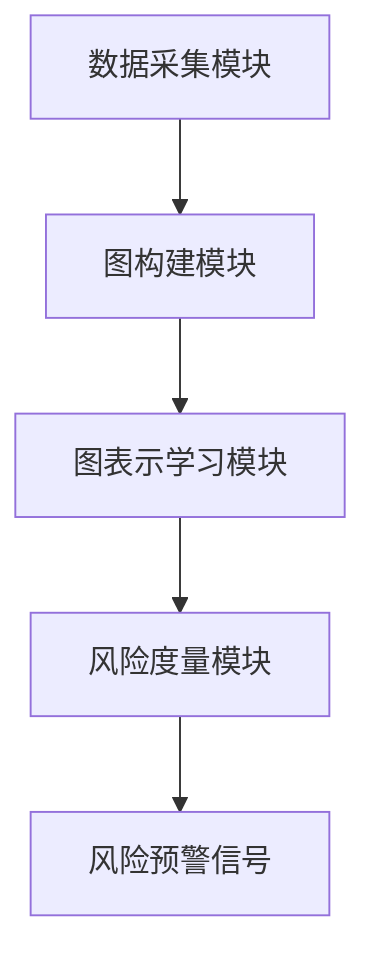

                 


# 《金融领域图表示学习在动态系统性风险度量中的应用》

## 关键词：系统性风险、图表示学习、金融网络、深度学习、风险管理

## 摘要：  
本文探讨了图表示学习在金融领域中的应用，特别是如何利用图表示学习技术来度量动态系统性风险。文章从系统性风险的基本概念出发，分析了图表示学习的原理及其在金融网络中的应用。通过构建金融网络模型，本文详细介绍了如何利用图表示学习技术捕捉系统性风险的关键特征，并提出了基于图表示学习的系统性风险度量方法。最后，本文通过实际案例展示了该方法的有效性，并总结了图表示学习在金融风险管理中的优势和未来研究方向。

---

## 第一部分：系统性风险与图表示学习基础

### 第1章：系统性风险概述

#### 1.1 系统性风险的基本概念

系统性风险是指由于金融体系中的某些重大事件或冲击导致的广泛影响的风险，通常涉及金融机构、市场和经济的整体波动。与非系统性风险（可分散风险）不同，系统性风险具有以下特点：
- **普遍性**：影响整个金融体系，而非单一机构或资产。
- **传染性**：风险可能通过金融市场中的关联性从一个机构或市场扩散到另一个机构或市场。
- **复杂性**：涉及多层次的金融网络和复杂的交互关系。

#### 1.2 系统性风险的度量方法

传统上，系统性风险的度量方法主要包括：
1. **VaR（Value at Risk）**：衡量资产在一定置信水平下的潜在损失。
2. **CoVaR（Conditional VaR）**：度量在极端情况下某一金融机构对整个系统的潜在贡献。
3. **Network VaR（NetVaR）**：基于网络结构分析系统性风险的传播和累积。

然而，这些方法在处理复杂金融网络中的动态关系时存在局限性，难以捕捉非线性交互和复杂依赖关系。

#### 1.3 图表示学习的背景

图表示学习是一种将图结构数据转化为低维向量表示的技术，广泛应用于社交网络分析、推荐系统、生物信息学等领域。在金融领域，图表示学习可以用于分析金融市场中的复杂关系，如股票价格波动、机构间关联等。

---

### 第2章：图表示学习的核心概念

#### 2.1 图表示学习的定义

图表示学习的目标是将图中的节点或边映射到低维空间中，同时保留图的结构特征和语义信息。常见的图表示学习方法包括：
- **Node Embedding**：将节点映射到低维向量空间。
- **Graph Embedding**：将整个图或子图映射到低维向量空间。
- **Graph Neural Networks (GNNs)**：通过深度学习模型直接处理图结构数据。

#### 2.2 图表示学习的主要方法

1. **Node2Vec**：
   - 基于随机游走的节点嵌入方法。
   - 通过训练Skip-Gram模型捕捉节点之间的语义关系。

2. **GraphSAGE**：
   - 基于归纳式学习的图嵌入方法。
   - 通过聚合邻居节点的特征生成中心节点的向量表示。

3. **GAT（Graph Attention Network）**：
   - 基于注意力机制的图嵌入方法。
   - 引入注意力权重捕捉节点之间的关系重要性。

#### 2.3 系统性风险与图表示学习的结合

在金融领域，系统性风险的传播和积累可以通过图结构进行建模。例如：
- **金融市场网络**：将金融机构或资产视为图中的节点，边表示它们之间的关联性或交易关系。
- **风险传播路径**：通过图表示学习捕捉节点之间的关系，分析风险在金融网络中的传播路径。

---

### 第3章：系统性风险的图表示模型

#### 3.1 系统性风险的网络构建

1. **金融机构网络**：
   - 将金融机构视为节点，边表示它们之间的资金往来、交易关系或信用关联。
   - 例如，银行间同业拆借市场可以表示为一个加权图，边权重表示交易规模。

2. **金融市场网络**：
   - 将股票、债券等金融资产视为节点，边表示它们之间的相关性或联动性。
   - 例如，可以通过计算股票价格的协方差矩阵构建金融资产的相似性网络。

#### 3.2 图表示学习在系统性风险中的应用案例

1. **银行间风险传播**：
   - 使用Node2Vec对银行节点进行嵌入，分析银行之间的关联性。
   - 通过嵌入向量相似性预测风险传播路径。

2. **股票市场波动预测**：
   - 基于股票价格数据构建金融资产的相似性图。
   - 使用GAT捕捉图中的注意力权重，预测市场波动。

3. **金融危机预警**：
   - 将金融市场网络嵌入到低维空间，分析系统性风险的累积情况。
   - 通过异常检测方法识别潜在的系统性风险信号。

---

## 第二部分：图表示学习的算法原理

### 第4章：图表示学习的数学模型

#### 4.1 图表示学习的基本模型

1. **节点嵌入模型**：
   - 输入：图结构数据和节点特征。
   - 输出：节点的低维向量表示。
   - 常见模型：Node2Vec、GraphSAGE、GAT。

2. **图嵌入模型**：
   - 输入：整个图的结构信息。
   - 输出：图的低维向量表示。
   - 常见模型：GraphSAGE、GAT、GraphGCN。

3. **图结构的数学表示**：
   - 图可以表示为一个无向图或有向图，形式为 $G = (V, E)$，其中 $V$ 是节点集合，$E$ 是边集合。

#### 4.2 常见的图表示学习算法

1. **Node2Vec算法**：
   - 通过随机游走生成节点的上下文，训练Skip-Gram模型。
   - 代码示例：
     ```python
     import numpy as np
     from sklearn.linear_model import SGDClassifier

     # 假设我们有一个图结构和随机游走生成的上下文窗口
     def node2vec_train(X, y):
         model = SGDClassifier()
         model.fit(X, y)
         return model
     ```

2. **GraphSAGE算法**：
   - 基于归纳式学习的节点嵌入方法，通过聚合邻居节点的特征生成中心节点的向量。
   - 代码示例：
     ```python
     import torch
     import torch.nn as nn

     class GraphSAGE(nn.Module):
         def __init__(self, input_dim, hidden_dim):
             super(GraphSAGE, self).__init__()
             self.aggregator = nn.Sigmoid()
             self.lin = nn.Linear(input_dim + hidden_dim, hidden_dim)
         def forward(self, x, neighbors):
             # 聚合邻居节点的特征
             aggregated = self.aggregator(torch.cat([x, neighbors], dim=1))
             # 线性变换
             output = self.lin(aggregated)
             return output
     ```

3. **GAT算法**：
   - 基于注意力机制的图嵌入方法，通过计算节点之间的注意力权重捕捉关系重要性。
   - 代码示例：
     ```python
     import torch
     import torch.nn as nn

     class GATLayer(nn.Module):
         def __init__(self, input_dim, output_dim):
             super(GATLayer, self).__init__()
             self.W = nn.Parameter(torch.randn(input_dim, output_dim))
             self.A = nn.Parameter(torch.randn(output_dim, output_dim))
         def forward(self, x, adj):
             # 计算注意力权重
             a = torch.mm(x, self.W)
             attention = torch.mm(a, self.A)
             # 加权求和
             output = torch.bmm(adj, a.unsqueeze(2)).squeeze(2)
             return output
     ```

---

### 第5章：系统性风险的图表示模型

#### 5.1 系统性风险的网络构建

1. **金融机构网络**：
   - 使用Node2Vec对银行节点进行嵌入，分析银行之间的关联性。
   - 通过边权重表示交易规模或信用风险。

2. **金融市场网络**：
   - 基于股票价格数据构建金融资产的相似性网络。
   - 使用GAT捕捉图中的注意力权重，预测市场波动。

#### 5.2 图表示学习在系统性风险中的应用案例

1. **银行间风险传播**：
   - 使用Node2Vec对银行节点进行嵌入，分析银行之间的关联性。
   - 通过嵌入向量相似性预测风险传播路径。

2. **股票市场波动预测**：
   - 基于股票价格数据构建金融资产的相似性图。
   - 使用GAT捕捉图中的注意力权重，预测市场波动。

3. **金融危机预警**：
   - 将金融市场网络嵌入到低维空间，分析系统性风险的累积情况。
   - 通过异常检测方法识别潜在的系统性风险信号。

---

## 第三部分：系统性风险度量的系统架构

### 第6章：系统架构设计

#### 6.1 系统功能模块划分

1. **数据采集模块**：
   - 从金融市场数据源（如股票价格、银行间交易数据）获取原始数据。
   - 数据清洗和预处理。

2. **图构建模块**：
   - 根据数据构建金融机构或金融资产的网络模型。
   - 计算节点之间的相似性或关联性。

3. **图表示学习模块**：
   - 使用Node2Vec、GAT等算法对图进行嵌入，生成低维向量表示。
   - 训练模型并保存模型参数。

4. **风险度量模块**：
   - 基于图表示学习结果，计算系统性风险指标（如系统性风险指数）。
   - 生成风险预警信号。

#### 6.2 系统架构图

以下是一个简单的系统架构图（使用Mermaid）：



---

### 第7章：项目实战

#### 7.1 环境安装

1. **安装必要的库**：
   - Python 3.7+
   - NumPy、Pandas、Scikit-learn、PyTorch、NetworkX、Mermaid。

2. **安装步骤**：
   ```bash
   pip install numpy pandas scikit-learn torch networkx
   ```

#### 7.2 系统核心实现源代码

1. **数据采集与预处理**：
   ```python
   import pandas as pd
   import numpy as np

   # 读取股票价格数据
   df = pd.read_csv('stock_prices.csv')
   # 数据清洗
   df = df.dropna()
   ```

2. **图构建模块**：
   ```python
   import networkx as nx

   # 构建金融资产相似性网络
   G = nx.Graph()
   for i in range(len(df)):
       for j in range(i+1, len(df)):
           # 计算相关系数
           correlation = np.corrcoef(df.iloc[i], df.iloc[j])[0,1]
           if correlation > 0.5:
               G.add_edge(i, j, weight=correlation)
   ```

3. **图表示学习模块**：
   ```python
   import torch
   import torch.nn as nn

   class GATLayer(nn.Module):
       def __init__(self, input_dim, output_dim):
           super(GATLayer, self).__init__()
           self.W = nn.Parameter(torch.randn(input_dim, output_dim))
           self.A = nn.Parameter(torch.randn(output_dim, output_dim))
       def forward(self, x, adj):
           a = torch.mm(x, self.W)
           attention = torch.mm(a, self.A)
           output = torch.bmm(adj, a.unsqueeze(2)).squeeze(2)
           return output

   model = GATLayer(input_dim=10, output_dim=5)
   ```

4. **风险度量模块**：
   ```python
   import numpy as np

   # 计算系统性风险指数
   def systemic_risk_index(embeddings):
       # 使用主成分分析提取特征
       pca = PCA(n_components=3)
       principal_components = pca.fit_transform(embeddings)
       # 计算系统性风险指数
       sri = np.mean(principal_components, axis=1)
       return sri
   ```

---

### 第8章：最佳实践与小结

#### 8.1 小结

图表示学习为金融领域中的系统性风险度量提供了新的思路和方法。通过构建金融网络模型，并利用图表示学习技术捕捉节点之间的复杂关系，可以更准确地识别和预测系统性风险。

#### 8.2 注意事项

1. **数据质量**：确保数据的准确性和完整性，数据预处理是关键。
2. **模型选择**：根据具体问题选择合适的图表示学习算法。
3. **计算资源**：图表示学习需要较大的计算资源，尤其是在处理大规模金融网络时。

#### 8.3 拓展阅读

- 建议阅读相关领域的最新论文，了解图表示学习的最新进展。
- 学习其他图表示学习算法（如GraphGCN、HGCN等）在金融领域的应用。

---

## 作者：AI天才研究院/AI Genius Institute & 禅与计算机程序设计艺术 /Zen And The Art of Computer Programming

---

以上是本文的完整内容，希望对您理解图表示学习在金融领域中的应用有所帮助。如果需要进一步探讨或扩展，欢迎随时联系！

