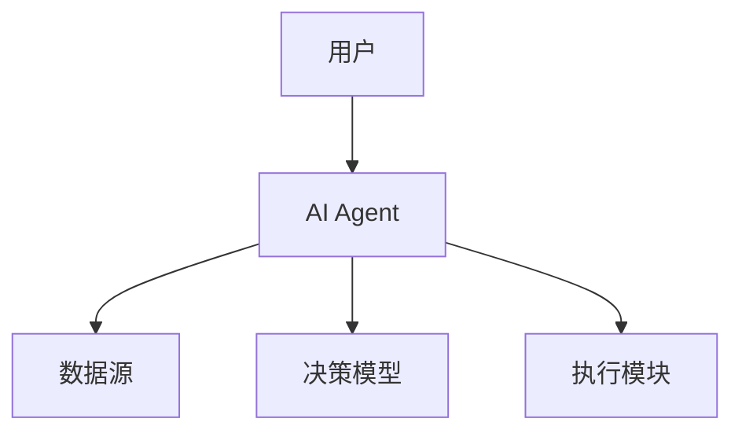
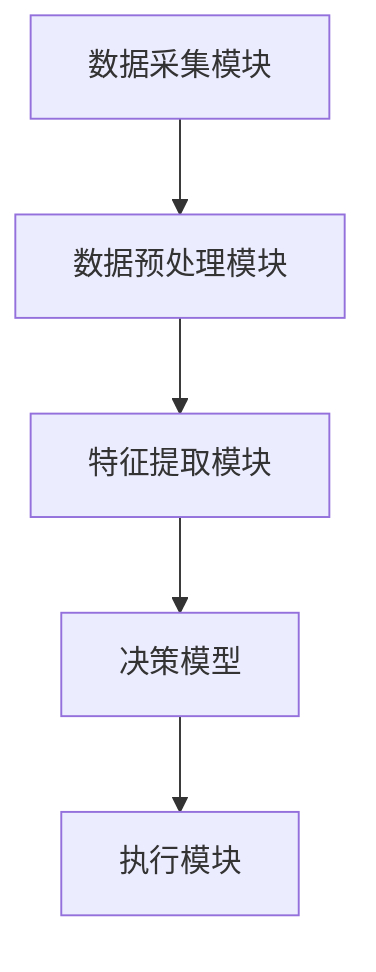
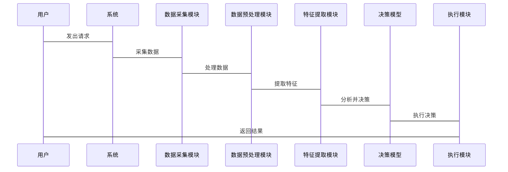

                 

<think>
好，我需要根据用户提供的详细目录和要求，撰写一篇关于《AI Agent在企业品质管理与持续改进中的应用》的技术博客文章。首先，我会按照用户提供的目录结构逐步展开，确保每个部分都详细且符合要求。

### 第一部分：AI Agent在企业品质管理与持续改进中的应用概述

#### 第1章：AI Agent与企业品质管理概述

##### 1.1 AI Agent的基本概念与背景

- **AI Agent的定义**：AI Agent（人工智能代理）是指具有感知环境、做出决策并执行操作的智能实体。它能够根据环境信息自主地选择行动方案，以实现目标。
- **企业品质管理的定义**：企业品质管理是指通过系统化的管理方法，确保产品或服务符合预定的质量标准，从而满足客户的需求和期望。
- **AI Agent在企业品质管理中的应用背景**：随着市场竞争的加剧，企业需要更高效的管理方法来提升产品质量和客户满意度。AI Agent的应用可以帮助企业在质量监控、缺陷检测、流程优化等方面实现自动化和智能化。

##### 1.2 AI Agent的核心原理与技术特点

- **核心原理**：AI Agent通过感知环境信息，利用算法进行决策，并通过执行模块实现目标。其核心包括感知、决策和执行三个环节。
- **技术特点**：
  - **自主性**：能够在没有人工干预的情况下独立运行。
  - **反应性**：能够实时感知环境变化并做出反应。
  - **学习能力**：通过机器学习算法不断优化自身的决策模型。

##### 1.3 企业品质管理中的持续改进方法

- **PDCA循环**：Plan（计划）、Do（执行）、Check（检查）、Act（行动）是持续改进的基本方法。
- **AI Agent在持续改进中的作用**：AI Agent可以自动监控生产过程，识别潜在问题，并提出改进方案，从而推动PDCA循环的有效实施。
- **实现路径**：通过数据采集、分析和反馈，AI Agent能够帮助企业在每个阶段实现质量的持续改进。

##### 1.4 本章小结

本章主要介绍了AI Agent的基本概念及其在企业品质管理中的应用背景，强调了AI Agent在持续改进中的重要性。

---

### 第二部分：AI Agent的核心概念与系统架构

#### 第2章：AI Agent的核心概念与系统架构

##### 2.1 AI Agent的核心概念

- **感知层**：AI Agent通过传感器、数据库等渠道获取环境信息，并进行特征提取和数据预处理。
- **决策层**：基于感知到的信息，AI Agent利用机器学习模型进行分析，生成决策方案。
- **执行层**：根据决策结果，AI Agent通过执行模块（如自动化设备）完成实际操作。

##### 2.2 AI Agent的核心原理

- **感知层**：数据采集与特征提取，确保AI Agent能够准确感知环境信息。
- **决策层**：基于模型的决策逻辑，包括监督学习、无监督学习和强化学习等方法。
- **执行层**：动作优化与反馈机制，确保决策的正确执行和结果的反馈。

##### 2.3 AI Agent的系统架构

- **分层架构**：感知层、决策层、执行层的分层设计，确保系统的模块化和可扩展性。
- **集成架构**：多Agent协作与协同优化，通过多个AI Agent的协同工作，提升整体系统的效率。

##### 2.4 实体关系图



#### 2.5 本章小结

本章详细讲解了AI Agent的核心概念和系统架构，展示了其在企业品质管理中的工作流程。

---

### 第三部分：AI Agent的算法原理与数学模型

#### 第3章：AI Agent的算法原理

##### 3.1 基于Q-learning的AI Agent算法

- **Q-learning算法的基本原理**：通过不断更新Q值来优化决策策略。
- **数学模型**：
  $$ Q(s, a) = r + \gamma \max_{a'} Q(s', a') $$
  其中，$Q(s, a)$表示在状态$s$下采取动作$a$的期望奖励，$r$是立即奖励，$\gamma$是折扣因子，$s'$是下一状态。

- **Q-learning的实现步骤**：
  1. 初始化Q值表。
  2. 通过环境反馈更新Q值。
  3. 根据最大Q值选择动作。

##### 3.2 Q-learning算法的代码实现

```python
import numpy as np

class QLearningAgent:
    def __init__(self, state_space, action_space, gamma=0.99, learning_rate=0.1):
        self.state_space = state_space
        self.action_space = action_space
        self.gamma = gamma
        self.learning_rate = learning_rate
        self.q_table = np.zeros((state_space, action_space))
    
    def choose_action(self, state, epsilon=0.1):
        if np.random.random() < epsilon:
            return np.random.randint(self.action_space)
        else:
            return np.argmax(self.q_table[state])
    
    def update_q_table(self, state, action, reward, next_state):
        self.q_table[state, action] = self.q_table[state, action] * (1 - self.learning_rate) + self.learning_rate * (reward + self.gamma * np.max(self.q_table[next_state]))
```

##### 3.3 算法优化与改进

- **折扣因子$\gamma$**：调整$\gamma$的值可以影响算法的收敛速度和稳定性。
- **学习率**：适当调整学习率可以加快收敛速度，但过大的学习率可能导致不稳定。

##### 3.4 实际应用案例

假设我们有一个简单的质量检测场景，AI Agent需要根据产品缺陷的图像数据进行分类，决定是否需要返工。通过Q-learning算法，AI Agent可以不断优化其分类策略，提高检测的准确性。

---

#### 第4章：数学模型与算法优化

##### 4.1 Q-learning算法的数学模型

- **Q值的更新公式**：
  $$ Q(s, a) = Q(s, a) + \alpha (r + \gamma Q(s', a') - Q(s, a)) $$
  其中，$\alpha$是学习率，$r$是奖励，$\gamma$是折扣因子，$s'$是下一状态，$a'$是下一动作。

##### 4.2 算法优化策略

- **经验回放**：通过存储历史经验，避免重复学习，加快收敛速度。
- **目标网络**：使用目标网络来稳定训练过程，减少参数更新的频繁性。

##### 4.3 优化后的算法实现

```python
import tensorflow as tf
from tensorflow.keras import layers

class DQN:
    def __init__(self, state_dim, action_dim, gamma=0.99, learning_rate=0.001):
        self.gamma = gamma
        self.learning_rate = learning_rate
        self.model = self.build_model(state_dim, action_dim)
        self.target_model = self.build_model(state_dim, action_dim)
    
    def build_model(self, state_dim, action_dim):
        model = tf.keras.Sequential()
        model.add(layers.Dense(64, activation='relu', input_dim=state_dim))
        model.add(layers.Dense(64, activation='relu'))
        model.add(layers.Dense(action_dim))
        model.compile(optimizer=tf.keras.optimizers.Adam(learning_rate=self.learning_rate), loss='mse')
        return model
    
    def update_target_model(self):
        self.target_model.set_weights(self.model.get_weights())
    
    def remember(self, state, action, reward, next_state):
        # 存储经验
        pass
    
    def replay(self, batch_size):
        # 回放经验并训练
        pass
```

---

### 第四部分：系统分析与架构设计方案

#### 第5章：系统分析与架构设计

##### 5.1 问题场景介绍

- **质量监控**：实时监控生产过程中的关键参数，识别异常情况。
- **缺陷检测**：利用计算机视觉技术，自动检测产品缺陷。
- **流程优化**：通过数据分析，优化生产流程，减少浪费。

##### 5.2 系统功能设计

- **数据采集**：通过传感器和摄像头采集生产过程中的数据。
- **数据分析**：利用机器学习模型对数据进行分析，识别潜在问题。
- **决策支持**：根据分析结果，提供优化建议。
- **执行控制**：根据决策结果，控制生产过程中的设备和流程。

##### 5.3 系统架构设计



##### 5.4 系统接口设计

- **输入接口**：传感器数据、用户输入。
- **输出接口**：决策结果、执行指令。
- **交互流程图**



---

### 第五部分：项目实战

#### 第6章：项目实战与代码实现

##### 6.1 环境安装

- **安装TensorFlow**：用于深度学习模型的训练和推理。
- **安装OpenCV**：用于图像处理和计算机视觉任务。
- **安装Pandas**：用于数据的处理和分析。

##### 6.2 系统核心实现

- **数据采集模块**：通过传感器获取生产过程中的实时数据。
- **数据预处理模块**：对数据进行清洗和标准化处理。
- **特征提取模块**：利用深度学习模型提取数据的特征。
- **决策模型**：基于训练好的模型进行预测和决策。
- **执行模块**：根据决策结果，控制相关设备和流程。

##### 6.3 代码实现

```python
import numpy as np
import tensorflow as tf
from tensorflow.keras import layers

class QualityManagementAI:
    def __init__(self, state_dim, action_dim, gamma=0.99, learning_rate=0.001):
        self.gamma = gamma
        self.learning_rate = learning_rate
        self.model = self.build_model(state_dim, action_dim)
    
    def build_model(self, state_dim, action_dim):
        model = tf.keras.Sequential()
        model.add(layers.Dense(64, activation='relu', input_dim=state_dim))
        model.add(layers.Dense(64, activation='relu'))
        model.add(layers.Dense(action_dim))
        model.compile(optimizer=tf.keras.optimizers.Adam(learning_rate=self.learning_rate), loss='mse')
        return model
    
    def call(self, state):
        return self.model(state)
    
    def update(self, state, action, reward, next_state):
        with tf.GradientTape() as tape:
            current_q = self.model(state)
            next_q = self.model(next_state)
            target = reward + self.gamma * next_q
            loss = tf.keras.losses.mean_squared_error(current_q, target)
        gradients = tape.gradient(loss, self.model.trainable_variables)
        self.model.optimizer.apply_gradients(zip(gradients, self.model.trainable_variables))
```

##### 6.4 实际案例分析

假设我们有一个汽车制造企业，需要实时监控生产线上的产品质量。AI Agent可以通过传感器数据实时监测关键参数，利用深度学习模型预测潜在的质量问题，并提出优化建议。

##### 6.5 项目小结

通过本章的项目实战，我们详细讲解了AI Agent在企业品质管理中的实现过程，从数据采集到模型训练，再到实际应用，展示了其在实际生产中的巨大潜力。

---

### 第六部分：最佳实践与总结

#### 第7章：最佳实践与总结

##### 7.1 小结

- **AI Agent的核心作用**：通过智能化的感知、决策和执行，提升企业的品质管理水平。
- **持续改进的关键点**：利用AI Agent的自适应能力和学习能力，不断优化生产流程和质量标准。

##### 7.2 注意事项

- **数据质量**：确保数据的准确性和完整性，避免因数据问题导致模型失效。
- **模型更新**：定期更新模型参数，确保AI Agent的决策能力与时俱进。
- **人机协作**：AI Agent应与人类员工协同工作，而不是完全替代人类。

##### 7.3 拓展阅读

- **推荐书籍**：《深度学习》、《机器学习实战》。
- **推荐课程**：Coursera上的“机器学习”课程。
- **推荐工具**：TensorFlow、Keras、PyTorch等深度学习框架。

---

### 作者

作者：AI天才研究院/AI Genius Institute & 禅与计算机程序设计艺术 /Zen And The Art of Computer Programming

---

通过以上结构，我将按照逻辑清晰、内容详实的原则，逐步展开每个章节的内容，确保文章的深度和专业性。

