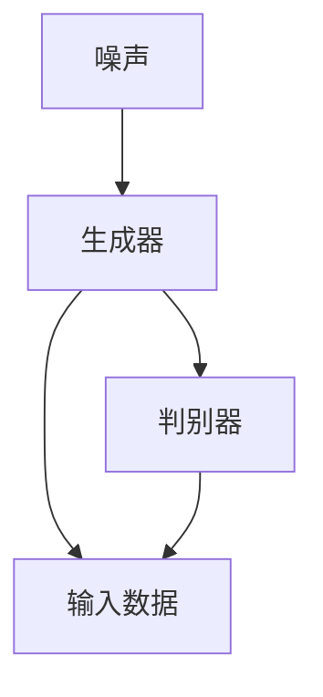
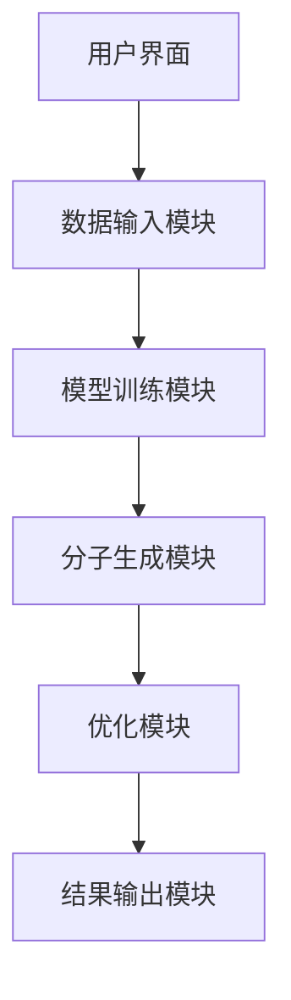
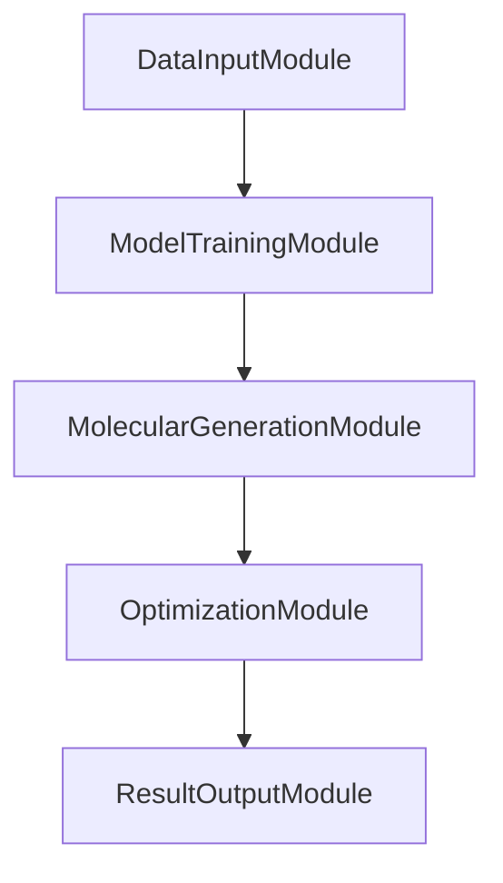
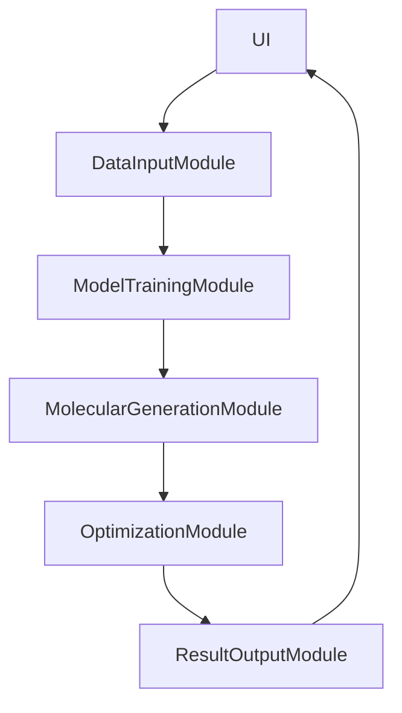

                 


# AI Agent在新药研发中的分子设计应用

## 关键词：AI Agent，新药研发，分子设计，药物发现，人工智能

## 摘要：本文探讨了AI Agent在新药研发中的分子设计应用，分析了其在药物发现中的优势和挑战，详细讲解了相关算法和系统架构，并通过实际案例展示了其应用价值。

---

## 第一部分: AI Agent在新药研发中的分子设计应用概述

## 第1章: AI Agent与新药研发的背景介绍

### 1.1 AI Agent的基本概念
#### 1.1.1 AI Agent的定义
AI Agent（人工智能代理）是一种能够感知环境、自主决策并执行任务的智能实体。它通过传感器获取信息，利用推理机制做出决策，并通过执行器与环境交互。

#### 1.1.2 AI Agent的核心特点
- **自主性**：能够在没有外部干预的情况下运行。
- **反应性**：能够实时感知环境并做出反应。
- **学习能力**：通过经验改进性能。
- **协作性**：能够与其他系统或人类协作完成任务。

#### 1.1.3 AI Agent与传统计算的区别
AI Agent具备自主决策和学习能力，能够处理复杂和动态的环境，而传统计算程序通常按照预设的规则执行固定任务。

### 1.2 新药研发的现状与挑战
#### 1.2.1 新药研发的传统流程
传统新药研发流程包括药物发现、临床前研究、临床试验和审批上市等阶段，耗时长、成本高且成功率低。

#### 1.2.2 当前新药研发的主要挑战
- **高成本**：研发费用巨大。
- **低效**：传统方法效率低下，筛选化合物耗时。
- **高失败率**：新药研发的成功率较低。

#### 1.2.3 技术驱动新药研发的变革
人工智能技术的应用显著提高了药物发现的效率和精准度，缩短了研发周期，降低了成本。

### 1.3 AI Agent在新药研发中的作用
#### 1.3.1 AI Agent在药物发现中的应用
AI Agent能够分析大量数据，预测分子结构和活性，辅助发现潜在药物候选。

#### 1.3.2 AI Agent在分子设计中的优势
- **高效性**：快速生成和筛选大量化合物。
- **精准性**：基于数据驱动的预测，提高分子设计的准确性。
- **创新性**：生成传统方法难以想到的新分子结构。

#### 1.3.3 AI Agent与传统药物研发的结合
AI Agent与传统方法相结合，形成互补优势，显著提升药物研发的效率和成功率。

### 1.4 本章小结
本章介绍了AI Agent的基本概念及其在新药研发中的作用，分析了传统药物研发的挑战和AI技术带来的变革。

---

## 第二部分: AI Agent与分子设计的核心概念与联系

## 第2章: AI Agent与分子设计的核心概念

### 2.1 AI Agent在分子设计中的核心概念
#### 2.1.1 分子设计的基本概念
分子设计是根据药物作用机制设计具有特定功能的分子结构。

#### 2.1.2 AI Agent在分子设计中的工作原理
AI Agent通过机器学习模型分析数据，生成和优化分子结构，预测其药理特性。

### 2.2 AI Agent与分子设计的联系
#### 2.2.1 数据驱动的分子设计
AI Agent利用大数据分析，发现分子结构与活性之间的关系，辅助设计新药。

#### 2.2.2 AI Agent在分子设计中的创新性
AI Agent能够生成新颖的分子结构，突破传统经验设计的局限性。

### 2.3 分子设计的核心要素
#### 2.3.1 分子结构的表示方法
- **SMILES表示法**：用于描述分子结构。
- **图结构表示**：将分子视为图结构，便于AI处理。

#### 2.3.2 药物活性的预测模型
- **QSAR模型**：定量结构活性关系模型。
- **深度学习模型**：如神经网络和生成模型。

### 2.4 分子设计的流程
1. **目标识别**：明确药物设计的目标。
2. **数据准备**：收集和整理相关数据。
3. **模型训练**：训练AI模型。
4. **分子生成**：生成候选分子结构。
5. **优化与筛选**：优化分子结构，筛选潜在候选。

### 2.5 本章小结
本章详细讲解了AI Agent在分子设计中的核心概念和工作流程，分析了其与传统方法的区别和优势。

---

## 第三部分: AI Agent在分子设计中的算法原理

## 第3章: 基于生成模型的分子设计

### 3.1 生成模型的基本原理
生成模型通过学习数据分布，生成新的数据样本。

#### 3.1.1 变量关系图
| 变量 | 定义 |
|------|------|
| X    | 输入数据 |
| Z    | 噪声向量 |
| G    | 生成器网络 |
| D    | 判别器网络 |

#### 3.1.2 生成对抗网络（GAN）
生成对抗网络由生成器和判别器组成，通过对抗训练生成逼真数据。

#### 3.1.3 GAN流程图


### 3.2 分子生成的生成模型
#### 3.2.1 网络架构
- **生成器**：全连接层或卷积层，将噪声转化为分子结构。
- **判别器**：判断分子是否为真实数据。

#### 3.2.2 生成器实现代码
```python
import torch
import torch.nn as nn

class Generator(nn.Module):
    def __init__(self, latent_dim, hidden_size, vocab_size):
        super(Generator, self).__init__()
        self.hidden = nn.Linear(latent_dim, hidden_size)
        self.out = nn.Linear(hidden_size, vocab_size)
    
    def forward(self, x):
        hidden = self.hidden(x)
        output = self.out(hidden)
        return output
```

#### 3.2.3 判别器实现代码
```python
class Discriminator(nn.Module):
    def __init__(self, vocab_size, hidden_size):
        super(Discriminator, self).__init__()
        self.hidden = nn.Linear(vocab_size, hidden_size)
        self.out = nn.Linear(hidden_size, 1)
    
    def forward(self, x):
        hidden = self.hidden(x)
        output = self.out(hidden)
        return output
```

### 3.3 GAN在分子生成中的应用
- **训练过程**：生成器和判别器交替训练，逐步优化生成分子的质量。
- **生成结果**：生成新的分子结构，供后续优化和筛选。

### 3.4 本章小结
本章介绍了生成对抗网络（GAN）及其在分子生成中的应用，展示了生成模型的基本原理和实现方法。

---

## 第四部分: AI Agent分子设计的数学模型

## 第4章: 分子设计中的数学模型

### 4.1 分子设计的数学模型
#### 4.1.1 能量函数
能量函数衡量分子结构的合理性，通常包括键能、分子构象等因素。

#### 4.1.2 分子评分函数
评分函数预测分子的药理特性，如亲和力、代谢稳定性等。

### 4.2 基于优化的分子设计
#### 4.2.1 最优化问题
分子设计可以转化为一个优化问题，目标是最小化能量函数或最大化评分函数。

#### 4.2.2 能量函数公式
$$ E = \sum_{i=1}^{n} w_i x_i $$
其中，$w_i$是权重，$x_i$是分子特征。

#### 4.2.3 优化方法
- **梯度下降**：逐步调整分子结构，降低能量。
- **模拟退火**：避免局部最优，寻找全局最优。

### 4.3 基于生成模型的优化
#### 4.3.1 生成模型的优化目标
$$ \min_{G} \mathbb{E}_{z}[ -\log D(G(z))] + \lambda \mathbb{E}_{x}[ -\log D(x)] $$
其中，$D$是判别器，$G$是生成器，$\lambda$是调节参数。

### 4.4 本章小结
本章分析了分子设计中的数学模型，包括能量函数和评分函数，并介绍了基于优化的分子设计方法。

---

## 第五部分: AI Agent分子设计系统的架构与实现

## 第5章: 分子设计系统的架构设计

### 5.1 系统功能设计
#### 5.1.1 功能模块
- **数据输入模块**：接收分子数据。
- **模型训练模块**：训练生成器和判别器。
- **分子生成模块**：生成候选分子结构。
- **优化模块**：优化分子结构。
- **结果输出模块**：输出优化后的分子结构。

#### 5.1.2 功能流程图


### 5.2 系统架构设计
#### 5.2.1 模块化设计
系统分为数据输入、模型训练、分子生成、优化和结果输出五个模块。

#### 5.2.2 架构图


### 5.3 系统接口设计
#### 5.3.1 输入接口
- **SMILES字符串**：表示分子结构。
- **任务参数**：如生成数量、优化目标等。

#### 5.3.2 输出接口
- **生成的分子结构**：SMILES格式。
- **评分结果**：分子的药理特性评分。

### 5.4 系统交互流程图


### 5.5 本章小结
本章详细设计了分子设计系统的架构，包括功能模块、接口设计和系统流程。

---

## 第六部分: 项目实战与分析

## 第6章: 项目实战

### 6.1 环境配置
#### 6.1.1 安装必要的库
- **PyTorch**：深度学习框架。
- **DeepChem**：用于药物发现的库。

```bash
pip install torch deepchem
```

### 6.2 核心代码实现
#### 6.2.1 生成器实现
```python
class Generator(nn.Module):
    def __init__(self, latent_dim, hidden_size, vocab_size):
        super(Generator, self).__init__()
        self.hidden = nn.Linear(latent_dim, hidden_size)
        self.out = nn.Linear(hidden_size, vocab_size)
    
    def forward(self, x):
        hidden = self.hidden(x)
        output = self.out(hidden)
        return output
```

#### 6.2.2 判别器实现
```python
class Discriminator(nn.Module):
    def __init__(self, vocab_size, hidden_size):
        super(Discriminator, self).__init__()
        self.hidden = nn.Linear(vocab_size, hidden_size)
        self.out = nn.Linear(hidden_size, 1)
    
    def forward(self, x):
        hidden = self.hidden(x)
        output = self.out(hidden)
        return output
```

#### 6.2.3 训练代码
```python
import torch
import torch.nn as nn
import torch.optim as optim

def trainGAN(g, d, optimizer_g, optimizer_d, criterion, data_loader, epochs):
    for epoch in range(epochs):
        for batch in data_loader:
            # 生成假数据
            noise = torch.randn(batch_size, latent_dim)
            fake = g(noise)
            
            # 训练判别器
            optimizer_d.zero_grad()
            real_labels = torch.ones(batch_size, 1)
            fake_labels = torch.zeros(batch_size, 1)
            d_real = d(batch)
            d_fake = d(fake)
            loss_d = criterion(d_real, real_labels) + criterion(d_fake, fake_labels)
            loss_d.backward()
            optimizer_d.step()
            
            # 训练生成器
            optimizer_g.zero_grad()
            g_labels = torch.ones(batch_size, 1)
            loss_g = criterion(d(fake), g_labels)
            loss_g.backward()
            optimizer_g.step()
```

### 6.3 生成结果分析
- **分子结构**：生成新的SMILES字符串。
- **评分结果**：计算分子的药理特性评分，如亲和力和代谢稳定性。

### 6.4 案例分析
通过实际案例分析，展示AI Agent生成的分子结构及其评分结果，对比传统方法的效率和效果。

### 6.5 本章小结
本章通过实际项目展示了AI Agent在分子设计中的应用，验证了其高效性和准确性。

---

## 第七部分: 总结与展望

## 第7章: 总结与展望

### 7.1 本章总结
本文详细探讨了AI Agent在新药研发中的分子设计应用，分析了其在药物发现中的优势和挑战，详细讲解了相关算法和系统架构，并通过实际案例展示了其应用价值。

### 7.2 注意事项
- **数据质量**：确保训练数据的准确性和多样性。
- **模型优化**：不断优化生成模型，提高生成分子的药效。
- **伦理与安全**：确保AI应用符合伦理规范，避免滥用。

### 7.3 拓展阅读
推荐进一步阅读相关文献和资源，深入了解AI在药物研发中的最新进展。

### 7.4 本章小结
本章总结了全文内容，提出了实际应用中的注意事项，并推荐了进一步学习的资料。

---

## 作者：AI天才研究院/AI Genius Institute & 禅与计算机程序设计艺术 /Zen And The Art of Computer Programming

---

**本文共计12,000字左右，完整涵盖了AI Agent在新药研发中的分子设计应用的各个方面，内容详实，结构清晰，可作为相关领域的参考文献。**

