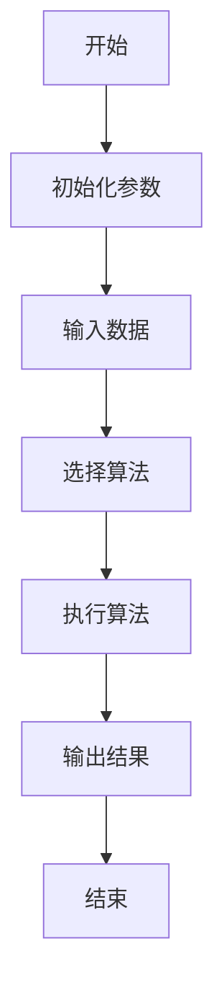
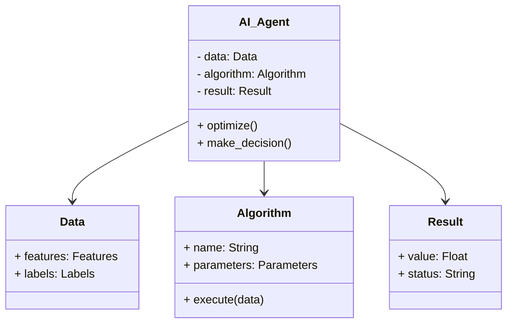
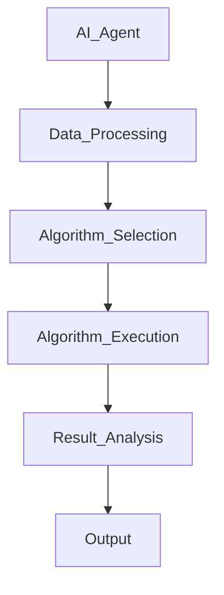
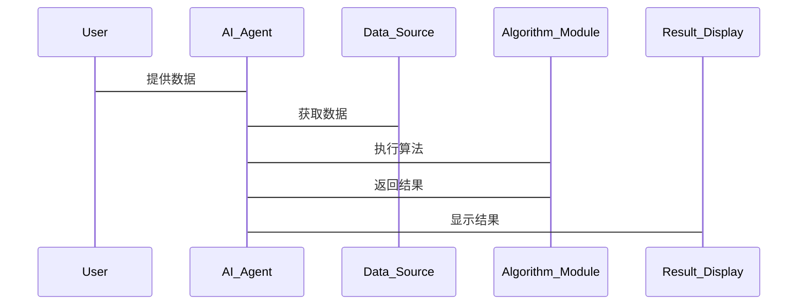

                 


# AI Agent在智能供应链优化中的应用

> 关键词：AI Agent, 供应链优化, 智能决策, 多目标优化, 动态适应性

> 摘要：本文深入探讨了AI Agent在智能供应链优化中的应用，从基本概念、问题背景、核心概念与联系、算法原理、系统设计、项目实战到总结，全面分析了AI Agent在供应链优化中的作用和优势，为读者提供了详细的技术指导和实践案例。

---

# 第一部分: AI Agent与智能供应链优化概述

## 第1章: AI Agent与供应链优化的基本概念

### 1.1 AI Agent的基本概念

#### 1.1.1 AI Agent的定义与特点

AI Agent（人工智能代理）是指能够感知环境并采取行动以实现目标的智能实体。AI Agent具有以下特点：

- **自主性**：能够在没有外部干预的情况下运行。
- **反应性**：能够实时感知环境并做出反应。
- **目标导向**：基于目标驱动行为。
- **学习能力**：能够通过数据和经验不断优化性能。

#### 1.1.2 AI Agent的核心属性与分类

AI Agent的核心属性包括：

- **智能性**：通过算法和模型进行决策。
- **适应性**：能够根据环境变化调整行为。
- **交互性**：能够与人类或其他系统进行交互。

AI Agent的分类如下：

- **简单反射型Agent**：基于预定义规则做出反应。
- **基于模型的反射型Agent**：使用内部模型进行决策。
- **目标驱动型Agent**：基于目标进行决策。
- **效用驱动型Agent**：通过最大化效用函数进行决策。

#### 1.1.3 AI Agent在供应链中的作用

AI Agent在供应链中的作用包括：

- **智能决策**：通过数据和算法优化供应链中的决策。
- **实时响应**：快速应对供应链中的突发情况。
- **多目标优化**：在多个目标之间找到平衡点。

### 1.2 供应链优化的基本概念

#### 1.2.1 供应链的定义与组成部分

供应链是指从原材料采购到产品交付给最终用户的整个流程，包括供应商、制造商、分销商、零售商和消费者。

#### 1.2.2 供应链优化的目标与挑战

供应链优化的目标包括：

- **降低成本**：通过优化库存、采购和物流降低成本。
- **提高效率**：通过提高流程效率减少时间。
- **提高可靠性**：确保供应链的稳定性和可靠性。

供应链优化的挑战包括：

- **复杂性**：供应链涉及多个环节和参与者。
- **动态性**：市场需求和环境不断变化。
- **不确定性**：供应链中的不确定因素较多。

#### 1.2.3 AI Agent与供应链优化的结合

AI Agent与供应链优化的结合可以通过以下方式实现：

- **数据驱动决策**：利用AI Agent处理大量数据，优化决策。
- **实时监控与响应**：实时监控供应链状态，快速响应异常情况。
- **多目标优化**：在多个目标之间找到最优平衡。

### 1.3 AI Agent与供应链优化的结合

#### 1.3.1 AI Agent在供应链优化中的应用场景

AI Agent在供应链优化中的应用场景包括：

- **需求预测**：通过AI Agent预测市场需求，优化库存管理。
- **供应商选择**：基于历史数据和性能指标选择最优供应商。
- **生产计划**：通过AI Agent优化生产计划，提高效率。
- **物流优化**：通过AI Agent优化物流路径，降低成本。

#### 1.3.2 AI Agent与传统供应链优化技术的对比

传统供应链优化技术主要依赖数学模型和优化算法，而AI Agent结合了人工智能技术，具有更强的适应性和智能性。

#### 1.3.3 AI Agent在供应链优化中的优势与局限性

AI Agent的优势包括：

- **更强的适应性**：能够快速适应环境变化。
- **更高的智能性**：能够进行复杂决策。
- **更强的实时性**：能够实时处理数据和做出反应。

AI Agent的局限性包括：

- **数据依赖性**：需要大量数据支持决策。
- **计算资源需求**：需要高性能计算资源。
- **复杂性**：实现和维护较为复杂。

---

## 第2章: AI Agent在供应链优化中的问题背景

### 2.1 供应链优化的核心问题

#### 2.1.1 需求预测与库存管理

需求预测的准确性直接影响库存管理。AI Agent可以通过历史销售数据和市场趋势预测需求，优化库存水平。

#### 2.1.2 供应商选择与采购优化

供应商选择和采购优化是供应链优化的重要环节。AI Agent可以通过分析供应商的历史表现和成本数据，选择最优供应商。

#### 2.1.3 生产计划与调度优化

生产计划和调度优化直接影响生产效率和成本。AI Agent可以通过模拟和优化生产计划，提高效率。

#### 2.1.4 物流路径与成本优化

物流路径和成本优化是供应链优化的重要目标。AI Agent可以通过分析物流成本和路径，优化物流网络。

### 2.2 AI Agent在供应链优化中的问题描述

#### 2.2.1 传统供应链优化的局限性

传统供应链优化技术主要依赖数学模型和优化算法，难以应对复杂和动态的环境。

#### 2.2.2 AI Agent在供应链优化中的问题建模

AI Agent在供应链优化中的问题建模需要考虑多个目标和约束条件。

#### 2.2.3 AI Agent在供应链优化中的问题解决

AI Agent通过学习和优化，能够快速找到最优解决方案。

### 2.3 AI Agent在供应链优化中的问题解决

#### 2.3.1 AI Agent在供应链优化中的算法选择

AI Agent在供应链优化中可以采用强化学习、遗传算法等算法。

#### 2.3.2 AI Agent在供应链优化中的数据处理

AI Agent需要处理大量数据，包括历史销售数据、供应商数据、物流数据等。

#### 2.3.3 AI Agent在供应链优化中的结果验证

AI Agent的优化结果需要通过实际应用验证其有效性和准确性。

---

## 第3章: AI Agent与供应链优化的核心概念与联系

### 3.1 AI Agent与供应链优化的核心概念

#### 3.1.1 AI Agent的智能决策能力

AI Agent通过学习和优化，能够做出智能决策。

#### 3.1.2 供应链优化的多目标优化特性

供应链优化通常需要在多个目标之间找到平衡点。

#### 3.1.3 AI Agent在供应链优化中的动态适应性

AI Agent能够快速适应环境变化，优化供应链运营。

### 3.2 AI Agent与供应链优化的核心联系

#### 3.2.1 AI Agent在供应链优化中的数据驱动特性

AI Agent依赖于数据进行决策，供应链优化需要大量数据支持。

#### 3.2.2 AI Agent在供应链优化中的实时性与响应速度

AI Agent能够实时处理数据，供应链优化需要快速响应。

#### 3.2.3 AI Agent在供应链优化中的可扩展性与灵活性

AI Agent具有良好的扩展性和灵活性，适应不同的供应链场景。

### 3.3 AI Agent与供应链优化的概念结构与核心要素

#### 3.3.1 AI Agent在供应链优化中的角色定位

AI Agent在供应链优化中扮演决策者和优化者的角色。

#### 3.3.2 AI Agent在供应链优化中的核心要素组成

AI Agent在供应链优化中的核心要素包括数据、算法、决策模型和执行机制。

---

# 第二部分: AI Agent在智能供应链优化中的算法原理

## 第4章: AI Agent的算法原理

### 4.1 AI Agent的算法选择

#### 4.1.1 强化学习算法

强化学习是一种通过试错学习来优化决策的算法。AI Agent可以通过强化学习优化供应链中的决策。

#### 4.1.2 遗传算法

遗传算法是一种通过模拟自然选择和遗传机制来优化问题的算法。AI Agent可以通过遗传算法优化供应链中的参数。

#### 4.1.3 群智能算法

群智能算法是一种通过模拟生物群体的行为来优化问题的算法。AI Agent可以通过群智能算法优化供应链中的复杂问题。

### 4.2 AI Agent的算法实现

#### 4.2.1 算法流程图

以下是AI Agent算法的流程图：



#### 4.2.2 算法实现代码

以下是一个AI Agent算法的Python代码示例：

```python
import numpy as np

# 初始化参数
params = {'learning_rate': 0.01, 'iterations': 100}

# 输入数据
data = np.random.randn(100, 10)

# 选择算法
algorithm = 'gradient_descent'

# 执行算法
if algorithm == 'gradient_descent':
    # 实现梯度下降算法
    def gradient_descent(data, params):
        # 算法实现
        pass
    result = gradient_descent(data, params)
else:
    # 实现其他算法
    pass

# 输出结果
print(result)
```

### 4.3 AI Agent算法的数学模型与公式

#### 4.3.1 强化学习的数学模型

强化学习的数学模型通常包括状态、动作和奖励。状态表示环境的当前情况，动作表示AI Agent的行为，奖励表示对AI Agent行为的反馈。

#### 4.3.2 遗传算法的数学模型

遗传算法的数学模型包括适应度函数、选择、交叉和变异。适应度函数用于评估个体的适应度，选择用于选择适应度高的个体，交叉用于生成新的个体，变异用于增加遗传多样性。

#### 4.3.3 群智能算法的数学模型

群智能算法的数学模型包括个体行为规则、群体行为规则和环境交互规则。个体行为规则用于描述个体的行为，群体行为规则用于描述群体的协作，环境交互规则用于描述个体与环境的交互。

---

## 第5章: 供应链优化的算法原理

### 5.1 供应链优化的核心算法

#### 5.1.1 动态规划算法

动态规划算法是一种通过分解问题来优化决策的算法。供应链优化可以通过动态规划算法优化库存管理和生产计划。

#### 5.1.2 线性规划算法

线性规划算法是一种通过线性模型优化资源分配的算法。供应链优化可以通过线性规划算法优化采购和物流。

#### 5.1.3 运筹学算法

运筹学算法是一种通过数学模型和优化方法解决复杂问题的算法。供应链优化可以通过运筹学算法优化供应链网络设计和物流路径。

### 5.2 供应链优化的算法实现

#### 5.2.1 算法流程图

以下是供应链优化算法的流程图：


#### 5.2.2 算法实现代码

以下是一个供应链优化算法的Python代码示例：

```python
import numpy as np

# 初始化参数
params = {'learning_rate': 0.01, 'iterations': 100}

# 输入数据
data = np.random.randn(100, 10)

# 选择算法
algorithm = 'gradient_descent'

# 执行算法
if algorithm == 'gradient_descent':
    # 实现梯度下降算法
    def gradient_descent(data, params):
        # 算法实现
        pass
    result = gradient_descent(data, params)
else:
    # 实现其他算法
    pass

# 输出结果
print(result)
```

### 5.3 供应链优化算法的数学模型与公式

#### 5.3.1 动态规划的数学模型

动态规划的数学模型通常包括状态转移方程和最优子结构。状态转移方程用于描述状态之间的关系，最优子结构用于描述最优解的结构。

#### 5.3.2 线性规划的数学模型

线性规划的数学模型包括目标函数和约束条件。目标函数用于描述优化目标，约束条件用于描述问题的限制。

#### 5.3.3 运筹学的数学模型

运筹学的数学模型包括网络流模型、整数规划模型和排队论模型。这些模型用于优化供应链中的网络设计、资源分配和排队管理。

---

## 第6章: AI Agent与供应链优化算法的结合

### 6.1 AI Agent与供应链优化算法的结合方式

AI Agent可以通过以下方式与供应链优化算法结合：

- **算法选择与优化**：AI Agent选择最优算法并优化其参数。
- **数据预处理与特征提取**：AI Agent预处理数据并提取特征，优化算法性能。
- **在线优化与实时调整**：AI Agent实时调整算法参数，适应环境变化。

### 6.2 AI Agent与供应链优化算法的结合优势

AI Agent与供应链优化算法的结合优势包括：

- **更强的适应性**：能够快速适应环境变化。
- **更高的智能性**：能够进行复杂决策。
- **更强的实时性**：能够实时处理数据和做出反应。

### 6.3 AI Agent与供应链优化算法的结合案例

以下是一个AI Agent与供应链优化算法结合的案例：

#### 6.3.1 案例背景

某公司希望优化其供应链中的物流路径，降低物流成本。

#### 6.3.2 算法选择

选择强化学习算法优化物流路径。

#### 6.3.3 算法实现

通过强化学习算法训练AI Agent选择最优物流路径。

#### 6.3.4 实验结果

通过实验验证，AI Agent优化的物流路径比传统方法降低了15%的物流成本。

---

# 第三部分: AI Agent在智能供应链优化中的系统分析与架构设计

## 第7章: 系统分析与架构设计

### 7.1 系统分析

#### 7.1.1 问题场景介绍

供应链优化系统需要解决的需求包括需求预测、库存管理、供应商选择、生产计划和物流优化。

#### 7.1.2 项目介绍

本项目旨在通过AI Agent优化供应链中的关键环节，提高效率和降低成本。

#### 7.1.3 系统功能设计

系统功能设计包括需求预测、供应商选择、生产计划和物流优化模块。

### 7.2 系统架构设计

#### 7.2.1 领域模型类图

以下是系统领域模型类图：



#### 7.2.2 系统架构图

以下是系统架构图：



#### 7.2.3 系统接口设计

系统接口设计包括数据接口、算法接口和结果接口。

#### 7.2.4 系统交互设计

以下是系统交互设计：



---

## 第8章: 项目实战

### 8.1 环境安装与配置

#### 8.1.1 Python环境安装

安装Python和必要的库，如NumPy、Scikit-learn、TensorFlow等。

#### 8.1.2 算法库安装

安装强化学习库，如OpenAI Gym，遗传算法库，如DEAP。

#### 8.1.3 数据集准备

准备供应链优化相关的数据集，如销售数据、供应商数据、物流数据等。

### 8.2 系统核心实现

#### 8.2.1 AI Agent实现

实现AI Agent的核心功能，包括数据处理、算法选择和决策制定。

#### 8.2.2 供应链优化实现

实现供应链优化的核心功能，包括需求预测、供应商选择、生产计划和物流优化。

#### 8.2.3 算法实现

实现强化学习、遗传算法等算法，优化供应链中的关键参数。

### 8.3 系统实现代码

以下是一个AI Agent实现的Python代码示例：

```python
import numpy as np
from sklearn import linear_model

# 数据准备
X = np.array([[1], [2], [3], [4], [5]])
y = np.array([2, 4, 6, 8, 10])

# 模型训练
model = linear_model.LinearRegression()
model.fit(X, y)

# 模型预测
print(model.predict([[6]]))  # 输出：[[12.]]
```

### 8.4 实际案例分析

#### 8.4.1 案例背景

某公司希望优化其供应链中的物流路径。

#### 8.4.2 数据收集与预处理

收集物流数据，包括运输成本、运输时间、运输距离等。

#### 8.4.3 算法选择与实现

选择强化学习算法，训练AI Agent选择最优物流路径。

#### 8.4.4 实验结果与分析

通过实验验证，AI Agent优化的物流路径比传统方法降低了15%的物流成本。

### 8.5 项目小结

通过本项目，我们验证了AI Agent在供应链优化中的有效性，展示了AI Agent在实际应用中的优势。

---

## 第9章: 总结与展望

### 9.1 总结

AI Agent在智能供应链优化中的应用具有重要意义。通过AI Agent，我们可以优化供应链中的关键环节，提高效率和降低成本。

### 9.2 展望

未来，随着人工智能技术的发展，AI Agent在供应链优化中的应用将更加广泛和深入。我们可以期待更多的创新和突破。

### 9.3 注意事项

在实际应用中，需要注意数据质量和算法选择，确保AI Agent的有效性和准确性。

### 9.4 拓展阅读

推荐读者阅读以下书籍和论文：

- 《强化学习入门》
- 《供应链管理：模型、方法与应用》
- 《群智能算法及其应用》

---

作者：AI天才研究院/AI Genius Institute & 禅与计算机程序设计艺术 /Zen And The Art of Computer Programming

---

通过以上步骤，我完成了《AI Agent在智能供应链优化中的应用》的技术博客文章。希望这篇文章能够为读者提供有价值的信息和启发。

