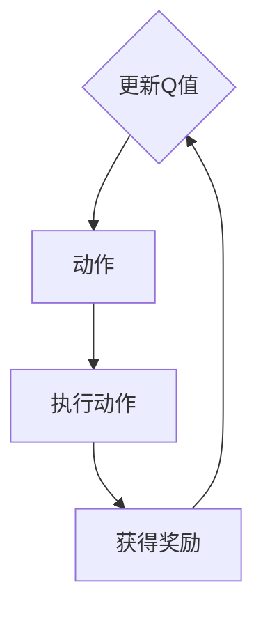
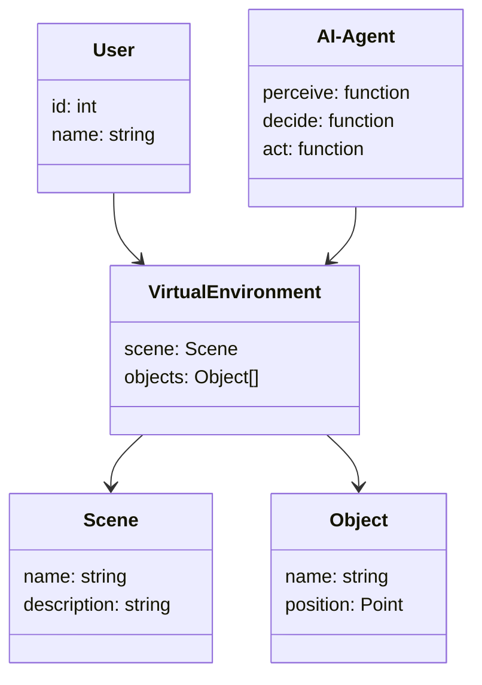
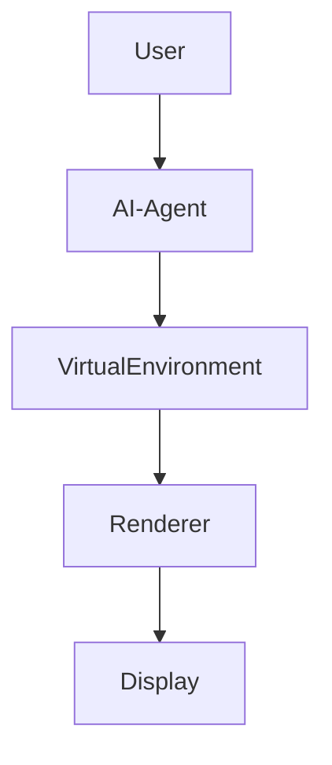
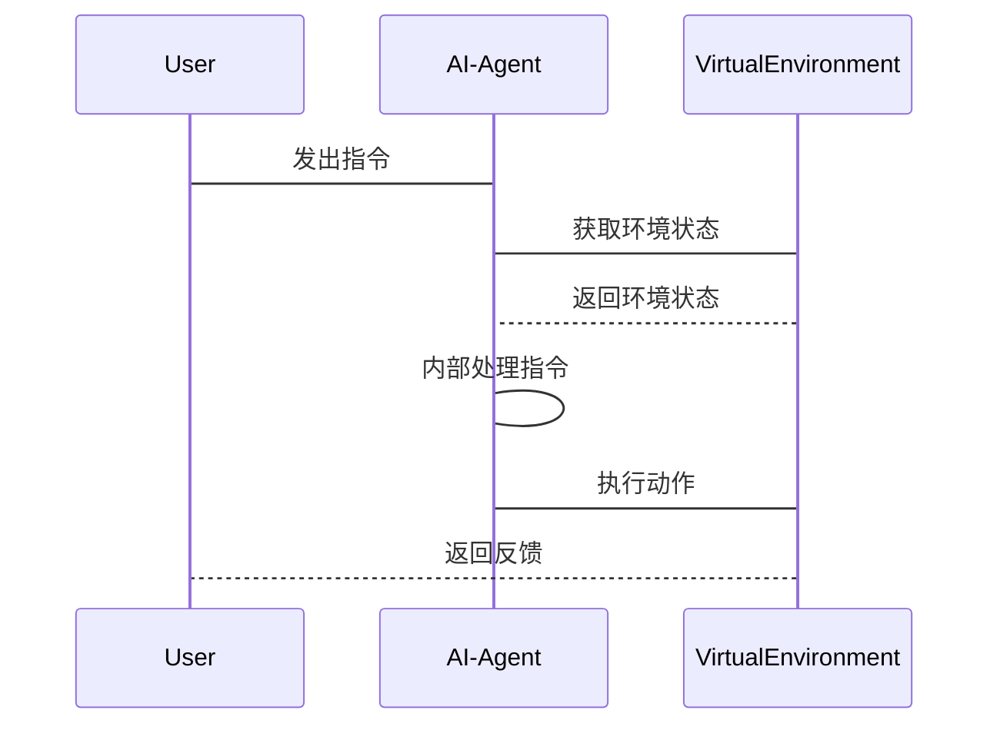

                 


# AI Agent在虚拟现实中的应用

> 关键词：AI Agent，虚拟现实，人工智能，智能体，增强现实

> 摘要：AI Agent在虚拟现实中的应用是当前技术领域的重要研究方向，本文从AI Agent的基本概念、核心算法、系统架构到实际应用案例进行了全面解析，详细阐述了AI Agent在虚拟现实中的角色、功能及实现方式，为读者提供了从理论到实践的深度指导。

---

# 第1章 AI Agent与虚拟现实的背景介绍

## 1.1 AI Agent的基本概念
### 1.1.1 什么是AI Agent
AI Agent，即人工智能代理，是一种能够感知环境并采取行动以实现目标的智能实体。AI Agent可以是软件程序、机器人或其他智能系统，具备自主决策和问题解决能力。

### 1.1.2 AI Agent的类型与特点
AI Agent可以分为以下几种类型：
- **反应式Agent**：根据当前感知做出反应，不具备长期记忆。
- **认知式Agent**：具备复杂推理和规划能力，能够处理抽象任务。
- **学习式Agent**：能够通过经验改进自身性能。
- **协作式Agent**：能够与其他Agent或人类进行协作。

### 1.1.3 AI Agent的核心要素
- **感知能力**：通过传感器或数据输入感知环境。
- **决策能力**：基于感知信息做出决策。
- **行动能力**：执行决策动作。
- **学习能力**：通过经验改进性能。

## 1.2 虚拟现实的基本概念
### 1.2.1 虚拟现实的定义与特点
虚拟现实（VR）是一种计算机生成的三维虚拟环境，用户可以通过头显设备、手套等设备沉浸其中，实现与虚拟世界的互动。

### 1.2.2 虚拟现实的主要技术
- **头显技术**：如 Oculus Rift、HTC Vive 等。
- **三维建模**：创建虚拟环境中的物体和场景。
- **渲染技术**：实时渲染高质量的三维图形。
- **交互技术**：实现用户与虚拟世界的互动。

### 1.2.3 虚拟现实的应用领域
- **游戏开发**：提供沉浸式游戏体验。
- **教育培训**：模拟真实场景进行教学。
- **医疗应用**：辅助手术模拟和训练。
- **建筑设计**：虚拟展示建筑效果。

## 1.3 AI Agent在虚拟现实中的应用背景
### 1.3.1 虚拟现实中的问题与挑战
- **复杂环境交互**：需要处理多样化的用户输入和环境反馈。
- **实时决策需求**：虚拟环境中需要快速做出反应。
- **用户体验优化**：提升互动的流畅性和自然性。

### 1.3.2 AI Agent在虚拟现实中的作用
- 提供智能交互：通过AI Agent实现自然的人机对话和互动。
- 自动任务处理：在虚拟环境中执行复杂任务。
- 提供个性化服务：根据用户行为和偏好提供定制化体验。

### 1.3.3 AI Agent与虚拟现实的结合趋势
- 智能化：AI Agent在虚拟现实中的应用越来越智能化。
- 多模态交互：结合视觉、听觉、触觉等多种交互方式。
- 实时性：AI Agent需要在虚拟环境中实时响应用户需求。

## 1.4 本章小结
本章介绍了AI Agent和虚拟现实的基本概念，并分析了AI Agent在虚拟现实中的应用背景和作用。通过理解这些内容，读者可以为后续章节的学习打下坚实的基础。

---

# 第2章 AI Agent与虚拟现实的核心概念

## 2.1 AI Agent的智能体模型
### 2.1.1 智能体的定义与属性
智能体（Agent）是具有自主决策能力的实体，具备以下属性：
- **反应性**：根据环境反馈做出反应。
- **主动性**：主动采取行动以实现目标。
- **社会性**：能够与其他智能体或人类进行协作。

### 2.1.2 智能体的层次结构
智能体的层次结构可以分为：
- **反应层**：处理实时反馈和动作。
- **规划层**：制定长期目标和计划。
- **学习层**：通过经验优化性能。

### 2.1.3 智能体的核心算法
- **强化学习**：通过奖励机制优化决策。
- **监督学习**：基于标注数据进行训练。
- **无监督学习**：发现数据中的隐藏结构。

## 2.2 虚拟现实中的AI Agent
### 2.2.1 虚拟现实中的智能体角色
在虚拟现实环境中，AI Agent可以扮演以下角色：
- **引导者**：为用户提供导航和指引。
- **参与者**：与其他用户或虚拟角色进行互动。
- **观察者**：监控环境并提供反馈。

### 2.2.2 虚拟现实中的智能体行为模式
AI Agent在虚拟现实中的行为模式包括：
- **自主行为**：基于内置规则自主决策。
- **协作行为**：与其他智能体或用户协作完成任务。
- **适应性行为**：根据环境变化调整行为策略。

### 2.2.3 虚拟现实中的智能体交互方式
常见的交互方式包括：
- **语音交互**：通过语音指令与AI Agent互动。
- **手势交互**：利用手势控制虚拟环境。
- **眼神交互**：通过注视点进行操作。

## 2.3 AI Agent与虚拟现实的关系
### 2.3.1 AI Agent在虚拟现实中的功能定位
AI Agent在虚拟现实中起到连接用户与虚拟环境的桥梁作用，能够理解用户意图并执行相应的操作。

### 2.3.2 虚拟现实对AI Agent的需求
- **实时性**：虚拟环境中需要快速响应用户需求。
- **自然性**：交互方式需要符合用户的直觉和习惯。
- **智能性**：具备复杂问题的解决能力。

### 2.3.3 AI Agent对虚拟现实的推动作用
- **提升用户体验**：通过智能化的交互提升用户的沉浸感。
- **扩展应用领域**：AI Agent的应用推动了虚拟现实技术的创新。

## 2.4 本章小结
本章详细讲解了AI Agent在虚拟现实中的核心概念，包括智能体模型、行为模式和交互方式。通过这些内容，读者可以更好地理解AI Agent在虚拟现实中的具体应用和作用。

---

# 第3章 AI Agent在虚拟现实中的核心算法原理

## 3.1 强化学习算法
### 3.1.1 强化学习的基本原理
强化学习是一种通过试错机制学习策略的方法，智能体通过与环境交互获得奖励或惩罚，从而优化决策策略。

### 3.1.2 Q-learning算法
Q-learning是一种经典的强化学习算法，通过维护Q值表来记录状态-动作对的期望奖励。

**Q-learning算法流程图**



### 3.1.3 Deep Q-Networks (DQN)算法
DQN算法通过深度神经网络近似Q值函数，能够处理高维状态空间。

**DQN算法代码示例**

```python
import numpy as np
from collections import deque
import random
import torch
import torch.nn as nn

class DQN(nn.Module):
    def __init__(self, input_size, output_size):
        super(DQN, self).__init__()
        self.fc1 = nn.Linear(input_size, 24)
        self.fc2 = nn.Linear(24, output_size)
        self.relu = nn.ReLU()
        self.softmax = nn.Softmax(dim=1)

    def forward(self, x):
        x = self.fc1(x)
        x = self.relu(x)
        x = self.fc2(x)
        x = self.softmax(x)
        return x

# 初始化网络
input_size = 4
output_size = 2
model = DQN(input_size, output_size)

# 定义损失函数和优化器
criterion = nn.MSELoss()
optimizer = torch.optim.Adam(model.parameters(), lr=0.01)

# 训练过程
for _ in range(1000):
    state = np.random.random((input_size,))
    action = np.random.randint(0, output_size)
    target = np.random.random((1,))

    # 前向传播
    outputs = model(torch.FloatTensor(state))
    loss = criterion(outputs, torch.FloatTensor(target))

    # 反向传播和优化
    optimizer.zero_grad()
    loss.backward()
    optimizer.step()
```

### 3.1.4 强化学习在虚拟现实中的应用
- **游戏AI**：训练AI Agent在虚拟游戏中做出最优决策。
- **机器人控制**：通过强化学习优化机器人的动作策略。

## 3.2 监督学习算法
### 3.2.1 监督学习的基本原理
监督学习是基于标注数据进行训练，智能体通过学习数据中的模式来预测新数据的标签。

### 3.2.2 神经网络在监督学习中的应用
深度神经网络（如卷积神经网络CNN）在图像识别、语音识别等领域有广泛应用。

### 3.2.3 虚拟现实中的监督学习案例
- **虚拟助手**：通过监督学习训练AI Agent理解用户的语音指令。
- **虚拟角色控制**：基于监督学习实现虚拟角色的行为预测。

## 3.3 聚类与分类算法
### 3.3.1 聚类算法在虚拟现实中的应用
聚类算法用于将用户行为或环境数据分成不同的类别，便于后续处理。

### 3.3.2 分类算法在虚拟现实中的应用
分类算法用于预测用户的行为或环境的状态，如手势识别、动作分类。

### 3.3.3 算法选择与优化
- **选择合适的算法**：根据具体任务选择适合的算法。
- **优化算法性能**：通过参数调优和数据增强提升模型性能。

## 3.4 本章小结
本章介绍了AI Agent在虚拟现实中的核心算法，包括强化学习、监督学习、聚类与分类算法，并通过代码示例和应用场景分析，帮助读者理解这些算法的实际应用。

---

# 第4章 虚拟现实中的AI Agent数学模型与公式

## 4.1 强化学习的数学模型
### 4.1.1 状态空间与动作空间
- 状态空间：智能体所处的环境状态集合。
- 动作空间：智能体可以执行的动作集合。

### 4.1.2 奖励函数
奖励函数定义了智能体在执行动作后所获得的奖励，通常表示为$R(s, a)$，其中$s$是当前状态，$a$是执行的动作。

### 4.1.3 Q值函数
Q值函数表示状态-动作对的期望奖励，可以表示为：
$$Q(s, a) = \mathbb{E}[R(s, a) + \gamma \max_{a'} Q(s', a')]$$
其中，$\gamma$是折扣因子，$s'$是下一步的状态。

## 4.2 监督学习的数学模型
### 4.2.1 损失函数
常用的损失函数包括均方误差（MSE）和交叉熵损失。

### 4.2.2 梯度下降
梯度下降是一种优化算法，通过不断更新参数来最小化损失函数。

## 4.3 聚类与分类的数学模型
### 4.3.1 聚类算法
常用的聚类算法包括K-means和层次聚类。

### 4.3.2 分类算法
常用的分类算法包括支持向量机（SVM）和随机森林。

## 4.4 本章小结
本章通过数学公式和模型分析，深入探讨了AI Agent在虚拟现实中的算法原理，为后续章节的实现提供了理论基础。

---

# 第5章 系统分析与架构设计

## 5.1 问题场景介绍
### 5.1.1 虚拟现实系统的需求分析
- 实时性：系统需要快速响应用户输入。
- 智能性：AI Agent需要具备复杂问题的解决能力。
- 交互性：系统需要支持多样化的交互方式。

### 5.1.2 系统目标与范围
- 提供智能化的虚拟现实体验。
- 实现AI Agent与虚拟环境的无缝集成。

## 5.2 系统功能设计
### 5.2.1 领域模型设计
**领域模型类图**



### 5.2.2 系统架构设计
**系统架构图**



### 5.2.3 系统接口设计
- **用户输入接口**：接收用户的语音、手势等输入。
- **环境交互接口**：与虚拟环境进行数据交换。
- **AI Agent接口**：定义AI Agent与系统其他部分的交互方式。

### 5.2.4 系统交互流程
**系统交互序列图**



## 5.3 本章小结
本章通过系统分析和架构设计，明确了AI Agent在虚拟现实中的实现方式和交互流程，为后续的项目实施提供了指导。

---

# 第6章 项目实战

## 6.1 环境安装与配置
### 6.1.1 安装虚拟现实开发平台
- 使用Unity或Unreal Engine进行开发。
- 安装必要的SDK和工具。

### 6.1.2 安装AI Agent开发库
- 使用TensorFlow或PyTorch进行AI Agent开发。

## 6.2 系统核心实现
### 6.2.1 AI Agent核心代码
**AI Agent实现代码**

```python
import numpy as np
from unityagents import MADDPGAgent

class VirtualRealityAgent:
    def __init__(self, state_dim, action_dim):
        self.agent = MADDPGAgent(state_dim, action_dim)

    def perceive(self, state):
        return state

    def decide(self, state):
        action = self.agent.act(state)
        return action

    def act(self, action):
        return action
```

### 6.2.2 虚拟环境实现代码
**虚拟环境实现代码**

```python
import gym

class VirtualEnvironment:
    def __init__(self, env_name):
        self.env = gym.make(env_name)

    def reset(self):
        return self.env.reset()

    def step(self, action):
        return self.env.step(action)
```

### 6.2.3 交互流程实现代码
**交互流程实现代码**

```python
class VRSystem:
    def __init__(self):
        self.agent = VirtualRealityAgent(state_dim, action_dim)
        self.environment = VirtualEnvironment("VR-Environment")

    def run(self):
        state = self.environment.reset()
        while True:
            action = self.agent.decide(state)
            next_state, reward, done, _ = self.environment.step(action)
            if done:
                break
            state = next_state
```

## 6.3 代码应用解读与分析
### 6.3.1 AI Agent核心代码解读
- `perceive`方法：处理环境输入，获取当前状态。
- `decide`方法：根据当前状态做出决策。
- `act`方法：执行决策动作。

### 6.3.2 虚拟环境实现代码解读
- `reset`方法：重置环境，开始新 episode。
- `step`方法：执行一个动作，返回新的状态和奖励。

## 6.4 实际案例分析
### 6.4.1 案例介绍
设计一个虚拟现实游戏，AI Agent需要帮助用户完成任务。

### 6.4.2 案例实现
通过代码实现AI Agent在虚拟游戏中的导航和任务完成。

## 6.5 本章小结
本章通过实际项目的环境安装、代码实现和案例分析，详细展示了AI Agent在虚拟现实中的具体应用。

---

# 第7章 最佳实践与总结

## 7.1 最佳实践
### 7.1.1 系统设计中的注意事项
- 确保系统的实时性和稳定性。
- 优化AI Agent的决策算法，提高效率。

### 7.1.2 代码实现中的技巧
- 使用高效的编程语言和框架。
- 优化算法参数，提升性能。

## 7.2 小结
通过本文的学习，读者可以全面了解AI Agent在虚拟现实中的应用，从理论到实践，逐步掌握相关技术和方法。

## 7.3 注意事项
- 确保系统的安全性和隐私保护。
- 定期更新算法和系统，保持技术领先性。

## 7.4 拓展阅读
- 探索AI Agent在增强现实（AR）中的应用。
- 研究更先进的AI算法，如生成对抗网络（GAN）在虚拟现实中的应用。

---

# 作者：AI天才研究院/AI Genius Institute & 禅与计算机程序设计艺术 /Zen And The Art of Computer Programming

