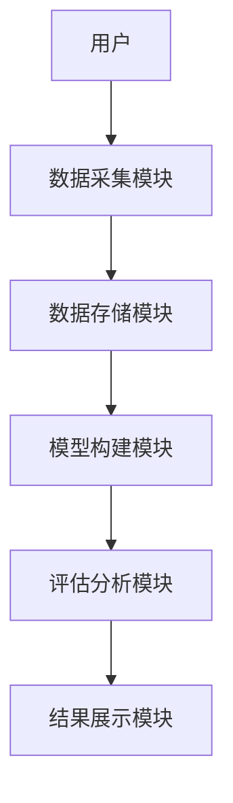
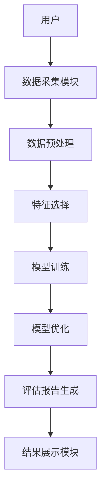

                 

# AI增强型公司治理效能评估工具

---

## 关键词

- AI增强型公司治理
- 公司治理效能
- 人工智能技术
- 算法模型
- 系统架构设计

---

## 摘要

随着人工智能技术的快速发展，AI在公司治理中的应用越来越广泛。本篇文章将详细介绍如何利用AI技术构建公司治理效能评估工具。从公司治理的基本概念到AI算法的实现，从系统架构设计到实际案例分析，我们将全面探讨AI增强型公司治理效能评估工具的构建过程。通过本篇文章，读者可以掌握如何利用AI技术提升公司治理的效率和效果。

---

# 第一章: AI与公司治理的结合

## 1.1 公司治理的基本概念

### 1.1.1 公司治理的定义与核心要素

公司治理是指通过一系列制度、机制和流程，确保公司战略目标的实现、股东权益的保护以及公司长期稳定发展的过程。其核心要素包括：

- **股权结构**：股东的权益分配和控制权结构。
- **董事会结构**：董事会的组成、职责和运作方式。
- **管理层职责**：高管的职责和权限。
- **内部控制**：公司内部的监督和风险控制机制。
- **透明度**：公司运营的透明性和信息披露。

### 1.1.2 公司治理的背景与挑战

随着全球化和数字化的快速发展，公司治理面临着以下挑战：

- **信息不对称**：股东和管理层之间的信息不对称可能导致决策失误。
- **利益冲突**：股东和管理层的利益可能存在冲突。
- **风险控制**：复杂的市场环境和内部管理可能导致公司面临各种风险。
- **效率提升**：如何通过技术创新提高公司治理的效率和效果。

### 1.1.3 AI在公司治理中的潜在价值

AI技术可以通过以下方式提升公司治理的效率和效果：

- **数据驱动决策**：利用AI分析大量数据，提供更精准的决策支持。
- **风险预测与管理**：通过AI预测潜在风险，提前采取措施。
- **自动化流程**：AI可以自动化处理公司治理中的重复性工作，提高效率。
- **透明化与可追溯性**：AI可以帮助建立透明的治理流程，并提供可追溯的记录。

## 1.2 AI技术在公司治理中的应用前景

### 1.2.1 AI技术的基本原理

AI技术的核心在于通过算法和数据训练模型，模拟人类的学习和决策能力。常用技术包括：

- **机器学习**：通过数据训练模型，预测未来趋势。
- **自然语言处理（NLP）**：理解和生成人类语言，用于文本分析和信息提取。
- **深度学习**：通过多层神经网络模型，学习复杂的模式和特征。

### 1.2.2 AI在公司治理中的应用场景

AI技术可以应用于公司治理的多个方面：

- **董事会决策支持**：通过分析历史数据和市场趋势，为董事会提供决策支持。
- **风险管理**：预测潜在风险，制定应对策略。
- **内部控制优化**：通过AI识别内部控制中的漏洞，优化流程。
- **股东沟通**：利用NLP技术分析股东反馈，优化沟通策略。

### 1.2.3 AI增强型治理工具的优势与局限性

**优势：**

- **高效性**：AI可以快速处理大量数据，提高决策效率。
- **精准性**：通过算法分析，提高决策的准确性。
- **可扩展性**：AI技术可以应用于不同规模和类型的公司。

**局限性：**

- **数据依赖性**：AI模型需要大量高质量的数据支持。
- **技术复杂性**：AI技术的实现需要专业的技术支持。
- **伦理问题**：AI决策可能引发道德和伦理问题。

## 1.3 本章小结

本章介绍了AI技术在公司治理中的应用背景和潜在价值，探讨了AI技术的基本原理及其在公司治理中的应用场景。通过分析AI增强型治理工具的优势与局限性，为后续章节的深入探讨奠定了基础。

---

# 第二章: 公司治理效能评估的核心要素

## 2.1 公司治理效能的定义与指标体系

### 2.1.1 公司治理效能的定义

公司治理效能是指公司治理机制在实现公司战略目标、保护股东权益以及提高公司运营效率方面的效果。

### 2.1.2 公司治理效能评估的主要指标

公司治理效能评估的主要指标包括：

- **董事会效率**：董事会的决策效率和执行能力。
- **管理层能力**：高管的专业能力和领导力。
- **内部控制有效性**：公司内部的监督和控制机制的有效性。
- **股东权益保护**：股东权益是否得到充分保护。
- **透明度与信息披露**：公司运营的透明度和信息披露的完整性。

### 2.1.3 指标体系的构建方法

构建公司治理效能评估指标体系的方法包括：

- **定性与定量结合**：结合定性分析和定量分析，确保评估的全面性。
- **层次分析法（AHP）**：通过层次分析法确定各指标的权重。
- **动态调整**：根据公司实际情况和市场环境的变化，动态调整指标体系。

## 2.2 AI驱动的公司治理模型构建

### 2.2.1 数据采集与处理

公司治理效能评估需要采集以下数据：

- **公司基本信息**：包括公司规模、行业、股权结构等。
- **财务数据**：包括收入、利润、资产负债率等。
- **市场数据**：包括股价、市值、行业竞争情况等。
- **治理数据**：包括董事会结构、管理层信息、内部控制机制等。

### 2.2.2 模型构建的基本步骤

公司治理效能评估模型的构建步骤如下：

1. **数据预处理**：清洗数据，处理缺失值和异常值。
2. **特征选择**：根据业务需求选择相关特征。
3. **模型训练**：使用机器学习算法训练模型。
4. **模型验证**：通过交叉验证评估模型的性能。
5. **模型优化**：根据验证结果优化模型参数。
6. **模型部署**：将模型部署到实际应用场景中。

### 2.2.3 模型的验证与优化

模型的验证与优化可以通过以下方法进行：

- **交叉验证**：通过交叉验证评估模型的泛化能力。
- **参数调优**：通过网格搜索等方法优化模型参数。
- **模型融合**：结合多个模型的结果，提高预测准确性。

## 2.3 本章小结

本章详细探讨了公司治理效能评估的核心要素和AI驱动的公司治理模型的构建方法。通过数据采集、特征选择、模型训练和优化等步骤，为后续章节的算法实现奠定了基础。

---

# 第三章: AI增强型公司治理效能评估工具的算法原理

## 3.1 支持向量机（SVM）算法原理

### 3.1.1 支持向量机的基本概念

支持向量机（Support Vector Machine, SVM）是一种监督学习算法，主要用于分类和回归问题。SVM的核心思想是通过找到一个超平面，将数据点分成不同的类别。

### 3.1.2 支持向量机的核心思想

SVM的核心思想是通过最大化分类间隔，找到一个能够最好地将数据点分开的超平面。对于线性不可分的情况，SVM通过引入核函数将数据映射到高维空间，从而实现线性可分。

### 3.1.3 支持向量机的优势与局限性

**优势：**

- **高维数据处理**：SVM可以处理高维数据。
- **强泛化能力**：SVM具有较强的泛化能力。

**局限性：**

- **参数敏感性**：SVM的性能对参数选择敏感。
- **计算复杂度高**：对于大规模数据集，SVM的计算复杂度较高。

### 3.1.4 支持向量机的数学模型

支持向量机的数学模型如下：

$$
\text{最大化} \quad \frac{1}{2} \lVert w \rVert^2
$$

$$
\text{约束} \quad y_i (w \cdot x_i + b) \geq 1, \quad i = 1, 2, ..., n
$$

其中，$w$ 是法向量，$b$ 是偏置项，$y_i$ 是标签，$x_i$ 是数据点。

### 3.1.5 支持向量机的核函数

SVM的核函数用于将数据映射到高维空间，常用的核函数包括：

- **线性核**：$K(x, y) = x \cdot y$
- **多项式核**：$K(x, y) = (x \cdot y + c)^d$
- **高斯核**：$K(x, y) = \exp(-\gamma \lVert x - y \rVert^2)$

---

## 3.2 支持向量回归（SVR）算法

### 3.2.1 支持向量回归的基本概念

支持向量回归（Support Vector Regression, SVR）是SVM的一种扩展，用于回归问题。SVR的核心思想与SVM类似，通过找到一个函数，使得所有数据点的预测值与真实值的误差在一定范围内。

### 3.2.2 支持向量回归的数学模型

支持向量回归的数学模型如下：

$$
\text{最小化} \quad \frac{1}{2} \lVert w \rVert^2 + C \sum_{i=1}^n (\xi_i^+ + \xi_i^-)
$$

$$
\text{约束} \quad y_i - (w \cdot x_i + b) \leq \xi_i^+
$$

$$
(w \cdot x_i + b) - y_i \leq \xi_i^-
$$

其中，$\xi_i^+$ 和 $\xi_i^-$ 是松弛变量，$C$ 是惩罚参数。

### 3.2.3 支持向量回归的应用

支持向量回归可以应用于公司治理效能评估中的回归问题，例如预测公司的治理效率或股东权益保护水平。

---

## 3.3 神经网络与深度学习

### 3.3.1 神经网络的基本概念

神经网络是一种模仿人脑结构和功能的算法，由多个神经元组成，通过多层网络结构进行特征提取和分类。

### 3.3.2 深度学习的基本原理

深度学习是一种基于神经网络的机器学习方法，通过多层网络结构学习数据的高层次特征。

### 3.3.3 深度学习在公司治理中的应用

深度学习可以应用于公司治理中的文本分析、图像识别等任务。

---

## 3.4 本章小结

本章详细介绍了支持向量机（SVM）和神经网络的基本原理及其在公司治理中的应用。通过数学模型和算法原理的讲解，为后续章节的系统设计和项目实现奠定了理论基础。

---

# 第四章: AI增强型公司治理效能评估工具的系统架构设计

## 4.1 系统功能设计

### 4.1.1 数据采集模块

数据采集模块负责采集公司治理相关的数据，包括公司基本信息、财务数据、市场数据等。

### 4.1.2 模型构建模块

模型构建模块负责训练和优化公司治理效能评估模型，包括数据预处理、特征选择、模型训练和优化。

### 4.1.3 评估分析模块

评估分析模块负责根据模型预测结果，生成公司治理效能评估报告。

### 4.1.4 结果展示模块

结果展示模块负责将评估报告以可视化的方式呈现给用户，包括图表、仪表盘等。

## 4.2 系统架构设计

### 4.2.1 系统架构图

以下是系统的架构图：

### 4.2.2 系统功能模块的交互流程

以下是系统的交互流程图：

## 4.3 本章小结

本章详细探讨了AI增强型公司治理效能评估工具的系统架构设计，包括功能模块划分和系统架构图的绘制。通过系统的整体设计，为后续章节的项目实现提供了指导。

---

# 第五章: 项目实战与案例分析

## 5.1 项目背景与目标

### 5.1.1 项目背景

本项目旨在通过AI技术构建公司治理效能评估工具，帮助公司优化治理结构，提升治理效率。

### 5.1.2 项目目标

本项目的具体目标包括：

- 实现公司治理效能评估模型的构建与优化。
- 开发公司治理效能评估工具的可视化界面。
- 提供实际案例分析，验证工具的有效性。

## 5.2 项目实现

### 5.2.1 环境安装与配置

#### 5.2.1.1 Python环境的安装与配置

安装Python 3.8及以上版本，并配置环境变量。

#### 5.2.1.2 相关库的安装

安装以下Python库：

- `scikit-learn`：机器学习库。
- `numpy`：数值计算库。
- `pandas`：数据分析库。
- `matplotlib`：数据可视化库。

### 5.2.2 数据采集与处理

#### 5.2.2.1 数据来源

数据来源包括公司财报、市场数据、新闻资讯等。

#### 5.2.2.2 数据清洗

通过删除缺失值和异常值，确保数据的完整性和准确性。

### 5.2.3 模型训练与优化

#### 5.2.3.1 模型选择

选择支持向量机（SVM）作为公司治理效能评估模型。

#### 5.2.3.2 模型训练

使用训练数据训练SVM模型，并通过交叉验证优化模型参数。

### 5.2.4 模型部署与应用

将训练好的模型部署到实际应用场景中，提供公司治理效能评估服务。

## 5.3 项目实战

### 5.3.1 实际案例分析

以下是一个实际案例分析：

**案例背景**：某公司治理结构不合理，董事会决策效率低下。

**解决方案**：通过AI增强型公司治理效能评估工具，分析公司治理结构中存在的问题，并提出优化建议。

**实施步骤**：

1. **数据采集**：采集公司治理相关数据。
2. **模型训练**：训练公司治理效能评估模型。
3. **评估分析**：生成公司治理效能评估报告。
4. **优化建议**：根据评估结果提出优化建议。

### 5.3.2 案例分析结果

通过AI增强型公司治理效能评估工具，我们发现该公司董事会结构不合理，建议优化董事会结构，提高决策效率。

## 5.4 本章小结

本章通过实际案例分析，详细介绍了AI增强型公司治理效能评估工具的项目实现过程。通过环境安装、数据处理、模型训练和案例分析，帮助读者掌握如何将AI技术应用到实际问题中。

---

# 第六章: 总结与展望

## 6.1 本项目总结

本项目通过AI技术构建了公司治理效能评估工具，实现了公司治理的智能化和高效化。

## 6.2 未来展望

未来，随着AI技术的不断发展，公司治理效能评估工具将更加智能化和个性化。可以通过以下方式进一步优化：

- **引入更多AI技术**：如自然语言处理（NLP）、强化学习等。
- **数据共享与合作**：建立数据共享平台，促进公司治理数据的共享与合作。
- **国际化应用**：将AI增强型公司治理效能评估工具推广到全球市场。

---

# 作者：AI天才研究院/AI Genius Institute & 禅与计算机程序设计艺术/Zen And The Art of Computer Programming

---

**注**：以上内容为《AI增强型公司治理效能评估工具》的部分章节大纲和具体内容，后续章节将根据实际需求进一步补充和完善。

