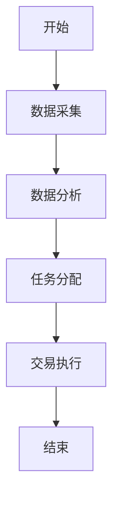
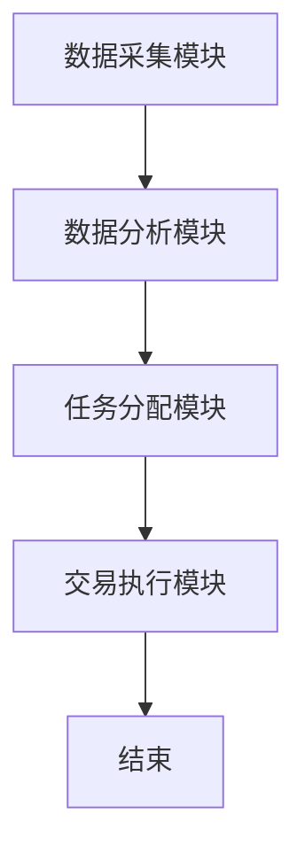

                 


# 多智能体系统实现跨市场套利策略

## 关键词：多智能体系统、跨市场套利、算法、金融、协同、分布式计算

## 摘要：  
本文深入探讨了多智能体系统在跨市场套利中的应用策略。通过分析多智能体系统的原理、算法实现、数学模型、系统架构设计以及实际项目案例，结合最佳实践和注意事项，为读者提供一个全面的技术视角，帮助理解如何利用多智能体系统实现高效的跨市场套利策略。

---

## 第一部分: 多智能体系统与跨市场套利概述

### 第1章: 多智能体系统与跨市场套利背景介绍

#### 1.1 多智能体系统的基本概念
##### 1.1.1 多智能体系统的定义  
多智能体系统（Multi-Agent System, MAS）是由多个独立但协同工作的智能体组成的系统。每个智能体都具有一定的自主性、反应性和社会性，能够通过交互完成复杂的任务。

##### 1.1.2 多智能体系统的特征  
- **自主性**：智能体能够自主决策，无需外部干预。  
- **反应性**：智能体能够感知环境并做出实时反应。  
- **社会性**：智能体之间可以通信、协作和竞争。  
- **分布性**：智能体通常分布在不同的地理位置或计算节点上。  

##### 1.1.3 多智能体系统与单智能体系统的区别  
| 特性 | 单智能体系统 | 多智能体系统 |
|------|--------------|-------------|
| 决策 | 中央化决策 | 去中心化决策 |
| 通信 | 无 | 智能体间通信 |
| 并行性 | 串行处理 | 并行处理 |
| 可扩展性 | 有限 | 高扩展性 |

#### 1.2 跨市场套利的基本概念
##### 1.2.1 跨市场套利的定义  
跨市场套利是指在同一资产或金融工具在不同市场（如股票、外汇、期货等）之间的价格差异中获利的策略。  

##### 1.2.2 跨市场套利的实现方式  
- **时间套利**：利用不同市场的价格波动时间差进行套利。  
- **地点套利**：利用不同地理位置市场的价格差异进行套利。  
- **产品套利**：利用同一资产在不同市场中的不同产品形式进行套利。  

##### 1.2.3 跨市场套利的风险与收益  
- **收益**：通过价格差异获利。  
- **风险**：市场波动、流动性风险、信用风险等。  

#### 1.3 多智能体系统在跨市场套利中的应用
##### 1.3.1 多智能体系统的优势  
- **分布式计算能力**：能够同时处理多个市场的数据。  
- **高效协同**：多个智能体可以快速响应市场变化。  
- **高扩展性**：可以轻松扩展到更多的市场和资产。  

##### 1.3.2 多智能体系统在跨市场套利中的作用  
- **实时监控**：多个智能体实时监控不同市场的价格变化。  
- **快速决策**：通过分布式计算快速发现套利机会。  
- **风险控制**：智能体协同工作，实时调整套利策略以降低风险。  

##### 1.3.3 多智能体系统实现跨市场套利的必要性  
- **市场复杂性**：单一市场难以覆盖所有套利机会。  
- **高效性**：多智能体系统能够快速响应市场变化，抓住套利窗口。  

#### 1.4 本章小结  
本章介绍了多智能体系统的基本概念、特征以及跨市场套利的基本原理和实现方式。通过对比分析，阐述了多智能体系统在跨市场套利中的优势和必要性，为后续章节的深入分析奠定了基础。

---

### 第2章: 多智能体系统与跨市场套利的核心概念与联系

#### 2.1 多智能体系统的原理
##### 2.1.1 分布式计算与协同  
分布式计算是多智能体系统的核心，通过智能体之间的通信和协作，实现任务的分解与协同。  

##### 2.1.2 多智能体系统中的通信机制  
智能体之间通过消息传递进行通信，消息内容包括价格数据、市场信息等。  

##### 2.1.3 多智能体系统的任务分配  
任务分配是多智能体系统中的关键问题，通常采用基于角色的分配方法。  

#### 2.2 跨市场套利的数学模型
##### 2.2.1 跨市场套利的基本数学公式  
套利收益计算公式：  
$$\text{收益} = \text{买入价} - \text{卖出价}$$  

##### 2.2.2 跨市场套利的风险评估模型  
风险评估公式：  
$$\text{风险} = \text{波动率} \times \text{套利规模}$$  

##### 2.2.3 跨市场套利的收益计算模型  
收益计算公式：  
$$\text{总收益} = \sum_{i=1}^{n} (\text{买入价}_i - \text{卖出价}_i) \times \text{数量}_i$$  

#### 2.3 多智能体系统与跨市场套利的结合
##### 2.3.1 多智能体系统在跨市场套利中的角色  
- **数据采集智能体**：实时采集不同市场的价格数据。  
- **分析智能体**：分析数据，发现套利机会。  
- **执行智能体**：执行交易指令。  

##### 2.3.2 多智能体系统与跨市场套利的协同机制  
通过智能体之间的协同，实现数据共享、任务分配和决策优化。  

##### 2.3.3 多智能体系统实现跨市场套利的优势  
- **高效性**：多个智能体同时处理多个市场数据。  
- **可靠性**：分布式架构提高了系统的容错性。  

#### 2.4 核心概念对比表格
##### 2.4.1 多智能体系统与单智能体系统的对比  
| 特性 | 多智能体系统 | 单智能体系统 |
|------|--------------|-------------|
| 处理能力 | 高 | 低 |
| 可扩展性 | 高 | 低 |
| 系统复杂性 | 高 | 低 |

##### 2.4.2 跨市场套利与单市场套利的对比  
| 特性 | 跨市场套利 | 单市场套利 |
|------|-------------|------------|
| 数据来源 | 多市场 | 单市场 |
| 套利机会 | 多 | 少 |
| 风险 | 中高 | 低 |

#### 2.5 本章小结  
本章深入分析了多智能体系统的核心原理和跨市场套利的数学模型，探讨了两者结合的优势，并通过对比分析明确了多智能体系统在跨市场套利中的独特价值。

---

### 第3章: 多智能体系统实现跨市场套利的算法原理

#### 3.1 分布式计算与多智能体协同算法
##### 3.1.1 分布式计算的基本原理  
分布式计算通过将任务分解到多个节点上并行执行，提高计算效率。  

##### 3.1.2 多智能体协同算法的实现步骤  
1. 数据采集：智能体采集不同市场的价格数据。  
2. 数据分析：分析智能体计算套利机会。  
3. 任务分配：根据套利机会分配智能体执行交易。  
4. 交易执行：执行智能体完成交易。  

##### 3.1.3 多智能体协同算法的优缺点  
- **优点**：高效、并行、可扩展。  
- **缺点**：通信开销大、系统复杂性高。  

#### 3.2 多智能体协同算法的实现
##### 3.2.1 算法流程图  


##### 3.2.2 算法代码实现  
```python
class Agent:
    def __init__(self, id):
        self.id = id
        self.price_data = {}

    def collect_data(self, market):
        # 从市场获取价格数据
        self.price_data[market] = get_price(market)

    def analyze(self):
        # 分析数据，寻找套利机会
        for market1 in self.price_data:
            for market2 in self.price_data:
                if market1 != market2:
                    price1 = self.price_data[market1]
                    price2 = self.price_data[market2]
                    if price1 < price2:
                        return (market1, market2, price1, price2)
        return None

# 多智能体协同算法
def multi_agent_arbitrage():
    agents = [Agent(i) for i in range(5)]
    for agent in agents:
        agent.collect_data(market)

    opportunities = []
    for agent in agents:
        opportunity = agent.analyze()
        if opportunity:
            opportunities.append(opportunity)

    if opportunities:
        execute_arbitrage(opportunities[0])
    else:
        print("无套利机会")

multi_agent_arbitrage()
```

#### 3.3 数学模型与公式
##### 3.3.1 收益计算公式  
$$\text{收益} = \sum_{i=1}^{n} (\text{买入价}_i - \text{卖出价}_i) \times \text{数量}_i$$  

##### 3.3.2 风险评估公式  
$$\text{风险} = \text{波动率} \times \text{套利规模}$$  

#### 3.4 本章小结  
本章详细介绍了多智能体协同算法的实现步骤，并通过代码和公式展示了如何利用算法实现跨市场套利。

---

### 第4章: 数学模型与系统设计

#### 4.1 跨市场套利的数学模型
##### 4.1.1 收益计算模型  
$$\text{总收益} = \sum_{i=1}^{n} (\text{买入价}_i - \text{卖出价}_i) \times \text{数量}_i$$  

##### 4.1.2 风险评估模型  
$$\text{风险} = \text{波动率} \times \text{套利规模}$$  

#### 4.2 系统架构设计
##### 4.2.1 系统功能设计  
- **数据采集模块**：实时采集多市场的价格数据。  
- **数据分析模块**：分析数据，发现套利机会。  
- **任务分配模块**：分配交易任务给执行智能体。  
- **交易执行模块**：执行交易指令。  

##### 4.2.2 系统架构图  


##### 4.2.3 系统接口设计  
- 数据采集模块接口：`get_price(market)`  
- 数据分析模块接口：`analyze_data(data)`  
- 任务分配模块接口：`assign_task(task)`  
- 交易执行模块接口：`execute_trade(task)`  

#### 4.3 本章小结  
本章通过数学模型和系统设计，展示了如何利用多智能体系统实现跨市场套利。

---

### 第5章: 项目实战

#### 5.1 项目环境安装
##### 5.1.1 安装Python  
```bash
python --version
pip install requests pandas numpy
```

##### 5.1.2 安装其他依赖  
```bash
pip install matplotlib scikit-learn
```

#### 5.2 系统核心实现源代码
##### 5.2.1 数据采集模块  
```python
import requests

def get_price(market):
    # 获取市场价格数据
    response = requests.get(f"https://api.{market}.com/price")
    return response.json()['price']
```

##### 5.2.2 数据分析模块  
```python
import numpy as np

def analyze_data(data):
    # 分析数据，寻找套利机会
    markets = list(data.keys())
    for i in range(len(markets)):
        for j in range(len(markets)):
            if i != j:
                price_i = data[markets[i]]
                price_j = data[markets[j]]
                if price_i < price_j:
                    return (markets[i], markets[j], price_i, price_j)
    return None
```

##### 5.2.3 交易执行模块  
```python
def execute_trade(task):
    # 执行交易指令
    market1, market2, price1, price2 = task
    # 下单买入市场1，卖出市场2
    print(f"买入市场{market1}，卖出市场{market2}")
```

#### 5.3 项目实战案例分析
##### 5.3.1 实际案例  
假设在两个市场中，资产A的价格分别为$100和$105。  

##### 5.3.2 分析过程  
通过数据分析模块发现套利机会：市场1价格为$100，市场2价格为$105，存在套利空间。  

##### 5.3.3 交易执行  
执行交易指令：买入市场1的资产A，卖出市场2的资产A，获利$5。

#### 5.4 本章小结  
本章通过实际项目案例，展示了多智能体系统在跨市场套利中的具体实现和应用。

---

### 第6章: 最佳实践与注意事项

#### 6.1 最佳实践
##### 6.1.1 系统设计  
- 确保系统具有高扩展性和容错性。  
- 使用高效的通信机制，减少通信开销。  

##### 6.1.2 代码实现  
- 使用模块化设计，便于维护和扩展。  
- 定期更新数据采集模块，确保数据的实时性。  

#### 6.2 注意事项
##### 6.2.1 系统风险  
- 市场波动可能导致套利机会消失。  
- 交易延迟可能影响套利收益。  

##### 6.2.2 代码风险  
- 数据同步问题可能导致交易失败。  
- 智能体之间的通信问题可能影响系统稳定性。  

#### 6.3 本章小结  
本章总结了多智能体系统实现跨市场套利的最佳实践和注意事项，帮助读者更好地理解和应用相关技术。

---

## 第七部分: 总结与展望

### 总结  
本文详细探讨了多智能体系统在跨市场套利中的应用策略，从理论到实践，系统地介绍了多智能体系统的原理、算法实现、数学模型、系统架构设计以及实际项目案例。通过本文的分析，读者可以全面理解如何利用多智能体系统实现高效的跨市场套利策略。

### 展望  
未来，随着人工智能和分布式计算技术的不断发展，多智能体系统在金融领域的应用将更加广泛。通过进一步优化算法和系统架构，多智能体系统将为跨市场套利提供更加高效和可靠的技术支持。

---

## 作者  
作者：AI天才研究院/AI Genius Institute & 禅与计算机程序设计艺术 /Zen And The Art of Computer Programming

