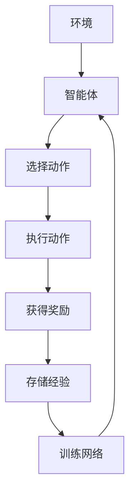
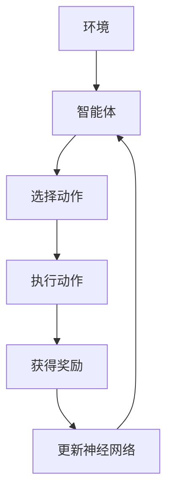
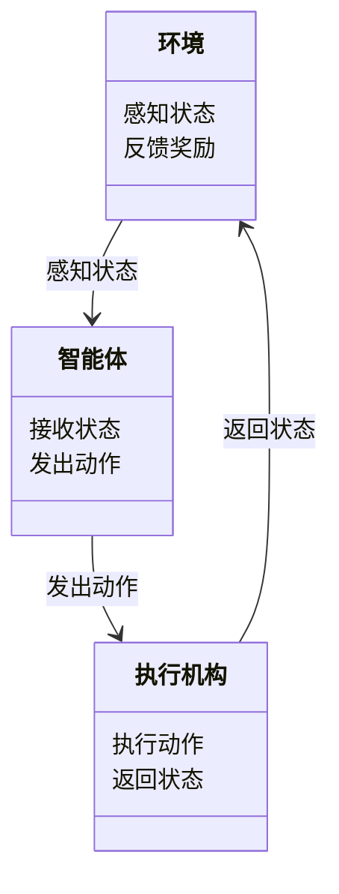

                 


# 如何识别企业的深度强化学习机器人控制优势

> 关键词：深度强化学习，机器人控制，企业优势，算法原理，系统架构，数学模型，项目实战

> 摘要：本文将深入探讨如何识别企业在深度强化学习机器人控制中的优势。首先，我们从深度强化学习的基本概念出发，分析其在机器人控制中的应用背景。接着，详细讲解深度强化学习的核心算法原理，包括Q-learning和Deep Q-Networks (DQN) 算法的数学模型和公式。然后，通过系统架构设计、项目实战和案例分析，展示如何在实际企业场景中应用这些算法。最后，我们将总结深度强化学习在机器人控制中的优势，并提供一些实用的建议和注意事项。

---

# 第一部分: 深度强化学习与机器人控制基础

## 第1章: 深度强化学习机器人控制的背景与概念

### 1.1 问题背景与定义

#### 1.1.1 深度强化学习的定义
深度强化学习（Deep Reinforcement Learning, DRL）是人工智能领域的重要分支，结合了深度学习和强化学习的优势。它通过神经网络来逼近最优策略，使智能体在与环境交互的过程中，通过试错学习找到最优动作序列。

#### 1.1.2 机器人控制的基本概念
机器人控制是指通过算法和系统设计，使机器人能够按照预定目标执行任务。控制方式可以分为基于模型的控制和无模型的控制，而深度强化学习属于无模型控制的范畴。

#### 1.1.3 深度强化学习在机器人控制中的应用
深度强化学习在机器人控制中的应用主要体现在以下几个方面：
- **自主决策**：通过深度强化学习，机器人可以在复杂环境中自主决策。
- **复杂任务优化**：深度强化学习可以优化机器人的动作序列，使其在复杂任务中表现更优。
- **实时反馈与调整**：深度强化学习能够根据实时反馈调整策略，使机器人适应动态变化的环境。

### 1.2 核心概念与联系

#### 1.2.1 强化学习的基本原理
强化学习（Reinforcement Learning, RL）是一种通过试错学习来优化策略的算法。智能体通过与环境交互，获得奖励或惩罚，并根据这些反馈调整自己的行为，以最大化累计奖励。

#### 1.2.2 深度强化学习的优势
深度强化学习相比传统强化学习的优势在于：
- **复杂状态空间处理**：深度神经网络可以处理高维、非结构化的状态空间。
- **非线性关系建模**：深度强化学习能够建模复杂的非线性关系，使智能体能够更好地适应复杂环境。
- **端到端学习**：深度强化学习可以直接从原始输入数据（如图像）学习策略，而无需手动提取特征。

#### 1.2.3 机器人控制中的状态、动作与奖励机制
在机器人控制中，状态、动作和奖励机制是强化学习的核心要素：
- **状态（State）**：描述机器人当前所处环境的信息，例如位置、速度、传感器数据等。
- **动作（Action）**：机器人在给定状态下可以执行的操作，例如移动、抓取等。
- **奖励机制（Reward Mechanism）**：通过奖励或惩罚来指导智能体的行为，使其朝着期望的目标优化。

### 1.3 深度强化学习与传统控制方法的对比

#### 1.3.1 传统机器人控制方法的特点
传统机器人控制方法通常基于模型，例如：
- **基于模型的控制**：依赖于对环境的精确建模，如PID控制、模型预测控制等。
- **线性关系假设**：传统控制方法通常假设系统是线性的，难以处理复杂的非线性关系。

#### 1.3.2 深度强化学习的独特优势
深度强化学习的独特优势在于：
- **无模型学习**：无需精确的环境模型，适用于复杂、动态变化的环境。
- **自适应性**：能够根据环境变化自适应地调整策略。
- **全局优化**：通过强化学习的累计奖励机制，可以实现全局最优策略。

#### 1.3.3 两者的对比分析
通过对比表格，我们可以更直观地理解深度强化学习与传统控制方法的差异：

| 特性                | 传统控制方法        | 深度强化学习          |
|---------------------|---------------------|----------------------|
| 建模依赖            | 高                  | 低                   |
| 处理复杂性          | 低                  | 高                   |
| 自适应性            | 弱                  | 强                   |
| 优化目标            | 局部优化            | 全局优化             |
| 适用场景            | 线性、静态系统        | 非线性、动态系统       |

### 1.4 深度强化学习在企业中的应用领域

#### 1.4.1 制造业中的机器人优化
在制造业中，深度强化学习可以用于优化机器人的路径规划、抓取策略和生产流程。

#### 1.4.2 服务机器人中的智能控制
服务机器人（如配送机器人、医疗机器人）可以通过深度强化学习实现更智能的路径规划和任务执行。

#### 1.4.3 智能交通系统中的应用
在智能交通系统中，深度强化学习可以用于优化自动驾驶车辆的决策策略，提高交通效率和安全性。

### 1.5 本章小结
本章介绍了深度强化学习的基本概念、核心优势以及在机器人控制中的应用背景。通过对比分析，我们明确了深度强化学习在企业中的独特价值。

---

## 第2章: 深度强化学习的核心算法原理

### 2.1 强化学习的基本算法

#### 2.1.1 Q-learning算法
Q-learning是一种经典的强化学习算法，通过更新Q值表来学习最优策略。其核心公式为：
$$ Q(s, a) = Q(s, a) + \alpha [r + \max Q(s', a') - Q(s, a)] $$
其中：
- \( Q(s, a) \)：状态 \( s \) 下执行动作 \( a \) 的 Q 值。
- \( \alpha \)：学习率。
- \( r \)：获得的奖励。
- \( \max Q(s', a') \)：下一个状态下的最大 Q 值。

#### 2.1.2 Deep Q-Networks (DQN) 算法
DQN 是 Q-learning 的深度版本，通过神经网络近似 Q 函数。其主要思想是：
- 使用两个神经网络：主网络和目标网络。
- 主网络负责预测当前状态的 Q 值，目标网络用于更新目标值。
- 通过经验回放（Experience Replay）缓解样本偏差问题。

DQN 的核心流程如图所示：



#### 2.1.3 算法的数学模型与公式
DQN 的数学模型如下：
$$ Q_{\theta}(s, a) = \arg\max_a Q_{\theta}(s, a) $$
其中：
- \( Q_{\theta} \)：参数为 \( \theta \) 的深度神经网络。
- \( s \)：当前状态。
- \( a \)：动作。

### 2.2 深度强化学习的数学模型

#### 2.2.1 状态值函数的定义
状态值函数 \( V(s) \) 定义为在状态 \( s \) 下，智能体能够获得的最大累计奖励。其数学表达式为：
$$ V(s) = \max_a Q(s, a) $$

#### 2.2.2 动作值函数的定义
动作值函数 \( Q(s, a) \) 定义为在状态 \( s \) 下执行动作 \( a \) 的期望累计奖励。其数学表达式为：
$$ Q(s, a) = r + \gamma V(s') $$
其中：
- \( r \)：即时奖励。
- \( \gamma \)：折扣因子。
- \( s' \)：下一个状态。

#### 2.2.3 策略梯度方法的数学推导
策略梯度方法通过优化策略 \( \pi(a|s) \) 来最大化期望累计奖励。其目标函数为：
$$ J(\theta) = \mathbb{E}_{s,a}[\log \pi(a|s;\theta) Q(s,a)] $$
其中：
- \( \pi(a|s;\theta) \)：策略函数。
- \( Q(s,a) \)：动作值函数。

### 2.3 深度强化学习的算法流程

#### 2.3.1 环境与智能体的交互流程
深度强化学习的交互流程如图所示：



#### 2.3.2 神经网络的训练过程
神经网络的训练过程包括以下步骤：
1. 从经验回放池中随机抽取一批经验。
2. 计算目标 Q 值：\( y = r + \gamma \max Q(s', a') \)。
3. 训练主网络，使其预测 Q 值与目标 Q 值一致。
4. 定期更新目标网络参数。

#### 2.3.3 奖励机制的设计与实现
奖励机制的设计至关重要，直接影响算法的学习效果。常见的奖励设计方法包括：
- **密度奖励**：根据任务完成度给予奖励。
- **惩罚机制**：对不良行为给予惩罚。
- **进度奖励**：根据任务进展给予奖励。

### 2.4 本章小结
本章详细讲解了深度强化学习的核心算法原理，包括 Q-learning、DQN 以及策略梯度方法的数学模型和公式。通过这些算法，我们可以实现机器人控制的优化。

---

## 第3章: 深度强化学习在机器人控制中的系统架构

### 3.1 系统架构设计

#### 3.1.1 系统功能模块划分
深度强化学习机器人控制系统通常包括以下几个功能模块：
- **环境感知模块**：负责采集环境信息。
- **智能体决策模块**：负责根据环境信息生成动作。
- **执行机构模块**：负责执行智能体决策的动作。
- **奖励机制模块**：负责根据动作结果给予奖励。

#### 3.1.2 神经网络的输入输出设计
神经网络的输入通常为状态信息，输出为动作值或策略。例如：
- **输入**：机器人当前的状态（位置、速度、传感器数据等）。
- **输出**：机器人可以执行的动作（例如，移动方向、抓取位置等）。

#### 3.1.3 系统的硬件与软件架构
系统的硬件架构通常包括：
- **传感器**：用于感知环境（如摄像头、激光雷达）。
- **计算单元**：用于运行深度强化学习算法（如 GPU 加速）。
- **执行机构**：用于执行动作（如电机、舵机）。

系统的软件架构通常包括：
- **数据采集模块**：负责采集传感器数据。
- **决策模块**：负责运行深度强化学习算法。
- **控制模块**：负责根据决策结果控制执行机构。

### 3.2 系统接口设计

#### 3.2.1 智能体与环境的接口定义
智能体与环境的接口通常包括：
- **输入接口**：接收环境状态信息。
- **输出接口**：输出动作指令。

#### 3.2.2 神经网络模型的接口设计
神经网络模型的接口通常包括：
- **输入接口**：接收状态信息。
- **输出接口**：输出动作值或策略。

#### 3.2.3 用户与系统的交互接口
用户与系统的交互接口通常包括：
- **输入接口**：接收用户的控制指令。
- **输出接口**：输出系统状态和执行结果。

### 3.3 系统交互流程

#### 3.3.1 系统启动与初始化流程
1. 初始化环境和智能体。
2. 加载神经网络模型。
3. 等待用户输入或开始自主运行。

#### 3.3.2 环境感知与状态采集流程
1. 传感器采集环境信息。
2. 状态信息传递给智能体。

#### 3.3.3 动作决策与执行流程
1. 智能体根据状态信息生成动作。
2. 执行机构执行动作。
3. 环境反馈奖励或惩罚。

### 3.4 本章小结
本章详细介绍了深度强化学习机器人控制系统的架构设计，包括功能模块划分、接口设计和交互流程。通过这些设计，我们可以构建一个高效的机器人控制系统。

---

## 第4章: 深度强化学习机器人控制的项目实战

### 4.1 项目背景介绍

#### 4.1.1 项目目标
本项目的目标是实现一个基于深度强化学习的机器人控制系统的开发与部署。

#### 4.1.2 项目需求
- 实现机器人自主决策。
- 优化机器人的动作序列。
- 提高机器人的环境适应能力。

### 4.2 系统功能设计

#### 4.2.1 领域模型设计
领域模型设计如图所示：



#### 4.2.2 系统架构设计
系统架构设计如图所示：

```mermaid
graph TD
    A[用户] --> B[智能体]
    B --> C[神经网络]
    C --> D[执行机构]
    D --> E[环境]
    E --> B: 反馈奖励
```

#### 4.2.3 系统接口设计
系统接口设计如图所示：

```mermaid
graph TD
    A[用户] --> B[智能体]
    B --> C[神经网络]
    C --> D[执行机构]
    D --> E[环境]
    E --> B: 反馈奖励
```

#### 4.2.4 系统交互流程
系统交互流程如图所示：

```mermaid
graph TD
    A[用户] --> B[智能体]
    B --> C[神经网络]
    C --> D[执行机构]
    D --> E[环境]
    E --> B: 反馈奖励
```

### 4.3 项目实现

#### 4.3.1 环境安装
需要安装以下环境：
- Python 3.6+
- TensorFlow/PyTorch
- OpenAI Gym 或其他机器人模拟环境。

#### 4.3.2 核心代码实现
以下是基于 DQN 的机器人控制代码示例：

```python
import numpy as np
import gym
import tensorflow as tf

class DQN:
    def __init__(self, state_space, action_space, learning_rate=0.01, gamma=0.99):
        self.state_space = state_space
        self.action_space = action_space
        self.learning_rate = learning_rate
        self.gamma = gamma
        self.model = self.build_model()
        self.target_model = self.build_model()
        self.target_update()

    def build_model(self):
        model = tf.keras.Sequential([
            tf.keras.layers.Dense(64, activation='relu', input_dim=self.state_space),
            tf.keras.layers.Dense(64, activation='relu'),
            tf.keras.layers.Dense(self.action_space, activation='linear')
        ])
        model.compile(optimizer=tf.keras.optimizers.Adam(self.learning_rate), loss='mse')
        return model

    def target_update(self):
        self.target_model.set_weights(self.model.get_weights())

    def act(self, state):
        state = np.array([state])
        q = self.model.predict(state)
        return np.argmax(q[0])

    def remember(self, state, action, reward, next_state):
        # 简化版，不使用经验回放池
        pass

    def replay(self, batch_size):
        # 简化版，不使用经验回放池
        pass

    def train(self, state, action, reward, next_state):
        target = reward + self.gamma * np.max(self.target_model.predict(np.array([next_state])))
        target[0][action] = target
        self.model.fit(np.array([state]), target, epochs=1, verbose=0)

# 初始化环境
env = gym.make('CartPole-v1')
state_space = env.observation_space.shape[0]
action_space = env.action_space.n

# 初始化DQN算法
dqn = DQN(state_space, action_space)

# 训练过程
for episode in range(1000):
    state = env.reset()
    total_reward = 0
    while True:
        action = dqn.act(state)
        next_state, reward, done, _ = env.step(action)
        dqn.train(state, action, reward, next_state)
        total_reward += reward
        state = next_state
        if done:
            break
    print(f'Episode {episode}, Total Reward: {total_reward}')
```

#### 4.3.3 代码应用解读与分析
上述代码实现了基于 DQN 的机器人控制，主要步骤包括：
1. 初始化环境和 DQN 算法。
2. 在每个 episode 中，智能体根据当前状态选择动作。
3. 执行动作后，智能体根据反馈的奖励更新神经网络。
4. 重复上述过程，逐步优化策略。

### 4.4 案例分析与详细讲解
以经典的 CartPole 环境为例，分析深度强化学习在机器人控制中的应用。通过训练过程，我们可以观察到智能体如何逐步掌握平衡小车的技巧。

### 4.5 项目小结
本章通过一个实际项目，详细讲解了深度强化学习机器人控制系统的开发与实现。通过代码示例和案例分析，读者可以更好地理解算法的实际应用。

---

## 第5章: 深度强化学习在企业中的应用与优势

### 5.1 企业中的深度强化学习应用

#### 5.1.1 制造业中的机器人优化
深度强化学习可以优化制造业中的机器人路径规划和生产流程。

#### 5.1.2 服务机器人中的智能控制
深度强化学习可以提升服务机器人（如配送机器人、医疗机器人）的智能性。

#### 5.1.3 智能交通系统中的应用
深度强化学习可以优化自动驾驶车辆的决策策略。

### 5.2 深度强化学习的核心优势

#### 5.2.1 无模型学习
深度强化学习无需精确的环境模型，适用于复杂、动态变化的环境。

#### 5.2.2 自适应性
深度强化学习能够根据环境变化自适应地调整策略。

#### 5.2.3 全局优化
通过强化学习的累计奖励机制，可以实现全局最优策略。

### 5.3 深度强化学习在企业中的应用价值

#### 5.3.1 提高生产效率
通过优化机器人控制策略，可以提高生产效率。

#### 5.3.2 降低成本
通过智能控制，可以降低能耗和维护成本。

#### 5.3.3 提升产品质量
通过精确的控制策略，可以提高产品质量。

### 5.4 本章小结
本章总结了深度强化学习在企业中的应用价值和核心优势，为企业决策者提供了参考。

---

## 第6章: 最佳实践、小结与拓展阅读

### 6.1 最佳实践 tips

#### 6.1.1 算法选择
根据具体场景选择合适的算法，如 Q-learning、DQN 或策略梯度方法。

#### 6.1.2 环境设计
设计合理的奖励机制，避免奖励稀疏性问题。

#### 6.1.3 系统优化
优化神经网络结构和训练策略，提高算法效率。

### 6.2 小结
通过本文的讲解，我们深入探讨了如何识别企业在深度强化学习机器人控制中的优势。从算法原理到系统架构，再到项目实战，我们全面分析了深度强化学习的应用场景和优势。

### 6.3 注意事项

#### 6.3.1 算法的收敛性
深度强化学习算法的收敛性取决于环境设计和参数选择。

#### 6.3.2 训练效率
复杂的环境和算法可能导致训练效率低下。

#### 6.3.3 系统的实时性
在实时性要求高的场景中，需要优化算法和系统架构。

### 6.4 拓展阅读

#### 6.4.1 深度强化学习的最新进展
建议阅读最新的学术论文和行业报告，了解深度强化学习的最新进展。

#### 6.4.2 实际应用案例
建议学习更多的实际应用案例，了解不同场景下的解决方案。

#### 6.4.3 工具与框架
建议熟悉一些常用的深度强化学习框架，如 TensorFlow、PyTorch 等。

---

# 作者：AI天才研究院/AI Genius Institute & 禅与计算机程序设计艺术 /Zen And The Art of Computer Programming

---

# 致谢
感谢您的耐心阅读！希望本文能为您提供有价值的见解和启发，助您在深度强化学习机器人控制领域取得更大的成功。

