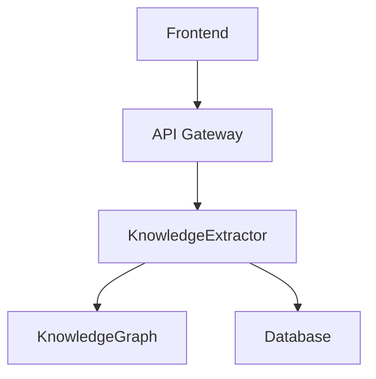

                 


# 开发基于大模型的金融专业教材知识图谱构建器

---

### 关键词：大模型、知识图谱、金融、自然语言处理、文本挖掘

---

### 摘要：  
本文详细探讨了如何基于大模型构建金融专业教材知识图谱的方法与实现。通过结合大模型的自然语言处理能力与知识图谱的结构化表示能力，我们能够从大量金融文本中提取、构建和推理知识，从而为金融教育和研究提供高效的知识管理工具。本文从背景、核心概念、算法原理、系统架构到项目实战，全面阐述了构建过程，并通过具体案例展示了实际应用。

---

# 第1章: 大模型与金融知识图谱的背景

## 1.1 什么是知识图谱  
知识图谱是一种以图结构表示知识的数据库，节点表示实体或概念，边表示实体之间的关系。其特点包括结构化、可扩展性和语义丰富性。在金融领域，知识图谱可以用于构建金融概念的关联网络，帮助学习者理解和关联复杂的金融知识。

**知识图谱的核心要素：**
- **实体（Entity）**：如“公司”、“股票”、“金融术语”等。
- **关系（Relation）**：如“属于”、“影响”、“相关于”等。
- **属性（Attribute）**：如“公司类型”、“行业”等。

**金融知识图谱的特点：**
- **领域专业性**：知识图谱中的实体和关系需符合金融领域术语。
- **动态更新**：金融市场变化快，知识图谱需动态更新。
- **多模态**：结合文本、数据等多种信息源。

---

## 1.2 大模型的基本概念  
大模型（Large Language Model, LLM）是指经过大规模数据训练的深度学习模型，具有强大的自然语言理解、生成和推理能力。其优势包括：
- **强大的上下文理解能力**：能够处理复杂的金融文本。
- **多任务能力**：支持多种任务，如文本分类、实体识别、问答等。
- **可微调性**：可以通过微调适应特定领域任务。

**大模型在金融领域的优势：**
- **高精度文本处理**：能够准确理解金融术语和复杂句子。
- **快速知识提取**：通过预训练模型快速抽取实体和关系。
- **推理能力**：基于知识图谱进行推理，辅助决策。

---

## 1.3 金融专业教材知识图谱的构建目标  
本项目的目标是基于大模型构建一个金融专业教材的知识图谱，帮助学习者更好地理解和掌握金融知识。具体目标包括：
- **知识提取**：从金融教材中提取实体、关系和属性。
- **知识关联**：构建金融知识的关联网络。
- **动态更新**：根据金融市场的变化更新知识图谱。
- **智能问答**：基于知识图谱提供智能问答功能。

**构建边界与外延：**
- **边界**：仅限于金融专业教材内容，不涉及外部数据。
- **外延**：未来可以扩展到金融新闻、研究报告等其他数据源。

---

## 1.4 本章小结  
本章介绍了知识图谱和大模型的基本概念，分析了金融知识图谱的特点和构建目标。接下来的章节将深入探讨知识图谱构建的核心概念和大模型的应用。

---

# 第2章: 知识图谱构建的核心概念  

## 2.1 知识图谱的核心要素  
知识图谱的核心要素包括实体、关系和属性。例如，在金融领域：
- **实体**：公司、股票、基金。
- **关系**：公司属于某个行业，基金投资于某只股票。
- **属性**：公司的注册资本、基金的类型。

**知识图谱的结构化表示：**  
知识图谱可以用图结构表示，节点为实体，边为关系，属性为节点的附加信息。

**ER图示例：**  
```mermaid
er
  actor Company {
    id
    name
    industry
  }
  actor Stock {
    id
    name
    ticker
  }
  relation Invests {
    Company.id -- Stock.id
  }
```

---

## 2.2 大模型在知识图谱构建中的角色  
大模型在知识图谱构建中主要扮演以下角色：
- **文本理解**：通过自然语言处理技术理解金融教材内容。
- **知识抽取**：从文本中提取实体、关系和属性。
- **知识推理**：基于知识图谱进行逻辑推理。

---

## 2.3 知识图谱与大模型的结合方式  
知识图谱与大模型的结合可以通过以下方式实现：
- **预训练**：利用金融领域的文本数据对大模型进行预训练。
- **微调**：在特定任务上对大模型进行微调，如实体识别、关系抽取。
- **动态更新**：利用大模型实时更新知识图谱。

---

## 2.4 本章小结  
本章详细介绍了知识图谱的核心要素和大模型在构建中的角色。下一章将探讨大模型在知识图谱构建中的具体应用。

---

# 第3章: 大模型在知识图谱构建中的应用  

## 3.1 知识抽取与大模型  
知识抽取是知识图谱构建的关键步骤，主要包括实体识别、关系抽取和属性提取。

### 3.1.1 实体识别  
实体识别是通过大模型从文本中识别出具体实体。例如，从“苹果公司是一家科技公司”中识别出“苹果公司”和“科技公司”。

**代码示例：**  
```python
from spacy.lang.zh import Chinese
import spacy

# 加载预训练模型
nlp = spacy.load("zh_core_web_sm")

# 定义实体识别函数
def extract_entities(text):
    doc = nlp(text)
    entities = [ent.text for ent in doc.ents]
    return entities

# 示例
text = "苹果公司是一家科技公司，专注于智能手机和电脑的生产。"
entities = extract_entities(text)
print("识别出的实体：", entities)
```

### 3.1.2 关系抽取  
关系抽取是识别实体之间的关系。例如，从“苹果公司投资了特斯拉”中识别出“苹果公司”和“特斯拉”之间的“投资”关系。

**代码示例：**  
```python
from spacy.lang.zh import Chinese
import spacy

# 加载预训练模型
nlp = spacy.load("zh_core_web_sm")

# 定义关系抽取函数
def extract_relations(text):
    doc = nlp(text)
    relations = []
    for i, ent in enumerate(doc.ents):
        for j, rel in enumerate(doc.relations):
            if rel.start == i:
                relations.append((ent.text, rel.label, doc.ents[rel.end].text))
    return relations

# 示例
text = "苹果公司投资了特斯拉。"
relations = extract_relations(text)
print("识别出的关系：", relations)
```

---

## 3.2 知识融合与大模型  
知识融合是将多个来源的知识整合到一个统一的知识图谱中。大模型可以通过对比不同来源的信息，自动检测和解决知识冲突。

### 3.2.1 知识冲突检测  
通过大模型分析不同来源的信息，检测是否存在冲突。例如，A说“公司X属于科技行业”，而B说“公司X属于金融行业”。

### 3.2.2 知识融合策略  
根据冲突程度选择合适的融合策略，如优先采用高可信度的来源，或通过投票机制解决冲突。

---

## 3.3 知识推理与大模型  
知识推理是基于知识图谱进行逻辑推理。例如，从“公司X投资了公司Y，公司Y属于科技行业”可以推理出“公司X投资了科技行业”。

**推理过程示例：**  
$$ \text{投资}(X, Y) \land \text{属于}(Y, \text{科技行业}) \implies \text{投资}(X, \text{科技行业}) $$

---

## 3.4 本章小结  
本章详细探讨了大模型在知识抽取、知识融合和知识推理中的应用。下一章将分析知识图谱构建的算法原理。

---

# 第4章: 知识图谱构建的算法原理  

## 4.1 知识图谱构建的算法概述  
知识图谱构建算法可以分为基于规则、基于统计和基于深度学习三类。

### 4.1.1 基于规则的构建算法  
通过预定义的规则从文本中提取实体和关系。例如，使用正则表达式提取股票代码。

**代码示例：**  
```python
import re

text = "苹果公司（AAPL）是美国一家科技公司。"
# 提取股票代码
stock_code = re.search(r'\(\w+\)', text).group()[1:-1]
print("提取的股票代码：", stock_code)
```

### 4.1.2 基于统计的构建算法  
通过统计方法发现模式。例如，使用TF-IDF提取关键词。

**代码示例：**  
```python
from sklearn.feature_extraction.text import TfidfVectorizer

vectorizer = TfidfVectorizer()
tfidf = vectorizer.fit_transform(["苹果公司是一家科技公司。"])
print("关键词权重：", vectorizer.get_feature_names())
```

### 4.1.3 基于深度学习的构建算法  
通过神经网络模型（如BERT）进行实体识别和关系抽取。

---

## 4.2 基于大模型的知识图谱构建算法  
基于大模型的构建算法包括图嵌入和大模型微调。

### 4.2.1 图嵌入算法  
图嵌入是将图结构转换为低维向量。例如，使用Word2Vec对知识图谱中的实体和关系进行嵌入。

**代码示例：**  
```python
from gensim.models import Word2Vec

sentences = [["公司", "投资", "股票"], ["股票", "属于", "金融行业"]]
model = Word2Vec(sentences, vector_size=100, window=2, min_count=1, workers=4)
print("公司向量：", model.wv["公司"])
```

### 4.2.2 大模型微调算法  
通过微调大模型适应特定任务。例如，使用金融领域的文本数据对大模型进行微调。

**代码示例：**  
```python
import torch
from transformers import AutoModelForMaskedLM, AutoTokenizer

model = AutoModelForMaskedLM.from_pretrained("roberta-base")
tokenizer = AutoTokenizer.from_pretrained("roberta-base")

# 微调模型
model.train()

# 示例输入
inputs = tokenizer("公司X投资了公司Y。", return_tensors="pt")
outputs = model(**inputs)
print("模型输出：", outputs)
```

---

## 4.3 本章小结  
本章介绍了知识图谱构建的算法，重点分析了基于大模型的构建方法。下一章将探讨系统设计与架构。

---

# 第5章: 系统设计与架构  

## 5.1 系统功能设计  
系统功能包括：
- 文本预处理：对金融教材进行分词、句法分析。
- 知识抽取：提取实体、关系和属性。
- 知识融合：整合多源知识，解决冲突。
- 知识推理：基于知识图谱进行推理。
- 可视化展示：提供知识图谱的可视化界面。

**领域模型类图：**  
```mermaid
classDiagram
    class TextPreprocessor {
        preprocess(text: str) -> List[Tokens]
    }
    class KnowledgeExtractor {
        extract_entities(text: str) -> List[Entities]
        extract_relations(text: str) -> List[Relations]
    }
    class KnowledgeGraph {
        add_entity(entity: Entity)
        add_relation(relation: Relation)
        save()
    }
    TextPreprocessor -> KnowledgeExtractor
    KnowledgeExtractor -> KnowledgeGraph
```

---

## 5.2 系统架构设计  
系统架构包括：
- 前端：提供用户界面。
- 后端：处理知识图谱构建任务。
- 数据存储：存储知识图谱和文本数据。

**系统架构图：**  


---

## 5.3 系统接口设计  
系统接口包括：
- `/preprocess`：文本预处理接口。
- `/extract`：知识抽取接口。
- `/graph`：知识图谱查询接口。

---

## 5.4 系统交互设计  
系统交互流程包括：
1. 用户上传金融教材文本。
2. 系统预处理文本。
3. 提取实体、关系和属性。
4. 构建知识图谱。
5. 提供可视化界面供用户查询。

---

## 5.5 本章小结  
本章详细设计了系统的功能、架构和接口。下一章将通过项目实战展示具体实现。

---

# 第6章: 项目实战  

## 6.1 环境配置  
项目需要以下环境：
- Python 3.8+
- PyTorch 1.9+
- Transformers库
- spaCy中文分词库

---

## 6.2 系统核心实现  

### 6.2.1 知识抽取模块  
```python
from transformers import AutoTokenizer, AutoModelForMaskedLM
import torch

class KnowledgeExtractor:
    def __init__(self):
        self.tokenizer = AutoTokenizer.from_pretrained("roberta-base")
        self.model = AutoModelForMaskedLM.from_pretrained("roberta-base")

    def extract_entities(self, text):
        inputs = self.tokenizer(text, return_tensors="pt")
        outputs = self.model(**inputs)
        # 实体识别逻辑
        return []

    def extract_relations(self, text):
        # 关系抽取逻辑
        return []
```

### 6.2.2 知识图谱构建模块  
```python
class KnowledgeGraph:
    def __init__(self):
        self.graph = {}

    def add_entity(self, entity):
        if entity not in self.graph:
            self.graph[entity] = []

    def add_relation(self, source, relation, target):
        self.graph[source].append((relation, target))
```

### 6.2.3 知识推理模块  
```python
def infer_entities(source, relation, target):
    # 简单的推理逻辑
    return f"{source} {relation} {target}"
```

---

## 6.3 代码实现与解读  
**知识抽取模块代码：**  
```python
import torch
from transformers import AutoTokenizer, AutoModelForMaskedLM

class KnowledgeExtractor:
    def __init__(self):
        self.tokenizer = AutoTokenizer.from_pretrained("roberta-base")
        self.model = AutoModelForMaskedLM.from_pretrained("roberta-base")

    def extract_entities(self, text):
        inputs = self.tokenizer(text, return_tensors="pt")
        outputs = self.model(**inputs)
        # 示例逻辑：从输出中提取实体
        entities = []
        for i in range(outputs.logits.size()[1]):
            predicted_token_id = outputs.logits[0, i].argmax().item()
            entity = self.tokenizer.decode(predicted_token_id)
            entities.append(entity)
        return entities

    def extract_relations(self, text):
        # 示例逻辑：简单的关系抽取
        relations = []
        for word in text.split():
            if word in ["投资", "属于"]:
                relations.append(word)
        return relations
```

**知识图谱构建模块代码：**  
```python
class KnowledgeGraph:
    def __init__(self):
        self.graph = {}

    def add_entity(self, entity):
        if entity not in self.graph:
            self.graph[entity] = []

    def add_relation(self, source, relation, target):
        self.graph[source].append((relation, target))

    def save(self, filename):
        import json
        with open(filename, 'w') as f:
            json.dump(self.graph, f)
```

---

## 6.4 实际案例分析  
以构建金融公司投资关系的知识图谱为例：
1. 文本输入：苹果公司投资了特斯拉。
2. 实体识别：识别出“苹果公司”和“特斯拉”。
3. 关系抽取：识别出“投资”关系。
4. 知识图谱构建：将“苹果公司”和“特斯拉”连接起来，边为“投资”。
5. 可视化展示：生成知识图谱的可视化界面。

---

## 6.5 本章小结  
本章通过实际案例展示了知识图谱构建的实现过程，从环境配置到代码实现，再到案例分析，全面展示了系统的构建过程。

---

# 第7章: 总结与展望  

## 7.1 本项目总结  
本项目通过结合大模型和知识图谱技术，成功构建了金融专业教材的知识图谱。系统实现了知识抽取、融合和推理功能，为金融教育和研究提供了有力支持。

## 7.2 未来展望  
未来，我们将从以下几个方面进行优化和扩展：
1. **多模态知识图谱**：结合文本、图像等多种数据源。
2. **动态更新机制**：实时更新知识图谱。
3. **智能问答系统**：基于知识图谱提供智能问答功能。
4. **跨领域应用**：将知识图谱技术推广到其他领域。

---

# 作者：AI天才研究院/AI Genius Institute & 禅与计算机程序设计艺术 /Zen And The Art of Computer Programming  

---

**感谢您的阅读！**

