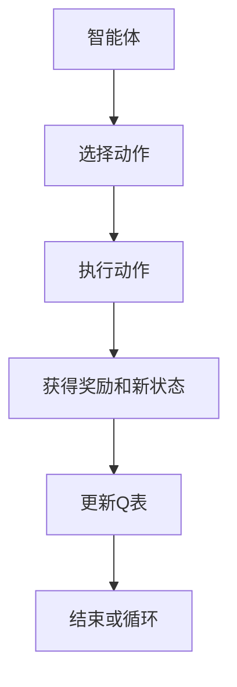
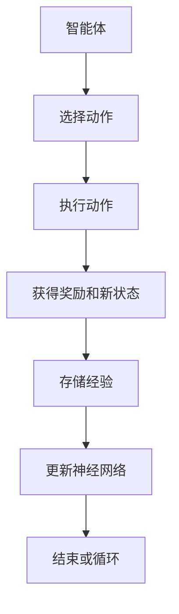
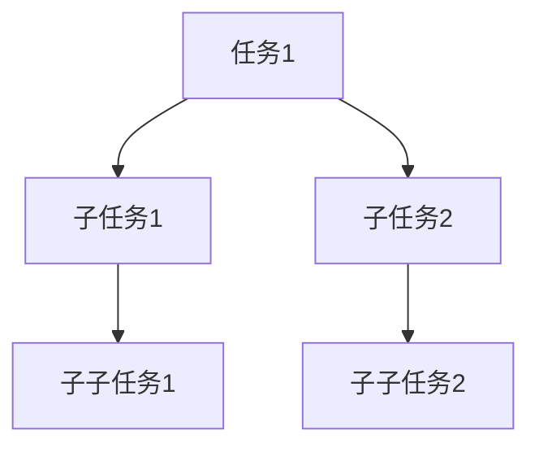
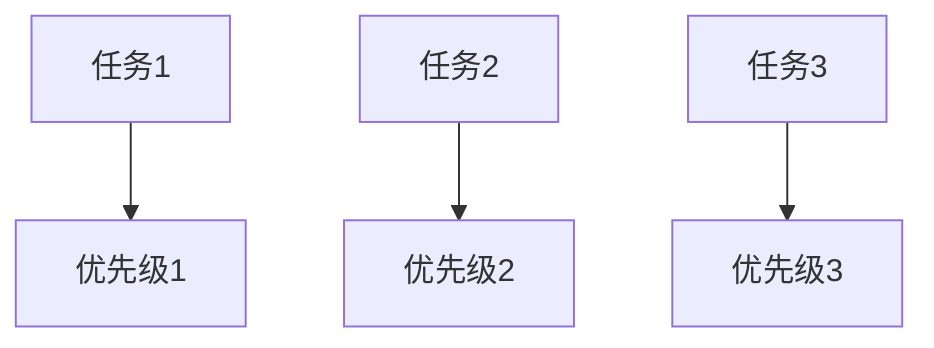
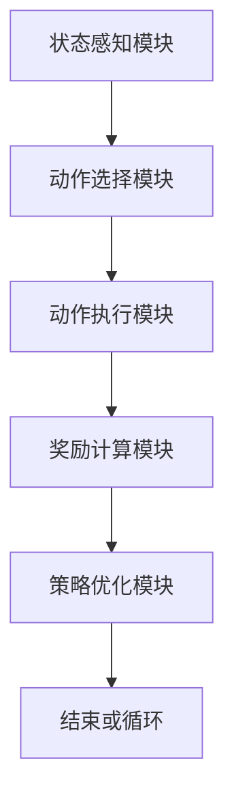

                 


# 《强化学习在AI Agent任务规划中的实践》

---

## 关键词：强化学习，AI Agent，任务规划，Q-learning，DQN，马尔可夫决策过程

---

## 摘要：  
本文深入探讨了强化学习在AI Agent任务规划中的实践应用。通过介绍强化学习的基本概念、理论基础、核心算法及其在任务规划中的具体应用，本文旨在帮助读者理解如何利用强化学习技术实现智能体的任务规划。文章内容涵盖强化学习的数学模型、算法实现、系统架构设计以及实际项目案例，帮助读者从理论到实践全面掌握强化学习在任务规划中的应用方法。

---

# 第一部分：强化学习与AI Agent任务规划背景

## 第1章：强化学习与AI Agent概述

### 1.1 强化学习的基本概念

#### 1.1.1 强化学习的定义与特点

强化学习（Reinforcement Learning，RL）是一种机器学习范式，通过智能体与环境的交互，学习如何采取行动以最大化累积奖励。与监督学习和无监督学习不同，强化学习依赖于即时反馈（奖励）来调整策略，逐步逼近最优行为。

- **定义**：强化学习是一个智能体与环境交互的过程，通过不断试错，学习如何在给定状态下选择最优动作，以获得最大化的累计奖励。
- **特点**：
  - **试错性**：智能体通过与环境交互，逐步学习最优策略。
  - **延迟奖励**：奖励可能在多个动作之后才给出。
  - **不确定性**：环境可能具有不确定性，智能体需要在不确定性中做出决策。

#### 1.1.2 AI Agent的基本概念

AI Agent（智能体）是具有感知环境和自主决策能力的实体，能够根据环境信息做出决策并执行动作。AI Agent可以是软件程序、机器人或其他智能系统，其核心目标是通过感知和行动实现特定任务。

- **定义**：AI Agent是一个能够感知环境、做出决策并执行动作的实体。
- **类型**：
  - **反应式Agent**：基于当前感知做出决策。
  - **认知式Agent**：具有复杂推理和规划能力。
  - **效用式Agent**：基于效用函数进行决策。

#### 1.1.3 强化学习在AI Agent中的作用

强化学习为AI Agent提供了自适应决策的能力，使其能够在动态环境中不断优化行为策略。通过强化学习，AI Agent可以学会在复杂任务中做出最优决策，提升任务执行效率。

---

### 1.2 任务规划的核心概念

#### 1.2.1 任务规划的定义与分类

任务规划是指智能体根据任务目标和环境信息，制定一系列行动步骤以实现任务目标。任务规划可以分为静态任务规划和动态任务规划，分别适用于静态环境和动态环境。

- **定义**：任务规划是智能体根据任务目标和环境信息，制定行动步骤的过程。
- **分类**：
  - **静态任务规划**：环境固定，任务目标明确。
  - **动态任务规划**：环境动态变化，任务目标可能调整。

#### 1.2.2 任务规划的挑战与解决方案

任务规划面临环境不确定性、任务复杂性、计算资源限制等挑战。强化学习通过试错学习和策略优化，为任务规划提供了有效的解决方案。

- **挑战**：
  - **不确定性**：环境可能不可预测。
  - **复杂性**：任务可能涉及多个子任务。
  - **资源限制**：计算资源有限。
- **解决方案**：
  - **强化学习**：通过试错优化策略。
  - **分解任务**：将复杂任务分解为简单子任务。
  - **状态表示**：建立有效的状态表示方法。

#### 1.2.3 强化学习在任务规划中的优势

强化学习通过试错学习和策略优化，能够在动态环境中自适应调整任务规划策略，提升任务执行效率。

- **优势**：
  - **自适应性**：能够适应环境变化。
  - **全局优化**：能够优化全局策略。
  - **实时性**：能够实时调整规划。

---

### 1.3 强化学习与任务规划的结合

#### 1.3.1 强化学习在任务规划中的应用场景

强化学习广泛应用于机器人路径规划、自动驾驶、游戏AI等领域，帮助智能体在复杂环境中实现任务目标。

- **应用场景**：
  - **机器人路径规划**：智能体通过强化学习优化路径。
  - **自动驾驶**：智能体通过强化学习实现自动驾驶决策。
  - **游戏AI**：智能体通过强化学习提升游戏水平。

#### 1.3.2 强化学习与任务规划的结合方式

强化学习通过与任务规划的结合，实现了智能体在复杂任务中的自适应决策能力。

- **结合方式**：
  - **端到端学习**：直接从状态到动作的学习。
  - **任务分解**：将复杂任务分解为简单子任务。
  - **策略优化**：通过策略优化提升任务执行效率。

#### 1.3.3 任务规划的数学模型与核心要素

任务规划的数学模型通常基于马尔可夫决策过程（MDP），包括状态空间、动作空间、奖励函数等核心要素。

- **数学模型**：
  - **MDP**：定义为五元组 $(S, A, P, R, \gamma)$，其中：
    - $S$：状态空间。
    - $A$：动作空间。
    - $P$：状态转移概率。
    - $R$：奖励函数。
    - $\gamma$：折扣因子。

---

### 1.4 本章小结

本章介绍了强化学习和AI Agent的基本概念，分析了任务规划的核心概念和挑战，探讨了强化学习在任务规划中的优势和应用场景。通过本章，读者可以理解强化学习与任务规划的结合方式，为后续章节的学习奠定基础。

---

## 第2章：强化学习的理论基础

### 2.1 强化学习的基本原理

#### 2.1.1 马尔可夫决策过程（MDP）

马尔可夫决策过程（MDP）是强化学习的核心数学模型，描述了智能体与环境的交互过程。

- **定义**：MDP定义为五元组 $(S, A, P, R, \gamma)$，其中：
  - $S$：状态空间。
  - $A$：动作空间。
  - $P$：状态转移概率。
  - $R$：奖励函数。
  - $\gamma$：折扣因子。

- **性质**：
  - **马尔可夫性质**：当前状态足够描述未来状态。
  - **折扣因子**：$\gamma$用于平衡当前奖励和未来奖励的重要性。

#### 2.1.2 状态、动作、奖励的定义与关系

状态、动作、奖励是强化学习中的基本概念，定义如下：

- **状态（State）**：描述环境当前情况的信息。
- **动作（Action）**：智能体采取的行为。
- **奖励（Reward）**：环境对智能体行为的反馈。

- **关系**：
  - 智能体通过选择动作影响状态转移，获得奖励。
  - 状态和动作共同决定了下一步的状态和奖励。

#### 2.1.3 策略与价值函数的定义

- **策略（Policy）**：智能体选择动作的概率分布。
- **价值函数（Value Function）**：衡量状态或动作-状态对的价值。

- **定义**：
  - **策略**：$\pi(a|s)$ 表示在状态$s$下选择动作$a$的概率。
  - **价值函数**：$V(s)$ 表示从状态$s$开始的期望累积奖励。

---

#### 2.1.4 马尔可夫决策过程的数学模型

$$ \text{目标：} \quad \max_{\pi} \mathbb{E}\left[ \sum_{t=0}^{\infty} \gamma^t R(s_t, a_t) \right] $$

其中，$s_t$是第$t$步的状态，$a_t$是智能体在第$t$步采取的动作。

---

### 2.2 强化学习的核心算法

#### 2.2.1 Q-learning算法

Q-learning是一种经典的强化学习算法，适用于离散状态和动作空间。

- **算法原理**：
  - 维护一个Q表，记录每个状态-动作对的Q值。
  - 通过探索和利用策略选择动作，更新Q表。

- **数学公式**：

$$ Q(s, a) = Q(s, a) + \alpha \left( r + \gamma \max_{a'} Q(s', a') - Q(s, a) \right) $$

其中，$\alpha$是学习率，$\gamma$是折扣因子。

- **流程图**：



---

#### 2.2.2 Deep Q-Network（DQN）算法

DQN是将深度学习与Q-learning结合的算法，适用于高维状态空间。

- **算法原理**：
  - 使用神经网络近似Q值函数。
  - 通过经验回放和目标网络提升稳定性。

- **数学公式**：

$$ \text{损失函数} = \mathbb{E}[(r + \gamma Q(s', a') - Q(s, a))^2] $$

- **流程图**：



---

#### 2.2.3 策略梯度方法

策略梯度方法直接优化策略，适用于连续动作空间。

- **算法原理**：
  - 使用策略梯度上升方法更新策略。
  - 通过梯度计算优化策略参数。

- **数学公式**：

$$ \nabla \theta \leftarrow \nabla J(\theta) = \mathbb{E}[ \nabla \log \pi(a|s) \cdot Q(s, a) ] $$

---

### 2.3 强化学习的数学模型

#### 2.3.1 Q-learning的数学公式

$$ Q(s, a) = Q(s, a) + \alpha (r + \gamma \max Q(s', a') - Q(s, a)) $$

#### 2.3.2 DQN的数学公式

$$ \text{损失函数} = \mathbb{E}[(r + \gamma Q(s', a') - Q(s, a))^2] $$

---

### 2.4 本章小结

本章详细介绍了强化学习的理论基础，包括马尔可夫决策过程、Q-learning和DQN算法的原理和数学模型。通过本章，读者可以理解强化学习的核心算法及其数学实现。

---

## 第3章：AI Agent任务规划的核心概念

### 3.1 任务规划的数学模型

#### 3.1.1 状态空间与动作空间的定义

- **状态空间**：所有可能状态的集合。
- **动作空间**：所有可能动作的集合。

- **示例**：
  - 状态：当前位置、剩余资源等。
  - 动作：移动、分配资源等。

#### 3.1.2 目标函数与奖励机制

- **目标函数**：任务规划的优化目标。
- **奖励机制**：根据任务完成情况给予奖励。

- **示例**：
  - 目标函数：最大化任务完成度。
  - 奖励机制：根据任务完成情况给予正奖励或负奖励。

#### 3.1.3 任务规划的数学模型

任务规划的数学模型通常基于MDP，定义为五元组 $(S, A, P, R, \gamma)$。

---

### 3.2 任务分解与优先级排序

#### 3.2.1 任务分解的定义与方法

- **定义**：将复杂任务分解为简单子任务。
- **方法**：
  - **层次任务分解**：将任务分解为子任务、子子任务等。
  - **功能任务分解**：根据功能需求分解任务。

#### 3.2.2 优先级排序的定义与实现

- **定义**：根据任务的重要性和紧急性进行排序。
- **实现**：
  - **贪心算法**：优先处理高优先级任务。
  - **动态排序**：根据环境变化动态调整优先级。

#### 3.2.3 任务分解与优先级排序的数学模型

任务分解可以通过树状结构表示，优先级排序可以通过优先级队列实现。

- **树状结构**：



- **优先级队列**：



---

### 3.3 状态空间与动作空间的转换

#### 3.3.1 状态空间的表示方法

- **表示方法**：
  - **向量表示**：用向量表示状态特征。
  - **符号表示**：用符号表示状态类别。

#### 3.3.2 动作空间的表示方法

- **表示方法**：
  - **向量表示**：用向量表示动作参数。
  - **符号表示**：用符号表示动作类别。

#### 3.3.3 状态空间与动作空间的转换关系

- **转换关系**：
  - 动作影响状态转移。
  - 状态决定可选动作。

---

### 3.4 本章小结

本章介绍了任务规划的核心概念，包括任务分解、优先级排序、状态空间与动作空间的转换关系。通过本章，读者可以理解任务规划的数学模型和实现方法。

---

## 第4章：强化学习在任务规划中的算法实现

### 4.1 Q-learning算法在任务规划中的实现

#### 4.1.1 算法实现步骤

- **步骤**：
  1. 初始化Q表。
  2. 选择动作。
  3. 执行动作，获得新状态和奖励。
  4. 更新Q表。
  5. 重复步骤2-4直到终止条件满足。

#### 4.1.2 算法实现的代码示例

```python
import numpy as np

class QLearning:
    def __init__(self, state_space_size, action_space_size, gamma=0.99, alpha=0.1):
        self.Q = np.zeros((state_space_size, action_space_size))
        self.gamma = gamma
        self.alpha = alpha

    def choose_action(self, state):
        return np.argmax(self.Q[state])

    def update_Q(self, state, action, reward, next_state):
        self.Q[state, action] += self.alpha * (reward + self.gamma * np.max(self.Q[next_state]) - self.Q[state, action])

# 示例用法
ql = QLearning(state_space_size=5, action_space_size=3)
state = 2
action = ql.choose_action(state)
reward = 1
next_state = 3
ql.update_Q(state, action, reward, next_state)
```

---

### 4.2 DQN算法在任务规划中的实现

#### 4.2.1 算法实现步骤

- **步骤**：
  1. 初始化经验回放池和目标网络。
  2. 选择动作。
  3. 执行动作，获得新状态和奖励。
  4. 存储经验。
  5. 更新神经网络。
  6. 重复步骤2-5直到终止条件满足。

#### 4.2.2 算法实现的代码示例

```python
import torch
import torch.nn as nn
import torch.optim as optim

class DQN:
    def __init__(self, input_dim, output_dim, gamma=0.99, lr=0.001):
        self.model = nn.Linear(input_dim, output_dim)
        self.target_net = nn.Linear(input_dim, output_dim)
        self.gamma = gamma
        self.lr = lr
        self.optimizer = optim.Adam(self.model.parameters(), lr=lr)
        self.target_net.load_state_dict(self.model.state_dict())

    def choose_action(self, state):
        with torch.no_grad():
            return torch.argmax(self.model(state)).item()

    def update_network(self, batch):
        current_states, actions, rewards, next_states = batch
        current_q = self.model(current_states).gather(1, actions)
        next_q = self.target_net(next_states).max(1)[0].detach()
        target_q = rewards + self.gamma * next_q
        loss = nn.MSELoss()(current_q, target_q)
        self.optimizer.zero_grad()
        loss.backward()
        self.optimizer.step()
        # 同步目标网络
        self.target_net.load_state_dict(self.model.state_dict())

# 示例用法
dqn = DQN(input_dim=4, output_dim=2)
state = torch.randn(1, 4)
action = dqn.choose_action(state)
reward = torch.tensor([1.0])
next_state = torch.randn(1, 4)
batch = (state, action, reward, next_state)
dqn.update_network(batch)
```

---

### 4.3 算法实现的数学模型

#### 4.3.1 Q-learning的数学模型

$$ Q(s, a) = Q(s, a) + \alpha (r + \gamma \max Q(s', a') - Q(s, a)) $$

#### 4.3.2 DQN的数学模型

$$ \text{损失函数} = \mathbb{E}[(r + \gamma Q(s', a') - Q(s, a))^2] $$

---

### 4.4 本章小结

本章详细介绍了Q-learning和DQN算法在任务规划中的实现方法，包括算法步骤和代码示例。通过本章，读者可以理解强化学习算法在任务规划中的具体应用。

---

## 第5章：AI Agent任务规划的系统架构设计

### 5.1 系统功能设计

#### 5.1.1 系统功能模块

- **模块**：
  - **状态感知模块**：感知环境状态。
  - **动作执行模块**：执行智能体动作。
  - **奖励计算模块**：计算奖励。
  - **策略优化模块**：优化策略。

#### 5.1.2 系统功能流程

- **流程**：
  1. 状态感知模块获取当前状态。
  2. 动作执行模块选择动作并执行。
  3. 奖励计算模块计算奖励。
  4. 策略优化模块更新策略。

#### 5.1.3 系统功能设计的数学模型

系统功能设计可以通过状态空间、动作空间和奖励函数的数学模型表示。

---

### 5.2 系统架构设计

#### 5.2.1 系统架构图



#### 5.2.2 系统架构的实现方式

- **实现方式**：
  - **模块化设计**：每个模块独立实现。
  - **接口设计**：模块之间通过接口通信。

---

### 5.3 系统交互设计

#### 5.3.1 系统交互流程

- **流程**：
  1. 状态感知模块获取当前状态。
  2. 动作选择模块选择动作。
  3. 动作执行模块执行动作。
  4. 奖励计算模块计算奖励。
  5. 策略优化模块更新策略。

#### 5.3.2 系统交互的数学模型

系统交互可以通过状态、动作、奖励的数学模型表示。

---

### 5.4 本章小结

本章详细介绍了AI Agent任务规划的系统架构设计，包括功能模块、架构图和交互流程。通过本章，读者可以理解任务规划系统的整体结构和实现方式。

---

## 第6章：强化学习在任务规划中的项目实战

### 6.1 项目背景与目标

#### 6.1.1 项目背景

- **背景**：设计一个AI Agent，能够在复杂环境中完成任务规划。
- **目标**：实现一个基于强化学习的任务规划系统。

#### 6.1.2 项目目标

- **目标**：设计一个AI Agent，能够在复杂环境中完成任务规划。

---

### 6.2 项目实现

#### 6.2.1 环境安装与配置

- **环境**：
  - Python 3.8+
  - PyTorch 1.9+
  - NumPy 1.21+

- **配置**：
  - 安装依赖：`pip install numpy torch`

#### 6.2.2 系统核心实现

- **代码实现**：

```python
import torch
import torch.nn as nn
import torch.optim as optim

class QNetwork(nn.Module):
    def __init__(self, input_dim, output_dim):
        super(QNetwork, self).__init__()
        self.fc1 = nn.Linear(input_dim, 64)
        self.fc2 = nn.Linear(64, output_dim)
        self.relu = nn.ReLU()
    
    def forward(self, x):
        x = self.fc1(x)
        x = self.relu(x)
        x = self.fc2(x)
        return x

# 初始化网络
input_dim = 4
output_dim = 2
policy_net = QNetwork(input_dim, output_dim)
target_net = QNetwork(input_dim, output_dim)
target_net.load_state_dict(policy_net.state_dict())

# 定义优化器和损失函数
optimizer = optim.Adam(policy_net.parameters(), lr=0.001)
criterion = nn.MSELoss()

# 训练过程
for epoch in range(1000):
    for batch in batches:
        current_states, actions, rewards, next_states = batch
        current_q = policy_net(current_states).gather(1, actions)
        next_q = target_net(next_states).max(1)[0].detach()
        target_q = rewards + 0.99 * next_q
        loss = criterion(current_q, target_q)
        optimizer.zero_grad()
        loss.backward()
        optimizer.step()
    # 同步目标网络
    target_net.load_state_dict(policy_net.state_dict())
```

---

#### 6.2.3 系统功能实现

- **功能**：
  - 状态感知：感知环境状态。
  - 动作选择：选择最优动作。
  - 动作执行：执行智能体动作。
  - 奖励计算：计算奖励。
  - 策略优化：优化策略。

---

### 6.3 项目案例分析

#### 6.3.1 案例背景

- **案例**：设计一个AI Agent，在迷宫中寻找出口。

#### 6.3.2 案例实现

- **实现**：
  1. 初始化迷宫环境。
  2. 初始化Q网络。
  3. 训练AI Agent。
  4. 测试任务完成情况。

#### 6.3.3 案例分析

- **分析**：
  - 训练过程：AI Agent逐步学习迷宫路径。
  - 测试结果：AI Agent能够快速找到出口。

---

### 6.4 本章小结

本章通过一个实际项目，详细介绍了强化学习在任务规划中的应用。通过项目实战，读者可以理解强化学习算法在任务规划中的具体实现和应用。

---

## 第7章：强化学习在任务规划中的总结与展望

### 7.1 本章总结

- **总结**：强化学习是一种有效的任务规划方法，通过试错学习和策略优化，能够在复杂环境中实现任务目标。
- **优势**：
  - **自适应性**：能够适应环境变化。
  - **全局优化**：能够优化全局策略。
  - **实时性**：能够实时调整规划。

---

### 7.2 未来展望

- **展望**：
  - **算法优化**：探索更高效的强化学习算法。
  - **多智能体协作**：研究多智能体协作任务规划。
  - **复杂任务**：应用于更复杂的任务规划场景。

---

## 附录

### 附录A：强化学习算法的数学公式

- **Q-learning**：
  $$ Q(s, a) = Q(s, a) + \alpha (r + \gamma \max Q(s', a') - Q(s, a)) $$

- **DQN**：
  $$ \text{损失函数} = \mathbb{E}[(r + \gamma Q(s', a') - Q(s, a))^2] $$

---

## 参考文献

- [1] Sutton, R. S., & Barto, A. G. (2018). Introduction to reinforcement learning.
- [2] Mnih, V., et al. (2013). Playing atari with deep reinforcement learning.

---

## 作者信息

作者：AI天才研究院/AI Genius Institute & 禅与计算机程序设计艺术 /Zen And The Art of Computer Programming

---

# 《强化学习在AI Agent任务规划中的实践》

---

**总结**：本文详细探讨了强化学习在AI Agent任务规划中的实践应用，从理论基础到算法实现，从系统架构到项目实战，全面介绍了强化学习在任务规划中的应用方法。通过本文，读者可以系统地理解强化学习在任务规划中的核心概念和实现技巧，并能够将其应用到实际项目中。

