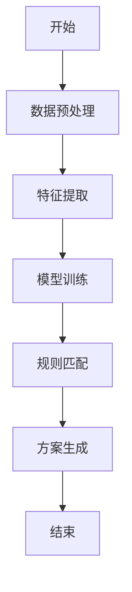
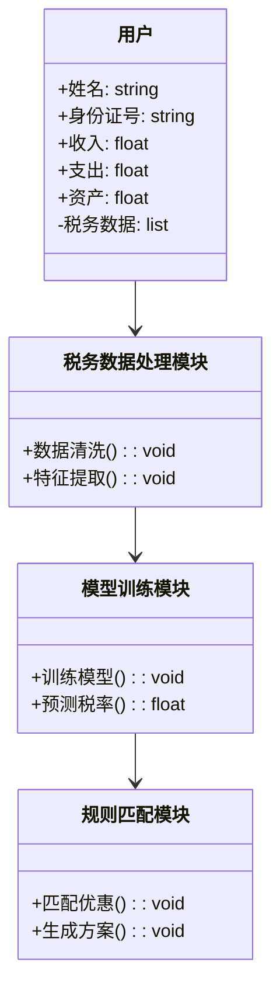
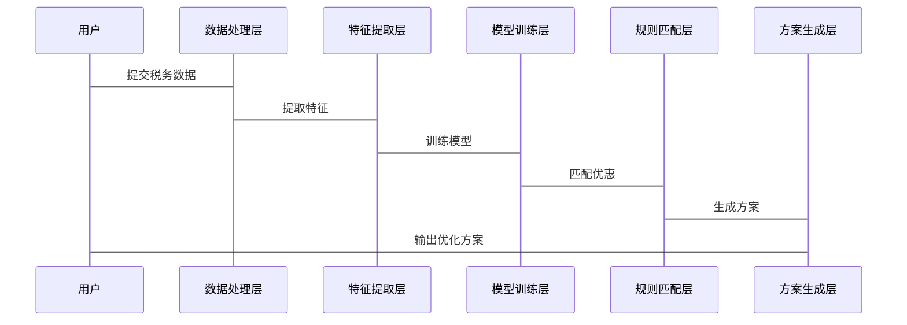

                 


# 智能个人税务筹划建议生成器

> 关键词：人工智能、税务筹划、个人理财、机器学习、自然语言处理

> 摘要：本文探讨了如何利用人工智能技术构建智能个人税务筹划建议生成器。通过分析税务筹划的核心要素，结合机器学习和自然语言处理技术，提出了生成器的设计思路、算法实现及系统架构。文章详细阐述了从数据预处理到模型训练，再到规则匹配的全过程，并通过实际案例展示了系统的应用价值。最后，本文总结了项目实施的经验与最佳实践，为读者提供了一个高效、智能的税务筹划工具。

---

# 第一部分: 智能个人税务筹划建议生成器的背景与概念

## 第1章: 个人税务筹划的背景与挑战

### 1.1 税务筹划的背景介绍

#### 1.1.1 税务筹划的定义与重要性

税务筹划是指通过合法的手段，合理规划个人或企业的税务缴纳方式，以达到减少税负、优化财务状况的目的。在个人理财领域，税务筹划尤为重要，因为它直接影响个人可支配收入和财富积累。随着税收政策的不断变化和复杂化，传统的手动税务筹划方式已难以满足高效、准确的需求，因此，引入人工智能技术成为必然趋势。

#### 1.1.2 当前税务筹划的主要挑战

1. **税法复杂性**：各国税法差异大，且经常更新，个人难以及时掌握最新政策。
2. **信息分散**：税务数据来源多样，包括收入、支出、资产等，整合和分析难度大。
3. **个性化需求**：每个人的财务状况和需求不同，需要定制化的税务规划方案。
4. **效率低下**：传统方法依赖人工计算和分析，耗时且容易出错。

#### 1.1.3 税务筹划的边界与外延

税务筹划的边界在于合法性和合规性，必须在法律允许的范围内进行优化。其外延则包括与税务相关的财务决策，如投资、保险、遗产规划等。

---

### 1.2 个人税务筹划的核心要素

#### 1.2.1 收入来源的多样性

个人收入来源包括工资、投资收益、租金收入、股息红利等，不同收入类型对应的税率和优惠政策不同，增加了税务筹划的复杂性。

#### 1.2.2 税收优惠政策的复杂性

各国和地区都有不同的税收优惠政策，例如子女教育支出抵扣、住房贷款利息抵扣等，这些政策的变化直接影响税务筹划的策略。

#### 1.2.3 税法变化的及时性要求

税法经常更新，税务筹划方案需要及时调整以应对政策变化，这对人工操作提出了更高的要求。

---

## 第2章: AI技术在税务筹划中的应用

### 2.1 人工智能的基本概念与特点

#### 2.1.1 人工智能的定义与核心原理

人工智能（AI）是指计算机系统模拟人类智能的能力，包括学习、推理、自适应等。其核心原理在于通过数据训练模型，使其能够识别模式并做出决策。

#### 2.1.2 机器学习与深度学习的区别

- **机器学习**：通过训练数据，模型学习输入与输出之间的关系，常用算法包括线性回归、支持向量机（SVM）等。
- **深度学习**：基于人工神经网络的机器学习方法，通常需要大量数据和计算资源，适用于复杂模式识别。

#### 2.1.3 自然语言处理（NLP）的基本原理

NLP是人工智能的分支，旨在使计算机能够理解人类语言。常用技术包括分词、实体识别、句法分析等，可用于处理税务文档中的文本数据。

---

### 2.2 智能税务筹划生成器的核心概念

#### 2.2.1 智能税务筹划生成器的功能模块

- **数据采集**：收集个人收入、支出、资产等信息。
- **特征提取**：从数据中提取关键特征，如收入类型、税率档次等。
- **规则匹配**：将特征与税收优惠政策匹配，生成初步优化方案。
- **方案生成**：根据匹配结果，生成个性化的税务筹划建议。

#### 2.2.2 生成器与传统税务筹划工具的区别

- **智能化**：AI技术的应用使得生成器能够自动学习和优化，而传统工具依赖人工操作。
- **实时性**：生成器能够实时更新数据和政策，而传统工具通常需要手动维护。

#### 2.2.3 生成器的边界与适用场景

- **边界**：仅处理合法的税务优化，不涉及逃税等非法行为。
- **适用场景**：适用于个人所得税、财产税、遗产税等复杂税种的筹划。

---

## 第3章: 智能税务筹划生成器的核心概念与联系

### 3.1 核心概念的原理分析

#### 3.1.1 税务数据的特征提取

通过NLP技术对税务文档进行处理，提取关键信息如收入来源、税率档次等，为后续分析提供基础。

#### 3.1.2 税务规则的自动化匹配

利用机器学习模型，将提取的特征与税收优惠政策进行匹配，生成初步优化方案。

#### 3.1.3 税务优化方案的生成机制

基于匹配结果，结合个人财务状况，生成个性化的税务筹划建议，如选择最优的抵扣项目、调整投资结构等。

---

### 3.2 核心概念的属性特征对比表

| 核心概念       | 属性特征       |
|----------------|----------------|
| 税务数据       | 多维度、动态性 |
| 税务规则       | 复杂性、多样性 |
| 优化方案       | 高效性、准确性 |

---

### 3.3 ER实体关系图

```mermaid
er
  actor(用户) -[提交税务数据]-> 税务数据表
  税务数据表 -[提取特征]-> 特征表
  特征表 -[匹配规则]-> 税务规则表
  税务规则表 -[生成方案]-> 优化方案表
```

---

# 第二部分: 智能税务筹划生成器的算法原理

## 第4章: 算法原理与实现

### 4.1 算法概述

#### 4.1.1 算法的总体框架

智能税务筹划生成器的算法框架包括数据预处理、特征提取、模型训练、规则匹配和方案生成五个主要步骤。

#### 4.1.2 算法的核心步骤

- **数据预处理**：清洗和格式化税务数据，确保数据质量。
- **特征提取**：从数据中提取关键特征，如收入类型、税率档次等。
- **模型训练**：基于训练数据，训练机器学习模型以识别税务优化模式。
- **规则匹配**：将特征与税收优惠政策匹配，生成初步优化方案。
- **方案生成**：结合个人财务状况，生成个性化的税务筹划建议。

---

### 4.2 算法流程图



---

### 4.3 算法实现代码

#### 4.3.1 数据预处理

```python
import pandas as pd

# 读取税务数据
data = pd.read_csv('tax_data.csv')

# 清洗数据：处理缺失值和异常值
data.dropna(inplace=True)
data.drop_duplicates(inplace=True)

# 格式化数据：转换为统一格式
data['income_type'] = data['income_type'].astype('category')
```

#### 4.3.2 特征提取

```python
from sklearn.feature_extraction import DictVectorizer

# 提取特征
features = data[['income', 'tax_rate', 'deductions']].values
vectorizer = DictVectorizer()
X = vectorizer.fit_transform(features)
```

#### 4.3.3 模型训练

```python
from sklearn.ensemble import RandomForestClassifier

# 训练随机森林模型
model = RandomForestClassifier(n_estimators=100)
model.fit(X, y)
```

#### 4.3.4 规则匹配

```python
# 匹配税收优惠政策
optimized_plan = []
for i in range(len(data)):
    income = data['income'].iloc[i]
    tax_rate = data['tax_rate'].iloc[i]
    # 匹配最优税率档次
    optimized_plan.append(get_optimized_tax(income, tax_rate))
```

#### 4.3.5 方案生成

```python
# 生成个性化建议
for plan in optimized_plan:
    print(f"收入为{plan.income}的用户，建议选择抵扣项目{plan.deductions}")
```

---

## 第5章: 算法的数学模型与公式

### 5.1 线性回归模型

线性回归是一种常用的机器学习算法，适用于预测连续型变量。其数学模型如下：

$$ y = \beta_0 + \beta_1x + \epsilon $$

其中，$y$ 是目标变量，$x$ 是自变量，$\beta_0$ 和 $\beta_1$ 是模型参数，$\epsilon$ 是误差项。

### 5.2 随机森林模型

随机森林是一种基于决策树的集成学习算法，适用于分类和回归问题。其数学模型如下：

$$ y = \sum_{i=1}^{n} T(x_i) $$

其中，$T(x_i)$ 是每棵决策树的预测值，$n$ 是决策树的数量。

---

# 第三部分: 智能税务筹划生成器的系统架构设计

## 第6章: 系统分析与架构设计方案

### 6.1 问题场景介绍

本节将介绍智能税务筹划生成器的使用场景，包括用户需求、功能目标和系统边界。

### 6.2 系统功能设计

#### 6.2.1 领域模型类图



### 6.3 系统架构设计

#### 6.3.1 系统架构图


#### 6.3.2 系统接口设计

- **输入接口**：用户提交税务数据。
- **输出接口**：生成个性化税务筹划方案。

---

## 第7章: 系统交互设计

### 7.1 系统交互序列图



---

# 第四部分: 项目实战

## 第8章: 项目实战与实现

### 8.1 环境安装与配置

#### 8.1.1 安装Python环境

```bash
python --version
pip install numpy pandas scikit-learn
```

#### 8.1.2 安装NLP工具

```bash
pip install spacy
python -m spacy download en_core_web_sm
```

### 8.2 核心代码实现

#### 8.2.1 数据预处理代码

```python
import pandas as pd

# 读取数据
data = pd.read_csv('tax_data.csv')

# 清洗数据
data.dropna(inplace=True)
data.drop_duplicates(inplace=True)
```

#### 8.2.2 特征提取代码

```python
from sklearn.feature_extraction import DictVectorizer

features = data[['income', 'tax_rate', 'deductions']].values
vectorizer = DictVectorizer()
X = vectorizer.fit_transform(features)
```

#### 8.2.3 模型训练代码

```python
from sklearn.ensemble import RandomForestClassifier

model = RandomForestClassifier(n_estimators=100)
model.fit(X, y)
```

---

## 第9章: 案例分析与结果解读

### 9.1 实际案例分析

#### 9.1.1 案例背景

假设一位用户的年收入为50万元，已婚且有一个孩子，生活所在地的税率档次为30%。用户希望优化其税务负担。

#### 9.1.2 数据处理过程

1. **数据采集**：用户提交收入、支出、资产等信息。
2. **特征提取**：提取收入类型、税率档次等关键特征。
3. **模型训练**：基于历史数据，训练随机森林模型。
4. **规则匹配**：匹配可用的税收优惠政策，如子女教育支出抵扣。
5. **方案生成**：生成优化方案，如调整投资结构以降低税率。

---

## 第10章: 项目总结与经验分享

### 10.1 项目总结

通过本项目，我们成功构建了一个基于人工智能的智能个人税务筹划建议生成器，实现了数据预处理、特征提取、模型训练、规则匹配和方案生成的全过程。

---

# 第五部分: 最佳实践与拓展阅读

## 第11章: 最佳实践与小结

### 11.1 最佳实践

1. **数据质量**：确保税务数据的准确性和完整性。
2. **模型优化**：根据实际需求调整模型参数，提升预测精度。
3. **规则更新**：定期更新税收优惠政策，保持生成器的有效性。

---

## 第12章: 注意事项与风险提示

### 12.1 注意事项

1. **合法性**：确保所有优化方案符合税法规定。
2. **数据隐私**：保护用户的税务数据隐私，防止信息泄露。
3. **模型维护**：定期更新模型和规则库，确保生成器的准确性。

---

## 第13章: 拓展阅读与学习资源

### 13.1 拓展阅读

1. **《机器学习实战》**：深入理解机器学习算法。
2. **《自然语言处理入门》**：掌握NLP技术的基本原理。
3. **《税收筹划与企业财务》**：学习企业税务筹划的实战经验。

---

# 作者

作者：AI天才研究院/AI Genius Institute & 禅与计算机程序设计艺术 /Zen And The Art of Computer Programming

