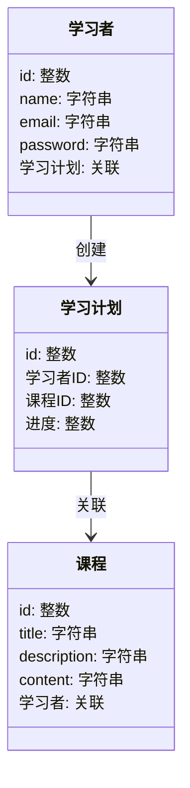
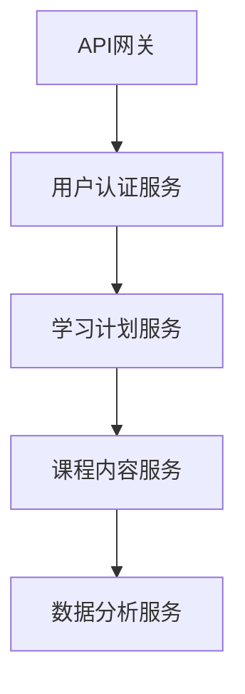
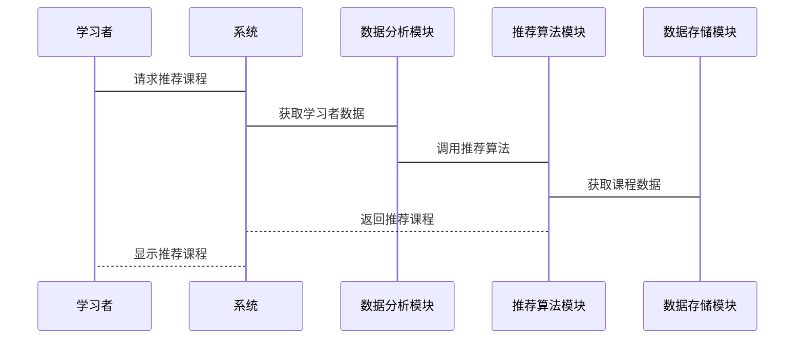

                 


# 构建AI驱动的企业学习管理系统(LMS)

---

## 关键词：AI驱动、企业学习管理系统、个性化学习、自然语言处理、机器学习

---

## 摘要：  
本文探讨了如何利用人工智能技术构建高效的企业学习管理系统(LMS)。首先，我们介绍了LMS的基本概念和AI驱动的优势。接着，深入分析了AI在LMS中的核心应用，包括个性化学习路径、自然语言处理和图像识别。随后，详细讲解了系统的架构设计、推荐算法原理以及数学模型。最后，通过实际案例展示了AI驱动LMS的实现过程，并总结了最佳实践和未来发展方向。

---

# 第一部分: AI驱动的企业学习管理系统(LMS)背景与概述

---

## 第1章: 企业学习管理系统(LMS)的背景与现状

### 1.1 企业学习管理系统(LMS)的定义与作用

#### 1.1.1 什么是企业学习管理系统(LMS)
企业学习管理系统（Learning Management System, LMS）是一种用于管理、评估和优化企业员工学习活动的软件系统。LMS能够帮助组织高效地管理培训课程、学习资源、学习进度和学习效果。

#### 1.1.2 LMS在企业中的作用与价值
LMS在企业中的作用主要体现在以下几个方面：
- **降低培训成本**：通过在线学习和自动化管理，减少面对面培训的人力和时间成本。
- **提升学习效果**：通过个性化学习路径和实时反馈，提高员工的学习效果。
- **增强员工能力**：通过定制化的培训计划，帮助员工快速掌握所需技能，提升整体团队能力。

#### 1.1.3 LMS的演变历程
传统的LMS主要以内容管理和课程发布为主，而随着人工智能技术的发展，现代LMS开始向智能化、个性化方向演进。AI驱动的LMS能够通过数据驱动的分析和预测，为学习者提供更加精准的学习建议和个性化的学习体验。

---

### 1.2 AI驱动的LMS的背景与趋势

#### 1.2.1 AI技术在教育领域的应用现状
近年来，AI技术在教育领域的应用日益广泛。从智能推荐到语音识别，AI正在改变传统的学习方式。例如，基于机器学习的推荐系统可以根据学习者的行为和偏好，推荐最适合的学习资源。

#### 1.2.2 AI驱动LMS的优势与挑战
- **优势**：
  - 提供个性化的学习体验。
  - 自动化管理学习过程，提高效率。
  - 数据驱动的决策支持，优化学习效果。
- **挑战**：
  - 数据隐私和安全问题。
  - AI算法的可解释性和透明性。
  - 系统的复杂性和集成难度。

#### 1.2.3 未来LMS的发展方向
未来的LMS将更加智能化和个性化，AI技术将在学习分析、内容生成和人机交互方面发挥更大的作用。同时，随着5G和物联网技术的发展，LMS将更加注重实时性和互动性，为学习者提供更加沉浸式的学习体验。

---

## 1.3 本章小结
本章主要介绍了LMS的基本概念、作用和演变历程，并探讨了AI驱动LMS的背景、优势和挑战。通过这些内容，我们为后续章节的深入分析奠定了基础。

---

# 第二部分: AI驱动LMS的核心概念与技术

---

## 第2章: AI在LMS中的核心应用

### 2.1 AI驱动的个性化学习路径

#### 2.1.1 个性化学习需求分析
个性化学习需求分析是构建AI驱动LMS的第一步。通过分析学习者的学习目标、知识水平和学习风格，我们可以为每个学习者定制专属的学习路径。

#### 2.1.2 基于AI的学习路径推荐算法
推荐算法是实现个性化学习路径的核心。常见的推荐算法包括协同过滤、基于内容的推荐和深度学习推荐。

#### 2.1.3 个性化学习效果评估
通过实时监测学习者的学习行为和效果，我们可以不断优化推荐算法，提升个性化学习的效果。

---

### 2.2 自然语言处理在LMS中的应用

#### 2.2.1 文本生成与内容推荐
自然语言处理技术可以帮助LMS自动生成学习内容，并根据学习者的需求推荐相关资源。

#### 2.2.2 语音识别与智能助手
通过语音识别技术，LMS可以支持语音指令，为学习者提供更加便捷的交互方式。

#### 2.2.3 情感分析与学习反馈
情感分析技术可以用来评估学习者的学习情绪，从而提供更加贴心的学习反馈和建议。

---

### 2.3 图像识别与学习体验优化

#### 2.3.1 图像识别技术在LMS中的应用
图像识别技术可以帮助LMS自动识别学习资源中的图像内容，并为学习者提供相关的学习建议。

#### 2.3.2 基于视觉的学习内容设计
通过图像识别技术，我们可以设计出更加视觉化的学习内容，提高学习者的注意力和学习效果。

#### 2.3.3 图像识别在学习评估中的作用
图像识别技术可以用于评估学习者的学习成果，例如通过识别手写答案来评估学习者的理解程度。

---

### 2.4 本章小结
本章详细介绍了AI在LMS中的核心应用，包括个性化学习路径、自然语言处理和图像识别。通过这些技术的应用，我们可以为学习者提供更加智能化和个性化的学习体验。

---

# 第三部分: AI驱动LMS的系统架构与算法原理

---

## 第3章: AI驱动LMS的系统架构设计

### 3.1 系统功能模块划分

#### 3.1.1 学习者模块
学习者模块主要负责学习者的注册、登录、学习计划和学习记录管理。

#### 3.1.2 内容管理模块
内容管理模块负责管理学习资源，包括课程内容、视频、文档等。

#### 3.1.3 AI推荐模块
AI推荐模块是系统的核心模块，负责根据学习者的行为和数据推荐个性化学习内容。

#### 3.1.4 数据分析模块
数据分析模块负责收集和分析学习者的行为数据，为推荐算法提供支持。

---

### 3.2 系统架构设计

#### 3.2.1 分层架构设计
系统的分层架构包括表现层、业务逻辑层和数据访问层。每一层都有明确的功能划分，便于系统的扩展和维护。

#### 3.2.2 微服务架构设计
微服务架构将系统功能划分为多个独立的服务，通过API进行通信。这种方式可以提高系统的可扩展性和灵活性。

#### 3.2.3 数据流与交互流程
数据流与交互流程包括学习者请求、系统响应、数据处理和反馈等环节。通过合理设计数据流，可以提高系统的响应速度和用户体验。

---

### 3.3 系统接口设计

#### 3.3.1 API接口定义
系统需要定义清晰的API接口，包括注册、登录、课程推荐等接口。

#### 3.3.2 接口调用流程
接口调用流程包括请求处理、数据验证、业务逻辑处理和响应返回等步骤。

#### 3.3.3 接口安全设计
接口安全设计包括身份验证、权限控制和数据加密等措施，确保系统的安全性和稳定性。

---

## 第4章: AI驱动LMS的核心算法原理

### 4.1 个性化推荐算法

#### 4.1.1 基于协同过滤的推荐算法
协同过滤是一种常见的推荐算法，通过分析用户的行为和偏好，推荐相似用户的物品。

#### 4.1.2 基于内容的推荐算法
基于内容的推荐算法通过分析物品的特征，推荐与用户兴趣相符的物品。

#### 4.1.3 深度学习推荐算法
深度学习推荐算法通过神经网络模型，学习用户和物品的特征，推荐个性化的内容。

---

### 4.2 自然语言处理算法

#### 4.2.1 词嵌入与文本表示
词嵌入是一种将词表示为向量的技术，常用于自然语言处理任务中。

#### 4.2.2 文本分类与情感分析
文本分类和情感分析是自然语言处理中的重要任务，可以帮助LMS更好地理解学习者的需求。

#### 4.2.3 机器翻译与内容生成
机器翻译和内容生成技术可以帮助LMS自动生成多语言的学习内容。

---

### 4.3 图像识别与学习体验优化

#### 4.3.1 图像分类与目标检测
图像分类和目标检测是图像识别中的基本任务，可以帮助LMS识别和分析图像内容。

#### 4.3.2 图像生成与视觉设计
图像生成技术可以帮助LMS设计出更加吸引人的学习界面和内容。

---

## 4.4 本章小结
本章详细介绍了AI驱动LMS的核心算法原理，包括个性化推荐算法、自然语言处理算法和图像识别算法。通过这些算法的应用，我们可以为学习者提供更加智能化和个性化的学习体验。

---

# 第四部分: 系统分析与架构设计方案

---

## 第5章: 系统分析与架构设计方案

### 5.1 项目介绍

#### 5.1.1 项目背景
本项目旨在开发一个AI驱动的企业学习管理系统，通过智能化的学习路径推荐和个性化的学习体验，提升企业员工的学习效果。

#### 5.1.2 项目目标
项目的最终目标是构建一个高效、智能、个性化的LMS，满足企业对员工培训和学习管理的需求。

---

### 5.2 系统功能设计

#### 5.2.1 领域模型设计
领域模型设计是系统功能设计的核心，通过绘制领域模型图（Mermaid类图），我们可以清晰地了解系统的功能模块和交互关系。



#### 5.2.2 系统架构设计
系统架构设计包括前端架构和后端架构。前端架构采用响应式设计，后端架构采用微服务架构，通过API网关进行通信。



---

## 5.3 系统接口设计

### 5.3.1 系统接口设计
系统接口设计包括用户接口和API接口。用户接口采用响应式设计，支持多设备访问。API接口采用RESTful风格，支持JSON格式的数据传输。

---

## 5.4 系统交互流程设计

### 5.4.1 系统交互流程
系统交互流程包括学习者登录、课程推荐、学习进度更新和学习反馈等环节。



---

## 5.5 本章小结
本章详细介绍了系统的分析与架构设计方案，包括领域模型设计、系统架构设计和系统交互流程设计。这些设计为后续的系统实现奠定了基础。

---

# 第五部分: 项目实战

---

## 第6章: 项目实战

### 6.1 环境安装与配置

#### 6.1.1 安装Python
安装Python 3.8及以上版本，并配置Python环境。

#### 6.1.2 安装依赖库
安装所需的依赖库，包括Flask、TensorFlow、Pandas等。

#### 6.1.3 安装开发工具
安装IDE（如PyCharm）和版本控制工具（如Git）。

---

### 6.2 系统核心功能实现

#### 6.2.1 用户认证模块
实现用户注册、登录功能，使用Flask框架和JWT（JSON Web Token）进行身份验证。

#### 6.2.2 个性化推荐模块
实现基于机器学习的推荐算法，使用TensorFlow或Scikit-learn进行模型训练和预测。

#### 6.2.3 学习进度跟踪模块
实现学习进度的实时跟踪和更新，使用数据库（如MySQL）进行数据存储和管理。

---

### 6.3 项目代码实现

#### 6.3.1 推荐算法实现
以下是一个基于协同过滤的推荐算法的Python代码示例：

```python
import numpy as np

def collaborative_filtering(user_ratings, user_id):
    # 计算用户相似度
    user_similarity = np.corrcoef(user_ratings.T)
    # 获取目标用户的相似度
    target_user_similarity = user_similarity[user_id]
    # 筛选相似度较高的用户
    similar_users = np.argsort(target_user_similarity)[::-1][:5]
    # 计算推荐分数
    recommendation_scores = np.zeros(user_ratings.shape[1])
    for similar_user in similar_users:
        recommendation_scores += user_ratings[similar_user]
    # 返回推荐结果
    return recommendation_scores
```

#### 6.3.2 系统接口实现
实现API接口，使用Flask框架：

```python
from flask import Flask
from flask_restful import Resource, Api

app = Flask(__name__)
api = Api(app)

class CourseRecommendation(Resource):
    def get(self, user_id):
        # 获取推荐结果
        recommendations = collaborative_filtering(user_ratings, user_id)
        return {'recommendations': recommendations.tolist()}, 200

api.add_resource(CourseRecommendation, '/recommend/<int:user_id>')

if __name__ == '__main__':
    app.run(debug=True)
```

---

## 6.4 项目小结
本章通过实际案例展示了AI驱动LMS的实现过程，包括环境配置、核心功能实现和代码实现。通过这些内容，读者可以更好地理解AI驱动LMS的技术实现。

---

# 第六部分: 总结与扩展

---

## 第7章: 总结与扩展

### 7.1 总结

#### 7.1.1 本章总结
本文详细探讨了AI驱动的企业学习管理系统(LMS)的构建过程，从系统背景、核心概念到系统架构和项目实战，全面介绍了AI在LMS中的应用。

#### 7.1.2 本章小结
通过本文的介绍，读者可以了解AI驱动LMS的优势和技术实现，为后续的研究和实践奠定基础。

---

### 7.2 注意事项与未来展望

#### 7.2.1 注意事项
- 数据隐私和安全问题需要特别注意。
- 系统的可扩展性和性能优化需要在设计阶段充分考虑。
- 推荐算法的可解释性和透明性是未来研究的重要方向。

#### 7.2.2 未来展望
未来的LMS将更加智能化和个性化，AI技术将在学习分析、内容生成和人机交互方面发挥更大的作用。同时，随着5G和物联网技术的发展，LMS将更加注重实时性和互动性，为学习者提供更加沉浸式的学习体验。

---

## 7.3 拓展阅读
- 《机器学习实战》
- 《深度学习》
- 《自然语言处理入门》
- 《图像识别与计算机视觉》

---

## 作者：AI天才研究院/AI Genius Institute & 禅与计算机程序设计艺术/Zen And The Art of Computer Programming

---

通过本文的详细介绍，我们展示了如何构建一个AI驱动的企业学习管理系统(LMS)。从背景到技术实现，从系统设计到项目实战，本文为读者提供了一个全面的视角，帮助他们更好地理解和应用AI技术于LMS的构建中。

