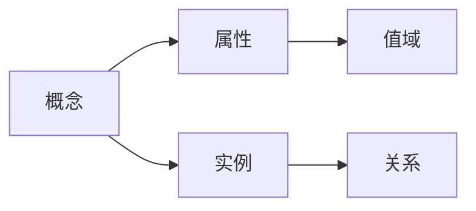
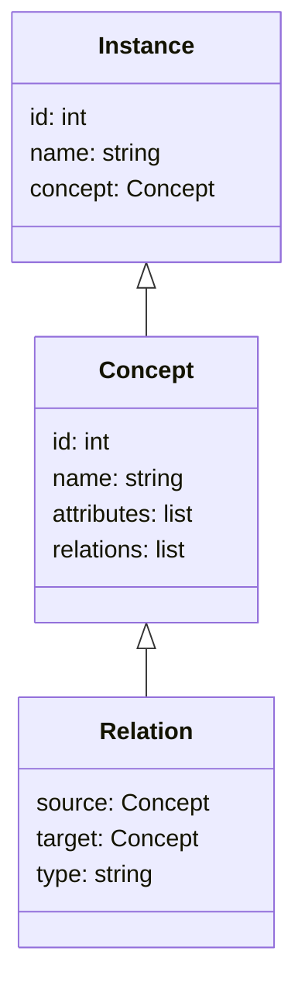
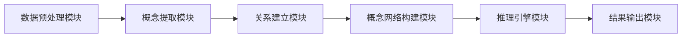
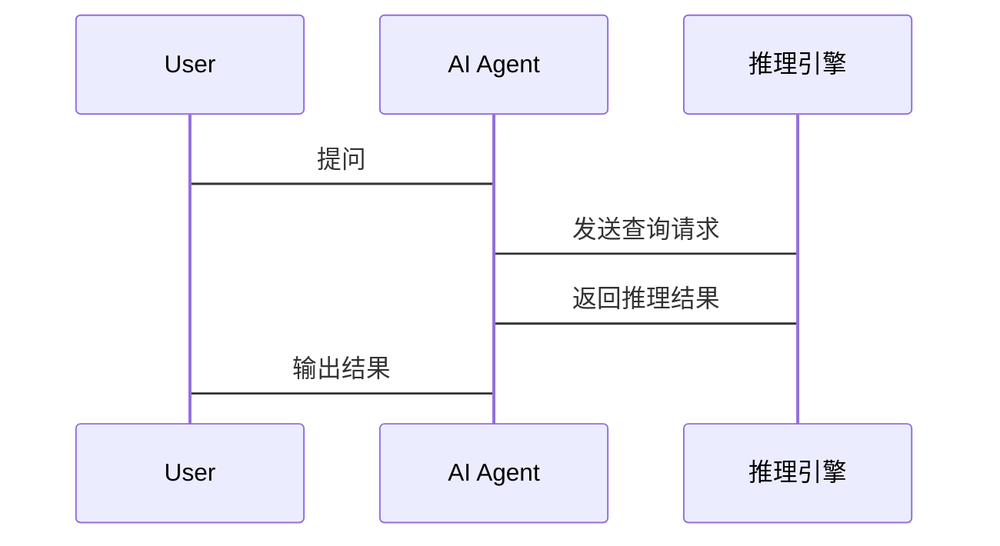

                 


# 构建具有概念学习能力的AI Agent

## 关键词：AI Agent，概念学习，知识图谱，推理引擎，机器学习，深度学习

## 摘要：本文详细探讨了如何构建一个具有概念学习能力的AI Agent。通过分析概念学习的核心原理、算法实现、系统架构设计以及实际项目实战，展示了如何使AI Agent能够理解并应用抽象概念。文章内容涵盖背景介绍、核心概念与联系、算法原理、系统分析与架构设计、项目实战等多个方面，旨在为读者提供一个全面且深入的技术指南。

---

# 第一部分: 概念学习与AI Agent概述

## 第1章: 概念学习与AI Agent的背景介绍

### 1.1 概念学习的背景与问题背景

#### 1.1.1 传统AI的局限性
传统的AI系统主要依赖于规则和模式识别，缺乏对抽象概念的理解和应用能力。例如，基于规则的专家系统虽然在特定领域表现优异，但难以应对复杂多变的现实场景。

#### 1.1.2 概念学习的核心问题
概念学习的核心问题是让AI系统能够从数据中提取抽象概念，并理解这些概念之间的关系。这需要结合统计学习和符号推理两种方法。

#### 1.1.3 概念学习的边界与外延
概念学习不仅关注具体实例，更注重概念的层次性、语义关联性和动态变化性。其外延涉及知识图谱构建、语义理解、智能推理等多个领域。

### 1.2 问题描述与概念学习的目标

#### 1.2.1 概念学习的基本问题
如何从数据中提取抽象概念，并建立概念之间的关联关系？如何实现概念的动态更新与扩展？

#### 1.2.2 概念学习的目标与挑战
目标是让AI Agent具备理解、推理和应用抽象概念的能力。挑战包括概念提取的准确性、概念关联的合理性以及动态适应性的实现难度。

#### 1.2.3 概念学习与传统机器学习的对比
概念学习强调对概念结构的理解，而传统机器学习注重模式识别和分类。概念学习更接近人类的认知方式，具有更强的泛化能力。

### 1.3 概念学习的核心要素与概念结构

#### 1.3.1 概念的定义与属性
概念由核心属性和边缘属性组成，例如“动物”这个概念，核心属性包括“生物”、“有脊椎”，边缘属性包括“哺乳动物”、“有毛发”。

#### 1.3.2 概念之间的关系
概念之间的关系包括“属于”、“包含”、“并列”等。例如，“哺乳动物”属于“动物”，“猫”和“狗”是“哺乳动物”的并列关系。

#### 1.3.3 概念网络的构建与应用
概念网络是一个图结构，节点代表概念，边代表概念之间的关系。概念网络可以用于推理、分类和知识表示。

## 1.4 本章小结
本章介绍了概念学习的背景、核心问题、目标以及与传统机器学习的区别，为后续章节奠定了基础。

---

# 第二部分: 概念学习的核心概念与联系

## 第2章: 概念学习的核心原理

### 2.1 概念学习的原理与机制

#### 2.1.1 概念提取的基本原理
概念提取是通过分析数据中的特征和属性，提取出具有代表性的概念。例如，从一组商品描述中提取“电子产品”、“家用电器”等概念。

#### 2.1.2 概念关联与推理机制
通过分析概念之间的关系，建立概念网络，并利用图结构进行推理。例如，如果“猫”属于“哺乳动物”，而“哺乳动物”属于“动物”，那么可以推理出“猫”属于“动物”。

#### 2.1.3 概念网络的动态更新
概念网络需要根据新数据动态更新，例如新增概念或调整概念之间的关系。动态更新需要结合在线学习算法。

### 2.2 概念学习的核心属性特征对比

| 概念属性 | 定义 | 示例 |
|----------|------|------|
| 核心属性  | 概念的关键特征 | 动物的“生物”、“有脊椎” |
| 边缘属性  | 概念的扩展特征 | 哺乳动物的“哺乳”、“胎生” |
| 层次属性  | 概念的层次关系 | “猫”属于“哺乳动物”，“哺乳动物”属于“动物” |

### 2.3 概念实体关系图的ER架构



### 2.4 本章小结
本章详细讲解了概念学习的核心原理、属性特征以及实体关系图，为后续的算法实现奠定了基础。

---

## 第3章: 概念学习的算法实现

### 3.1 概念提取算法的原理

#### 3.1.1 基于统计的特征提取
通过统计词语出现频率，提取高频词汇作为概念。例如，在商品评论中，“性价比”、“质量”等词汇可能被提取为概念。

#### 3.1.2 基于深度学习的特征提取
使用词嵌入（如Word2Vec）或句嵌入（如BERT）模型，提取词语或句子的语义表示，作为概念的向量表示。

#### 3.1.3 概念网络构建算法
基于相似性度量（如余弦相似度）或聚类算法，将相似的概念聚类，并建立概念网络。

### 3.2 概念关联与推理算法

#### 3.2.1 基于图的推理算法
利用图遍历算法（如BFS、DFS）进行概念推理。例如，从“猫”出发，通过“属于”关系推理到“哺乳动物”，再推理到“动物”。

#### 3.2.2 基于符号逻辑的推理算法
通过符号逻辑规则进行推理。例如，定义规则“如果X属于Y，且Y属于Z，则X属于Z”，并应用于具体实例。

#### 3.2.3 基于概率的推理算法
利用贝叶斯网络进行概率推理。例如，计算某个概念属于另一个概念的概率。

### 3.3 概念学习算法的数学模型

#### 3.3.1 概念网络的数学表示
$$ C = \{c_1, c_2, ..., c_n\} $$
其中，$C$表示概念集合，$c_i$表示具体概念。

#### 3.3.2 概念关联的数学公式
$$ R = \{r_1, r_2, ..., r_m\} $$
其中，$R$表示概念关系集合，$r_j$表示具体关系。

#### 3.3.3 概念推理的数学模型
$$ P(h|e) = \frac{P(e|h)}{P(e)} $$
其中，$h$表示假设，$e$表示证据，$P(h|e)$表示在证据$e$下假设$h$的概率。

### 3.4 概念学习算法的实现代码

```python
def concept_learning_algorithm(data):
    # 数据预处理
    processed_data = preprocess(data)
    # 概念提取
    concepts = extract_concepts(processed_data)
    # 概念关联
    relations = establish_relations(concepts)
    # 概念网络构建
    concept_network = build_concept_network(concepts, relations)
    return concept_network

# 示例代码：概念提取
def extract_concepts(data):
    # 假设data是一个文本列表
    from sklearn.feature_extraction.text import TfidfVectorizer
    vectorizer = TfidfVectorizer()
    tfidf = vectorizer.fit_transform(data)
    concepts = vectorizer.get_feature_names_out()
    return concepts
```

### 3.5 本章小结
本章详细讲解了概念学习的算法实现，包括概念提取、关联建立以及推理算法，并通过代码示例进行了说明。

---

## 第4章: 系统分析与架构设计

### 4.1 问题场景介绍

#### 4.1.1 应用场景
概念学习可以应用于智能客服、智能推荐、知识图谱构建等领域。例如，在智能客服中，AI Agent需要理解客户的问题，并根据概念网络进行分类和处理。

#### 4.1.2 项目介绍
本项目旨在构建一个具有概念学习能力的AI Agent，能够理解并应用抽象概念。

### 4.2 系统功能设计

#### 4.2.1 领域模型设计


#### 4.2.2 系统架构设计


#### 4.2.3 系统接口设计
- 数据预处理模块：接收原始数据，返回预处理后的数据。
- 概念提取模块：接收预处理数据，返回提取的概念。
- 关系建立模块：接收概念，返回概念之间的关系。
- 推理引擎模块：接收查询请求，返回推理结果。

#### 4.2.4 系统交互设计


### 4.3 本章小结
本章详细分析了系统的功能设计和架构设计，并通过图示展示了系统的模块划分和交互流程。

---

## 第5章: 项目实战

### 5.1 环境安装

#### 5.1.1 Python环境
安装Python 3.8及以上版本，并安装以下库：
- scikit-learn
- networkx
- pydot
- mermaid
- transformers

#### 5.1.2 其他工具
安装Jupyter Notebook用于代码编写和测试。

### 5.2 系统核心实现源代码

#### 5.2.1 数据预处理
```python
def preprocess(data):
    # 假设data是一个文本列表
    import re
    from sklearn.feature_extraction.text import CountVectorizer
    vectorizer = CountVectorizer(preprocessor=lambda x: re.sub(r'\W+', ' ', x).lower())
    X = vectorizer.fit_transform(data)
    return X
```

#### 5.2.2 概念提取
```python
def extract_concepts(data):
    # 假设data是一个文本列表
    from sklearn.feature_extraction.text import TfidfVectorizer
    vectorizer = TfidfVectorizer()
    tfidf = vectorizer.fit_transform(data)
    concepts = vectorizer.get_feature_names_out()
    return concepts
```

#### 5.2.3 关系建立
```python
def establish_relations(concepts):
    # 假设concepts是一个概念列表
    from networkx import Graph
    graph = Graph()
    graph.add_nodes_from(concepts)
    # 假设有一些边连接这些概念
    edges = [('猫', '哺乳动物'), ('哺乳动物', '动物')]
    graph.add_edges_from(edges)
    return graph
```

#### 5.2.4 概念网络构建
```python
def build_concept_network(concepts, relations):
    from networkx import Graph
    graph = Graph()
    graph.add_nodes_from(concepts)
    graph.add_edges_from(relations)
    return graph
```

#### 5.2.5 推理引擎
```python
def inference_engine(graph, source):
    # 假设graph是一个概念网络，source是起始概念
    from networkx import bfs_edges
    visited = set()
    result = []
    stack = [source]
    while stack:
        node = stack.pop()
        if node not in visited:
            visited.add(node)
            result.append(node)
            for neighbor in graph.neighbors(node):
                if neighbor not in visited:
                    stack.append(neighbor)
    return result
```

### 5.3 实际案例分析与详细讲解

#### 5.3.1 案例分析
假设我们有一个关于动物的概念网络：
- 概念：猫、狗、哺乳动物、动物。
- 关系：猫属于哺乳动物，哺乳动物属于动物，狗属于哺乳动物。

#### 5.3.2 代码实现
```python
concepts = ['猫', '狗', '哺乳动物', '动物']
relations = [('猫', '哺乳动物'), ('哺乳动物', '动物'), ('狗', '哺乳动物')]
graph = build_concept_network(concepts, relations)
result = inference_engine(graph, '猫')
print(result)  # 输出：['猫', '哺乳动物', '动物']
```

#### 5.3.3 结果分析
推理引擎从“猫”出发，通过“属于”关系推理到“哺乳动物”，再推理到“动物”，最终返回结果['猫', '哺乳动物', '动物']。

### 5.4 本章小结
本章通过实际案例详细讲解了概念学习的实现过程，并通过代码示例展示了如何构建概念网络和进行推理。

---

## 第6章: 总结与展望

### 6.1 本章总结
本文详细讲解了如何构建具有概念学习能力的AI Agent，包括概念学习的核心原理、算法实现、系统架构设计以及项目实战。

### 6.2 未来展望
未来的研究方向包括：
- 更高效的概念提取算法。
- 更智能的概念关联算法。
- 更强大的推理引擎。
- 概念学习在更多领域的应用。

---

## 第7章: 最佳实践 Tips

### 7.1 代码实现注意事项
- 数据预处理是关键，确保数据质量。
- 概念提取时，结合统计和深度学习方法。
- 推理引擎的设计要考虑系统的可扩展性和灵活性。

### 7.2 系统优化建议
- 使用分布式计算优化概念网络的构建。
- 结合在线学习算法实现动态更新。
- 引入领域知识库提升概念提取的准确性。

### 7.3 注意事项
- 概念网络的构建需要结合具体应用场景。
- 推理引擎的设计要考虑到系统的实时性和响应速度。
- 概念学习需要结合监督学习和无监督学习方法。

---

## 作者：AI天才研究院/AI Genius Institute & 禅与计算机程序设计艺术 /Zen And The Art of Computer Programming

---

通过本文的详细讲解，读者可以系统地了解如何构建具有概念学习能力的AI Agent，并将其应用于实际场景中。希望本文对读者在概念学习和AI Agent领域的研究和实践有所帮助。

