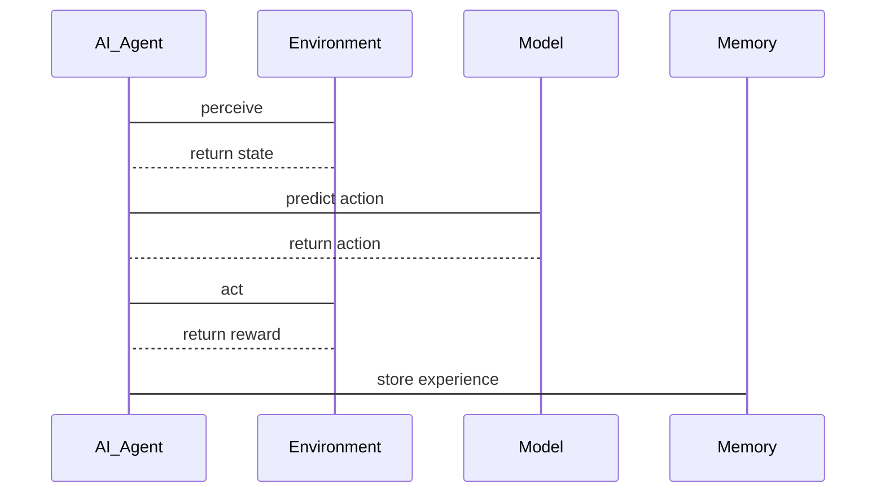

                 


# AI Agent的持续学习与概念漂移适应策略

## 关键词：AI Agent，持续学习，概念漂移，经验重放，动态权重网络

## 摘要：AI Agent在面对动态变化的环境中，需要具备持续学习和适应概念漂移的能力。本文从AI Agent的基本概念出发，详细探讨了持续学习的原理与方法，分析了概念漂移的检测与适应策略，并通过具体的算法实现和系统架构设计，展示了如何构建能够在动态环境中有效运作的AI Agent。文章结合实际案例，提供了从理论到实践的全面指导。

---

## 第一部分: AI Agent的持续学习与概念漂移概述

### 第1章: AI Agent的基本概念与问题背景

#### 1.1 AI Agent的定义与特点
- **AI Agent的定义**：AI Agent是指能够感知环境、自主决策并采取行动的智能实体，旨在通过交互优化目标函数。
- **AI Agent的核心特点**：
  - 自主性：无需外部干预，自主决策。
  - 反应性：实时感知环境变化并做出响应。
  - 学习性：通过经验或数据不断优化自身模型。
  - 社会性：能够与其他Agent或人类进行协作或竞争。

#### 1.2 持续学习的背景与问题描述
- **持续学习的定义**：一种机器学习范式，允许模型在数据流上实时更新，适应新数据的变化。
- **持续学习的核心问题**：
  - 如何保持模型的稳定性和一致性，同时快速适应新数据。
  - 如何处理概念漂移，确保模型在变化的环境中仍能保持高性能。
- **持续学习的应用场景**：在线推荐系统、实时监控系统、自适应教育系统。

#### 1.3 概念漂移的定义与挑战
- **概念漂移的定义**：数据分布的变化导致模型性能下降的现象。
- **概念漂移的类型**：
  - **突然漂移**：数据分布突然变化。
  - **渐进漂移**：数据分布逐渐变化。
  - **局部漂移**：特定区域的数据分布变化。
- **概念漂移对AI Agent的影响**：
  - 模型预测准确性下降。
  - 系统响应时间增加。
  - 用户体验变差。

#### 1.4 本章小结
本章介绍了AI Agent的基本概念、持续学习的背景及其核心问题，同时详细探讨了概念漂移的定义、类型及其对AI Agent的影响。

---

## 第二部分: 持续学习与概念漂移的核心概念

### 第2章: 持续学习的原理与方法

#### 2.1 持续学习的基本原理
- **经验重放机制**：通过存储过去的经验，AI Agent可以在未来的学习中重复使用这些经验，从而避免遗忘。
- **知识蒸馏技术**：通过将复杂模型的知识迁移到简单模型，提升简单模型的性能。
- **动态权重网络**：通过动态调整模型参数，适应数据分布的变化。

#### 2.2 概念漂移检测与适应策略
- **概念漂移检测方法**：
  - 统计检验方法：如卡方检验、t检验。
  - 分布对比方法：如Kullback-Leibler散度。
  - 基于模型的方法：如异常检测模型。
- **增量学习策略**：定期重新训练模型，或仅更新部分参数。
- **动态模型调整技术**：根据概念漂移检测结果，动态调整模型结构或参数。

#### 2.3 持续学习与概念漂移的关系
- **持续学习如何应对概念漂移**：通过经验重放和动态权重调整，持续学习能够有效应对概念漂移。
- **概念漂移对模型性能的影响**：概念漂移可能导致模型性能下降，但持续学习能够通过适应新数据来缓解这一问题。
- **持续学习的适应性优势**：通过实时更新模型，持续学习能够在概念漂移发生后快速恢复性能。

#### 2.4 本章小结
本章详细讲解了持续学习的基本原理和概念漂移检测与适应策略，并分析了两者之间的关系及持续学习的适应性优势。

---

## 第三部分: 持续学习与概念漂移的算法原理

### 第3章: 基于经验重放的持续学习算法

#### 3.1 经验重放机制的原理
- **经验重放的基本概念**：通过存储过去的经验，AI Agent可以在未来的学习中重复使用这些经验。
- **经验重放的实现方法**：使用一个经验回放池，存储过去的状态、动作和奖励。
- **经验重放的优势与不足**：
  - 优势：防止模型遗忘，增强泛化能力。
  - 不足：存储空间需求大，回放效率低。

#### 3.2 经验重放的数学模型
- **经验重放的公式表示**：
  $$ P(s_t, a_t, r_t) = \text{经验回放池中的概率} $$
  $$ Q(s, a) = Q(s, a) + \alpha(r + \gamma \max Q(s', a')) - Q(s, a) $$
- **经验重放的流程图**：
  ```mermaid
  graph TD
    A[开始] --> B[获取当前状态]
    B --> C[选择动作]
    C --> D[执行动作]
    D --> E[获取奖励]
    E --> F[存储经验]
    F --> G[从经验池中随机抽取经验]
    G --> H[更新Q值]
    H --> A
  ```

#### 3.3 经验重放的Python实现示例
- **环境安装**：
  ```bash
  pip install gym numpy
  ```
- **核心代码实现**：
  ```python
  import gym
  import numpy as np

  class AI_Agent:
      def __init__(self, env):
          self.env = env
          self.memory = []  # 经验回放池
          self.gamma = 0.99  # 折扣因子
          self.epsilon = 1.0  # 探索率
          self.epsilon_min = 0.01
          self.batch_size = 64

      def remember(self, state, action, reward, next_state):
          self.memory.append((state, action, reward, next_state))

      def replay(self):
          if len(self.memory) >= self.batch_size:
              minibatch = np.random.choice(self.memory, self.batch_size)
              # 计算损失函数并更新模型
              pass

      def epsilon_greedy(self, state):
          if np.random.random() < self.epsilon:
              return self.env.action_space.sample()[0]
          else:
              return np.argmax(self.model.predict(state))

      def train(self, episodes=1000):
          for episode in range(episodes):
              state = self.env.reset()
              while True:
                  action = self.epsilon_greedy(state)
                  next_state, reward, done, _ = self.env.step(action)
                  self.remember(state, action, reward, next_state)
                  self.replay()
                  state = next_state
                  if done:
                      break
          self.epsilon = max(self.epsilon_min, self.epsilon * 0.99)
  ```

#### 3.4 本章小结
本章详细讲解了基于经验重放的持续学习算法，包括其原理、数学模型和Python实现示例。

---

### 第4章: 动态权重网络的持续学习算法

#### 4.1 动态权重网络的基本原理
- **动态权重网络的定义**：通过动态调整模型参数，适应数据分布的变化。
- **动态权重网络的实现方法**：使用自适应优化算法，如Adam，动态调整权重。

#### 4.2 动态权重网络的数学模型
- **动态权重网络的公式表示**：
  $$ w_{t+1} = w_t - \eta \nabla L(w_t) $$
  其中，$\eta$ 是学习率，$\nabla L(w_t)$ 是损失函数的梯度。
- **动态权重网络的流程图**：
  ```mermaid
  graph TD
    A[开始] --> B[计算损失]
    B --> C[计算梯度]
    C --> D[更新权重]
    D --> E[检查是否满足终止条件]
    E --> F[继续训练/结束]
  ```

#### 4.3 动态权重网络的Python实现示例
- **环境安装**：
  ```bash
  pip install tensorflow keras
  ```
- **核心代码实现**：
  ```python
  import tensorflow as tf
  from tensorflow.keras import layers

  model = tf.keras.Sequential([
      layers.Dense(64, activation='relu'),
      layers.Dense(10, activation='softmax')
  ])

  optimizer = tf.keras.optimizers.Adam(learning_rate=0.001)
  loss_fn = tf.keras.losses.SparseCategoricalCrossentropy()

  def train_step(model, optimizer, x_train, y_train):
      with tf.GradientTape() as tape:
          y_pred = model(x_train)
          loss = loss_fn(y_train, y_pred)
      gradients = tape.gradient(loss, model.trainable_weights)
      optimizer.apply_gradients(zip(gradients, model.trainable_weights))

  for epoch in range(100):
      for x, y in dataset:
          train_step(model, optimizer, x, y)
  ```

#### 4.4 本章小结
本章详细讲解了动态权重网络的持续学习算法，包括其原理、数学模型和Python实现示例。

---

## 第四部分: 系统分析与架构设计

### 第5章: 系统分析与架构设计方案

#### 5.1 问题场景介绍
- **问题背景**：AI Agent需要在动态变化的环境中持续学习，适应概念漂移。
- **项目介绍**：设计一个能够在动态环境中有效运作的AI Agent系统。

#### 5.2 系统功能设计
- **领域模型的Mermaid类图**：
  ```mermaid
  classDiagram
      class AI_Agent {
          - environment
          - model
          - memory
          + update_model()
          + perceive()
          + act()
      }
      class Environment {
          - state
          + get_state()
          + execute_action(action)
      }
      AI_Agent --> Environment: interacts with
  ```

#### 5.3 系统架构设计
- **系统架构的Mermaid架构图**：
  ```mermaid
  graph LR
      A(AI_Agent) --> B(Environment)
      A --> C(Model)
      A --> D(Memory)
      C --> E(Perceptron)
      D --> F(Replay_Memory)
  ```

#### 5.4 系统接口设计
- **系统接口**：
  - `update_model()`: 更新AI Agent的模型。
  - `perceive()`: 感知环境状态。
  - `act()`: 执行动作。

#### 5.5 系统交互的Mermaid序列图


#### 5.6 本章小结
本章通过系统分析与架构设计，展示了如何构建一个能够在动态环境中有效运作的AI Agent系统。

---

## 第五部分: 项目实战

### 第6章: 项目实战

#### 6.1 环境安装
- **安装Python环境**：建议使用Anaconda或virtualenv。
- **安装依赖库**：`pip install gym numpy tensorflow keras`

#### 6.2 系统核心实现源代码
- **经验重放的实现**：
  ```python
  class ExperienceReplay:
      def __init__(self, capacity):
          self.capacity = capacity
          self.memory = []

      def remember(self, state, action, reward, next_state):
          self.memory.append((state, action, reward, next_state))

      def replay(self, batch_size):
          if len(self.memory) >= batch_size:
              minibatch = np.random.choice(self.memory, batch_size)
              return minibatch
  ```

- **动态权重网络的实现**：
  ```python
  import tensorflow as tf
  from tensorflow.keras import layers

  class DynamicWeightNetwork:
      def __init__(self, input_dim, output_dim):
          self.model = tf.keras.Sequential([
              layers.Dense(64, activation='relu', input_dim=input_dim),
              layers.Dense(output_dim, activation='softmax')
          ])
          self.optimizer = tf.keras.optimizers.Adam(learning_rate=0.001)
          self.loss_fn = tf.keras.losses.SparseCategoricalCrossentropy()

      def train(self, x, y):
          with tf.GradientTape() as tape:
              y_pred = self.model(x)
              loss = self.loss_fn(y, y_pred)
          gradients = tape.gradient(loss, self.model.trainable_weights)
          self.optimizer.apply_gradients(zip(gradients, self.model.trainable_weights))
  ```

#### 6.3 代码应用解读与分析
- **经验重放的代码解读**：
  - `remember`方法用于存储经验。
  - `replay`方法用于从经验池中随机抽取经验进行训练。
- **动态权重网络的代码解读**：
  - `train`方法用于训练模型，动态调整权重。

#### 6.4 实际案例分析
- **案例背景**：设计一个AI Agent在动态环境中进行预测。
- **案例分析**：
  - 初始化AI Agent和环境。
  - 使用经验重放机制存储经验。
  - 使用动态权重网络进行训练和预测。

#### 6.5 本章小结
本章通过实际案例展示了如何实现AI Agent的持续学习与概念漂移适应策略。

---

## 第六部分: 总结与展望

### 第7章: 总结与展望

#### 7.1 最佳实践
- **经验重放的使用建议**：合理设置经验池容量和回放频率。
- **动态权重网络的优化建议**：选择合适的优化算法和学习率。

#### 7.2 小结
本文详细讲解了AI Agent的持续学习与概念漂移适应策略，包括基本概念、算法原理、系统设计和项目实战。

#### 7.3 注意事项
- **概念漂移检测的准确性**：选择合适的检测方法，确保及时发现概念漂移。
- **模型更新的频率**：根据实际需求，合理设置模型更新频率，避免过度更新。

#### 7.4 拓展阅读
- **持续学习的最新研究**：阅读相关论文，了解最新的算法和技术。
- **概念漂移的检测与适应方法**：学习更多的检测方法和适应策略。

---

## 作者：AI天才研究院/AI Genius Institute & 禅与计算机程序设计艺术 /Zen And The Art of Computer Programming

---

### 结语
本文通过系统性的分析和实践，展示了如何构建能够在动态环境中有效运作的AI Agent。希望读者能够通过本文，深入了解持续学习与概念漂移适应策略的核心思想，并能够在实际项目中加以应用。

