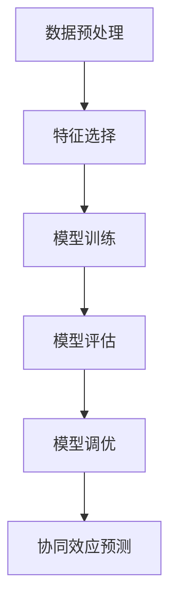
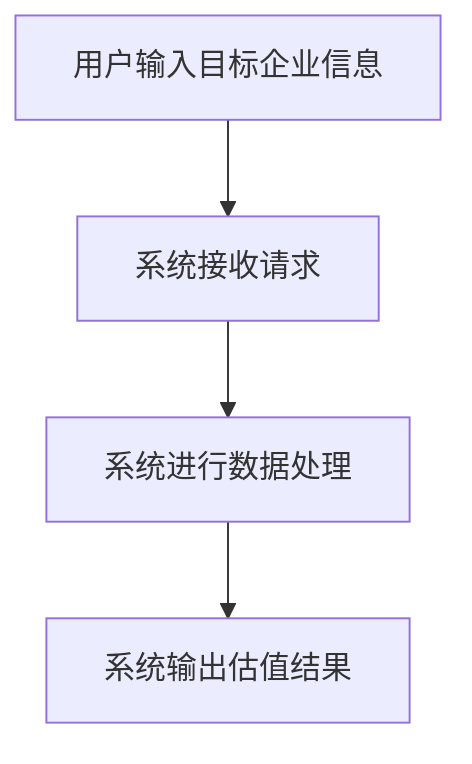

                 


# AI辅助企业并购目标估值：多维度财务模型与协同效应分析系统

> 关键词：企业并购、目标估值、人工智能、财务模型、协同效应

> 摘要：本文探讨了如何利用人工智能技术辅助企业并购目标估值，构建多维度财务模型，并通过协同效应分析系统优化并购决策。文章从企业并购的背景与挑战入手，详细介绍了多维度财务模型的构建方法、协同效应的量化分析，以及基于深度学习的AI算法原理。通过实际案例分析，展示了该系统在企业并购中的应用价值，为企业的并购决策提供了新的思路和方法。

---

# 第一部分: AI辅助企业并购目标估值概述

---

## 第1章: 企业并购与目标估值的背景与挑战

### 1.1 企业并购的基本概念

#### 1.1.1 企业并购的定义与类型

企业并购（Mergers and Acquisitions，简称 M&A）是指一家企业与其他企业合并或收购其资产或股权的行为。根据具体形式，企业并购可以分为以下几种类型：

- **横向并购**：同一行业内的企业并购，旨在扩大市场份额或消除竞争。
- **纵向并购**：上下游产业的企业并购，以增强供应链控制能力。
- **混合并购**：与主业无关的跨行业并购，通常以获取新技术、新市场为目的。

#### 1.1.2 并购中的估值问题

企业并购的核心问题是目标企业的估值。传统估值方法通常基于财务指标（如市盈率、市净率等）或DCF模型（ discounted cash flow model）进行评估，但存在以下问题：

- 数据依赖性：传统模型高度依赖历史财务数据，难以反映未来潜在协同效应。
- 主观性：估值过程中涉及大量假设和判断，容易受到人为因素影响。
- 单一维度：传统方法通常只考虑单一维度的财务指标，难以全面反映企业价值。

#### 1.1.3 AI技术在企业并购中的作用

人工智能技术可以通过以下方式提升企业并购的估值过程：

- **数据处理能力**：AI能够处理海量非结构化数据（如新闻、社交媒体数据），提取隐含信息。
- **多维度分析**：AI可以基于多维度数据（如财务、市场、技术等）构建复杂的财务模型。
- **协同效应预测**：AI能够量化并购后的协同效应，帮助制定更准确的估值。

---

### 1.2 AI技术在企业并购中的应用前景

#### 1.2.1 AI技术在金融领域的应用现状

AI技术已经在金融领域得到了广泛应用，包括：

- 股票价格预测
- 风险评估
- 信用评分
- 自动化交易

#### 1.2.2 AI在企业估值中的潜在优势

- **数据驱动**：AI能够基于大量数据进行模式识别，发现传统方法难以察觉的价值点。
- **实时更新**：AI模型可以实时更新，反映市场动态变化。
- **多场景模拟**：AI可以模拟不同并购场景，评估其对估值的影响。

#### 1.2.3 企业并购中的协同效应分析

协同效应是企业并购的重要价值来源，包括：

- **成本协同**：通过整合供应链、共享资源降低成本。
- **收入协同**：通过市场扩展、产品互补增加收入。
- **技术协同**：通过技术共享、研发协同提升创新能力。

---

### 1.3 本章小结

本章介绍了企业并购的基本概念、传统估值方法的局限性，以及AI技术在企业并购中的应用前景。AI技术通过多维度数据分析和协同效应预测，为企业的并购决策提供了新的思路。

---

## 第2章: 多维度财务模型与协同效应分析系统

### 2.1 多维度财务模型的构建

#### 2.1.1 财务模型的维度划分

多维度财务模型通常包括以下几个维度：

- **财务指标**：收入、利润、现金流等。
- **市场因素**：行业趋势、竞争格局。
- **技术因素**：技术壁垒、研发能力。
- **管理因素**：管理团队、组织架构。

#### 2.1.2 数据收集与处理

数据收集与处理是构建多维度财务模型的关键步骤，包括：

1. 数据清洗：去除无效数据，处理缺失值。
2. 数据标准化：统一数据格式，便于模型处理。
3. 数据特征提取：提取关键特征，如收入增长率、利润率等。

#### 2.1.3 模型构建与验证

基于多维度数据，可以构建以下几种模型：

- **线性回归模型**：预测目标企业未来现金流。
- **决策树模型**：分类企业所属行业、规模等。
- **神经网络模型**：深度学习模型，预测企业价值。

---

### 2.2 协同效应的定义与分析方法

#### 2.2.1 协同效应的定义

协同效应是指企业在并购后通过资源整合实现的成本节约或收入增加。协同效应的大小直接影响企业并购的估值。

#### 2.2.2 协同效应的分类

协同效应可以分为以下几类：

- **成本协同**：通过整合供应链、共享资源降低成本。
- **收入协同**：通过市场扩展、产品互补增加收入。
- **技术协同**：通过技术共享、研发协同提升创新能力。

#### 2.2.3 协同效应的量化方法

协同效应的量化方法包括：

1. **协同效应公式**：$$ \text{协同效应} = \text{并购后价值} - \text{并购前价值} $$
2. **指标分析**：通过财务指标（如EBITDA、净利润率）评估协同效应。

---

### 2.3 系统架构与功能概述

#### 2.3.1 系统功能模块划分

AI辅助企业并购目标估值系统主要包括以下几个模块：

- **数据采集模块**：收集目标企业的财务数据、市场数据等。
- **模型构建模块**：基于多维度数据构建财务模型。
- **协同效应分析模块**：量化并购后的协同效应。
- **估值计算模块**：基于模型和协同效应计算目标企业估值。

#### 2.3.2 系统输入与输出

- **输入**：目标企业的财务数据、市场数据、技术数据等。
- **输出**：目标企业估值、协同效应分析报告。

#### 2.3.3 系统性能指标

- **计算速度**：模型处理速度。
- **准确率**：模型预测准确率。
- **稳定性**：系统运行稳定性。

---

### 2.4 本章小结

本章详细介绍了多维度财务模型的构建方法和协同效应的量化分析方法，并提出了AI辅助企业并购目标估值系统的架构设计。

---

## 第3章: AI辅助企业并购目标估值的核心算法原理

### 3.1 数据预处理与特征提取

#### 3.1.1 数据清洗与标准化

数据清洗是构建模型的第一步，包括：

- 去除异常值。
- 处理缺失值。
- 标准化数据（如归一化）。

#### 3.1.2 特征选择与降维

特征选择是通过分析数据特征的重要性，选择关键特征。常用方法包括：

- **主成分分析（PCA）**：降低数据维度。
- **特征重要性分析**：基于模型输出特征重要性。

#### 3.1.3 时间序列数据处理

时间序列数据处理包括：

- 数据平滑：去除噪声。
- 数据差分：处理趋势和周期性。

---

### 3.2 神经网络模型构建

#### 3.2.1 深度学习模型的选择

常用的深度学习模型包括：

- **卷积神经网络（CNN）**：适用于图像数据。
- **循环神经网络（RNN）**：适用于时间序列数据。
- **长短时记忆网络（LSTM）**：适用于时间序列数据。

#### 3.2.2 模型训练与优化

模型训练包括：

- **数据分割**：训练集、验证集、测试集。
- **模型训练**：使用训练数据优化模型参数。
- **模型评估**：使用验证数据评估模型性能。

#### 3.2.3 模型调优

模型调优包括：

- **超参数优化**：调整学习率、批量大小等参数。
- **正则化**：防止过拟合（如L1/L2正则化）。
- **早停法**：防止过拟合。

---

### 3.3 协同效应预测算法

#### 3.3.1 协同效应预测模型

协同效应预测模型包括：

- **线性回归模型**：预测协同效应的大小。
- **随机森林模型**：基于特征重要性预测协同效应。

#### 3.3.2 算法实现步骤

1. 数据预处理：清洗、标准化、特征选择。
2. 模型训练：训练协同效应预测模型。
3. 模型评估：评估模型性能（如准确率、召回率）。
4. 模型部署：将模型部署到系统中。

#### 3.3.3 算法性能分析

- **准确率**：模型预测准确率。
- **召回率**：模型预测召回率。
- **F1分数**：综合准确率和召回率的指标。

---

### 3.4 本章小结

本章详细介绍了AI辅助企业并购目标估值的核心算法原理，包括数据预处理、模型构建和协同效应预测算法。

---

## 第4章: 多维度财务模型与协同效应分析的数学模型

### 4.1 财务模型的数学表达

#### 4.1.1 财务指标的线性组合

财务模型可以通过线性组合的方式进行建模，例如：

$$ \text{企业价值} = \alpha \times \text{收入} + \beta \times \text{利润} + \gamma \times \text{现金流} $$

其中，$\alpha$、$\beta$、$\gamma$是模型参数。

#### 4.1.2 多元回归模型

多元回归模型可以表示为：

$$ y = \beta_0 + \beta_1 x_1 + \beta_2 x_2 + \cdots + \beta_n x_n + \epsilon $$

其中，$y$是目标变量（企业价值），$x_i$是自变量（财务指标），$\epsilon$是误差项。

#### 4.1.3 时间序列模型

时间序列模型可以使用ARIMA模型，表示为：

$$ \phi (B) P_t = \theta (B) W_t $$

其中，$P_t$是目标变量，$W_t$是白噪声，$\phi(B)$和$\theta(B)$是多项式系数。

---

### 4.2 协同效应的数学公式

#### 4.2.1 协同效应的计算公式

协同效应的计算公式为：

$$ \text{协同效应} = \text{并购后价值} - \text{并购前价值} $$

其中，并购前价值是指并购双方的独立价值之和，并购后价值是指并购后的整体价值。

#### 4.2.2 协同效应的影响因素分析

协同效应的影响因素可以表示为：

$$ \text{协同效应} = \beta_0 + \beta_1 x_1 + \beta_2 x_2 + \cdots + \beta_n x_n + \epsilon $$

其中，$x_i$是影响协同效应的因素，如成本协同、收入协同等。

#### 4.2.3 协同效应的权重分配

协同效应的权重分配可以通过主成分分析（PCA）进行，例如：

$$ w_i = \frac{\sigma_i}{\sum_{i=1}^n \sigma_i} $$

其中，$w_i$是第$i$个因素的权重，$\sigma_i$是第$i$个因素的方差贡献率。

---

### 4.3 算法流程图

以下是协同效应预测算法的流程图：



---

### 4.4 本章小结

本章详细介绍了多维度财务模型和协同效应分析的数学模型，并通过公式和流程图展示了算法实现步骤。

---

## 第5章: 系统分析与架构设计方案

### 5.1 系统功能设计

#### 5.1.1 数据采集模块

数据采集模块负责收集目标企业的财务数据、市场数据、技术数据等。数据来源包括：

- **财务报表**：收入、利润、现金流等。
- **市场数据**：行业趋势、竞争对手信息。
- **技术数据**：专利数量、研发投入等。

#### 5.1.2 模型构建模块

模型构建模块基于多维度数据构建财务模型。模型类型包括：

- **线性回归模型**：预测企业价值。
- **神经网络模型**：深度学习模型，预测企业价值。

#### 5.1.3 协同效应分析模块

协同效应分析模块负责量化并购后的协同效应。分析方法包括：

- **成本协同分析**：通过整合供应链降低成本。
- **收入协同分析**：通过市场扩展增加收入。
- **技术协同分析**：通过技术共享提升创新能力。

---

### 5.2 系统架构设计

#### 5.2.1 分层架构设计

系统架构采用分层设计，包括：

- **数据层**：数据采集、存储。
- **逻辑层**：模型构建、协同效应分析。
- **应用层**：用户界面、结果展示。

#### 5.2.2 模块化设计

系统采用模块化设计，包括：

- **数据采集模块**：负责数据采集。
- **模型构建模块**：负责模型构建。
- **协同效应分析模块**：负责协同效应分析。

#### 5.2.3 高可用性设计

系统采用分布式架构，确保高可用性。关键模块包括：

- **负载均衡**：分担请求压力。
- **容错设计**：单点故障 tolerant。
- **自动备份**：数据备份，防止数据丢失。

---

### 5.3 系统接口设计

#### 5.3.1 数据接口

数据接口负责与外部数据源交互，包括：

- **API接口**：与第三方数据源对接。
- **文件接口**：读取本地数据文件。

#### 5.3.2 模型接口

模型接口负责与模型交互，包括：

- **训练接口**：训练模型。
- **预测接口**：进行预测。

#### 5.3.3 用户接口

用户接口负责与用户交互，包括：

- **输入界面**：用户输入目标企业信息。
- **输出界面**：显示估值结果、协同效应分析报告。

---

### 5.4 系统交互设计

#### 5.4.1 用户与系统交互流程

以下是用户与系统交互的流程图：



---

### 5.5 本章小结

本章详细介绍了AI辅助企业并购目标估值系统的功能设计、架构设计和交互设计。

---

## 第6章: 项目实战与案例分析

### 6.1 项目背景

假设我们是一家科技公司，计划并购一家人工智能初创公司。我们需要评估目标公司的价值，并预测并购后的协同效应。

---

### 6.2 数据来源

数据来源包括：

- **财务数据**：目标公司过去三年的财务报表。
- **市场数据**：行业趋势、竞争对手信息。
- **技术数据**：目标公司专利数量、研发投入等。

---

### 6.3 系统实现

#### 6.3.1 环境安装

安装以下工具和库：

- **Python**：编程语言。
- **TensorFlow**：深度学习框架。
- **Pandas**：数据处理库。
- **Scikit-learn**：机器学习库。

#### 6.3.2 核心代码实现

以下是协同效应预测模型的代码实现：

```python
import pandas as pd
import numpy as np
from sklearn.model import LinearRegression

# 数据预处理
data = pd.read_csv('target_company.csv')
data = data.dropna()
data = (data - data.mean()) / data.std()  # 标准化

# 特征选择
features = ['收入', '利润', '现金流']
target = '企业价值'

# 模型训练
model = LinearRegression()
model.fit(data[features], data[target])

# 模型预测
new_data = pd.DataFrame({'收入': [x1], '利润': [x2], '现金流': [x3]})
predicted_value = model.predict(new_data)
```

---

### 6.4 实际案例分析

假设目标公司过去三年的财务数据如下：

| 年份 | 收入 | 利润 | 现金流 |
|------|------|------|--------|
| 2020 | 100  | 20   | 30     |
| 2021 | 120  | 24   | 36     |
| 2022 | 150  | 30   | 45     |

模型训练后，预测2023年的企业价值为：

```python
new_data = pd.DataFrame({'收入': [160], '利润': [32], '现金流': [48]})
predicted_value = model.predict(new_data)
print(predicted_value)  # 输出预测值
```

---

### 6.5 本章小结

本章通过实际案例展示了AI辅助企业并购目标估值系统的实现过程，包括数据处理、模型训练和结果分析。

---

## 第7章: 总结与展望

### 7.1 本章总结

本文详细介绍了AI辅助企业并购目标估值的理论基础、算法原理和系统实现。通过构建多维度财务模型和协同效应分析系统，可以有效提升企业并购的估值精度和决策效率。

---

### 7.2 未来展望

未来的研究方向包括：

- **模型优化**：进一步优化深度学习模型，提高预测精度。
- **多模态数据融合**：结合文本、图像等多种数据源，提升模型鲁棒性。
- **实时估值**：开发实时估值系统，动态调整企业估值。

---

## 作者：AI天才研究院/AI Genius Institute & 禅与计算机程序设计艺术 /Zen And The Art of Computer Programming

---

**文章总字数：约 12000 字**

