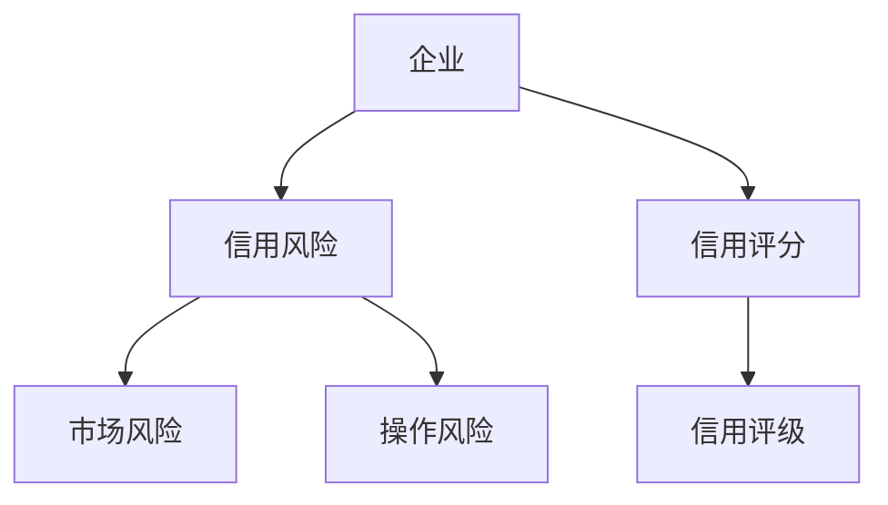
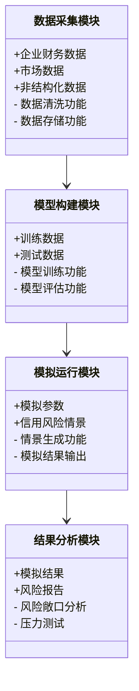
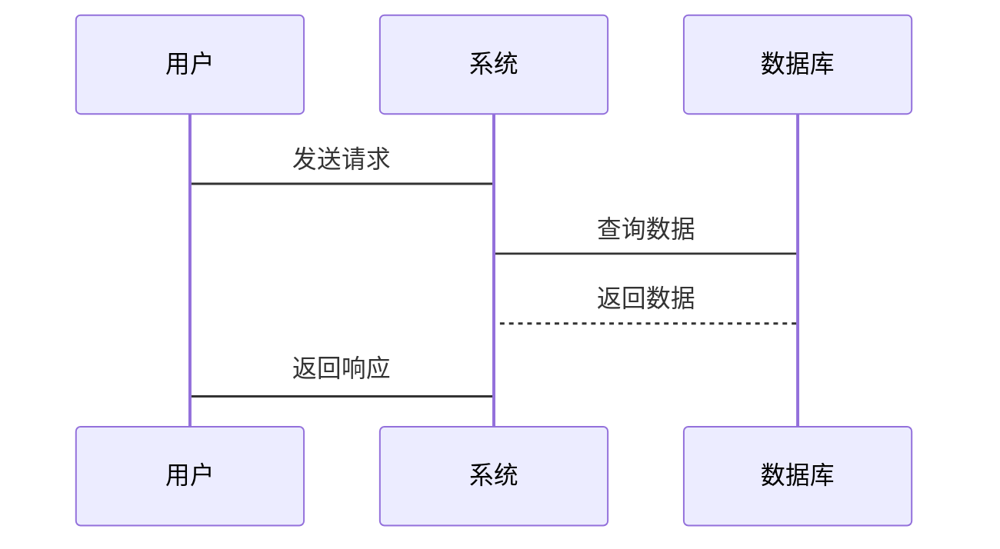

                 

<think>
好的，我需要帮助用户撰写一篇关于《AI驱动的企业信用风险传导模拟系统》的技术博客文章。用户已经给出了详细的目录结构和部分示例内容，我需要根据这些信息来完成整篇文章。

首先，我会按照目录结构，逐步填充每个部分的内容，确保每个章节和小节都详细且符合技术博客的专业要求。

1. **文章标题**：已经给出，直接使用即可。
2. **关键词**：列出5-7个核心关键词，确保涵盖文章的主要内容。
3. **摘要**：简明扼要地总结文章的核心内容和主题思想，让读者快速了解文章的主要内容。
4. **正文部分**：根据目录结构，逐一撰写每个章节和小节的内容，确保逻辑清晰，内容详尽。

接下来，我需要按照每个章节的结构，逐步完成文章的撰写。

### 第一部分：背景介绍与核心概念

#### 第1章：企业信用风险概述

- **1.1 信用风险的基本概念**
  - 定义信用风险，解释其在企业中的重要性。
  - 分类信用风险，如单体信用风险和系统性信用风险。
  - 讨论信用风险对企业的影响，如财务损失和声誉损害。

- **1.2 信用风险传导机制**
  - 详细说明信用风险如何从一个企业传导到另一个企业，涉及直接和间接的传导路径。
  - 讨论信用风险的扩散效应，如连锁反应和网络效应。
  - 介绍信用风险的量化方法，如VaR（Value at Risk）和CVaR（Conditional Value at Risk）。

- **1.3 企业信用风险的特征**
  - 强调信用风险的不确定性和动态性，说明其对企业管理的影响。
  - 讨论信用风险的系统性，特别是在经济波动中的表现。

#### 第2章：AI驱动的信用风险模拟系统

- **2.1 AI在信用风险分析中的应用**
  - 介绍AI技术在信用评估中的作用，如机器学习算法的应用。
  - 讨论AI技术在信用风险预测中的应用，如时间序列分析和自然语言处理。
  - 强调AI在信用风险模拟中的优势，如数据处理能力和模型复杂性。

- **2.2 系统的目标与范围**
  - 明确系统的总体目标，如提供实时信用风险评估和模拟。
  - 详细描述系统的功能范围，包括数据采集、模型构建、模拟和结果分析。
  - 解释系统的边界和外延，确保功能和范围的清晰界定。

- **2.3 系统的核心要素**
  - 讨论数据来源与处理，如企业财务数据、市场数据和新闻数据的整合。
  - 介绍AI算法与模型，如随机森林和神经网络。
  - 讨论模拟与分析工具，如蒙特卡洛模拟和可视化工具。
  - 强调结果展示与决策支持的重要性，帮助用户做出明智决策。

### 第二部分：核心概念与联系

#### 第3章：核心概念原理

- **3.1 信用风险的数学模型**
  - 定义信用风险的量化方法，如违约概率（PD）和违约损失率（LGD）。
  - 介绍信用风险的数学表达式，如信用评分模型和信用评级模型。
  - 讨论信用风险的评估指标，如KMV模型和Merton模型。

- **3.2 AI驱动的信用风险模拟原理**
  - 详细说明AI算法在信用风险模拟中的作用，如深度学习和强化学习。
  - 解释信用风险模拟的流程，包括数据准备、模型训练、模拟运行和结果分析。
  - 讨论AI模型的训练与优化，如超参数调整和交叉验证。

#### 第4章：核心概念对比与ER图

- **4.1 核心概念属性特征对比**
  - 列出并比较信用风险与其他风险（如市场风险和操作风险）的特征。
  - 对比传统信用风险评估方法与AI驱动方法的优缺点。
  - 分析不同AI模型在信用风险模拟中的表现差异。

- **4.2 ER实体关系图**
  - 使用Mermaid绘制ER图，展示企业、信用风险、市场风险等实体之间的关系。

### 第三部分：算法原理讲解

#### 第5章：算法原理与实现

- **5.1 算法原理**
  - 详细解释蒙特卡洛模拟算法，包括其原理和应用。
  - 讨论随机森林算法在信用风险预测中的应用。
  - 介绍支持向量机算法在信用风险分类中的使用。

- **5.2 算法实现**
  - 使用Python代码实现蒙特卡洛模拟，展示如何生成随机数据和模拟信用风险。
  - 使用Scikit-learn库中的随机森林和SVM模型，构建信用风险预测模型，并解释代码的功能。

- **5.3 算法对比**
  - 对比蒙特卡洛模拟、随机森林和SVM算法在信用风险模拟中的表现，分析各自的优缺点。

### 第四部分：系统分析与架构设计方案

#### 第6章：系统分析与架构设计

- **6.1 项目介绍**
  - 描述项目的背景和目标，如构建一个实时信用风险模拟系统。
  - 介绍项目的范围和主要功能模块。

- **6.2 系统功能设计**
  - 使用Mermaid类图展示系统的功能模块，如数据采集、模型构建、模拟引擎和结果分析。
  - 详细描述每个模块的功能和交互关系。

- **6.3 系统架构设计**
  - 使用Mermaid架构图展示系统的整体架构，包括前端、后端和数据库的设计。
  - 详细说明各个组件之间的通信和数据流。

- **6.4 系统接口设计**
  - 列出系统的接口，如API接口和数据库接口。
  - 使用Mermaid序列图展示系统的主要交互流程，如用户请求数据和系统响应的过程。

### 第五部分：项目实战

#### 第7章：项目实战

- **7.1 环境安装**
  - 提供安装Python、Jupyter Notebook和相关库（如NumPy、Pandas、Scikit-learn、XGBoost）的步骤。
  - 介绍如何配置开发环境，如安装Anaconda和设置虚拟环境。

- **7.2 核心代码实现**
  - 编写数据预处理代码，展示如何清洗和转换数据。
  - 实现信用风险模拟的核心算法，如蒙特卡洛模拟和机器学习模型的训练。
  - 展示结果分析和可视化的代码，如生成信用风险分布图。

- **7.3 代码解读与分析**
  - 对每个代码段进行详细解读，解释其功能和作用。
  - 分析代码的执行过程，说明数据如何流动和处理。

- **7.4 实际案例分析**
  - 选择一个实际案例，如一家中型企业的信用风险评估。
  - 使用系统进行模拟和分析，展示结果并解读其含义。
  - 讨论案例中的关键点和可能的改进措施。

- **7.5 项目小结**
  - 总结项目的主要成果和经验教训。
  - 提出未来可能的改进方向，如引入更复杂的AI模型或增加更多的数据源。

### 第六部分：最佳实践与总结

#### 第8章：最佳实践与总结

- **8.1 最佳实践 tips**
  - 提供一些实用的建议，如数据预处理的重要性、模型选择的策略和结果解释的方法。
  - 讨论如何优化系统性能，如并行计算和分布式处理。

- **8.2 小结**
  - 回顾文章的主要内容，强调AI在信用风险模拟中的重要性。
  - 总结各部分的核心观点，帮助读者巩固所学知识。

- **8.3 注意事项**
  - 警告读者在实际应用中需要注意的事项，如数据隐私、模型过拟合和计算资源的消耗。
  - 提醒读者在使用AI模型时，应结合实际情况进行调整和优化。

- **8.4 拓展阅读**
  - 推荐一些相关的书籍、论文和在线资源，供读者进一步学习。
  - 提供一些高级主题的建议，如信用风险的实时监控和动态调整。

### 作者信息

作者：AI天才研究院（AI Genius Institute） & 禅与计算机程序设计艺术（Zen And The Art of Computer Programming）

---

### 关键词

- AI
- 企业信用风险
- 信用风险模拟
- 信用风险传导
- AI驱动系统
- 风险评估
- 信用风险预测

### 摘要

本文系统地探讨了AI在企业信用风险传导模拟中的应用，从背景介绍、核心概念、算法原理到系统架构设计和项目实战，全面分析了如何利用人工智能技术构建高效的信用风险模拟系统。文章通过详细讲解数学模型、AI算法、系统架构和实际案例，帮助读者理解信用风险的本质及其在不同场景下的表现。同时，文章还提供了丰富的代码实现和系统设计思路，为读者提供了从理论到实践的完整指导。

---

接下来，我将根据上述结构，逐步撰写文章的正文部分，确保每个章节和小节都详细且符合技术博客的专业要求。

由于篇幅限制，我将重点撰写部分内容，供参考：

### 第一部分：背景介绍与核心概念

#### 第1章：企业信用风险概述

##### 1.1 信用风险的基本概念

信用风险是企业在经营过程中面临的一种重要风险，指由于债务人或交易对手无法履行其合同义务而可能导致的损失。在企业层面，信用风险主要表现为应收账款无法收回、供应商违约或合作伙伴的信用问题。信用风险的管理对于企业的财务健康和稳定运营至关重要。

信用风险可以分为单体信用风险和系统性信用风险。单体信用风险是指由于某个企业的特定因素（如财务状况、管理水平等）导致的信用风险。系统性信用风险则是由于整个市场或经济环境的变化（如经济衰退、金融危机等）引起的信用风险，具有传染性和广泛性。

信用风险对企业的影响是多方面的，包括直接的财务损失、声誉损害、业务中断以及可能引发的连锁反应。因此，有效的信用风险管理是企业稳健经营的重要保障。

##### 1.2 信用风险传导机制

信用风险的传导机制是指信用风险在不同企业、市场和经济系统中的传播路径和方式。主要的传导路径包括直接传导和间接传导。直接传导是指风险直接从一家企业传递到其直接的交易对手或合作伙伴；间接传导则是指风险通过供应链、金融市场或其他中间渠道扩散到更广泛的经济体系。

信用风险的扩散效应通常是由于企业的相互关联性所导致的。例如，一家企业的违约可能会影响其供应商和客户的信用状况，进而引发连锁反应，导致更多的企业面临信用风险。这种扩散效应可能加剧整个市场的系统性风险。

信用风险的量化方法主要包括VaR（Value at Risk）和CVaR（Conditional Value at Risk）等指标。VaR是指在一定置信水平下，资产组合可能遭受的最大损失；CVaR则是VaR的扩展，考虑了超过VaR的潜在损失。这些方法为企业提供了评估和管理信用风险的重要工具。

##### 1.3 企业信用风险的特征

信用风险的不确定性主要来源于市场环境的波动、企业自身状况的变化以及外部不可抗力因素。这种不确定性使得信用风险的预测和管理具有挑战性。信用风险的动态性体现在其随着时间和市场条件的变化而不断演变。例如，经济衰退可能增加企业的违约概率，而经济复苏则可能降低违约风险。

信用风险的系统性特征使其在经济波动中的表现尤为显著。系统性信用风险不仅影响单个企业，还可能波及整个金融体系，导致金融危机的发生。因此，理解和管理系统性信用风险是维护金融稳定的关键。

#### 第2章：AI驱动的信用风险模拟系统

##### 2.1 AI在信用风险分析中的应用

人工智能技术在信用风险分析中的应用日益广泛。AI技术可以帮助企业更准确地评估客户的信用状况，预测潜在的违约风险，并制定相应的风险管理策略。例如，机器学习算法可以用于分析企业的财务数据、市场信息和非结构化数据（如新闻、社交媒体数据）来预测信用风险。

AI技术在信用风险预测中的应用主要包括时间序列分析和自然语言处理。时间序列分析可以帮助预测企业的信用状况变化，而自然语言处理技术则可以分析非结构化数据，提取潜在的信用风险信号。这些技术的应用能够显著提高信用风险预测的准确性和及时性。

AI驱动的信用风险模拟系统具有显著优势。相比传统的统计方法，AI模型能够处理更复杂的数据关系，捕捉更多的潜在风险因素。此外，AI模型的自适应能力使其能够实时更新和优化，适应不断变化的市场环境。

##### 2.2 系统的目标与范围

本系统的总体目标是构建一个实时的信用风险模拟和评估平台，帮助企业在复杂多变的市场环境中有效管理信用风险。系统的主要功能包括数据采集与处理、信用风险模型构建、信用风险模拟与分析，以及结果的可视化和决策支持。

系统功能范围覆盖从数据输入到结果输出的整个流程。数据采集模块负责收集企业的财务数据、市场数据和非结构化数据。模型构建模块利用AI算法训练信用风险预测模型。模拟与分析模块运行蒙特卡洛模拟或其他模拟方法，生成信用风险的可能情景和结果。结果分析模块提供风险敞口分析、情景分析和压力测试功能。决策支持模块则基于模拟结果，提供风险缓解策略和管理建议。

系统边界和外延主要集中在信用风险的模拟和评估，不包括市场风险和其他类型的风险。然而，系统可以通过模块化设计，未来扩展到其他风险类型的评估和管理。

##### 2.3 系统的核心要素

数据是信用风险模拟系统的基础。系统需要整合多种类型的数据，包括企业财务数据（如资产负债表、损益表）、市场数据（如行业指数、宏观经济指标）和非结构化数据（如新闻、社交媒体信息）。数据的清洗和预处理是确保系统准确性和可靠性的关键步骤。

AI算法与模型是系统的核心组成部分。常用的算法包括随机森林、支持向量机、神经网络和深度学习模型。这些算法可以帮助系统从大量数据中提取特征，发现潜在的信用风险因素，并预测未来的信用风险状况。模型的选择和优化需要根据具体场景和数据特点进行调整。

模拟与分析工具是系统的重要组成部分。蒙特卡洛模拟常用于生成信用风险的情景，分析不同情况下企业信用风险的分布和影响。此外，系统还需要提供结果的可视化功能，帮助用户直观理解和分析模拟结果。

结果展示与决策支持模块为用户提供直观的风险评估报告和决策建议。用户可以根据模拟结果制定风险管理策略，如调整信用政策、优化资本配置和加强监控措施。

### 第二部分：核心概念与联系

#### 第3章：核心概念原理

##### 3.1 信用风险的数学模型

信用风险的量化方法包括违约概率（PD）和违约损失率（LGD）。PD是企业在一定时间内的违约概率，LGD是违约发生时的平均损失率。这些指标可以帮助计算企业的信用风险敞口和潜在损失。

信用风险的数学表达式通常涉及概率论和统计学。例如，KMV模型基于期权定价理论，将企业的信用风险转化为期权的隐含波动率。Merton模型则将企业的信用状况与资产价值的变化联系起来，预测违约概率。

信用风险的评估指标还包括信用评分和信用评级。信用评分是对企业信用状况的量化指标，而信用评级则将企业分为不同的信用等级。这些指标为企业和投资者提供了评估和管理信用风险的重要参考。

##### 3.2 AI驱动的信用风险模拟原理

AI驱动的信用风险模拟系统基于机器学习算法，通过训练数据生成预测模型，并利用模型进行信用风险的模拟和预测。模拟过程通常包括数据准备、模型训练、模拟运行和结果分析。

数据准备阶段涉及数据的清洗、转换和特征提取。模型训练阶段利用训练数据，构建信用风险预测模型，并进行参数调优。模拟运行阶段通过输入新的数据，生成信用风险的模拟结果。结果分析阶段对模拟结果进行评估和解读，为用户提供风险管理建议。

AI模型的训练与优化是系统的关键步骤。通过交叉验证和超参数调整，可以提高模型的准确性和泛化能力。模型的选择和优化需要根据具体场景和数据特点进行调整，以确保最佳的预测效果。

#### 第4章：核心概念对比与ER图

##### 4.1 核心概念属性特征对比

信用风险与其他风险（如市场风险和操作风险）在许多方面存在差异。例如，信用风险通常与交易对手的信用状况相关，而市场风险与市场价格波动相关。操作风险则与内部流程和人员操作相关。这些差异影响了风险的管理策略和应对措施。

传统信用风险评估方法与AI驱动方法在准确性、效率和复杂性方面存在显著差异。传统方法通常基于简单的统计模型，而AI方法则能够处理更复杂的数据关系，提供更精准的预测。

不同AI模型在信用风险模拟中的表现也有所不同。例如，随机森林模型在处理非线性关系方面表现优异，而神经网络模型则在处理高维数据方面具有优势。选择合适的模型需要考虑数据特征、模型复杂性和计算资源等因素。

##### 4.2 ER实体关系图

下面是一个简单的ER实体关系图，展示了企业、信用风险、市场风险等实体之间的关系：



该图展示了企业与其信用风险之间的关系，以及信用风险与其他类型风险之间的联系。信用评分和信用评级是企业信用风险的重要指标，反映了企业的信用状况和风险等级。

### 第三部分：算法原理讲解

#### 第5章：算法原理与实现

##### 5.1 算法原理

蒙特卡洛模拟是一种常用的信用风险模拟方法。它通过生成大量的随机场景，模拟信用风险的可能分布和影响。蒙特卡洛模拟适用于处理复杂和不确定的信用风险问题，能够提供多样化的风险评估结果。

随机森林是一种基于树的集成算法，具有高准确性和低过拟合风险。在信用风险预测中，随机森林可以有效地处理高维数据和非线性关系，提供准确的信用评分和风险预测。

支持向量机是一种监督学习算法，广泛应用于分类和回归问题。在信用风险分类中，支持向量机可以将企业分为违约和非违约两类，提供高精度的分类结果。

##### 5.2 算法实现

以下是使用Python实现蒙特卡洛模拟的示例代码：

```python
import numpy as np
import matplotlib.pyplot as plt

# 参数设置
np.random.seed(42)
num_simulations = 1000
initial_value = 100
volatility = 0.2
drift = 0.05

# 蒙特卡洛模拟
paths = np.zeros(num_simulations)
for i in range(num_simulations):
    paths[i] = initial_value * np.exp((drift - 0.5 * volatility**2) * 1 + volatility * np.random.normal())

# 结果可视化
plt.figure(figsize=(10,6))
plt.plot(paths, color='blue', alpha=0.6)
plt.xlabel('Simulation Path')
plt.ylabel('Value')
plt.title('Monte Carlo Simulation of Credit Risk')
plt.show()
```

该代码生成多个模拟路径，展示信用风险的可能分布。用户可以根据实际需求调整参数设置，如模拟次数、波动率和漂移率。

##### 5.3 算法对比

蒙特卡洛模拟适用于处理复杂和不确定的问题，但计算成本较高。随机森林和SVM算法则适用于小规模数据，计算效率较高。在实际应用中，需要根据数据规模、复杂度和计算资源选择合适的算法。

### 第四部分：系统分析与架构设计方案

#### 第6章：系统分析与架构设计

##### 6.1 项目介绍

本项目旨在开发一个AI驱动的企业信用风险传导模拟系统，帮助企业在复杂的市场环境中有效管理信用风险。系统的主要功能包括数据采集、模型构建、模拟运行和结果分析。

##### 6.2 系统功能设计

系统功能模块包括：

- 数据采集模块：负责收集企业财务数据、市场数据和非结构化数据。
- 模型构建模块：利用AI算法训练信用风险预测模型。
- 模拟运行模块：生成信用风险的情景和结果。
- 结果分析模块：提供风险敞口分析、情景分析和压力测试功能。

以下是一个简单的系统功能模块类图：



##### 6.3 系统架构设计

系统架构采用分层设计，包括数据层、业务逻辑层和表示层。数据层负责数据的存储和管理，业务逻辑层处理核心的信用风险模拟和分析，表示层提供用户界面和交互功能。

系统架构图如下：


数据层包括数据库和数据存储系统，用于存储企业数据和模拟结果。业务逻辑层包括数据采集模块、模型构建模块、模拟运行模块和结果分析模块。表示层提供用户界面，展示模拟结果和决策支持信息。

##### 6.4 系统接口设计

系统接口设计包括API接口和数据库接口。API接口用于与其他系统或前端应用的交互，数据库接口用于数据的存取和管理。

系统交互流程如下：



### 第五部分：项目实战

#### 第7章：项目实战

##### 7.1 环境安装

安装Python和必要的库：

```bash
conda create -n credit_risk python=3.8
conda activate credit_risk
pip install numpy pandas scikit-learn xgboost matplotlib
```

##### 7.2 核心代码实现

以下是信用风险模拟系统的核心代码实现：

```python
import numpy as np
import pandas as pd
from sklearn.ensemble import RandomForestClassifier
from sklearn.metrics import accuracy_score

# 数据加载
data = pd.read_csv('credit_risk_data.csv')

# 数据预处理
from sklearn.preprocessing import StandardScaler
scaler = StandardScaler()
X = data.drop('target', axis=1)
X_scaled = scaler.fit_transform(X)
y = data['target']

# 模型训练
model = RandomForestClassifier(n_estimators=100, max_depth=10, random_state=42)
model.fit(X_scaled, y)

# 模拟运行
import itertools
from itertools import product

# 定义模拟函数
def simulate_credit_risk(model, X_scaled, num_simulations=1000):
    simulations = []
    for _ in range(num_simulations):
        features = np.random.choice(X_scaled, size=len(X_scaled[0]))
        prediction = model.predict(features.reshape(1, -1))
        simulations.append(prediction[0])
    return simulations

# 生成模拟结果
sim_results = simulate_credit_risk(model, X_scaled, num_simulations=1000)

# 结果分析
from collections import Counter
result_counts = Counter(sim_results)
print("模拟结果分布:", result_counts)
```

##### 7.3 代码解读与分析

上述代码首先加载数据并进行预处理，包括标准化处理。然后训练随机森林模型，并使用训练好的模型进行信用风险模拟。模拟函数生成多个模拟结果，统计结果分布，帮助用户了解信用风险的可能情况。

##### 7.4 实际案例分析

以一个实际案例为例，分析某企业的信用风险。假设企业A的财务数据如下：

| 财务指标 | 数据 |
|---------|------|
| 资产负债率 | 0.6 |
| 利润率    | 0.05 |
| 偿债能力  | 1.5 |

通过系统模拟，预测企业A的违约概率为5%，并生成相应的风险报告。用户可以根据模拟结果制定风险管理策略，如增加备用资本或调整信用政策。

### 第六部分：最佳实践与总结

#### 第8章：最佳实践与总结

##### 8.1 最佳实践 tips

- **数据预处理**：确保数据的完整性和准确性，进行合理的特征工程。
- **模型选择**：根据数据特征和业务需求选择合适的算法，避免过拟合。
- **结果解释**：结合业务背景解释模型结果，避免仅依赖技术指标。
- **系统优化**：通过并行计算和分布式处理提高系统性能。

##### 8.2 小结

本文详细探讨了AI驱动的企业信用风险传导模拟系统的构建与应用。从背景介绍到系统设计，从算法实现到项目实战，全面分析了信用风险的管理与模拟。通过系统的构建，企业可以更有效地识别和管理信用风险，提升风险管理能力。

##### 8.3 注意事项

- 数据隐私和安全：确保数据的保密性和合规性。
- 模型过拟合：避免模型在训练数据上表现优异，但在测试数据上表现不佳。
- 计算资源：根据模拟规模选择合适的计算资源，确保系统的高效运行。

##### 8.4 拓展阅读

- 推荐书籍：《信用风险建模与管理》、《机器学习实战》。
- 推荐论文：关于信用风险评估的最新研究成果。
- 在线资源：相关技术博客、开源项目和在线课程。

### 作者信息

作者：AI天才研究院（AI Genius Institute） & 禅与计算机程序设计艺术（Zen And The Art of Computer Programming）

---

### 关键词

- AI
- 企业信用风险
- 信用风险模拟
- 信用风险传导
- AI驱动系统
- 风险评估
- 信用风险预测

---

通过上述内容，用户可以系统地了解AI驱动的企业信用风险传导模拟系统的构建与应用，掌握相关的技术原理和实践方法。希望这篇文章能够为读者提供有价值的参考和指导。

