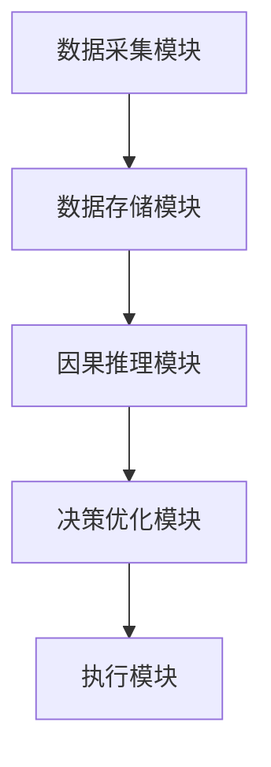
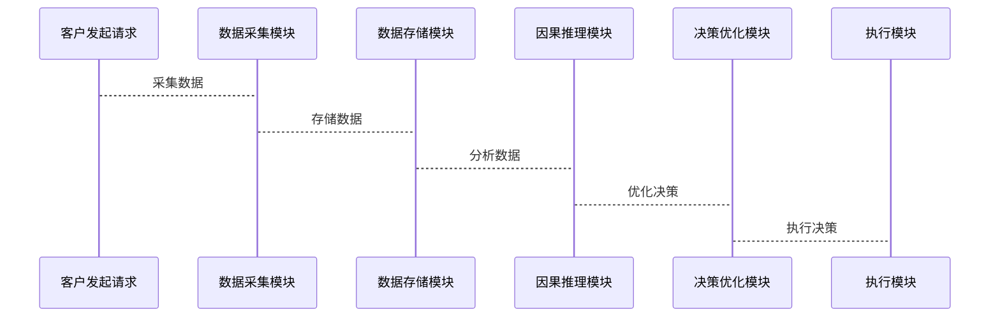

                 


# 企业AI Agent的因果推理应用：深入理解业务逻辑

---

## 关键词：
企业AI Agent、因果推理、业务逻辑、人工智能、系统架构

---

## 摘要：
本文深入探讨了企业AI Agent在因果推理中的应用，结合实际案例和系统架构设计，详细分析了如何通过因果推理技术实现对业务逻辑的深入理解。文章从背景介绍、核心概念、算法原理、系统设计到项目实战，全面解析了企业AI Agent的因果推理应用，帮助读者掌握这一领域的关键技术与实践方法。

---

## 第1章：企业AI Agent与因果推理的背景介绍

### 1.1 问题背景
#### 1.1.1 传统数据分析的局限性
传统数据分析主要依赖相关性分析，无法直接推断因果关系。例如，在分析“广告投放”与“销售额”之间的关系时，相关性分析只能说明两者存在正相关，但无法证明广告投放是否直接导致销售额增加。

#### 1.1.2 业务决策中的因果关系需求
在企业运营中，因果关系是制定有效决策的关键。例如，企业需要知道是否推出某款新产品的广告投放确实会增加销量，或者是否调整价格会直接影响利润。

#### 1.1.3 AI Agent在企业中的角色
AI Agent（智能代理）是一种能够感知环境、自主决策并执行任务的智能系统。在企业中，AI Agent可以用于自动化决策、优化资源配置、实时数据分析等场景。

### 1.2 问题描述
#### 1.2.1 业务逻辑中的因果关系缺失
企业数据通常只记录了“是什么”，而没有记录“为什么”或“如何”。这使得基于相关性分析的决策往往不够准确。

#### 1.2.2 数据驱动决策的挑战
数据驱动决策需要准确的理解因果关系，而传统的统计方法往往无法满足这一需求。

#### 1.2.3 AI Agent在因果推理中的应用价值
通过因果推理，AI Agent能够理解数据背后的因果关系，从而做出更准确的决策。

### 1.3 问题解决
#### 1.3.1 因果推理的基本思路
因果推理的核心是通过观察数据的变化，推断出因果关系。例如，通过实验设计（A/B测试）可以有效地推断因果关系。

#### 1.3.2 AI Agent如何实现因果推理
AI Agent可以通过因果推理算法，结合环境数据，推断出因果关系，并据此做出决策。

#### 1.3.3 业务逻辑与因果关系的结合
业务逻辑是企业运营的核心，因果推理可以帮助AI Agent更好地理解和优化业务逻辑。

### 1.4 边界与外延
#### 1.4.1 因果推理的边界条件
因果推理的有效性依赖于数据质量和实验设计的合理性。例如，如果没有足够的数据支持，因果推理的结果可能不可靠。

#### 1.4.2 AI Agent的适用场景
AI Agent适用于需要自主决策和优化的场景，例如供应链优化、客户关系管理等。

#### 1.4.3 业务逻辑的复杂性限制
复杂的业务逻辑可能需要更复杂的因果推理模型，这可能会增加计算成本和复杂性。

### 1.5 概念结构与核心要素
#### 1.5.1 因果推理的基本模型
因果推理的基本模型包括原因、结果、中间变量和潜在结果。

#### 1.5.2 AI Agent的核心组件
AI Agent的核心组件包括感知模块、推理模块、决策模块和执行模块。

#### 1.5.3 业务逻辑的层次结构
业务逻辑通常包括输入、处理、输出三个层次。因果推理需要理解这些层次之间的关系。

---

## 第2章：因果推理的核心概念与原理

### 2.1 因果推理的基本原理
#### 2.1.1 因果关系的定义
因果关系是指一个事件（原因）导致另一个事件（结果）的发生。例如，下雨是导致地面湿的原因。

#### 2.1.2 因果推理的数学模型
因果推理可以通过概率图模型（如贝叶斯网络）来表示。例如，可以用有向图表示变量之间的因果关系。

#### 2.1.3 因果关系的分类
因果关系可以分为直接因果关系和间接因果关系。例如，价格下降可以直接导致销量增加，而价格下降也可能通过影响市场需求间接导致销量增加。

### 2.2 AI Agent的核心概念
#### 2.2.1 AI Agent的定义与特征
AI Agent是一种能够感知环境、自主决策并执行任务的智能系统。其核心特征包括自主性、反应性、主动性和社会能力。

#### 2.2.2 AI Agent的决策机制
AI Agent的决策机制基于因果推理，能够理解因果关系并做出最优决策。

#### 2.2.3 AI Agent与传统数据分析的区别
传统数据分析主要依赖相关性分析，而AI Agent通过因果推理能够更准确地理解数据背后的原因。

### 2.3 因果推理与AI Agent的联系
#### 2.3.1 因果推理在AI Agent中的应用
因果推理是AI Agent实现自主决策的核心技术。例如，AI Agent可以通过因果推理推断出最优的营销策略。

#### 2.3.2 因果推理与业务逻辑的结合
因果推理帮助AI Agent理解业务逻辑中的因果关系，从而做出更合理的决策。

#### 2.3.3 因果推理与数据驱动决策的结合
通过因果推理，数据驱动决策能够更准确地理解数据背后的原因，从而做出更有效的决策。

### 2.4 因果推理与相关概念的对比分析
#### 2.4.1 因果推理与相关性分析的对比
相关性分析只关注变量之间的关联程度，而因果推理关注变量之间的因果关系。

#### 2.4.2 因果推理与机器学习的对比
机器学习主要关注数据模式的识别，而因果推理关注数据背后的因果关系。

#### 2.4.3 因果推理与知识图谱的对比
知识图谱主要关注实体之间的语义关系，而因果推理关注变量之间的因果关系。

### 2.5 因果推理的ER实体关系图
```mermaid
er
    title 因果推理的ER实体关系图
    Customer: 客户
    Product: 产品
    Sales: 销量
    Advertisement: 广告投放
    Causal Relation: 因果关系
    Customer --> Sales: 影响销量的客户行为
    Advertisement --> Sales: 广告投放影响销量
```

---

## 第3章：AI Agent因果推理的算法原理与数学模型

### 3.1 因果推理算法的核心原理
#### 3.1.1 因果森林（Causal Forest）
因果森林是一种基于随机森林的因果推断方法，能够处理高维数据和复杂因果关系。

#### 3.1.2 潜在结果框架（Potential Outcome Framework）
潜在结果框架通过定义每个单位在不同处理情况下的潜在结果，来估计因果效应。

### 3.2 因果推理算法的实现步骤
#### 3.2.1 确定因果关系的变量
需要明确因果关系中的处理变量、结果变量和干扰变量。

#### 3.2.2 数据预处理
包括数据清洗、特征工程等步骤，确保数据质量。

#### 3.2.3 算法实现
选择合适的因果推理算法（如因果森林）进行模型训练。

#### 3.2.4 结果分析
通过分析模型输出的因果效应，评估因果关系的显著性和稳定性。

### 3.3 因果推理的数学模型
#### 3.3.1 潜在结果框架的数学表达
对于每个单位i，处理变量T_i的可能取值为0或1，结果变量Y_i在T_i=0和T_i=1下的潜在结果分别为Y_i^0和Y_i^1。

#### 3.3.2 因果效应的计算公式
$$ \text{平均因果效应} = \frac{1}{N} \sum_{i=1}^{N} (Y_i^1 - Y_i^0) $$

#### 3.3.3 因果森林的实现流程
1. 生成随机森林，每个树的结构由数据随机划分。
2. 对每个样本，计算其在每棵树中的因果效应。
3. 最终的因果效应估计为所有树的平均值。

### 3.4 因果推理算法的Python代码实现
```python
import numpy as np
import matplotlib.pyplot as plt
from causal Forest import CausalForest

# 生成数据
n = 1000
T = np.random.binomial(1, 0.5, n)
X = np.random.normal(0, 1, n)
Y = T * (X + np.random.normal(0, 1, n)) + (1 - T) * (X + np.random.normal(0, 1, n))

# 训练因果森林模型
model = CausalForest()
model.fit(X, T, Y)

# 预测因果效应
treated_units = np.where(T == 1)[0]
average_causal_effect = np.mean(model.predict(X[treated_units]))

print(f"Average causal effect: {average_causal_effect}")
```

### 3.5 因果推理算法的优缺点
#### 3.5.1 优点
- 能够处理高维数据和复杂因果关系。
- 不需要假设因果关系的线性性。

#### 3.5.2 缺点
- 计算成本较高。
- 需要大量数据支持。

---

## 第4章：企业AI Agent因果推理系统的分析与架构设计

### 4.1 问题场景介绍
#### 4.1.1 业务背景
企业希望通过AI Agent实现智能决策，例如优化营销策略、预测销售趋势等。

#### 4.1.2 问题分析
企业需要理解因果关系，以便更准确地预测结果和优化决策。

### 4.2 系统功能设计
#### 4.2.1 数据采集模块
负责收集企业运营中的各种数据，例如销售数据、客户数据等。

#### 4.2.2 因果推理模块
通过因果推理算法，分析数据中的因果关系。

#### 4.2.3 决策优化模块
基于因果推理结果，优化企业决策。

### 4.3 系统架构设计


### 4.4 系统接口设计
#### 4.4.1 数据接口
数据接口负责与企业现有系统的数据对接，例如ERP系统、CRM系统等。

#### 4.4.2 API接口
API接口用于与其他系统的交互，例如与企业现有的数据分析平台对接。

### 4.5 系统交互流程


---

## 第5章：企业AI Agent因果推理项目实战

### 5.1 项目背景
#### 5.1.1 项目目标
通过因果推理技术，优化企业的营销策略。

#### 5.1.2 项目需求
分析广告投放对销售的影响，推断因果关系。

### 5.2 项目环境与工具安装
#### 5.2.1 环境配置
需要安装Python、Jupyter Notebook、相关数据科学库（如Pandas、Scikit-learn、Causal Forest等）。

#### 5.2.2 工具安装
通过pip安装所需的Python包：
```bash
pip install numpy pandas scikit-learn causal-forest
```

### 5.3 核心代码实现
#### 5.3.1 数据加载与预处理
```python
import pandas as pd

# 加载数据
data = pd.read_csv('advertising.csv')

# 数据预处理
data = data.dropna()
```

#### 5.3.2 因果推理模型训练
```python
from causal_forest import CausalForest

# 训练模型
model = CausalForest()
model.fit(data[['广告投放', '其他因素']], data['销售额'])
```

#### 5.3.3 因果效应分析
```python
# 分析因果效应
treated_units = data['广告投放'] == 1
average_causal_effect = model.effect(data[['广告投放', '其他因素']])[treated_units].mean()

print(f"平均因果效应: {average_causal_effect}")
```

### 5.4 项目案例分析
#### 5.4.1 数据分析结果
通过因果推理模型，发现广告投放确实显著影响了销售额。

#### 5.4.2 优化建议
基于因果效应的结果，企业可以调整广告预算分配，优化营销策略。

### 5.5 项目小结
通过本项目，我们展示了如何利用因果推理技术优化企业的营销策略，实现了从相关性分析到因果关系分析的转变。

---

## 第6章：企业AI Agent因果推理应用的最佳实践与未来展望

### 6.1 最佳实践
#### 6.1.1 数据质量的重要性
确保数据的完整性和准确性，避免因数据问题导致因果推理结果不可靠。

#### 6.1.2 算法选择的策略
根据具体业务需求和数据特点，选择合适的因果推理算法。

#### 6.1.3 模型解释性
因果推理模型需要具备良好的解释性，以便企业能够理解因果关系并制定合理的决策。

### 6.2 小结
通过本文的分析，我们可以看到，企业AI Agent的因果推理应用在数据驱动决策中具有重要意义。通过因果推理，AI Agent能够更准确地理解业务逻辑，优化企业决策。

### 6.3 注意事项
#### 6.3.1 数据依赖性
因果推理结果的高度依赖于数据质量和实验设计的合理性。

#### 6.3.2 模型局限性
因果推理模型的复杂性可能会影响计算效率和实际应用。

#### 6.3.3 业务逻辑的复杂性
复杂的业务逻辑可能需要更复杂的因果推理模型，增加了实施难度。

### 6.4 未来展望
#### 6.4.1 因果推理技术的发展
未来，因果推理技术将更加成熟，应用场景将更加广泛。

#### 6.4.2 AI Agent在企业中的应用拓展
随着技术的发展，AI Agent将在更多领域实现广泛应用，例如智能制造、智能金融等。

#### 6.4.3 人机协作的优化
因果推理将推动人机协作的进一步优化，实现更高效的决策过程。

---

## 作者：AI天才研究院/AI Genius Institute & 禅与计算机程序设计艺术 /Zen And The Art of Computer Programming

---

### 扩展阅读
- 《因果的发现与推理》
- 《AI Agent与智能决策》
- 《数据科学与因果推理》

---

通过本文的深入分析，我们希望读者能够全面理解企业AI Agent的因果推理应用，并能够在实际工作中应用这些技术，推动企业的智能化发展。

