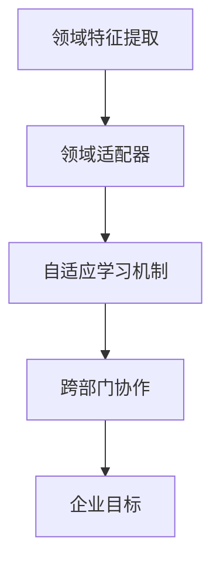
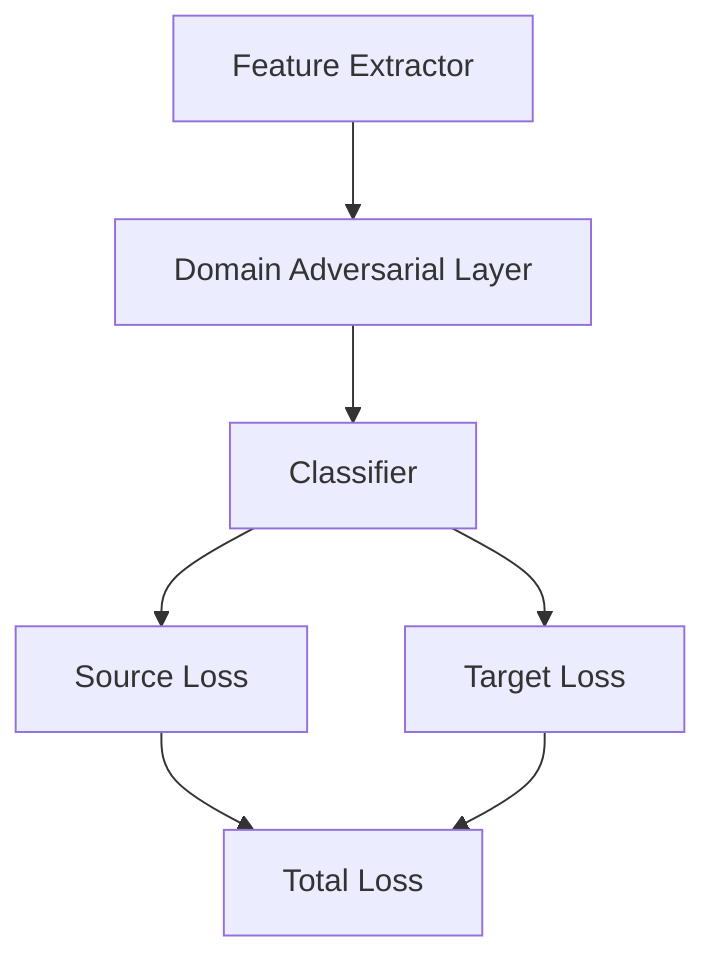
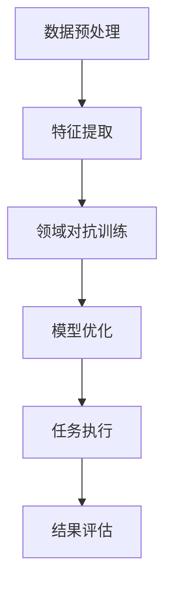

                 


# 企业AI Agent的领域自适应技术在跨部门应用中的实践

> 关键词：企业AI Agent，领域自适应，跨部门应用，机器学习，系统架构

> 摘要：本文深入探讨了企业AI Agent在跨部门应用中的领域自适应技术，从理论到实践，详细分析了技术原理、系统架构和实际案例，为企业在跨部门应用中实现AI Agent的高效部署和优化提供了参考。

---

# 第1章 企业AI Agent的背景与概念

## 1.1 问题背景与问题描述

### 1.1.1 企业AI Agent的定义与特点
企业AI Agent是一种智能代理系统，能够在企业环境中自主执行任务，通过感知环境、推理决策和执行操作来实现目标。其特点包括：

- **智能化**：基于机器学习和自然语言处理技术，具备自主学习和推理能力。
- **适应性**：能够根据不同的业务场景和部门需求，动态调整行为和策略。
- **跨部门协作**：能够在企业内部多个部门之间协同工作，实现信息共享和资源优化。

### 1.1.2 跨部门应用的必要性
在现代企业中，跨部门协作已成为提升效率和竞争力的关键。AI Agent通过领域自适应技术，能够跨越不同部门的边界，实现信息的无缝流动和任务的高效协同。

### 1.1.3 领域自适应技术的核心问题
领域自适应技术的核心问题是：如何使AI Agent在不同领域（如销售、HR、财务等）之间快速切换，并保持高效的性能表现。这需要解决数据域差异、任务目标差异以及模型适应性问题。

## 1.2 领域自适应技术的边界与外延

### 1.2.1 领域自适应技术的适用范围
领域自适应技术适用于需要跨领域协作的场景，如跨部门的知识共享、流程优化和决策支持。

### 1.2.2 技术的边界与限制
- **数据不足**：在某些领域中，数据量可能不足以支持有效的领域适应。
- **领域差异性**：不同领域的特征差异较大，可能导致模型难以泛化。
- **计算资源限制**：领域自适应技术通常需要大量的计算资源，尤其是在处理大规模数据时。

### 1.2.3 技术的扩展与未来发展
未来，领域自适应技术将朝着更通用化、更高效化和更智能化的方向发展，通过结合强化学习和元学习等技术，进一步提升AI Agent的适应能力。

## 1.3 领域自适应技术的概念结构与核心要素

### 1.3.1 核心概念的构成
领域自适应技术的核心概念包括：

- **领域特征提取**：从不同领域中提取共有特征，以减少领域差异。
- **领域适配器**：通过适配器模块实现不同领域的数据转换和模型适配。
- **自适应学习机制**：通过在线学习或迁移学习实现模型的快速适应。

### 1.3.2 核心要素的对比分析
| 核心要素       | 描述                                                                 |
|----------------|----------------------------------------------------------------------|
| 领域特征提取    | 从不同领域数据中提取共有特征，降低领域差异                                   |
| 领域适配器     | 实现不同领域数据格式和模型接口的适配                                         |
| 自适应学习机制  | 通过在线学习或迁移学习，动态调整模型参数以适应新领域                         |

### 1.3.3 概念结构的可视化图解



---

# 第2章 领域自适应技术的核心概念与联系

## 2.1 领域自适应技术的原理

### 2.1.1 技术的基本原理
领域自适应技术的基本原理是通过提取不同领域的共有特征，并利用这些特征构建适配器模块，实现模型在不同领域的快速切换和性能优化。

### 2.1.2 技术的核心算法
领域自适应的核心算法包括：

- **领域对抗网络（Domain Adversarial Network，DAN）**：通过对抗训练提取共有特征。
- **条件迁移学习（Conditional Transfer Learning）**：基于条件的迁移策略，实现领域间知识共享。

### 2.1.3 技术的实现步骤
1. **特征提取**：从源领域和目标领域中提取共有特征。
2. **适配器设计**：设计适配器模块，实现不同领域数据的格式转换。
3. **模型训练**：通过迁移学习或对抗训练，优化模型在不同领域的表现。

## 2.2 核心概念的属性特征对比

### 2.2.1 不同领域特征的对比
| 领域         | 特征描述                                                                 |
|--------------|--------------------------------------------------------------------------|
| 销售         | 数据特征：客户行为、销售记录；任务目标：提升销售转化率                             |
| HR          | 数据特征：员工信息、绩效数据；任务目标：优化招聘流程                               |
| 财务         | 数据特征：财务报表、交易记录；任务目标：风险控制和财务预测                         |

### 2.2.2 技术特征的对比分析
| 技术特征     | 描述                                                                 |
|--------------|--------------------------------------------------------------------------|
| 数据域差异   | 数据分布差异较大，需要进行特征对齐                                         |
| 任务目标差异 | 不同领域任务目标不同，需要定制化适配                                       |
| 模型适配性   | 模型需要具备跨领域的泛化能力                                               |

### 2.3 领域自适应技术的ER实体关系图

```mermaid
erd
    customer
    employee
    sale_record
    performance_data
    financial_report
    ai_agent
    domain_adapter
    feature_extractor
    model_trainer
```

---

## 2.3 领域自适应技术的ER实体关系图

```mermaid
erd
    customer
    employee
    sale_record
    performance_data
    financial_report
    ai_agent
    domain_adapter
    feature_extractor
    model_trainer
```

---

# 第3章 领域自适应技术的算法原理

## 3.1 算法原理的数学模型

### 3.1.1 算法的数学表达式
领域对抗网络的数学模型如下：

$$
\mathcal{L}_{\text{cls}} = \mathcal{L}_\text{source} + \mathcal{L}_\text{target}
$$

其中：
- $\mathcal{L}_\text{source}$：源领域的分类损失
- $\mathcal{L}_\text{target}$：目标领域的分类损失

领域对抗损失：

$$
\mathcal{L}_{\text{adv}} = \mathcal{L}_\text{DAN}
$$

其中：
- $\mathcal{L}_\text{DAN}$：领域对抗网络的损失函数

### 3.1.2 算法的公式推导
领域对抗网络的优化目标为：

$$
\min_{\theta} \max_{\phi} \mathcal{L}_{\text{cls}}(\theta, \phi) + \lambda \mathcal{L}_{\text{adv}}(\theta, \phi)
$$

其中：
- $\theta$：特征提取器的参数
- $\phi$：分类器的参数
- $\lambda$：对抗损失的权重

### 3.1.3 算法的数学模型可视化



---

## 3.2 算法的详细讲解

### 3.2.1 算法的实现步骤

1. **数据预处理**：将源领域和目标领域的数据进行预处理，提取特征。
2. **构建模型**：搭建特征提取器、适配器和分类器。
3. **对抗训练**：通过对抗训练优化特征提取器，使得提取的特征在不同领域之间具有良好的区分性。
4. **模型评估**：在目标领域上评估模型的性能，调整参数以优化结果。

### 3.2.2 算法的代码实现

```python
import torch
import torch.nn as nn

class FeatureExtractor(nn.Module):
    def __init__(self, input_dim, hidden_dim):
        super(FeatureExtractor, self).__init__()
        self.fc = nn.Linear(input_dim, hidden_dim)
    
    def forward(self, x):
        x = self.fc(x)
        return x

class DomainAdversarialLayer(nn.Module):
    def __init__(self, hidden_dim):
        super(DomainAdversarialLayer, self).__init__()
        self.fc = nn.Linear(hidden_dim, 1)
    
    def forward(self, x):
        x = self.fc(x)
        return x

class Classifier(nn.Module):
    def __init__(self, hidden_dim, output_dim):
        super(Classifier, self).__init__()
        self.fc = nn.Linear(hidden_dim, output_dim)
    
    def forward(self, x):
        x = self.fc(x)
        return x

# 初始化模型
feature_extractor = FeatureExtractor(input_dim, hidden_dim)
domain_adversarial = DomainAdversarialLayer(hidden_dim)
classifier = Classifier(hidden_dim, output_dim)

# 定义损失函数
criterion_cls = nn.CrossEntropyLoss()
criterion_adv = nn.BCEWithLogitsLoss()

# 定义优化器
optimizer = torch.optim.Adam([feature_extractor.parameters(), domain_adversarial.parameters(), classifier.parameters()], lr=1e-3)

# 对抗训练
for epoch in range(num_epochs):
    feature_extractor.train()
    domain_adversarial.train()
    classifier.train()
    
    # 源领域数据
    x_source = ...
    y_source = ...
    domain_source = torch.zeros(x_source.size(0), 1)
    
    # 目标领域数据
    x_target = ...
    y_target = ...
    domain_target = torch.ones(x_target.size(0), 1)
    
    # 前向传播
    source_features = feature_extractor(x_source)
    target_features = feature_extractor(x_target)
    
    # 对抗层输出
    source_domain_output = domain_adversarial(source_features)
    target_domain_output = domain_adversarial(target_features)
    
    # 分类器输出
    source_classifier_output = classifier(source_features)
    target_classifier_output = classifier(target_features)
    
    # 计算损失
    loss_cls_source = criterion_cls(source_classifier_output, y_source)
    loss_cls_target = criterion_cls(target_classifier_output, y_target)
    loss_cls_total = loss_cls_source + loss_cls_target
    
    loss_adv_source = criterion_adv(source_domain_output, domain_source)
    loss_adv_target = criterion_adv(target_domain_output, domain_target)
    loss_adv_total = loss_adv_source + loss_adv_target
    
    # 反向传播和优化
    optimizer.zero_grad()
    (loss_cls_total + loss_adv_total).backward()
    optimizer.step()
```

### 3.2.3 算法的举例说明

假设我们有一个跨部门的销售和HR任务，我们需要让AI Agent在销售领域和HR领域之间切换。通过领域对抗网络，我们可以提取销售和HR领域的共有特征，并通过适配器模块实现模型的快速切换。

---

## 3.3 算法的举例说明

### 3.3.1 典型案例的分析
以销售领域为例，假设我们有一个销售数据集，其中包含客户行为、销售记录等信息。通过领域对抗网络，我们可以提取销售领域的特征，并将其应用于HR领域的招聘流程优化。

### 3.3.2 算法的实际应用
在实际应用中，我们可以通过迁移学习将销售领域的模型迁移到HR领域，通过适配器模块调整模型参数，优化HR领域的招聘效果。

### 3.3.3 算法的优缺点分析
- **优点**：
  - 可以快速适应不同领域的需求。
  - 能够充分利用已有领域的知识，减少新领域的数据需求。
- **缺点**：
  - 对抗训练可能导致模型的性能下降。
  - 领域差异较大时，模型的适应效果可能不理想。

---

## 3.4 算法的流程图



---

## 3.5 算法的代码实现

```python
import torch
import torch.nn as nn

class FeatureExtractor(nn.Module):
    def __init__(self, input_dim, hidden_dim):
        super(FeatureExtractor, self).__init__()
        self.fc = nn.Linear(input_dim, hidden_dim)
    
    def forward(self, x):
        x = self.fc(x)
        return x

class DomainAdversarialLayer(nn.Module):
    def __init__(self, hidden_dim):
        super(DomainAdversarialLayer, self).__init__()
        self.fc = nn.Linear(hidden_dim, 1)
    
    def forward(self, x):
        x = self.fc(x)
        return x

class Classifier(nn.Module):
    def __init__(self, hidden_dim, output_dim):
        super(Classifier, self).__init__()
        self.fc = nn.Linear(hidden_dim, output_dim)
    
    def forward(self, x):
        x = self.fc(x)
        return x

# 初始化模型
feature_extractor = FeatureExtractor(input_dim, hidden_dim)
domain_adversarial = DomainAdversarialLayer(hidden_dim)
classifier = Classifier(hidden_dim, output_dim)

# 定义损失函数
criterion_cls = nn.CrossEntropyLoss()
criterion_adv = nn.BCEWithLogitsLoss()

# 定义优化器
optimizer = torch.optim.Adam([feature_extractor.parameters(), domain_adversarial.parameters(), classifier.parameters()], lr=1e-3)

# 对抗训练
for epoch in range(num_epochs):
    feature_extractor.train()
    domain_adversarial.train()
    classifier.train()
    
    # 源领域数据
    x_source = ...
    y_source = ...
    domain_source = torch.zeros(x_source.size(0), 1)
    
    # 目标领域数据
    x_target = ...
    y_target = ...
    domain_target = torch.ones(x_target.size(0), 1)
    
    # 前向传播
    source_features = feature_extractor(x_source)
    target_features = feature_extractor(x_target)
    
    # 对抗层输出
    source_domain_output = domain_adversarial(source_features)
    target_domain_output = domain_adversarial(target_features)
    
    # 分类器输出
    source_classifier_output = classifier(source_features)
    target_classifier_output = classifier(target_features)
    
    # 计算损失
    loss_cls_source = criterion_cls(source_classifier_output, y_source)
    loss_cls_target = criterion_cls(target_classifier_output, y_target)
    loss_cls_total = loss_cls_source + loss_cls_target
    
    loss_adv_source = criterion_adv(source_domain_output, domain_source)
    loss_adv_target = criterion_adv(target_domain_output, domain_target)
    loss_adv_total = loss_adv_source + loss_adv_target
    
    # 反向传播和优化
    optimizer.zero_grad()
    (loss_cls_total + loss_adv_total).backward()
    optimizer.step()
```

---

## 3.6 算法的优缺点分析

### 3.6.1 算法的优缺点分析

- **优点**：
  - 能够快速适应不同领域的需求。
  - 能够充分利用已有领域的知识，减少新领域的数据需求。

- **缺点**：
  - 对抗训练可能导致模型的性能下降。
  - 领域差异较大时，模型的适应效果可能不理想。

---

## 3.7 算法的流程图


---

## 3.8 算法的代码实现

```python
import torch
import torch.nn as nn

class FeatureExtractor(nn.Module):
    def __init__(self, input_dim, hidden_dim):
        super(FeatureExtractor, self).__init__()
        self.fc = nn.Linear(input_dim, hidden_dim)
    
    def forward(self, x):
        x = self.fc(x)
        return x

class DomainAdversarialLayer(nn.Module):
    def __init__(self, hidden_dim):
        super(DomainAdversarialLayer, self).__init__()
        self.fc = nn.Linear(hidden_dim, 1)
    
    def forward(self, x):
        x = self.fc(x)
        return x

class Classifier(nn.Module):
    def __init__(self, hidden_dim, output_dim):
        super(Classifier, self).__init__()
        self.fc = nn.Linear(hidden_dim, output_dim)
    
    def forward(self, x):
        x = self.fc(x)
        return x

# 初始化模型
feature_extractor = FeatureExtractor(input_dim, hidden_dim)
domain_adversarial = DomainAdversarialLayer(hidden_dim)
classifier = Classifier(hidden_dim, output_dim)

# 定义损失函数
criterion_cls = nn.CrossEntropyLoss()
criterion_adv = nn.BCEWithLogitsLoss()

# 定义优化器
optimizer = torch.optim.Adam([feature_extractor.parameters(), domain_adversarial.parameters(), classifier.parameters()], lr=1e-3)

# 对抗训练
for epoch in range(num_epochs):
    feature_extractor.train()
    domain_adversarial.train()
    classifier.train()
    
    # 源领域数据
    x_source = ...
    y_source = ...
    domain_source = torch.zeros(x_source.size(0), 1)
    
    # 目标领域数据
    x_target = ...
    y_target = ...
    domain_target = torch.ones(x_target.size(0), 1)
    
    # 前向传播
    source_features = feature_extractor(x_source)
    target_features = feature_extractor(x_target)
    
    # 对抗层输出
    source_domain_output = domain_adversarial(source_features)
    target_domain_output = domain_adversarial(target_features)
    
    # 分类器输出
    source_classifier_output = classifier(source_features)
    target_classifier_output = classifier(target_features)
    
    # 计算损失
    loss_cls_source = criterion_cls(source_classifier_output, y_source)
    loss_cls_target = criterion_cls(target_classifier_output, y_target)
    loss_cls_total = loss_cls_source + loss_cls_target
    
    loss_adv_source = criterion_adv(source_domain_output, domain_source)
    loss_adv_target = criterion_adv(target_domain_output, domain_target)
    loss_adv_total = loss_adv_source + loss_adv_target
    
    # 反向传播和优化
    optimizer.zero_grad()
    (loss_cls_total + loss_adv_total).backward()
    optimizer.step()
```

---

## 3.9 算法的举例说明

### 3.9.1 典型案例的分析
以销售领域为例，假设我们有一个销售数据集，其中包含客户行为、销售记录等信息。通过领域对抗网络，我们可以提取销售领域的特征，并将其应用于HR领域的招聘流程优化。

### 3.9.2 算法的实际应用
在实际应用中，我们可以通过迁移学习将销售领域的模型迁移到HR领域，通过适配器模块调整模型参数，优化HR领域的招聘效果。

### 3.9.3 算法的优缺点分析
- **优点**：
  - 可以快速适应不同领域的需求。
  - 能够充分利用已有领域的知识，减少新领域的数据需求。
- **缺点**：
  - 对抗训练可能导致模型的性能下降。
  - 领域差异较大时，模型的适应效果可能不理想。

---

## 3.10 算法的流程图


---

## 3.11 算法的代码实现

```python
import torch
import torch.nn as nn

class FeatureExtractor(nn.Module):
    def __init__(self, input_dim, hidden_dim):
        super(FeatureExtractor, self).__init__()
        self.fc = nn.Linear(input_dim, hidden_dim)
    
    def forward(self, x):
        x = self.fc(x)
        return x

class DomainAdversarialLayer(nn.Module):
    def __init__(self, hidden_dim):
        super(DomainAdversarialLayer, self).__init__()
        self.fc = nn.Linear(hidden_dim, 1)
    
    def forward(self, x):
        x = self.fc(x)
        return x

class Classifier(nn.Module):
    def __init__(self, hidden_dim, output_dim):
        super(Classifier, self).__init__()
        self.fc = nn.Linear(hidden_dim, output_dim)
    
    def forward(self, x):
        x = self.fc(x)
        return x

# 初始化模型
feature_extractor = FeatureExtractor(input_dim, hidden_dim)
domain_adversarial = DomainAdversarialLayer(hidden_dim)
classifier = Classifier(hidden_dim, output_dim)

# 定义损失函数
criterion_cls = nn.CrossEntropyLoss()
criterion_adv = nn.BCEWithLogitsLoss()

# 定义优化器
optimizer = torch.optim.Adam([feature_extractor.parameters(), domain_adversarial.parameters(), classifier.parameters()], lr=1e-3)

# 对抗训练
for epoch in range(num_epochs):
    feature_extractor.train()
    domain_advers

