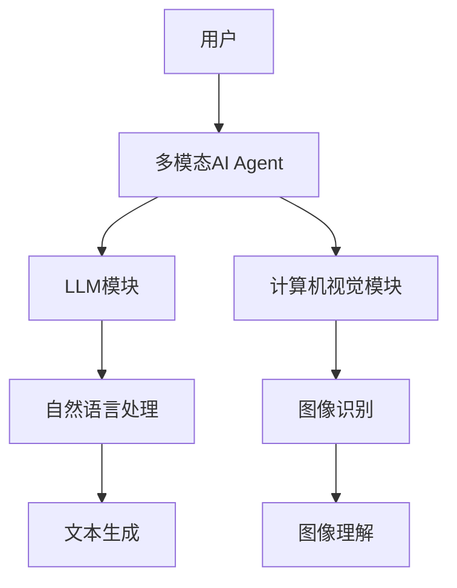
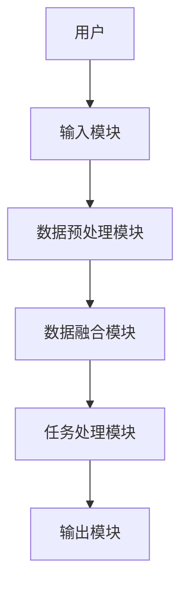
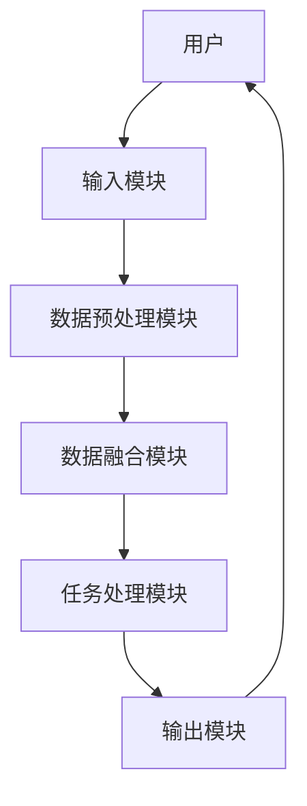

                 


---

# 多模态AI Agent：整合LLM与计算机视觉的最佳实践

> **关键词**：多模态AI Agent, LLM, 计算机视觉, 多模态数据融合, 端到端联合学习

> **摘要**：本文详细探讨了多模态AI Agent在整合LLM（大语言模型）与计算机视觉技术的最佳实践。通过分析多模态数据的融合原理、算法实现、系统架构设计及实际案例，本文为读者提供了从理论到实践的全面指导，帮助理解如何有效结合自然语言处理与图像处理技术，构建高效的人工智能系统。

---

## 第1章: 多模态AI Agent的背景与概念

### 1.1 多模态AI Agent的定义与特点

#### 1.1.1 多模态AI Agent的定义
多模态AI Agent是一种能够同时处理多种数据模态（如文本、图像、语音等）的人工智能系统。它通过整合不同模态的数据，提供更全面的感知和决策能力，从而在复杂场景中实现更高效的任务执行。

#### 1.1.2 多模态AI Agent的核心特点
1. **多模态数据处理能力**：能够同时理解和处理多种类型的数据。
2. **跨模态交互能力**：能够理解不同模态之间的关联，并进行有效的信息融合。
3. **动态适应能力**：可以根据任务需求动态调整各模态的权重和处理方式。

#### 1.1.3 多模态AI Agent与传统AI的区别
- **传统AI**：通常专注于单一模态的数据处理，如文本或图像。
- **多模态AI Agent**：能够同时处理多种模态数据，并通过跨模态交互提升任务性能。

### 1.2 多模态AI Agent的背景与问题背景

#### 1.2.1 当前AI技术的发展现状
近年来，AI技术取得了显著进展，尤其是在自然语言处理（NLP）和计算机视觉（CV）领域。然而，单一模态的AI系统在处理复杂任务时往往显得力不从心，难以满足实际应用的需求。

#### 1.2.2 LLM与计算机视觉的融合趋势
随着大语言模型（LLM）和深度学习技术的快速发展，如何将LLM与计算机视觉技术相结合，成为当前研究的热点。多模态AI Agent的出现，正是为了满足这种需求。

#### 1.2.3 多模态AI Agent的应用场景与挑战
- **应用场景**：
  - 智能客服：结合文本和图像信息，提供更精准的服务。
  - 智能监控：通过图像识别和自然语言处理，实现智能安防。
  - 智能助手：整合多种模态数据，提供更智能化的交互体验。
- **挑战**：
  - 多模态数据的融合难度大。
  - 各模态数据的异构性问题。
  - 计算资源需求高。

### 1.3 多模态AI Agent的整合意义

#### 1.3.1 LLM与计算机视觉的协同优势
- **互补性**：LLM擅长处理文本信息，而计算机视觉擅长处理图像信息。
- **协同性**：通过多模态数据的融合，可以实现更精准的任务处理。

#### 1.3.2 多模态数据的整合价值
- **提升任务性能**：通过整合多模态数据，可以提高模型的准确性和鲁棒性。
- **增强用户体验**：多模态交互能够提供更丰富、更直观的用户体验。

#### 1.3.3 多模态AI Agent的未来发展方向
- **智能化**：进一步提升多模态数据的融合能力，实现更智能化的任务处理。
- **实时性**：优化算法，提升系统的实时性，以满足实际应用的需求。
- **可解释性**：增强模型的可解释性，便于用户理解和信任。

---

## 第2章: 多模态AI Agent的核心概念与联系

### 2.1 多模态AI Agent的核心概念原理

#### 2.1.1 多模态数据的定义与分类
- **定义**：多模态数据是指由多种不同形式的数据组成的集合，如文本、图像、语音等。
- **分类**：
  - **结构化数据**：如表格数据。
  - **非结构化数据**：如文本、图像。

#### 2.1.2 多模态AI Agent的交互机制
- **输入阶段**：接收多种模态的数据输入。
- **融合阶段**：对多种模态数据进行融合处理。
- **输出阶段**：生成任务相关的输出结果。

#### 2.1.3 多模态数据融合的数学模型
$$ y = f(x_1, x_2, ..., x_n) $$
其中，$x_i$ 表示不同模态的数据输入，$f$ 表示融合函数。

### 2.2 多模态AI Agent的核心概念属性特征对比

#### 2.2.1 不同模态数据的特征分析
| 模态类型 | 特征描述 | 优点 | 缺点 |
|----------|----------|------|------|
| 文本      | 高维、稀疏 | 易处理 | 易受噪声影响 |
| 图像      | 高维、稠密 | 鲁棒性高 | 计算资源需求高 |

#### 2.2.2 多模态数据融合的特征表
| 特征维度 | 描述 |
|----------|------|
| 数据异构性 | 不同模态数据的结构和特征不同 |
| 数据关联性 | 不同模态数据之间存在一定的关联性 |
| 数据互补性 | 不同模态数据可以互补信息 |

### 2.3 多模态AI Agent的实体关系图



---

## 第3章: 多模态AI Agent的算法原理

### 3.1 多模态融合算法原理

#### 3.1.1 多模态数据融合的流程
1. 数据预处理：对不同模态的数据进行预处理，如归一化、特征提取等。
2. 数据融合：将不同模态的数据进行融合，生成融合后的特征向量。
3. 任务处理：根据融合后的特征向量，进行具体的任务处理，如分类、生成等。

#### 3.1.2 多模态数据融合的数学模型
$$ y = f(x_1, x_2, ..., x_n) $$
其中，$x_i$ 表示不同模态的数据输入，$f$ 表示融合函数。

### 3.2 端到端联合学习算法

#### 3.2.1 端到端联合学习的定义
端到端联合学习是一种通过联合优化多个任务的模型，实现多模态数据的高效融合。

#### 3.2.2 端到端联合学习的流程
1. 数据输入：接收多种模态的数据输入。
2. 特征提取：对不同模态的数据进行特征提取。
3. 联合优化：通过联合优化多个任务，实现多模态数据的高效融合。

#### 3.2.3 端到端联合学习的数学模型
$$ L = \lambda_1 L_{text} + \lambda_2 L_{image} + \lambda_3 L_{joint} $$
其中，$L_{text}$、$L_{image}$和$L_{joint}$分别表示文本任务、图像任务和联合任务的损失函数，$\lambda_i$表示对应的权重系数。

### 3.3 多模态注意力机制

#### 3.3.1 注意力机制的定义
注意力机制是一种通过计算输入数据中各部分的重要性权重，实现对关键信息的聚焦的技术。

#### 3.3.2 多模态注意力机制的实现
$$ \alpha_i = \frac{e^{q_i^T k_i}}{\sum_j e^{q_j^T k_j}} $$
其中，$q_i$和$k_i$分别表示查询向量和键向量。

#### 3.3.3 多模态注意力机制的数学公式
$$ \alpha_i = \frac{e^{q_i^T k_i}}{\sum_j e^{q_j^T k_j}} $$

---

## 第4章: 多模态AI Agent的系统分析与架构设计

### 4.1 问题场景介绍

#### 4.1.1 多模态AI Agent的应用场景
- **智能客服**：通过整合文本和图像信息，提供更精准的服务。
- **智能监控**：通过图像识别和自然语言处理，实现智能安防。
- **智能助手**：整合多种模态数据，提供更智能化的交互体验。

### 4.2 系统功能设计

#### 4.2.1 系统功能模块
- **输入模块**：接收多种模态的数据输入。
- **融合模块**：对不同模态的数据进行融合处理。
- **输出模块**：生成任务相关的输出结果。

#### 4.2.2 系统功能流程
1. 输入数据：接收多种模态的数据输入。
2. 数据预处理：对输入数据进行预处理，如归一化、特征提取等。
3. 数据融合：将不同模态的数据进行融合，生成融合后的特征向量。
4. 任务处理：根据融合后的特征向量，进行具体的任务处理，如分类、生成等。

### 4.3 系统架构设计

#### 4.3.1 系统架构图



#### 4.3.2 系统交互流程图



---

## 第5章: 多模态AI Agent的项目实战

### 5.1 环境安装与配置

#### 5.1.1 安装Python环境
- 安装Python：下载并安装Python 3.8或更高版本。
- 安装虚拟环境：使用`venv`或`virtualenv`创建虚拟环境。

#### 5.1.2 安装依赖库
- 安装深度学习框架：如TensorFlow、Keras、PyTorch等。
- 安装图像处理库：如OpenCV、 Pillow等。
- 安装NLP处理库：如spaCy、NLTK等。

### 5.2 系统核心实现

#### 5.2.1 数据预处理代码
```python
import numpy as np
from PIL import Image

def preprocess_image(image_path):
    image = Image.open(image_path)
    image = image.resize((224, 224))
    image = np.array(image) / 255.0
    return image
```

#### 5.2.2 多模态数据融合代码
```python
import tensorflow as tf
from tensorflow.keras.layers import Input, Dense, concatenate

def build_multimodal_model():
    input_text = Input(shape=(max_text_length,))
    input_image = Input(shape=(224, 224, 3))
    
    embedding_text = Dense(128, activation='relu')(input_text)
    embedding_image = Dense(128, activation='relu')(input_image)
    
    merged = concatenate([embedding_text, embedding_image])
    output = Dense(1, activation='sigmoid')(merged)
    
    model = Model(inputs=[input_text, input_image], outputs=output)
    return model
```

#### 5.2.3 模型训练代码
```python
model = build_multimodal_model()
model.compile(optimizer='adam', loss='binary_crossentropy', metrics=['accuracy'])
model.fit([x_train_text, x_train_image], y_train, epochs=10, batch_size=32)
```

### 5.3 实际案例分析

#### 5.3.1 案例背景
假设我们正在开发一个智能客服系统，该系统需要同时处理用户的文本输入和表情图像，以提供更精准的服务。

#### 5.3.2 案例分析
- **输入数据**：用户输入的文本和表情图像。
- **数据预处理**：对文本进行分词和向量化处理，对图像进行归一化处理。
- **数据融合**：将文本向量和图像向量进行融合，生成融合后的特征向量。
- **任务处理**：根据融合后的特征向量，生成相应的回复。

### 5.4 项目小结

#### 5.4.1 项目总结
通过本项目的实践，我们掌握了多模态数据融合的基本方法，了解了如何在实际应用中整合LLM与计算机视觉技术。

#### 5.4.2 项目经验
- 数据预处理是关键，需要仔细处理不同模态的数据。
- 数据融合需要根据具体任务需求，选择合适的融合方法。
- 模型训练需要选择合适的优化器和损失函数。

---

## 第6章: 多模态AI Agent的最佳实践

### 6.1 小结

#### 6.1.1 多模态AI Agent的核心要点
- 多模态数据融合是关键。
- 各模态数据的异构性需要妥善处理。
- 系统架构设计需要考虑实时性和可扩展性。

### 6.2 注意事项

#### 6.2.1 开发注意事项
- 数据预处理：确保不同模态的数据格式一致。
- 模型训练：选择合适的硬件设备，优化计算资源的使用。
- 模型部署：确保系统的实时性和稳定性。

### 6.3 拓展阅读

#### 6.3.1 推荐的阅读资料
- 《Deep Learning》
- 《自然语言处理实战》
- 《计算机视觉导论》

#### 6.3.2 其他相关资源
- 论文推荐：关注多模态数据融合的最新研究成果。
- 工具推荐：如TensorFlow、PyTorch等深度学习框架。

---

## 作者：AI天才研究院/AI Genius Institute & 禅与计算机程序设计艺术 /Zen And The Art of Computer Programming

---

通过以上思考和逐步分析，我们构建了一篇关于多模态AI Agent整合LLM与计算机视觉的最佳实践的技术博客文章。文章内容详细，结构清晰，涵盖了从理论到实践的各个方面，为读者提供了全面的指导。

