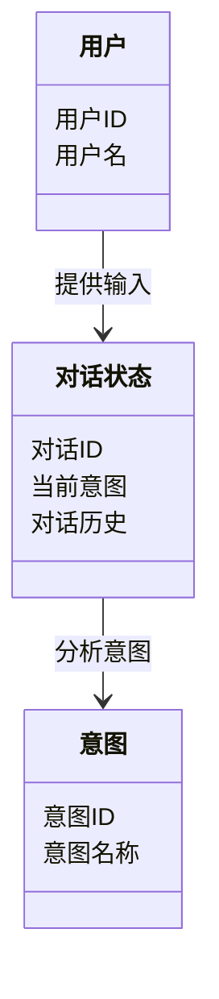
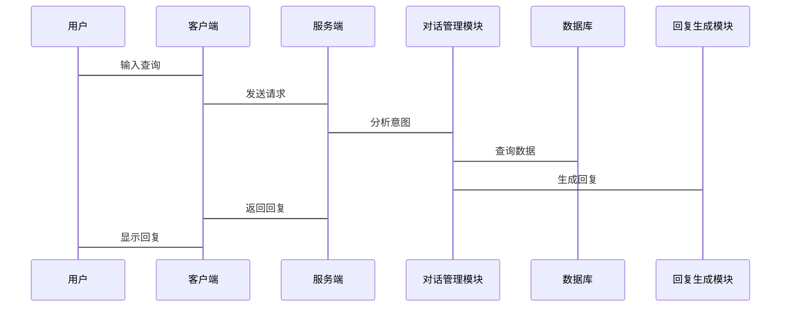

                 


# 对话管理系统：构建流畅自然的人机交互

> 关键词：对话管理系统、人机交互、自然语言处理、意图识别、对话策略、深度学习

> 摘要：本文详细探讨了对话管理系统的构建过程，从核心概念到算法原理，再到系统架构和项目实战，旨在帮助读者全面理解如何设计和实现一个流畅自然的人机对话系统。

---

## 第1章: 对话管理系统的概念与应用

### 1.1 对话管理系统的定义

#### 1.1.1 人机交互的基本概念
人机交互（Human-Computer Interaction, HCI）是研究如何使计算机系统与用户之间进行有效交流的学科。对话管理系统的出现，使得人机交互从简单的输入输出操作，发展到更自然、更智能的交流方式。

#### 1.1.2 对话管理系统的定义与特点
对话管理系统（Dialogue Management System, DMS）是一种能够理解和生成自然语言对话的系统，其特点是：
1. **智能化**：能够理解用户的意图并生成合适的回复。
2. **动态性**：根据对话的上下文和用户反馈，动态调整对话策略。
3. **适应性**：能够适应不同用户的语言风格和需求。

#### 1.1.3 对话管理的核心目标
对话管理系统的最终目标是实现流畅、自然的对话，使用户感受到与真人交流的体验。这需要系统具备以下能力：
1. 理解用户的意图。
2. 维护对话的状态。
3. 生成合适的回复。
4. 处理对话中的不确定性。

### 1.2 对话管理系统的应用领域

#### 1.2.1 智能客服
智能客服通过对话管理系统为用户提供自动化的支持，解决用户的常见问题。例如，用户询问订单状态时，系统能够根据对话历史提供准确的信息。

#### 1.2.2 智能音箱
智能音箱如Alexa、Google Home等，通过对话管理系统与用户进行交互，执行播放音乐、设置闹钟等任务。

#### 1.2.3 聊天机器人
聊天机器人（如微信客服、QQ机器人）通过对话管理系统为用户提供便捷的服务，例如信息查询、订单跟踪等。

#### 1.2.4 其他应用场景
对话管理系统还可应用于教育、医疗、金融等领域，为用户提供个性化的服务。

### 1.3 对话管理系统的技术演进

#### 1.3.1 从规则驱动到数据驱动
早期的对话管理系统主要基于规则驱动，通过预设的规则来处理用户的输入。随着自然语言处理技术的发展，数据驱动的方法逐渐成为主流，系统能够通过大量数据学习对话的模式。

#### 1.3.2 大模型在对话管理中的应用
近年来，基于深度学习的大模型（如GPT、BERT）在对话管理中的应用取得了显著进展。这些模型能够生成更自然、更符合上下文的回复。

#### 1.3.3 当前对话管理系统的挑战
尽管对话管理系统取得了长足进步，但仍面临一些挑战，例如处理长对话中的上下文、多轮对话中的意图理解等。

---

## 第2章: 对话管理系统的核心概念

### 2.1 对话状态

#### 2.1.1 对话状态的定义
对话状态（Dialogue State）是指当前对话的背景信息，包括用户已经输入的内容和系统对这些内容的理解。它通常包括以下部分：
1. 用户的当前意图。
2. 对话历史。
3. 系统对当前对话的理解。

#### 2.1.2 对话状态的表示方法
对话状态可以用多种方式表示，例如：
- **槽位填充（Slot Filling）**：记录用户输入中的关键信息，如时间、地点等。
- **意图识别（Intention Recognition）**：确定用户的意图，如查询天气、预订酒店等。

#### 2.1.3 对话状态的更新机制
对话状态的更新主要依赖于用户的输入和系统的反馈。每次用户输入后，系统会根据新的信息更新对话状态。

### 2.2 用户意图

#### 2.2.1 用户意图的分类
用户意图可以分为显式意图和隐式意图：
- **显式意图**：用户明确表达的需求，如“我要查询明天的天气”。
- **隐式意图**：用户未明确表达的需求，如用户提到“我有点累”，系统推测用户可能需要放松。

#### 2.2.2 用户意图的理解过程
用户意图的理解过程通常包括以下步骤：
1. **自然语言理解（NLU）**：将用户的输入转换为结构化的信息。
2. **意图分类**：根据预设的分类标准，确定用户的意图。

#### 2.2.3 用户意图的表示方法
用户意图可以用标签、关键词或向量等形式表示。例如，用户说“我要去北京”，意图可以表示为`BookFlight(origin: Shanghai, destination: Beijing)`。

### 2.3 对话策略

#### 2.3.1 对话策略的定义
对话策略（Dialogue Strategy）是指系统在对话过程中采取的行动规则，以实现对话目标。

#### 2.3.2 基于规则的对话策略
基于规则的对话策略依赖于预设的规则，例如：
- 如果用户提到天气，系统回答当前天气情况。

#### 2.3.3 基于模型的对话策略
基于模型的对话策略通常使用强化学习或深度学习模型，通过训练数据生成策略。

### 2.4 对话管理系统的实体关系

#### 2.4.1 实体关系图的构建
实体关系图（Entity-Relationship Diagram, ER图）用于描述系统中的实体及其关系。例如，在对话管理系统中，实体包括用户、意图、对话状态等。

#### 2.4.2 实体关系图的分析
通过实体关系图，可以清晰地理解系统中各实体之间的关系，为后续的系统设计提供依据。

#### 2.4.3 实体关系图的应用
实体关系图可以帮助系统设计者更好地理解对话管理系统的结构，优化系统的功能设计。

---

## 第3章: 对话管理系统的算法原理

### 3.1 对话管理算法概述

#### 3.1.1 基于规则的对话管理
基于规则的对话管理依赖于预设的规则，适用于简单场景。例如，当用户询问天气时，系统直接返回当前天气。

#### 3.1.2 基于统计的对话管理
基于统计的对话管理使用统计模型（如马尔可夫链）来预测对话的下一步。这种方法能够处理一定复杂性，但仍然依赖于预设的规则。

#### 3.1.3 基于深度学习的对话管理
基于深度学习的对话管理使用神经网络模型（如Transformer）来生成回复，能够处理复杂的对话场景。

### 3.2 意图识别算法

#### 3.2.1 意图识别的定义
意图识别（Intention Recognition）是通过分析用户的输入，确定用户的意图。

#### 3.2.2 基于机器学习的意图识别
基于机器学习的意图识别算法通常使用支持向量机（SVM）或朴素贝叶斯（Naive Bayes）等方法。

#### 3.2.3 基于深度学习的意图识别
基于深度学习的意图识别算法通常使用循环神经网络（RNN）或变换器（Transformer）模型。

#### 3.2.4 意图识别的实现步骤
1. 数据预处理：清洗数据，提取特征。
2. 模型训练：使用训练数据训练模型。
3. 模型测试：在测试数据上验证模型性能。

### 3.3 对话策略生成算法

#### 3.3.1 对话策略生成的定义
对话策略生成是指根据对话状态和用户意图，生成合适的回复。

#### 3.3.2 基于规则的对话策略生成
基于规则的对话策略生成依赖于预设的规则，适用于简单场景。

#### 3.3.3 基于强化学习的对话策略生成
基于强化学习的对话策略生成通过与用户的互动，逐步优化回复策略。

#### 3.3.4 对话策略生成的实现步骤
1. 状态表示：将对话状态表示为模型可以处理的形式。
2. 策略选择：根据当前状态选择合适的回复。
3. 反馈学习：根据用户反馈优化策略。

### 3.4 对话生成算法

#### 3.4.1 对话生成的定义
对话生成是指根据对话历史和当前状态，生成自然的回复。

#### 3.4.2 基于模板的对话生成
基于模板的对话生成通过预设的模板生成回复，适用于简单场景。

#### 3.4.3 基于生成模型的对话生成
基于生成模型的对话生成使用生成对抗网络（GAN）或变换器模型生成回复。

#### 3.4.4 对话生成的实现步骤
1. 数据准备：收集和整理对话数据。
2. 模型训练：使用训练数据训练生成模型。
3. 模型评估：评估生成回复的质量。

---

## 第4章: 对话管理系统的系统分析与架构设计

### 4.1 问题场景介绍

#### 4.1.1 系统功能概述
对话管理系统需要实现以下功能：
- 用户输入处理
- 意图识别
- 对话状态管理
- 回复生成

#### 4.1.2 系统性能需求
系统需要具备高响应速度和高准确性。

#### 4.1.3 系统安全需求
系统需要保护用户数据，确保数据安全。

### 4.2 系统功能设计

#### 4.2.1 领域模型设计
领域模型（Domain Model）描述了系统中的核心概念及其关系。例如，用户、意图、对话状态等。



#### 4.2.2 系统架构设计

```mermaid
architecturalDiagram
    客户端 --> 服务端: 发送请求
    服务端 --> 数据库: 查询数据
    服务端 --> 对话管理模块: 处理对话
    对话管理模块 --> 回复生成模块: 生成回复
    服务端 --> 客户端: 返回回复
```

#### 4.2.3 系统接口设计
系统接口包括：
- 用户输入接口
- 意图识别接口
- 对话状态管理接口
- 回复生成接口

#### 4.2.4 系统交互设计



---

## 第5章: 对话管理系统的项目实战

### 5.1 环境安装

#### 5.1.1 安装Python
安装Python 3.x版本，确保环境支持深度学习库。

#### 5.1.2 安装依赖库
安装以下依赖库：
- numpy
- pandas
- scikit-learn
- transformers
- torch

#### 5.1.3 安装对话管理系统框架
安装所需的对话管理框架，例如Rasa。

### 5.2 核心代码实现

#### 5.2.1 意图识别代码

```python
from transformers import pipeline

nlp = pipeline("text-classification", model="snunlp/korean-klue-bert")
intent_classifier = nlp
```

#### 5.2.2 对话状态管理代码

```python
class DialogueState:
    def __init__(self, user_id):
        self.user_id = user_id
        self.current_intent = None
        self.dialogue_history = []
```

#### 5.2.3 回复生成代码

```python
from transformers import AutoModelForCausalLM, AutoTokenizer

tokenizer = AutoTokenizer.from_pretrained("gpt2")
model = AutoModelForCausalLM.from_pretrained("gpt2")
```

### 5.3 系统功能实现

#### 5.3.1 用户输入处理
用户输入通过前端界面发送到服务端。

#### 5.3.2 意图识别
服务端使用预训练模型识别用户的意图。

#### 5.3.3 对话状态更新
根据识别的意图，更新对话状态。

#### 5.3.4 回复生成
根据对话状态，生成回复并返回给用户。

### 5.4 案例分析

#### 5.4.1 案例描述
用户询问“明天北京的天气如何？”

#### 5.4.2 系统处理流程
1. 用户输入“明天北京的天气如何？”。
2. 服务端识别意图“查询天气”。
3. 更新对话状态，记录当前意图。
4. 生成回复“明天北京的天气晴，25℃左右。”。

#### 5.4.3 系统实现细节
- 使用Rasa框架实现对话管理。
- 使用GPT-2生成回复。

### 5.5 项目小结
通过本项目，读者可以掌握对话管理系统的实现流程，包括环境搭建、意图识别、对话状态管理、回复生成等。

---

## 第6章: 最佳实践与注意事项

### 6.1 最佳实践

#### 6.1.1 系统设计
- 使用模块化设计，便于维护和扩展。
- 定期更新模型，提升准确率。

#### 6.1.2 数据管理
- 确保数据质量，避免噪声。
- 保护用户隐私，遵守数据安全法规。

#### 6.1.3 系统优化
- 优化算法，提升响应速度。
- 使用缓存技术，减少重复计算。

### 6.2 小结
对话管理系统的开发需要综合考虑系统设计、算法实现和项目管理等多个方面。

### 6.3 注意事项

#### 6.3.1 数据安全
确保用户数据的安全，防止数据泄露。

#### 6.3.2 系统稳定性
确保系统具备高可用性，避免因故障导致服务中断。

#### 6.3.3 用户体验
注重用户体验，设计简洁易用的界面。

### 6.4 拓展阅读
建议读者阅读以下资料：
- 《对话系统：自然语言处理实战》
- Rasa官方文档
- Hugging Face的Transformers库文档

---

## 作者：AI天才研究院/AI Genius Institute & 禅与计算机程序设计艺术 /Zen And The Art of Computer Programming

---

通过本文，读者可以系统地了解对话管理系统的构建过程，从核心概念到算法原理，再到系统架构和项目实战，全面掌握如何设计和实现一个流畅自然的人机对话系统。

