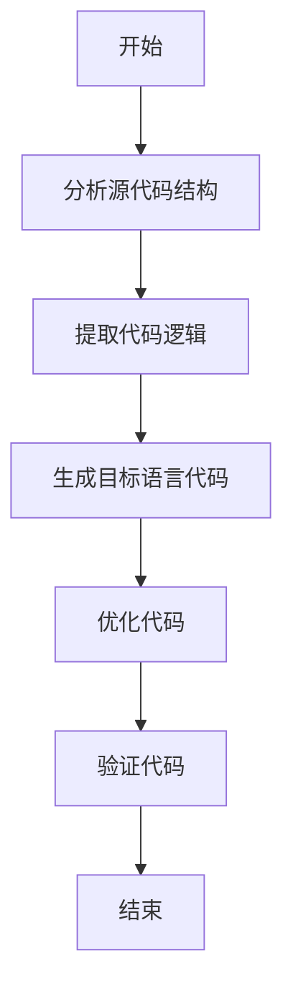
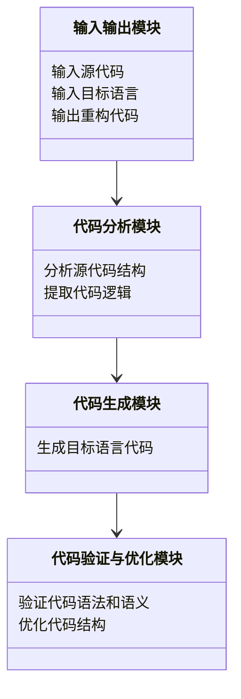
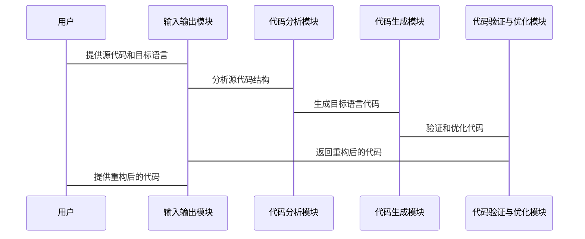

                 


# 开发具有多语言代码重构能力的AI Agent

---

## 关键词
- AI Agent
- 多语言代码重构
- 代码分析
- 重构生成
- 代码优化

---

## 摘要
在软件开发领域，代码重构是一项复杂且耗时的任务，尤其是在涉及多种编程语言时。本文旨在探讨如何开发一种具备多语言代码重构能力的AI Agent，通过结合自然语言处理、代码分析和生成模型，帮助开发者高效完成代码重构任务。本文将从AI Agent的基本概念出发，深入分析多语言代码重构的核心挑战，提出基于深度学习的重构算法，并通过实际案例展示AI Agent在代码重构中的应用价值。最终，本文将总结AI Agent在多语言代码重构中的优势，并展望未来的发展方向。

---

## 第1章: AI Agent与多语言代码重构概述

### 1.1 AI Agent的基本概念
#### 1.1.1 AI Agent的定义与特点
AI Agent（人工智能代理）是指能够感知环境并采取行动以实现目标的智能实体。其核心特点包括：
- **自主性**：能够在没有外部干预的情况下运行。
- **反应性**：能够实时感知环境并做出响应。
- **目标导向**：通过采取行动来实现特定目标。
- **学习能力**：能够通过数据和经验不断优化自身行为。

#### 1.1.2 多语言代码重构的定义与挑战
多语言代码重构是指在不同编程语言之间，将一种语言的代码转换为另一种语言的代码，同时保持功能不变的过程。其主要挑战包括：
- **语法差异**：不同语言的语法结构差异可能导致重构逻辑复杂。
- **语义保持**：确保重构后的代码在语义上与原代码一致。
- **效率问题**：大规模代码重构需要高效算法支持。

#### 1.1.3 AI Agent在代码重构中的作用
AI Agent能够通过以下方式提升代码重构的效率和质量：
- **自动化分析**：利用自然语言处理和代码分析技术，自动理解代码结构。
- **智能生成**：基于深度学习模型，生成目标语言的代码。
- **优化验证**：对生成的代码进行优化和验证，确保正确性。

---

### 1.2 多语言代码重构的核心概念
#### 1.2.1 代码重构的背景与意义
代码重构是软件开发中的重要环节，旨在提高代码的可读性、可维护性和可扩展性。随着多语言开发的普及，代码重构的需求也日益增加。

#### 1.2.2 多语言代码重构的难点与解决方案
多语言代码重构的难点主要体现在：
- **语法差异**：不同语言的语法结构不同，增加了重构的复杂性。
- **语义保持**：需要确保重构后的代码在功能和逻辑上与原代码一致。
- **效率问题**：大规模代码重构需要高效的算法支持。

解决方案包括：
- **语法分析器**：使用语法分析器来解析不同语言的代码结构。
- **语义分析器**：通过语义分析器保持代码重构后的语义一致性。
- **自动化工具**：利用AI Agent实现代码重构的自动化。

#### 1.2.3 AI Agent在多语言重构中的优势
AI Agent在多语言代码重构中的优势体现在：
- **自动化**：能够自动完成代码分析、生成和验证过程。
- **高效性**：通过深度学习模型提高重构效率。
- **智能性**：能够根据上下文理解代码逻辑，生成更优的重构方案。

---

### 1.3 本书的目标与结构
#### 1.3.1 本书的核心目标
本书旨在探讨如何开发一种具备多语言代码重构能力的AI Agent，并通过实际案例展示其应用价值。

#### 1.3.2 本书的章节安排
- **第1章**：AI Agent与多语言代码重构概述。
- **第2章**：多语言代码重构的核心概念。
- **第3章**：AI Agent的算法原理。
- **第4章**：系统架构设计。
- **第5章**：项目实战。
- **第6章**：总结与展望。

#### 1.3.3 本书的读者群体
本书适合以下读者：
- 软件开发人员。
- 人工智能研究人员。
- 对代码重构和AI技术感兴趣的开发者。

---

### 1.4 本章小结
本章主要介绍了AI Agent的基本概念、多语言代码重构的核心挑战以及AI Agent在代码重构中的作用。通过本章的学习，读者可以对AI Agent在多语言代码重构中的应用有一个基本的了解。

---

## 第2章: 多语言代码重构的核心概念

### 2.1 多语言代码重构的定义与分类
#### 2.1.1 代码重构的定义
代码重构是指对现有代码进行结构化修改，使其更符合特定的设计原则或标准，同时保持代码功能不变。

#### 2.1.2 多语言代码重构的分类
多语言代码重构可以分为以下几类：
- **语法重构**：基于语法差异进行代码转换。
- **语义重构**：基于语义相似性进行代码转换。
- **混合重构**：结合语法和语义的混合重构。

#### 2.1.3 不同语言间的重构特点对比
以下表格展示了不同语言间的重构特点对比：

| 语言对  | 语法差异 | 语义差异 | 常见重构需求 |
|---------|----------|----------|--------------|
| Python → Java | 中等 | 较小 | 类型转换、异常处理 |
| JavaScript → TypeScript | 较小 | 较小 | 类型注解添加 |
| C++ → Rust | 较大 | 中等 | 内存安全优化 |

---

### 2.2 AI Agent与代码重构的关系
#### 2.2.1 AI Agent在代码重构中的角色
AI Agent在代码重构中扮演以下角色：
- **代码分析器**：分析原代码的结构和逻辑。
- **代码生成器**：生成目标语言的代码。
- **优化器**：对生成的代码进行优化和验证。

#### 2.2.2 AI Agent的核心能力与代码重构的结合
AI Agent的核心能力包括：
- **自然语言处理**：理解代码的语义和上下文。
- **代码生成**：基于深度学习模型生成代码。
- **优化与验证**：对生成的代码进行优化和验证。

#### 2.2.3 AI Agent如何提升代码重构的效率与质量
通过AI Agent，代码重构的效率和质量可以显著提升：
- **自动化**：减少人工干预，提高重构效率。
- **智能性**：通过深度学习模型生成更优的重构方案。
- **可扩展性**：支持多种编程语言的重构需求。

---

### 2.3 多语言代码重构的挑战与解决方案
#### 2.3.1 多语言环境下的语法差异
不同语言的语法差异可能导致代码重构的复杂性增加。例如，Python的动态类型与Java的静态类型之间的转换需要额外的类型检查和转换逻辑。

#### 2.3.2 不同编程范式之间的转换难点
不同编程范式（如面向对象与函数式编程）之间的转换需要考虑代码结构的重构，这增加了重构的难度。

#### 2.3.3 解决多语言重构挑战的方法与策略
解决多语言重构挑战的方法包括：
- **语法分析器**：使用语法分析器来解析不同语言的代码结构。
- **语义分析器**：通过语义分析器保持代码重构后的语义一致性。
- **自动化工具**：利用AI Agent实现代码重构的自动化。

---

### 2.4 本章小结
本章深入探讨了多语言代码重构的核心概念，包括其定义、分类、挑战及解决方案。通过本章的学习，读者可以更好地理解多语言代码重构的复杂性和AI Agent在其中的作用。

---

## 第3章: AI Agent的算法原理

### 3.1 AI Agent的算法原理概述
AI Agent的算法原理主要包括以下三个部分：
- **代码分析**：分析原代码的结构和逻辑。
- **代码生成**：基于深度学习模型生成目标语言的代码。
- **代码验证与优化**：对生成的代码进行优化和验证。

---

### 3.2 基于深度学习的重构算法
#### 3.2.1 基于上下文理解的重构算法
以下是一个基于上下文理解的重构算法流程图：



#### 3.2.2 深度学习模型的数学模型
以下是一个简单的基于相似度计算的重构模型：

$$ \text{相似度} = \frac{\sum_{i=1}^{n} w_i \cdot s_i}{\sum_{i=1}^{n} w_i} $$

其中，$w_i$ 是第 $i$ 个特征的权重，$s_i$ 是第 $i$ 个特征的相似度。

---

### 3.3 算法实现细节
#### 3.3.1 代码分析模块
代码分析模块需要完成以下任务：
- **语法分析**：使用语法分析器解析源代码的语法结构。
- **语义分析**：通过语义分析器提取代码的逻辑和语义信息。

#### 3.3.2 代码生成模块
代码生成模块基于深度学习模型生成目标语言的代码：
- **编码器-解码器结构**：编码器将源代码编码为向量表示，解码器将向量解码为目标语言代码。
- **模型训练**：使用大量代码对进行模型训练，提高代码生成的准确率。

#### 3.3.3 代码验证与优化模块
代码验证与优化模块需要完成以下任务：
- **代码验证**：对生成的代码进行语法和语义验证。
- **代码优化**：对生成的代码进行优化，提高代码的可读性和可维护性。

---

### 3.4 本章小结
本章详细介绍了AI Agent的算法原理，包括代码分析、代码生成和代码验证与优化的实现细节。通过本章的学习，读者可以了解AI Agent如何通过深度学习算法实现多语言代码重构。

---

## 第4章: 系统架构设计

### 4.1 系统架构设计概述
AI Agent的系统架构设计主要包括以下模块：
- **输入输出模块**：接收用户输入的源代码和目标语言，输出重构后的代码。
- **代码分析模块**：分析源代码的结构和逻辑。
- **代码生成模块**：基于深度学习模型生成目标语言的代码。
- **代码验证与优化模块**：对生成的代码进行验证和优化。

---

### 4.2 系统功能设计
#### 4.2.1 系统功能模块
以下是一个系统的功能模块类图：



---

### 4.3 系统接口设计
#### 4.3.1 系统接口
系统主要接口包括：
- `analyze_code(source_code)`：分析源代码的结构和逻辑。
- `generate_code(target_language)`：生成目标语言的代码。
- `validate_code(generated_code)`：验证生成代码的语法和语义。

#### 4.3.2 系统交互流程
以下是一个系统的交互流程图：



---

### 4.4 本章小结
本章详细介绍了AI Agent的系统架构设计，包括功能模块、接口设计和交互流程。通过本章的学习，读者可以了解AI Agent如何通过系统架构实现多语言代码重构。

---

## 第5章: 项目实战

### 5.1 环境配置
#### 5.1.1 开发工具安装
- **Python**：安装Python 3.8及以上版本。
- **深度学习框架**：安装TensorFlow或PyTorch。
- **语法分析器**：安装用于代码分析的工具，如lib2to3（Python）或ANTLR（Java）。

#### 5.1.2 代码实现
以下是一个简单的代码生成器示例：

```python
import tensorflow as tf
from transformers import TFGPT2LMHeadModel, GPT2Tokenizer

# 初始化模型
model_name = 'gpt2-medium'
tokenizer = GPT2Tokenizer.from_pretrained(model_name)
model = TFGPT2LMHeadModel.from_pretrained(model_name)

# 定义重构函数
def code_rewriter(source_code, target_language):
    # 分析源代码结构
    # 生成目标语言代码
    input_ids = tokenizer.encode(source_code, return_tensors='tf')
    outputs = model.generate(input_ids, max_length=100)
    generated_code = tokenizer.decode(outputs[0].numpy())
    return generated_code

# 示例代码重构
source_code = 'def add(a, b): return a + b'
target_language = 'JavaScript'

result = code_rewriter(source_code, target_language)
print(result)
```

---

### 5.2 代码实现与解读
#### 5.2.1 代码分析模块
代码分析模块需要解析源代码的语法结构，提取代码逻辑。

#### 5.2.2 代码生成模块
代码生成模块基于深度学习模型生成目标语言的代码。

#### 5.2.3 代码验证与优化模块
代码验证与优化模块对生成的代码进行语法和语义验证，并优化代码结构。

---

### 5.3 案例分析与结果展示
以下是一个Python代码重构为JavaScript的案例：

**输入代码**：
```python
def add(a, b):
    return a + b
```

**重构后的代码**：
```javascript
function add(a, b) {
    return a + b;
}
```

---

### 5.4 本章小结
本章通过实际案例展示了AI Agent在多语言代码重构中的应用。通过本章的学习，读者可以了解如何通过代码实现和实际案例应用AI Agent进行代码重构。

---

## 第6章: 总结与展望

### 6.1 总结
本文详细探讨了AI Agent在多语言代码重构中的应用，包括AI Agent的基本概念、多语言代码重构的核心挑战、算法原理、系统架构设计和项目实战。通过本文的学习，读者可以了解AI Agent如何通过深度学习算法实现多语言代码重构。

---

### 6.2 未来展望
未来，AI Agent在多语言代码重构中的应用将更加广泛。以下是一些未来的发展方向：
- **支持更多编程语言**：扩展对更多编程语言的支持。
- **提高重构效率**：通过优化算法提高重构效率。
- **增强语义理解**：进一步提升AI Agent对代码语义的理解能力。

---

## 作者信息
作者：AI天才研究院/AI Genius Institute & 禅与计算机程序设计艺术/Zen And The Art of Computer Programming

