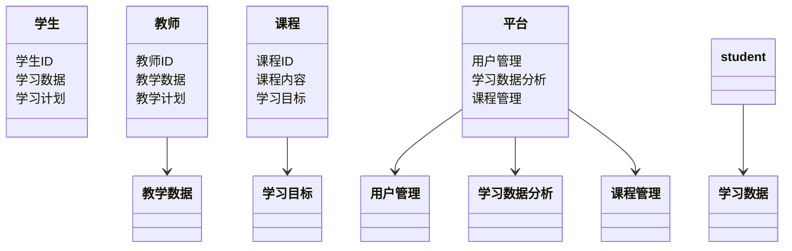
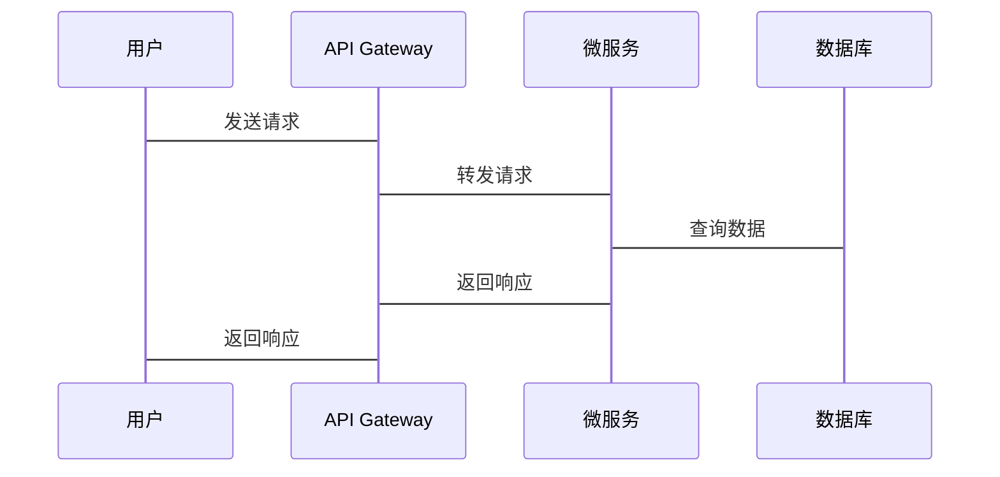

                 

# 教育科技（EdTech）的发展前景与投资价值

---

## 关键词：教育科技, EdTech, 人工智能, 投资价值, 教育技术, 大数据, 教育创新

---

## 摘要：  
教育科技（EdTech）正以惊人的速度改变着全球教育行业。随着人工智能、大数据、虚拟现实等技术的快速发展，教育科技不仅提高了教学效率，还为个性化学习、教育资源优化配置和教育模式创新提供了新的可能。本文将从技术驱动、商业模式、投资价值、未来趋势等多个维度深入分析教育科技的发展前景，为投资者和教育从业者提供有价值的见解和建议。

---

# 第1章: 教育科技（EdTech）概述

## 1.1 教育科技的定义与核心概念

### 1.1.1 教育科技的定义  
教育科技（EdTech）是指将技术应用于教育领域的实践，旨在通过创新工具和方法优化教学过程、提升学习效果和教育资源的利用效率。

### 1.1.2 教育科技的核心概念  
教育科技的核心概念包括：  
1. **个性化学习**：通过技术手段分析学生的学习行为和能力，提供定制化的学习方案。  
2. **智能化教学**：利用人工智能技术实现自动化的教学辅助和反馈。  
3. **教育资源共享**：通过互联网技术打破地域限制，实现教育资源的广泛传播。  
4. **数据驱动决策**：通过大数据分析优化教学策略和学习路径。

### 1.1.3 教育科技的边界与外延  
教育科技的边界在于技术与教育的结合，其外延则涵盖从K12教育到职业教育、终身学习等多个领域。

### 1.1.4 教育科技的核心要素组成  
教育科技的核心要素包括：  
- **技术基础**：人工智能、大数据、区块链、虚拟现实等技术。  
- **教育场景**：学校、在线教育平台、企业培训等。  
- **用户群体**：学生、教师、教育机构、企业等。  

---

## 1.2 教育科技的发展背景

### 1.2.1 教育科技的起源与发展  
教育科技的起源可以追溯到20世纪60年代，随着计算机技术的发展，教育科技逐步从简单的电子教学设备向智能化、网络化的方向演进。

### 1.2.2 数字化教育的兴起  
互联网的普及推动了数字化教育的兴起，MOOC（大规模开放在线课程）平台的崛起标志着教育科技进入了新的发展阶段。

### 1.2.3 人工智能与大数据在教育中的应用  
近年来，人工智能和大数据技术的快速发展为教育科技注入了新的活力，使得个性化学习和智能化教学成为可能。

---

## 1.3 教育科技的现状与挑战

### 1.3.1 当前教育科技的主要应用领域  
- **K12教育**：通过在线学习平台和智能教学工具优化中小学教育。  
- **高等教育**：利用大数据分析和人工智能技术提升教学质量和研究效率。  
- **职业教育**：通过虚拟现实技术提供沉浸式职业培训。  

### 1.3.2 教育科技面临的挑战  
- **技术瓶颈**：人工智能和大数据技术的应用仍需突破性能和成本限制。  
- **政策法规**：数据隐私和教育公平等问题需要政策层面的规范。  
- **用户接受度**：部分教师和学生对新技术的接受度较低。  

---

## 1.4 教育科技的投资价值

### 1.4.1 教育科技的市场潜力  
- 全球教育科技市场规模持续增长，预计未来几年年复合增长率将超过10%。  
- 个性化学习和在线教育的需求推动了市场的快速扩张。  

### 1.4.2 投资者关注的热点领域  
- **人工智能教育**：AI驱动的智能教学系统和个性化学习平台。  
- **在线教育平台**：K12教育、职业教育等领域的在线学习平台。  
- **教育硬件**：智能学习设备和虚拟现实教学设备。  

### 1.4.3 教育科技企业的估值方法  
- **用户数量**：活跃用户数是衡量在线教育平台价值的重要指标。  
- **收入能力**：订阅收入、广告收入等是估值的重要依据。  
- **技术壁垒**：企业的技术优势和专利储备是估值的关键因素。  

---

## 1.5 本章小结  
教育科技的快速发展为投资者和教育行业带来了巨大的机遇。通过技术驱动和商业模式创新，教育科技正在改变传统的教育方式，为个性化学习和教育资源优化配置提供了新的可能。

---

# 第2章: 教育科技的核心技术与应用

## 2.1 人工智能在教育中的应用

### 2.1.1 AI驱动的智能教学系统  
人工智能技术可以实现对学生学习行为的实时监测和分析，从而提供个性化的学习建议。  

### 2.1.2 自然语言处理在教育中的应用  
自然语言处理技术可以用于智能辅导系统，帮助学生解决学习中的语言理解问题。  

### 2.1.3 机器学习在学生行为分析中的应用  
机器学习算法可以通过分析学生的学习数据，预测其学习效果并提供针对性的改进方案。  

---

## 2.2 大数据在教育中的应用

### 2.2.1 数据驱动的教育决策  
通过大数据分析，教育机构可以优化课程设置和教学策略。  

### 2.2.2 学生学习效果的精准分析  
大数据技术可以对学生的学习数据进行深度挖掘，发现潜在的学习问题并提出解决方案。  

### 2.2.3 教育资源的优化配置  
大数据分析可以帮助教育机构更高效地分配教育资源，确保每个学生都能获得公平的教育机会。  

---

## 2.3 区块链在教育科技中的应用

### 2.3.1 区块链技术的基本原理  
区块链是一种去中心化的分布式账本技术，具有数据不可篡改和透明可信的特点。  

### 2.3.2 区块链在学历认证中的应用  
区块链技术可以用于构建去中心化的学历认证系统，确保学历信息的真实性和不可篡改性。  

### 2.3.3 区块链在教育资源分配中的潜力  
区块链技术可以用于教育资源的智能分配，确保资源的公平性和透明性。  

---

## 2.4 虚拟现实与增强现实技术在教育中的应用

### 2.4.1 VR/AR技术的基本原理  
虚拟现实（VR）和增强现实（AR）技术通过模拟真实环境或叠加虚拟信息，为用户提供沉浸式的学习体验。  

### 2.4.2 VR在教育中的应用  
VR技术可以用于模拟实验、虚拟课堂和沉浸式学习场景，为学生提供身临其境的学习体验。  

### 2.4.3 AR在教育中的应用  
AR技术可以将虚拟内容叠加到现实环境中，帮助学生更直观地理解和掌握知识。  

---

## 2.5 教育科技的技术架构分析

### 2.5.1 系统功能设计（领域模型类图）  

### 2.5.2 系统架构设计  

### 2.5.3 系统接口设计  
- **API接口**：RESTful API，支持GET、POST、PUT、DELETE等操作。  
- **数据接口**：与数据库交互，支持MySQL、MongoDB等数据库。  

### 2.5.4 系统交互流程图  

---

## 2.6 本章小结  
教育科技的核心技术包括人工智能、大数据、区块链和虚拟现实等，这些技术的应用为教育行业带来了巨大的变革。通过技术驱动，教育科技正在推动个性化学习和教育资源优化配置的发展。

---

# 第3章: 教育科技的商业模式与投资价值

## 3.1 教育科技的商业模式

### 3.1.1 B2C模式：面向消费者的在线教育平台  
- 代表企业：Coursera、Udemy、VIPKid。  
- 收入来源：课程订阅费、会员服务费。  

### 3.1.2 B2B模式：面向教育机构的技术服务  
- 代表企业：Edmodo、Schoology。  
- 收入来源：软件订阅费、技术服务费。  

### 3.1.3 B2B2C模式：教育机构与技术平台的结合  
- 代表企业：新东方在线、好未来。  
- 收入来源：课程销售、技术服务费。  

---

## 3.2 教育科技的投资价值

### 3.2.1 教育科技企业的估值方法  
- **用户数量**：活跃用户数是衡量在线教育平台价值的重要指标。  
- **收入能力**：订阅收入、广告收入等是估值的重要依据。  
- **技术壁垒**：企业的技术优势和专利储备是估值的关键因素。  

### 3.2.2 教育科技领域的投资机会  
- **人工智能教育**：AI驱动的智能教学系统和个性化学习平台。  
- **在线教育平台**：K12教育、职业教育等领域的在线学习平台。  
- **教育硬件**：智能学习设备和虚拟现实教学设备。  

---

## 3.3 教育科技的风险与挑战

### 3.3.1 技术风险  
- 人工智能和大数据技术的应用仍需突破性能和成本限制。  

### 3.3.2 政策风险  
- 数据隐私和教育公平等问题需要政策层面的规范。  

### 3.3.3 市场风险  
- 教育科技市场竞争激烈，企业需要不断创新以保持竞争优势。  

---

## 3.4 本章小结  
教育科技的商业模式多样，投资价值显著。通过技术驱动和商业模式创新，教育科技正在改变传统的教育方式，为个性化学习和教育资源优化配置提供了新的可能。

---

# 第4章: 教育科技的投资策略与风险管理

## 4.1 教育科技领域的投资策略

### 4.1.1 选择投资标的  
- 优先考虑具有技术壁垒和市场潜力的教育科技企业。  
- 关注企业的团队背景和商业模式的可行性。  

### 4.1.2 投资周期与退出机制  
- 教育科技领域的投资周期较长，需关注企业的长期发展。  
- 退出机制包括并购退出、IPO退出等。  

---

## 4.2 教育科技的风险管理

### 4.2.1 技术风险  
- 关注企业的技术优势和创新能力，避免投资于技术落后的企业。  

### 4.2.2 市场风险  
- 选择市场需求明确、竞争格局稳定的细分领域进行投资。  

### 4.2.3 政策风险  
- 关注政策法规的变化，避免因政策调整导致的投资损失。  

---

## 4.3 本章小结  
教育科技领域的投资需要综合考虑技术、市场和政策等多方面因素。通过科学的投资策略和风险管理，投资者可以更好地把握教育科技的发展机遇，实现投资收益的最大化。

---

# 第5章: 教育科技的未来发展趋势

## 5.1 人工智能与教育的深度融合

### 5.1.1 AI驱动的教育创新  
人工智能技术将进一步推动教育的个性化和智能化发展。  

### 5.1.2 自动化教学工具的普及  
AI技术将被广泛应用于教学工具的设计和优化，提升教学效率。  

---

## 5.2 大数据与教育的结合

### 5.2.1 数据驱动的教育决策  
大数据技术将为教育机构提供更精准的决策支持。  

### 5.2.2 数据隐私与安全的挑战  
随着数据的广泛应用，数据隐私和安全问题将更加突出，需要技术手段和政策法规的共同解决。  

---

## 5.3 区块链与教育科技的结合

### 5.3.1 区块链技术在教育认证中的应用  
区块链技术将被广泛应用于学历认证和证书管理领域。  

### 5.3.2 区块链在教育资源分配中的潜力  
区块链技术将为教育资源的公平分配提供新的解决方案。  

---

## 5.4 虚拟现实与增强现实技术的广泛应用

### 5.4.1 VR/AR技术在教育中的应用前景  
虚拟现实和增强现实技术将为教育行业带来更多的创新和可能性。  

### 5.4.2 教育场景的沉浸式体验  
通过VR/AR技术，学生可以实现沉浸式的学习体验，提升学习效果。  

---

## 5.5 教育科技的全球化发展

### 5.5.1 全球教育科技市场的增长  
随着全球教育需求的增长，教育科技市场将保持快速扩张。  

### 5.5.2 跨国合作与技术共享  
教育科技企业将加强跨国合作，实现技术共享和市场拓展。  

---

## 5.6 本章小结  
教育科技的未来发展趋势将围绕人工智能、大数据、区块链和虚拟现实等技术展开。通过技术创新和全球化发展，教育科技将为教育行业带来更多的变革和机遇。

---

# 第6章: 教育科技的案例分析

## 6.1 知识共享平台的案例分析

### 6.1.1 平台简介  
知识共享平台通过在线课程和学习工具为用户提供个性化学习服务。  

### 6.1.2 平台的技术架构  
- **前端**：React框架实现用户界面。  
- **后端**：Node.js实现API接口。  
- **数据库**：MongoDB存储用户数据和课程信息。  

### 6.1.3 平台的核心功能  
- **课程管理**：支持课程的上传、编辑和删除。  
- **学习记录**：记录学生的学习进度和成绩。  
- **智能推荐**：基于学习数据推荐个性化课程。  

### 6.1.4 平台的成功经验  
- **技术优势**：采用微服务架构，系统扩展性强。  
- **用户需求**：精准满足用户的个性化学习需求。  

---

## 6.2 智能教学系统的案例分析

### 6.2.1 系统简介  
智能教学系统通过人工智能技术实现个性化学习和教学辅助。  

### 6.2.2 系统的核心功能  
- **学习分析**：分析学生的学习数据，提供个性化学习建议。  
- **教学辅助**：为教师提供教学工具和数据分析支持。  
- **智能推荐**：基于学习数据推荐学习资源。  

### 6.2.3 系统的技术实现  
- **前端**：使用Vue.js实现用户界面。  
- **后端**：使用Python的Django框架实现API接口。  
- **算法**：采用机器学习算法实现学习效果预测。  

---

## 6.3 本章小结  
通过具体案例分析，我们可以看到教育科技在实际应用中的巨大潜力。通过技术创新和用户需求的精准满足，教育科技正在改变传统的教育方式，为教育行业带来新的发展机遇。

---

# 第7章: 教育科技的最佳实践与总结

## 7.1 最佳实践

### 7.1.1 技术选型  
- 选择适合的前端框架和后端技术，确保系统的可扩展性和性能。  
- 采用分布式架构，提高系统的可用性和稳定性。  

### 7.1.2 数据管理  
- 建立完善的数据管理系统，确保数据的安全性和可靠性。  
- 采用大数据技术，提高数据的利用效率。  

### 7.1.3 用户体验优化  
- 关注用户需求，优化用户界面设计。  
- 提供个性化的学习体验，提升用户满意度。  

---

## 7.2 总结

教育科技的发展前景广阔，投资价值显著。通过技术创新和商业模式的不断优化，教育科技正在推动教育行业的深刻变革。对于投资者和教育从业者来说，把握教育科技的发展趋势和投资机会至关重要。

---

## 7.3 拓展阅读

- **推荐书籍**：《教育科技：创新与未来》、《人工智能与教育的结合》  
- **推荐网站**：Coursera、Udemy、Khan Academy  
- **推荐工具**：TensorFlow、PyTorch、React  

---

## 作者：AI天才研究院/AI Genius Institute & 禅与计算机程序设计艺术/Zen And The Art of Computer Programming

---

**感谢您的阅读！希望本文能为教育科技领域的投资者和从业者提供有价值的见解和启发。**

