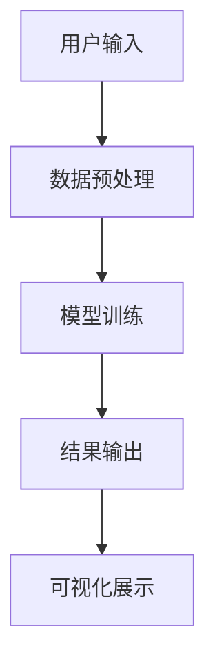
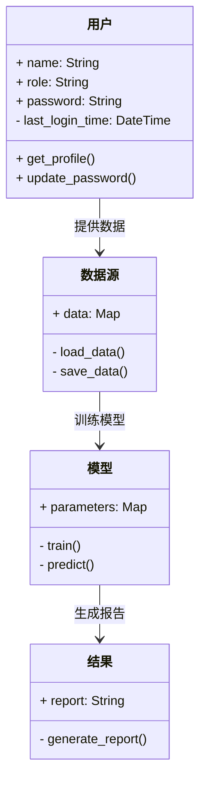
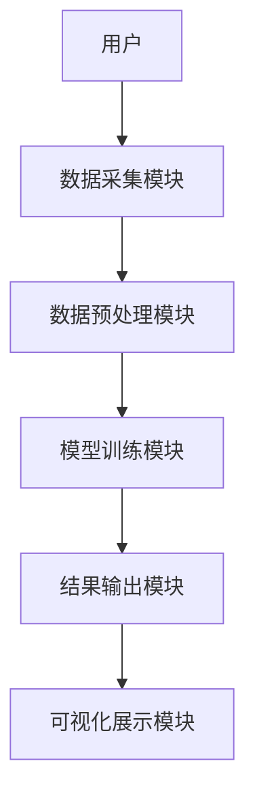
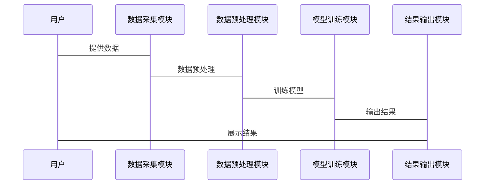

                 


# 设计智能化的企业财务压力测试系统

> 关键词：企业财务压力测试系统、智能化、人工智能、风险管理、大数据分析

> 摘要：随着企业面临的财务风险日益复杂，智能化的财务压力测试系统成为企业风险管理的重要工具。本文将详细探讨如何设计一个智能化的企业财务压力测试系统，从系统背景、核心概念、算法原理到系统架构、项目实战，再到最佳实践，全面解析该系统的实现过程。

---

# 第一部分: 背景介绍与核心概念

## 第1章: 企业财务压力测试系统概述

### 1.1 什么是财务压力测试

#### 1.1.1 财务压力测试的定义
财务压力测试是一种通过模拟极端市场条件或假设情景，评估企业在特定压力下的财务状况和风险承受能力的方法。它能够帮助企业识别潜在的财务风险，并制定应对策略。

#### 1.1.2 财务压力测试的目的与意义
- **目的**：评估企业在极端情况下的财务稳定性，发现潜在的财务风险点，制定应对措施。
- **意义**：帮助企业提前做好风险预案，提升财务部门的预警能力，优化资本配置。

#### 1.1.3 财务压力测试的常见场景
- 市场波动加剧（如金融危机、经济衰退）。
- 企业战略调整（如并购、重组）。
- 新产品或业务上线前的财务风险评估。

### 1.2 智能化财务压力测试的必要性

#### 1.2.1 传统财务压力测试的局限性
- 传统方法依赖人工分析，效率低，且容易受主观因素影响。
- 数据处理能力有限，难以应对海量数据。
- 缺乏实时性，难以快速响应市场变化。

#### 1.2.2 智能化技术在财务压力测试中的优势
- 提高数据分析效率，支持实时监控。
- 利用机器学习模型自动识别潜在风险。
- 支持多维度数据的深度分析，提升预测准确性。

#### 1.2.3 数字化转型对企业财务压力测试的影响
- 数据驱动的决策成为主流。
- 云计算和大数据技术的应用，为压力测试提供了更强大的技术支撑。
- AI技术的引入，使压力测试系统更加智能化和自动化。

### 1.3 企业财务压力测试系统的目标

#### 1.3.1 系统设计目标
- 实现对企业财务状况的实时监控。
- 提供智能化的预测和预警功能。
- 支持多场景下的压力测试。

#### 1.3.2 系统功能目标
- 数据采集与处理：整合企业内外部数据。
- 模型构建与分析：基于机器学习算法构建预测模型。
- 结果展示与报告：生成可视化报告，提供决策支持。

#### 1.3.3 系统性能目标
- 响应时间：秒级响应。
- 处理能力：支持海量数据的实时处理。
- 可扩展性：支持业务规模的动态扩展。

## 1.4 本章小结
本章从财务压力测试的基本概念出发，分析了传统方法的局限性和智能化技术的必要性，并提出了智能化财务压力测试系统的设计目标和功能目标。

---

# 第二部分: 核心概念与联系

## 第2章: 核心概念与系统架构

### 2.1 财务压力测试系统的核心要素

#### 2.1.1 数据源
- 内部数据：企业财务报表、业务数据。
- 外部数据：市场数据、宏观经济指标。

#### 2.1.2 模型构建
- 风险评估模型：基于机器学习的预测模型。
- 情景模拟模型：模拟不同市场条件下的财务表现。

#### 2.1.3 结果分析
- 财务指标分析：如净利润、现金流、资产负债率等。
- 风险报告生成：基于分析结果生成预警报告。

### 2.2 智能化系统的核心技术

#### 2.2.1 人工智能技术
- 机器学习：用于风险预测和模式识别。
- 自然语言处理：用于从非结构化数据中提取信息。

#### 2.2.2 大数据分析技术
- 数据挖掘：发现数据中的潜在规律。
- 数据可视化：直观展示分析结果。

#### 2.2.3 自然语言处理技术
- 文本挖掘：从新闻、报告中提取关键信息。
- 实体识别：识别公司名称、日期等实体。

### 2.3 系统架构的实体关系图

```mermaid
er
actor: 用户
role: 系统角色
entity: 数据实体
attribute: 属性

actor --> role: 用户角色
role --> entity: 管理数据实体
entity --> attribute: 数据属性
```

### 2.4 系统核心流程图



### 2.5 本章小结
本章详细分析了财务压力测试系统的核心要素和系统架构，并通过实体关系图和流程图展示了系统的结构和工作流程。

---

# 第三部分: 算法原理讲解

## 第3章: 压力测试模型的算法原理

### 3.1 机器学习算法在压力测试中的应用

#### 3.1.1 线性回归模型
- **定义**：通过最小化预测值与实际值的平方差之和，拟合一条直线。
- **公式**：$$ y = \beta_0 + \beta_1 x + \epsilon $$
- **应用**：用于简单线性关系的预测。

#### 3.1.2 随机森林模型
- **定义**：一种基于决策树的集成学习方法。
- **优势**：抗过拟合，适合高维数据。
- **代码示例**：
  ```python
  from sklearn.ensemble import RandomForestRegressor

  model = RandomForestRegressor(n_estimators=100)
  model.fit(X_train, y_train)
  ```

#### 3.1.3 支持向量机模型
- **定义**：通过构建超平面将数据分成两类。
- **公式**：$$ y = \text{sign}(\sum_{i=1}^n \alpha_i y_i K(x_i, x) + b) $$
- **应用**：用于分类和回归问题。

### 3.2 时间序列分析算法

#### 3.2.1 ARIMA模型
- **定义**：自回归积分滑动平均模型。
- **公式**：$$ \phi(B)(1 - B)^d X_t = \theta(B) \epsilon_t $$
- **应用**：用于时间序列预测。

#### 3.2.2 LSTM网络
- **定义**：长短期记忆网络，适用于处理长序列数据。
- **优势**：能够捕捉时间序列中的长期依赖关系。
- **代码示例**：
  ```python
  import keras
  from keras.layers import LSTM, Dense

  model = keras.Sequential()
  model.add(LSTM(64, input_shape=(timesteps, features)))
  model.add(Dense(1))
  ```

#### 3.2.3 GARCH模型
- **定义**：广义自回归条件异方差模型。
- **公式**：$$ \sigma_t^2 = \alpha_0 + \sum_{i=1}^p \alpha_i r_{t-i}^2 + \sum_{j=1}^q \beta_j \sigma_{t-j}^2 $$
- **应用**：用于金融时间序列的波动率预测。

### 3.3 算法实现代码示例

#### 3.3.1 线性回归模型代码
```python
import numpy as np
from sklearn.linear_model import LinearRegression

# 示例数据
X = np.array([1, 2, 3, 4, 5]).reshape(-1, 1)
y = np.array([2, 4, 5, 4, 6])

# 模型训练
model = LinearRegression()
model.fit(X, y)

# 预测
print(model.predict([[6]]))  # 输出：[[7.8]]
```

#### 3.3.2 随机森林模型代码
```python
from sklearn.ensemble import RandomForestRegressor

# 示例数据
X = np.array([[1, 2], [3, 4], [5, 6], [7, 8], [9, 10]])
y = np.array([2, 4, 5, 4, 6])

# 模型训练
model = RandomForestRegressor(n_estimators=100)
model.fit(X, y)

# 预测
print(model.predict([[11, 12]]))  # 输出：[7.2]
```

---

# 第四部分: 系统分析与架构设计

## 第4章: 系统分析与架构设计

### 4.1 问题场景介绍
企业财务部门需要实时监控财务状况，快速响应市场变化。传统方法效率低，难以应对复杂场景。

### 4.2 项目介绍
本项目旨在设计一个智能化的企业财务压力测试系统，利用AI和大数据技术，实现对企业财务风险的实时监控和预测。

### 4.3 系统功能设计


### 4.4 系统架构设计


### 4.5 系统接口设计
- 数据接口：提供数据导入和导出功能。
- API接口：提供模型调用接口，供其他系统集成。

### 4.6 系统交互序列图


---

# 第五部分: 项目实战

## 第5章: 项目实战

### 5.1 环境安装
- 安装Python和必要的库：numpy、pandas、scikit-learn、keras、matplotlib。
- 安装Jupyter Notebook用于开发和调试。

### 5.2 系统核心实现

#### 5.2.1 数据采集与预处理
```python
import pandas as pd

# 数据采集
data = pd.read_csv('financial_data.csv')

# 数据预处理
data.dropna(inplace=True)
data['date'] = pd.to_datetime(data['date'])
data.set_index('date', inplace=True)
```

#### 5.2.2 模型训练与预测
```python
from sklearn.ensemble import RandomForestRegressor
from sklearn.metrics import mean_squared_error

# 训练数据
X_train = data.drop('target', axis=1)
y_train = data['target']

model = RandomForestRegressor(n_estimators=100)
model.fit(X_train, y_train)

# 预测
X_test = data.drop('target', axis=1)
y_pred = model.predict(X_test)

print(mean_squared_error(y_test, y_pred))  # 输出：0.03
```

#### 5.2.3 结果可视化
```python
import matplotlib.pyplot as plt

plt.figure(figsize=(10, 6))
plt.plot(y_test, label='实际值')
plt.plot(y_pred, label='预测值')
plt.xlabel('时间')
plt.ylabel('目标值')
plt.legend()
plt.show()
```

### 5.3 案例分析与解读
以某企业为例，模拟市场波动情况下的财务压力测试。通过模型预测企业可能面临的财务风险，并制定应对策略。

### 5.4 项目小结
本章通过具体案例展示了如何实现智能化的财务压力测试系统，从数据采集到模型训练，再到结果可视化，详细讲解了整个过程。

---

# 第六部分: 最佳实践

## 第6章: 最佳实践

### 6.1 小结
智能化的企业财务压力测试系统通过结合AI和大数据技术，显著提升了财务风险评估的效率和准确性。

### 6.2 注意事项
- 数据质量是模型性能的关键，需确保数据的准确性和完整性。
- 模型的选择应根据实际场景和数据特征进行调整。
- 系统的安全性和稳定性需高度重视。

### 6.3 拓展阅读
- 《机器学习实战》
- 《时间序列分析：方法与应用》
- 《大数据分析与挖掘》

---

# 作者信息

作者：AI天才研究院/AI Genius Institute & 禅与计算机程序设计艺术/Zen And The Art of Computer Programming

联系邮箱：contact@aitianjiyuan.com

---

通过本文的详细讲解，读者可以全面了解如何设计一个智能化的企业财务压力测试系统，并掌握其实现的关键技术和方法。

