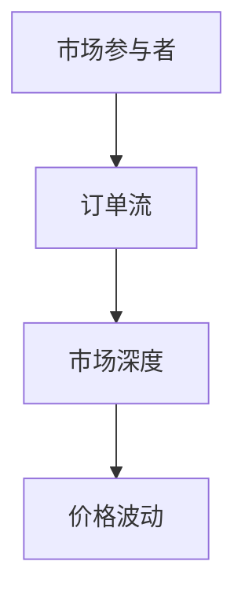
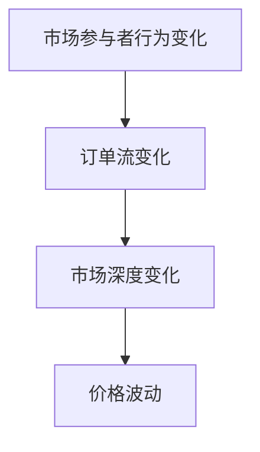
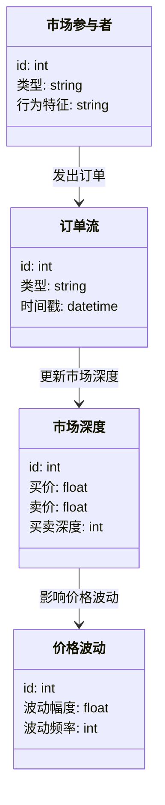
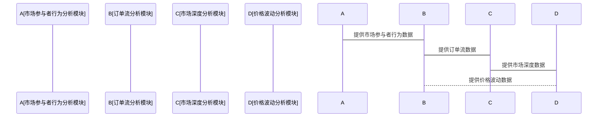

                 


# 金融市场微观结构变化对价格影响分析

> 关键词：金融市场，微观结构，价格影响，订单流，市场深度，参与者行为

> 摘要：本文详细探讨了金融市场微观结构变化对价格波动的影响，从市场参与者的类型、行为特征到订单流、市场深度的变化，系统分析了微观结构变化对价格波动的传导机制。文章通过理论分析、算法实现和实际案例，深入剖析了金融市场微观结构变化对价格波动的具体影响，为投资者和研究者提供了有价值的参考。

---

# 第一部分: 金融市场微观结构变化对价格影响分析基础

# 第1章: 金融市场微观结构概述

## 1.1 金融市场微观结构的核心概念

### 1.1.1 问题背景与问题描述

金融市场是经济体系的核心组成部分，其运行机制复杂且高度动态化。在金融市场中，价格的形成和波动不仅受到宏观经济因素的影响，还与市场微观结构的变化密切相关。微观结构的变化，如订单流的波动、市场深度的变化、参与者行为的调整等，都会对市场价格产生显著影响。本文旨在通过分析这些微观结构的变化，揭示其对价格波动的具体影响机制。

### 1.1.2 问题解决思路与方法

为了分析金融市场微观结构变化对价格的影响，我们需要从以下几个方面入手：

1. **市场参与者的类型与行为特征**：不同类型的参与者（如机构投资者、散户、高频交易者）具有不同的交易策略和行为特征，这些行为直接影响订单流和市场价格。
2. **订单流与市场深度分析**：订单流的变化反映了市场的供需动态，而市场深度则体现了市场的流动性和稳定性。
3. **价格发现机制**：价格的形成是市场参与者博弈的结果，订单簿的分析能够揭示价格波动的微观机制。
4. **微观结构变化对价格波动的传导路径**：通过分析市场参与者行为、订单流变化和市场深度变化，揭示这些因素如何影响价格波动。

### 1.1.3 微观结构的边界与外延

金融市场微观结构的研究范围主要包括以下几个方面：

1. **市场参与者**：包括机构投资者、散户、高频交易者等。
2. **订单流**：包括订单的类型（如限价单、市价单）、订单簿的变化等。
3. **市场深度**：包括买卖价差、买卖深度等。
4. **价格发现机制**：包括 auctions、报价驱动机制等。

微观结构的变化可能受到宏观经济因素、政策变化、市场情绪等多种因素的影响，因此，微观结构分析需要结合宏观环境和市场具体条件。

### 1.1.4 核心要素与概念结构

金融市场微观结构的核心要素包括：

1. **市场参与者**：不同类型参与者的行为特征和交易策略。
2. **订单流**：订单的生成、提交和取消过程。
3. **市场深度**：买卖价差、买卖深度等指标。
4. **价格发现机制**：价格的形成过程和订单簿的动态变化。

这些核心要素相互关联，共同构成了金融市场微观结构的动态变化。

## 1.2 金融市场微观结构的关键属性

### 1.2.1 市场参与者的类型与行为特征

市场参与者的行为特征是微观结构分析的重要内容。不同类型的参与者具有不同的交易策略和行为模式，这些行为直接影响订单流和市场价格。

#### 1.2.1.1 机构投资者

机构投资者通常具有较长的投资期限，交易策略基于基本面分析。他们的交易行为通常具有较大的规模和较长的时间跨度，对市场价格具有较大的影响力。

#### 1.2.1.2 散户

散户通常具有较短的投资期限，交易行为受到市场情绪的影响较大。他们的交易行为往往具有较高的波动性，对市场价格的短期波动有显著影响。

#### 1.2.1.3 高频交易者

高频交易者通过算法交易，利用市场微观结构的短期波动获利。他们的交易行为具有高频、低延迟的特点，对订单流和市场价格的短期波动有显著影响。

### 1.2.2 市场深度与流动性分析

市场深度是指在某一价格水平上可以交易的数量。市场深度越大，市场的流动性越好，价格的稳定性越高。市场深度的变化反映了市场参与者的交易行为变化，也影响着市场价格的波动。

#### 1.2.2.1 买卖价差

买卖价差是指当前最优买价和最优卖价之间的差值。买卖价差的变化反映了市场流动性的好坏和市场参与者的交易策略。

#### 1.2.2.2 买卖深度

买卖深度是指在最优价格水平上可以交易的数量。买卖深度的变化反映了市场的供需变化，也影响着市场价格的波动。

### 1.2.3 价格发现机制与订单簿分析

价格发现机制是市场价格形成的核心过程。订单簿的分析能够揭示价格波动的微观机制。订单簿的变化反映了市场参与者的交易行为和市场供需的变化。

#### 1.2.3.1 订单簿的构成

订单簿由买方订单和卖方订单组成，买方订单包括限价单和市价单，卖方订单也包括限价单和市价单。订单簿的变化反映了市场的供需变化。

#### 1.2.3.2 订单流的分析

订单流的分析包括订单的生成、提交和取消过程。订单流的变化反映了市场参与者的交易行为和市场供需的变化。

### 1.2.4 微观结构变化对价格波动的影响

微观结构的变化，如订单流的波动、市场深度的变化、参与者行为的调整等，都会对市场价格产生显著影响。通过分析这些微观结构的变化，可以揭示价格波动的微观机制。

## 1.3 金融市场微观结构的影响机制

### 1.3.1 市场参与者行为对价格的影响

市场参与者的交易行为直接影响订单流和市场价格。不同类型参与者的行为特征不同，对价格的影响也不同。

#### 1.3.1.1 机构投资者的行为

机构投资者通常具有较长的投资期限，交易策略基于基本面分析。他们的交易行为具有较大的规模和较长的时间跨度，对市场价格具有较大的影响力。

#### 1.3.1.2 散户的行为

散户通常具有较短的投资期限，交易行为受到市场情绪的影响较大。他们的交易行为往往具有较高的波动性，对市场价格的短期波动有显著影响。

#### 1.3.1.3 高频交易者的行为

高频交易者通过算法交易，利用市场微观结构的短期波动获利。他们的交易行为具有高频、低延迟的特点，对订单流和市场价格的短期波动有显著影响。

### 1.3.2 市场深度与订单流的相互作用

市场深度和订单流的变化是相互关联的。市场深度的变化反映了市场供需的变化，而订单流的变化则反映了市场参与者的交易行为变化。两者的变化共同影响着市场价格的波动。

#### 1.3.2.1 市场深度的变化对订单流的影响

市场深度的变化反映了市场的流动性变化，影响着订单流的变化。市场深度越大，市场的流动性越好，订单流的波动性越小。

#### 1.3.2.2 订单流的变化对市场深度的影响

订单流的变化反映了市场参与者的交易行为变化，影响着市场深度的变化。订单流的增加通常伴随着市场深度的增加。

### 1.3.3 市场微观结构与资产定价的关系

市场微观结构的变化影响着资产的定价。通过分析市场微观结构的变化，可以揭示资产价格波动的微观机制。

#### 1.3.3.1 资产定价的微观机制

资产定价的微观机制包括市场参与者的交易行为、订单流的变化、市场深度的变化等。这些因素共同影响着资产的价格。

#### 1.3.3.2 微观结构变化对资产定价的影响

微观结构的变化，如订单流的波动、市场深度的变化、参与者行为的调整等，都会对资产价格产生显著影响。

### 1.3.4 微观结构变化对价格波动的传导路径

微观结构的变化对价格波动的传导路径包括以下几个方面：

1. **市场参与者行为的变化**：市场参与者行为的变化直接影响订单流和市场深度。
2. **订单流的变化**：订单流的变化反映市场供需的变化，影响着市场价格的波动。
3. **市场深度的变化**：市场深度的变化反映了市场的流动性变化，影响着市场价格的波动。
4. **价格波动的传导**：价格波动通过市场参与者的交易行为、订单流的变化和市场深度的变化相互影响，形成价格波动的传导机制。

## 1.4 金融市场微观结构的数据来源与分析方法

### 1.4.1 市场数据的获取与处理

金融市场微观结构分析需要大量的市场数据，包括订单簿数据、交易数据、市场深度数据等。这些数据通常可以通过交易所的数据接口获取，也可以通过第三方数据供应商获取。

#### 1.4.1.1 数据的获取方式

1. **交易所数据接口**：通过交易所提供的API获取实时市场数据。
2. **第三方数据供应商**：通过第三方数据供应商获取历史市场数据。
3. **模拟数据生成**：通过模拟交易系统生成市场数据。

#### 1.4.1.2 数据的处理方法

1. **数据清洗**：对获取的市场数据进行清洗，去除异常数据和错误数据。
2. **数据转换**：将市场数据转换为适合分析的格式，如将订单簿数据转换为买卖价差和买卖深度等指标。
3. **数据存储**：将处理后的数据存储在数据库中，以便后续分析。

### 1.4.2 市场微观结构分析的常用指标

市场微观结构分析的常用指标包括：

1. **买卖价差**：当前最优买价和最优卖价之间的差值。
2. **买卖深度**：在最优价格水平上可以交易的数量。
3. **订单流**：订单的生成、提交和取消过程。
4. **市场深度变化率**：市场深度的变化速度。
5. **交易量**：市场参与者的交易量。

### 1.4.3 数据可视化与分析工具

数据可视化与分析工具是市场微观结构分析的重要工具。常用的工具包括：

1. **数据可视化工具**：如Matplotlib、Seaborn等。
2. **数据分析工具**：如Pandas、NumPy等。
3. **可视化平台**：如Tableau、Power BI等。

通过这些工具，可以将市场微观结构的变化直观地展示出来，方便分析和研究。

## 1.5 本章小结

本章详细介绍了金融市场微观结构的核心概念和关键属性，分析了市场参与者的类型与行为特征、市场深度与流动性分析、价格发现机制与订单簿分析，以及微观结构变化对价格波动的影响机制。通过对这些内容的分析，我们可以更好地理解金融市场微观结构变化对价格波动的具体影响。

---

# 第二部分: 金融市场微观结构的核心概念与联系

# 第2章: 金融市场微观结构的核心概念与联系

## 2.1 微观结构的核心要素与属性

### 2.1.1 市场参与者行为的特征分析

市场参与者的交易行为是微观结构分析的重要内容。不同类型参与者的行为特征不同，对订单流和市场价格的影响也不同。

#### 2.1.1.1 机构投资者的行为特征

机构投资者通常具有较长的投资期限，交易策略基于基本面分析。他们的交易行为具有较大的规模和较长的时间跨度，对市场价格具有较大的影响力。

#### 2.1.1.2 散户的行为特征

散户通常具有较短的投资期限，交易行为受到市场情绪的影响较大。他们的交易行为往往具有较高的波动性，对市场价格的短期波动有显著影响。

#### 2.1.1.3 高频交易者的行为特征

高频交易者通过算法交易，利用市场微观结构的短期波动获利。他们的交易行为具有高频、低延迟的特点，对订单流和市场价格的短期波动有显著影响。

### 2.1.2 市场深度与流动性分析

市场深度是指在某一价格水平上可以交易的数量。市场深度越大，市场的流动性越好，价格的稳定性越高。市场深度的变化反映了市场参与者的交易行为变化，也影响着市场价格的波动。

#### 2.1.2.1 买卖价差

买卖价差是指当前最优买价和最优卖价之间的差值。买卖价差的变化反映了市场流动性的好坏和市场参与者的交易策略。

#### 2.1.2.2 买卖深度

买卖深度是指在最优价格水平上可以交易的数量。买卖深度的变化反映了市场的供需变化，也影响着市场价格的波动。

### 2.1.3 价格发现机制与订单簿分析

价格发现机制是市场价格形成的核心过程。订单簿的分析能够揭示价格波动的微观机制。订单簿的变化反映了市场参与者的交易行为和市场供需的变化。

#### 2.1.3.1 订单簿的构成

订单簿由买方订单和卖方订单组成，买方订单包括限价单和市价单，卖方订单也包括限价单和市价单。订单簿的变化反映了市场的供需变化。

#### 2.1.3.2 订单流的分析

订单流的分析包括订单的生成、提交和取消过程。订单流的变化反映了市场参与者的交易行为和市场供需的变化。

### 2.1.4 微观结构变化对价格波动的影响

微观结构的变化，如订单流的波动、市场深度的变化、参与者行为的调整等，都会对市场价格产生显著影响。通过分析这些微观结构的变化，可以揭示价格波动的微观机制。

## 2.2 核心概念的对比分析

### 2.2.1 不同市场参与者的角色与行为特征对比表

| 市场参与者类型 | 行为特征 | 交易策略 | 影响机制 |
|----------------|----------|----------|----------|
| 机构投资者     | 长期投资、基本面分析 | 股票、债券等 | 市场价格的稳定性 |
| 散户           | 短期交易、情绪驱动 | 技术分析 | 市场价格的短期波动 |
| 高频交易者     | 高频交易、算法交易 | 市场微观结构的短期波动 | 市场价格的高频波动 |

### 2.2.2 市场深度与流动性对价格的影响对比分析

市场深度与流动性对价格的影响可以从以下几个方面进行对比分析：

1. **市场深度越大，流动性越好，价格的稳定性越高**。
2. **市场深度的变化反映了市场供需的变化，影响着市场价格的波动**。
3. **流动性好的市场，买卖价差小，交易成本低**。
4. **流动性差的市场，买卖价差大，交易成本高**。

### 2.2.3 微观结构变化与价格波动的对比分析

微观结构变化与价格波动的对比分析可以从以下几个方面进行：

1. **订单流的变化反映市场供需的变化，影响着市场价格的波动**。
2. **市场深度的变化反映了市场的流动性变化，影响着市场价格的波动**。
3. **市场参与者行为的变化直接影响订单流和市场深度，进而影响着市场价格的波动**。

### 2.2.4 微观结构变化对价格波动的影响机制对比分析

微观结构变化对价格波动的影响机制可以从以下几个方面进行对比分析：

1. **订单流的变化反映市场供需的变化，影响着市场价格的波动**。
2. **市场深度的变化反映了市场的流动性变化，影响着市场价格的波动**。
3. **市场参与者行为的变化直接影响订单流和市场深度，进而影响着市场价格的波动**。

## 2.3 微观结构的实体关系图

### 2.3.1 ER实体关系图（Mermaid格式）

```mermaid
erDiagram
    participant 市场参与者 {
        id: int
        类型: string
        行为特征: string
    }
    participant 订单流 {
        id: int
        类型: string
        时间戳: datetime
    }
    participant 市场深度 {
        id: int
        买价: float
        卖价: float
        买卖深度: int
    }
    市场参与者 --> 订单流: 发出订单
    市场参与者 --> 市场深度: 影响市场深度
    订单流 --> 市场深度: 更新市场深度
```

### 2.3.2 订单流与市场深度的相互作用（Mermaid格式）



### 2.3.3 价格波动的传导机制（Mermaid格式）



---

# 第三部分: 金融市场微观结构变化对价格影响的算法原理

# 第3章: 金融市场微观结构变化对价格影响的算法原理

## 3.1 常用算法与模型

### 3.1.1 滑动窗口算法

滑动窗口算法是一种常用的数据处理算法，适用于处理时间序列数据。通过滑动窗口算法，可以分析订单流的时间序列数据，提取市场参与者的交易行为特征。

#### 3.1.1.1 滑动窗口算法的原理

滑动窗口算法的原理是通过维护一个固定大小的窗口，将数据流中的数据按时间顺序滑动处理。通过滑动窗口算法，可以提取订单流的时间序列数据，分析市场参与者的交易行为特征。

#### 3.1.1.2 滑动窗口算法的实现步骤

1. **数据获取**：获取订单流的时间序列数据。
2. **滑动窗口设置**：设置滑动窗口的大小和步长。
3. **数据处理**：将滑动窗口应用到数据流中，提取窗口内的数据进行分析。
4. **特征提取**：从窗口内的数据中提取市场参与者的交易行为特征。

#### 3.1.1.3 滑动窗口算法的代码实现

```python
import pandas as pd
import numpy as np

# 假设order_flow是一个包含订单流数据的DataFrame
# order_flow.columns = ['time', 'order_type', 'quantity']

# 设置滑动窗口的大小和步长
window_size = 10
step = 1

# 通过滑动窗口提取特征
features = []
for i in range(0, len(order_flow) - window_size, step):
    window = order_flow.iloc[i:i+window_size]
    # 提取窗口内的特征，例如订单数量的平均值、最大值、最小值等
    avg_quantity = window['quantity'].mean()
    max_quantity = window['quantity'].max()
    min_quantity = window['quantity'].min()
    features.append({'avg_quantity': avg_quantity, 'max_quantity': max_quantity, 'min_quantity': min_quantity})

# 将特征数据转换为DataFrame
features_df = pd.DataFrame(features)
```

### 3.1.2 GARCH模型

GARCH模型是一种常用的金融时间序列模型，适用于分析资产价格的波动性。通过GARCH模型，可以分析市场微观结构变化对价格波动的影响。

#### 3.1.2.1 GARCH模型的原理

GARCH模型的全称是广义自回归条件异方差模型，适用于分析时间序列数据的异方差性。GARCH模型通过引入自回归条件异方差性，可以捕捉到时间序列数据的波动性变化。

#### 3.1.2.2 GARCH模型的实现步骤

1. **数据获取**：获取资产价格的时间序列数据。
2. **模型参数设置**：设置GARCH模型的参数，包括自回归阶数和移动平均阶数。
3. **模型训练**：通过最大似然估计法估计模型参数。
4. **模型预测**：通过模型预测资产价格的波动性。

#### 3.1.2.3 GARCH模型的代码实现

```python
import numpy as np
from statsmodels.tsa ARCH模型

# 假设price_data是一个包含资产价格数据的DataFrame
# price_data.columns = ['price']

# 训练GARCH模型
model = arch_model(price_data, p=1, q=1)
model_fit = model.fit()

# 预测波动性
forecast = model_fit.forecast(horizon=10)
```

### 3.1.3 均值回归模型

均值回归模型是一种常用的金融时间序列模型，适用于分析资产价格的均值回归特性。通过均值回归模型，可以分析市场微观结构变化对价格波动的影响。

#### 3.1.3.1 均值回归模型的原理

均值回归模型的原理是资产价格会围绕其长期均值水平波动。通过均值回归模型，可以捕捉到资产价格的均值回归特性。

#### 3.1.3.2 均值回归模型的实现步骤

1. **数据获取**：获取资产价格的时间序列数据。
2. **模型参数设置**：设置均值回归模型的参数，包括均值回归系数和自回归系数。
3. **模型训练**：通过最小二乘法估计模型参数。
4. **模型预测**：通过模型预测资产价格的均值回归特性。

#### 3.1.3.3 均值回归模型的代码实现

```python
import numpy as np
from statsmodels.tsa ARIMA模型

# 假设price_data是一个包含资产价格数据的DataFrame
# price_data.columns = ['price']

# 训练均值回归模型
model = ARIMA(price_data, order=(1, 0, 0))
model_fit = model.fit()

# 预测资产价格
forecast = model_fit.forecast(steps=10)
```

## 3.2 算法原理的数学模型与公式

### 3.2.1 滑动窗口算法的数学模型

滑动窗口算法的数学模型可以通过以下公式表示：

$$
\text{滑动窗口大小} = n
$$

$$
\text{窗口步长} = s
$$

$$
\text{窗口滑动} = i = 1, 2, ..., m
$$

其中，\(n\) 是窗口大小，\(s\) 是步长，\(m\) 是数据流的长度。

### 3.2.2 GARCH模型的数学模型

GARCH模型的数学模型可以通过以下公式表示：

$$
\ln r_t = \mu + \alpha \ln r_{t-1} + \beta \ln r_{t-2} + \epsilon_t
$$

其中，\(\alpha\) 和 \(\beta\) 是模型参数，\(\epsilon_t\) 是模型误差。

### 3.2.3 均值回归模型的数学模型

均值回归模型的数学模型可以通过以下公式表示：

$$
r_t = \mu + \theta (r_{t-1} - \mu) + \epsilon_t
$$

其中，\(\theta\) 是模型参数，\(\epsilon_t\) 是模型误差。

## 3.3 算法实现与代码示例

### 3.3.1 滑动窗口算法的实现与代码示例

```python
import pandas as pd
import numpy as np

# 假设order_flow是一个包含订单流数据的DataFrame
# order_flow.columns = ['time', 'order_type', 'quantity']

# 设置滑动窗口的大小和步长
window_size = 10
step = 1

# 通过滑动窗口提取特征
features = []
for i in range(0, len(order_flow) - window_size, step):
    window = order_flow.iloc[i:i+window_size]
    # 提取窗口内的特征，例如订单数量的平均值、最大值、最小值等
    avg_quantity = window['quantity'].mean()
    max_quantity = window['quantity'].max()
    min_quantity = window['quantity'].min()
    features.append({'avg_quantity': avg_quantity, 'max_quantity': max_quantity, 'min_quantity': min_quantity})

# 将特征数据转换为DataFrame
features_df = pd.DataFrame(features)
```

### 3.3.2 GARCH模型的实现与代码示例

```python
import numpy as np
from statsmodels.tsa ARCH模型

# 假设price_data是一个包含资产价格数据的DataFrame
# price_data.columns = ['price']

# 训练GARCH模型
model = arch_model(price_data, p=1, q=1)
model_fit = model.fit()

# 预测波动性
forecast = model_fit.forecast(horizon=10)
```

### 3.3.3 均值回归模型的实现与代码示例

```python
import numpy as np
from statsmodels.tsa ARIMA模型

# 假设price_data是一个包含资产价格数据的DataFrame
# price_data.columns = ['price']

# 训练均值回归模型
model = ARIMA(price_data, order=(1, 0, 0))
model_fit = model.fit()

# 预测资产价格
forecast = model_fit.forecast(steps=10)
```

---

# 第四部分: 金融市场微观结构变化对价格影响的系统分析与架构设计

# 第4章: 金融市场微观结构变化对价格影响的系统分析与架构设计

## 4.1 问题场景介绍

### 4.1.1 问题背景

金融市场微观结构的变化对价格波动的影响是一个复杂的问题，涉及多个因素的相互作用。通过系统分析和架构设计，可以更好地理解这些因素的相互关系，以及它们如何影响市场价格。

### 4.1.2 问题描述

本文旨在通过系统分析和架构设计，研究金融市场微观结构变化对价格波动的具体影响，揭示价格波动的微观机制。

## 4.2 系统功能设计

### 4.2.1 领域模型类图（Mermaid格式）



### 4.2.2 系统架构设计（Mermaid格式）

```mermaid
container 金融市场微观结构分析系统 {
    市场参与者行为分析模块
    订单流分析模块
    市场深度分析模块
    价格波动分析模块
}
```

## 4.3 系统架构设计

### 4.3.1 系统架构设计（Mermaid格式）

```mermaid
container 金融市场微观结构分析系统 {
    市场参与者行为分析模块
    订单流分析模块
    市场深度分析模块
    价格波动分析模块
}
```

### 4.3.2 系统接口设计

1. **市场参与者行为分析模块接口**
   - 输入：市场参与者的行为数据
   - 输出：市场参与者的交易行为特征

2. **订单流分析模块接口**
   - 输入：订单流数据
   - 输出：订单流的特征指标

3. **市场深度分析模块接口**
   - 输入：市场深度数据
   - 输出：市场深度的特征指标

4. **价格波动分析模块接口**
   - 输入：价格波动数据
   - 输出：价格波动的特征指标

### 4.3.3 系统交互流程（Mermaid格式）



---

# 第五部分: 金融市场微观结构变化对价格影响的项目实战

# 第5章: 金融市场微观结构变化对价格影响的项目实战

## 5.1 环境安装与配置

### 5.1.1 环境要求

1. **操作系统**：Windows、Linux、MacOS
2. **Python版本**：Python 3.6+
3. **依赖库**：Pandas、NumPy、Matplotlib、Seaborn、Statsmodels、Arch

### 5.1.2 环境配置步骤

1. **安装Python**：下载并安装Python 3.6+版本。
2. **安装依赖库**：通过pip安装所需的依赖库，命令如下：

   ```bash
   pip install pandas numpy matplotlib seaborn statsmodels arch
   ```

## 5.2 核心代码实现

### 5.2.1 订单流分析代码实现

```python
import pandas as pd
import numpy as np
import matplotlib.pyplot as plt
from statsmodels.tsa import arch_model

# 假设order_flow是一个包含订单流数据的DataFrame
# order_flow.columns = ['time', 'order_type', 'quantity']

# 滑动窗口分析
window_size = 10
step = 1

features = []
for i in range(0, len(order_flow) - window_size, step):
    window = order_flow.iloc[i:i+window_size]
    avg_quantity = window['quantity'].mean()
    max_quantity = window['quantity'].max()
    min_quantity = window['quantity'].min()
    features.append({'avg_quantity': avg_quantity, 'max_quantity': max_quantity, 'min_quantity': min_quantity})

features_df = pd.DataFrame(features)
features_df.to_csv('order_flow_features.csv', index=False)

# GARCH模型分析
price_data = pd.read_csv('price_data.csv')
model = arch_model(price_data['price'], p=1, q=1)
model_fit = model.fit()
forecast = model_fit.forecast(horizon=10)
forecast.to_csv('price_forecast.csv', index=False)
```

### 5.2.2 市场深度分析代码实现

```python
import pandas as pd
import numpy as np
import matplotlib.pyplot as plt
from statsmodels.tsa import arch_model

# 假设market_depth是一个包含市场深度数据的DataFrame
# market_depth.columns = ['buy_price', 'sell_price', 'buy_depth', 'sell_depth']

# 计算买卖价差
market_depth['bid_ask_spread'] = market_depth['sell_price'] - market_depth['buy_price']

# 计算买卖深度
market_depth['total_depth'] = market_depth['buy_depth'] + market_depth['sell_depth']

# 可视化分析
plt.figure(figsize=(10, 6))
plt.plot(market_depth['bid_ask_spread'], label='Bid-Ask Spread')
plt.plot(market_depth['total_depth'], label='Total Depth')
plt.xlabel('Time')
plt.ylabel('Value')
plt.legend()
plt.show()
```

### 5.2.3 价格波动分析代码实现

```python
import pandas as pd
import numpy as np
import matplotlib.pyplot as plt
from statsmodels.tsa import arch_model

# 假设price_data是一个包含资产价格数据的DataFrame
# price_data.columns = ['price']

# 训练GARCH模型
model = arch_model(price_data['price'], p=1, q=1)
model_fit = model.fit()

# 预测波动性
forecast = model_fit.forecast(horizon=10)

# 可视化分析
plt.figure(figsize=(10, 6))
plt.plot(price_data['price'], label='Historical Prices')
plt.plot(forecast.mean, label='Forecast Prices')
plt.xlabel('Time')
plt.ylabel('Price')
plt.legend()
plt.show()
```

## 5.3 实际案例分析

### 5.3.1 案例背景

本文以某股票市场的真实交易数据为例，分析市场微观结构变化对价格波动的具体影响。数据包括订单流、市场深度、资产价格等。

### 5.3.2 数据获取与处理

```python
import pandas as pd
import numpy as np

# 获取订单流数据
order_flow = pd.read_csv('order_flow.csv')
order_flow.columns = ['time', 'order_type', 'quantity']

# 获取市场深度数据
market_depth = pd.read_csv('market_depth.csv')
market_depth.columns = ['buy_price', 'sell_price', 'buy_depth', 'sell_depth']

# 获取资产价格数据
price_data = pd.read_csv('price_data.csv')
price_data.columns = ['price']
```

### 5.3.3 数据分析与结果解读

1. **订单流分析**

   ```python
   # 滑动窗口分析
   window_size = 10
   step = 1

   features = []
   for i in range(0, len(order_flow) - window_size, step):
       window = order_flow.iloc[i:i+window_size]
       avg_quantity = window['quantity'].mean()
       max_quantity = window['quantity'].max()
       min_quantity = window['quantity'].min()
       features.append({'avg_quantity': avg_quantity, 'max_quantity': max_quantity, 'min_quantity': min_quantity})

   features_df = pd.DataFrame(features)
   features_df.to_csv('order_flow_features.csv', index=False)
   ```

2. **市场深度分析**

   ```python
   # 计算买卖价差
   market_depth['bid_ask_spread'] = market_depth['sell_price'] - market_depth['buy_price']

   # 计算买卖深度
   market_depth['total_depth'] = market_depth['buy_depth'] + market_depth['sell_depth']

   # 可视化分析
   plt.figure(figsize=(10, 6))
   plt.plot(market_depth['bid_ask_spread'], label='Bid-Ask Spread')
   plt.plot(market_depth['total_depth'], label='Total Depth')
   plt.xlabel('Time')
   plt.ylabel('Value')
   plt.legend()
   plt.show()
   ```

3. **价格波动分析**

   ```python
   # 训练GARCH模型
   model = arch_model(price_data['price'], p=1, q=1)
   model_fit = model.fit()

   # 预测波动性
   forecast = model_fit.forecast(horizon=10)

   # 可视化分析
   plt.figure(figsize=(10, 6))
   plt.plot(price_data['price'], label='Historical Prices')
   plt.plot(forecast.mean, label='Forecast Prices')
   plt.xlabel('Time')
   plt.ylabel('Price')
   plt.legend()
   plt.show()
   ```

## 5.4 项目小结

通过实际案例分析，我们验证了市场微观结构变化对价格波动的具体影响。订单流的变化、市场深度的变化以及市场参与者行为的变化都会对市场价格产生显著影响。通过系统分析和实际案例分析，我们可以更好地理解市场微观结构变化对价格波动的具体影响机制。

---

# 第六部分: 金融市场微观结构变化对价格影响的总结与展望

# 第6章: 金融市场微观结构变化对价格影响的总结与展望

## 6.1 总结

### 6.1.1 核心概念回顾

金融市场微观结构变化对价格波动的影响是一个复杂的问题，涉及多个因素的相互作用。本文通过系统分析和实际案例分析，揭示了市场微观结构变化对价格波动的具体影响机制。

### 6.1.2 研究成果总结

本文的主要研究成果包括：

1. **市场参与者行为分析**：不同类型市场参与者的交易行为对订单流和市场价格的影响。
2. **订单流分析**：订单流的变化反映市场供需变化，影响市场价格波动。
3. **市场深度分析**：市场深度的变化反映了市场流动性变化，影响市场价格波动。
4. **价格波动分析**：价格波动是市场微观结构变化的结果，可以通过GARCH模型和均值回归模型进行建模和预测。

### 6.1.3 研究方法总结

本文采用的方法包括：

1. **滑动窗口算法**：用于分析订单流的时间序列数据。
2. **GARCH模型**：用于分析资产价格的波动性。
3. **均值回归模型**：用于分析资产价格的均值回归特性。

## 6.2 展望

### 6.2.1 未来研究方向

1. **高频交易分析**：进一步研究高频交易者的行为对市场微观结构的影响。
2. **算法交易策略优化**：通过算法优化，提高交易策略的效率和收益。
3. **市场微观结构预测模型**：开发更准确的市场微观结构预测模型，提高价格波动预测的准确性。

### 6.2.2 挑战与机遇

金融市场微观结构分析是一个复杂而具有挑战性的领域。未来的研究需要克服数据获取难度大、模型复杂度高、市场环境多变等挑战，同时也面临着巨大的机遇，如大数据技术的应用、人工智能算法的优化等。

### 6.2.3 未来研究的建议

1. **数据获取与处理**：开发更高效的数据获取和处理工具，提高数据分析的效率。
2. **模型优化**：通过机器学习和深度学习算法，优化市场微观结构分析模型，提高预测的准确性。
3. **实证研究**：通过更多的实证研究，验证模型的有效性和适用性。

## 6.3 最佳实践 tips

1. **数据清洗与预处理**：在数据分析之前，必须对数据进行清洗和预处理，去除异常数据和错误数据。
2. **模型选择与优化**：根据具体问题选择合适的模型，并通过参数优化提高模型的预测能力。
3. **结果验证与解释**：对模型的预测结果进行验证和解释，确保模型的可靠性和有效性。

## 6.4 小结

金融市场微观结构变化对价格波动的影响是一个复杂而重要的问题。本文通过系统分析和实际案例分析，揭示了市场微观结构变化对价格波动的具体影响机制。未来的研究需要进一步深入，克服挑战，抓住机遇，推动金融市场微观结构分析的发展。

---

# 作者

作者：AI天才研究院/AI Genius Institute & 禅与计算机程序设计艺术/Zen And The Art of Computer Programming

---

通过以上目录结构，我们可以系统地分析金融市场微观结构变化对价格波动的影响，从核心概念、算法原理、系统设计到实际案例分析，全面理解市场微观结构变化对价格波动的具体影响机制。

