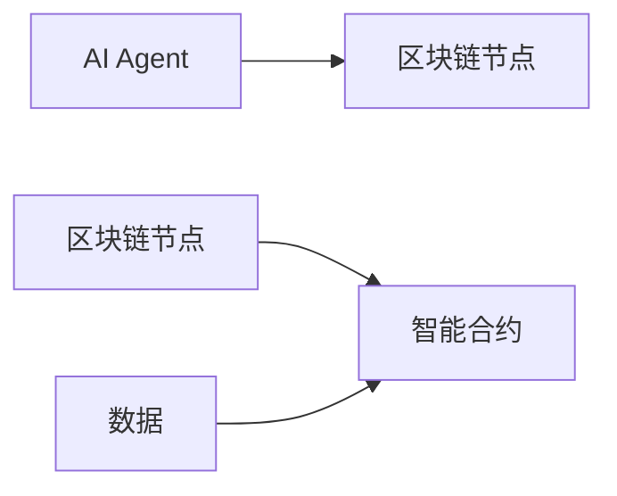
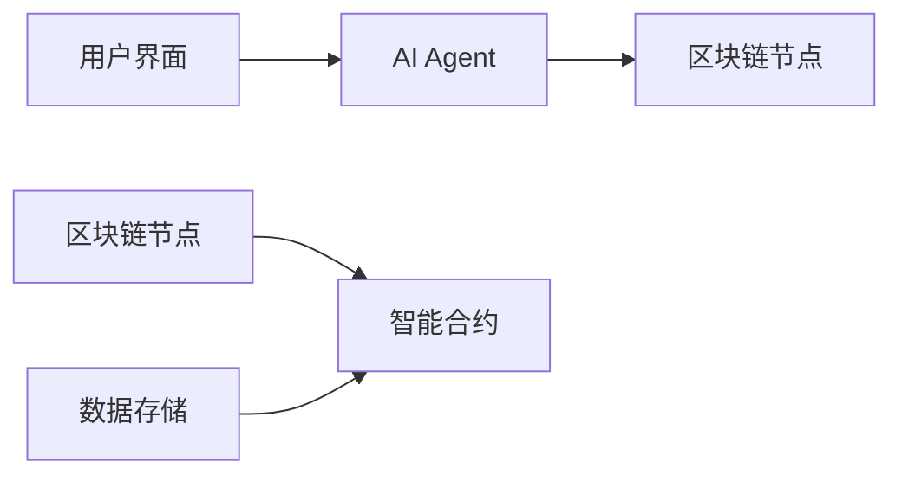

                 


# AI Agent在企业区块链应用中的集成与应用

**关键词**：AI Agent，区块链，企业应用，智能合约，分布式系统，人工智能，区块链技术

**摘要**：  
本文探讨了AI Agent在企业区块链应用中的集成与应用，详细分析了AI Agent与区块链技术的核心概念、算法原理、系统架构以及实际应用场景。通过对比核心概念、结合算法实现和系统设计，本文展示了AI Agent如何为区块链应用带来智能化和自动化能力，从而提升企业的效率和竞争力。文章还通过实际案例分析，进一步验证了AI Agent在区块链中的应用价值，并提出了未来的发展方向和最佳实践建议。

---

# AI Agent与区块链的背景与概念

## 1.1 AI Agent的基本概念

### 1.1.1 AI Agent的定义  
AI Agent（人工智能代理）是一种能够感知环境、自主决策并执行任务的智能实体。它可以是软件程序、机器人或其他智能系统，能够根据输入的信息做出响应，并通过与环境的交互实现目标。

### 1.1.2 AI Agent的核心特点  
- **自主性**：AI Agent能够自主决策，无需外部干预。  
- **反应性**：能够实时感知环境变化并做出反应。  
- **智能性**：具备学习、推理和问题解决能力。  
- **协作性**：能够与其他AI Agent或系统协作完成复杂任务。  

### 1.1.3 AI Agent在企业中的应用场景  
- **自动化决策**：在供应链管理、库存优化等领域，AI Agent可以实时监控数据并做出最优决策。  
- **智能客服**：通过自然语言处理技术，AI Agent可以提供个性化的客户服务。  
- **风险管理**：AI Agent可以实时监控市场变化，识别潜在风险并提出应对策略。  

---

## 1.2 区块链技术概述

### 1.2.1 区块链的基本概念  
区块链是一种分布式账本技术，通过去中心化的方式记录交易数据，确保数据的安全性和不可篡改性。

### 1.2.2 区块链的核心特点  
- **去中心化**：数据存储在多个节点上，避免单点故障。  
- **不可篡改性**：通过加密技术和共识机制确保数据无法被篡改。  
- **透明性**：所有交易记录公开透明，但参与者身份可选择匿名。  

### 1.2.3 区块链在企业中的应用场景  
- **供应链管理**：通过区块链记录商品的流转信息，实现全程可追溯。  
- **智能合约**：通过区块链执行自动化的合同条款，减少人为干预。  
- **金融支付**：利用区块链技术实现快速、安全的跨境支付。  

---

## 1.3 AI Agent与区块链的结合

### 1.3.1 为什么需要将AI Agent与区块链结合  
- **提升智能化水平**：区块链本身是去中心化的分布式账本，而AI Agent的引入可以为区块链应用带来智能化的决策能力。  
- **增强安全性**：通过AI Agent实时监控区块链网络，识别潜在的安全威胁并及时响应。  
- **优化效率**：AI Agent可以自动化处理区块链中的复杂任务，降低人工干预成本。  

### 1.3.2 AI Agent与区块链结合的核心价值  
- **智能化决策**：AI Agent可以根据区块链中的数据，实时分析并做出最优决策。  
- **自动化执行**：AI Agent可以自动执行智能合约，提升业务流程的效率。  
- **增强安全性**：AI Agent可以通过异常行为分析，识别潜在的安全漏洞并及时修复。  

### 1.3.3 企业区块链应用中的AI Agent潜力  
- **智能合约优化**：AI Agent可以通过分析历史数据，优化智能合约的执行逻辑。  
- **数据驱动决策**：通过AI Agent分析区块链中的数据，为企业提供数据驱动的决策支持。  
- **跨链协作**：AI Agent可以实现不同区块链之间的协作，推动多链生态的发展。  

---

## 1.4 本章小结  
本章介绍了AI Agent和区块链的基本概念及其在企业中的应用场景，重点分析了AI Agent与区块链结合的核心价值和潜力。通过这种结合，AI Agent可以为区块链应用带来智能化和自动化的能力，从而推动企业数字化转型。

---

# AI Agent与区块链的核心概念与联系

## 2.1 AI Agent的原理

### 2.1.1 AI Agent的感知与决策机制  
AI Agent通过传感器或API接口获取环境中的数据，利用机器学习算法进行分析和推理，最终做出决策并执行任务。

### 2.1.2 AI Agent的自主性与智能性  
AI Agent的核心能力在于其自主性和智能性，能够根据环境变化动态调整行为策略。

### 2.1.3 AI Agent的交互与协作能力  
AI Agent可以与其他AI Agent、区块链节点或外部系统进行交互和协作，共同完成复杂任务。

---

## 2.2 区块链的技术原理

### 2.2.1 区块链的分布式账本  
区块链通过分布式账本记录交易数据，每个节点都有一份完整的账本副本，确保数据的透明性和安全性。

### 2.2.2 区块链的共识机制  
共识机制（如PoW、PoS、BFT）用于确保所有节点达成一致，保证区块链网络的安全性和稳定性。

### 2.2.3 区块链的智能合约  
智能合约是区块链上的自动执行程序，可以根据预设条件自动执行合同条款，实现业务逻辑的自动化。

---

## 2.3 AI Agent与区块链的结合原理

### 2.3.1 AI Agent在区块链中的角色定位  
AI Agent可以作为区块链节点的一部分，或者作为外部服务与区块链进行交互。

### 2.3.2 区块链为AI Agent提供的信任机制  
区块链的去中心化和不可篡改性为AI Agent提供了信任机制，确保数据的真实性和可靠性。

### 2.3.3 AI Agent为区块链提供的智能化能力  
AI Agent可以通过分析区块链中的数据，优化智能合约的执行逻辑，提升区块链应用的智能化水平。

---

## 2.4 核心概念对比与ER实体关系图

### 2.4.1 AI Agent与区块链的核心概念对比  

| **概念**       | **AI Agent**                     | **区块链**                       |
|----------------|----------------------------------|----------------------------------|
| 核心功能       | 感知环境、自主决策、执行任务    | 记录交易数据、共识机制、智能合约 |
| 数据存储       | 本地存储或云端存储              | 分布式账本                        |
| 安全性          | 依赖加密算法和访问控制          | 依赖共识机制和加密技术            |

### 2.4.2 实体关系图  


---

## 2.5 本章小结  
本章详细讲解了AI Agent和区块链的核心概念，并通过对比分析和实体关系图，展示了两者之间的联系和区别。AI Agent与区块链的结合，不仅提升了区块链应用的智能化水平，也为AI Agent提供了去中心化的信任机制。

---

# AI Agent与区块链的算法原理

## 3.1 AI Agent的算法原理

### 3.1.1 AI Agent的感知算法  
AI Agent通过传感器或API接口获取环境数据，利用感知算法（如计算机视觉、自然语言处理）进行分析和理解。

### 3.1.2 AI Agent的决策算法  
基于感知结果，AI Agent利用决策算法（如强化学习、贝叶斯网络）做出最优决策。

### 3.1.3 AI Agent的优化算法  
通过不断学习和优化，AI Agent可以提升感知和决策的准确性和效率。

---

## 3.2 区块链的共识算法

### 3.2.1 工作量证明（PoW）  
PoW是一种通过计算哈希值来验证节点贡献的共识机制，常见于比特币网络。

### 3.2.2 权益证明（PoS）  
PoS是一种通过持有代币数量来决定节点权限的共识机制，相比PoW更加节能。

### 3.2.3 拜占庭容错（BFT）  
BFT是一种适用于分布式系统的共识算法，能够容忍部分节点的故障或恶意行为。

---

## 3.3 AI Agent与区块链结合的算法

### 3.3.1 基于区块链的AI Agent身份认证算法  
AI Agent通过区块链节点进行身份认证，确保其合法性和可信度。

### 3.3.2 基于AI Agent的智能合约执行算法  
AI Agent可以根据区块链中的数据，自动触发智能合约的执行。

### 3.3.3 AI Agent与区块链结合的优化算法  
通过AI Agent优化智能合约的执行逻辑，提升区块链应用的效率和性能。

---

## 3.4 算法实现代码示例

### 3.4.1 AI Agent身份认证代码  
```python
def authenticate_agent(agent_id, blockchain_node):
    # 获取区块链节点的公钥
    nodePublicKey = blockchain_node.get_public_key()
    # 使用加密算法验证AI Agent的身份
    if verify_signature(agent_id, nodePublicKey):
        return True
    else:
        return False
```

### 3.4.2 智能合约执行代码  
```python
def execute_smart_contract(agent_id, contract_address):
    # 初始化智能合约实例
    contract = Contract(contract_address)
    # 调用智能合约的执行方法
    contract.execute_contract(agent_id)
```

---

## 3.5 本章小结  
本章详细讲解了AI Agent和区块链的核心算法原理，并通过代码示例展示了AI Agent与区块链结合的具体实现。这些算法为AI Agent在区块链中的集成与应用提供了理论基础和技术支持。

---

# 系统架构设计与项目实战

## 4.1 系统架构设计

### 4.1.1 问题场景介绍  
假设我们正在开发一个供应链管理平台，希望通过AI Agent和区块链技术实现商品的全流程追踪和智能合约执行。

### 4.1.2 系统功能设计  
- **商品追踪**：通过AI Agent实时监控商品的位置和状态。  
- **智能合约**：自动执行供应链中的合同条款。  
- **数据可视化**：提供实时数据可视化界面，帮助企业监控供应链运行状态。  

### 4.1.3 系统架构设计  


---

## 4.2 项目实战

### 4.2.1 环境安装  
- 安装区块链框架（如Ethereum、Hyperledger Fabric）。  
- 安装AI Agent开发框架（如Python的scikit-learn、TensorFlow）。  

### 4.2.2 核心实现代码  
```python
class AIAgent:
    def __init__(self, blockchain_node):
        self.blockchain_node = blockchain_node

    def perceive_environment(self, data):
        # 分析环境数据
        return analysis_result

    def make_decision(self, analysis_result):
        # 根据分析结果做出决策
        return action

    def execute_action(self, action):
        # 执行决策动作
        pass

    def authenticate(self):
        # 身份认证
        return self.blockchain_node.authenticate_agent(self.id)
```

### 4.2.3 实际案例分析  
通过实际案例分析，展示AI Agent在区块链中的应用效果。例如，在供应链管理中，AI Agent可以通过分析物流数据，优化智能合约的执行逻辑，提升供应链的整体效率。

---

## 4.3 本章小结  
本章通过系统架构设计和项目实战，展示了AI Agent在企业区块链应用中的具体实现。通过实际案例分析，进一步验证了AI Agent与区块链结合的应用价值。

---

# 最佳实践与未来展望

## 5.1 最佳实践 tips

### 5.1.1 技术选型  
选择适合的区块链框架和AI Agent开发框架，确保系统的兼容性和扩展性。  

### 5.1.2 安全性考虑  
在设计AI Agent与区块链结合的系统时，需特别注意数据安全和隐私保护。  

### 5.1.3 可扩展性设计  
确保系统具备良好的可扩展性，能够适应业务需求的变化。  

---

## 5.2 小结  
本文详细探讨了AI Agent在企业区块链应用中的集成与应用，通过理论分析和实际案例，展示了AI Agent与区块链结合的潜力和价值。

---

## 5.3 注意事项  
- 在实际应用中，需注意AI Agent的计算资源消耗问题，避免对系统性能造成过大压力。  
- 数据隐私和安全是AI Agent与区块链结合应用中的重要考虑因素。  

---

## 5.4 拓展阅读  
- 推荐阅读《区块链：技术开发与应用实战》和《人工智能：算法与应用》。  
- 关注行业动态，了解AI Agent与区块链结合的最新研究成果和应用案例。

---

# 作者信息

作者：AI天才研究院/AI Genius Institute & 禅与计算机程序设计艺术/Zen And The Art of Computer Programming

---

通过本文，我们详细探讨了AI Agent在企业区块链应用中的集成与应用，从理论到实践，为读者提供了全面的视角和深入的分析。希望本文能够为相关领域的研究和实践提供有价值的参考。

