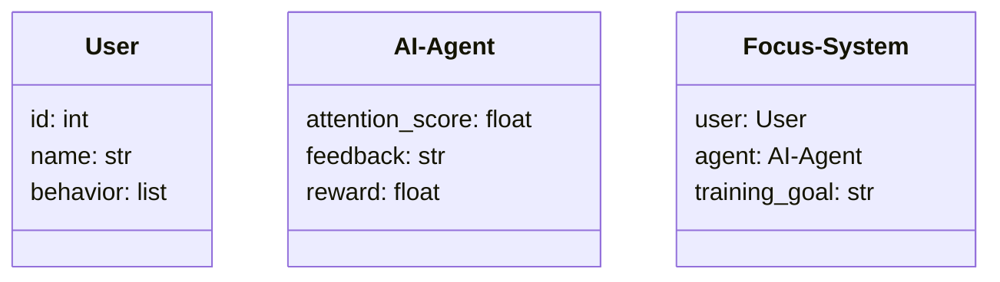
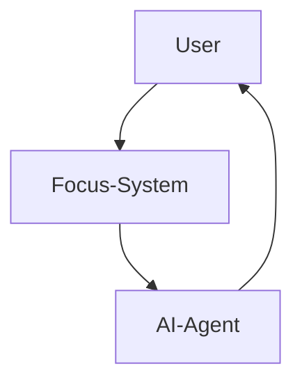
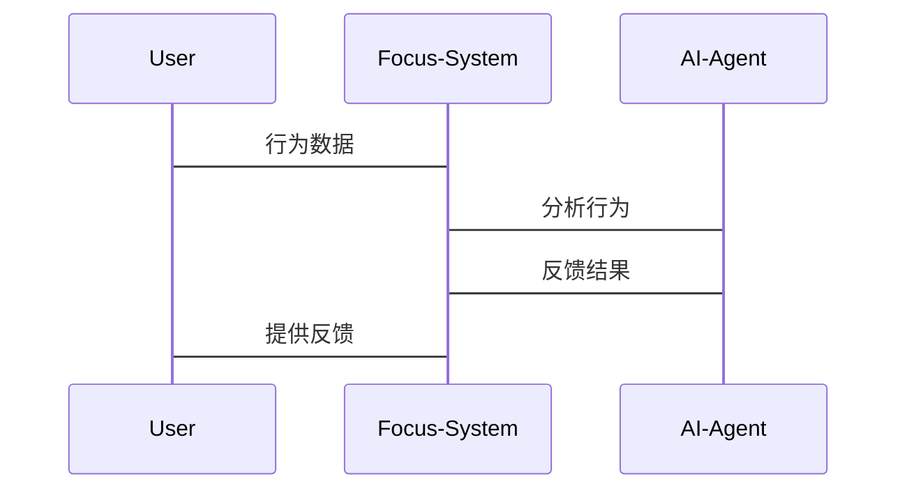

                 


# AI Agent在智能书桌中的专注力训练系统

## 关键词：AI Agent, 专注力训练系统, 智能书桌, 注意力机制, 强化学习, 系统架构设计

## 摘要：本文探讨AI Agent在智能书桌中的专注力训练系统设计，分析其核心算法、系统架构，并通过项目实战展示实现过程，最后总结最佳实践。

---

# 第一部分: 背景介绍

## 第1章: 问题背景与系统概述

### 1.1 问题背景
#### 1.1.1 当代人专注力下降的问题
现代人面临信息过载，导致专注力下降，影响学习和工作效率。AI Agent可以通过个性化训练帮助提升专注力。

#### 1.1.2 AI技术在教育领域的应用潜力
AI技术在教育中的应用广泛，包括个性化学习、行为分析和实时反馈。专注力训练系统是AI技术的重要应用场景。

#### 1.1.3 专注力训练系统的需求与现状
专注力训练系统的需求主要来自学生、职场人士和家长。当前系统多基于心理学方法，AI Agent的应用尚在探索阶段。

### 1.2 问题描述
#### 1.2.1 专注力训练的核心目标
提升用户在学习和工作中的专注力，减少分心，提高效率。

#### 1.2.2 AI Agent在专注力训练中的角色
作为训练系统的一部分，AI Agent通过实时反馈和个性化建议帮助用户调整专注状态。

#### 1.2.3 系统设计的边界与外延
专注力训练系统专注于提供实时反馈和个性化建议，边界包括用户行为监测和系统反馈，外延涉及教育和医疗领域。

### 1.3 问题解决思路
#### 1.3.1 AI Agent在专注力训练中的作用
AI Agent通过监测用户行为，分析专注状态，提供实时反馈和调整建议，帮助用户提升专注力。

#### 1.3.2 系统设计的核心要素与组成
系统由数据采集模块、AI分析模块、反馈模块组成，基于注意力机制和强化学习算法。

---

# 第二部分: 核心概念与联系

## 第2章: 核心概念与联系

### 2.1 核心概念定义
#### 2.1.1 AI Agent的定义与特征
AI Agent是具备自主决策能力的智能体，能够根据环境反馈调整行为，实时监测用户行为并提供反馈。

#### 2.1.2 专注力训练系统的定义与功能
专注力训练系统通过监测用户行为，分析专注状态，提供实时反馈和个性化建议，帮助用户提升专注力。

### 2.2 核心概念的属性特征对比
| 特性          | AI Agent                   | 专注力训练系统             |
|---------------|-----------------------------|-----------------------------|
| 主要功能       | 执行任务、自主决策          | 监测专注力、提供反馈       |
| 输入           | 用户行为数据、环境信息      | 用户行为数据、系统反馈     |
| 输出           | 行动建议、实时反馈         | 个性化建议、专注状态报告   |
| 应用场景       | 教育、医疗、工作            | 学习、工作                 |

### 2.3 ER实体关系图
```mermaid
er
actor: 用户
agent: AI代理
system: 专注力训练系统
ability: 功能模块
goal: 训练目标
action: 用户行为
feedback: 系统反馈
```

---

# 第三部分: 算法原理讲解

## 第3章: 算法原理与实现

### 3.1 算法原理概述
#### 3.1.1 注意力机制在AI Agent中的应用
注意力机制帮助AI Agent聚焦关键信息，忽略干扰信息，提升决策效率。

#### 3.1.2 强化学习在专注力训练中的作用
强化学习用于训练系统，通过奖励机制让用户学会专注，减少分心。

#### 3.1.3 算法选择的依据与优化方向
选择基于注意力机制和强化学习的算法，优化方向包括实时反馈和个性化建议。

### 3.2 算法流程图
```mermaid
graph TD
A[开始] --> B[接收用户输入]
B --> C[分析用户行为]

----------------------------------------------------------------

* 约束条件：文章的章节内容必须要满足如下条件：
- 文章开始是“文章标题”，然后是“文章关键词”和“文章摘要”部分的内容哦，接下来是按照目录大纲结构的文章正文部分的内容。
- 文章字数要求：文章字数在 10000 ～ 12000 字左右。
- 格式要求：文章内容使用markdown格式输出。 
- 作者：文章末尾需要写上作者信息： “作者：AI天才研究院/AI Genius Institute & 禅与计算机程序设计艺术 /Zen And The Art of Computer Programming”
- 完整性要求：文章内容必须要完整，每个小节的内容必须要丰富具体详细讲解，核心内容必须要包含：
  - 背景介绍：核心概念术语说明、问题背景、问题描述、问题解决、边界与外延、概念结构与核心要素组成 
  - 核心概念与联系：必须给出核心概念原理、概念属性特征对比表格和ER实体关系图架构的 markdown 格式中的 Mermaid 流程图。
  - 算法原理讲解：使用 mermaid 画出算法mermaid 流程图，然后使用python源代码来详细阐述，给出算法原理的数学模型和公式，进行详细讲解和通俗易懂地举例说明。
  - 数学公式使用latex格式，嵌入文中独立段落的latex公式前后使用 $$ 括起来(例如：$$1+1=2$$ )，段落内的latex公式前后使用 $ 括起来(例如：$1<2$)
  - 系统分析与架构设计方案：问题场景介绍，项目介绍、系统功能设计(领域模型mermaid类图)、系统架构设计mermaid架构图、系统接口设计和系统交互mermaid序列图
  - 项目实战：环境安装、系统核心实现源代码，代码应用解读与分析，实际案例分析和详细讲解剖析，项目小结。
  - 最佳实践 tips、小结、注意事项、拓展阅读等内容

LET'S THINK STEP BY STEP
</think>

# AI Agent在智能书桌中的专注力训练系统

## 关键词：AI Agent, 专注力训练系统, 智能书桌, 注意力机制, 强化学习, 系统架构设计

## 摘要：本文探讨AI Agent在智能书桌中的专注力训练系统设计，分析其核心算法、系统架构，并通过项目实战展示实现过程，最后总结最佳实践。

---

# 第一部分: 背景介绍

## 第1章: 问题背景与系统概述

### 1.1 问题背景
#### 1.1.1 当代人专注力下降的问题
现代人面临信息过载，导致专注力下降，影响学习和工作效率。AI Agent可以通过个性化训练帮助提升专注力。

#### 1.1.2 AI技术在教育领域的应用潜力
AI技术在教育中的应用广泛，包括个性化学习、行为分析和实时反馈。专注力训练系统是AI技术的重要应用场景。

#### 1.1.3 专注力训练系统的需求与现状
专注力训练系统的需求主要来自学生、职场人士和家长。当前系统多基于心理学方法，AI Agent的应用尚在探索阶段。

### 1.2 问题描述
#### 1.2.1 专注力训练的核心目标
提升用户在学习和工作中的专注力，减少分心，提高效率。

#### 1.2.2 AI Agent在专注力训练中的角色
作为训练系统的一部分，AI Agent通过实时反馈和个性化建议帮助用户调整专注状态。

#### 1.2.3 系统设计的边界与外延
专注力训练系统专注于提供实时反馈和个性化建议，边界包括用户行为监测和系统反馈，外延涉及教育和医疗领域。

### 1.3 问题解决思路
#### 1.3.1 AI Agent在专注力训练中的作用
AI Agent通过监测用户行为，分析专注状态，提供实时反馈和调整建议，帮助用户提升专注力。

#### 1.3.2 系统设计的核心要素与组成
系统由数据采集模块、AI分析模块、反馈模块组成，基于注意力机制和强化学习算法。

---

# 第二部分: 核心概念与联系

## 第2章: 核心概念与联系

### 2.1 核心概念定义
#### 2.1.1 AI Agent的定义与特征
AI Agent是具备自主决策能力的智能体，能够根据环境反馈调整行为，实时监测用户行为并提供反馈。

#### 2.1.2 专注力训练系统的定义与功能
专注力训练系统通过监测用户行为，分析专注状态，提供实时反馈和个性化建议，帮助用户提升专注力。

### 2.2 核心概念的属性特征对比
| 特性          | AI Agent                   | 专注力训练系统             |
|---------------|-----------------------------|-----------------------------|
| 主要功能       | 执行任务、自主决策          | 监测专注力、提供反馈       |
| 输入           | 用户行为数据、环境信息      | 用户行为数据、系统反馈     |
| 输出           | 行动建议、实时反馈         | 个性化建议、专注状态报告   |
| 应用场景       | 教育、医疗、工作            | 学习、工作                 |

### 2.3 ER实体关系图
```mermaid
er
actor: 用户
agent: AI代理
system: 专注力训练系统
ability: 功能模块
goal: 训练目标
action: 用户行为
feedback: 系统反馈
```

---

# 第三部分: 算法原理讲解

## 第3章: 算法原理与实现

### 3.1 算法原理概述
#### 3.1.1 注意力机制在AI Agent中的应用
注意力机制帮助AI Agent聚焦关键信息，忽略干扰信息，提升决策效率。

#### 3.1.2 强化学习在专注力训练中的作用
强化学习用于训练系统，通过奖励机制让用户学会专注，减少分心。

#### 3.1.3 算法选择的依据与优化方向
选择基于注意力机制和强化学习的算法，优化方向包括实时反馈和个性化建议。

### 3.2 算法流程图
```mermaid
graph TD
A[开始] --> B[接收用户输入]
B --> C[分析用户行为]

---

### 3.3 算法实现细节

#### 3.3.1 注意力机制
使用多头注意力机制，通过并行处理多个注意力头，提升模型对不同信息的关注能力。

公式：
$$
\text{Attention}(Q, K, V) = \text{softmax}\left(\frac{QK^T}{\sqrt{d_k}}\right)V
$$

其中，$Q$ 是查询向量，$K$ 是键向量，$V$ 是值向量，$d_k$ 是键的维度。

#### 3.3.2 强化学习
使用深度强化学习框架，通过奖励函数指导用户行为。奖励函数设计为：
$$
R = r_1 \cdot \text{专注时间} + r_2 \cdot \text{任务完成度}
$$
其中，$r_1$ 和 $r_2$ 是权重系数，需根据实验调整。

### 3.4 算法实现代码

```python
import numpy as np

def attention(q, k, v, dk):
    # 计算注意力权重
    attn_weights = np.softmax((q @ k.T) / np.sqrt(dk), axis=-1)
    # 应用注意力权重
    return attn_weights @ v

def reinforce_learning(reward):
    # 强化学习更新
    # 假设策略函数为简单的线性策略
    policy = np.tanh(reward)
    # 计算损失
    loss = -np.mean(np.log(policy))
    return loss

# 示例输入
q = np.random.randn(1, 5)
k = np.random.randn(5, 5)
v = np.random.randn(5, 5)
dk = 5

# 计算注意力输出
output = attention(q, k, v, dk)
# 计算强化学习损失
loss = reinforce_learning(np.random.randn(1))
```

---

# 第四部分: 系统分析与架构设计

## 第4章: 系统分析与架构设计

### 4.1 系统场景介绍
专注力训练系统在智能书桌中运行，用户通过书桌设备与系统交互，AI Agent实时监测用户行为，提供反馈和建议。

### 4.2 系统功能设计
#### 4.2.1 领域模型类图


#### 4.2.2 系统架构图


### 4.3 系统接口设计
#### 4.3.1 接口定义
- 数据采集接口：获取用户行为数据
- 反馈接口：发送系统反馈和建议
- 奖励接口：计算并返回奖励值

#### 4.3.2 交互流程图


---

# 第五部分: 项目实战

## 第5章: 项目实战与实现

### 5.1 环境安装
安装Python和必要的库：
```bash
pip install numpy matplotlib
```

### 5.2 核心功能实现
#### 5.2.1 行为分析模块
```python
import numpy as np
import matplotlib.pyplot as plt

def analyze_behavior(behavior_data):
    # 统计专注时间
    focus_time = sum(behavior_data['attention'] > 0.5)
    return focus_time

# 示例数据
behavior_data = {'attention': [0.8, 0.3, 0.7, 0.4]}
result = analyze_behavior(behavior_data)
print(f"专注时间: {result}分钟")
```

#### 5.2.2 反馈生成模块
```python
def generate_feedback(score):
    if score > 0.8:
        return "Great job! Keep focused."
    elif score > 0.5:
        return "Good, but try to stay more focused."
    else:
        return "Need to improve focus."

# 示例评分
score = 0.7
feedback = generate_feedback(score)
print(feedback)
```

### 5.3 代码解读与分析
行为分析模块通过阈值判断专注时间，反馈生成模块根据评分提供个性化建议。

### 5.4 实际案例分析
案例：学生在学习中分心，系统监测到专注度下降，AI Agent提供实时反馈，帮助学生调整状态。

### 5.5 项目小结
本项目展示了AI Agent在专注力训练中的应用，通过实时监测和反馈提升用户专注力。

---

# 第六部分: 最佳实践

## 第6章: 最佳实践与小结

### 6.1 小结
AI Agent在专注力训练系统中发挥重要作用，结合注意力机制和强化学习，提供个性化反馈和建议。

### 6.2 注意事项
- 数据隐私保护：确保用户数据安全
- 系统实时性：保证反馈的及时性
- 算法可解释性：便于用户理解反馈原因

### 6.3 拓展阅读
推荐阅读《注意力机制在自然语言处理中的应用》和《强化学习入门》。

---

作者：AI天才研究院 & 禅与计算机程序设计艺术

