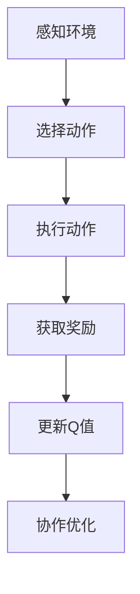
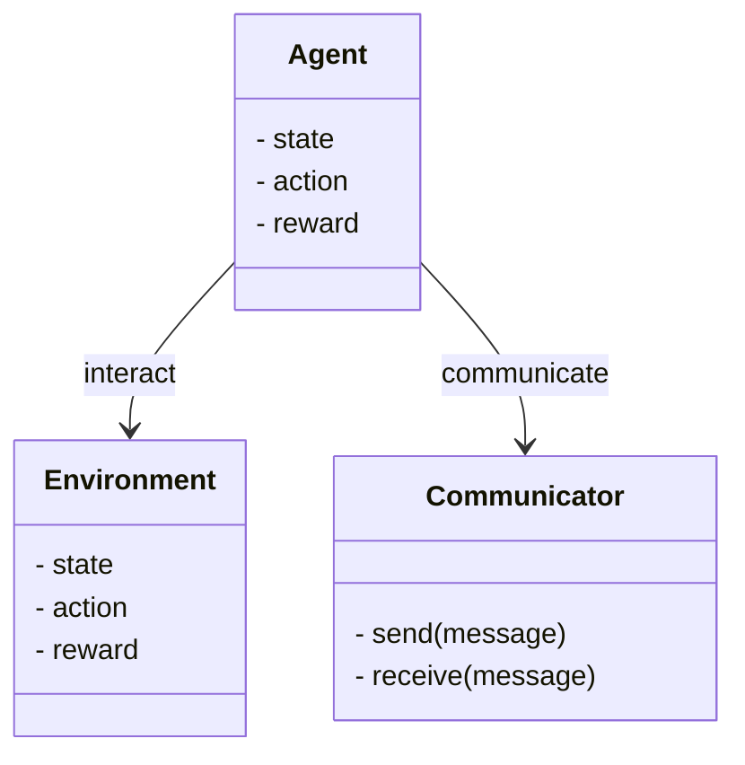
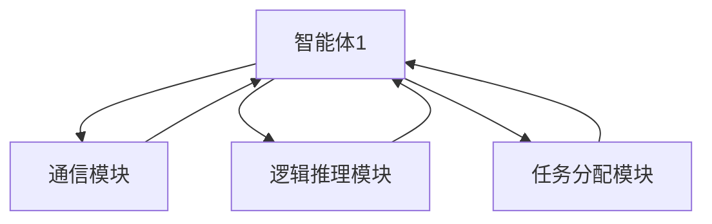
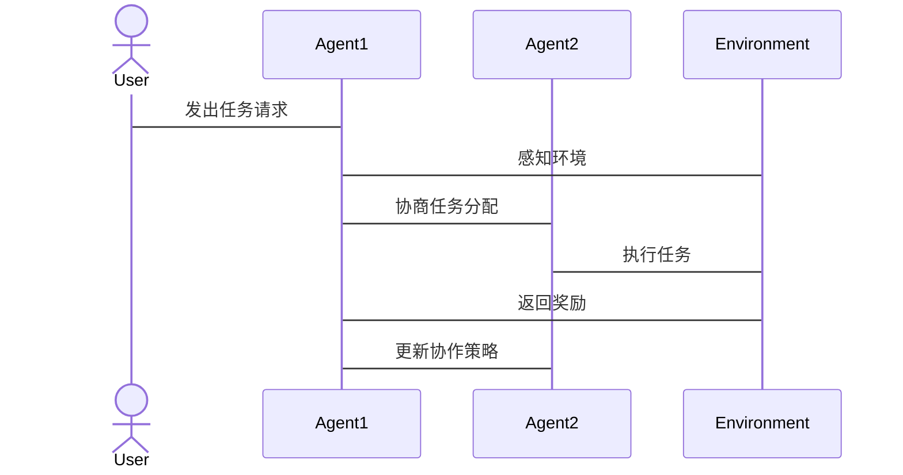

                 


# AI Agent的多Agent协作学习系统

> 关键词：AI Agent，多Agent协作，分布式强化学习，多智能体Q学习，协作学习系统

> 摘要：本文详细探讨了AI Agent的多Agent协作学习系统，从基本概念、核心原理到算法实现、系统架构，再到项目实战和应用案例，全面解析了多Agent协作学习的关键技术与实际应用。通过本文的阐述，读者将能够理解并掌握AI Agent多Agent协作学习的核心思想和实现方法。

---

# 第一部分: AI Agent的多Agent协作学习系统概述

## 第1章: AI Agent的基本概念与背景介绍

### 1.1 AI Agent的定义与核心概念

#### 1.1.1 AI Agent的定义
AI Agent（人工智能代理）是指能够感知环境、自主决策并执行任务的智能实体。AI Agent的核心目标是通过感知和行动来实现特定的目标或优化特定的评价函数。

**关键属性：**
1. **自主性**：能够在没有外部干预的情况下自主决策。
2. **反应性**：能够实时感知环境并做出响应。
3. **主动性**：主动采取行动以实现目标。
4. **社会性**：能够与其他Agent或人类进行交互和协作。

#### 1.1.2 AI Agent的核心要素
AI Agent的设计和实现通常包括以下几个核心要素：
1. **感知机制**：通过传感器或其他输入方式获取环境信息。
2. **推理机制**：基于感知信息进行逻辑推理或模式识别。
3. **决策机制**：根据推理结果制定行动策略。
4. **执行机制**：通过执行机构将决策转化为实际行动。

#### 1.1.3 AI Agent的分类与特点
AI Agent可以根据功能、智能水平和应用领域进行分类：

1. **简单反射型Agent**：基于当前感知做出简单反应，没有内部状态。
2. **基于模型的反射型Agent**：利用内部模型进行推理和规划。
3. **目标驱动型Agent**：以特定目标为导向，通过规划和推理实现目标。
4. **效用驱动型Agent**：通过最大化效用函数来优化决策。

#### 1.1.4 多Agent系统的发展历程
多Agent系统（MAS，Multi-Agent System）的发展经历了以下几个阶段：
1. **单Agent阶段**：早期的AI研究主要集中在单个Agent的自主决策能力。
2. **分布式任务分配阶段**：多个Agent协作完成特定任务，强调任务分配和资源协调。
3. **社会性协作阶段**：Agent之间通过社会交互和协作实现复杂目标。
4. **智能体网络阶段**：Agent之间的协作更加动态化和自适应化，形成了智能化的网络结构。

---

### 1.2 多Agent协作学习的背景与意义

#### 1.2.1 协作学习的定义与特点
协作学习是指多个智能体通过共享信息、分工合作来共同完成一个复杂任务的过程。协作学习的核心在于智能体之间的信息共享和决策协调。

**特点：**
1. **分布式决策**：每个智能体独立决策，同时通过协作实现全局目标。
2. **动态协调**：协作过程需要根据环境变化动态调整策略。
3. **社会性交互**：智能体之间需要通过通信和协商来实现协作。

#### 1.2.2 多Agent协作学习的必要性
在实际应用中，许多复杂问题无法通过单个Agent完成，例如：
1. **分布式任务处理**：任务需要多个智能体协同完成。
2. **动态环境适应**：单个Agent难以应对复杂多变的环境。
3. **分布式决策优化**：通过协作可以实现全局最优或帕累托最优。

#### 1.2.3 多Agent协作学习的应用场景
1. **分布式机器人协作**：多台机器人协作完成搬运、装配等任务。
2. **自动驾驶系统**：车辆之间通过协作实现交通优化。
3. **分布式推荐系统**：多个智能体协作推荐个性化内容。
4. **游戏AI协作**：多个AI角色协作完成游戏任务。

#### 1.2.4 多Agent协作学习的边界与外延
协作学习的边界主要在于：
1. **协作范围**：智能体之间协作的范围和深度。
2. **协作目标**：协作的具体目标和任务。
3. **协作机制**：协作的方式和规则。

---

## 第2章: 多Agent协作学习的核心概念与联系

### 2.1 多Agent协作学习的协作机制

#### 2.1.1 分布式协作的基本原理
分布式协作是指多个智能体通过分布式决策和信息共享来实现协作目标。其核心在于：
1. **分布式感知**：每个智能体独立感知环境。
2. **分布式决策**：每个智能体独立制定行动策略。
3. **协作通信**：智能体之间通过通信协议共享信息。

#### 2.1.2 Agent之间的通信协议
通信协议是多Agent协作的基础，通常包括：
1. **消息传递**：通过消息传递共享信息。
2. **状态同步**：定期同步智能体的状态信息。
3. **任务分配**：通过通信协议分配任务。

#### 2.1.3 协作任务的分配与协调
协作任务的分配需要考虑以下因素：
1. **任务分解**：将复杂任务分解为多个子任务。
2. **任务分配策略**：根据智能体的能力和环境状态分配任务。
3. **任务协调机制**：通过协调机制确保任务顺利执行。

#### 2.1.4 协作过程中的冲突解决
在多Agent协作中，冲突是不可避免的。常见的冲突解决策略包括：
1. **协商与妥协**：通过协商达成一致。
2. **优先级规则**：根据任务优先级解决冲突。
3. **仲裁机制**：通过仲裁者解决无法协商的冲突。

#### 对比分析表：协作机制的特征对比

| 特征       | 分布式协作 | 集中式协作 |
|------------|------------|------------|
| 决策中心   | 分散       | 集中       |
| 通信需求   | 高         | 中         |
| 灵活性     | 高         | 低         |
| 效率       | 中         | 高         |

---

### 2.2 多Agent协作学习的社会性与智能性

#### 2.2.1 社会性协作的定义
社会性协作是指智能体之间通过社会交互和合作来实现协作目标。社会性协作的核心在于智能体之间的社会角色和交互方式。

#### 2.2.2 多Agent协作中的社会角色
1. **领导者**：负责任务分配和协调。
2. **执行者**：负责具体任务的执行。
3. **协调者**：负责冲突解决和协作优化。

#### 2.2.3 智能性协作的特点
智能性协作是指智能体之间通过智能推理和协作学习来实现协作目标。其特点包括：
1. **自适应性**：能够根据环境变化动态调整协作策略。
2. **知识共享**：智能体之间共享知识和经验。
3. **协作学习**：通过协作学习优化协作策略。

#### 2.2.4 社会性与智能性的对比分析
| 特征       | 社会性协作 | 智能性协作 |
|------------|------------|------------|
| 核心机制   | 社会交互   | 智能推理   |
| 协作方式   | 基于规则   | 基于知识   |
| 灵活性     | 中         | 高         |

---

## 第3章: 多Agent协作学习的算法原理

### 3.1 多Agent协作学习的算法概述

#### 3.1.1 分布式强化学习
分布式强化学习（Distributed Reinforcement Learning）是一种基于强化学习的多Agent协作方法。其核心思想是多个智能体通过分布式决策和协作学习来优化全局目标。

**算法特点：**
1. **去中心化**：没有中心化的控制节点。
2. **异步更新**：智能体可以异步更新策略。
3. **协作优化**：通过协作学习优化全局目标。

#### 3.1.2 多智能体Q学习
多智能体Q学习（Multi-Agent Q-Learning）是一种基于Q学习的协作学习方法。多个智能体通过共享Q值表来优化协作策略。

**算法流程：**
1. **初始化**：每个智能体初始化Q值表。
2. **感知环境**：智能体感知环境并获取奖励。
3. **更新Q值**：根据奖励更新Q值表。
4. **协作优化**：通过协作学习优化Q值表。

#### 3.1.3 协作式DQN算法
协作式DQN（Collaborative Deep Q-Network）是一种基于深度强化学习的多Agent协作方法。多个智能体通过深度神经网络来近似Q值函数。

**算法特点：**
1. **深度近似**：使用深度神经网络近似Q值函数。
2. **协作优化**：通过协作学习优化深度神经网络。
3. **异步更新**：智能体可以异步更新神经网络。

#### 3.1.4 其他协作学习算法
除了上述算法，还有其他协作学习算法，例如：
1. **联合强化学习（JRL）**：通过联合策略优化协作目标。
2. **基于博弈论的协作学习**：通过博弈论优化协作策略。

---

### 3.2 多Agent协作学习的数学模型与公式

#### 3.2.1 Q值更新公式
Q值更新公式是分布式强化学习的核心公式。其一般形式为：
$$ Q_i(a_i) = Q_i(a_i) + \alpha (r + \max_j Q_j(a_j) - Q_i(a_i)) $$
其中：
- $Q_i(a_i)$ 表示智能体i在动作a_i下的Q值。
- $\alpha$ 表示学习率。
- $r$ 表示奖励值。
- $\max_j Q_j(a_j)$ 表示其他智能体的Q值最大值。

#### 3.2.2 共同体收益分配公式
共同体收益分配公式用于将总收益分配给多个智能体。其一般形式为：
$$ R = \sum_{i=1}^{n} r_i $$
其中：
- $R$ 表示总收益。
- $r_i$ 表示智能体i的收益。

#### 3.2.3 协作策略优化公式
协作策略优化公式用于优化多个智能体的协作策略。其一般形式为：
$$ \theta_{i}^{new} = \theta_{i} + \eta \nabla_{\theta_i} J(\theta) $$
其中：
- $\theta_i$ 表示智能体i的参数。
- $\eta$ 表示学习率。
- $\nabla_{\theta_i} J(\theta)$ 表示目标函数J对参数$\theta_i$的梯度。

---

### 3.3 多Agent协作学习的算法流程图



---

## 第4章: 多Agent协作学习的系统分析与架构设计

### 4.1 问题场景介绍
本节将介绍多Agent协作学习的实际问题场景，例如多机器人协作、自动驾驶协作等。

---

### 4.2 系统功能设计

#### 4.2.1 领域模型类图


---

#### 4.2.2 系统架构图


---

### 4.3 系统接口设计

#### 4.3.1 系统接口设计
1. **通信接口**：定义智能体之间的通信协议。
2. **任务分配接口**：定义任务分配的规则和流程。
3. **协作学习接口**：定义协作学习的算法和参数。

#### 4.3.2 系统交互流程


---

## 第5章: 多Agent协作学习的项目实战

### 5.1 项目环境搭建

#### 5.1.1 安装依赖
```bash
pip install gym numpy tensorflow
```

---

#### 5.1.2 环境配置
```python
import gym
env = gym.make('MultiAgent-Pendulum-v0')
```

---

### 5.2 核心代码实现

#### 5.2.1 通信模块实现
```python
class Communicator:
    def __init__(self):
        self.agents = []

    def send(self, message):
        for agent in self.agents:
            agent.receive(message)

    def receive(self, message):
        pass
```

---

#### 5.2.2 分布式强化学习实现
```python
import numpy as np

class Agent:
    def __init__(self, state_dim, action_dim):
        self.state_dim = state_dim
        self.action_dim = action_dim
        self.Q = np.zeros((state_dim, action_dim))

    def choose_action(self, state):
        return np.argmax(self.Q[state])

    def update_Q(self, state, action, reward):
        self.Q[state, action] += 0.1 * (reward + np.max(self.Q[state]) - self.Q[state, action])
```

---

### 5.3 项目总结

---

## 第6章: 最佳实践与小结

### 6.1 最佳实践 tips
1. **明确协作目标**：在设计多Agent协作系统时，首先需要明确协作目标和任务。
2. **选择合适的协作机制**：根据实际需求选择合适的协作机制和通信协议。
3. **动态调整策略**：在实际应用中，需要动态调整协作策略以适应环境变化。

### 6.2 小结
本文详细探讨了AI Agent的多Agent协作学习系统，从基本概念、核心原理到算法实现、系统架构，再到项目实战和应用案例，全面解析了多Agent协作学习的关键技术与实际应用。通过本文的阐述，读者将能够理解并掌握AI Agent多Agent协作学习的核心思想和实现方法。

### 6.3 注意事项
在实际应用中，需要注意以下几点：
1. **避免过高的计算复杂度**：多Agent协作可能会导致计算复杂度增加。
2. **确保通信可靠性**：智能体之间的通信必须可靠，否则会影响协作效果。
3. **处理动态环境变化**：需要设计灵活的协作机制以适应动态环境。

### 6.4 拓展阅读
1. **《Multi-Agent Systems》**：介绍多Agent系统的基本理论和应用。
2. **《Distributed Reinforcement Learning》**：详细讲解分布式强化学习的理论和算法。
3. **《Collaborative Q-Learning for Multi-Agent Systems》**：探讨协作Q学习的理论和应用。

---

# 作者：AI天才研究院/AI Genius Institute & 禅与计算机程序设计艺术 /Zen And The Art of Computer Programming

