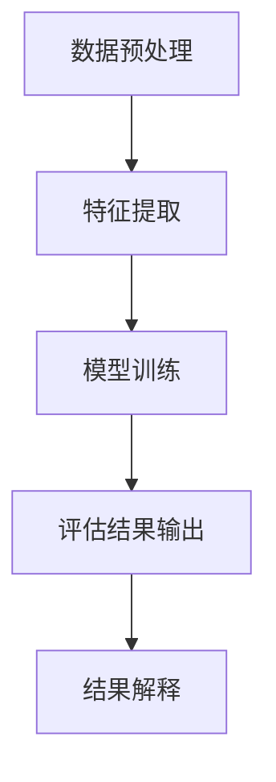
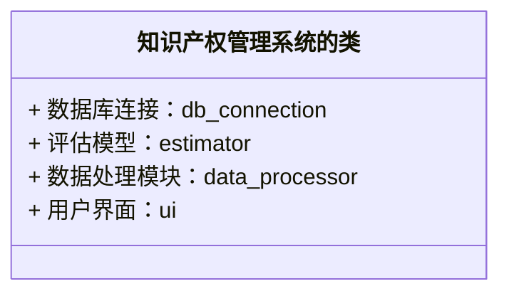

                 


# AI驱动的企业知识产权价值评估与管理

## 关键词：人工智能，知识产权，价值评估，管理，企业，技术驱动

## 摘要：本文详细探讨了AI技术在企业知识产权价值评估与管理中的应用，从背景介绍、核心概念、算法原理、系统架构到项目实战，全面分析了AI驱动的知识产权管理的优势、挑战及解决方案。文章结合实际案例，展示了如何利用AI技术提升企业知识产权的评估精度和管理效率，为企业在知识产权管理方面提供了新的思路和方法。

---

# 第一部分: AI驱动的企业知识产权价值评估与管理概述

## 第1章: 知识产权与AI驱动的概述

### 1.1 知识产权的基本概念
#### 1.1.1 知识产权的定义与范围
- 知识产权的定义
- 知识产权的主要类型：专利权、商标权、版权、商业秘密等
- 知识产权的法律保护与经济价值

#### 1.1.2 企业知识产权管理的重要性
- 知识产权对企业核心竞争力的影响
- 知识产权在企业经营中的战略地位
- 知识产权风险管理的重要性

#### 1.1.3 AI技术在知识产权管理中的应用潜力
- AI技术如何助力知识产权检索、分析与评估
- AI在知识产权保护与侵权检测中的应用
- AI技术在知识产权价值评估中的优势

### 1.2 AI驱动的知识产权价值评估与管理的背景
#### 1.2.1 传统知识产权评估的局限性
- 传统知识产权评估的主观性与不准确性
- 传统方法在海量数据处理中的低效性
- 传统方法在动态市场环境中的适应性不足

#### 1.2.2 AI技术在知识产权领域的优势
- 大数据分析能力：AI能够处理海量知识产权数据，发现潜在价值
- 自动化评估：AI算法可以快速评估知识产权的经济价值
- 智能预测：AI能够预测知识产权的市场趋势与风险

#### 1.2.3 当前企业知识产权管理的挑战与机遇
- 挑战：知识产权数据复杂性、评估标准的多样性、全球化的管理需求
- 机遇：AI技术的快速发展为企业提供了智能化的解决方案

### 1.3 本章小结
#### 1.3.1 知识产权的核心概念
- 知识产权的基本定义与分类
- 企业知识产权管理的重要性

#### 1.3.2 AI驱动的知识产权管理的必要性
- AI技术如何解决传统知识产权管理的痛点
- AI驱动的知识产权管理对企业竞争力的提升作用

---

# 第二部分: AI驱动的知识产权评估与管理的核心概念

## 第2章: AI驱动的知识产权评估模型

### 2.1 知识产权评估的核心要素
#### 2.1.1 知识产权的法律属性
- 专利的法律保护期限
- 商标的有效性和可注册性
- 版权的原创性和保护范围

#### 2.1.2 知识产权的经济价值
- 专利的市场价值评估
- 商标的品牌价值评估
- 著作权的市场收益预测

#### 2.1.3 知识产权的技术特征
- 技术的创新性与先进性
- 技术的可实施性和商业可行性
- 技术的生命周期与市场趋势

### 2.2 AI驱动的知识产权评估模型原理
#### 2.2.1 数据采集与预处理
- 数据来源：专利数据库、商标数据库、版权登记数据、企业公开信息等
- 数据清洗：去重、缺失值处理、异常值剔除
- 数据标注：根据知识产权类型进行分类标注

#### 2.2.2 特征提取与模型训练
- 文本特征提取：使用NLP技术提取专利描述、技术领域的关键词
- 数值特征提取：提取专利申请时间、申请人数量、引用次数等
- 模型选择：回归模型、分类模型、聚类模型的适用场景

#### 2.2.3 评估结果的输出与解释
- 评估结果的可视化：图表展示知识产权的市场价值、风险等级
- 评估结果的解释：模型输出的含义与实际业务的结合
- 结果的动态更新：根据市场变化实时调整评估结果

### 2.3 核心概念对比分析
#### 2.3.1 知识产权与传统资产评估的对比
| 项目           | 知识产权评估       | 传统资产评估         |
|----------------|--------------------|----------------------|
| 数据来源       | 专利、商标、版权   | 财务数据、市场数据   |
| 评估周期       | 短期与长期结合     | 主要基于历史数据     |
| 评估复杂性     | 高                 | 中                   |

#### 2.3.2 知识产权与AI驱动评估的对比
| 项目           | 传统评估方法       | AI驱动评估方法       |
|----------------|--------------------|----------------------|
| 评估效率       | 低                 | 高                   |
| 评估精度       | 中                 | 高                   |
| 适应性         | 较差               | 优                   |

#### 2.3.3 ER实体关系图
```mermaid
er
  项目
  实体：知识产权、评估结果、评估模型、数据源

  知识产权 --|> 评估结果：评估ID, 评估价值
  评估模型 --|> 数据源：数据ID, 数据类型
  知识产权 --|> 评估模型：模型ID, 模型类型
```

---

## 第3章: AI驱动的知识产权管理系统的算法原理

### 3.1 算法原理概述
#### 3.1.1 数据预处理流程
- 数据清洗：去除无效数据，处理缺失值
- 数据标注：根据知识产权类型进行分类标注
- 数据归约：使用PCA等技术降低数据维度

#### 3.1.2 特征提取与模型训练
- 文本特征提取：TF-IDF、Word2Vec、BERT等技术
- 数值特征提取：统计特征（如专利申请数量、引用次数）和高级特征（如技术领域的创新指数）
- 模型选择：回归模型（如线性回归、随机森林）、分类模型（如SVM、神经网络）

#### 3.1.3 算法流程图


### 3.2 数学模型与公式
#### 3.2.1 回归模型
$$ y = \beta_0 + \beta_1x_1 + \beta_2x_2 + \dots + \beta_nx_n + \epsilon $$
- $y$：知识产权的评估价值
- $x_i$：影响知识产权价值的特征变量
- $\beta_i$：回归系数
- $\epsilon$：误差项

#### 3.2.2 分类模型
$$ P(y=1|x) = \frac{1}{1 + e^{-(\beta_0 + \beta_1x_1 + \dots + \beta_nx_n)}} $$
- $y$：知识产权的高价值（1）或低价值（0）
- $x_i$：特征变量
- $\beta_i$：模型参数

#### 3.2.3 聚类模型
$$ \text{相似度} = \sum_{i=1}^{n} w_i |x_i - y_i| $$
- $w_i$：特征$x_i$的权重
- $x_i, y_i$：两个知识产权在特征上的值

### 3.3 算法实现与优化
#### 3.3.1 Python代码实现
```python
import pandas as pd
from sklearn.model import LinearRegression

# 数据加载与预处理
data = pd.read_csv('ip_data.csv')
data = data.dropna()  # 删除缺失值
data = pd.get_dummies(data)  # 特征编码

# 模型训练
model = LinearRegression()
model.fit(data[['feature1', 'feature2']], data['value'])

# 评估结果
predictions = model.predict(data[['feature1', 'feature2']])
```

#### 3.3.2 算法优化策略
- 特征选择：使用Lasso回归进行特征筛选
- 超参数调优：使用网格搜索（Grid Search）优化模型参数
- 模型融合：集成学习（如随机森林、梯度提升树）提高预测精度

---

## 第4章: AI驱动的知识产权管理系统架构设计

### 4.1 系统功能设计
#### 4.1.1 领域模型


#### 4.1.2 系统架构


#### 4.1.3 接口设计
- 输入接口：接收知识产权数据和查询请求
- 输出接口：返回评估结果和管理建议
- API接口：提供RESTful API供其他系统调用

#### 4.1.4 交互设计
```mermaid
sequenceDiagram
    用户 --> 系统：提交知识产权数据
    系统 --> 数据库：存储数据
    用户 --> 系统：查询知识产权评估结果
    系统 --> 模型：运行评估
    系统 --> 用户：返回结果
```

### 4.2 系统实现与优化
#### 4.2.1 环境搭建
- 服务器环境：Linux或Windows
- 数据库选择：MySQL、MongoDB
- 开发工具：Python、Jupyter Notebook、IDE

#### 4.2.2 核心代码实现
```python
from flask import Flask, request, jsonify

app = Flask(__name__)

@app.route('/evaluate', methods=['POST'])
def evaluate_ip():
    data = request.json
    # 数据处理与模型评估
    result = model.predict(data)
    return jsonify({'status': 'success', 'result': result})

if __name__ == '__main__':
    app.run(debug=True)
```

#### 4.2.3 系统优化
- 并行计算：利用多线程或分布式计算提高处理效率
- 存储优化：使用高效数据库索引和压缩技术减少存储空间
- 计算优化：采用缓存机制避免重复计算

---

## 第5章: 项目实战与案例分析

### 5.1 项目背景与目标
#### 5.1.1 项目背景
- 某科技企业需要对其拥有的专利技术进行价值评估与管理
- 企业希望利用AI技术提高评估效率和准确性

#### 5.1.2 项目目标
- 建立一个基于AI的知识产权评估系统
- 实现知识产权的价值预测和风险评估
- 提供管理建议以优化企业知识产权布局

### 5.2 项目实施步骤
#### 5.2.1 数据收集
- 收集企业的专利数据、商标数据、版权数据
- 整合公开的知识产权数据库信息

#### 5.2.2 数据分析与建模
- 使用机器学习算法进行模型训练
- 验证模型的准确性和可靠性

#### 5.2.3 系统开发与部署
- 开发一个用户友好的管理界面
- 部署系统并在企业内部测试

### 5.3 实际案例分析
#### 5.3.1 案例背景
- 一家科技公司拥有多项专利技术
- 需要评估这些专利的市场价值和风险

#### 5.3.2 数据分析与结果解读
- 使用回归模型预测专利的市场价值
- 生成风险评估报告

#### 5.3.3 管理建议
- 根据评估结果优化专利布局
- 针对高风险专利制定保护策略

### 5.4 项目小结
#### 5.4.1 项目成果
- 成功开发并部署知识产权评估系统
- 提高了企业的知识产权管理效率和准确性

#### 5.4.2 经验总结
- 数据质量对模型性能的影响至关重要
- 模型的可解释性对企业决策支持非常重要
- 系统的可扩展性与灵活性对企业实际应用非常重要

---

## 第6章: 总结与展望

### 6.1 本章总结
#### 6.1.1 AI驱动的知识产权价值评估与管理的优势
- 高效性：AI能够快速处理海量数据
- 精准性：AI算法提高了评估的准确性
- 智能性：AI能够预测市场趋势和风险

#### 6.1.2 本章的核心观点
- AI技术为企业的知识产权管理提供了新的解决方案
- 通过AI驱动的知识产权评估与管理，企业能够更好地保护和利用其知识产权

### 6.2 未来展望
#### 6.2.1 技术进步带来的可能性
- 更复杂的模型（如深度学习模型）的应用
- 多模态数据的融合分析
- 自动化知识产权管理系统的普及

#### 6.2.2 企业应用的拓展
- 知识产权战略的智能化制定
- 知识产权风险的全面预测与管理
- 知识产权价值的动态评估与优化

---

## 第7章: 最佳实践与注意事项

### 7.1 最佳实践
#### 7.1.1 数据管理
- 确保数据的全面性、准确性和及时性
- 数据的隐私保护与合规性

#### 7.1.2 模型选择
- 根据具体需求选择合适的算法
- 定期更新模型以适应市场变化

#### 7.1.3 系统维护
- 定期检查系统性能，优化运行效率
- 及时修复系统漏洞，确保数据安全

### 7.2 注意事项
#### 7.2.1 数据隐私与合规性
- 遵守相关法律法规，保护数据隐私
- 注意数据共享中的合规性问题

#### 7.2.2 模型的可解释性
- 确保模型输出的可解释性，便于企业决策
- 提供清晰的解释文档和技术支持

#### 7.2.3 系统的稳定性与可靠性
- 确保系统的高可用性
- 制定完善的应急预案

---

## 附录: 参考文献与工具

### 附录A: 参考文献
- 知识产权相关的法律文献
- AI与机器学习的经典教材
- 相关学术论文与研究报告

### 附录B: 工具与资源
- 数据来源：专利数据库、商标数据库、版权登记系统
- 开发工具：Python、Jupyter Notebook、TensorFlow、Scikit-learn
- 云平台：AWS、Azure、Google Cloud

---

## 作者：AI天才研究院/AI Genius Institute & 禅与计算机程序设计艺术 /Zen And The Art of Computer Programming

