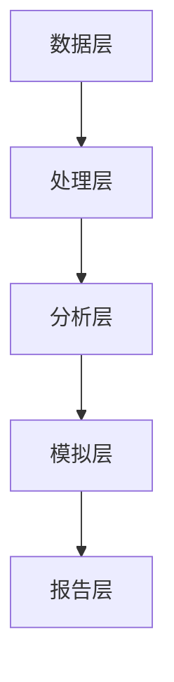
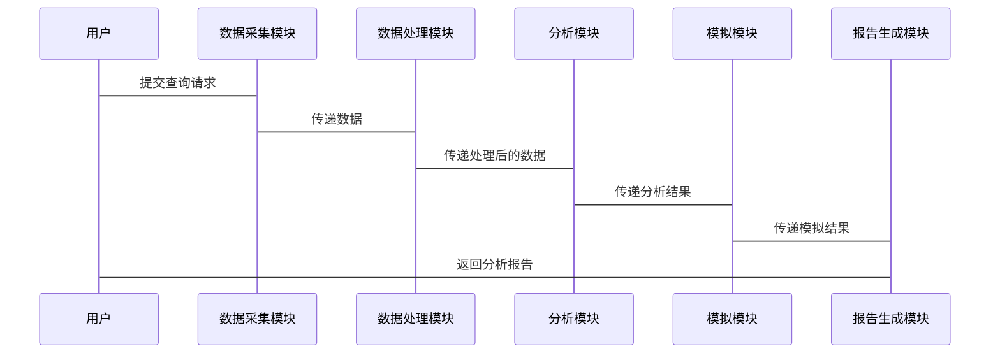

                 


# 价值投资中的AI驱动政府关系分析：多智能体系统

## 关键词：价值投资、AI驱动、政府关系分析、多智能体系统、投资决策、风险评估

## 摘要：  
在价值投资领域，AI驱动的政府关系分析正变得越来越重要。通过多智能体系统，投资者可以更精准地评估政府政策对企业的影响，从而做出更明智的投资决策。本文详细探讨了如何利用多智能体系统进行政府关系分析，从算法原理到系统架构设计，再到项目实战，为读者提供全面的指导。

---

# 第1章: 价值投资与AI驱动政府关系分析概述

## 1.1 价值投资的基本概念

### 1.1.1 价值投资的定义与特点  
价值投资是一种投资策略，旨在通过分析企业的基本面（如财务状况、行业地位、管理团队等）来识别被低估的投资标的。其核心理念是寻找市场定价低于其内在价值的企业。

### 1.1.2 价值投资的核心理念与方法  
价值投资的核心理念是“买便宜的”，即买入价格低于内在价值的资产。其方法包括：  
1. **基本面分析**：通过财务报表、行业分析等方法评估企业的内在价值。  
2. **长期持有**：避免频繁交易，长期持有优质资产以获得复利效应。  
3. **逆向投资**：在市场恐慌时买入，市场狂热时卖出。

### 1.1.3 价值投资与传统投资的区别  
与传统投资（如技术分析）相比，价值投资更注重企业的内在价值，而非市场的短期波动。它强调长期视角和对企业的深入理解。

## 1.2 政府关系分析的背景与重要性

### 1.2.1 政府政策对企业价值的影响  
政府政策（如税收政策、行业监管、货币政策等）直接影响企业的经营环境和盈利能力。例如，政府对某行业的补贴政策可能会显著提升该行业的企业价值。

### 1.2.2 政府关系分析的定义与范围  
政府关系分析是指通过分析政府政策、法律法规、监管动态等，评估这些因素对企业价值的影响。其范围包括：  
1. 行业政策分析：分析政府对特定行业的支持或限制政策。  
2. 法律法规解读：解读新出台的法律法规对企业的影响。  
3. 政策变化预警：预测可能影响企业的政策变化。

### 1.2.3 政府关系分析在投资决策中的作用  
政府关系分析可以帮助投资者更好地评估企业的风险和潜在机会。例如，政府对某行业的支持政策可能为相关企业带来更多的市场机会，而严格的监管政策可能增加企业的合规成本。

## 1.3 AI驱动的政府关系分析的必要性

### 1.3.1 传统政府关系分析的局限性  
传统政府关系分析主要依赖人工解读政策文件和行业报告，存在以下问题：  
1. **效率低**：人工分析耗时耗力，难以应对海量政策信息。  
2. **主观性**：分析结果受分析师主观判断的影响。  
3. **覆盖面窄**：难以全面覆盖所有相关政策信息。

### 1.3.2 AI技术在政府关系分析中的优势  
AI技术可以通过自然语言处理（NLP）、机器学习等技术，自动分析政策文件、新闻报道等非结构化数据，提取关键信息并生成分析结果。其优势包括：  
1. **高效性**：AI可以快速处理海量数据，提高分析效率。  
2. **客观性**：AI分析基于数据，减少主观判断的影响。  
3. **全面性**：AI可以覆盖更多数据源，提供更全面的分析结果。

### 1.3.3 多智能体系统在政府关系分析中的应用前景  
多智能体系统（MAS）是一种由多个相互作用的智能体组成的系统，适用于复杂的分布式问题。在政府关系分析中，可以利用多智能体系统来建模政府、企业、监管机构等不同主体之间的关系，模拟政策变化对企业的影响。

## 1.4 本章小结  
本章介绍了价值投资的基本概念、政府关系分析的背景与重要性，以及AI技术在政府关系分析中的必要性。通过AI驱动的政府关系分析，投资者可以更精准地评估政策风险和机会，从而做出更明智的投资决策。

---

# 第2章: 多智能体系统与政府关系分析

## 2.1 多智能体系统的定义与特点

### 2.1.1 多智能体系统的定义  
多智能体系统（Multi-Agent System, MAS）是由多个智能体（Agent）组成的系统，这些智能体能够自主决策、相互协作或竞争，以实现特定目标。

### 2.1.2 多智能体系统的核心特点  
1. **自主性**：智能体能够自主决策，无需外部干预。  
2. **反应性**：智能体能够实时感知环境并做出反应。  
3. **协作性**：多个智能体可以协作完成复杂任务。  
4. **分布性**：智能体之间通过分布式方式实现目标。

### 2.1.3 多智能体系统与单智能体系统的区别  
单智能体系统由一个中心化的决策单元组成，而多智能体系统由多个分布式智能体组成。多智能体系统更适用于复杂、动态的环境，而单智能体系统适用于简单、静态的环境。

## 2.2 多智能体系统在政府关系分析中的应用

### 2.2.1 政府关系分析的多智能体建模  
在政府关系分析中，可以将政府、企业、监管机构等视为不同的智能体。通过建模这些智能体之间的关系，可以模拟政策变化对企业的影响。

### 2.2.2 多智能体系统在政策解读中的应用  
通过多智能体系统，可以模拟不同政策对企业的影响，帮助投资者更好地理解政策变化对企业价值的影响。

### 2.2.3 多智能体系统在风险评估中的应用  
多智能体系统可以实时监控政策变化，并评估这些变化对企业风险的影响。例如，可以模拟税收政策变化对企业利润的影响。

## 2.3 政府关系分析中的多智能体系统架构

### 2.3.1 政府关系分析的多智能体系统架构概述  
政府关系分析的多智能体系统架构包括以下组件：  
1. **智能体**：代表政府、企业、监管机构等不同主体。  
2. **环境**：模拟政策变化、市场环境等外部因素。  
3. **交互机制**：定义智能体之间的交互规则。  
4. **决策模型**：定义智能体的决策逻辑。

### 2.3.2 各智能体的角色与功能  
1. **政府智能体**：代表政府，模拟政策变化。  
2. **企业智能体**：代表企业，模拟企业对政策变化的反应。  
3. **监管机构智能体**：代表监管机构，模拟监管政策对企业的影响。

### 2.3.3 智能体之间的交互机制  
智能体之间的交互机制可以通过消息传递、状态共享等方式实现。例如，政府智能体可以向企业智能体发布政策变化信息，企业智能体根据政策变化调整其经营策略。

## 2.4 本章小结  
本章介绍了多智能体系统的定义与特点，以及其在政府关系分析中的应用。通过多智能体系统，可以更好地模拟政策变化对企业的影响，为投资者提供更精准的决策支持。

---

# 第3章: AI驱动的政府关系分析算法原理

## 3.1 情感分析与政府关系

### 3.1.1 情感分析的定义与特点  
情感分析是一种自然语言处理技术，用于分析文本中的情感倾向（如积极、消极、中性）。在政府关系分析中，情感分析可以用于分析政府政策的公众反应。

### 3.1.2 政府公告与媒体情感分析  
通过分析政府公告和媒体报道的情感倾向，可以评估公众对政策的支持程度。例如，如果公众对某政策的反应多为负面，可能表明该政策存在较大争议。

### 3.1.3 情感分析在政府关系分析中的应用  
情感分析可以用于：  
1. 政策风险评估：分析公众对政策的反应，评估政策的潜在风险。  
2. 市场情绪分析：分析市场对政策的反应，评估政策对企业价值的影响。

## 3.2 政府关系中的实体关系挖掘

### 3.2.1 实体关系挖掘的定义与方法  
实体关系挖掘是一种自然语言处理技术，用于从文本中提取实体及其关系。在政府关系分析中，实体关系挖掘可以用于分析政府、企业、监管机构之间的关系。

### 3.2.2 政府关系中的实体关系特征  
政府关系中的实体关系特征包括：  
1. **政策制定者与执行者的关系**：分析政策制定者和执行者之间的关系。  
2. **政府与企业的关系**：分析政府与企业之间的合作关系、竞争关系等。  
3. **监管机构与被监管者的关系**：分析监管机构与被监管者之间的关系。

### 3.2.3 实体关系挖掘在投资决策中的应用  
通过实体关系挖掘，可以识别政府与企业之间的关键关系，评估这些关系对企业价值的影响。

## 3.3 基于强化学习的政府关系分析

### 3.3.1 强化学习的定义与特点  
强化学习是一种机器学习技术，通过智能体与环境的交互，学习最优策略。在政府关系分析中，强化学习可以用于模拟政策变化对企业的影响。

### 3.3.2 强化学习在政府关系分析中的应用  
通过强化学习，可以模拟不同政策对企业的影响，帮助投资者更好地理解政策变化对企业价值的影响。

### 3.3.3 强化学习算法的实现与优化  
强化学习算法的实现包括：  
1. **状态空间**：定义智能体的状态（如政策变化、市场环境等）。  
2. **动作空间**：定义智能体的可能动作（如调整经营策略、投资决策等）。  
3. **奖励函数**：定义智能体的奖励机制，鼓励智能体做出最优决策。

## 3.4 本章小结  
本章介绍了情感分析、实体关系挖掘和强化学习在政府关系分析中的应用。通过这些算法，可以更好地理解和预测政策变化对企业的影响。

---

# 第4章: 政府关系分析的系统架构设计

## 4.1 系统功能设计

### 4.1.1 政府关系分析系统的功能  
政府关系分析系统的功能包括：  
1. **政策解读**：自动解读政府政策文件。  
2. **情感分析**：分析政策文件的情感倾向。  
3. **实体关系挖掘**：提取政策文件中的实体及其关系。  
4. **政策模拟**：模拟政策变化对企业的影响。  
5. **风险评估**：评估政策变化对企业风险的影响。

### 4.1.2 系统功能模块  
政府关系分析系统可以划分为以下几个功能模块：  
1. **数据采集模块**：采集政府政策文件、媒体报道等数据。  
2. **数据处理模块**：对采集的数据进行清洗、预处理。  
3. **分析模块**：包括情感分析、实体关系挖掘等功能。  
4. **模拟模块**：模拟政策变化对企业的影响。  
5. **报告生成模块**：生成分析报告。

## 4.2 系统架构设计

### 4.2.1 系统架构设计概述  
政府关系分析系统的架构设计包括以下几个部分：  
1. **数据层**：存储政府政策文件、媒体报道等数据。  
2. **处理层**：对数据进行清洗、预处理。  
3. **分析层**：包括情感分析、实体关系挖掘等功能。  
4. **模拟层**：模拟政策变化对企业的影响。  
5. **报告层**：生成分析报告。

### 4.2.2 系统架构图  
以下是一个政府关系分析系统的架构图：



### 4.2.3 系统接口设计  
系统接口设计包括：  
1. **数据接口**：与数据源（如政府网站、新闻网站）对接，获取数据。  
2. **用户接口**：供用户输入查询条件，输出分析报告。  
3. **API接口**：供其他系统调用分析结果。

### 4.2.4 系统交互设计  
以下是一个政府关系分析系统的交互流程图：



## 4.3 本章小结  
本章介绍了政府关系分析系统的功能设计和架构设计。通过合理的系统架构设计，可以提高分析效率和准确性，为投资者提供更精准的决策支持。

---

# 第5章: 项目实战

## 5.1 环境安装与配置

### 5.1.1 系统运行环境  
政府关系分析系统的运行环境包括：  
1. **操作系统**：Linux/Windows/MacOS  
2. **编程语言**：Python  
3. **依赖库**：如NLTK、spaCy、TensorFlow等。

### 5.1.2 安装依赖库  
安装以下依赖库：  
```bash
pip install nltk spacy tensorflow
```

### 5.1.3 配置API接口  
配置数据接口和API接口，确保系统能够顺利获取数据和调用分析结果。

## 5.2 核心代码实现

### 5.2.1 数据采集模块  
数据采集模块用于采集政府政策文件和媒体报道。以下是数据采集模块的代码示例：

```python
import requests
from bs4 import BeautifulSoup

def fetch_data(url):
    response = requests.get(url)
    soup = BeautifulSoup(response.text, 'html.parser')
    content = soup.get_text()
    return content
```

### 5.2.2 数据处理模块  
数据处理模块用于清洗和预处理数据。以下是数据处理模块的代码示例：

```python
import nltk
from nltk.corpus import stopwords

def preprocess_data(text):
    tokens = nltk.word_tokenize(text)
    tokens = [token.lower() for token in tokens]
    tokens = [token for token in tokens if token not in stopwords.words('english')]
    return tokens
```

### 5.2.3 情感分析模块  
情感分析模块用于分析政策文件和媒体报道的情感倾向。以下是情感分析模块的代码示例：

```python
from tensorflow.keras.models import Sequential
from tensorflow.keras.layers import Dense

def sentiment_analysis(model, text):
    input_features = preprocess_data(text)
    prediction = model.predict([input_features])
    return 'positive' if prediction[0] > 0.5 else 'negative'
```

### 5.2.4 实体关系挖掘模块  
实体关系挖掘模块用于提取政策文件中的实体及其关系。以下是实体关系挖掘模块的代码示例：

```python
import spacy

nlp = spacy.load("en_core_web_sm")

def extract_entities(text):
    doc = nlp(text)
    entities = [ent.text for ent in doc.ents]
    return entities
```

### 5.2.5 政策模拟模块  
政策模拟模块用于模拟政策变化对企业的影响。以下是政策模拟模块的代码示例：

```python
def policy_simulation(policy_change, current_state):
    # 根据政策变化和当前状态，模拟企业经营策略
    new_state = current_state.copy()
    new_state['profit'] = new_state['profit'] * (1 + policy_change['tax_rate'])
    return new_state
```

## 5.3 案例分析与详细解读

### 5.3.1 案例背景  
假设我们分析某国政府对科技行业的税收政策变化。政府计划提高科技行业的企业税税率，这可能对科技企业的利润产生重大影响。

### 5.3.2 数据采集与处理  
通过数据采集模块，我们获取了政府发布的税收政策文件和相关新闻报道。通过数据处理模块，我们对文本数据进行了清洗和预处理。

### 5.3.3 情感分析  
通过情感分析模块，我们发现公众对税收政策变化的反应多为负面，这表明该政策可能面临较大的公众反对。

### 5.3.4 实体关系挖掘  
通过实体关系挖掘模块，我们识别了政府与科技企业之间的关系，发现政府与多家大型科技企业有密切合作关系。

### 5.3.5 政策模拟  
通过政策模拟模块，我们模拟了税收政策变化对企业利润的影响。结果显示，税率提高可能导致企业利润下降，从而影响企业价值。

### 5.3.6 投资决策建议  
基于以上分析，我们建议投资者在政策变化前调整投资组合，减少对受政策影响较大的科技企业的投资。

## 5.4 本章小结  
本章通过一个实际案例，详细介绍了政府关系分析系统的实现过程。通过数据采集、处理、分析和模拟，投资者可以更好地理解政策变化对企业的影响，从而做出更明智的投资决策。

---

# 第6章: 最佳实践与未来展望

## 6.1 最佳实践

### 6.1.1 数据质量的重要性  
数据质量是政府关系分析系统的核心。确保数据的准确性和完整性，可以提高分析结果的可靠性。

### 6.1.2 模型优化的技巧  
通过不断优化模型参数和调整算法结构，可以提高分析系统的准确性和效率。

### 6.1.3 系统维护与更新  
政府政策和市场环境不断变化，需要定期更新系统数据和模型，确保系统的适应性。

## 6.2 未来展望

### 6.2.1 AI技术的进一步发展  
随着AI技术的进一步发展，政府关系分析系统将更加智能化和自动化。

### 6.2.2 多智能体系统的广泛应用  
多智能体系统将在政府关系分析中得到更广泛的应用，帮助投资者更好地应对复杂多变的政策环境。

### 6.2.3 全球化背景下的挑战与机遇  
在全球化背景下，政府关系分析将面临更多的挑战和机遇。投资者需要更加关注跨国政策变化，利用AI技术更好地应对全球化挑战。

## 6.3 本章小结  
本章总结了政府关系分析系统的最佳实践，并展望了未来的发展方向。通过不断优化系统和利用新技术，投资者可以更好地应对政策变化，实现更高效的投资决策。

---

# 结语

政府关系分析是价值投资中的重要环节，而AI驱动的多智能体系统为政府关系分析提供了新的思路和方法。通过本文的介绍，读者可以更好地理解如何利用AI技术进行政府关系分析，从而做出更明智的投资决策。

---

# 作者：AI天才研究院 & 禅与计算机程序设计艺术

