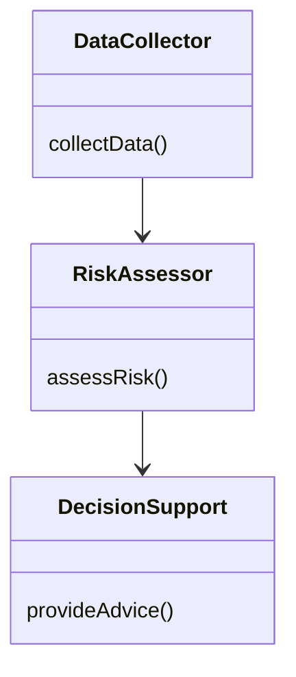
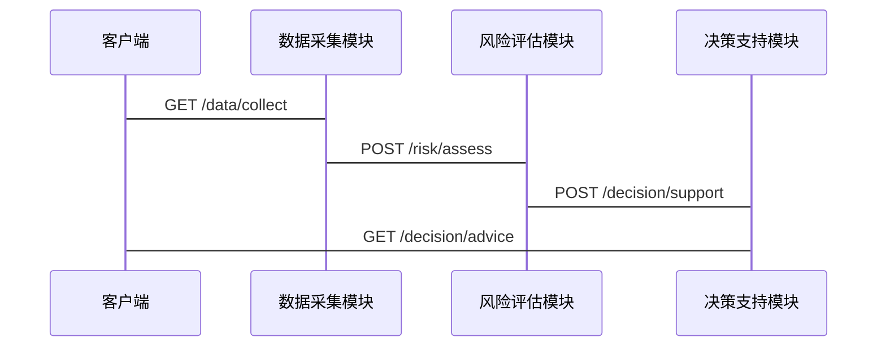

                 


# 价值投资中的AI驱动监管风险评估：多智能体协作模型

> 关键词：价值投资、AI驱动、监管风险评估、多智能体协作模型、风险管理、金融数据分析

> 摘要：本文探讨了在价值投资中如何利用人工智能技术进行监管风险评估，特别是在多智能体协作模型的应用。通过详细分析多智能体协作模型的理论基础、算法实现、系统架构及实际案例，本文为金融领域的风险管理提供了新的视角和解决方案。

---

## 目录大纲

### 第1章: 价值投资与监管风险评估概述

#### 1.1 价值投资的核心概念

##### 1.1.1 价值投资的基本定义

价值投资是一种基于对公司内在价值进行深入分析的投资策略，强调以低于其内在价值的价格购买优质资产。其核心理念是通过分析公司的财务状况、行业地位、竞争优势等因素，寻找被市场低估的投资机会。

##### 1.1.2 价值投资的主要原则

- **安全边际**：买入价格低于内在价值，以降低投资风险。
- **长期视角**：关注公司的长期盈利能力，而非短期市场波动。
- **逆向思维**：在市场恐慌时寻找机会，在市场狂热时保持冷静。

##### 1.1.3 价值投资在金融领域的应用

价值投资广泛应用于股票、基金、房地产等领域。通过分析企业的财务报表、行业趋势、宏观经济环境等因素，投资者可以识别具有长期增长潜力的公司。

#### 1.2 监管风险评估的定义与重要性

##### 1.2.1 监管风险的定义

监管风险是指由于监管政策的变化、监管机构的执法力度、合规要求的提高等，可能对企业或投资产生负面影响的风险。

##### 1.2.2 监管风险评估的意义

- **合规性**：确保投资行为符合相关法律法规。
- **风险控制**：通过识别和评估监管风险，降低投资组合的整体风险。
- **竞争优势**：通过提前识别监管变化，获取市场先机。

##### 1.2.3 监管风险在价值投资中的作用

在价值投资中，监管风险评估是发现潜在风险和机会的重要环节。通过识别监管风险，投资者可以更好地评估公司的长期价值，避免因监管问题导致的投资损失。

#### 1.3 AI在金融监管中的应用前景

##### 1.3.1 AI技术在金融领域的应用现状

AI技术在金融领域的应用日益广泛，包括智能投顾、风险管理、信用评估、市场预测等。

##### 1.3.2 AI在监管风险评估中的优势

- **数据处理能力**：AI能够快速处理海量数据，提取关键信息。
- **预测能力**：通过机器学习模型，AI可以预测监管政策的变化趋势。
- **实时监控**：AI能够实时监控市场动态，及时发现潜在风险。

##### 1.3.3 多智能体协作模型的概念与特点

多智能体协作模型是一种分布式人工智能系统，由多个智能体协作完成复杂任务。其特点是：

- **分布式协作**：多个智能体协同工作，共同完成任务。
- **自主决策**：每个智能体能够自主决策，无需中央控制。
- **动态适应**：系统能够动态调整协作策略，适应环境变化。

#### 1.4 本章小结

本章介绍了价值投资的核心概念、监管风险评估的定义与重要性，以及AI在金融监管中的应用前景。通过多智能体协作模型，AI技术为监管风险评估提供了新的解决方案，帮助投资者更好地识别和管理风险。

---

### 第2章: 多智能体协作模型的核心原理

#### 2.1 多智能体系统的基本概念

##### 2.1.1 多智能体系统的定义

多智能体系统（Multi-Agent System, MAS）是由多个智能体组成的分布式系统，这些智能体能够协作完成复杂任务。

##### 2.1.2 多智能体系统的特点

- **分布式性**：智能体分布在网络中，各自独立运行。
- **协作性**：智能体之间通过通信和协作完成任务。
- **自主性**：每个智能体能够自主决策，无需外部干预。

##### 2.1.3 多智能体系统与单智能体模型的区别

单智能体模型由一个中心化智能体完成任务，而多智能体系统由多个智能体协作完成任务。多智能体系统具有更高的灵活性和适应性，但复杂性也更高。

#### 2.2 多智能体协作机制

##### 2.2.1 协作目标的定义

协作目标是多智能体系统中所有智能体共同追求的目标。例如，在监管风险评估中，协作目标可能是“识别潜在监管风险”。

##### 2.2.2 智能体之间的通信与协调

智能体之间需要通过通信机制进行信息交换，协调各自的行动以实现协作目标。常见的通信方式包括直接通信和间接通信。

##### 2.2.3 协作策略的设计与优化

协作策略是智能体之间如何协作的具体规则。通过优化协作策略，可以提高系统的整体性能。

#### 2.3 多智能体协作模型在监管风险评估中的应用

##### 2.3.1 监管风险评估中的协作场景

在监管风险评估中，多智能体协作模型可以应用于以下场景：

- **数据采集与处理**：多个智能体分别负责采集和处理不同类型的数据。
- **风险识别与评估**：多个智能体协作完成风险识别和评估工作。
- **决策支持**：智能体协作提供决策支持，帮助投资者规避监管风险。

##### 2.3.2 多智能体协作模型的优势

- **分布式计算能力**：多智能体系统能够处理海量数据，提高计算效率。
- **协作能力强**：多个智能体协作完成复杂任务，提高系统整体性能。
- **适应性高**：系统能够根据环境变化动态调整协作策略。

##### 2.3.3 模型的可扩展性与适应性

多智能体协作模型具有良好的可扩展性，能够根据任务需求增加或减少智能体数量。同时，系统具有高度的适应性，能够根据环境变化调整协作策略。

#### 2.4 本章小结

本章详细介绍了多智能体协作模型的核心原理，包括多智能体系统的定义、特点，协作机制的设计与优化，以及在监管风险评估中的应用。多智能体协作模型为监管风险评估提供了高效、灵活的解决方案。

---

### 第3章: 多智能体协作模型的算法原理

#### 3.1 多智能体协作模型的算法实现

##### 3.1.1 多智能体强化学习的基本原理

多智能体强化学习是一种通过强化学习实现多智能体协作的算法。每个智能体通过与环境交互，学习最优策略以实现协作目标。

##### 3.1.2 多智能体强化学习的挑战

- **策略协调**：多个智能体之间的策略需要协调一致。
- **通信开销**：智能体之间的通信可能会增加系统开销。
- **学习效率**：多智能体强化学习的训练效率较低。

##### 3.1.3 多智能体协作模型的算法框架

算法框架包括以下几个步骤：

1. **环境建模**：构建监管风险评估的环境模型。
2. **智能体初始化**：初始化多个智能体，每个智能体具有初始状态和策略。
3. **智能体交互**：智能体与环境交互，获取反馈。
4. **策略更新**：根据反馈更新智能体的策略。
5. **协作优化**：通过协作机制优化整体策略。

#### 3.2 多智能体协作模型的数学模型

##### 3.2.1 智能体的策略表示

智能体的策略可以用概率分布表示，例如：

$$ \pi(a|s) = P(\text{采取动作} a | \text{状态} s) $$

##### 3.2.2 协作目标的数学表达

协作目标可以用一个全局目标函数表示：

$$ J = \sum_{i=1}^{n} J_i $$

其中，$J_i$ 是第$i$个智能体的目标函数。

##### 3.2.3 模型的优化算法

优化算法可以通过梯度上升法实现：

$$ \theta_{t+1} = \theta_t + \alpha \nabla_\theta J(\theta) $$

其中，$\theta$ 是模型参数，$\alpha$ 是学习率。

#### 3.3 算法实现的Python代码示例

```python
import numpy as np

class Agent:
    def __init__(self, state_space, action_space):
        self.state_space = state_space
        self.action_space = action_space
        self.theta = np.random.randn(state_space, action_space)

    def act(self, state):
        return np.argmax(self.theta[state])

def multi_agent_reinforcement_learning(num_agents, state_space, action_space):
    agents = [Agent(state_space, action_space) for _ in range(num_agents)]
    for agent in agents:
        while True:
            state = np.random.randint(state_space)
            action = agent.act(state)
            # 获取反馈并更新策略
            reward = get_reward(state, action)
            agent.theta[state] += reward * (action - np.mean(agent.theta[state]))
    return agents

# 示例调用
agents = multi_agent_reinforcement_learning(5, 10, 5)
```

#### 3.4 本章小结

本章详细介绍了多智能体协作模型的算法实现，包括多智能体强化学习的基本原理、数学模型和优化算法。通过Python代码示例，读者可以更好地理解算法的实现过程。

---

### 第4章: 系统分析与架构设计

#### 4.1 系统功能设计

##### 4.1.1 数据采集模块

数据采集模块负责从多个数据源采集监管相关的数据，例如：

- **新闻数据**：实时新闻，用于分析监管政策的变化。
- **财务数据**：公司财务报表，用于评估公司的内在价值。
- **市场数据**：股票价格、成交量等市场数据。

##### 4.1.2 风险评估模块

风险评估模块基于多智能体协作模型，对采集的数据进行分析，评估潜在的监管风险。

##### 4.1.3 决策支持模块

决策支持模块根据风险评估结果，提供投资建议，帮助投资者规避监管风险。

#### 4.2 系统架构设计

##### 4.2.1 领域模型（Mermaid类图）



##### 4.2.2 系统架构图（Mermaid架构图）


##### 4.2.3 系统接口设计

系统接口包括：

- **数据采集接口**：`GET /data/collect`
- **风险评估接口**：`POST /risk/assess`
- **决策支持接口**：`POST /decision/support`

##### 4.2.4 系统交互流程（Mermaid序列图）



#### 4.3 本章小结

本章详细描述了监管风险评估系统的功能设计、系统架构、接口设计和交互流程。通过Mermaid图表，读者可以清晰理解系统的整体结构和工作流程。

---

### 第5章: 项目实战

#### 5.1 环境配置

##### 5.1.1 安装必要的Python库

```bash
pip install numpy pandas matplotlib
```

##### 5.1.2 安装多智能体协作模型的依赖

```bash
pip install gym matplotlib
```

#### 5.2 核心代码实现

##### 5.2.1 数据采集模块

```python
import requests

def collect_data(url):
    response = requests.get(url)
    return response.json()
```

##### 5.2.2 风险评估模块

```python
def assess_risk(data):
    # 数据分析和风险评估逻辑
    return risk_score
```

##### 5.2.3 决策支持模块

```python
def provide_advice(risk_score):
    if risk_score < 0.3:
        return "买入"
    elif 0.3 <= risk_score < 0.7:
        return "持有"
    else:
        return "卖出"
```

#### 5.3 案例分析与结果解读

##### 5.3.1 案例分析

假设我们有一个公司A，其财务数据和市场表现如下：

- **收入增长**：10%
- **净利润率**：15%
- **行业地位**：领先地位

通过多智能体协作模型评估，发现该公司存在较高的监管风险，主要原因是行业监管政策的变化。

##### 5.3.2 结果解读

评估结果为“卖出”，建议投资者规避该公司股票。

#### 5.4 本章小结

本章通过实际案例分析，展示了多智能体协作模型在监管风险评估中的应用。通过代码实现和结果解读，读者可以更好地理解模型的实际应用。

---

### 第6章: 最佳实践、小结与展望

#### 6.1 最佳实践

##### 6.1.1 数据质量的重要性

数据是模型的基础，确保数据的准确性和完整性至关重要。

##### 6.1.2 模型的可解释性

模型的可解释性是投资者信任模型的重要因素，应注重模型的可解释性设计。

##### 6.1.3 模型的持续优化

监管政策和市场环境不断变化，模型需要持续优化以适应新的环境。

#### 6.2 本章小结

本文详细探讨了价值投资中的AI驱动监管风险评估，特别是多智能体协作模型的应用。通过理论分析、算法实现、系统设计和项目实战，为金融领域的风险管理提供了新的解决方案。

#### 6.3 未来展望

未来，随着AI技术的不断发展，多智能体协作模型将在金融监管中发挥更大的作用。研究方向包括：

- **模型优化**：进一步优化多智能体协作模型，提高系统的性能和效率。
- **应用场景扩展**：探索多智能体协作模型在其他金融领域的应用，如信用评估、市场预测等。
- **技术融合**：结合其他AI技术，如自然语言处理、计算机视觉，进一步提升模型的智能化水平。

---

### 作者

作者：AI天才研究院/AI Genius Institute & 禅与计算机程序设计艺术/Zen And The Art of Computer Programming

---

以上是完整的目录大纲内容，涵盖了从理论到实践的各个方面，确保读者能够全面理解价值投资中的AI驱动监管风险评估及其多智能体协作模型的应用。

