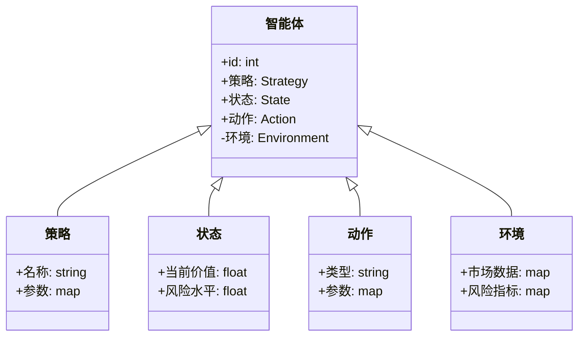
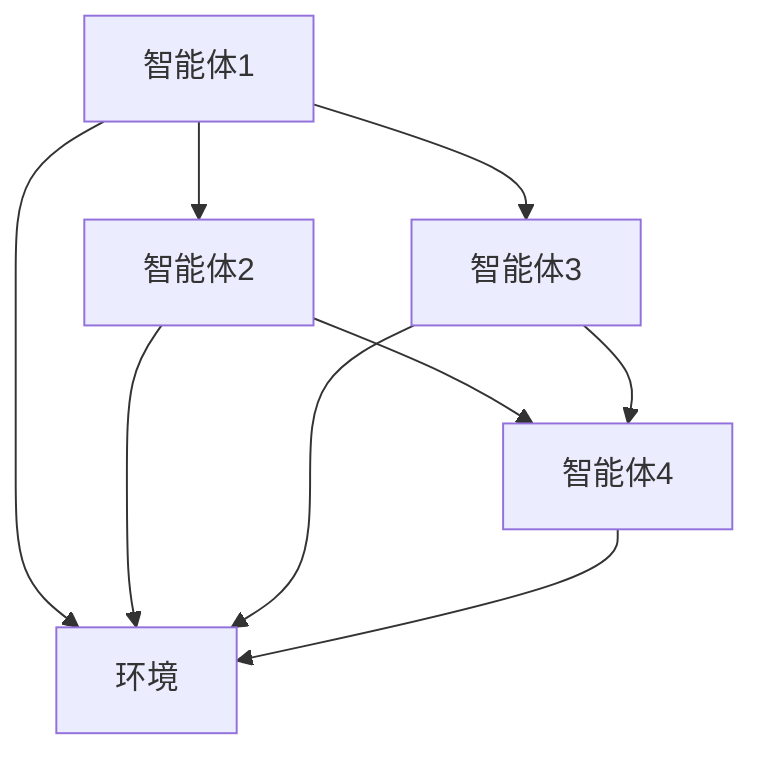
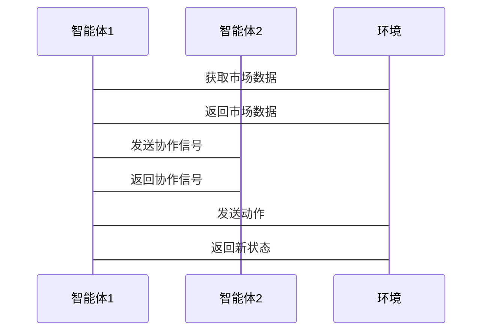

                 


# 多智能体AI如何增强价值投资的跨资产类别配置

## 关键词：多智能体AI、价值投资、跨资产配置、投资组合优化、风险管理、金融建模、机器学习算法

## 摘要：
本文探讨了多智能体AI在价值投资中的应用，特别是如何通过跨资产类别配置提升投资组合的收益与风险控制。文章从多智能体系统的基本概念出发，分析其在金融投资中的优势，详细讲解多智能体AI的核心算法和系统架构，结合实际案例，展示如何通过多智能体AI优化投资组合，平衡风险与收益。最后，文章总结了多智能体AI在金融投资中的潜力和未来发展方向。

---

# 第1章：多智能体系统与价值投资概述

## 1.1 多智能体系统的定义与特点

### 1.1.1 多智能体系统的定义
多智能体系统（Multi-Agent Systems, MAS）是由多个智能体组成的分布式系统，这些智能体通过协作或竞争完成复杂任务。与单智能体系统相比，多智能体系统具有更高的灵活性和适应性。

### 1.1.2 多智能体系统的特征
- **分布式性**：多个智能体分布在不同的位置，独立决策。
- **协作性**：智能体之间可以通过通信协作完成共同目标。
- **反应性**：智能体能够根据环境反馈实时调整行为。
- **动态性**：系统能够适应环境变化。

### 1.1.3 多智能体系统与传统单智能体系统的区别
- **决策中心化 vs 分散化**：单智能体系统由一个中心决策者控制，而多智能体系统由多个智能体独立决策。
- **计算复杂度**：多智能体系统通常需要处理更高的计算复杂度。
- **适应性**：多智能体系统在动态环境中更具适应性。

## 1.2 价值投资的基本概念

### 1.2.1 价值投资的定义
价值投资是一种投资策略，旨在通过分析资产的内在价值，寻找被市场低估的投资机会。

### 1.2.2 价值投资的核心理念
- **安全边际**：买入价格低于资产的内在价值。
- **长期视角**：关注长期收益而非短期波动。
- **基本面分析**：通过分析财务报表等基本面数据评估资产价值。

### 1.2.3 价值投资与其它投资策略的对比
- **技术分析**：基于价格和成交量等技术指标进行交易。
- **趋势投资**：跟随市场趋势进行投资。
- **价值投资**：基于资产的内在价值进行投资。

## 1.3 跨资产类别配置的重要性

### 1.3.1 跨资产配置的定义
跨资产配置是指在不同的资产类别（如股票、债券、商品等）之间分配资金，以优化投资组合的风险和收益。

### 1.3.2 跨资产配置的优势
- **风险分散**：通过投资不同资产类别降低风险。
- **收益增强**：利用不同资产类别的相关性差异提升收益。
- **适应性**：在市场变化中灵活调整资产配置。

### 1.3.3 跨资产配置的风险与挑战
- **相关性风险**：不同资产类别之间的相关性可能较高，影响风险分散效果。
- **流动性风险**：某些资产类别可能流动性较低，影响快速调整配置的能力。
- **市场周期性**：资产类别表现可能受市场周期影响，影响配置效果。

---

# 第2章：多智能体AI在金融领域的应用背景

## 2.1 金融领域的复杂性与挑战

### 2.1.1 金融市场的主要特点
- **高度波动性**：市场价格波动频繁且不可预测。
- **信息不对称**：市场参与者掌握的信息不一致。
- **复杂性**：金融市场涉及众多参与者和变量，关系复杂。

### 2.1.2 金融投资中的不确定性
- **市场风险**：市场价格波动带来的风险。
- **信用风险**：债券发行人违约的风险。
- **流动性风险**：资产无法快速变现的风险。

### 2.1.3 传统金融模型的局限性
- **假设简化**：传统模型通常假设市场有效性和理性投资者，但实际情况更为复杂。
- **黑天鹅事件**：极端事件难以被传统模型预测。
- **计算能力限制**：传统模型在处理海量数据时计算效率较低。

## 2.2 多智能体AI的优势与潜力

### 2.2.1 多智能体AI在金融分析中的优势
- **分布式计算**：多智能体系统可以同时处理大量数据，提高计算效率。
- **协作与竞争**：通过智能体之间的协作与竞争，可以发现更多潜在的市场机会。
- **适应性**：多智能体系统能够快速适应市场变化。

### 2.2.2 多智能体AI在投资决策中的潜力
- **实时数据分析**：多智能体系统可以实时分析市场数据，提供实时投资建议。
- **复杂决策**：通过多个智能体协作，可以做出更复杂的决策。
- **风险管理**：通过智能体之间的协作，可以更有效地管理投资风险。

### 2.2.3 多智能体AI在风险控制中的应用
- **实时监控**：多智能体系统可以实时监控市场风险，及时发出预警。
- **情景分析**：通过智能体之间的协作，可以进行多种市场情景的模拟分析。
- **动态调整**：根据市场变化动态调整投资策略。

---

# 第3章：多智能体AI如何增强价值投资

## 3.1 多智能体AI在价值评估中的作用

### 3.1.1 多智能体AI对资产价值的深度分析
- **数据挖掘**：通过多智能体系统挖掘海量数据，发现潜在的价值信号。
- **模式识别**：识别市场中的隐藏模式，发现被低估的资产。
- **实时更新**：根据市场变化实时更新资产价值评估。

### 3.1.2 多智能体AI对市场情绪的预测
- **情绪分析**：通过自然语言处理技术分析市场情绪。
- **行为建模**：通过智能体模拟投资者行为，预测市场情绪变化。

### 3.1.3 多智能体AI对资产风险的评估
- **风险建模**：通过智能体协作建模资产风险。
- **情景分析**：模拟不同市场情景下的风险表现。
- **实时监控**：实时监控资产风险，及时发出预警。

## 3.2 多智能体AI在投资组合优化中的应用

### 3.2.1 多智能体AI如何优化资产配置
- **多目标优化**：通过多智能体系统实现风险与收益的多目标优化。
- **动态调整**：根据市场变化动态调整资产配置。
- **协作决策**：通过智能体协作做出最优资产配置决策。

### 3.2.2 多智能体AI如何平衡风险与收益
- **风险收益权衡**：通过智能体协作实现风险与收益的最优权衡。
- **动态再平衡**：根据市场变化动态再平衡投资组合。
- **风险分散**：通过跨资产配置分散投资风险。

### 3.2.3 多智能体AI在动态调整投资组合中的应用
- **实时监控**：实时监控投资组合的表现，及时调整。
- **情景模拟**：通过情景模拟预测不同市场条件下的投资组合表现。
- **自适应优化**：根据市场变化自适应优化投资组合。

---

# 第4章：跨资产类别配置的多智能体AI模型

## 4.1 跨资产类别配置的基本原理

### 4.1.1 跨资产配置的核心目标
- **最大化收益**：在给定风险水平下最大化收益。
- **最小化风险**：在给定收益水平下最小化风险。
- **风险收益平衡**：实现风险与收益的最优平衡。

### 4.1.2 跨资产配置的主要策略
- **资产分散化**：通过投资不同资产类别降低风险。
- **资产轮动**：根据市场变化动态调整资产配置。
- **资产对冲**：通过做空部分资产对冲风险。

### 4.1.3 跨资产配置的数学模型
- **均值-方差优化**：通过均值-方差模型优化投资组合。
- **风险平价**：通过风险平价方法分配资产权重。
- **因子模型**：通过因子模型分析资产收益和风险。

## 4.2 多智能体AI在跨资产配置中的具体应用

### 4.2.1 多智能体AI对不同资产类别的分析
- **股票分析**：通过智能体分析个股的基本面和技术面。
- **债券分析**：通过智能体分析债券的信用风险和市场风险。
- **商品分析**：通过智能体分析大宗商品的供需和价格走势。

### 4.2.2 多智能体AI对资产间相关性的建模
- **相关性分析**：通过智能体分析不同资产类别之间的相关性。
- **相关性预测**：通过智能体预测未来资产之间的相关性变化。
- **相关性动态调整**：根据相关性变化动态调整资产配置。

### 4.2.3 多智能体AI对资产配置的动态优化
- **动态优化算法**：通过智能体协作实现动态优化。
- **实时调整**：根据市场变化实时调整资产配置。
- **情景模拟**：通过情景模拟预测不同市场条件下的资产配置效果。

---

# 第5章：多智能体AI算法的核心原理

## 5.1 强化学习在多智能体AI中的应用

### 5.1.1 强化学习的基本原理
- **奖励机制**：智能体通过与环境交互获得奖励，学习最优策略。
- **状态空间**：智能体所处的状态空间。
- **动作空间**：智能体可以执行的动作。

### 5.1.2 多智能体强化学习的挑战与解决方案
- **协作与竞争**：多智能体系统中智能体之间需要协作或竞争。
- **通信与协调**：智能体之间需要通过通信协调行动。
- **学习效率**：多智能体强化学习需要更高的计算资源和更长的学习时间。

### 5.1.3 多智能体强化学习在金融投资中的应用案例
- **股票交易**：通过多智能体强化学习实现股票交易策略优化。
- **资产配置**：通过多智能体强化学习优化投资组合配置。

## 5.2 多智能体博弈论模型

### 5.2.1 博弈论的基本概念
- **博弈论**：研究理性决策者之间策略互动的理论。
- **纳什均衡**：所有参与方都采取最佳策略，使得没有任何一方有动机单方面改变策略。

### 5.2.2 多智能体博弈论模型的构建
- **博弈树**：表示所有可能的决策路径。
- **收益矩阵**：表示不同策略组合下的收益情况。
- **纳什均衡分析**：分析不同策略组合下的纳什均衡。

### 5.2.3 多智能体博弈论模型在金融投资中的应用
- **市场博弈**：通过博弈论模型分析市场参与者的策略互动。
- **价格预测**：通过博弈论模型预测市场价格变化。
- **风险控制**：通过博弈论模型分析市场风险。

---

# 第6章：系统分析与架构设计方案

## 6.1 问题场景介绍

### 6.1.1 价值投资中的问题分析
- **数据量大**：金融市场数据量庞大，难以处理。
- **信息不完全**：投资者掌握的信息不完全，影响决策。
- **市场波动性高**：市场价格波动频繁，增加投资难度。

### 6.1.2 跨资产配置中的问题
- **资产相关性高**：不同资产类别之间的相关性较高，影响风险分散效果。
- **市场周期性**：资产类别表现受市场周期影响，影响配置效果。
- **计算复杂度高**：跨资产配置需要处理大量的数据和复杂的计算。

## 6.2 系统功能设计

### 6.2.1 领域模型类图


### 6.2.2 系统架构图


### 6.2.3 系统交互序列图


## 6.3 系统接口设计

### 6.3.1 系统接口
- **数据接口**：与数据源（如股票市场数据）对接。
- **用户接口**：供用户输入指令和查看结果。
- **智能体接口**：智能体之间的通信接口。

### 6.3.2 接口设计
- **数据接口**：提供数据获取和更新接口。
- **用户接口**：提供用户输入和输出接口。
- **智能体接口**：提供智能体之间的通信和协作接口。

## 6.4 系统交互设计

### 6.4.1 系统交互流程
- **数据获取**：智能体从环境获取市场数据。
- **智能体协作**：智能体之间通过通信协作完成任务。
- **决策制定**：智能体根据协作结果制定决策。
- **执行决策**：智能体执行决策并更新状态。

### 6.4.2 交互设计
- **通信协议**：智能体之间使用特定协议进行通信。
- **协作机制**：智能体之间通过协作机制达成共识。
- **决策机制**：智能体根据协作结果制定决策。

---

# 第7章：项目实战

## 7.1 环境安装

### 7.1.1 安装Python
```bash
python --version
pip install --upgrade pip
```

### 7.1.2 安装相关库
```bash
pip install numpy pandas scikit-learn tensorflow
```

## 7.2 系统核心实现源代码

### 7.2.1 智能体类
```python
class Agent:
    def __init__(self, id):
        self.id = id
        self.strategy = None
        self.state = None
        self.action = None
        self.environment = None

    def set_strategy(self, strategy):
        self.strategy = strategy

    def set_state(self, state):
        self.state = state

    def set_action(self, action):
        self.action = action

    def set_environment(self, environment):
        self.environment = environment
```

### 7.2.2 策略类
```python
class Strategy:
    def __init__(self, name, parameters):
        self.name = name
        self.parameters = parameters

    def execute(self, agent):
        # 根据策略参数制定动作
        pass
```

### 7.2.3 状态类
```python
class State:
    def __init__(self, current_value, risk_level):
        self.current_value = current_value
        self.risk_level = risk_level
```

### 7.2.4 动作类
```python
class Action:
    def __init__(self, type, parameters):
        self.type = type
        self.parameters = parameters
```

### 7.2.5 环境类
```python
class Environment:
    def __init__(self, market_data, risk_indicators):
        self.market_data = market_data
        self.risk_indicators = risk_indicators

    def update_market_data(self, new_data):
        self.market_data = new_data
```

## 7.3 代码应用解读与分析

### 7.3.1 智能体协作
```python
agent1 = Agent(1)
agent2 = Agent(2)
agent1.set_environment(environment)
agent2.set_environment(environment)
agent1.set_strategy(strategy1)
agent2.set_strategy(strategy2)
agent1.set_state(initial_state)
agent2.set_state(initial_state)
```

### 7.3.2 动作执行
```python
agent1.set_action(action1)
agent2.set_action(action2)
environment.execute_actions([action1, action2])
environment.update_market_data(new_data)
```

## 7.4 实际案例分析和详细讲解

### 7.4.1 案例背景
假设我们有两只股票A和B，我们需要通过多智能体AI优化投资组合配置。

### 7.4.2 数据准备
```python
import pandas as pd
import numpy as np

data = pd.DataFrame({
    'price_A': [10, 20, 30, 40, 50],
    'price_B': [20, 40, 60, 80, 100]
})
```

### 7.4.3 智能体配置
```python
agent1 = Agent(1)
agent2 = Agent(2)
environment = Environment(data, {'risk_A': 0.1, 'risk_B': 0.2})
```

### 7.4.4 动作执行
```python
action1 = Action('buy', {'asset': 'A', 'quantity': 1})
action2 = Action('sell', {'asset': 'B', 'quantity': 1})
agent1.set_action(action1)
agent2.set_action(action2)
environment.execute_actions([action1, action2])
```

## 7.5 项目小结

### 7.5.1 项目总结
通过多智能体AI优化投资组合配置，可以实现风险与收益的最优平衡。

### 7.5.2 经验与教训
- **计算复杂度**：多智能体AI需要处理更高的计算复杂度。
- **通信效率**：智能体之间的通信效率影响系统性能。
- **模型选择**：不同策略和模型对系统性能影响显著。

### 7.5.3 改进建议
- **优化算法**：进一步优化多智能体AI算法，提高计算效率。
- **改进通信机制**：优化智能体之间的通信机制，提高协作效率。
- **完善模型**：不断完善和优化模型，提高预测准确性。

---

# 第8章：最佳实践、小结、注意事项与拓展阅读

## 8.1 最佳实践

### 8.1.1 系统设计
- **模块化设计**：系统设计应尽量模块化，便于维护和扩展。
- **容错设计**：设计容错机制，提高系统稳定性。
- **性能优化**：通过优化算法和数据结构提高系统性能。

### 8.1.2 模型选择
- **选择合适模型**：根据具体问题选择合适的模型。
- **模型调优**：通过调参和优化提高模型性能。
- **模型评估**：通过评估指标和验证数据评估模型效果。

### 8.1.3 系统测试
- **单元测试**：对系统各个模块进行单元测试。
- **集成测试**：对系统整体进行集成测试。
- **压力测试**：对系统进行压力测试，评估系统稳定性。

## 8.2 小结

### 8.2.1 知识回顾
- 多智能体AI的基本概念和特点。
- 价值投资的核心理念和跨资产配置的重要性。
- 多智能体AI在金融投资中的优势和潜力。
- 多智能体AI的核心算法和系统架构设计。
- 多智能体AI在跨资产配置中的具体应用。

### 8.2.2 总结
通过多智能体AI优化投资组合配置，可以实现风险与收益的最优平衡。多智能体AI在金融投资中的应用前景广阔，值得进一步研究和探索。

## 8.3 注意事项

### 8.3.1 系统安全性
- **数据安全**：确保系统数据安全，防止数据泄露。
- **系统安全**：确保系统安全，防止黑客攻击。

### 8.3.2 知识产权
- **知识产权保护**：注意保护系统相关知识产权。
- **合规性**：确保系统符合相关法律法规。

### 8.3.3 系统维护
- **系统维护**：定期维护系统，确保系统稳定运行。
- **数据更新**：及时更新系统数据，保持系统准确性。

## 8.4 拓展阅读

### 8.4.1 推荐书籍
- 《多智能体系统与应用》
- 《人工智能在金融中的应用》
- 《投资学原理》

### 8.4.2 推荐论文
- 多智能体系统在金融投资中的应用研究
- 基于强化学习的多智能体投资策略优化
- 多智能体博弈论在金融风险管理中的应用

### 8.4.3 推荐工具
- **Python**：数据处理和算法实现。
- **TensorFlow**：深度学习框架。
- **Pandas**：数据分析工具。

---

# 作者：AI天才研究院/AI Genius Institute & 禅与计算机程序设计艺术 /Zen And The Art of Computer Programming

---

希望这篇文章能满足您的需求！如果需要进一步修改或补充，请随时告诉我。

