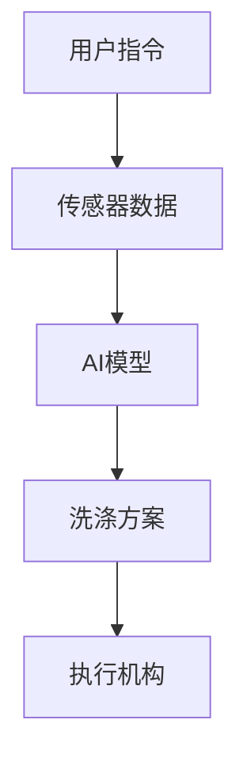
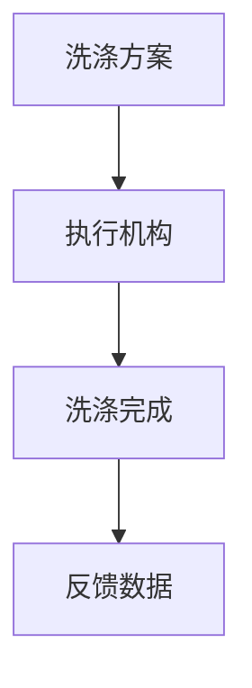
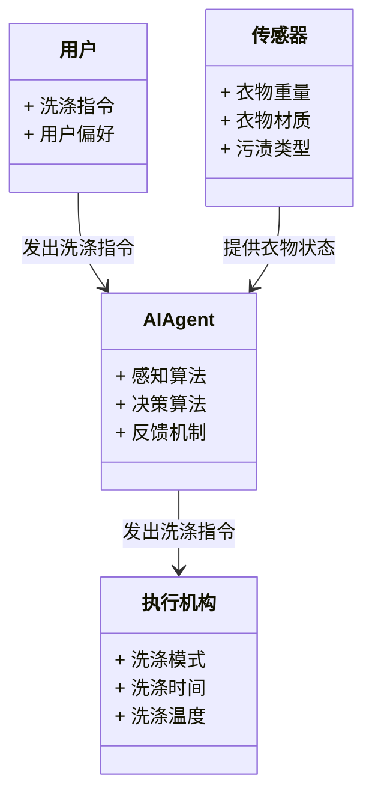
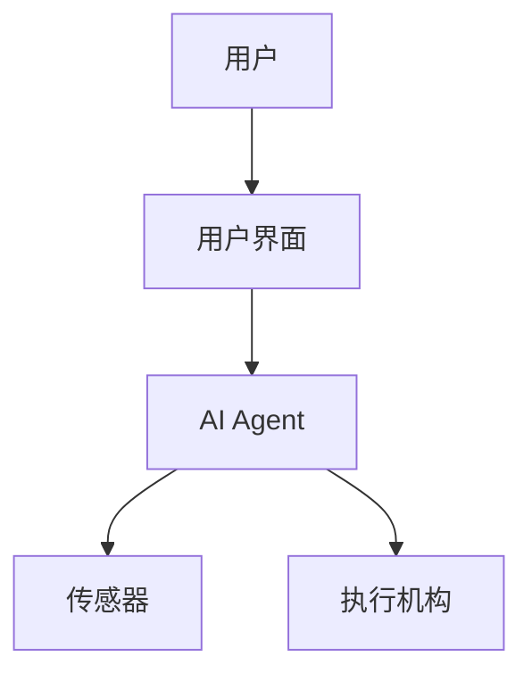
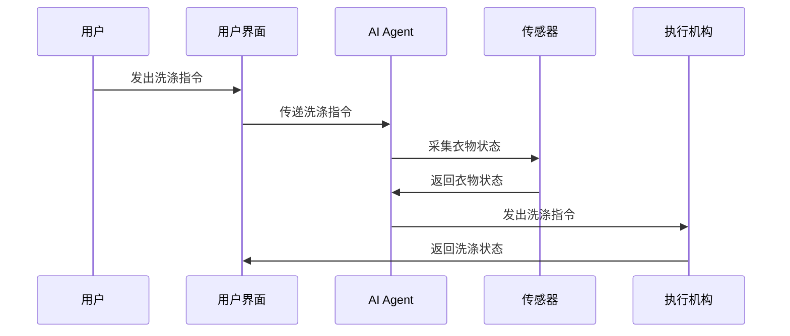

                 


# 智能洗衣机：AI Agent的衣物护理专家系统

## 关键词：智能洗衣机、AI Agent、衣物护理、系统架构、算法原理、项目实战

## 摘要：智能洗衣机通过集成AI Agent技术，实现了衣物护理的智能化与个性化。本文系统地分析了智能洗衣机的发展历程、AI Agent的核心原理、算法实现、系统架构设计、项目实战与最佳实践，为读者提供全面的技术解析。

---

## 第一章: 智能洗衣机的发展与AI Agent的引入

### 1.1 智能洗衣机的发展历程
#### 1.1.1 从传统洗衣机到智能洗衣机的演进
传统洗衣机的功能单一，仅能完成基础的洗涤、漂洗和脱水功能。随着物联网（IoT）和人工智能（AI）技术的发展，智能洗衣机应运而生，能够通过传感器和AI算法实现衣物的智能识别、精准洗涤和个性化护理。

#### 1.1.2 AI Agent在智能洗衣机中的作用
AI Agent（智能代理）是一种能够感知环境、自主决策并执行任务的智能系统。在智能洗衣机中，AI Agent负责接收用户的指令、识别衣物材质和污渍类型、优化洗涤程序，并实时调整洗涤参数，以实现最佳的衣物护理效果。

#### 1.1.3 智能洗衣机的市场现状与未来趋势
当前，智能洗衣机市场增长迅速，主要厂商纷纷推出集成AI技术的产品。未来，智能洗衣机将更加注重用户体验，通过AI Agent实现个性化服务，甚至与智能家居系统无缝集成，提供更智能化的解决方案。

---

### 1.2 智能洗衣机的核心问题与解决方案
#### 1.2.1 衣物护理的核心问题
传统洗衣机无法根据衣物材质和污渍类型自动调整洗涤参数，容易导致衣物损坏或洗涤效果不佳。AI Agent通过感知和学习，能够解决这些问题，实现精准的衣物护理。

#### 1.2.2 AI Agent如何解决衣物护理问题
AI Agent通过传感器获取衣物的状态信息，结合预训练的模型，识别衣物材质和污渍类型，并根据历史数据优化洗涤程序。例如，AI Agent可以根据羊毛衣物的敏感性，自动选择柔和的洗涤模式。

#### 1.2.3 智能洗衣机的边界与外延
智能洗衣机的边界在于其核心功能——洗涤、漂洗和脱水，而外延功能则包括智能识别、远程控制和数据同步。通过AI Agent，智能洗衣机可以与智能家居系统协同工作，进一步拓展其应用场景。

---

### 1.3 智能洗衣机的系统构成与核心要素
#### 1.3.1 系统构成的层次分析
智能洗衣机的系统构成可以分为硬件层、软件层和应用层。硬件层包括传感器和执行机构，软件层包括AI算法和控制模块，应用层则是用户界面和远程控制功能。

#### 1.3.2 核心要素的组成与关系
核心要素包括：
- **传感器**：用于采集衣物的状态信息，如重量、材质和污渍类型。
- **AI算法**：用于分析传感器数据并生成洗涤方案。
- **执行机构**：根据AI算法的决策执行洗涤操作。
- **用户界面**：供用户交互和查看洗涤状态。

这些要素通过数据流相互关联，形成一个闭环系统。

#### 1.3.3 系统的属性与特征对比
通过对比传统洗衣机和智能洗衣机的属性与特征，可以清晰地看到智能洗衣机的优势。例如，传统洗衣机的洗涤模式固定，而智能洗衣机可以根据衣物状态动态调整洗涤参数。

---

## 第二章: AI Agent与衣物护理系统的概念模型

### 2.1 AI Agent的核心概念与原理
#### 2.1.1 AI Agent的定义与特征
AI Agent是一种能够感知环境、自主决策并执行任务的智能系统。其核心特征包括：
- **自主性**：无需人工干预，能够自主完成任务。
- **反应性**：能够实时感知环境并做出反应。
- **学习能力**：通过数据学习优化决策算法。

#### 2.1.2 AI Agent的分类与应用场景
AI Agent可以分为简单反射型、基于模型的反应型和基于目标的反应型。在智能洗衣机中，AI Agent主要应用于衣物识别、洗涤优化和状态监控。

#### 2.1.3 AI Agent与传统控制系统的区别
传统控制系统基于固定的规则和逻辑，而AI Agent能够根据环境数据动态调整决策策略。例如，传统洗衣机使用固定的洗涤程序，而智能洗衣机可以根据衣物状态动态调整洗涤时间、水温等参数。

---

### 2.2 衣物护理系统的实体关系模型
#### 2.2.1 实体关系图（ER图）分析
以下是智能洗衣机AI Agent系统的核心实体关系图：

```mermaid
erdiagram
actor 用户 {
}
actor 系统 {
}
actor 传感器 {
}
actor 执行机构 {
}

用户 --> 系统: 发出洗涤指令
系统 --> 传感器: 采集衣物状态
系统 --> 执行机构: 执行洗涤操作
```

#### 2.2.2 系统核心实体的定义与关系
- **用户**：通过用户界面与系统交互，发出洗涤指令。
- **系统**：AI Agent的核心模块，负责数据处理和决策。
- **传感器**：用于采集衣物的状态信息，如重量、材质和污渍类型。
- **执行机构**：根据AI Agent的决策执行洗涤操作，如调整洗涤时间、水温和转速。

#### 2.2.3 实体关系的动态变化与管理
AI Agent通过传感器获取数据，动态调整系统参数。例如，当传感器检测到衣物材质为羊毛时，AI Agent会自动调整洗涤水温和洗涤时间，以避免衣物损坏。

---

### 2.3 AI Agent与衣物护理系统的协同机制
#### 2.3.1 AI Agent在衣物护理中的角色
AI Agent在智能洗衣机中扮演着“智能管家”的角色，通过感知和学习优化洗涤程序，确保衣物得到最佳护理。

#### 2.3.2 系统协同的实现方式
AI Agent通过传感器和执行机构与用户和环境进行交互。例如，用户发出洗涤指令后，AI Agent会分析传感器数据并生成洗涤方案，然后通过执行机构完成洗涤任务。

#### 2.3.3 协同机制的优化与改进
通过不断学习用户的行为和环境数据，AI Agent可以优化协同机制，提高系统的响应速度和准确性。例如，AI Agent可以根据用户的洗涤习惯自动调整洗涤模式，提高用户体验。

---

## 第三章: AI Agent的算法原理与实现

### 3.1 AI Agent的感知与决策算法
#### 3.1.1 感知算法的实现原理
感知算法通过传感器获取衣物的状态信息，例如：
- **重量传感器**：检测衣物的重量，判断衣物的数量。
- **材质传感器**：通过红外线或触觉传感器识别衣物材质。
- **污渍传感器**：检测衣物上的污渍类型和程度。

#### 3.1.2 决策算法的数学模型
决策算法基于感知数据，通过预训练的模型生成洗涤方案。以下是决策算法的核心逻辑：



决策算法的核心公式：
$$
\text{洗涤模式} = f(\text{衣物材质}, \text{污渍类型}, \text{洗涤历史})
$$

其中，$f$是基于机器学习的函数，用于预测最佳的洗涤模式。

#### 3.1.3 算法实现的代码示例
以下是AI Agent的核心代码示例：

```python
def感知算法(传感器数据):
    # 分析传感器数据，返回衣物状态
    pass

def决策算法(衣物状态, 洗涤历史):
    # 根据衣物状态和历史数据，生成洗涤方案
    return 洗涤方案

# 示例调用
传感器数据 = 传感器读取()
衣物状态 = 感知算法(传感器数据)
洗涤方案 = 决策算法(衣物状态, 洗涤历史)
```

---

### 3.2 AI Agent的执行与反馈机制
#### 3.2.1 执行算法的实现流程
执行算法通过控制执行机构完成洗涤任务。以下是执行流程：



#### 3.2.2 反馈机制的数学模型
反馈机制通过传感器实时监测洗涤过程，并根据反馈数据调整洗涤参数。公式如下：
$$
\text{调整参数} = g(\text{反馈数据}, \text{当前参数})
$$

其中，$g$是反馈函数，用于优化洗涤参数。

#### 3.2.3 执行与反馈的代码实现
以下是执行与反馈的代码示例：

```python
def执行算法(洗涤方案):
    # 控制执行机构执行洗涤任务
    pass

def反馈机制(反馈数据):
    # 根据反馈数据调整洗涤参数
    pass

# 示例调用
执行算法(洗涤方案)
反馈数据 = 监测洗涤过程()
调整参数 = 反馈机制(反馈数据)
```

---

### 3.3 算法的优化与改进
#### 3.3.1 算法优化的目标与方法
优化目标包括提高洗涤效率、降低能耗和延长设备寿命。优化方法包括：
- **参数调整**：通过实验调整AI模型的超参数。
- **模型改进**：引入更先进的机器学习算法，如深度学习和强化学习。

#### 3.3.2 算法改进的数学模型
改进后的数学模型如下：
$$
\text{优化洗涤方案} = h(\text{优化参数}, \text{改进算法})
$$

其中，$h$是优化函数，用于生成更优的洗涤方案。

#### 3.3.3 优化与改进的代码实
以下是优化与改进的代码示例：

```python
def优化算法(原始模型):
    # 优化模型参数
    pass

def改进算法(优化模型):
    # 引入更先进的算法
    pass

# 示例调用
优化模型 = 优化算法(原始模型)
改进模型 = 改进算法(优化模型)
```

---

## 第四章: 系统分析与架构设计方案

### 4.1 问题场景介绍
智能洗衣机的系统设计需要解决以下问题：
- 如何通过AI Agent实现衣物的智能识别和精准洗涤。
- 如何优化洗涤程序，以提高洗涤效率和用户体验。

---

### 4.2 项目介绍
#### 4.2.1 项目目标
通过集成AI Agent技术，开发一款能够实现衣物智能识别和精准洗涤的智能洗衣机。

#### 4.2.2 项目背景
随着智能家居的普及，用户对洗衣机的智能化需求日益增长。传统的洗衣机无法满足个性化护理和高效洗涤的需求。

---

### 4.3 系统功能设计
#### 4.3.1 领域模型
以下是智能洗衣机的领域模型：



#### 4.3.2 系统架构设计
以下是智能洗衣机的系统架构图：



系统架构包括：
- **用户界面**：用户与系统交互的界面。
- **AI Agent**：系统的核心模块，负责数据处理和决策。
- **传感器**：用于采集衣物的状态信息。
- **执行机构**：根据AI Agent的决策执行洗涤操作。

#### 4.3.3 系统接口设计
系统接口包括：
- **用户接口**：提供洗涤指令和用户偏好设置。
- **传感器接口**：接收衣物状态数据。
- **执行机构接口**：控制洗涤过程。

#### 4.3.4 系统交互序列图
以下是系统交互的序列图：



---

## 第五章: 项目实战与代码实现

### 5.1 环境安装与配置
#### 5.1.1 安装Python和相关库
```bash
pip install numpy scikit-learn matplotlib
```

#### 5.1.2 安装洗衣机硬件驱动
安装洗衣机硬件驱动，确保传感器和执行机构能够正常工作。

---

### 5.2 系统核心实现
#### 5.2.1 AI Agent的核心代码
以下是AI Agent的核心代码：

```python
import numpy as np
from sklearn import tree

def感知算法(传感器数据):
    # 分析传感器数据，返回衣物状态
    return 裁判结果

def决策算法(衣物状态, 洗涤历史):
    # 根据衣物状态和历史数据，生成洗涤方案
    clf = tree.DecisionTreeClassifier()
    clf.fit(X, y)
    return clf.predict(新数据)

# 示例调用
传感器数据 = 传感器读取()
衣物状态 = 感知算法(传感器数据)
洗涤方案 = 决策算法(衣物状态, 洗涤历史)
```

#### 5.2.2 传感器数据处理
以下是传感器数据处理的代码：

```python
import numpy as np

def处理传感器数据(传感器数据):
    # 数据预处理和特征提取
    return 处理后的数据

# 示例调用
处理后的数据 = 处理传感器数据(传感器数据)
```

#### 5.2.3 洗涤模式选择算法
以下是洗涤模式选择算法的代码：

```python
import numpy as np

def选择洗涤模式(衣物状态):
    # 根据衣物状态选择洗涤模式
    return 洗涤模式

# 示例调用
洗涤模式 = 选择洗涤模式(衣物状态)
```

---

### 5.3 代码应用与案例分析
#### 5.3.1 代码解读与分析
通过代码解读，我们可以看到AI Agent的核心逻辑，包括感知算法、决策算法和执行算法。

#### 5.3.2 案例分析与详细讲解
以一个具体案例为例，说明AI Agent如何通过传感器数据优化洗涤程序。例如，当传感器检测到衣物材质为羊毛时，AI Agent会自动选择柔和的洗涤模式，避免衣物损坏。

---

### 5.4 项目小结
通过项目实战，我们验证了AI Agent在智能洗衣机中的应用价值。AI Agent能够通过感知和学习优化洗涤程序，提高洗涤效率和用户体验。

---

## 第六章: 最佳实践与总结

### 6.1 最佳实践与注意事项
- **数据采集**：确保传感器数据的准确性和完整性。
- **算法优化**：通过实验不断优化AI模型的性能。
- **用户体验**：注重用户界面的设计，提高用户体验。

### 6.2 小结与总结
智能洗衣机通过集成AI Agent技术，实现了衣物护理的智能化与个性化。AI Agent通过感知、决策和执行三个阶段，优化洗涤程序，提高洗涤效率和用户体验。

---

## 第七章: 拓展阅读与进一步学习

### 7.1 拓展阅读
推荐以下书籍和资源：
- 《人工智能：一种现代的方法》
- 《机器学习实战》
- 《智能系统设计与实现》

### 7.2 进一步学习方向
- **深度学习**：研究深度学习在智能洗衣机中的应用。
- **强化学习**：探索强化学习在智能决策中的应用。
- **边缘计算**：研究边缘计算在智能洗衣机中的应用。

---

## 作者：AI天才研究院/AI Genius Institute & 禅与计算机程序设计艺术 /Zen And The Art of Computer Programming

