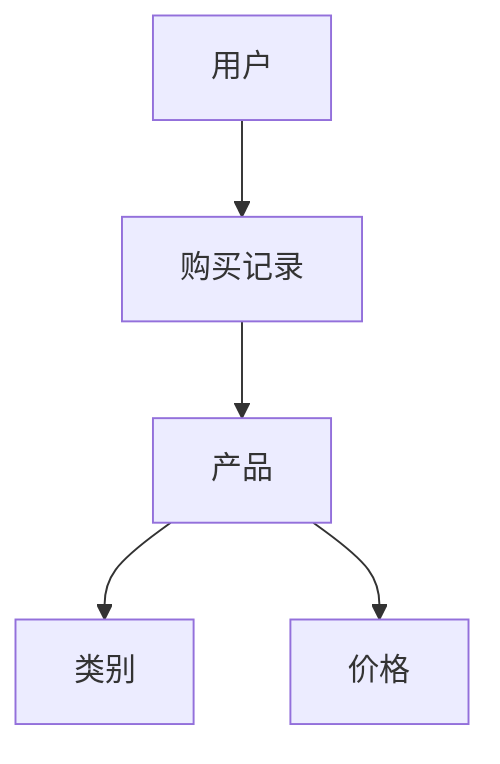
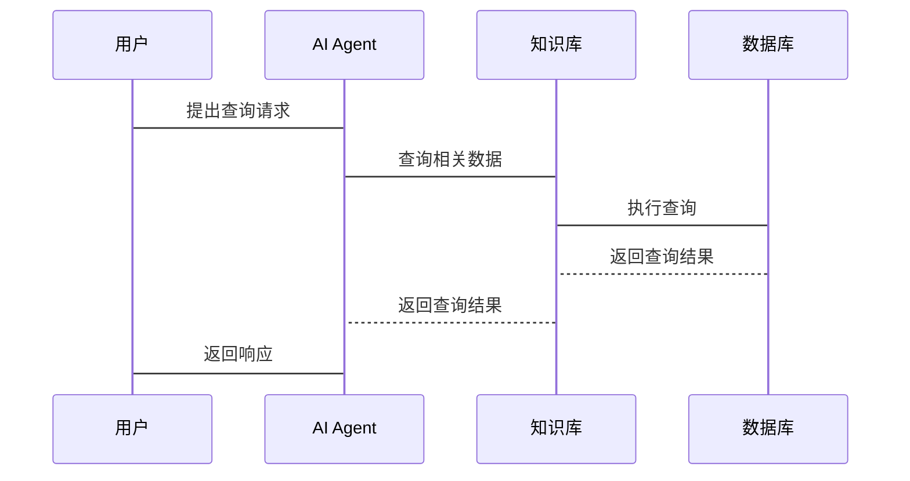
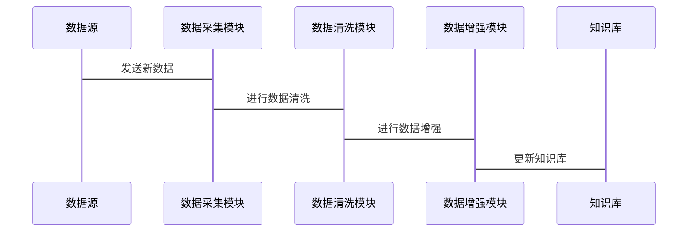

                 


# 构建AI Agent的知识库：数据收集与组织

---

## 关键词：
- AI Agent
- 知识库
- 数据收集
- 数据组织
- 知识表示

---

## 摘要：
本文详细探讨了构建AI Agent的知识库所需的数据收集与组织方法。从AI Agent的基本概念到知识库的结构设计，从数据收集的类型与方法到数据组织的模式，文章深入分析了每一步骤的核心原理与实现细节。通过系统架构设计、项目实战和最佳实践的分享，本文为读者提供了一套完整且实用的构建AI Agent知识库的方法论。

---

# 第1章: AI Agent与知识库概述

## 1.1 AI Agent的基本概念

### 1.1.1 什么是AI Agent
AI Agent（人工智能代理）是指能够感知环境、自主决策并执行任务的智能实体。它通过与用户或环境的交互，利用知识库中的信息完成特定任务，如信息检索、推荐系统或对话生成。

### 1.1.2 AI Agent的核心特点
- **自主性**：AI Agent能够独立决策，无需外部干预。
- **反应性**：能够实时感知环境并做出反应。
- **学习能力**：通过数据和经验不断优化自身知识库。
- **交互性**：与用户或系统进行自然语言或命令交互。

### 1.1.3 知识库在AI Agent中的作用
知识库是AI Agent的核心，存储了用于决策和交互的所有必要信息。它是AI Agent理解用户需求、生成响应的基础。

---

## 1.2 知识库的重要性

### 1.2.1 知识库的定义与分类
- **定义**：知识库是结构化的数据集合，包含领域内的实体、属性、关系和事实。
- **分类**：
  1. **结构化知识库**：如关系型数据库，存储事实性数据。
  2. **半结构化知识库**：如JSON格式的数据，支持灵活的存储和查询。
  3. **非结构化知识库**：如文本库，存储自由文本。

### 1.2.2 知识库在AI Agent中的应用场景
- **对话生成**：基于知识库生成自然语言响应。
- **信息检索**：快速查找所需信息并返回给用户。
- **推荐系统**：根据用户行为和知识库中的关联性进行推荐。

### 1.2.3 数据收集与知识库构建的挑战
- **数据来源多样化**：需要整合结构化、半结构化和非结构化数据。
- **数据质量控制**：确保数据的准确性、一致性和完整性。
- **数据规模与性能**：大规模数据存储和快速查询的平衡。

---

## 1.3 数据收集与组织的背景

### 1.3.1 数据收集的必要性
AI Agent需要通过数据收集不断丰富知识库，以提高其理解和决策能力。数据来源包括用户输入、网络爬取、传感器数据等。

### 1.3.2 数据组织的目标与意义
- **目标**：将收集到的数据转化为结构化、可查询的形式，方便AI Agent快速检索和使用。
- **意义**：数据组织直接影响AI Agent的性能和用户体验。

### 1.3.3 知识库构建的边界与外延
- **边界**：明确知识库的范围，避免收集无关数据。
- **外延**：扩展知识库的覆盖领域，如引入外部API或知识图谱。

---

## 1.4 本章小结
本章介绍了AI Agent的基本概念和知识库的重要性，强调了数据收集与组织在构建知识库中的关键作用。接下来，我们将深入探讨知识库的结构设计和数据收集的实现方法。

---

# 第2章: 知识库的结构与数据模型

## 2.1 知识库的结构设计

### 2.1.1 知识库的基本组成要素
- **实体**：知识库中的核心概念，如“用户”、“产品”。
- **属性**：描述实体的特征，如“年龄”、“价格”。
- **关系**：实体之间的关联，如“用户购买产品”。

### 2.1.2 知识表示的多种方式
- **层次化表示**：如树状结构，用于分类管理。
- **网络化表示**：如知识图谱，用于描述实体之间的复杂关系。
- **语义化表示**：如概念网络，注重语义关联。

### 2.1.3 知识关联的网络结构
知识图谱是一种典型的网络化表示方式，通过实体和关系构建语义网络。例如：



---

## 2.2 数据收集的类型与方法

### 2.2.1 结构化数据的收集
- **来源**：数据库、API接口。
- **方法**：通过SQL查询或API调用获取结构化数据。

### 2.2.2 半结构化数据的处理
- **来源**：JSON、XML格式的数据。
- **方法**：解析半结构化数据，提取关键字段。

### 2.2.3 非结构化数据的采集
- **来源**：文本文件、网页内容。
- **方法**：使用NLP技术进行文本解析和信息抽取。

---

## 2.3 数据组织的模式

### 2.3.1 层次化组织
- **特点**：树状结构，适合分类管理。
- **示例**：
  ```mermaid
  tree
      root
      ├── 类别1
      │   └── 子类别1
      └── 类别2
          └── 子类别2
  ```

### 2.3.2 语义化组织
- **特点**：基于语义关系构建网络。
- **示例**：
  ```mermaid
  graph TD
      A[用户] --> B[喜欢]
      B --> C[电影]
  ```

### 2.3.3 混合式组织
- **特点**：结合层次化和语义化组织方式。
- **示例**：
  ```mermaid
  graph TD
      A[电影类别] --> B[科幻]
      B --> C[用户1]
      C --> D[喜欢]
  ```

---

## 2.4 本章小结
本章详细探讨了知识库的结构设计和数据收集的实现方法，为后续的数据组织和算法实现奠定了基础。

---

# 第3章: 数据收集的实现与优化

## 3.1 数据预处理算法

### 3.1.1 数据清洗
- **目标**：去除噪声数据，确保数据的准确性和一致性。
- **步骤**：
  1. 去除重复数据。
  2. 处理缺失值。
  3. 标准化格式。

### 3.1.2 数据增强
- **目标**：增加数据多样性，提高模型鲁棒性。
- **方法**：如数据扩展、数据标注。

### 3.1.3 数据转换
- **目标**：将数据转换为适合模型输入的形式。
- **方法**：如特征提取、维度降维。

---

## 3.2 数据预处理的实现

### 3.2.1 数据清洗的Python实现
```python
import pandas as pd

# 读取数据
df = pd.read_csv('data.csv')

# 删除重复数据
df = df.drop_duplicates()

# 处理缺失值
df['age'].fillna(df['age'].mean(), inplace=True)

# 格式标准化
df['country'] = df['country'].str.upper()
```

### 3.2.2 数据增强的实现
```python
from tensorflow.keras.preprocessing.image import ImageDataGenerator

# 创建数据生成器
datagen = ImageDataGenerator(rotation_range=20, width_shift_range=0.1, height_shift_range=0.1)

# 应用数据增强
for batch in datagen.flow(x_train, y_train, batch_size=10, epochs=10):
    # 处理增强后的数据
    pass
```

### 3.2.3 数据转换的实现
```python
from sklearn.preprocessing import StandardScaler

# 标准化数据
scaler = StandardScaler()
X_normalized = scaler.fit_transform(X)
```

---

## 3.3 数据预处理的数学模型

### 3.3.1 特征提取
- **向量空间模型**：
  - 将文本转换为向量表示，如TF-IDF或Word2Vec。
  - 示例公式：
    $$ TF-IDF_{i,j} = \frac{tf_{i,j}}{\log(1 + df_j)} $$
  
### 3.3.2 数据降维
- **主成分分析（PCA）**：
  - 通过线性变换将数据降维。
  - 示例公式：
    $$ Y = X \cdot P $$
    其中，\( P \) 是主成分矩阵。

---

## 3.4 数据预处理的优化策略

### 3.4.1 并行处理
- 使用多线程或分布式计算加速数据处理。
- 工具：Dask、Spark。

### 3.4.2 分布式存储
- 将数据分片存储在分布式系统中，如Hadoop、Kafka。
- 示例：使用Hadoop进行大规模数据清洗。

### 3.4.3 模块化设计
- 将数据处理流程模块化，便于维护和扩展。
- 示例：数据清洗、特征提取、数据增强分别作为独立模块。

---

## 3.5 本章小结
本章详细介绍了数据预处理的算法实现与优化策略，为后续的知识库存储和查询奠定了基础。

---

# 第4章: 系统分析与架构设计

## 4.1 问题场景介绍

### 4.1.1 项目目标
- 构建一个高效的AI Agent知识库，支持快速数据收集与组织。

### 4.1.2 项目范围
- 数据来源：用户输入、网络爬取。
- 数据类型：结构化、半结构化、非结构化数据。

---

## 4.2 系统功能设计

### 4.2.1 领域模型设计
- **实体关系图**：
  ```mermaid
  classDiagram
      class 用户 {
          id: int
          name: str
          age: int
      }
      class 订单 {
          id: int
          user_id: int
          product_id: int
          time: datetime
      }
      用户 --> 订单
      订单 --> 产品
  ```

### 4.2.2 系统功能模块
- **数据采集模块**：负责数据的收集和预处理。
- **知识库存储模块**：负责数据的存储和管理。
- **数据查询模块**：负责快速检索知识库中的信息。

---

## 4.3 系统架构设计

### 4.3.1 分层架构
- **数据采集层**：负责数据的获取和初步处理。
- **知识库管理层**：负责数据的组织、存储和管理。
- **应用层**：负责与用户交互，调用知识库进行决策。

### 4.3.2 微服务架构
- **数据采集服务**：处理数据的收集和预处理。
- **知识库服务**：提供数据的存储和查询接口。
- **API网关**：统一处理外部请求，分发到相应服务。

---

## 4.4 系统接口设计

### 4.4.1 数据采集接口
- **输入**：请求参数，如API密钥、查询条件。
- **输出**：结构化数据或错误信息。

### 4.4.2 数据查询接口
- **输入**：查询关键词或条件。
- **输出**：相关结果或错误信息。

---

## 4.5 系统交互设计

### 4.5.1 用户与AI Agent的交互流程


### 4.5.2 数据更新流程


---

## 4.6 本章小结
本章通过系统架构设计和接口设计，明确了构建AI Agent知识库的实现路径。接下来，我们将通过项目实战进一步验证这些设计。

---

# 第5章: 项目实战——构建AI Agent知识库

## 5.1 环境安装

### 5.1.1 安装必要的库
```bash
pip install pandas numpy requests beautifulsoup4
```

### 5.1.2 安装分布式计算工具（可选）
```bash
pip install dask distributed
```

---

## 5.2 核心代码实现

### 5.2.1 数据采集模块
```python
import requests
from bs4 import BeautifulSoup

def scrape_data(url):
    response = requests.get(url)
    soup = BeautifulSoup(response.text, 'html.parser')
    data = []
    for item in soup.find_all('div', class_='item'):
        title = item.find('h2').text
        price = item.find('p', class_='price').text
        data.append({'title': title, 'price': price})
    return data

# 示例调用
data = scrape_data('https://example.com/products')
print(data)
```

### 5.2.2 数据清洗模块
```python
import pandas as pd

def clean_data(data_frame):
    # 删除缺失值
    data_frame = data_frame.dropna()
    # 处理重复数据
    data_frame = data_frame.drop_duplicates()
    return data_frame

# 示例调用
df = pd.DataFrame({'title': ['a', 'b', 'a', 'c'], 'price': [10, 20, 10, 30})
clean_df = clean_data(df)
print(clean_df)
```

### 5.2.3 数据存储模块
```python
from sqlalchemy import create_engine

# 连接数据库
engine = create_engine('sqlite:///knowledge.db')

# 插入数据
data = [{'title': 'Product 1', 'price': 100}, {'title': 'Product 2', 'price': 200}]
df = pd.DataFrame(data)
df.to_sql('products', engine, if_exists='append')
```

---

## 5.3 项目小结

### 5.3.1 环境安装
- 安装必要的Python库，如requests、pandas等。
- 根据需要安装分布式计算工具，如Dask。

### 5.3.2 核心代码实现
- 数据采集模块：实现数据的网络爬取和API调用。
- 数据清洗模块：处理缺失值、重复值等。
- 数据存储模块：将清洗后的数据存储到数据库中。

---

## 5.4 项目总结

### 5.4.1 成果展示
- 成功构建了一个简单的AI Agent知识库。
- 实现了数据采集、清洗和存储的完整流程。

### 5.4.2 经验总结
- 数据清洗是关键步骤，直接影响数据质量。
- 数据存储选择合适的数据库类型，如关系型数据库或NoSQL数据库。

---

## 5.5 本章小结
本章通过一个实际项目，详细讲解了构建AI Agent知识库的实现过程，包括环境安装、核心代码实现和项目总结。

---

# 第6章: 最佳实践与小结

## 6.1 最佳实践

### 6.1.1 数据收集
- 使用多种数据来源，提高数据的多样性和丰富性。
- 注意数据隐私和合规性，遵守相关法律法规。

### 6.1.2 数据组织
- 根据实际需求选择合适的数据组织模式。
- 定期更新知识库，保持数据的时效性。

### 6.1.3 系统设计
- 采用模块化设计，便于维护和扩展。
- 使用分布式架构，提高系统的可扩展性和可用性。

---

## 6.2 项目小结

### 6.2.1 核心内容回顾
- 数据收集与组织是构建AI Agent知识库的关键步骤。
- 通过系统架构设计和项目实战，掌握了数据预处理、知识库存储和系统交互的核心技术。

### 6.2.2 注意事项
- 数据质量和数据安全是构建知识库的重要考量。
- 系统设计要充分考虑可扩展性和可维护性。

---

## 6.3 拓展阅读

### 6.3.1 推荐书籍
- 《Data Engineering with Python》
- 《Knowledge Graphs: Theory, Concepts, and Applications》

### 6.3.2 推荐博客与资源
- [Medium上的数据工程博客](https://medium.com/data-engineering)
- [Towards Data Science上的AI与知识库文章](https://towardsdatascience.com/knowledge-graphs)

---

## 作者信息

作者：AI天才研究院/AI Genius Institute & 禅与计算机程序设计艺术 /Zen And The Art of Computer Programming

---

# 结语

通过本文的详细讲解，读者可以系统地掌握构建AI Agent知识库的数据收集与组织方法。从理论到实践，从概念到代码，本文为读者提供了一套完整且实用的构建方法论。希望本文能为AI Agent的开发和研究提供有价值的参考和指导。

